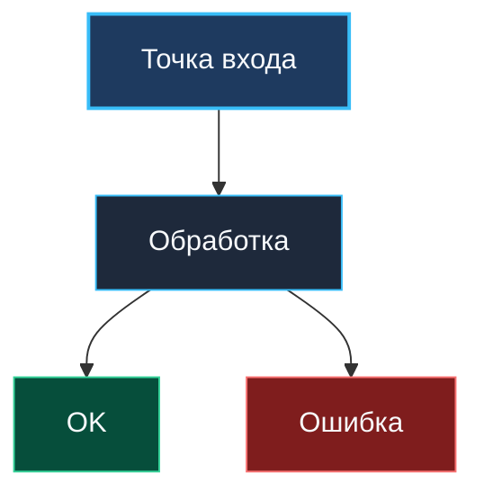

# 🧭 AGENTS.md: Инженерная веб-энциклопедия бэкенда (Go & Computer Science)

> *«Единственный способ создавать хорошее программное обеспечение — писать его просто, ясно и аккуратно».*  
> — Брайан Керниган

Добро пожаловать в центр управления проектом создания фундаментальной инженерной веб-энциклопедии бэкенда, распределенных систем и языка Go.  
Этот документ служит единым источником правды (Single Source of Truth), архитектурным манифестом и трекером прогресса для автономных агентов и инженеров.

---

## 🛑 0. Железное правило управления и границ задач (Command & Scope Discipline)

> [!IMPORTANT]
> **Фундаментальный закон работы агента:**
> 1. **Старт только по прямой отмашке пользователя:**  
>    Агенту категорически запрещено самостоятельно начинать редактирование, переходить к следующим темам, лекциям, подразделам или модулям без прямой и недвусмысленной команды пользователя. Пока пользователь явно не сказал делать дальше — **не делать абсолютно ничего!**
> 2. **Строго в рамках заданного диапазона (Strict Scope — не больше и не меньше):**  
>    Если пользователем указана конкретная граница (например, «сделай до лекции N», «выполни подраздел K»), агент обязан работать **ровно до этой отметки — не больше и не меньше**. Категорически запрещено «увлекаться» и выходить за пределы заданного скоупа.
> 3. **Немедленная остановка и доклад:**  
>    Достигнув указанной границы, агент обязан немедленно остановиться, провести верификацию, зафиксировать изменения и ждать дальнейших указаний пользователя.

---

## 🎯 1. Архитектурный манифест и стандарты

1. **Автономность и переносимость (Offline First):**
   - Веб-учебник генерируется как полностью статический сайт (SSG на Python).
   - Портал обязан безупречно открываться локально через протокол `file:///` и на любом статическом хостинге (GitHub Pages, S3, Nginx).
   - Все ссылки, стили и скрипты используют относительные пути (`./`, `../`).

2. **Эстетика и UI/UX (наследие Go Workout):**
   - **Глубокая тёмная палитра:** фон `#0b0f19` / `#0f172a`, карточки контента `#131d33`, акцентные границы `#1e293b` и `#334155`.
   - **Акценты:** Indigo (`#6366f1`), Cyan/Sky (`#38bdf8`), Emerald (`#10b981`), Amber (`#f59e0b`), Rose (`#f43f5e`).
   - **Типографика:** Google Fonts (Roboto) для комфортного чтения больших лонгридов, Cascadia Code / JetBrains Mono для исходного кода.
   - **Код и подсветка:** Prism.js Tomorrow Night (Go, C, ASM, SQL, Bash, Python, YAML, JSON) с кнопкой копирования в буфер в 1 клик.
   - **Интерактивные Callouts:** `[!NOTE]`, `[!TIP]`, `[!IMPORTANT]`, `[!WARNING]`, `[!CAUTION]` и кастомный `[!INTERVIEW]`.
   - **Двухпанельный лейаут:** Регулируемый сайдбар (drag-to-resize) с запоминанием ширины в `localStorage`, древовидный аккордеон, активная подсветка, хлебные крошки и пагинация «← Назад / Вперед →».
   - **Мгновенный живой поиск:** Клиентский полнотекстовый фильтр по заголовкам, ключевым словам и темам.

3. **Диаграммы и наглядность (Mermaid.js):**
   - 100% синтаксическая валидация всех Mermaid-схем: экранирование спецсимволов, оборачивание узлов в кавычки `node["Текст (с пояснением)"]`.
   - Поддержка темы `dark`, встроенная кнопка «Развернуть на весь экран» / зумирование для сложных архитектурных схем.

4. **Кроссплатформенность файловой системы (Windows, macOS, Linux):**
   - **Строжайший запрет на спецсимволы Windows/NTFS:** В именах файлов и директорий категорически запрещены символы: `:`, `*`, `?`, `"`, `<`, `>`, `|`, `\`, а также непечатаемые управляющие символы ASCII (0x00–0x1F). *Особое внимание:* в Linux часто по ошибке называют файлы с двоеточием (например, `1:1.md`) — в этом репозитории это строжайше запрещено, так как ломает `git checkout` на Windows.
   - **Запрет завершающих точек и пробелов:** Никакой файл или каталог не может оканчиваться точкой `.` или пробелом ` ` (Windows API принудительно усекает их или завершается ошибкой создания пути).
   - **Запрет зарезервированных имен DOS/Windows:** Запрещено использовать зарезервированные имена устройств (в любом регистре и с любым расширением): `CON`, `PRN`, `AUX`, `NUL`, `COM1`–`COM9`, `LPT1`–`LPT9`.
   - **Регистронезависимая уникальность (Case-Insensitive Uniqueness):** В одном каталоге недопустимо существование элементов, различающихся только регистром символов (например, `readme.md` и `README.md`), что приводит к конфликту рабочих копий на Windows NTFS и macOS APFS.
   - **Обязательный аудит в QA:** Скрипт `builder/audit_all.py` автоматически сканирует весь репозиторий и валидирует 100% имен файлов и папок на совместимость со всеми ОС.

5. **Каноническая типографика терминов и акронимов (CI/CD, TCP/IP, Go-пакеты):**
   - **Запрет суррогатов в тексте и заголовках:** В тексте статей, заголовках разделов, боковой панели навигации и HTML-страницах строго используется каноническое написание терминов со слэшами и точками: `CI/CD`, `TCP/IP`, `I/O`, `net/http`, `io/ioutil`, `io/fs`, `sync/atomic`, `sync.Pool`, `sync.Map`, `database/sql` и др. Использование суррогатов с подчёркиваниями (`CI_CD`, `TCP_IP`, `net_http`), оставшихся от старых ограничений Obsidian, в тексте и заголовках запрещено.
   - **Разделение файловой системы и представления:** В именах файлов и каталогов на диске (где `/` запрещен ОС) допустимы безопасные имена (например, `26. CI_CD. Общие принципы.md`), но движок генератора (`builder/scanner.py`) автоматически канонизирует заголовки статей и модулей для отображения в UI, хлебных крошках и поиске.
   - **Двусторонняя связность внутренних ссылок:** Индекс wikilinks (`builder/scanner.py`) прозрачно поддерживает адресацию как по физическому имени файла на диске (`[[26. CI_CD. Общие принципы]]`), так и по каноническому заголовку (`[[26. CI/CD. Общие принципы]]`), автоматически отображая в HTML красивый человекочитаемый текст.

6. **Языковой стандарт: Цитаты и эпиграфы — строго на русском языке:**
   - **Исключительно русский язык:** Вся энциклопедия создается на русском языке для русскоязычных инженеров.
   - **Обязательный перевод всех цитат:** Любые вводные цитаты, эпиграфы и афоризмы известных деятелей и классиков Computer Science (Брайан Керниган, Деннис Ритчи, Кен Томпсон, Дональд Кнут, Эдсгер Дейкстра, Чарльз Хоар, Лесли Лэмпорт, Роб Пайк и др.) **и впредь обязаны быть строго на русском языке**. Оставлять англоязычные оригиналы цитат в тексте лекций запрещено.
   - **Канонический синтаксис эпиграфа:**
     ```markdown
     > *«Текст цитаты на русском языке».*  
     > — Имя Фамилия
     ```
     *(Обязательны два завершающих пробела в строке цитаты для корректного переноса строки автора в Markdown).*

---

## 🖋️ 2. Манифест и методология авторской редактуры (Кернигановский стандарт)

> *«Управление сложностью — вот суть программирования».*  
> — Брайан Керниган

Цель нашего проекта — не механический экспорт заметок Obsidian, а создание **золотого фонда инженерной литературы по бэкенду и языку Go**, стоящего на одной полке с классическими трудами Bell Labs, книгами У. Ричарда Стивенса и Мартина Клеппмана.

### 2.1. Фирменный стиль и голос Брайана Кернигана
1. **Дружеский и эмпатичный тон:**  
   Повествование ведется от лица опытного, мудрого, но бесконечно скромного и доброжелательного коллеги. Никакого надувания щек, менторства, канцеляризмов и академического снобизма. Читатель — наш полноправный соавтор и коллега по цеху.
2. **Принцип «Сложное через простое»:**  
   Любая сложная концепция (барьеры памяти Acquire/Release, когерентность кэшей MESI, тройная раскраска в GC, селектор epoll, алгоритм Raft) обязана иметь **наглядную физическую или бытовую модель**.  
   *Пример:* Наносекунды процессора трудно вообразить, но если 1 такт CPU приравнять к 1 секунде, то L1-кэш — это 3 секунды (блокнот на столе), оперативная память — 5 минут (поход в кофейню), а сетевой пинг — 15 лет (вырастить ребенка). Сложное мгновенно становится осязаемым.
3. **Легкая ирония и инженерный юмор:**  
   Уместная добрая ирония над типичными человеческими ошибками программистов: забытыми мьютексами, надеждой на «авось» в конкурентном коде, раздутыми микросервисами и «магией», которой на самом деле не существует.
4. **Mechanical Sympathy (Механическое сочувствие к машине):**  
   Каждое решение рассматривается с точки зрения железа: сколько тактов потратит процессор, куда попадет байт — на стек или в кучу, вызовет ли это сброс конвейера или Cache Miss, как отреагирует ядро Linux и планировщик.

### 2.2. Визуализация: Схемы, иллюстрации и инженерные мемы
1. **Диаграммы Mermaid на каждом шагу:**  
   Текст не должен превращаться в сплошную стену букв. Если есть алгоритм, протокол взаимодействия или переход состояний — он оформляется в виде четкой векторной схемы Mermaid.
2. **Текстовые и архитектурные схемы памяти:**  
   Наглядные ASCII/Unicode схемы раскладки структур в памяти (Struct Alignment, Padding, Cache Line 64B, Virtual Memory Pages).
3. **Инженерные мемы и иллюстрации:**  
   Разрешается и приветствуется использование остроумных, добрых инженерных иллюстраций и мемов (XKCD-style, программистский фольклор), которые снимают напряжение и намертво впечатывают техническую суть в память читателя.

### 2.3. Свежесть, актуализация и бескомпромиссный фактчекинг
База знаний актуализируется под реалии современных высоконагруженных систем:
- **Современный Go (1.22, 1.23, 1.24+):**
  - Переход на register-based ABIInternal (передача аргументов через регистры CPU).
  - PGO (Profile-Guided Optimization) для выравнивания машинного кода под L1i кэш.
  - Range over function types (пользовательские итераторы в Go 1.22+).
  - Пакеты `math/rand/v2`, `synctest` для мгновенного тестирования конкурентного кода без `time.Sleep`.
  - Swiss tables для хэш-таблиц (новый дизайн рантайма map).
  - Новейшие оптимизации GC Pacer и мягкий лимит памяти `GOMEMLIMIT`.
- **Современный Linux и сети:**
  - cgroups v2, eBPF, epoll и io_uring, TLS 1.3, HTTP/3 (QUIC), TCP BBR v2/v3.
- **Современные процессоры:**
  - x86-64-v3/v4, ARM64 (Neoverse, Apple Silicon), чиплетная компоновка (AMD Zen CCD/CCX), NUMA и энергоэффективные ядра.

### 2.4. Языковой стандарт: Цитаты и эпиграфы — строго на русском языке
Вся энциклопедия создается на русском языке для русскоязычных инженеров. Все цитаты классиков (Кернигана, Ритчи, Томпсона, Кнута, Дейкстры, Хоара, Лэмпорта и др.) в эпиграфах лекций, врезках и на титульной странице обязаны быть переведены на живой, литературный русский язык в Кернигановском стиле. Англоязычные оригиналы в качестве цитат запрещены — мы создаем русскоязычное фундаментальное руководство.

### 2.5. Обязательные стандарты цветового оформления диаграмм Mermaid

> [!IMPORTANT]
> **Диаграмма без цветов — наполовину объяснение.** Цвет — это не украшение, а дополнительный смысловой канал передачи информации читателю.

#### 2.5.1. Закон обязательного использования цветов (No Colorless Diagrams)

Каждая диаграмма `flowchart`, `graph` и `stateDiagram` **обязана** иметь цветовую дифференциацию узлов через `style` или `classDef`. Диаграммы без единого цветового акцента считаются **неполноценными** и подлежат исправлению.

**Цель:** цвет помогает читателю мгновенно считывать семантику схемы — где точка входа, где ошибка, где ключевой компонент, где поток данных.

#### 2.5.2. Каноническая семантическая палитра (обязательна к соблюдению)

Используется тёмная палитра, гармоничная с тёмной темой энциклопедии. **Все** `style` и `classDef` директивы обязаны содержать `color:#f8fafc` (белый текст):

| Семантика | Fill | Stroke | Применение |
|---|---|---|---|
| 🔵 **Нейтральный / Процесс** | `#1e293b` | `#38bdf8` | Основной поток, шаги алгоритма |
| 🟣 **Ключевой / Акцент** | `#1e1b4b` | `#818cf8` | Важный компонент, центральный узел |
| 🟢 **Успех / OK / Вывод** | `#064e3b` | `#34d399` | Успешный результат, выход, OK-ветка |
| 🔴 **Ошибка / Опасность** | `#7f1d1d` | `#f87171` | Ошибки, паника, исключения, fail-ветка |
| 🟡 **Предупреждение / Решение** | `#78350f` | `#fbbf24` | Условия, решения, предупреждения |
| 🔷 **Старт / Вход** | `#1e3a5f` | `#38bdf8` | Точка входа, начало потока |
| 🩶 **Вспомогательный / Серый** | `#334155` | `#64748b` | Контекст, окружение, внешние системы |
| 🟤 **Системный / ОС / Ядро** | `#312e81` | `#a78bfa` | Системные вызовы, ядро, runtime |
| 🌊 **Данные / Хранилище** | `#132d29` | `#2dd4bf` | БД, кэш, хранилища данных |
| 🌸 **Сеть / API / Клиент** | `#881337` | `#fb7185` | HTTP, RPC, клиентский слой |

#### 2.5.3. Обязательные правила контраста и читаемости

1. **Белый текст на всех тёмных фонах:** Каждый `style`/`classDef` с тёмным fill обязан содержать `color:#f8fafc`. Без этого — светлый текст Mermaid-темы может не сработать.
2. **Запрет светлых fill-цветов на тёмной теме:** Запрещены любые fill-цвета светлее `#6b7280` (серый 500) без явного `color:#111827` (тёмный текст). Светлые фоны (#ff6b6b, #4ecdc4, #ffd93d, #c8e6c9 и т.д.) **заменяются** тёмными аналогами из палитры выше.
3. **Stroke обязателен:** Каждый кастомный узел должен иметь stroke из семантической палитры (не `#333`, не дефолтный). Stroke визуально усиливает группировку.
4. **Stroke-width:** Для ключевых узлов (старт, вывод, критический путь) используется `stroke-width:2px`, для остальных — `stroke-width:1px`.
5. **Семантика строго соблюдается:** Красный = ошибка/опасность, зелёный = успех/OK, жёлтый = условие/решение. Нельзя использовать красный для нейтральных узлов или зелёный для ошибок.

#### 2.5.4. Предпочтительный стиль: `classDef` вместо `style`

Для диаграмм с несколькими узлами одного типа **предпочтителен** `classDef` + `:::className`:



---

## 🛡️ 3. Политика нулевой потери знаний (Zero Knowledge Loss Policy)

При авторском переписывании **категорически запрещено** терять техническую фактуру!  
Переписывание должно *увеличивать глубину и ясность*, а не сокращать материал.

### 3.1. Что обязано сохраняться на 100%:
1. **Все технические термины и идентификаторы:**  
   Имена регистров (`RAX`, `RSP`), системных вызовов (`fork`, `execve`, `epoll_create`), структур данных рантайма (`m0`, `g0`, `sudog`, `hchan`), битовых флагов и инструкций ассемблера.
2. **Все вопросы для собеседований (`[!tip]` / `[!interview]`):**  
   Каждый каверзный вопрос и ответ на него должны быть сохранены, углублены и снабжены практическими советами.
3. **Все подводные камни (`[!warning]` / Gotchas):**  
   Утечки памяти, deadlock'и, race conditions, false sharing, промахи мимо кэша.
4. **Все перекрестные ссылки (Wikilinks `[[...]]`):**  
   Связность графа понятий не должна страдать.
5. **Все эпиграфы и исторические цитаты:**  
   Сохраняются в обязательном порядке, но приводятся **строго в литературном переводе на русский язык**.

### 3.2. Автоматический валидатор ДО и ПОСЛЕ (`builder/verify_editorial.py`)
Перед принятием отредактированной статьи агент обязан прогнать скрипт валидации:

```bash
python3 builder/verify_editorial.py "sources/path/to/article.md" --git-ref HEAD~1
```

Скрипт проверяет:
- ✅ **Сохранение терминов и кода (Terms Ratio):** не менее 95–100%.
- ✅ **Покрытие разделов и тем (Headings):** 0 утерянных тем.
- ✅ **Блоки Callouts (Interview / Gotcha):** количество и тематика сохранены.
- ✅ **Диаграммы Mermaid:** все схемы сохранены или обогащены.
- ✅ **Объем полезного текста:** статья не должна быть урезана по объему.

Только при получении вердикта `✅ ПРОЙДЕНО (БЕЗ ПОТЕРЬ)` статья считается успешно отредактированной.

---

## 🔄 4. Регламент работы агента при вычитке статьи (Step-by-Step)

0. **Авторизация и границы задачи:** Агент приступает к работе **исключительно** по прямой отмашке пользователя и работает **строго в границах указанного диапазона (не больше и не меньше)**. По достижении целевой лекции/раздела агент немедленно останавливается.
1. **Анализ исходника:** Агент читает текущую статью, извлекает ключевые концепции.
2. **Фактчекинг:** Поиск актуальной информации (Go 1.22+, изменения в Linux/архитектурах), устранение устаревших сведений.
3. **Авторское переписывание:**
   - Оформление эпиграфа: цитата обязана быть на русском языке в каноническом формате (`> *«...».*  \n> — Автор`).
   - Написание живого, кернигановского введения.
   - Разложение сложных абстракций на простые физические модели и аналогии.
   - Обогащение выносок «Под капотом» и «Собеседование».
   - Добавление/улучшение схем Mermaid и иллюстраций.
4. **Сквозная валидация:** Запуск `builder/verify_editorial.py`.
5. **Компиляция и визуальный тест:** Пересборка модуля через `build_all.py --module N`.
6. **Фиксация:** Атомарный коммит в Git `feat(module-XX): editorial rewrite of Article N in Kernighan style`.
7. **Контроль границы:** Если достигнут край диапазона, указанного пользователем — немедленный стоп, пересборка энциклопедии, отчет и ожидание новых указаний.

---

## 📊 5. Сводные метрики базы знаний

| Метрика | Значение | Примечание |
|---|:---:|---|
| **Всего тематических модулей** | **22** | Охват от кремния до System Design и собеседований |
| **Всего инженерных статей (.md)** | **1413** | 0 пустых файлов, 100% статей наполнены контентом |
| **Всего диаграмм Mermaid** | **1425** | Встречаются в 1 246 статьях (в среднем >1 схемы на статью) |
| **Внутренних ссылок (Wikilinks)** | **6 537** | Полносвязный граф понятий (Obsidian-style) |
| **Блоков-выносок (Callouts)** | **4 126** | `[!tip]`: 1397, `[!warning]`: 1389, `[!info]`: 1315, `[!note]`: 24 |
| **Общий объем markdown-текста** | **25.81 МБ** | Эквивалент 12-томного фундаментального академического издания |

---

## 🛠 6. Архитектура генератора и инструментов (`builder/`)

```
builder/
├── scanner.py          # Сканирование ./sources, нормализация метаданных, построение графа wikilinks
├── converter.py        # Markdown AST парсер: заголовки, списки, callouts, wikilinks -> slug.html, Mermaid валидатор
├── template.py         # HTML5 каркас, CSS Grid/Flexbox стили, JS (поиск, resize сайдбара, Prism, Mermaid, zoom)
├── build_all.py        # Главный пайплайн сборки: генерация index.html, дашборда и всех HTML страниц
├── batch_runner.py     # Пакетная компиляция с атомарными коммитами по каждому модулю
├── verify_editorial.py # Валидатор ДО и ПОСЛЕ: контроль нулевой потери терминов, тем и ловушек
└── audit_all.py        # Сквозной QA аудит: кроссплатформенность имен (Windows/macOS/Linux), 0 broken links, HTML и Mermaid
```

---

## 🗺 7. Дорожная карта выполнения проекта (Roadmap)

- [x] **Шаг 1: Инвентаризация `./sources`**
  - [x] Детальный аудит 1 413 статей, 1 425 диаграмм Mermaid, связности графа wikilinks.
  - [x] Формирование структуры каталога и создание `AGENTS.md`.
- [x] **Шаг 2: Проектирование ядра генератора (`builder/`)**
  - [x] Разработка модулей `scanner.py`, `template.py`, `converter.py`, `build_all.py`, `audit_all.py`.
  - [x] Реализация автономного CSS/JS бандла (без внешних зависимостей, 100% поддержка `file:///`).
- [x] **Шаг 3: Согласование пилотного раздела**
  - [x] Генерация и верификация Модуля 1 («Архитектура компьютера», 41 статья, 44 схемы Mermaid).
  - [x] Проверка дизайна, типографики, живого поиска, ресайза сайдбара и рендеринга диаграмм.
- [x] **Шаг 4: Пакетная конвертация всех 22 разделов**
  - [x] Все 22 модуля успешно скомпилированы и зафиксированы отдельными коммитами.
  - [x] Сквозной аудит: проверено 1 414 страниц, 0 битых ссылок, 0 ошибок Mermaid.
- [ ] **Шаг 5: Итеративная глубокая авторская редактура (Кернигановский стандарт)**
  - [x] Разработка инструмента контроля ДО и ПОСЛЕ (`builder/verify_editorial.py`).
  - [x] Модуль 1 («Архитектура компьютера», 41 лекция) — 100% верифицировано и скомпилировано в Кернигановском стандарте:
    - [x] Блок 1: Кремниевое ядро и исполнение инструкций (лекции 1–16) — 16/16.
    - [x] Блок 2: Подсистема памяти и многоядерность (лекции 17–26) — 10/10.
    - [x] Блок 3: Виртуальная память и адресация (лекции 27–33) — 7/7.
    - [x] Блок 4: Системный ввод-вывод и итоги (лекции 34–41) — 8/8.
  - [x] Модуль 2 («Устройство и работа ОС», 63 лекции) — 100% верифицировано и скомпилировано в Кернигановском стандарте:
    - [x] Блок 1: Архитектура ОС и процессы (лекции 1–11) — 11/11 (100% верифицировано).
    - [x] Блок 2: Управление памятью в ОС (лекции 12–21) — 10/10 (100% верифицировано).
    - [x] Блок 3: Системные вызовы, файлы и IPC (лекции 22–34) — 13/13 (100% верифицировано).
    - [x] Блок 4: Сеть, IO и файловые системы (лекции 35–51) — 17/17 (100% верифицировано).
    - [x] Блок 5: Изоляция, безопасность и наблюдаемость (лекции 52–63) — 12/12 (100% верифицировано).
  - [x] Модуль 3 («Компьютерные сети и сетевой стек», 44 лекции) — 100% верифицировано и скомпилировано в Кернигановском стандарте:
    - [x] Блок 1: Сетевой фундамент, канальный и сетевой уровни (лекции 1–9) — 9/9 (100% верифицировано).
    - [x] Блок 2: Транспортный уровень, сокеты и DNS (лекции 10–19) — 10/10 (100% верифицировано).
    - [x] Блок 3: Протоколы прикладного уровня: HTTP/1-3, QUIC, WebSocket, gRPC (лекции 20–26) — 7/7 (100% верифицировано).
    - [x] Блок 4: Проксирование, балансировка и безопасность (лекции 27–33) — 7/7 (100% верифицировано).
    - [x] Блок 5: Наблюдаемость, сетевой стек Linux, Go runtime и распределенные сети (лекции 34–44) — 11/11 (100% верифицировано).
  - [x] Модуль 4 («История и философия Go», 31 лекция) — 100% верифицировано и скомпилировано в Кернигановском стандарте:
    - [x] Блок 1: Предпосылки создания, Bell Labs, Rob Pike, Ken Thompson (лекции 1–10) — 10/10 (100% верифицировано).
    - [x] Блок 2: Философия простоты, композиция, интерфейсы, обработка ошибок (лекции 11–20) — 10/10 (100% верифицировано).
    - [x] Блок 3: Эволюция языка, рантайм и майндсет (лекции 21–31) — 11/11 (100% верифицировано).
  - [x] Модуль 5 («Учебник по Go (Основы и синтаксис)», 44 лекции) — 100% верифицировано и скомпилировано в Кернигановском стандарте:
    - [x] Блок 1: Основы синтаксиса, типы, операторы, управление потоком и функции (лекции 1–11) — 11/11 (100% верифицировано).
    - [x] Блок 2: Ошибки, указатели, структуры данных (Slice, Map, String) и методы (лекции 12–22) — 11/11 (100% верифицировано).
    - [x] Блок 3: Интерфейсы, модули, ввод-вывод, JSON, время и дженерики (лекции 23–33) — 11/11 (100% верифицировано).
    - [x] Блок 4: Конкурентность, планировщик, каналы, примитивы синхронизации и итоги (лекции 34–44) — 11/11 (100% верифицировано).
  - [x] Модуль 6 («6. Стандартная библиотека Go», 48 лекций) — 100% верифицировано и скомпилировано в Кернигановском стандарте:
    - [x] Блок 1: Ввод-вывод, форматирование и работа с текстом (лекции 1–10) — 10/10 (100% верифицировано).
    - [x] Блок 2: Файловая система, ОС, конфигурация и логирование (лекции 11–18) — 8/8 (100% верифицировано).
    - [x] Блок 3: Рантайм, конкурентность, рефлексия и структуры данных (лекции 19–27) — 9/9 (100% верифицировано).
    - [x] Блок 4: Сериализация, сеть и HTTP (лекции 28–36) — 9/9 (100% верифицировано).
    - [x] Блок 5: Криптография, базы данных, системные утилиты и тестирование (лекции 37–48) — 12/12 (100% верифицировано).
  - [x] Модуль 7 («7. Глубокий Go (Внутреннее устройство)», 49 лекций) — 100% верифицировано и скомпилировано в Кернигановском стандарте:
    - [x] Блок 1: Компилятор, ассемблер, ABI и бинарники (лекции 1–7) — 7/7 (100% верифицировано).
    - [x] Блок 2: Рантайм, планировщик и синхронизация (лекции 8–17) — 10/10 (100% верифицировано).
    - [x] Блок 3: Управление памятью, аллокатор и сборщик мусора (лекции 18–28) — 11/11 (100% верифицировано).
    - [x] Блок 4: Внутреннее устройство структур данных и рантайм-механизмов (лекции 29–39, включая 33.1) — 12/12 (100% верифицировано).
  - [x] Модуль 8 («8. Инфраструктура языка, Тулинг и CI/CD», 41 лекция) — 100% верифицировано и скомпилировано в Кернигановском стандарте:
    - [x] Блок 1: Базовый тулинг и команды Go (лекции 1–11, вкл. 7.1) — 12/12 (100% верифицировано).
    - [x] Блок 2: Модули, зависимости и Workspaces (лекции 12–17) — 6/6 (100% верифицировано).
    - [x] Блок 3: Линтинг, автоматизация и сборка: Make, Task, Docker (лекции 18–25) — 8/8 (100% верифицировано).
    - [x] Блок 4: CI/CD пайплайны и автоматизация тестирования (лекции 26–31) — 6/6 (100% верифицировано).
    - [x] Блок 5: Продвинутая сборка, релизы и Production Ready Toolchain (лекции 32–40) — 9/9 (100% верифицировано).
  - [x] Модуль 9 («9. Бэкенд на Go (Практика разработки)», 44 лекции) — 100% верифицировано и скомпилировано в Кернигановском стандарте:
    - [x] Блок 1: HTTP-сервер, роутинг и обработка запросов (лекции 1–10) — 10/10 (100% верифицировано).
    - [x] Блок 2: Конфигурация, архитектура и базовые сервисы (лекции 11–20) — 10/10 (100% верифицировано).
    - [x] Блок 3: Хранение данных, кэширование и фоновая обработка (лекции 21–27) — 7/7 (100% верифицировано).
    - [x] Блок 4: Надежность, устойчивость и контракт API (лекции 28–33) — 6/6 (100% верифицировано).
    - [x] Блок 5: Тестирование, развертывание и Observability (лекции 34–44) — 11/11 (100% верифицировано).
  - [x] Модуль 10 («10. Проектирование API и Сетевые протоколы», 40 лекций) — 100% верифицировано и скомпилировано в Кернигановском стандарте:
    - [x] Блок 1: Основы REST, Resource-Oriented Design и семантика HTTP (лекции 1–10) — 10/10 (100% верифицировано).
    - [x] Блок 2: Продвинутый REST, кэширование, OpenAPI и основы gRPC (лекции 11–18) — 8/8 (100% верифицировано).
    - [x] Блок 3: Сравнение протоколов, GraphQL, Real-time (WebSockets, SSE) и API Gateways (лекции 19–26) — 8/8 (100% верифицировано).
    - [x] Блок 4: Совместимость, безопасность, квоты, наблюдаемость и тестирование (лекции 27–33) — 7/7 (100% верифицировано).
    - [x] Блок 5: Продвинутое тестирование, эволюция контрактов, надежность и итоги (лекции 34–40) — 7/7 (100% верифицировано).
  - [x] Модуль 11 («11. Архитектура и System Design», 54 лекции) — 100% верифицировано и скомпилировано в Кернигановском стандарте:
    - [x] Блок 1: Архитектурные основы, требования, масштабирование и монолиты (лекции 1–10) — 10/10 (100% верифицировано).
    - [x] Блок 2: Архитектурные паттерны кода, DDD, Clean Architecture и паттерны Go (лекции 11–18) — 8/8 (100% верифицировано).
    - [x] Блок 3: Распределенные системы, коммуникация, события и транзакции (лекции 19–27) — 9/9 (100% верифицировано).
  - [x] Модуль 12 («12. Базы данных», 138 лекций) — 100% верифицировано и скомпилировано в Кернигановском стандарте:
    - [x] Подраздел 1: Введение и фундамент (лекции 1–16) — 16/16 (100% верифицировано).
    - [x] Подраздел 2: SQL базовый (лекции 1–13) — 13/13 (100% верифицировано).
    - [x] Подраздел 3: SQL продвинутый (лекции 1–12) — 12/12 (100% верифицировано).
    - [x] Подраздел 4: Индексы и производительность (лекции 1–16) — 16/16 (100% верифицировано).
    - [x] Подраздел 5: Транзакции и внутренности (лекции 1–12) — 12/12 (100% верифицировано).
    - [x] Подраздел 6: PostgreSQL (лекции 1–11) — 11/11 (100% верифицировано).
    - [x] Подраздел 7: MySQL и форки (лекции 1–9) — 9/9 (100% верифицировано).
    - [x] Подраздел 8: Распределенные базы данных (лекции 1–11) — 11/11 (100% верифицировано).
    - [x] Подраздел 9: NoSQL базы (лекции 1–15) — 15/15 (100% верифицировано).
    - [x] Подраздел 10: Практика и архитектура (лекции 1–23) — 23/23 (100% верифицировано).
  - [x] Модуль 13 («13. Очереди, брокеры сообщений и оркестраторы», 66 лекций) — 100% верифицировано и скомпилировано в Кернигановском стандарте:
    - [x] Подраздел 1: Фундамент асинхронности (лекции 1–10) — 10/10 (100% верифицировано).
    - [x] Подраздел 2: RabbitMQ (лекции 1–10) — 10/10 (100% верифицировано).
    - [x] Подраздел 3: Kafka (лекции 1–12) — 12/12 (100% верифицировано).
    - [x] Подраздел 4: NATS (лекции 1–7) — 7/7 (100% верифицировано).
    - [x] Подраздел 5: Паттерны и архитектура (лекции 1–10) — 10/10 (100% верифицировано).
    - [x] Подраздел 6: Оркестрация процессов (лекции 1–7) — 7/7 (100% верифицировано).
    - [x] Подраздел 7: Практика (лекции 1–10) — 10/10 (100% верифицировано).
  - [x] Модуль 14 («14. Распределенные системы на Go», 74 лекции) — 100% верифицировано и скомпилировано в Кернигановском стандарте:
    - [x] Подраздел 1: Основы (лекции 1–8) — 8/8 (100% верифицировано).
    - [x] Подраздел 2: Консенсус (лекции 1–8) — 8/8 (100% верифицировано).
    - [x] Подраздел 3: Данные и согласованность (лекции 1–8) — 8/8 (100% верифицировано).
    - [x] Подраздел 4: Микросервисы (лекции 1–10) — 10/10 (100% верифицировано).
    - [x] Подраздел 5: Надежность (лекции 1–8) — 8/8 (100% верифицировано).
    - [x] Подраздел 6: Сеть (лекции 1–6) — 6/6 (100% верифицировано).
    - [x] Подраздел 7: Kubernetes и деплой (лекции 1–8) — 8/8 (100% верифицировано).
    - [x] Подраздел 8: Практика (лекции 1–10) — 10/10 (100% верифицировано).
    - [x] Подраздел 9: Паттерны (лекции 1–7) — 7/7 (100% верифицировано).
    - [x] Подраздел 10: Итог (1 лекция) — 1/1 (100% верифицировано).
  - [x] Модуль 15 («15. Тестирование в Go (QA & Testing)», 80 лекций) — 100% завершен (80/80 лекций вычитано и верифицировано в Кернигановском стандарте):
    - [x] Подраздел 1: Фундамент (лекции 1–8) — 8/8 (100% верифицировано в Кернигановском стандарте).
    - [x] Подраздел 2: testing пакет (лекции 1–11) — 11/11 (100% верифицировано в Кернигановском стандарте).
    - [x] Подраздел 3: Assertions и tooling (лекции 1–6) — 6/6 (100% верифицировано в Кернигановском стандарте).
    - [x] Подраздел 4: Моки (лекции 1–8) — 8/8 (100% верифицировано в Кернигановском стандарте).
    - [x] Подраздел 5: Интеграционные тесты (лекции 1–10) — 10/10 (100% верифицировано в Кернигановском стандарте).
    - [x] Подраздел 6: HTTP и API тестирование (лекции 1–8) — 8/8 (100% верифицировано в Кернигановском стандарте).
    - [x] Подраздел 7: Конкурентность (лекции 1–7) — 7/7 (100% верифицировано в Кернигановском стандарте).
    - [x] Подраздел 8: Фаззинг (лекции 1–5) — 5/5 (100% верифицировано в Кернигановском стандарте).
    - [x] Подраздел 9: Производительность (лекции 1–7) — 7/7 (100% верифицировано в Кернигановском стандарте).
    - [x] Подраздел 10: Практика и CI (лекции 1–10) — 10/10 (100% верифицировано в Кернигановском стандарте).
  - [x] Модуль 16 («16. Профилирование, отладка и производительность», 91 лекция) — 100% верифицировано и скомпилировано в Кернигановском стандарте (91/91):
    - [x] Подраздел 1: Фундамент (лекции 1–7) — 7/7 (100% верифицировано в Кернигановском стандарте).
    - [x] Подраздел 2: Benchmarking (лекции 1–8) — 8/8 (100% верифицировано в Кернигановском стандарте).
    - [x] Подраздел 3: CPU profiling (лекции 1–8) — 8/8 (100% верифицировано в Кернигановском стандарте).
    - [x] Подраздел 4: Memory profiling (лекции 1–8) — 8/8 (100% верифицировано в Кернигановском стандарте).
    - [x] Подраздел 5: Garbage Collector (лекции 1–9) — 9/9 (100% верифицировано в Кернигановском стандарте).
    - [x] Подраздел 6: Конкурентность (лекции 1–9) — 9/9 (100% верифицировано в Кернигановском стандарте).
    - [x] Подраздел 7: IO и системный уровень (лекции 1–8) — 8/8 (100% верифицировано в Кернигановском стандарте).
    - [x] Подраздел 8: Runtime и инструменты (лекции 1–8) — 8/8 (100% верифицировано в Кернигановском стандарте).
    - [x] Подраздел 9: Практические оптимизации (лекции 1–9) — 9/9 (100% верифицировано в Кернигановском стандарте).
    - [x] Подраздел 10: Highload (лекции 1–9) — 9/9 (100% верифицировано в Кернигановском стандарте).
    - [x] Подраздел 11: Debugging (лекции 1–7) — 7/7 (100% верифицировано в Кернигановском стандарте).
    - [x] Подраздел 12: Итог (лекция 1) — 1/1 (100% верифицировано в Кернигановском стандарте).
  - [x] Модуль 17 («17. Безопасность (AppSec в Go)», 42 лекции) — 100% верифицировано и скомпилировано в Кернигановском стандарте (42/42):
    - [x] Подраздел 1: Фундамент (лекции 1–5) — 5/5 (100% верифицировано в Кернигановском стандарте).
    - [x] Подраздел 2: Аутентификация и авторизация (лекции 1–7) — 7/7 (100% верифицировано в Кернигановском стандарте).
    - [x] Подраздел 3: Криптография (лекции 1–6) — 6/6 (100% верифицировано в Кернигановском стандарте).
    - [x] Подраздел 4: Уязвимости (лекции 1–7) — 7/7 (100% верифицировано в Кернигановском стандарте).
    - [x] Подраздел 5: Безопасность API (лекции 1–6) — 6/6 (100% верифицировано в Кернигановском стандарте).
    - [x] Подраздел 6: Инфраструктура и секреты (лекции 1–6) — 6/6 (100% верифицировано в Кернигановском стандарте).
  - [x] Модуль 18 («18. Observability (Мониторинг и наблюдаемость)», 25 лекций) — 100% верифицировано и скомпилировано в Кернигановском стандарте (25/25):
    - [x] Подраздел 1: Основы (лекции 1–4) — 4/4 (100% верифицировано в Кернигановском стандарте).
    - [x] Подраздел 2: Метрики (лекции 1–5) — 5/5 (100% верифицировано в Кернигановском стандарте).
    - [x] Подраздел 3: Логирование (лекции 1–5) — 5/5 (100% верифицировано в Кернигановском стандарте).
    - [x] Подраздел 4: Трейсинг (лекции 1–5) — 5/5 (100% верифицировано в Кернигановском стандарте).
    - [x] Подраздел 5: Практика (лекции 1–6) — 6/6 (100% верифицировано в Кернигановском стандарте).
  - [x] Модуль 19 («19. Инфраструктура. Linux, nginx, Docker, Kubernetes», 31 лекция) — 100% верифицировано и скомпилировано в Кернигановском стандарте (31/31):
    - [x] Подраздел 1: Linux (лекции 1–6) — 6/6 (100% верифицировано в Кернигановском стандарте).
    - [x] Подраздел 2: nginx (лекции 1–5) — 5/5 (100% верифицировано в Кернигановском стандарте).
    - [x] Подраздел 3: Docker (лекции 1–6) — 6/6 (100% верифицировано в Кернигановском стандарте).
    - [x] Подраздел 4: Kubernetes (лекции 1–7) — 7/7 (100% верифицировано в Кернигановском стандарте).
    - [x] Подраздел 5: Практика (лекции 1–7) — 7/7 (100% верифицировано в Кернигановском стандарте).
  - [x] Модуль 20 («20. Алгоритмы и структуры данных (DSA) на Go», 92 лекции) — 100% верифицировано и скомпилировано в Кернигановском стандарте (92/92):
    - [x] Подраздел 1: Введение (лекции 1–5) — 5/5 (100% верифицировано в Кернигановском стандарте).
    - [x] Подраздел 2: Базовые структуры данных (лекции 1–7) — 7/7 (100% верифицировано в Кернигановском стандарте).
    - [x] Подраздел 3: Хеширование (лекции 1–7) — 7/7 (100% верифицировано в Кернигановском стандарте).
    - [x] Подраздел 4: Деревья. Основы (лекции 1–5) — 5/5 (100% верифицировано в Кернигановском стандарте).
    - [x] Подраздел 5: Сбалансированные деревья (лекции 1–5) — 5/5 (100% верифицировано в Кернигановском стандарте).
    - [x] Подраздел 6: Кучи и приоритетные очереди (лекции 1–5) — 5/5 (100% верифицировано в Кернигановском стандарте).
    - [x] Подраздел 7: Продвинутые структуры данных (лекции 1–8) — 8/8 (100% верифицировано в Кернигановском стандарте).
    - [x] Подраздел 8: Сортировки (лекции 1–9) — 9/9 (100% верифицировано в Кернигановском стандарте).
    - [x] Подраздел 9: Поиск и базовые алгоритмы (лекции 1–6) — 6/6 (100% верифицировано в Кернигановском стандарте).
    - [x] Подраздел 10: Алгоритмические парадигмы (лекции 1–6) — 6/6 (100% верифицировано в Кернигановском стандарте).
    - [x] Подраздел 11: Графы (лекции 1–10) — 10/10 (100% верифицировано в Кернигановском стандарте).
    - [x] Подраздел 12: Строки (лекции 1–7) — 7/7 (100% верифицировано в Кернигановском стандарте).
    - [x] Подраздел 13: Численные и битовые алгоритмы (лекции 1–5) — 5/5 (100% верифицировано в Кернигановском стандарте).
    - [x] Подраздел 14: Практические паттерны (лекции 1–6) — 6/6 (100% верифицировано в Кернигановском стандарте).
    - [x] Подраздел 15: Итог (лекция 1) — 1/1 (100% верифицировано в Кернигановском стандарте).
  - [ ] Последующие модули 21–22.

---

## 📚 8. Каталог разделов и трекер прогресса

### Раздел 1. 1. Архитектура компьютера
- **Статус:** ✅ Завершен (41/41 лекций вычитано и верифицировано в Кернигановском стандарте)
- **Статей:** `41` | **Диаграмм Mermaid:** `71` | **Объем:** `1000 КБ` | **Подразделов:** `1`

| Тематический блок | Лекции | Статус редактуры | Ключевые концепции |
|---|:---:|:---:|---|
| **Блок 1: Ядро CPU и исполнение команд** | 1–16 | ✅ Завершен (16/16) | Транзисторы, логика, FSM, Datapath, ABIInternal, конвейер, OoOE, предсказание ветвлений, SIMD |
| **Блок 2: Подсистема памяти и многоядерность** | 17–26 | ✅ Завершен (10/10) | Пирамида памяти, SRAM/DRAM, L1–L3 кэши, False Sharing, MESI, Memory Ordering, CAS, барьеры |
| **Блок 3: Виртуальная память и адресация** | 27–33 | ✅ Завершен (7/7) | Виртуальная память, MMU, Page Tables, TLB, Huge Pages, NUMA, SMT/Hyper-Threading, чиплеты |
| **Блок 4: Системный ввод-вывод и итоги** | 34–41 | ✅ Завершен (8/8) | Прерывания, DMA, PCIe, NVMe, Latency Numbers, Mechanical Sympathy, итоговая картина |

### Раздел 2. 2. Устройство и работа ОС
- **Статус:** ✅ Завершен (63/63 лекций вычитано и верифицировано в Кернигановском стандарте)
- **Статей:** `63` | **Диаграмм Mermaid:** `172` | **Объем:** `1593 КБ` | **Подразделов:** `1`

| Тематический блок | Лекции | Статус редактуры | Ключевые концепции |
|---|:---:|:---:|---|
| **Блок 1: Архитектура ОС и процессы** | 1–11 | ✅ Завершен (11/11) | Kernel/User space, Ring 0/3, архитектуры ядер, загрузка, fork/exec, потоки, планировщики CFS/EEVDF, context switch, affinity |
| **Блок 2: Управление памятью в ОС** | 12–21 | ✅ Завершен (10/10) | Виртуальная память, Page Tables, TLB, malloc, brk/mmap, COW, Swapping, сегменты (Stack/Heap/Data/Text), защита памяти, guard pages |
| **Блок 3: Системные вызовы, файлы и IPC** | 22–34 | ✅ Завершен (13/13) | Системные вызовы Linux, strace, файловые дескрипторы, Pipes, Unix Domain Sockets, сигналы, демоны, systemd, IPC, shm, futex, deadlocks |
| **Блок 4: Сеть, IO и файловые системы** | 35–51 | ✅ Завершен (17/17) | Async IO, select/poll/epoll, kqueue, IOCP, netpoller, VFS, inode, journal, Page Cache, Direct IO, Zero Copy, RAID, Socket API, TCP lifecycle, DNS |
| **Блок 5: Изоляция, безопасность и наблюдаемость** | 52–63 | ✅ Завершен (12/12) | cgroups v2, namespaces, контейнеры, VM/гипервизоры, capabilities, SELinux/AppArmor, Core Dumps, perf/top/iostat, eBPF, Go runtime & OS, итоги |

### Раздел 3. 3. Компьютерные сети и сетевой стек
- **Статус:** ✅ Завершен (44/44 лекций вычитано и верифицировано в Кернигановском стандарте)
- **Статей:** `44` | **Диаграмм Mermaid:** `68` | **Объем:** `635 КБ` | **Подразделов:** `1`

| Тематический блок | Лекции | Статус редактуры | Ключевые концепции |
|---|:---:|:---:|---|
| **Блок 1: Сетевой фундамент, канальный и сетевой уровни** | 1–9 | ✅ Завершен (9/9) | Модели OSI и TCP/IP, Ethernet, MAC, ARP, IP адресация, маски подсетей, CIDR, маршрутизация, ICMP, MTU, MSS |
| **Блок 2: Транспортный уровень, сокеты и DNS** | 10–19 | ✅ Завершен (10/10) | UDP, TCP 3-way handshake, скользящее окно, контроль перегрузки, TCP termination, TIME_WAIT, сокеты, DNS, DNS over TLS/HTTPS |
| **Блок 3: Протоколы прикладного уровня: HTTP/1-3, QUIC, WebSocket, gRPC** | 20–26 | ✅ Завершен (7/7) | HTTP/1.1 (Keep-Alive, pipeline), HTTP/2 (мультиплексирование, HPACK), HTTP/3 (QUIC, UDP, 0-RTT), TLS 1.3 handshake, WebSocket, gRPC и Protobuf |
| **Блок 4: Проксирование, балансировка и безопасность** | 27–33 | ✅ Завершен (7/7) | Reverse Proxy, Forward Proxy, L4 vs L7 балансировка, алгоритмы балансировки, NAT и PAT, Firewalls, iptables, nftables, DDoS атаки и защита |
| **Блок 5: Наблюдаемость, сетевой стек Linux, Go runtime и распределенные сети** | 34–44 | ✅ Завершен (11/11) | tcpdump, Wireshark, сокетные буферы Linux, сокетные опции, netfilter, conntrack, netpoller Go, Keep-Alive в Go, P2P, CDN, итоговая картина |

### Раздел 4. 4. История и философия Go
- **Статус:** ✅ Завершен (31/31 лекций вычитано и верифицировано в Кернигановском стандарте)
- **Статей:** `31` | **Диаграмм Mermaid:** `35` | **Объем:** `420 КБ` | **Подразделов:** `1`

| Тематический блок | Лекции | Статус редактуры | Ключевые концепции |
|---|:---:|:---:|---|
| **Блок 1: Предпосылки создания, Bell Labs, Rob Pike, Ken Thompson** | 1–10 | ✅ Завершен (10/10) | Кризис C++ в Google, наследие Unix и Bell Labs, Rob Pike, Ken Thompson, Robert Griesemer, CSP Хоара, ортогональность языка |
| **Блок 2: Философия простоты, композиция, интерфейсы, обработка ошибок** | 11–20 | ✅ Завершен (10/10) | Принцип наименьшего удивления, явное лучше неявного, композиция вместо наследования, duck typing интерфейсов, errors are values |
| **Блок 3: Эволюция языка, рантайм и майндсет** | 21–31 | ✅ Завершен (11/11) | Go 1 Compatibility Promise, эволюция GC, модули Go, дженерики, Tooling-first подход, Go vs Rust/Java, ментальная модель gopher |

### Раздел 5. 5. Учебник по Go (Основы и синтаксис)
- **Статус:** ✅ Завершен (44/44 лекций вычитано и верифицировано в Кернигановском стандарте)
- **Статей:** `44` | **Диаграмм Mermaid:** `68` | **Объем:** `635 КБ` | **Подразделов:** `1`

| Тематический блок | Лекции | Статус редактуры | Ключевые концепции |
|---|:---:|:---:|---|
| **Блок 1: Синтаксис, типы, операторы и функции** | 1–11 | ✅ Завершен (11/11) | Структура программы, базовые типы, переменные, константы, iota, if/switch, циклы (вкл. for-range over func Go 1.22+), функции, defer |
| **Блок 2: Ошибки, указатели, структуры данных и методы** | 12–22 | ✅ Завершен (11/11) | Errors, panic/recover, указатели, массивы, слайсы (slice header, sub-slicing), мапы (runtime structure), строки и руны, структуры, методы |
| **Блок 3: Интерфейсы, модули, ввод-вывод, JSON, время и дженерики** | 23–33 | ✅ Завершен (11/11) | Интерфейсы (iface/eface), type assertions/switches, пакеты и модули, io.Reader/Writer, encoding/json, time, дженерики (type parameters, constraints) |
| **Блок 4: Конкурентность, планировщик, каналы, примитивы синхронизации и итоги** | 34–44 | ✅ Завершен (11/11) | Горутины, GMP планировщик, каналы (буферизованные/небуферизованные), select, sync.Mutex/RWMutex, sync.WaitGroup, atomic, context, итоги |

### Раздел 6. 6. Стандартная библиотека Go
- **Статус:** ✅ Завершен (48/48 лекций вычитано и верифицировано в Кернигановском стандарте)
- **Статей:** `48` | **Диаграмм Mermaid:** `52` | **Объем:** `690 КБ` | **Подразделов:** `1`

| Тематический блок | Лекции | Статус редактуры | Ключевые концепции |
|---|:---:|:---:|---|
| **Блок 1: Ввод-вывод, форматирование и работа с текстом** | 1–10 | ✅ Завершен (10/10) | io, bufio, fmt, strings, bytes, strconv, unicode, regexp, path/filepath, flag |
| **Блок 2: Файловая система, ОС, конфигурация и логирование** | 11–18 | ✅ Завершен (8/8) | os, os/exec, io/fs, embed, log, slog (структурированное логирование), sort, slices/maps (Go 1.21+) |
| **Блок 3: Рантайм, конкурентность, рефлексия и структуры данных** | 19–27 | ✅ Завершен (9/9) | context, sync, sync/atomic, time, runtime, reflect, unsafe, container (list/heap), math/rand (и v2 в Go 1.22+) |
| **Блок 4: Сериализация, сеть и HTTP** | 28–36 | ✅ Завершен (9/9) | encoding/json, encoding/xml, encoding/csv, net, net/http (клиент и сервер), net/url, html/template, mime |
| **Блок 5: Криптография, базы данных, системные утилиты и тестирование** | 37–48 | ✅ Завершен (12/12) | crypto (aes, rsa, tls), hash, database/sql, testing, testing/quick, testing/iotest, pprof, trace, expvar, syscall, debug, итоговая картина |

### Раздел 7. 7. Глубокий Go (Внутреннее устройство)
- **Статус:** ✅ Завершен (49/49 лекций вычитано и верифицировано в Кернигановском стандарте)
- **Статей:** `49` | **Диаграмм Mermaid:** `73` | **Объем:** `720 КБ` | **Подразделов:** `1`

| Тематический блок | Лекции | Статус редактуры | Ключевые концепции |
|---|:---:|:---:|---|
| **Блок 1: Компилятор, ассемблер, ABI и бинарники** | 1–7 | ✅ Завершен (7/7) | Архитектура gc компилятора, AST, SSA, десахаризация, Go assembler (Plan 9), ABIInternal (регистровый ABI), runtime.morestack, компоновка ELF/Mach-O/PE, DWARF |
| **Блок 2: Рантайм, планировщик и синхронизация** | 8–17 | ✅ Завершен (10/10) | GMP модель, m0, g0, work-stealing, sysmon, прерывание горутин (safepoints), netpoller, устройство каналов (hchan, sudog, lock-free waitq), sync.Mutex, sync.Pool |
| **Блок 3: Управление памятью, аллокатор и сборщик мусора** | 18–28 | ✅ Завершен (11/11) | Escape analysis, TCMalloc архитектура (mcache, mcentral, mheap), span classes, Tricolor mark-and-sweep, Write Barrier, GC Pacer, GOMEMLIMIT, Finalizers |
| **Блок 4: Внутреннее устройство структур данных и рантайм-механизмов** | 29–39 (вкл. 33.1) | ✅ Завершен (12/12) | Slice internals, String internals, Map (hmap, bmap, Swiss Tables в 1.24+), Interfaces (iface, eface, itab), Type Assertions, Defer/Panic/Recover (open-coded defers), Reflect internals, Unsafe (Pointer, uintptr, string/slice conversions), Cgo internals, PGO |
| **Блок 5: Продвинутые оптимизации, профилирование и рантайм-хаки** | 40–48 | ✅ Завершен (9/9) | Memory layout, alignment, padding, Inlining, Loop unrolling, Bounds Check Elimination (BCE), CPU cache optimization, False sharing, Pprof internals, Execution tracer, Synctest, Итоги |

### Раздел 8. 8. Инфраструктура языка, Тулинг и CI/CD
- **Статус:** ✅ Завершен (41/41 лекций вычитано и верифицировано в Кернигановском стандарте)
- **Статей:** `41` | **Диаграмм Mermaid:** `41` | **Объем:** `600 КБ` | **Подразделов:** `1`

| Тематический блок | Лекции | Статус редактуры | Ключевые концепции |
|---|:---:|:---:|---|
| **Блок 1: Базовый тулинг и команды Go** | 1–11 (вкл. 7.1) | ✅ Завершен (12/12) | Экосистема тулинга, go toolchain (драйвер, компилятор, линкер), go build (флаги, кэш сборки), go run (временные бинарники), go install (GOBIN), go test (флаги, кэширование тестов), go vet (анализаторы), go fix (миграции API), go fmt и goimports, go generate, go env, go list |
| **Блок 2: Модули, зависимости и Workspaces** | 12–17 | ✅ Завершен (6/6) | go.mod и go.sum, MVS (Minimal Version Selection), SemVer, replace и exclude директивы, приватные модули (GOPRIVATE), Go Proxy (GOPROXY, GOSUMDB) и кэширование, go work (Multi-module workspaces) |
| **Блок 3: Линтинг, автоматизация и сборка: Make, Task, Docker** | 18–25 | ✅ Завершен (8/8) | golangci-lint (архитектура, AST линтеры), конфигурация линтинга, Makefile для Go (PHONY, переменные, таргеты), Taskfile (YAML-альтернатива), Docker для Go, Multi-stage builds, минимизация образов (scratch, distroless), кэширование Docker слоев (go.mod кэш) |
| **Блок 4: CI/CD пайплайны и автоматизация тестирования** | 26–31 | ✅ Завершен (6/6) | Принципы CI/CD, GitHub Actions для Go (setup-go, кэширование), GitLab CI, матричные тесты, quality gates и линтинг в пайплайне, release pipeline и семантическое версионирование |
| **Блок 5: Продвинутая сборка, релизы и Production Ready Toolchain** | 32–40 | ✅ Завершен (9/9) | Кросс-компиляция (GOOS, GOARCH), сборка под разные платформы, CGO и флаги cgo, strip символов (-s -w), DWARF, профилирование в CI, артефакты сборки, GoReleaser, changelog и semantic release, Production-ready toolchain итоги |

### Раздел 9. 9. Бэкенд на Go (Практика разработки)
- **Статус:** ✅ Завершен (44/44 лекций вычитано и верифицировано в Кернигановском стандарте)
- **Статей:** `44` | **Диаграмм Mermaid:** `47` | **Объем:** `965 КБ` | **Подразделов:** `1`

| Тематический блок | Лекции | Статус редактуры | Ключевые концепции |
|---|:---:|:---:|---|
| **Блок 1: HTTP-сервер, роутинг и обработка запросов** | 1–10 | ✅ Завершен (10/10) | Архитектура веб-сервиса, net/http сервер, ServeMux (Go 1.22+ patterns), gin, chi, middleware chains, context в HTTP, обработка запросов/ответов, валидация, JSON API, Graceful shutdown |
| **Блок 2: Конфигурация, архитектура и базовые сервисы** | 11–20 | ✅ Завершен (10/10) | Конфигурация приложения, ENV, CLI flags, config файлы (YAML/TOML), DI в Go (ручной DI, Wire), structured logging (slog), обработка ошибок в слоях, healthchecks (liveness/readiness), Prometheus метрики, rate limiting, Auth (JWT, RBAC) |
| **Блок 3: Хранение данных, кэширование и фоновая обработка** | 21–27 | ✅ Завершен (7/7) | database/sql, пулы соединений, Repository pattern, транзакции и Unit of Work, стратегии кэширования (Cache-Aside), Redis (go-redis), фоновые задачи (workers), очереди задач |
| **Блок 4: Надежность, устойчивость и контракт API** | 28–33 | ✅ Завершен (6/6) | Идемпотентность (Idempotency keys), Retry & Exponential Backoff, Jitter, Circuit Breaker, таймауты и SLA/SLO, версионирование API, документация API (OpenAPI/Swagger) |
| **Блок 5: Тестирование, развертывание и Observability** | 34–44 | ✅ Завершен (11/11) | Тестирование HTTP (httptest), интеграционные тесты (testcontainers), нагрузочное тестирование (k6), Dockerfile, Nginx reverse proxy, деплой в продакшн, Observability (OpenTelemetry), логирование в проде, отладка инцидентов (pprof, core dump), production backend итоги |

### Раздел 10. 10. Проектирование API и Сетевые протоколы
- **Статус:** ✅ Завершен (40/40 лекций вычитано и верифицировано в Кернигановском стандарте)
- **Статей:** `40` | **Диаграмм Mermaid:** `76` | **Объем:** `~830 КБ` | **Подразделов:** `1`

| Тематический блок | Лекции | Статус редактуры | Ключевые концепции |
|---|:---:|:---:|---|
| **Блок 1: Основы REST, Resource-Oriented Design и семантика HTTP** | 1–10 | ✅ Завершен (10/10) | Контракты API, REST/Richardson Maturity Model, Resource-Oriented Design, методы и идемпотентность, статусы HTTP, JSON vs Protobuf, версионирование, RFC 7807, пагинация и фильтрация |
| **Блок 2: Продвинутый REST, кэширование, OpenAPI и основы gRPC** | 11–18 | ✅ Завершен (8/8) | Rate limiting (Token Bucket/Leaky Bucket), HTTP-кэширование (ETag, Cache-Control), ключи идемпотентности, OpenAPI 3.0/Swagger, кодогенерация, основы gRPC, Protobuf, Streaming RPC |
| **Блок 3: Сравнение протоколов, GraphQL, Real-time и API Gateways** | 19–26 | ✅ Завершен (8/8) | gRPC vs REST, GraphQL (схема, резолверы, N+1), WebSocket, Server-Sent Events, Long Polling, паттерны API Gateway и BFF |
| **Блок 4: Совместимость, безопасность, квоты, наблюдаемость и тестирование** | 27–33 | ✅ Завершен (7/7) | Обратная совместимость (Hyrum's Law), Auth/OAuth2/JWT, mTLS, распределенный Rate Limiting, OpenTelemetry трейсинг, метрики и тестирование API |
| **Блок 5: Продвинутое тестирование, эволюция контрактов, надежность и итоги** | 34–40 | ✅ Завершен (7/7) | Contract testing (Pact), Chaos engineering, документация и DX, Deprecation-стратегии (RFC 8594, Brownouts), граничные случаи (MaxBytesReader, Slowloris, ETag), производительность (pprof, sync.Pool, GOMEMLIMIT) и ультимативный чек-лист Senior Go API |

### Раздел 11. 11. Архитектура и System Design
- **Статус:** ✅ Завершен (54/54 лекций вычитано и верифицировано в Кернигановском стандарте)
- **Статей:** `54` | **Диаграмм Mermaid:** `124` | **Объем:** `~1450 КБ` | **Подразделов:** `1`

| Тематический блок | Лекции | Статус редактуры | Ключевые концепции |
|---|:---:|:---:|---|
| **Блок 1: Архитектурные основы, требования, масштабирование и монолиты** | 1–10 | ✅ Завершен (10/10) | Уровни абстракции, функциональные/нефункциональные требования, SLA/SLO/SLI, Latency/Throughput/Availability, масштабирование, Stateless vs Stateful, Монолит, Микросервисы, Модульный монолит |
| **Блок 2: Архитектурные паттерны кода, DDD, Clean Architecture и паттерны Go** | 11–18 | ✅ Завершен (8/8) | SOA, Domain-Driven Design (Bounded Context, Aggregate), Hexagonal Architecture (Ports and Adapters), Clean Architecture, Layered 3-tier, Standard Go Layout, Dependency Injection, 12 Factor App |
| **Блок 3: Распределенные системы, коммуникация, события и транзакции** | 19–27 | ✅ Завершен (9/9) | Синхронное vs асинхронное взаимодействие, RPC vs REST vs Messaging, Event-Driven Architecture, Pub/Sub, Очереди и Стримы, CQRS, Event Sourcing, 2PC транзакции, Saga Pattern, Idempotency |
| **Блок 4: Надежность данных, CAP, шардирование, репликация и устойчивость** | 28–38 | ✅ Завершен (11/11) | Паттерны кэширования, модели согласованности, CAP-теорема, Partitioning и Sharding, Репликация, Балансировка нагрузки, Service Discovery, API Gateway/BFF, Circuit Breaker, Bulkhead, Rate Limiting |
| **Блок 5: Observability, потоки данных, безопасность, эволюция и System Design интервью** | 39–54 | ✅ Завершен (16/16) | Observability, Distributed Tracing, Data Pipelines, Batch vs Stream, Backpressure, Threat Modeling, Zero Trust, версионирование, Zero-downtime миграции, Chaos Engineering, Cost Optimization, System Design интервью и антипаттерны |

### Раздел 12. 12. Базы данных
- **Статус:** ✅ Завершен (138/138 лекций вычитано и верифицировано в Кернигановском стандарте)
- **Статей:** `138` | **Диаграмм Mermaid:** `226` | **Объем:** `3340 КБ` | **Подразделов:** `10`

| Подраздел | Статей | Mermaid | Объем (КБ) | Статус |
|---|:---:|:---:|:---:|:---:|
| 01. Введение и фундамент | 16 | 16 | 209.3 | ✅ Завершен (16/16) |
| 02. SQL базовый | 13 | 13 | 162.3 | ✅ Завершен (13/13) |
| 03. SQL продвинутый | 12 | 12 | 288.0 | ✅ Завершен (12/12) |
| 04. Индексы и производительность | 16 | 16 | 275.6 | ✅ Завершен (16/16) |
| 05. Транзакции и внутренности | 12 | 13 | 217.9 | ✅ Завершен (12/12) |
| 06. PostgreSQL | 11 | 26 | 232.1 | ✅ Завершен (11/11) |
| 07. MySQL и форки | 9 | 19 | 225.0 | ✅ Завершен (9/9) |
| 08. Распределенные базы данных | 11 | 24 | 226.3 | ✅ Завершен (11/11) |
| 09. NoSQL базы | 15 | 31 | 312.6 | ✅ Завершен (15/15) |
| 10. Практика и архитектура | 23 | 41 | 692.0 | ✅ Завершен (23/23) |

### Раздел 13. 13. Очереди, брокеры сообщений и оркестраторы
- **Статус:** ✅ Завершен (66/66 лекций вычитано и верифицировано в Кернигановском стандарте)
- **Статей:** `66` | **Диаграмм Mermaid:** `182` | **Объем:** `1644.5 КБ` | **Подразделов:** `7`

| Подраздел | Статей | Mermaid | Объем (КБ) | Статус |
|---|:---:|:---:|:---:|:---:|
| 01. Фундамент асинхронности | 10 | 20 | 238.5 | ✅ Завершен (10/10) |
| 02. RabbitMQ | 10 | 31 | 233.8 | ✅ Завершен (10/10) |
| 03. Kafka | 12 | 51 | 363.9 | ✅ Завершен (12/12) |
| 04. NATS | 7 | 15 | 163.1 | ✅ Завершен (7/7) |
| 05. Паттерны и архитектура | 10 | 15 | 211.6 | ✅ Завершен (10/10) |
| 06. Оркестрация процессов | 7 | 21 | 169.4 | ✅ Завершен (7/7) |
| 07. Практика | 10 | 29 | 264.3 | ✅ Завершен (10/10) |

### Раздел 14. 14. Распределенные системы на Go
- **Статус:** ✅ Завершен (74/74 лекций вычитано и верифицировано в Кернигановском стандарте)
- **Статей:** `74` | **Диаграмм Mermaid:** `187` | **Объем:** `1701.3 КБ` | **Подразделов:** `10`

| Подраздел | Статей | Mermaid | Объем (КБ) | Статус |
|---|:---:|:---:|:---:|:---:|
| 01. Основы | 8 | 28 | 187.5 | ✅ Завершен (8/8) |
| 02. Консенсус | 8 | 20 | 190.6 | ✅ Завершен (8/8) |
| 03. Данные и согласованность | 8 | 12 | 157.0 | ✅ Завершен (8/8) |
| 04. Микросервисы | 10 | 24 | 158.9 | ✅ Завершен (10/10) |
| 05. Надежность | 8 | 18 | 161.9 | ✅ Завершен (8/8) |
| 06. Сеть | 6 | 20 | 139.1 | ✅ Завершен (6/6) |
| 07. Kubernetes и деплой | 8 | 32 | 219.6 | ✅ Завершен (8/8) |
| 08. Практика | 10 | 20 | 302.2 | ✅ Завершен (10/10) |
| 09. Паттерны | 7 | 11 | 162.5 | ✅ Завершен (7/7) |
| 10. Итог | 1 | 2 | 21.9 | ✅ Завершен (1/1) |

### Раздел 15. 15. Тестирование в Go (QA & Testing)
- **Статус:** ✅ Завершен (80/80 лекций вычитано и верифицировано в Кернигановском стандарте)
- **Статей:** `80` | **Диаграмм Mermaid:** `78` | **Объем:** `1152 КБ` | **Подразделов:** `10`

| Подраздел | Статей | Mermaid | Объем (КБ) | Статус |
|---|:---:|:---:|:---:|:---:|
| 01. Фундамент | 8 | 14 | 161.3 | ✅ Завершен (8/8) |
| 02. testing пакет | 11 | 13 | 176.2 | ✅ Завершен (11/11) |
| 03. Assertions и tooling | 6 | 7 | 95.2 | ✅ Завершен (6/6) |
| 04. Моки | 8 | 8 | 112.1 | ✅ Завершен (8/8) |
| 05. Интеграционные тесты | 10 | 9 | 122.2 | ✅ Завершен (10/10) |
| 06. HTTP и API тестирование | 8 | 8 | 101.1 | ✅ Завершен (8/8) |
| 07. Конкурентность | 7 | 7 | 97.6 | ✅ Завершен (7/7) |
| 08. Фаззинг | 5 | 5 | 66.0 | ✅ Завершен (5/5) |
| 09. Производительность | 7 | 5 | 94.5 | ✅ Завершен (7/7) |
| 10. Практика и CI | 10 | 2 | 125.8 | ✅ Завершен (10/10) |

### Раздел 16. 16. Профилирование, отладка и производительность
- **Статус:** ✅ Завершен (91/91 лекция вычитана и верифицирована в Кернигановском стандарте)
- **Статей:** `91` | **Диаграмм Mermaid:** `184` | **Объем:** `2850 КБ` | **Подразделов:** `12`

| Подраздел | Статей | Mermaid | Объем (КБ) | Статус |
|---|:---:|:---:|:---:|:---:|
| 01. Фундамент | 7 | 17 | 234.8 | ✅ Завершен (7/7) |
| 02. Benchmarking | 8 | 25 | 264.8 | ✅ Завершен (8/8) |
| 03. CPU profiling | 8 | 25 | 250.0 | ✅ Завершен (8/8) |
| 04. Memory profiling | 8 | 9 | 213.0 | ✅ Завершен (8/8) |
| 05. Garbage Collector | 9 | 15 | 278.7 | ✅ Завершен (9/9) |
| 06. Конкурентность | 9 | 10 | 191.3 | ✅ Завершен (9/9) |
| 07. IO и системный уровень | 8 | 13 | 178.6 | ✅ Завершен (8/8) |
| 08. Runtime и инструменты | 8 | 20 | 246.8 | ✅ Завершен (8/8) |
| 09. Практические оптимизации | 9 | 17 | 154.7 | ✅ Завершен (9/9) |
| 10. Highload | 9 | 10 | 185.0 | ✅ Завершен (9/9) |
| 11. Debugging | 7 | 5 | 210.0 | ✅ Завершен (7/7) |
| 12. Итог | 1 | 1 | 44.3 | ✅ Завершен (1/1) |

### Раздел 17. 17. Безопасность (AppSec в Go)
- **Статус:** ✅ Завершен (42/42 лекций вычитано и верифицировано в Кернигановском стандарте)
- **Статей:** `42` | **Диаграмм Mermaid:** `51` | **Объем:** `980 КБ` | **Подразделов:** `7`

| Подраздел | Статей | Mermaid | Объем (КБ) | Статус |
|---|:---:|:---:|:---:|:---:|
| 01. Фундамент | 5 | 11 | 125.0 | ✅ Завершен (5/5) |
| 02. Аутентификация и авторизация | 7 | 9 | 170.5 | ✅ Завершен (7/7) |
| 03. Криптография | 6 | 6 | 155.2 | ✅ Завершен (6/6) |
| 04. Уязвимости | 7 | 7 | 165.8 | ✅ Завершен (7/7) |
| 05. Безопасность API | 6 | 6 | 138.4 | ✅ Завершен (6/6) |
| 06. Инфраструктура и секреты | 6 | 6 | 134.2 | ✅ Завершен (6/6) |
| 07. Практика | 5 | 6 | 115.6 | ✅ Завершен (5/5) |

### Раздел 18. 18. Observability (Мониторинг и наблюдаемость)
- **Статус:** ✅ Завершен (25/25 лекций вычитано и верифицировано в Кернигановском стандарте)
- **Статей:** `25` | **Диаграмм Mermaid:** `23` | **Объем:** `227.7 КБ` | **Подразделов:** `5`

| Подраздел | Статей | Mermaid | Объем (КБ) | Статус |
|---|:---:|:---:|:---:|:---:|
| 01. Основы | 4 | 3 | 41.3 | ✅ Завершен (4/4) |
| 02. Метрики | 5 | 4 | 49.8 | ✅ Завершен (5/5) |
| 03. Логирование | 5 | 5 | 47.2 | ✅ Завершен (5/5) |
| 04. Трейсинг | 5 | 5 | 41.8 | ✅ Завершен (5/5) |
| 05. Практика | 6 | 6 | 47.6 | ✅ Завершен (6/6) |

### Раздел 19. 19. Инфраструктура. Linux, nginx, Docker, Kubernetes
- **Статус:** ✅ Завершен (31/31 лекция вычитана и верифицирована в Кернигановском стандарте)
- **Статей:** `31` | **Диаграмм Mermaid:** `37` | **Объем:** `418.8 КБ` | **Подразделов:** `5`

| Подраздел | Статей | Mermaid | Объем (КБ) | Статус |
|---|:---:|:---:|:---:|:---:|
| 01. Linux | 6 | 7 | 83.9 | ✅ Завершен (6/6) |
| 02. nginx | 5 | 7 | 86.4 | ✅ Завершен (5/5) |
| 03. Docker | 6 | 6 | 73.0 | ✅ Завершен (6/6) |
| 04. Kubernetes | 7 | 7 | 85.2 | ✅ Завершен (7/7) |
| 05. Практика | 7 | 10 | 90.4 | ✅ Завершен (7/7) |

### Раздел 20. 20. Алгоритмы и структуры данных (DSA) на Go
- **Статус:** ✅ Завершен (92/92 лекций вычитано и верифицировано в Кернигановском стандарте)
- **Статей:** `92` | **Диаграмм Mermaid:** `107` | **Объем:** `1405.0 КБ` | **Подразделов:** `15`

| Подраздел | Статей | Mermaid | Объем (КБ) | Статус |
|---|:---:|:---:|:---:|:---:|
| 01. Введение | 5 | 8 | 101.1 | ✅ Завершен (5/5) |
| 02. Базовые структуры данных | 7 | 9 | 92.1 | ✅ Завершен (7/7) |
| 03. Хеширование | 7 | 8 | 88.2 | ✅ Завершен (7/7) |
| 04. Деревья. Основы | 5 | 7 | 60.0 | ✅ Завершен (5/5) |
| 05. Сбалансированные деревья | 5 | 6 | 73.6 | ✅ Завершен (5/5) |
| 06. Кучи и приоритетные очереди | 5 | 7 | 94.7 | ✅ Завершен (5/5) |
| 07. Продвинутые структуры данных | 8 | 9 | 153.8 | ✅ Завершен (8/8) |
| 08. Сортировки | 9 | 9 | 109.9 | ✅ Завершен (9/9) |
| 09. Поиск и базовые алгоритмы | 6 | 6 | 70.6 | ✅ Завершен (6/6) |
| 10. Алгоритмические парадигмы | 6 | 6 | 84.4 | ✅ Завершен (6/6) |
| 11. Графы | 10 | 11 | 136.5 | ✅ Завершен (10/10) |
| 12. Строки | 7 | 7 | 112.4 | ✅ Завершен (7/7) |
| 13. Численные и битовые алгоритмы | 5 | 5 | 88.0 | ✅ Завершен (5/5) |
| 14. Практические паттерны | 6 | 8 | 123.6 | ✅ Завершен (6/6) |
| 15. Итог | 1 | 1 | 16.1 | ✅ Завершен (1/1) |

### Раздел 21. 21. Задачи с LeetCode и собеседований на Go
- **Статус:** 🔄 В процессе переписывания в Кернигановском стиле (Этап 4 завершён: кластеры 01–03 (31/31) полностью переписаны)
- **Статей:** `247` | **Диаграмм Mermaid:** `270` | **Объем:** `3694.7 КБ` | **Подразделов:** `31`

| Подраздел | Статей | Mermaid | Объем (КБ) | Статус |
|---|:---:|:---:|:---:|:---:|
| Основной раздел | 1 | 0 | 6.7 | ✅ Завершен (1/1) |
| 01. Теория | 28 | 29 | 605.7 | ✅ Завершен (28/28) |
| 02. Задачи / 01. Массивы и строки | 12 | 7 | 188.6 | ✅ Завершен (12/12) |
| 02. Задачи / 02. Два указателя | 10 | 9 | 156.6 | ✅ Завершен (10/10) |
| 02. Задачи / 03. Скользящее окно | 9 | 9 | 149.4 | ✅ Завершен (9/9) |
| 02. Задачи / 04. Префиксные суммы | 6 | 7 | 73.2 | ✅ Завершен (6/6) |
| 02. Задачи / 05. Хеш таблицы | 9 | 10 | 111.4 | ✅ Завершен (9/9) |
| 02. Задачи / 06. Стек | 8 | 8 | 92.0 | ✅ Завершен (8/8) |
| 02. Задачи / 07. Очередь | 6 | 6 | 67.9 | ✅ Завершен (6/6) |
| 02. Задачи / 08. Связные списки | 9 | 9 | 99.9 | [x] |
| 02. Задачи / 09. Бинарный поиск | 9 | 9 | 90.7 | [x] |
| 02. Задачи / 10. Backtracking | 10 | 10 | 162.6 | [x] |
| 02. Задачи / 11. Поиск в глубину DFS | 8 | 8 | 132.4 | [x] |
| 02. Задачи / 12. Поиск в ширину BFS | 8 | 8 | 88.8 | [x] |
| 02. Задачи / 13. Деревья | 8 | 8 | 93.3 | [x] |
| 02. Задачи / 14. Графы | 9 | 11 | 111.3 | [x] |
| 02. Задачи / 15. Union Find | 7 | 7 | 76.7 | [x] |
| 02. Задачи / 16. Кучи и Top K | 7 | 6 | 75.0 | [x] |
| 02. Задачи / 17. Жадные алгоритмы | 8 | 9 | 122.2 | [x] |
| 02. Задачи / 18. Динамическое программирование 1D | 7 | 7 | 72.9 | [x] |
| 02. Задачи / 19. Динамическое программирование 2D | 7 | 7 | 82.7 | [x] |
| 02. Задачи / 20. Динамическое программирование на строках | 6 | 6 | 68.3 | [x] |
| 02. Задачи / 21. Динамическое программирование на деревьях | 5 | 4 | 57.0 | [x] |
| 02. Задачи / 22. Битовые операции | 7 | 4 | 137.6 | [x] |
| 02. Задачи / 23. Интервалы | 6 | 6 | 103.2 | [x] |
| 02. Задачи / 24. Матрицы и grid задачи | 7 | 7 | 117.7 | [x] |
| 02. Задачи / 25. Строки | 7 | 19 | 136.1 | [x] |
| 02. Задачи / 26. Design задачи и структуры данных | 7 | 14 | 124.6 | [x] |
| 02. Задачи / 27. Рандомизированные алгоритмы | 4 | 8 | 67.2 | [x] |
| 02. Задачи / 28. Потоковые алгоритмы | 5 | 10 | 87.6 | [x] |
| 02. Задачи / 29. Сложные задачи | 7 | 8 | 135.4 | [x] |

### Раздел 22. 22. Вопросы и ответы с собеседований по Go (Теория)
- **Статус:** ✅ Завершен (CONVERTED)
- **Статей:** `28` | **Диаграмм Mermaid:** `0` | **Объем:** `6359.7 КБ` | **Подразделов:** `1`

> Единый модуль из 28 последовательных лекций.

