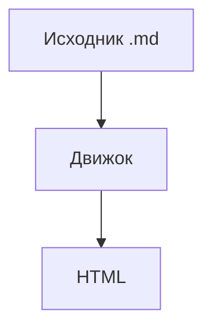

# Выноски и схемы

> [!tip] Совет
> Выноски — обычный синтаксис Obsidian.
> - пункт внутри выноски
> - ещё пункт

> [!critical] Алиас
> Тип `critical` оформлен как `danger` через `[callouts] alias`.

