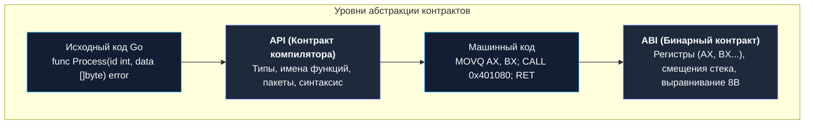
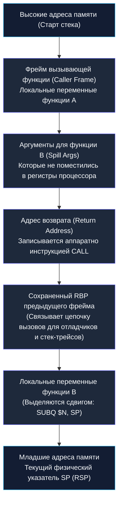
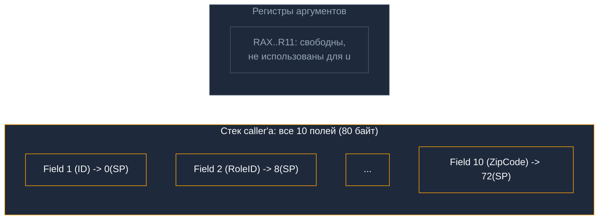
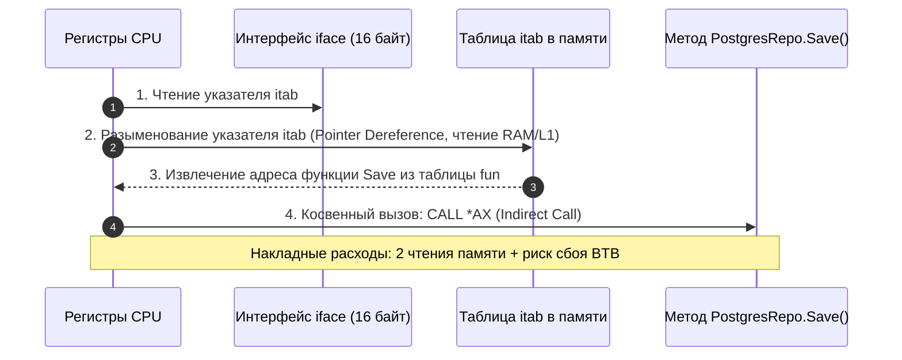

В предыдущей лекции [[9. Базовый Ассемблер. Как CPU видит код]] мы заглянули в святая святых машины — дизассемблированный листинг компилятора — и увидели, как процессор перекладывает биты между регистрами. Но как только программа становится сложнее одного файла и одна функция вызывает другую, перед инженерами встает фундаментальная проблема коммуникации:

*Откуда вызываемая функция узнает, где лежат переданные ей аргументы? В регистре `AX`? В регистре `BX`? Или на вершине стека памяти? Куда положить возвращаемый результат, чтобы вызывающая функция (Caller) смогла его прочитать? И кто обязан восстанавливать состояние регистров и очищать память после выхода из функции?*

Сам кремниевый процессор не знает ответов на эти вопросы. Железо абсолютно нейтрально: для него регистры — это просто безымянные 64-битные ячейки памяти, а стек — обычные адреса в оперативной памяти.

Порядок взаимодействия между функциями, модулями и даже разными языками программирования (например, при связке Go и C) устанавливается на уровне компилятора и операционной системы. Этот свод строгих правил называется **ABI (Application Binary Interface)** и **Конвенцией вызова (Calling Convention)**.

---

## API против ABI

Все разработчики знают, что такое API (Application Programming Interface). В Go сигнатура `func Process(id int, data[]byte) error` — это API. Это контракт на уровне *исходного кода*. Если типы аргументов и возвращаемого значения совпадают, компилятор счастлив и успешно собирает проект.

Но когда компилятор превращает Go-код в машинные биты, имена аргументов `id` и `data`, имена типов `int`, `slice` и `error` **испаряются**. Процессор оперирует лишь электрическими потенциалами на кремниевых шинах и номерами регистров.

**ABI (Application Binary Interface)** — это контракт на уровне *скомпилированного бинарного кода*. Он регламентирует:
1. **Размер и выравнивание типов данных:** сколько байт в памяти занимает тип `int` (8 байт на 64-битной машине), какова внутренняя структура слайса `slice` (ровно 24 байта: указатель на массив, длина `len`, вместимость `cap`);
2. **Конвенцию вызова (Calling Convention):** в каких именно регистрах или по каким смещениям стека передаются входные параметры и где забирать возвращаемый результат;
3. **Разделение ответственности за регистры:** какие регистры обязана сохранить вызываемая сторона (**Callee-saved**), а какие вызывающая сторона должна сохранить сама, если они ей еще нужны (**Caller-saved**);
4. **Формат исполняемых файлов и системных вызовов:** структура заголовков ELF (в Linux) или Mach-O (в macOS), и номер регистра для передачи номера системного вызова ядра (`RAX`).



---

## Стек вызовов (Call Stack) и Stack Frame

Прежде чем исследовать конвенции вызовов, разберем анатомию пространства, в котором живут функции во время работы.

Каждая горутина в Go при старте получает собственный непрерывный блок памяти — **Стек вызовов (Call Stack)**.  
Исторически на архитектуре x86 стек растет **вниз** — от высоких адресов оперативной памяти к низким.

Каждый раз, когда функция `A` вызывает функцию `B`, на вершине стека формируется изолированный фрагмент памяти — **Стековый фрейм (Stack Frame)** функции `B`.

Границы активного фрейма контролируются двумя ключевыми регистрами процессора:
- **`RSP` / `SP` (Stack Pointer — Указатель стека):** хранит адрес текущей вершины стека (самый младший занятый адрес в памяти);
- **`RBP` / `BP` (Base Pointer / Frame Pointer — Базовый указатель):** хранит адрес начала (базы) текущего фрейма.



### Как выделяется и освобождается фрейм?
Обратите внимание на поразительную скорость работы стека:
1. Чтобы выделить память под фрейм локальных переменных размером 64 байта, процессору достаточно выполнить одну инструкцию вычитания:
   ```asm
   SUBQ $64, SP
   ```
2. Чтобы мгновенно уничтожить фрейм при завершении функции, процессор выполняет обратную операцию сложения или выходит по инструкции:
   ```asm
   RET
   ```
Выделение памяти на стеке занимает ровно **1 такт CPU (менее 0.3 нс)**! В отличие от кучи (Heap), на стеке нет фрагментации, нет блокировок аллокатора и нет работы для Garbage Collector'а.

---

## Эволюция Calling Convention в Go

В истории развития языка Go произошла грандиозная внутренняя революция, разделившая его историю на «до» и «после».

---

### ABI0: Классический (медленный) стек

Вплоть до релиза **Go 1.17** компилятор Go использовал конвенцию вызова **ABI0**. 
В ней действовало железное правило: **абсолютно все аргументы функций и возвращаемые значения передавались строго через оперативную память (стек)**.

Представьте простой вызов функции сложения двух чисел:
```go
func add(a, b int) int {
    return a + b
}

// Вызов:
res := add(10, 20)
```

Что физически происходило внутри процессора при вызове `add(10, 20)` по правилам ABI0?
1. Вызывающая функция брала число `10` и записывала его в память по адресу стека: `MOVQ $10, 0(SP)`.
2. Брала число `20` и записывала его в память: `MOVQ $20, 8(SP)`.
3. Выполняла инструкцию перехода `CALL`.
4. Функция `add` считывала `10` из памяти обратно в регистр ALU: `MOVQ 0(SP), AX`.
5. Считывала `20` из памяти: `MOVQ 8(SP), BX`.
6. Складывала их: `ADDQ BX, AX`.
7. Записывала сумму `30` обратно в память стека: `MOVQ AX, 16(SP)`.
8. Выполняла возврат `RET`.
9. Вызывающая функция читала результат `30` из памяти: `MOVQ 16(SP), DX`.

Каждый чих сопровождался записью и чтением памяти! Даже с учетом кэша L1 это создавало паразитный `I/O` трафик на внутренних шинах кристалла. 

**Почему авторы Go пошли на это?**  
Создатели языка сделали это ради простоты и надежности:
- Стек-ориентированный ABI сделал сборщик мусора (GC) предельно надежным: GC точно знал, где лежат все указатели — на стеке, с фиксированными смещениями;
- Генератор кода для кросс-компиляции на новые архитектуры писался за пару недель, ведь правила стека везде одинаковы.

---

### ABIInternal: Регистровая революция (Go 1.17+)

К 2021 году стало очевидно, что цена стекового соглашения слишком высока. Инженеры Austin Clements и Cherry Mui спроектировали и внедрили новый стандарт — **ABIInternal (Register-based Calling Convention)**.

Начиная с **Go 1.17**, компилятор мапит параметры напрямую на физические регистры процессора:

**Правила ABIInternal в Go (для архитектуры `amd64`):**
1. Выделено **9 целочисленных регистров** для передачи аргументов и указателей:  
   `RAX`, `RBX`, `RCX`, `RDI`, `RSI`, `R8`, `R9`, `R10`, `R11`.
2. Выделено **15 векторных регистров** для чисел с плавающей точкой (`float`):  
   `X0` – `X14`.
3. Аргументы распределяются по этим регистрам строго слева направо.
4. **Возвращаемые значения передаются в этих же регистрах!**

Теперь при вызове `add(10, 20)`:
- Число `10` помещается в регистр `AX`;
- Число `20` помещается в регистр `BX`;
- Процессор выполняет `CALL`;
- Функция делает `ADDQ BX, AX` за 1 такт CPU;
- Процессор делает `RET`. 
Результат `30` уже находится в регистре `AX`! Ни одного лишнего обращения к оперативной памяти.

Этот архитектурный апгрейд принес всем Go-приложениям в мире бесплатное ускорение на **5–12% CPU** просто при обновлении версии Go без изменения единой строчки кода.

---

> [!tip] Собеседование: Множественный возврат значений в Go и ассемблер
> **Вопрос:** В языке Go функции могут возвращать несколько значений одновременно:
> ```go
> result, err := Do()
> ```
> Как это реализовано на уровне машинного кода? Ведь в стандартной конвенции C (System V ABI) функция может вернуть только одно значение через регистр `RAX`!
> 
> **Ответ:** В отличие от C, стандарт Go **ABIInternal** изначально спроектирован для поддержки мульти-возвратов. 
> Компилятор Go просто задействует следующие свободные регистры из пула возврата!
> 
> Если функция `Do()` возвращает `int` и интерфейс `error`, то:
> 1. Первый результат типа `int` возвращается в регистре `RAX`.
> 2. Интерфейс `error` под капотом состоит из двух 8-байтных указателей: указателя на таблицу методов `*itab` и указателя на сами данные `data`.
> 3. Компилятор возвращает `itab` в регистре `RBX`, а `data` — в регистре `RCX`!
> 
> Таким образом, конструкция `result, err := Do()` возвращает все три 64-битных слова через регистры `RAX`, `RBX` и `RCX` за 0 наносекунд без единой аллокации в памяти.

---

## Mechanical Sympathy: Ловушки регистров

Аппаратные ресурсы кристалла ограничены законами физики. В архитектуре x86-64 для передачи аргументов компилятор Go выделил ровно 9 целочисленных регистров.

Что произойдет, если ваша функция принимает большую структуру по значению?

```go
type User struct {
    ID       int
    RoleID   int
    Age      int
    Score    int
    Status   int
    Flags    int
    DepartID int
    CityID   int
    RegionID int
    ZipCode  int // 10-е поле типа int!
}

// Передача структуры по значению
func ProcessUser(u User) {
    // ...
}
```

При передаче `User` по значению компилятор подсчитывает: для 10 полей-`int` (10 × 8 байт = 80 байт) нужно 10 целочисленных регистров-аргументов. В пуле ABIInternal для `amd64` их только **9** (`RAX`, `RBX`, `RCX`, `RDI`, `RSI`, `R8`, `R9`, `R10`, `R11`). Структура **не вмещается полностью**.

> [!important] Ключевое правило ABIInternal: атомарность назначения аргументов
> Согласно спецификации Go ABI (`src/cmd/compile/abi-internal.md`), если аргумент — составной тип (структура, слайс и т.д.) — **не умещается целиком в оставшихся свободных регистрах**, компилятор Go **никогда не расщепляет его**, отдавая часть полей в регистры, а часть — на стек. Вместо этого вся структура целиком передается на стеке.
>
> Причина: если бы поля одного аргумента разместились и в регистрах, и в памяти одновременно, а вызываемая функция взяла адрес `&u`, ей пришлось бы воссоздавать объект целиком в памяти — копируя данные из регистров обратно на стек. Стоимость такой реконструкции пропорциональна размеру структуры, что хуже простой передачи по стеку.

Таким образом, для нашей `User` со всеми 10 полями компилятор Go полностью передает структуру через стек:



---

> [!warning] Ловушка / Gotcha: Границы передачи структур by-value
> В сообществе Go популярна рекомендация передавать структуры по значению (By Value), чтобы избежать «убегания» данных в кучу (Escape to Heap) и не нагружать Garbage Collector.
> 
> Однако здесь кроется ловушка:
> - **Компактная структура** (до 3–4 полей, до 32 байт): идеальна для передачи по значению. Она целиком помещается в регистры, вызов функции бесплатен.
> - **Массивная структура** (10+ полей или десятки байт данных): при передаче по значению компилятор тратит десятки тактов CPU на копирование байтов в стек фрейма и обратно.
> 
> **Инженерный вывод:** Если структура велика, передавайте ее по указателю `*User`! Указатель на 64-битной архитектуре — это ровно одно машинное слово (8 байт), которое гарантированно передается через единственный регистр `RAX` без сброса на стек.

---

## Динамическая диспетчеризация (Интерфейсы)

Понимание ABI дает ответ на еще один классический вопрос оптимизации: почему вызовы методов через интерфейсы работают медленнее прямых вызовов функций?

Сравним два вызова:
1. **Прямой вызов:**
   ```go
   user.Save()
   ```
   Адрес функции `User.Save` известен компилятору на этапе компиляции. В машинный код зашивается прямая инструкция перехода: `CALL 0x402100` (Direct Call). Процессор заранее знает целевой адрес инструкции и не простаивает.

2. **Вызов через интерфейс:**
   ```go
   repository.Save()
   ```
   Переменная `repository` — это интерфейс. На этапе компиляции конкретный тип реализации неизвестен (это может быть `PostgresRepo`, `MockRepo` или `RedisRepo`).

На уровне ABI интерфейс Go кодируется 16-байтной структурой `iface`:
- Указатель `tab` на структуру **`itab`** (метаданные типа и таблица функций);
- Указатель `data` на реальный экземпляр объекта в памяти.



Чтобы выполнить `repository.Save()`, процессору приходится совершить многоступенчатый танец:
1. Прочитать адрес `itab` из интерфейса;
2. Сделать разыменование указателя (Pointer Dereferencing) и залезть в память структуры `itab`;
3. Найти смещение нужного метода `Save` в массиве указателей на функции;
4. Выполнить **косвенный вызов (Indirect Call)**: `CALL *AX`.

Хотя сами аргументы метода по-прежнему передадутся через регистры (ABIInternal), косвенный вызов создает две проблемы:
- Лишние чтения памяти (потенциальные промахи кэша);
- Удар по предсказателю ветвлений процессора (Branch Target Buffer, BTB): если в цикле через один и тот же интерфейс вызываются разные типы, процессор не может угадать адрес прыжка и конвейер останавливается.

---

## Итог

1. **ABI (Application Binary Interface):** бинарная конституция программы. Определяет соглашения о вызовах, раскладку регистров, выравнивание структур в памяти и формат передачи аргументов.
2. **Стек вызовов и фрейм:** стек растет вниз (к младшим адресам). Границы фрейма определяются регистрами `BP` (база фрейма) и `SP` (вершина стека). Память под локальные переменные выделяется мгновенно — одной инструкцией вычитания `SUBQ $N, SP`.
3. **Эпоха ABI0 (до Go 1.17):** все аргументы и возвращаемые значения передавались через стек памяти, создавая избыточную нагрузку на кэш L1.
4. **Эпоха ABIInternal (Go 1.17+):** революция регистровых вызовов. Аргументы (до 9 целых чисел и до 15 `float`) и мульти-возвраты передаются напрямую через регистры CPU, обеспечив ускорение кода на 5–12%.
5. **Передача структур на стеке:** если составной аргумент (структура) не умещается **целиком** в доставшихся ему свободных регистрах, Go ABIInternal передает **всю структуру целиком** через стек — без частичного размещения полей в регистрах. Это гарантирует корректную работу при взятии адреса `&arg` внутри вызываемой функции. Большие структуры выгоднее передавать по указателю `*User`.
6. **Вызовы через интерфейсы:** требуют чтения структуры `itab` в памяти и косвенного прыжка (`CALL *AX`), что не позволяет заинлайнить вызов и создает дополнительную нагрузку на Branch Target Buffer.

Мы изучили, как процессор последовательно исполняет инструкции, прыгает по адресам памяти через `CALL` и возвращается через `RET`. Но почему же современные процессоры с тактовой частотой 4–5 ГГц работают с такой поразительной скоростью? Неужели они действительно ждут окончания предыдущей команды, прежде чем приступить к следующей?

В следующей лекции мы откроем главную тайну микроархитектуры — превращение процессора в непрерывный промышленный конвейер Генри Форда: [[11. Конвейеризация. Почему CPU исполняет несколько инструкций одновременно]].