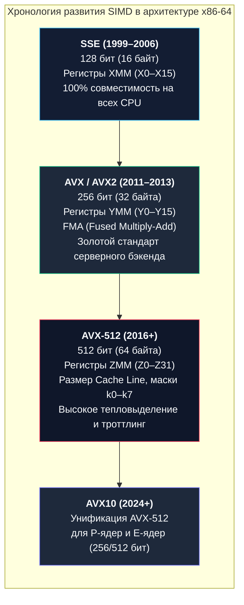
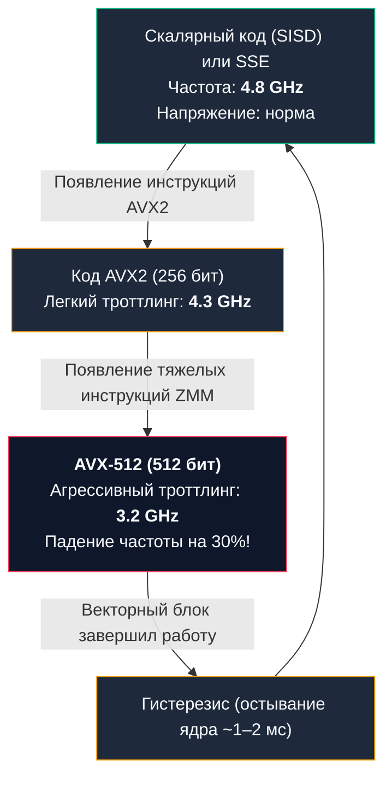

В предыдущей главе [[14. SIMD. Single Instruction Multiple Data]] мы познакомились с ошеломляющей мощью векторной обработки: способностью за один такт процессора перемалывать не одиночные числа, а целые массивы данных.

На первый взгляд, перед архитектором открывается очевидный и заманчивый путь. Если 128-битные регистры ускоряют вычисления в 4 раза, а 256-битные — в 8 раз, почему бы не продолжить масштабирование? Почему не сделать векторные регистры шириной 1024, 2048 или 8192 бита, чтобы складывать мегабайты информации за один такт?

В этот момент программист лицом к лицу сталкивается с неумолимыми законами физики кремния, электродинамики и термодинамики. Векторные вычисления — это не бесплатный подарок. У них есть своя суровая, а порой и скрыто-разрушительная цена.

В этой лекции мы проследим эволюцию векторных расширений x86-64, разберем феномен **AVX Offset (аппаратного троттлинга частоты)**, столкнемся со **Стеной памяти** и научимся безопасно работать с зоопарком серверных процессоров в коде на Go.

---

## Эволюция SIMD в архитектуре x86-64

Векторные инструкции не появились в процессорах одномоментно. Они эволюционировали десятилетиями, отражая способность инженеров упаковывать всё больше транзисторов на кремниевую пластину:



1. **`SSE` (Streaming SIMD Extensions, SSE2, SSE3, SSE4.2):**  
   Базовый стандарт мира x86-64. Ширина регистров — **128 бит (16 байт)**. Регистры называются `XMM` (от `X0` до `X15`). Это «прожиточный минимум», который аппаратно гарантированно присутствует абсолютно на всех 64-битных процессорах x86.
2. **`AVX` и `AVX2` (Advanced Vector Extensions):**  
   Регистры расширили ровно вдвое — до **256 бит (32 байта)**, назвав их `YMM`.  
   AVX принес неразрушающий синтаксис из трех операндов (`VADDPS dst, src1, src2`), а AVX2 добавил целочисленные 256-битные операции и инструкцию **FMA (Fused Multiply-Add)**: операцию $A \times B + C$ за один такт с одинарным округлением.  
   На сегодняшний день AVX2 — это **золотой стандарт (Sweet Spot)** для серверного бэкенда: он удваивает производительность без критических побочных эффектов.
3. **`AVX-512`:**  
   Ширина регистров достигла гигантских **512 бит (64 байта)**. Регистры называются `ZMM` (32 регистра от `Z0` до `Z31`). В один регистр за один такт укладывается ровно одна кэш-линия памяти! Но именно здесь разработчики процессоров уперлись в жестокий физический потолок.

---

## Mechanical Sympathy: Нагрев и AVX Offset

Чтобы понять, почему индустрия не спешит делать 1024-битные регистры, нужно вспомнить физику из [[2. Транзисторы, биты и логические вентили]].

Динамическая мощность, потребляемая CMOS-транзисторами при переключении, описывается базовой формулой:
$$P = C \times V^2 \times f$$
где $C$ — емкость затворов, $V$ — напряжение питания, а $f$ — тактовая частота.

Обычная скалярная операция `ADD RAX, RBX` включает скромную 64-битную цепь сумматора.  
Векторная инструкция AVX-512 активирует гигантский каскад 512-битных сумматоров — это **в 8 раз больше одновременно переключающихся транзисторов**!

Когда процессор начинает на каждом такте молотить 512-битные числа, по кремниевым дорожкам течет колоссальный импульсный ток. Возникает резкий скачок температуры (**Thermal Spike**) и локальная просадка напряжения питания ($L \cdot \frac{di}{dt}$ voltage droop). Если ничего не предпринимать, кремниевый кристалл в считанные миллисекунды выйдет за пределы теплового пакета (TDP) и сгорит.

Чтобы предотвратить термическую смерть чипа, инженеры Intel внедрили механизм **AVX Offset (Frequency Downclocking)**.

Как только декодер команд видит поток «тяжелых» инструкций AVX-512, процессор аппаратно и принудительно **сбрасывает тактовую частоту всего ядра**:



---

> [!warning] Ловушка / Gotcha: Эффект шумного соседа (Noisy Neighbor on Core)
> Снижение частоты из-за AVX-512 распространяется на **весь физический вычислительный конвейер ядра**!
> 
> Представьте типичный бэкенд на Go:
> - Горутина 1 обрабатывает HTTP API (обычный скалярный бизнес-код с ветвлениями `if`, чтением JSON, работой с базой данных);
> - Горутина 2 в фоне сжимает массив логов алгоритмом Zstandard с использованием AVX-512.
> 
> Планировщик Linux поселяет обе горутины на одно физическое ядро (через Hyper-Threading / SMT). Горутина 2 запускает AVX-512, и процессор мгновенно сбрасывает частоту ядра с $4.8\text{ ГГц}$ до $3.2\text{ ГГц}$. 
> 
> В итоге ваша критичная горутина HTTP API **замедляется на 30%**, хотя в ней нет ни единой векторной инструкции! Более того, процессор держит сниженную частоту еще некоторое время после окончания векторного блока (время гистерезиса), чтобы убедиться, что чип остыл.
> 
> *(Примечание: В новейших архитектурах частотный штраф AVX-512 существенно снижен. На стороне AMD — **Zen 4** использует сдвоенные 256-битные конвейеры без сброса базовых частот ядра, а **Zen 5** добавил полноценный 512-битный тракт. Серверные процессоры Intel **Xeon на Sapphire Rapids / Emerald Rapids** также существенно снизили эффект деградации. Потребительские Intel Alder Lake / Raptor Lake / Meteor Lake поддержку AVX-512 **аппаратно отключили** из-за наличия E-ядер без 512-битных регистров — вопрос частотного штрафа для них попросту неприменим. На миллионах серверов предыдущих поколений Skylake-X / Ice Lake / Cascade Lake этот эффект остаётся критическим фактором.)*

---

## Стена Памяти (Memory Wall)

Второе фундаментальное препятствие для расширения векторов — **пропускная способность подсистемы памяти**.

В статье про конвейеризацию мы определили ядро процессора как «голодного зверя». Сверхширокий SIMD превращает этот голод в черную дыру.

Давайте посчитаем:  
Если ядро способно за один такт переваривать один 64-байтный регистр `ZMM` (AVX-512), работая на частоте $4.0\text{ ГГц}$, ему требуется поток входных данных со скоростью:
$$\text{Пропускная способность} = 64 \text{ байта} \times 4.0 \times 10^9 \text{ тактов/с} = 256 \text{ ГБ/с на ОДНО ядро!}$$

А теперь взглянем на физическую реальность серверной материнской платы:
Двухканальная оперативная память **DDR5-5600** выдает суммарную пропускную способность около **80–90 ГБ/с на весь процессорный сокет**, который делят между собой 16 или 32 ядра!

**Вывод беспощаден: векторные инструкции AVX-512 бесполезны, если ваши данные лежат в оперативной памяти (DRAM).**  
Процессор сожрет первые 64 байта за 1 такт, а затем застынет в ступоре (Pipeline Stall) на 200 тактов в ожидании следующей порции из RAM. Вся мощь векторных сумматоров разобьется о кэш-промахи (Cache Miss).

Векторизация дает реальный выигрыш только тогда, когда алгоритм обладает высокой **арифметической плотностью (Arithmetic Intensity)** — то есть данные многократно переиспользуются, находясь в молниеносных кэшах L1d и L2 (подробнее мы изучим это в [[17. Пирамида памяти. Регистры, SRAM, DRAM и цена доступа]]).

---

## Фрагментация ISA: Пишем код под зоопарк процессоров

В отличие от базового набора инструкций x86-64, наличие поддержки AVX2 или AVX-512 не гарантировано:
- Бюджетные серверы, виртуальные машины VPS или процессоры Intel Celeron/Atom поддерживают только базовый SSE;
- Процессоры Intel Alder Lake / Raptor Lake программно отключали AVX-512 из-за гетерогенной архитектуры с энергоэффективными E-ядрами;
- Серверные процессоры AMD EPYC и Intel Xeon поддерживают разные подмножества инструкций (AVX-512F, AVX-512BW, AVX-512CD...).

Если скомпилировать бинарник на ассемблере с инструкцией `VPADDQ ZMM0...`, а затем запустить его на старом сервере без поддержки AVX-512, ядро Linux не сможет ее декодировать. Операционная система пошлет процессу сигнал **`SIGILL` (Illegal Instruction)**, и ваш Go-сервис моментально упадет с паникой и аварийным дампом памяти (Core Dump).

### Решение в Go: CPUID и Динамическая диспетчеризация
Чтобы безопасно использовать мощь SIMD, разработчики библиотек на Go применяют **Динамическую диспетчеризацию (Dynamic Dispatch)**.

При старте программы опрашивается инструкция **`CPUID`**, выясняются физические возможности кристалла, и глобальный указатель функции переключается на наиболее оптимальную реализацию.

В стандартном репозитории Go для этого есть официальный пакет **`golang.org/x/sys/cpu`**:

```go
package main

import (
	"fmt"
	"golang.org/x/sys/cpu"
)

// hashFunc — глобальный функциональный указатель
var hashFunc func(data []byte) []byte

func init() {
	// Опрос физических возможностей кристалла через CPUID в рантайме
	if cpu.X86.HasAVX512 {
		fmt.Println("[Init] Обнаружен AVX-512: активируем экстремальный векторный путь")
		hashFunc = hashAVX512
	} else if cpu.X86.HasAVX2 {
		fmt.Println("[Init] Обнаружен AVX2: активируем сбалансированный векторный путь")
		hashFunc = hashAVX2
	} else {
		fmt.Println("[Init] AVX не поддерживается: фолбэк на скалярный код (SISD / базовый SSE)")
		hashFunc = hashGeneric
	}
}

// Заглушки функций (в реальности реализованы на ассемблере Plan 9)
func hashAVX512(data []byte) []byte {
	// Использует регистры ZMM (512 бит)
	return data
}

func hashAVX2(data []byte) []byte {
	// Использует регистры YMM (256 бит)
	return data
}

func hashGeneric(data []byte) []byte {
	// Чистый Go, обычный цикл 'for', работающий на любых машинах
	return data
}

func main() {
	payload := []byte("high-performance-data-payload")
	result := hashFunc(payload)
	_ = result
}
```

---

> [!tip] Собеседование: Накладные расходы на вызов и гранулярность SIMD
> **Вопрос:** В чем опасность использования ассемблерных векторных функций (AVX2/AVX-512) для операций над крошечными объемами данных (например, сложение срезов из 8–16 байт)?
> 
> **Ответ:** Проблема кроется в соотношении полезной работы и накладных расходов на вызов функции (**Call Overhead**):
> 1. **Невозможность инлайнинга:** Компилятор Go (`cmd/compile`) **не умеет инлайнить функции, написанные на ассемблере**. Каждый вызов ассемблерной функции обязан пройти через полный цикл конвенции вызова ABI (инструкции `CALL`, подготовка регистров, инструкция `RET`), как мы разбирали в [[10. ABI, Calling Convention и стек вызовов]]. На это уходит **от 5 до 15 тактов**.
> 2. **Гранулярность:** Сама векторная операция над 16 байтами в регистре XMM займет **1 такт**.  
> 
> Тратить 15 тактов на организацию вызова ради экономии 2 тактов в вычислениях — грубейшая ошибка. Обычный скалярный цикл `for` на чистом Go компилятор сможет заинлайнить целиком, устранив вызов функции вообще. Векторизация окупает себя только на объемах данных, превышающих сотни байт или килобайты.

---

## Итог

1. **Эволюция векторов x86-64:** `SSE` (128 бит / `XMM`), `AVX2` (256 бит / `YMM`), `AVX-512` (512 бит / `ZMM`).
2. **AVX Offset (Downclocking):** переключение сотен 512-битных сумматоров вызывает бросок тока и перегрев. Чтобы спасти кристалл, процессор снижает тактовую частоту ядра на 15–30%, что может непреднамеренно замедлить скалярный код соседних горутин.
3. **Стена Памяти (Memory Wall):** ядро с AVX-512 требует до 256 ГБ/с пропускной способности. Если данные не помещаются в L1d/L2 кэш, широкие векторные блоки простаивают в ожидании оперативной памяти DRAM.
4. **Фрагментация ISA:** использование неподдерживаемых инструкций вызывает аварийный сигнал `SIGILL`. В Go-проектах применяется пакет `golang.org/x/sys/cpu` для динамического выбора реализации алгоритма во время старта.
5. **Накладные расходы:** ассемблерные функции не инлайнятся компилятором Go. Применение SIMD к крошечным объемам данных (до 32 байт) делает код медленнее из-за накладных расходов на `CALL` и `RET`.

Теперь нам ясны все технические нюансы и ограничения SIMD. Но здесь встает главный вопрос любого Go-разработчика:  
*Если компиляторы GCC, Clang и Rustc тратят столько усилий на автоматическую векторизацию, почему создатели Go упорно отказываются внедрять автовекторизатор в стандартный `cmd/compile`? Зачем они заставляют писать на ассемблере Plan 9 вручную?*

В следующей статье мы раскроем тайну философии и компилятора Go: [[16. Почему Go почти не использует SIMD автоматически]].