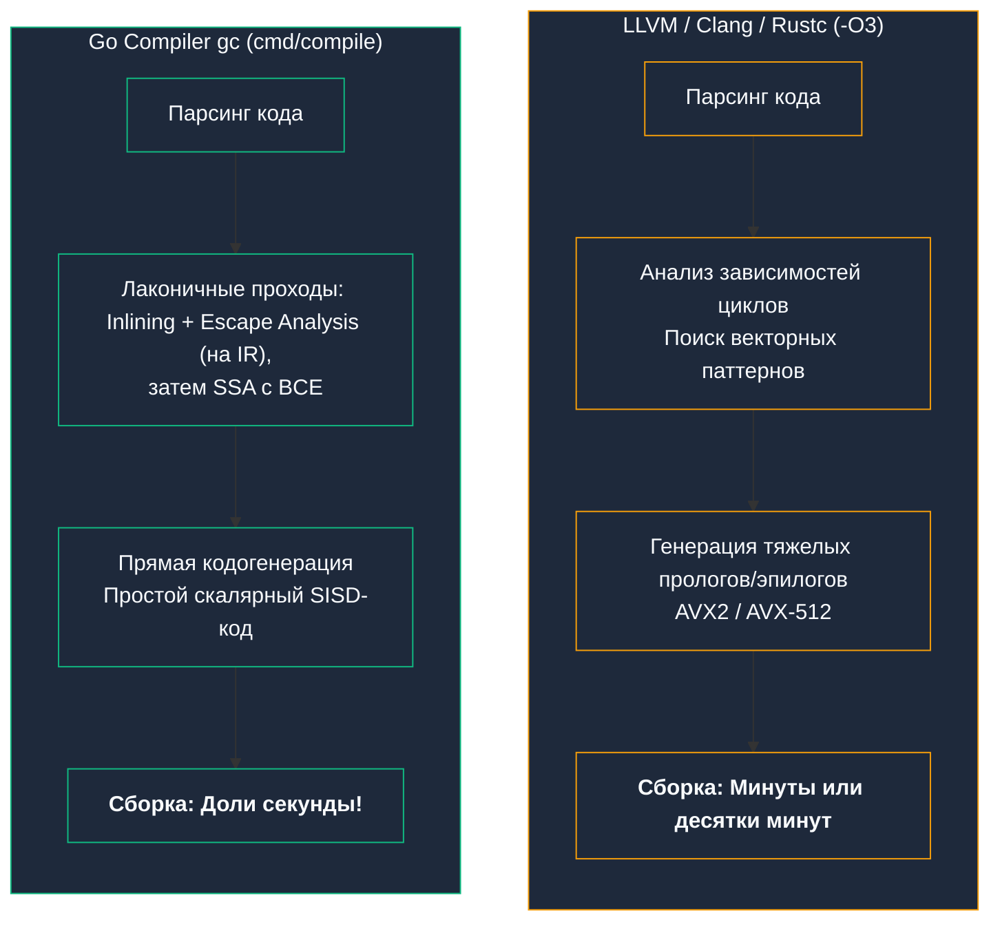
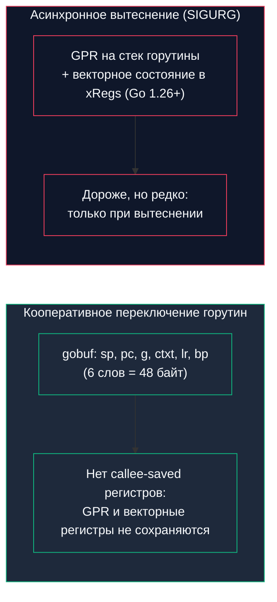

В предыдущих главах [[14. SIMD. Single Instruction Multiple Data]] и [[15. AVX, AVX2, AVX-512 и ограничения SIMD]] мы восхищались потрясающей мощью векторных инструкций: возможностью за один такт процессора сложить или сравнить сразу 16, 32 или 64 байта данных.

Любой программист, переходящий в Go из мира C, C++ или Rust, неминуемо испытывает легкий культурный шок.  
В компиляторах GCC или Clang достаточно указать флаг оптимизации `-O3` — и компилятор сотворит «магию»: проанализирует ваш наивный цикл `for`, автоматически развернет его и сгенерирует широкие векторные инструкции `AVX2` или `AVX-512`. Это называется **автовекторизацией (Auto-vectorization)**.

Но если вы напишете тот же самый цикл в Go, стандартный компилятор `gc` (Go Compiler) сгенерирует старомодный, скалярный код, методично перебирающий элементы по одному за раз. Чтобы выжать SIMD в Go, разработчикам приходится спускаться в пучины рукописного ассемблера Plan 9.

Почему создатели Go — Роберт Гризмер, Роб Пайк и Кен Томпсон, живые легенды системного программирования (Пайк и Томпсон — ещё со времён Bell Labs) — не оснастили компилятор `gc` мощным автовекторизатором? Неужели это инженерная лень или недоработка?

Ни в коем случае. **Отказ от автовекторизации в Go — это осознанный, математически взвешенный архитектурный компромисс.**

Давайте разберем четыре фундаментальные причины, почему Go сознательно отвергает автоматический SIMD.

---

## 1. Скорость компиляции важнее микрооптимизаций

Вспомним историю рождения Go в недрах Google в 2007 году. Главной болью инженеров было колоссальное время сборки огромных C++ монолитов: компиляция проекта занимала по 45 минут, превращая рабочий день в бесконечное ожидание.

Главной причиной долгих сборок C++, по рассказу Роба Пайка («Go at Google»), были не оптимизации, а модель заголовочных файлов и зависимостей: сборка одного бинарника могла десятки тысяч раз открывать и читать сотни заголовков (плюс тяжёлые шаблоны). Но и сама фаза оптимизации с автовекторизацией в компиляторах (LLVM / GCC) не бесплатна:
1. Компилятор строит сложные графы зависимостей по данным (анализ зависимостей циклов);
2. Пытается математически доказать, что итерации цикла независимы;
3. Разворачивает циклы (Loop Unrolling);
4. Генерирует сложный пролог и эпилог для обработки «хвостов» массива (когда длина массива не делится нацело на 16 или 32 байта).

На эти расчеты уходят миллионы процессорных циклов самого компилятора!



Компилятор Go `gc` спроектирован по принципу: **«Делать ровно столько работы, сколько необходимо, и ни наносекундой больше»**.  
Внедрение тяжеловесного автовекторизатора заметно замедлило бы `go build` (насколько именно, зависит от реализации; точных измерений для Go нет), уничтожив главное конкурентное преимущество языка — феноменальный Developer Experience (DX) мгновенной обратной связи.

---

## 2. Проблема Aliasing и Bounds Checking

Даже если бы команда Go захотела научить компилятор автовекторизации, сама семантика языка возводит перед компилятором непреодолимые стены.

### Проблема наложения указателей (Memory Aliasing)
В Go слайсы — это трехсловные структуры: `(ptr, len, cap)`. Два слайса могут запросто ссылаться на одну и ту же базовую область памяти, частично перекрываясь:

```go
data := []int{1, 2, 3, 4, 5}
a := data[1:5]
b := data[0:4] // Слайсы a и b пересекаются в памяти!

for i := 0; i < len(a); i++ {
    a[i] = a[i] + b[i]
}
```

Что произойдет, если компилятор наивно векторизует этот цикл с помощью 256-битных инструкций `AVX2`?
- В скалярном коде на первой итерации $i=0$ мы записываем `a[0]` — это `data[1]`. Но `data[1]` же и есть `b[1]`, поэтому на итерации $i=1$ `b[1]` уже содержит обновленное значение. Изменения накапливаются строго последовательно (получается префиксная сумма: `[1 3 6 10 15]`).
- Если же компилятор загрузит все элементы `a` и `b` в векторные регистры за один присест, он прочитает **старые значения** `b`, проигнорировав эффект наложения, и получит `[1 3 5 7 9]`. Результат вычислений окажется математически некорректным.

В языке C программист может дать компилятору клятву: ключевое слово `__restrict__` обещает, что указатели не перекрываются. В Go таких подсказок нет, а статический анализ указателей в общем случае алгоритмически неразрешим.

### Проблема проверок границ (Bounds Checking)
Как мы выяснили ранее, перед каждым обращением по индексу `a[i]` Go вставляет скрытые инструкции проверки границ массива (`CMPQ` + `JAE`), готовые вызвать аварийный `panic`.

Векторизовать цикл, любая отдельная итерация которого может внезапно завершиться паникой `panic`, чрезвычайно сложно: как процессор должен откатить уже частично вычисленные спекулятивные элементы в 512-битном векторе?

---

## 3. Предсказуемость производительности (Performance Cliff)

Автовекторизация в C++ — это магия. А главная проблема любой магии — ее **хрупкость**.

Вы пишете быстрый цикл, компилятор Clang векторизует его, и алгоритм летает с 8-кратным ускорением.  
Спустя полгода другой разработчик добавляет внутрь цикла невинный лог, легкий `if` или вызов внешней вспомогательной функции.

Анализатор зависимостей компилятора пасует. Компилятор молча, без единого предупреждения, отключает векторизацию этого цикла. Производительность вашей продакшн-системы внезапно **рушится в 8 раз**! Это явление в системном проектировании называют **Performance Cliff (Обрыв производительности)**.

Go сознательно выбирает **прозрачную и предсказуемую производительность**.  
Код на базовых скалярных инструкциях выполняется стабильно, предсказуемо и понятно, независимо от того, какие строчки вы поменяли по соседству.

---

> [!tip] Собеседование: Почему в Go так долго не было официальных SIMD-интринсиков?
> **Вопрос:** Почему в стандартный Go так долго не добавляли платформенные векторные интринсики (типа `avx2.Add(a, b)`), как это сделано в C#, Rust (`core::arch`) или C++?
> 
> **Ответ:** Это предмет многолетних дискуссий в сообществе Go. Ситуация меняется: в Go 1.26 появился экспериментальный пакет `simd/archsimd` (включается через `GOEXPERIMENT=simd`, proposal #73787), а в Go 1.27 рядом с ним добавлены переносимые векторные типы `simd`; оба пока остаются экспериментом и не входят в гарантии совместимости Go 1.
> Долгое время авторы Go отказывались от интринсиков вида `avx2.Add(a, b)` по фундаментальной причине: **они намертво привязывают исходный код к конкретной архитектуре (ISA)**.
> 
> Код, написанный с вызовами `avx2.Add`, не соберётся или станет бесполезным при компиляции под ARM64 (серверы AWS Graviton или процессоры Apple M-серии) или перспективный RISC-V. Это разрушит ключевое обещание Go: **«Написал один раз — компилируй под любую платформу» (GOOS / GOARCH)**.
> 
> Политика команды Go проста: архитектурно-зависимый код должен быть надежно изолирован внутри стандартной библиотеки или вынесен в отдельные файлы с суффиксами сборки (`_amd64.s`, `_arm64.s`).

---

## 4. Mechanical Sympathy: Горутины и размер контекста

Четвертая причина — самая неочевидная, и к ней нужно относиться осторожнее остальных: она связана с тем, как рантайм Go сохраняет регистры, и устроена тоньше, чем кажется на первый взгляд.

Язык Go спроектирован для экстремальной сетевой конкурентности. Архитектура рантайма G-M-P рассчитана на то, что на одном сервере могут одновременно сосуществовать **сотни тысяч и миллионы горутин**.

Горутина в Go рождается невесомой — ее стек стартует с небольшого размера (по умолчанию порядка 2 КБ, а начальный размер рантайм подстраивает под средний размер стеков после каждого GC) и растет по мере необходимости.  
Когда планировщик Go переключает выполнение с одной горутины на другую, он сохраняет состояние в структуру `gobuf` (внутри управляющей структуры `g`). Но `gobuf` — это не «снимок всех регистров»: в ней всего шесть слов (`sp`, `pc`, `g`, `ctxt`, `lr`, `bp`), то есть 48 байт на 64-битной платформе.

Почему так мало? Потому что в ABI Go **нет callee-saved регистров**: любой вызов функции считается способным испортить все регистры, и компилятор сам сохраняет нужное на стеке до вызова. Поэтому при обычном (кооперативном) переключении горутин — вызовы `gogo` / `mcall` — ни 16 регистров общего назначения, ни `YMM`/`ZMM` сохранять не нужно, и `XSAVE` на каждое такое переключение не выполняется.

Но есть случай, где размер состояния действительно важен, — **асинхронное вытеснение** (Go 1.14+, сигнал `SIGURG`). Горутину здесь останавливают в произвольной точке, где живы любые регистры:
- регистры общего назначения записываются на стек вытесняемой горутины;
- векторное состояние (`X`/`Y`/`Z`) с Go 1.26 сохраняется отдельным механизмом (`xRegs`): сначала во временную область `p`, затем в область вне кучи, привязанную к `g`, и только когда это действительно нужно.

А инструкции `XSAVE` / `XRSTOR` для **потоков ОС** исполняет ядро Linux при переключении между потоками — это забота ОС, а не рантайма Go.



Отсюда вывод для нашей темы: широкие векторные регистры сами по себе **не раздувают** `gobuf` и не мешают миллионам горутин. Они удорожают лишь вытеснение в произвольной точке и переключение потоков ОС. Это один из факторов осторожного отношения к автовекторизации, но не главный и не «запретительный».

---

> [!info] Под капотом: Как ядро сохраняет векторный контекст потока
> Состояние векторных регистров принадлежит потоку ОС, и его сохраняет ядро, а не рантайм Go. Раньше ядра использовали **ленивое** сохранение через флаг `CR0.TS` (исключение при первой векторной инструкции после переключения). Из-за уязвимости LazyFP (CVE-2018-3665) этот режим закрыт, и современный Linux сохраняет состояние **немедленно** (eager), используя `XSAVEOPT` / `XSAVES`: они отслеживают, какие компоненты состояния реально использовались, и не копируют «чистые» (init) области. Поэтому поток без AVX-512 платит за контекст заметно меньше полного размера.

---

## Как всё-таки заставить Go векторизовать код?

Если вы разрабатываете числодробилку, криптографический сервис, обработку аудио/видео или движок СУБД, и векторная производительность вам жизненно необходима, у вас есть несколько инженерных путей (от экспериментального до проверенных временем):

### Путь 0: Экспериментальный `simd/archsimd` (Go 1.26+)
Если вы готовы работать с экспериментальным API, в Go 1.26 доступен пакет `simd/archsimd` (`GOEXPERIMENT=simd`, в Go 1.26 — только amd64; в Go 1.27 добавлены 128-битные arm64 Neon и WebAssembly SIMD) с архитектурно-зависимыми векторными типами и операциями прямо из Go-кода, без ассемблера. В Go 1.27 к нему добавлен пакет `simd` с переносимыми типами. API может меняться.

### Путь 1: Рукописный ассемблер Plan 9
Именно так устроена вся стандартная библиотека Go: пакеты `bytes`, `strings`, `crypto/sha256`.  
Вы создаете файл ассемблера с суффиксом платформы (например, `math_amd64.s`), пишете векторные команды вручную, а в Go-файле объявляете лишь прототип функции без тела:
```go
// Сигнатура функции, реализованной в math_amd64.s
func addVectorsSIMD(dst, a, b []float32)
```

### Путь 2: Генераторы ассемблера (Avo от Segment)
Писать чистый ассемблер Plan 9 вручную тяжело и чревато ошибками.  
Инженеры компании Segment создали гениальный инструмент — **`avo`**. Это библиотека на Go, которая позволяет вам писать алгоритм на Go-подобном синтаксисе, а на выходе генерирует чистейший, идеально оптимизированный ассемблерный файл Plan 9 с автоматическим распределением регистров (Register Allocation)!

### Путь 3: Сторонние компиляторы на базе LLVM (TinyGo / Gollvm)
Если вам непременно нужна автоматическая векторизация всего проекта, вы можете скомпилировать Go-код альтернативными компиляторами:
- **`TinyGo`:** использует LLVM-бэкенд для генерации сверхкомпактного и векторизованного кода (широко применяется в WebAssembly и микроконтроллерах);
- **`Gollvm` / `gccgo`:** компиляторы Go на базе инфраструктуры LLVM/GCC, поддерживающие флаги оптимизации `-O3`; они заметно отстают от `gc` по версиям языка и стандартной библиотеки, поэтому для новых проектов подходят редко.

---

## Итог

1. **Скорость компиляции:** Отказ от автовекторизации сохраняет секундное время сборки огромных Go-проектов, избавляя компилятор от тяжелого анализа зависимостей циклов.
2. **Семантика языка:** Пересечение памяти в слайсах (Aliasing) и проверки выхода за границы (Bounds Checking с риском паники) делают автоматическую векторизацию в Go алгоритмически рискованной.
3. **Предсказуемость:** Go сознательно жертвует хрупкой «магией» компиляторов в пользу стабильной производительности без скрытых просадок (Performance Cliff).
4. **Контекст горутин:** `gobuf` невелик (6 слов), а при кооперативном переключении горутин векторные регистры не сохраняются вовсе (в ABI Go нет callee-saved регистров). Цена широкого векторного состояния проявляется при асинхронном вытеснении и переключении потоков ОС, но не делает миллионы горутин невозможными.
5. **Инженерный прагматизм:** Когда SIMD действительно необходим, его реализуют точечно — через рукописный ассемблер Plan 9 (`math_amd64.s`), генераторы ассемблера (`avo`), экспериментальный `simd/archsimd` или сторонние компиляторы на базе LLVM (`TinyGo`).

---

Мы завершили фундаментальное исследование «мускулов» процессорного ядра: изучили логику, ALU, конвейеры, суперскалярность, предсказание ветвлений и SIMD.

Но процессор — сколь бы совершенным и быстрым он ни был — абсолютно беспомощен без **данных**.  
Ядро может складывать числа за доли наносекунды, но если данные для вычислений приходится ждать из оперативной памяти сотни наносекунд, все наши конвейеры и векторные регистры бессильны.

Центр тяжести производительности современного бэкенда смещается из процессора в **подсистему памяти**.

В следующей лекции мы перевернем наш взгляд на компьютерную архитектуру и начнем покорение Великой Пирамиды Памяти: [[17. Пирамида памяти. Регистры, SRAM, DRAM и цена доступа]].