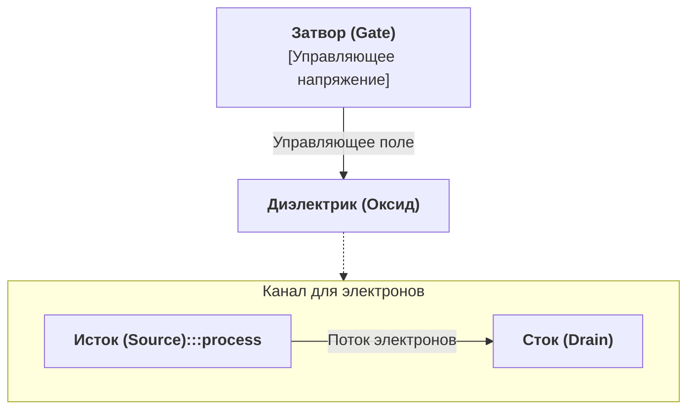
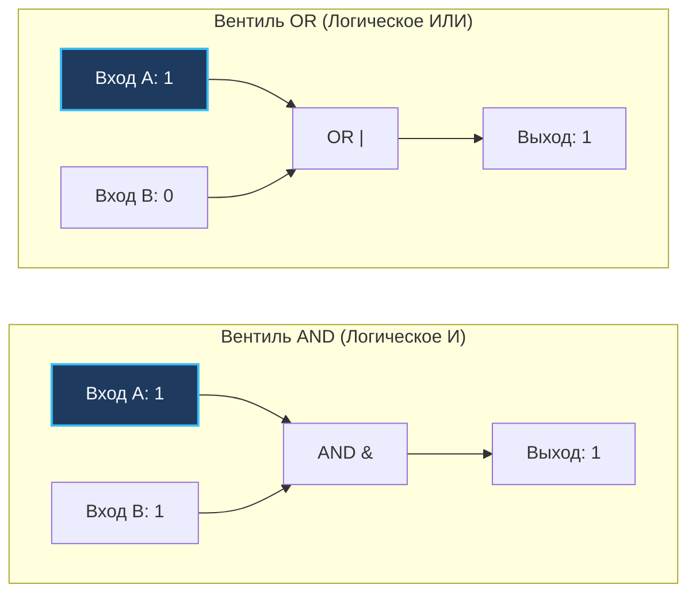

В коридорах Bell Labs в Мюррей-Хилл всегда витала особая атмосфера. Именно здесь в декабре 1947 года трое наших коллег — Джон Бардин, Уолтер Браттейн и Уильям Шокли — собрали первый в мире работающий транзистор из кусочка германия, пластиковой полоски и двух золотых контактов. Это неказистое устройство навсегда вытеснило громоздкие, раскаленные и постоянно перегорающие вакуумные радиолампы и открыло кремниевую эру.

Сегодня на кристалле размером с ноготь в вашем смартфоне или сервере упаковано более 15 миллиардов транзисторов. Когда мы пишем микросервисы на Go, мы привыкли мыслить сущностями высокого порядка: горутинами, HTTP-хэндлерами, JSON-структурами и каналами. Но процессор бесконечно далек от этих абстракций. На самом дне вычислительной машины нет ни чисел, ни букв — там существуют лишь электрические поля и законы физики твердого тела.

Чтобы понимать, как работают атомарные инструкции, почему битовые маски не имеют себе равных по скорости и за счет чего мьютекс в Go весит всего 8 байт, нам необходимо спуститься на этот фундаментальный этаж.

---

## 1. Транзистор: Микроскопический электронный кран

Подавляющее большинство современных микропроцессоров построено по технологии **CMOS (Complementary Metal-Oxide-Semiconductor / КМОП)** на базе полевых транзисторов типа **MOSFET**.

Для инженера-программиста полевой транзистор — это не квантовая головоломка, а миниатюрный, управляемый напряжением безынерционный переключатель. У него есть три вывода:

1. **Исток (Source):** Контакт, откуда электроны входят в полупроводник.
2. **Сток (Drain):** Контакт, куда электроны стремятся уйти.
3. **Затвор (Gate):** Тончайшая управляющая пластина, отделенная от кремния слоем диэлектрика (оксида кремния толщиной всего в несколько атомов).



Механика предельно наглядна:
- **Нет напряжения на затворе ($0\text{ В}$):** Кремниевый канал между истоком и стоком не проводит ток. Электроны заперты. Цепь разорвана (логический «выключатель выключен»).
- **Подали напряжение на затвор ($+0.8\dots 1.1\text{ В}$):** Электрическое поле притягивает носители заряда к границе оксида, формируя проводящий канал. Электроны свободно устремляются от истока к стоку. Цепь замкнута («выключатель включен»).

> [!info] Под капотом: Почему процессоры греются при разгоне?
> В идеальном КМОП-вентиле ток течет только в момент **переключения** состояний («0» в «1» или «1» в «0»), перезаряжая паразитную емкость затвора. Это *динамическое энергопотребление*.  
> Однако при современных размерах техпроцесса (3–5 нм) толщина диэлектрика составляет буквально 4–5 атомарных слоев. Электроны начинают просачиваться сквозь изолятор благодаря квантовому туннелированию (*токи утечки*). Поэтому современные чипы рассеивают сотни ватт тепла, даже когда ядра простаивают без вычислительной нагрузки.

---

## 2. Биты: Абстракция над аналоговым напряжением

В реальном кремнии не существует идеальных платонических нулей и единиц. Напряжение на проводнике — непрерывная аналоговая величина, подверженная шумам, наводкам и падению напряжения на сопротивлении дорожек.

Чтобы построить надежную дискретную логику, инженеры договорились о жестких диапазонах уровней напряжения (TTL / LVCMOS логика):

```
+1.2V ──┬─────────────────────────────  Логическая «1» (HIGH)
        │ Гарантированная область единицы
+0.8V ──┴─────────────────────────────
        ░░ Запретная зона (Шум / Неопределенность) ░░
+0.4V ──┬─────────────────────────────
        │ Гарантированная область нуля
 0.0V ──┴─────────────────────────────  Логический «0» (LOW)
```

**Бит** — это абстрактная математическая модель, выражающая факт: находится ли напряжение на конкретном проводнике выше верхнего порога (1) или ниже нижнего (0). Зазор между ними (запретная зона) предотвращает ложные переключения от теплового шума.

---

## 3. Логические вентили (Logic Gates)

Один транзистор — это просто выключатель. Но если объединить несколько транзисторов в элементарную схему, они начинают вычислять **булевы функции**. Эти базовые кирпичики процессора называются **логическими вентилями**.

### 3.1. Вентиль NOT (Инвертор)
Принимает на вход `1` (высокий потенциал) и выдает на выходе `0` (низкий потенциал), и наоборот. В КМОП-схемотехнике инвертор собирается всего из двух комплементарных транзисторов (один n-канальный, другой p-канальный).

### 3.2. Вентили AND (И) и OR (ИЛИ)
- **AND:** Выдает `1` на выходе только тогда, когда на входе $A$ **И** на входе $B$ присутствует `1`. В кремнии это транзисторы, включенные последовательно.
- **OR:** Выдает `1`, если хотя бы на одном из входов ($A$ **ИЛИ** $B$) присутствует `1`. В кремнии это транзисторы, соединенные параллельно.



> [!info] Под капотом: Тайна функциональной полноты NAND и NOR
> Схемотехнически вентили **NAND** (И-НЕ) и **NOR** (ИЛИ-НЕ) изготовить проще и дешевле, чем чистые AND и OR. Например, КМОП-элемент NAND требует 4 транзистора, в то время как чистый AND требует сначала собрать NAND, а затем инвертировать его с помощью NOT (итого $4 + 2 = 6$ транзисторов).  
> Элемент NAND обладает свойством **функциональной полноты** (базис Шеффера): комбинируя исключительно вентили NAND, можно построить процессор абсолютно любой сложности — от простых сумматоров до многоядерного CPU и ячеек кэш-памяти.

### 3.3. Вентиль XOR (Исключающее ИЛИ)
Вентиль XOR возвращает `1` тогда и только тогда, когда значения на входах **различаются** ($0 \oplus 1 = 1$, $1 \oplus 0 = 1$, но $1 \oplus 1 = 0$ и $0 \oplus 0 = 0$).

Для программиста XOR — поистине волшебный инструмент:
1. Он лежит в основе двоичных сумматоров (сложение без переноса — это в точности XOR).
2. На нем держатся алгоритмы симметричного шифрования (потоковые шифры вроде ChaCha20 и AES-CTR) и хэш-функции.
3. Он позволяет мгновенно сравнивать, маскировать и инвертировать биты.

---

## 4. Mechanical Sympathy: Побитовые операции в Go

Зачем инженеру высоконагруженного бэкенда разбираться в вентилях? Дело в том, что побитовые операторы в языках программирования предоставляют **прямой доступ к вентилям процессора без промежуточных накладных расходов**.

Когда процессор выполняет арифметические операции вроде сложения `a + b`, умножения `a * b` или деления `a / b`, данные прокачиваются через сложные каскады логических матриц, требуя от 3 до 40 тактов конвейера. Побитовые же инструкции (`AND`, `OR`, `XOR`, `a ^ b`) пролетают через вентили АЛУ всего за **один такт CPU** ($0.3\text{ нс}$).

### Побитовые операторы Go: Особенности и отличия от C/C++

В Go базовый набор операторов выглядит знакомо, но имеет критически важное авторское отличие:

| Оператор Go | Название | Назначение |
|:---:|---|---|
| `&` | **AND** | Побитовое И: оставляет бит равным `1`, только если он равен `1` в обоих операндах |
| `\|` | **OR** | Побитовое ИЛИ: выставляет бит в `1`, если он равен `1` хотя бы в одном операнде |
| `^` | **XOR** (бинарный) | Исключающее ИЛИ: инвертирует бит по маске |
| `^` | **NOT** (унарный) | Побитовое отрицание: инвертирует все биты операнда |
| `&^` | **AND NOT** | **Сброс бита (Bit Clear):** уникальный оператор Go |
| `<<` | **Left Shift** | Сдвиг бит влево (эквивалентен умножению на $2^n$) |
| `>>` | **Right Shift** | Сдвиг бит вправо (эквивалентен целочисленному делению на $2^n$) |

> [!warning] Ловушка / Gotcha: Где оператор тильды (~) в Go?
> Разработчики, переходящие в Go с C, C++, Java или Python, машинально пытаются написать `~mask` для побитового отрицания и получают ошибку компиляции.  
> В Go символа `~` для инверсии нет (в современном Go тильда используется в generics для underlying types вида `~int`).  
> Роль инвертора выполняет **унарный оператор каретки**:
> ```go
> var a uint8 = 0b00001111
> var b uint8 = ^a // 0b11110000 (побитовое NOT)
> ```
> А фирменный оператор **`&^` (AND NOT)** позволяет за одну операцию сбрасывать биты по маске: выражение `a &^ b` обнуляет в `a` те биты, которые установлены в единицу в `b`. В C для этого пришлось бы писать неуклюжее `a & (~b)`.

---

## 5. Практика системного инженера: Битовые маски (Bitmasks)

Представьте, что вы проектируете сервис авторизации с множеством привилегий пользователя: чтение, запись, удаление, модерация, аудит.

Если объявить эти флаги в обычной структуре:
```go
type UserPermissions struct {
    CanRead   bool // 1 байт + padding
    CanWrite  bool // 1 байт + padding
    CanDelete bool // 1 байт + padding
    IsAdmin   bool // 1 байт + padding
}
```
Каждый `bool` займет в памяти 1 байт, а из-за правил выравнивания (struct alignment) структура может раздуться до 8 или 16 байт. Передача такой структуры в конкурентной среде потребует блокировки мьютексом.

Вместо этого системный подход упаковывает до 64 независимых флагов в одно машинное слово `uint64`, управляемое через ключевое слово `iota`:

```go
package main

import "fmt"

type Role uint8

const (
	RoleRead   Role = 1 << iota // 00000001 (1)
	RoleWrite                   // 00000010 (2)
	RoleDelete                  // 00000100 (4)
	RoleAdmin                   // 00001000 (8)
)

func main() {
	// 1. Комбинируем права через побитовое ИЛИ (OR)
	var myRole = RoleRead | RoleWrite // 00000011 (3)

	// 2. Проверяем наличие конкретного права через побитовое И (AND)
	if myRole&RoleWrite != 0 {
		fmt.Println("Доступ на запись разрешен")
	}

	// 3. Сбрасываем право на запись через AND NOT (&^)
	myRole = myRole &^ RoleWrite // 00000001 (остался только RoleRead)

	// 4. Переключаем флаг (Toggle) через XOR (^)
	myRole = myRole ^ RoleAdmin // Включили Admin:  00001001
	myRole = myRole ^ RoleAdmin // Выключили Admin: 00000001

	fmt.Printf("Итоговая битовая маска: %08b\n", myRole)
}
```

Упаковка в единое машинное слово дает колоссальное преимущество: состояние объекта можно изменять **атомарно без блокировок (lock-free)** с помощью единственной процессорной инструкции `CAS` (Compare-And-Swap).

---

## 6. Как устроен sync.Mutex в рантайме Go

Самый наглядный пример Mechanical Sympathy в исходниках самого языка Go — структура `sync.Mutex` (`src/sync/mutex.go`).

Многие новички воображают мьютекс как сложную структуру со списками очередей и системными дескрипторами. В действительности весь мьютекс Go состоит всего из двух полей:
```go
type Mutex struct {
    state int32
    sema  uint32
}
```

Все внутреннее состояние блокировки упаковано в одно 32-битное число `state`:

```
 31                          3       2          1           0
┌─────────────────────────────┬───────────┬────────────┬─────────────┐
│ Количество ждущих горутин   │ Starving  │   Woken    │   Locked    │
│       (waitersCount)        │  (голод)  │(разбужена) │(заблокирован│
│           29 бит            │   1 бит   │   1 бит    │    1 бит    │
└─────────────────────────────┴───────────┴────────────┴─────────────┘
```

В исходниках Go это описано через побитовые константы:
```go
const (
    mutexLocked = 1 << iota // 1 (бит 0)
    mutexWoken              // 2 (бит 1)
    mutexStarving           // 4 (бит 2)
    mutexWaiterShift = iota // 3 (смещение для счетчика)
)
```

Захват мьютекса без конкуренции (Fast Path) — это одна-единственная атомарная операция:
```go
// Если мьютекс свободен (state == 0), переводим бит 0 в 1 за 1 такт CPU
if atomic.CompareAndSwapInt32(&m.state, 0, mutexLocked) {
    return
}
```
Если бы авторы Go использовали отдельные поля под каждый флаг, создание тысяч мьютексов в памяти уничтожило бы кэш процессора. Упаковка в битовые маски делает мьютекс невесомым.

---

## 7. Вопросы с собеседований

> [!tip] Собеседование: Одинокое число и магия XOR
> **Вопрос:** Дан массив целых чисел, в котором каждый элемент встречается ровно дважды, кроме одного уникального. Как найти это уникальное число за $O(n)$ времени и строго $O(1)$ дополнительной памяти?  
> **Ответ:** Применить операцию XOR ко всем элементам массива последовательно.  
> **Фундаментальные свойства XOR:**
> 1. `A ^ A = 0` (любое число, примененное само к себе, аннигилирует в ноль).
> 2. `A ^ 0 = A` (ноль нейтрален при XOR).
> 3. Коммутативность и ассоциативность: порядок применения не имеет значения.  
> В результате все числа-дубликаты обратятся в `0`, и останется только уникальное значение:
> ```go
> func singleNumber(nums []int) int {
>     res := 0
>     for _, n := range nums {
>         res ^= n
>     }
>     return res
> }
> ```

> [!tip] Собеседование: Почему компиляторы обнуляют регистры через XOR?
> **Вопрос:** Почему в ассемблере x86-64 для обнуления регистра компилятор Go генерирует инструкцию `XOR AX, AX` (или `XOR EAX, EAX`), а не очевидную `MOV EAX, 0`?  
> **Ответ:** По трем причинам архитектуры CPU:
> 1. **Длина инструкции:** `XOR EAX, EAX` кодируется 2 байтами, тогда как `MOV EAX, 0` требует кодирования 32-битного непосредственного нуля (immediate value) и весит 5 байт. Это экономит место в кэше инструкций L1i.
> 2. **Разрыв ложной зависимости (False Dependency Breaking):** Процессоры с Out-of-Order исполнением на аппаратном уровне распознают `XOR reg, reg` как идиому обнуления. Декодер процессора сбрасывает зависимость по данным от предыдущих инструкций без реального ожидания результата из АЛУ (за счет переименования регистров / Register Renaming).
> 3. **Энергопотребление:** Очистка через регистровый XOR не обращается к шине данных и декодируется быстрее, чем `MOV EAX, 0`.

---

## Резюме

1. **Транзисторы** — элементарные кремниевые переключатели, управляющие потоком электронов с помощью напряжения на затворе.
2. **Биты** — абстракция над физическими порогами напряжения, защищающая логику от аналогового шума.
3. **Логические вентили (NOT, AND, OR, NAND, NOR, XOR)** — базовые булевы схемы. Вентиль NAND обладает функциональной полнотой, позволяя собрать целый компьютер из одного типа элементов.
4. **Побитовые операторы Go (`&`, `|`, `^`, `&^`, `<<`, `>>`)** — самый быстрый инструмент инженера, выполняемый за 1 такт CPU без аллокаций.
5. **Битовые маски** экономят память кэш-линий и позволяют реализовывать lock-free структуры с атомарными операциями (`CAS`), как это сделано в `sync.Mutex`.

Мы научились управлять отдельными битами. Но как научить кремний складывать числа $2 + 2$? В следующей лекции мы объединим логические вентили в комбинационные схемы и построим первый процессорный сумматор: [[3. Комбинационная логика. Учим кремний считать]].