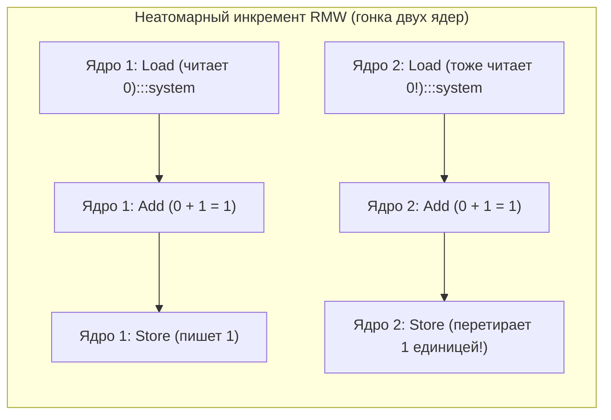
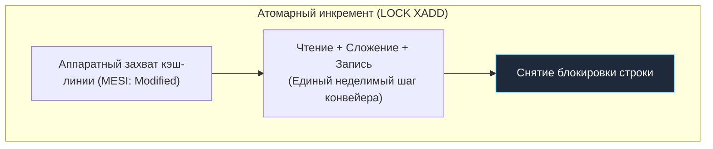

В предыдущей главе ([[22. Memory Ordering и CPU Memory Model]]) мы наблюдали за тем, как процессоры и оптимизирующие компиляторы переставляют инструкции местами, порождая трудноуловимые аппаратные аномалии. Мы выяснили, что спасением служит строгая Модель памяти Go (The Go Memory Model) и её отношение *Happens-Before*, опирающееся на каналы и мьютексы.

Но если мы заглянем в исходный код стандартной библиотеки Go (`src/sync/mutex.go` или `src/runtime/chan.go`), мы обнаружим поразительную вещь: на самом дне рантайма нет никаких «магических мьютексов». Вся многопоточность и все высокоуровневые средства синхронизации построены на крошечных, предельно быстрых кирпичиках — **Атомарных операциях (Atomic Operations)**.

Атомики — это фундамент, на котором покоится вся индустрия высокопроизводительного, неблокирующего (lock-free) бэкенда.

---

## Почему `counter++` не работает?

Вспомним классический лабораторный пример гонки данных (Data Race). Мы создаем разделяемую переменную `counter := 0` и запускаем тысячу горутин, каждая из которых ровно один раз выполняет инкремент: `counter++`. 

Вместо ожидаемой тысячи в переменной оказывается случайное число: например, `942`. Куда делись 58 инкрементов?

С точки зрения программиста, строчка `counter++` монолитна и проста.
Однако для микропроцессора это классический трехстадийный цикл **Read-Modify-Write (RMW)**. Он раскладывается на три независимые машинные инструкции (как мы видели в [[7. Цикл исполнения инструкции. Fetch, Decode, Execute]]):

1. **Чтение (Load / Fetch):** считать текущее значение `counter` из кэша L1 в регистр процессора (например, `RAX`).
2. **Модификация (Modify / Add):** прибавить число `1` к значению в регистре `RAX` внутри арифметико-логического устройства ALU.
3. **Запись (Store):** сохранить обновленный регистр `RAX` обратно в ячейку памяти кэша L1.



Пока Ядро 1 вычисляет сложение в своем ALU, Ядро 2 успевает прочитать из памяти старый ноль. Оба ядра локально получают единицу и по очереди записывают ее в одну и ту же ячейку памяти. Один из инкрементов оказывается бесследно стерт.

---

## Атомарность на уровне железа

**Атомарная операция** — это аппаратная гарантия того, что вся последовательность Read-Modify-Write выполнится как неделимая транзакция. Никакое другое ядро процессора не сможет вклиниться в этот интервал, прочитать промежуточное состояние или перезаписать данные.

Как это реализовано на физическом уровне?

В архитектуре x86-64 для превращения обычной инструкции в неделимую используется специальный ассемблерный префикс — **`LOCK`** (например, `LOCK XADDQ` или `LOCK CMPXCHG`).

> [!info] Под капотом: Эволюция префикса LOCK
> В старых процессорах (до эпохи Pentium Pro) префикс `LOCK` работал буквально и грубо: процессор выставлял электрический сигнал на специальный контакт `#LOCK` чипа, который физически **блокировал всю системную шину памяти (Bus Lock)**. Ни одно другое ядро или устройство ввода-вывода не могло коснуться оперативной памяти, пока шла операция. Это вызывало катастрофические простои.
> 
> В современных процессорах применяется элегантная **Блокировка кэш-линии (Cache Line Locking)**, тесно интегрированная с протоколом MESI (из [[20. Многоядерные процессоры и Cache Coherence]]).
> Когда ядро декодирует префикс `LOCK`, оно переводит целевую 64-байтную кэш-линию в эксклюзивное состояние **M (Modified)**. Пока инструкция не завершит фазу Store, контроллер кэша этого ядра аппаратно игнорирует любые внешние Invalidate-запросы и запросы на чтение данной строки от соседних ядер. Остальные 64-байтные блоки памяти остаются абсолютно свободными для параллельной работы!



В архитектурах ARM64 исторически применялась пара инструкций **Load-Linked / Store-Conditional (LL/SC)** — `LDXR` и `STXR` (в 32-битном ARMv7 они назывались `LDREX`/`STREX`, но в 64-битном A64 ISA эти мнемоники отсутствуют). С семантикой Acquire/Release используются варианты `LDAXR` и `STLXR`. Начиная с ARMv8.1-A, расширение LSE (Large System Extensions) добавило прямые атомарные инструкции `LDADD` и `CAS`, сделав длинные циклы LL/SC необязательными для стандартных примитивов (именно LSE активен на современных серверах AWS Graviton2/3/4).

---

## Базовые атомарные операции в Go

В языке Go низкоуровневые атомики собраны в пакете `sync/atomic`. Начиная с версии Go 1.19, стандартная библиотека пополнилась типобезопасными обертками (`atomic.Int64`, `atomic.Pointer`, `atomic.Bool`), избавившими код от опасного ручного жонглирования указателями `unsafe.Pointer`.

### 1. Fetch And Add (FAA)

Самый быстрый и прямолинейный инструмент для потокобезопасных счетчиков и метрик:

```go
package main

import "sync/atomic"

var counter atomic.Int64

func handleRequest() {
	// Атомарный инкремент без всяких мьютексов
	counter.Add(1)
}
```

Компилятор Go транслирует метод `counter.Add(1)` в одну аппаратную инструкцию: `LOCK XADDQ`. 
Она атомарно прибавляет единицу и возвращает предыдущее (или новое) значение. Однако помните о законах кэша из [[21. False Sharing и Cache Line Contention]]: при дикой конкуренции сотен горутин постоянные вызовы `counter.Add(1)` приведут к Cache Line Contention и замедлят шину.

### 2. Compare And Swap (CAS)

Инструкция **Compare-And-Swap (Сравнение с обменом)** — это абсолютная вершина инженерной мысли в многопоточности. Без неё было бы невозможно построить ни планировщик Go, ни рантайм каналов, ни современные базы данных.

Логика функции `CompareAndSwap` гениальна в своей простоте. Она принимает три параметра: адрес ячейки памяти, ожидаемое старое значение (`old`) и желаемое новое значение (`new`):
> *«Посмотри в память по указанному адресу. Если там лежит то, что я ожидал (`old`), атомарно запиши туда `new` и верни `true`. Если же кто-то другой успел изменить значение раньше меня — ничего не перезаписывай и верни `false`».*

В ассемблере x86-64 за это отвечает легендарная инструкция `LOCK CMPXCHG`.

CAS лежит в основе концепции **оптимистичных блокировок (Optimistic Concurrency Control)**. Мы не заставляем другие горутины ждать у закрытой двери (как делает мьютекс). Мы читаем данные, готовим изменения в локальной памяти, а затем пытаемся атомарно подменить результат. Если кто-то опередил нас — мы просто пробуем снова в цикле. Этот паттерн называется **CAS Loop (Цикл CAS)**.

Классический пример безопасного обновления конфигурации без единой блокировки:

```go
package main

import "sync/atomic"

type Config struct {
	Timeout int
}

var currentConfig atomic.Pointer[Config]

func updateConfigTimeout(newTimeout int) {
	for {
		// 1. Читаем текущий указатель
		oldConfig := currentConfig.Load()

		// 2. Создаем новую неизменяемую копию структуры
		newConfig := &Config{Timeout: newTimeout}

		// 3. Пытаемся атомарно подменить указатель.
		// Если за время шага 2 другая горутина обновила currentConfig,
		// CAS вернет false, и мы уйдем на повторный круг цикла.
		if currentConfig.CompareAndSwap(oldConfig, newConfig) {
			return // Успех! Конфигурация обновлена
		}
	}
}
```

> [!tip] Собеседование
> **Вопрос:** В чем фундаментальная разница между `sync.Mutex` и самодельным спинлоком (Spinlock) на базе пустого цикла с CAS? Когда что следует применять?
> 
> **Ответ:** 
> * **Spinlock (CAS-цикл):** крутится в активном цикле `for !cas() {}`, непрерывно сжигая драгоценные такты процессора (CPU Time). Если защищаемый ресурс занят, ядро будет загружено на 100%, производя бесполезное тепло. Спинлок эффективен только в том случае, если критическая секция гарантированно занимает 2–5 наносекунд — тогда мы экономим на переключении контекста ОС.
> * **`sync.Mutex` в Go:** является высокооптимизированным гибридным механизмом. Сначала он делает короткую серию быстрых попыток CAS в пользовательском пространстве (активное ожидание). Но если мьютекс не освобождается, он обращается к внутреннему семафору рантайма (`runtime.Semacquire`). Планировщик переводит горутину в состояние ожидания (паркует её), снимает с потока операционной системы и немедленно отдает ядро другой полезной работе!
> 
> **Инженерный вывод:** В прикладной бизнес-логике всегда используйте `sync.Mutex`. «Голые» CAS-циклы применимы лишь внутри специализированных низкоуровневых структур данных (например, lock-free очередей).

---

## Проблема ABA (The ABA Problem)

Там, где применяется оптимистичный CAS, программистов подстерегает классическая аномалия неблокирующих алгоритмов — **Проблема ABA**.

Она возникает в динамических структурах данных на указателях (например, в неблокирующем стеке Трайбера).

```
Временная шкала драмы ABA:
Горутина 1: Читает вершину стека -> узел [A] (адрес 0x1000). Хочет переставить на [B].
            Засыпает (планировщик снял её с выполнения).
Горутина 2: Достает из стека [A] (0x1000), удаляет [B].
Горутина 2: Создает совершенно НОВЫЙ узел [C], но аллокатор возвращает освободившийся адрес 0x1000!
            Новый узел [A'] ложится на вершину стека по старому адресу 0x1000.
Горутина 1: Просыпается. Выполняет операцию `CAS(ожидали A, ставим B)`.
            CAS видит 0x1000, думает, что ничего не изменилось, и возвращает true!
            Стек разрушен: вершина указывает на удаленный узел [B].
```

> [!warning] Ловушка / Gotcha: Сборщик мусора как спасение
> Проблема ABA — настоящее проклятие для разработчиков на C и C++. Чтобы обойти её, им приходится городить изощренные схемы: Hazard Pointers, эпоху-ориентированную утилизацию памяти (Epoch-based reclamation) или тегированные указатели с 64-битными счетчиками версий.
> 
> Однако в мире Go проблема ABA при работе с кучей практически сведена к нулю! 
> Причина — наличие **Garbage Collector (GC)**.
> Когда Горутина 1 сохраняет указатель на узел `A` в локальной переменной `oldConfig`, сборщик мусора Go видит этот указатель как живой корень (Live Root). Аллокатор памяти физически **не имеет права** переиспользовать этот адрес памяти для других объектов, пока хотя бы одна горутина помнит адрес `A`. Адрес остается уникальным на всё время жизни операции, что делает написание lock-free кода в Go значительно комфортнее и безопаснее.

*(Примечание: ABA все еще может проявиться в Go, если вы строите lock-free структуры на базе числовых индексов в массиве или пулов свободных элементов).*

---

## Экспоненциальная задержка (Exponential Backoff)

В завершение — ключевое правило Mechanical Sympathy при проектировании CAS-циклов.

Если десятки горутин на разных ядрах одновременно пытаются обновить одну и ту же переменную через CAS, возникает тяжелая конкуренция (High Contention). Постоянные неудачные попытки заваливают процессорную шину бесконечными префиксами `LOCK CMPXCHG`, порождая Invalidate-шторм. Если тысячи горутин крутят пустой цикл `for {}`, пытаясь выполнить CAS, это полностью парализует ядра.

Если CAS возвращает `false`, грубейшей ошибкой будет немедленно начинать новый круг без пауз. Идиоматичный подход требует внедрения аппаратной паузы:
- Вызов `runtime.Gosched()` передает управление планировщику Go, давая возможность поработать другим горутинам.
- На уровне ассемблера для спинлоков применяется специальная процессорная инструкция **`PAUSE`** (в x86). Инструкция `PAUSE` сообщает конвейеру ядра, что идет цикл ожидания, временно притормаживает исполнение на 10–140 тактов, снижает энергопотребление и предотвращает тяжелый сброс конвейера при выходе из цикла.

---

## Итог

1. Операция `counter++` аппаратно неатомарна и состоит из трех стадий: **Load-Modify-Store (RMW)**.
2. **Атомарные операции** делают весь цикл неделимым на уровне кремния за счет блокировки кэш-линии (префикс `LOCK` в x86, спаренные инструкции в ARM64).
3. **Fetch-And-Add (`atomic.Int64.Add`)** — эталонный способ быстрого параллельного инкремента счетчиков.
4. **Compare-And-Swap (`atomic.Pointer.CompareAndSwap`)** — основа lock-free алгоритмов, реализующая концепцию оптимистичных блокировок.
5. **Проблема ABA** в Go эффективно нивелируется Сборщиком Мусора (GC), который запрещает повторное выделение занятых адресов памяти.
6. В прикладных задачах отдавайте предпочтение **`sync.Mutex`**: в отличие от бесконечных CAS-циклов, мьютекс паркует ожидающие горутины через `runtime.Semacquire`, сохраняя ресурсы CPU.

Мы научились делать операции неделимыми (Atomicity). 
Но атомарность — это только одна сторона медали. В спецификации `sync/atomic` черным по белому написано: *«Атомарные операции создают строгие барьеры видимости памяти (Memory Ordering)»*. 

Каким образом компилятор и процессор устанавливают запреты на перестановку инструкций вокруг атомиков? Что такое семантика Acquire и Release? 

Разгадку этой тайны мы узнаем в следующей главе: [[24. Барьеры памяти. Memory Fence, Acquire, Release]].