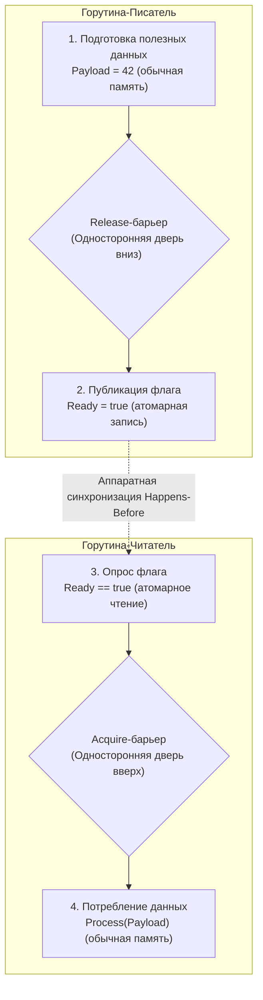

В предыдущих главах ([[22. Memory Ordering и CPU Memory Model]] и [[23. Атомарные операции. CAS, Compare And Swap, Fetch And Add]]) мы собрали два важнейших фрагмента мозаики конкурентного программирования. Мы знаем, что процессор агрессивно переставляет инструкции ради скорости (Store Buffer), и мы знаем, что атомарные инструкции с префиксом `LOCK` превращают сложение и подмену значений в неделимые транзакции.

Но здесь возникает тончайший архитектурный нюанс, отделяющий Senior-инженера от рядового разработчика.

Атомарность защищает *саму переменную*. Но как атомарная операция защищает *остальные* данные вокруг себя? 

Если мы выполняем операцию `atomic.Store`, откуда у нас уверенность в том, что процессор или компилятор не вытолкнет обычные, неатомарные записи, сделанные нами строкой выше, так, что они физически окажутся в памяти *после* атомарного флага?

Чтобы обуздать аппаратный хаос переупорядочивания, архитекторы процессоров создали инструмент наивысшей дисциплины — **Барьеры памяти (Memory Barriers / Memory Fences)**.

---

## Что такое Барьер памяти?

**Барьер памяти (Memory Fence)** — это специальная процессорная инструкция (или директива компилятора), которая возводит непроницаемую «бетонную стену» в исполнительном конвейере CPU. Никакие операции чтения или записи не имеют права пересекать эту границу ни при оптимизации компилятором, ни при спекулятивном исполнении в кремнии.

Чтобы осознать физику работы барьера, вернемся к нашему старому знакомому — аппаратному **Store Buffer** (буферу записи).

Когда ядро процессора натыкается на инструкцию полного барьера памяти (например, `MFENCE` в архитектуре x86-64 или `DMB ISH` в ARM64), оно выполняет жесткий протокол:
1. Конвейер немедленно замораживает исполнение любых последующих инструкций, обращающихся к оперативной памяти или кэшу.
2. Процессор дожидается, пока все отложенные записи, скопившиеся в очереди Store Buffer, не будут физически сброшены (flushed) в локальный кэш L1, а все сигналы инвалидации строк (по протоколу MESI) не будут подтверждены другими ядрами.
3. Только после опустошения буферов и синхронизации кэшей конвейер получает разрешение возобновить работу.

Это чрезвычайно ресурсоемкая операция. Полный барьер памяти принудительно убивает Out-of-Order Execution и парализует конвейер на десятки и сотни тактов (Pipeline Stall).

---

## Семантика Acquire и Release

Поскольку полный аппаратный барьер памяти `MFENCE` слишком дорог, ученые и инженеры разработали более тонкую, однонаправленную модель барьеров — **семантику Acquire и Release (Захват и Освобождение)**. Этот стандарт (формализованный в модели C++11 и принятый во всех современных средах, включая Go) позволяет строить молниеносные неблокирующие алгоритмы.

Представим хрестоматийный сценарий передачи полезной нагрузки (Payload) между двумя потоками через флаг готовности:



### 1. Release (Освобождение / Публикация)

Применяется при **записи** синхронизирующей переменной (флага).
* **Суть барьера Release:** это односторонняя дверь, направленная вниз. 
* Операции чтения и записи, стоящие в коде *до* барьера Release, **ни при каких условиях не могут провалиться ниже него**.
* **Физический смысл:** *«Сначала гарантированно заверши запись всей полезной нагрузки в память, вытолкни данные из Store Buffer, и только после этого делай запись флага `ready = true`»*.

### 2. Acquire (Захват / Синхронизация)

Применяется при **чтении** синхронизирующей переменной (флага).
* **Суть барьера Acquire:** это односторонняя дверь, направленная вверх.
* Никакие операции чтения и записи, стоящие в коде *после* барьера Acquire, **ни при каких условиях не могут подняться выше него** (даже спекулятивно!).
* **Физический смысл:** *«Сначала дождись фактического чтения флага `ready == true`, и только после подтверждения начинай читать саму полезную нагрузку; не пытайся читать данные спекулятивно заранее»*.

Сочетание барьера **Release** на стороне писателя и барьера **Acquire** на стороне читателя создает нерушимый мост **Happens-Before** в памяти. Читатель со 100% гарантией увидит именно те данные, которые писатель подготовил до выставления флага.

---

## Философия Go: Sequential Consistency по умолчанию

В таких языках, как C++ или Rust, инженеру предоставлен богатейший (и пугающий) арсенал настроек барьеров. При каждом обращении к атомику вы обязаны вручную передавать требуемый уровень строгости:
```cpp
atomic.store(ready, true, std::memory_order_release);
atomic.load(ready, std::memory_order_acquire);
```
Там можно выбрать и совсем слабый режим `memory_order_relaxed` ради выигрыша пары наносекунд на архитектуре ARM. Расплатой за это становятся сложнейшие гейзенбаги, которые не могут отловить даже авторы компиляторов.

**В Go разработчиков избавили от этой ментальной перегрузки.**

Создатели Go (и персонально Расс Кокс при обновлении спецификации Go Memory Model) приняли принципиальное инженерное решение:
> Все атомарные операции стандартного пакета `sync/atomic` (такие как `Store`, `Load`, `CompareAndSwap`, `Add`) по умолчанию реализуют наивысший уровень строгости — **Последовательную согласованность (Sequential Consistency / SeqCst)**.

Это означает:
- Любая операция `atomic.Store` в Go неявно несет в себе семантику **Release**.
- Любая операция `atomic.Load` в Go неявно несет в себе семантику **Acquire**.
- Все ядра процессора наблюдают глобальный, единый для всей программы порядок выполнения всех атомарных операций без разночтений.

Вам не нужно гадать, какой барьер поставить: стандартный пакет `sync/atomic` гарантирует, что неатомарные данные вокруг атомика никогда не перепутаются.

> [!info] Под капотом: x86 против ARM
> Компилятор Go генерирует машинный код барьеров с учетом микроархитектуры целевого процессора (`GOARCH`):
>
> * **x86-64 (Intel / AMD):** Модель TSO гарантирует порядок Store-Store и Load-Load. Обычный `MOV` при чтении уже обладает семантикой Acquire (Load-Load не переставляются), поэтому `atomic.Load` компилируется в обычный `MOVQ`. Однако TSO **разрешает переупорядочивание Store-Load**: запись может задержаться в Store Buffer относительно последующего чтения другого адреса. Для обеспечения полной **Sequential Consistency** (`sync/atomic` гарантирует SC по Go Memory Model 2022) `atomic.Store` компилируется **не в обычный `MOV`**, а в инструкцию **`XCHGQ`**, которая несёт неявный префикс `LOCK` и сбрасывает Store Buffer:
>   ```asm
>   // src/internal/runtime/atomic/atomic_amd64.s
>   TEXT ·Store64(SB), NOSPLIT, $0-16
>       MOVQ    ptr+0(FP), BX
>       MOVQ    val+8(FP), AX
>       XCHGQ   AX, 0(BX)   // не MOVQ — XCHG аппаратно атомарен и дренирует Store Buffer
>       RET
>   ```
>   Директивы компилятора (compiler fences / SSA memory barriers) дополнительно запрещают перестановку операций на уровне оптимизатора.
> * **ARM64 (Apple Silicon / Graviton):** На процессорах с архитектурой Weak Ordering кремний требует явных указаний. Компилятор Go генерирует специализированные инструкции барьеров ARMv8: инструкцию `STLR` (Store-Release Register) для атомарной записи и инструкцию `LDAR` (Load-Acquire Register) для атомарного чтения. Эти инструкции заставляют контроллер процессора синхронизировать конвейер на уровне кремния.

---

## Мьютексы — это просто красивый фасад

Теперь мы можем до конца понять, как работает классический `sync.Mutex` в Go. Внутри структуры мьютекса находится всего одно целочисленное поле состояния: `state int32`.

1. Когда вы вызываете `mu.Lock()`, рантайм выполняет неделимую операцию `atomic.CompareAndSwapInt32`. Эта операция несет в себе **Acquire-барьер**. Она приказывает конвейеру процессора: *«Ни одна операция чтения или записи внутри критической секции не имеет права выполниться до тех пор, пока флаг захвата не установлен!»*
2. Когда вы вызываете `mu.Unlock()`, рантайм сбрасывает бит владения через `atomic.AddInt32`. Эта операция несет в себе **Release-барьер**. Она говорит процессору: *«Заверши сброс всех изменений критической секции в кэш, и только после этого освобождай мьютекс!»*

Мьютексы, `sync.RWMutex`, `sync.WaitGroup` и каналы в Go — это не какая-то отдельная магия операционной системы. Это высокоуровневые фасады, внутри которых слаженно работают атомики и барьеры памяти Acquire/Release.

---

## Double-Checked Locking: Классическая ловушка

Глубокое понимание барьеров памяти необходимо на архитектурных собеседованиях при анализе шаблона Double-Checked Locking (ленивая инициализация одиночки — Singleton).

Взглянем на наивную реализацию, которую регулярно пытаются написать кандидаты:

```go
package main

import "sync"

type Singleton struct {
	data int
}

var (
	instance *Singleton
	mu       sync.Mutex
)

// ПЛОХОЙ КОД - СОДЕРЖИТ СКРЫТУЮ ГОНКУ ДАННЫХ
func GetInstance() *Singleton {
	if instance == nil { // 1. Первая проверка (без захвата мьютекса!)
		mu.Lock()
		if instance == nil { // 2. Вторая проверка (под мьютексом)
			instance = new(Singleton) // 3. Аллокация и инициализация
		}
		mu.Unlock()
	}
	return instance
}
```

Почему этот классический код порождает катастрофу на многоядерных машинах?

Выражение `instance = new(Singleton)` аппаратно не монолитно. Оно распадается на два независимых действия:
- **Действие А:** Выделить память в куче и обнулить/инициализировать поля структуры.
- **Действие Б:** Записать полученный адрес памяти в указатель `instance`.

Внутри критической секции между действием А и действием Б **нет барьера памяти**. Компилятор или Out-of-Order процессор (особенно на ARM64) имеет полное право переставить их местами!

**Сценарий аварии в продакшене:**
1. Поток 1 заходит в `mu.Lock()`.
2. Процессор спекулятивно выполняет Действие Б — записывает адрес выделенной памяти в переменную `instance` еще до того, как поля структуры были заполнены полезными данными (Действие А отложено в Store Buffer).
3. В эту же наносекунду Поток 2 вызывает функцию `GetInstance()`.
4. Поток 2 выполняет первую проверку: `if instance == nil`.
5. Указатель `instance` **уже не равен nil**!
6. Поток 2 минует мьютекс и немедленно возвращает `instance`.
7. Поток 2 обращается к полям структуры `instance.data`, но они еще не инициализированы Потоком 1! Поток 2 считывает невалидный мусор, и сервис падает с паникой или повреждением памяти.

> [!tip] Собеседование
> **Вопрос:** Как идиоматично и абсолютно надежно решить проблему Double-Checked Locking в Go?
> 
> **Ответ:** Использовать стандартный примитив `sync.Once` (или `sync.OnceValues` / `sync.OnceFunc` в Go 1.21+).
> 
> Под капотом `sync.Once` отслеживает состояние через атомарную переменную (счетчик `done uint32`). 
> При быстром пути метод `Do()` делает атомарное чтение: `atomic.LoadUint32(&o.done)` (которое несет в себе **Acquire-барьер**). 
> В медленном пути под мьютексом выполняется тело инициализации, после чего вызывается `atomic.StoreUint32(&done, 1)` (содержащий **Release-барьер**). 
> Барьер Release на 100% гарантирует, что абсолютно все поля создаваемой структуры будут зафиксированы в памяти до того, как флаг `done` станет равен единице.

---

## Итог

1. **Барьеры памяти (Memory Fences)** принудительно упорядочивают операции чтения и записи в конвейере процессора, предотвращая опасные перестановки в Out-of-Order движках.
2. Семантика **Release** действует при публикации: все предшествующие записи гарантированно дойдут до кэша до момента публикации флага.
3. Семантика **Acquire** действует при чтении: никакие последующие чтения не начнутся спекулятивно раньше чтения флага.
4. В Go все операции пакета `sync/atomic` по умолчанию работают в режиме **Sequential Consistency**, выступая строгими барьерами Acquire/Release и формируя неразрывные цепочки **Happens-Before**.
5. На архитектуре **x86-64** барьеры памяти практически бесплатны благодаря строгой аппаратной модели TSO; на процессорах **ARM64** компилятор Go защищает порядок с помощью специальных инструкций `STLR` и `LDAR`.
6. Попытки самодельной синхронизации без барьеров (например, наивный Double-Checked Locking) приводят к чтению полу-инициализированных объектов. Для ленивой инициализации используйте `sync.Once`.

Мы детально рассмотрели физику памяти: кэши, шины, атомики и барьеры. Но до сих пор мы рассматривали переменные как абстрактные байты.
В реальности же код на Go состоит из структур `struct`. И то, как вы расположите поля внутри структуры, может увеличить объем потребляемой оперативной памяти на десятки процентов и заставить процессор делать двойную работу при каждом чтении!

Почему порядок полей в `struct { a byte; b int64; c byte }` — это архитектурная диверсия против подсистемы памяти?

Ответы ждут нас в следующей главе: [[25. Выравнивание данных, Padding и Struct Layout]].