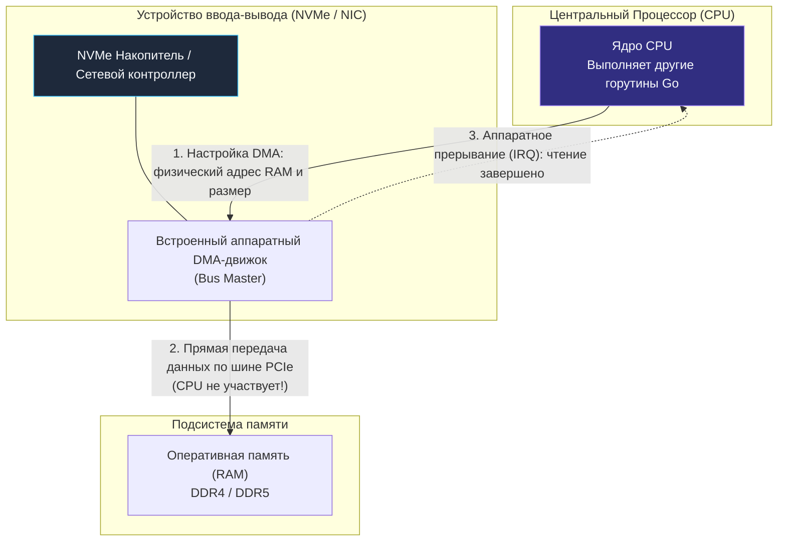

## Проблема: Процессор слишком дорогой грузчик

В предыдущей главе [[34. Аппаратные прерывания и Системные вызовы]] мы восхищались элегантностью планировщика Go. Когда горутина совершает системный вызов для чтения файла или ожидания сетевого пакета, рантайм паркует ее, а освободившееся процессорное ядро немедленно переключается на полезную вычислительную работу других горутин.

Затем происходит привычная для нас «инженерная магия»: накопитель считывает данные, контроллер генерирует аппаратное прерывание, и спящая горутина просыпается, держа в руках готовый слайс байтов `[]byte`.

Но давайте на секунду остановимся и зададим себе простой детский вопрос в духе Ричарда Фейнмана. 

Представьте: массивный видеофайл размером в 1 Гигабайт лежал на микросхемах флэш-памяти SSD-накопителя. Теперь этот гигабайт аккуратно разложен по ячейкам оперативной памяти (RAM) в адресном пространстве вашей Go-программы. 
**Кто физически переместил этот миллиард байт по системной плате компьютера, если центральный процессор (CPU) в этот самый момент был занят исполнением совершенно другого кода?**

Неужели на материнской плате есть еще один тайный процессор? 

Ответ утвердительный. Архитектура современных компьютеров держится на специализированной подсистеме ввода-вывода (IO) и фундаментальной технологии, избавившей CPU от рабского ручного труда.

---

## Наивный подход: Programmed IO (PIO)

На заре развития вычислительной техники — в эпоху первых мейнфреймов и персональных компьютеров 1970–1980-х годов — процессоры делали абсолютно всё своими руками. Этот примитивный режим прямого взаимодействия назывался **PIO (Programmed Input/Output — Программируемый ввод-вывод)**.

В режиме PIO периферийные контроллеры были глупыми регистрами, подключенными к шине. Если операционной системе требовалось прочитать с жесткого диска сектор объемом всего 512 байт, центральный процессор входил в жесткий ассемблерный цикл:
1. Посылал команду контроллеру диска через инструкции `IN`/`OUT`.
2. В цикле активного ожидания проверял бит готовности порта (тот самый `busy wait`).
3. Считывал один байт (или машинное слово) из порта контроллера в свой внутренний регистр (аккумулятор `ALU`).
4. Записывал этот байт из регистра процессора в ячейку оперативной памяти.
5. Инкрементировал счетчик и повторял этот цикл еще 511 раз.

```
В РЕЖИМЕ PIO:
[ДИСК] ---> (байт за байтом) ---> [РЕГИСТРЫ CPU / ALU] ---> (байт за байтом) ---> [RAM]
                   ВЕСЬ ЦЕНТРАЛЬНЫЙ ПРОЦЕССОР ЗАБЛОКИРОВАН!
```

Это было чудовищно неэффективно. Представьте выдающегося академика, профессора математики, которого наняли проектировать космический корабль, но вместо расчетов заставили вручную таскать кирпичи со склада на стройку. 

При передаче файла размером в 1 ГБ суперскалярный конвейер процессора был на 100% парализован банальной пересылкой байтов. Компьютер намертво зависал: курсор мыши замирал, музыка заикалась, а многозадачность превращалась в фикцию.

Компьютерной индустрии требовалось срочно делегировать эту черновую работу аппаратному грузчику.

---

## DMA: Direct Memory Access

Спасением архитектуры стала технология **DMA (Direct Memory Access — Прямой доступ к памяти)**.

**DMA** — это аппаратный механизм, позволяющий устройствам ввода-вывода (контроллерам NVMe-дисков, сетевым адаптерам, графическим процессорам) читать и записывать блоки данных напрямую в оперативную память (RAM), **минуя регистры и вычислительные ядра CPU**.

В старых архитектурах (IBM PC/AT) на материнской плате распаивался выделенный микрочип — контроллер прямого доступа к памяти (**DMAC**, например, легендарный Intel 8237). 

В современных компьютерах и серверах каждый контроллер ввода-вывода оснащен собственным встроенным DMA-движком. Этот механизм называется **Bus Mastering** (Управление шиной): контроллер периферийного устройства сам захватывает права ведущего узла на системной шине и самостоятельно гонит данные в контроллер оперативной памяти.

### Как работает DMA под капотом

Давайте проследим по шагам, что происходит в недрах сервера, когда в вашей Go-программе выполняется вызов:
```go
data, err := os.ReadFile("data.txt")
```

1. **Инициализация (CPU работает микросекунды):** Горутина совершает системный вызов. Ядро Linux берет управление, находит файл и переводит логические блоки в физические адреса на накопителе. Ядро программирует DMA-движок диска, передавая ему крошечную структуру (дескриптор DMA):
   * Откуда читать: начальный сектор/LBA на диске;
   * Куда писать: физический адрес буфера в памяти RAM;
   * Размер: сколько байт требуется скопировать.
2. **Переключение и освобождение (CPU абсолютно свободен):** Запрограммировав контроллер, ядро операционной системы не ждет! Оно переводит поток горутины в состояние сна и возвращает управление планировщику Go. Рантайм Go немедленно отдает процессорное ядро другой горутине, которая считает бизнес-логику.
3. **Передача данных (Работает только DMA):** Контроллер диска самостоятельно вычитывает страницы из flash-памяти и по скоростной шине `PCIe` транслирует пакеты данных напрямую в контроллер оперативной памяти (DRAM Controller). Ядро CPU в этот момент не тратит ни одного такта!
4. **Завершение (Аппаратное прерывание):** Когда последний байт передан в оперативную память, DMA-контроллер генерирует электрический сигнал на линии прерывания (**IRQ** — Interrupt Request) процессора.
5. **Пробуждение (CPU принимает эстафету):** Процессор на доли микросекунды прерывает текущую работу, обработчик прерываний ядра Linux фиксирует успешное завершение ввода-вывода, планировщик Go через `sysmon` или селектор `epoll` будит исходную горутину, и она продолжает выполнение с готовым слайсом в руках.



> [!warning] Ловушка / Gotcha
> **Проблема когерентности кэшей (Cache Coherence) при DMA**  
> Представьте опасную коллизию: процессор недавно читал данные из памяти, и строка осталась в его сверхбыстром кэше `L1`. В этот момент сетевая карта через DMA записывает новый входящий HTTP-пакет *прямо в микросхемы физической памяти RAM* по тем же самым адресам.  
> Если процессор снова прочитает этот адрес из своего кэша `L1`, он увидит старые, невалидные данные! 
> 
> Чтобы исключить подобные рассинхронизации, архитектура x86-64 аппаратно поддерживает **Snooping** (подслушивание шины). Контроллер шины и контроллер памяти непрерывно отслеживают транзакции DMA. Когда DMA пишет в ячейку памяти, сигнал когерентности принудительно инвалидирует соответствующие кэш-линии (**Cache Lines**, см. [[18. Кэши CPU. L1, L2, L3 и Cache Line]]) во всех кэшах процессора. Это обеспечивает корректность данных, но создает дополнительный микроархитектурный трафик на внутренних шинах CPU.

---

## Mechanical Sympathy: Zero-Copy и io.Copy

Глубокое понимание DMA кардинально меняет подход инженера к проектированию сервисов, занимающихся передачей файлов, проксированием сетевого трафика или раздачей статического контента.

Рассмотрим классическую задачу: веб-сервер на Go должен отдать клиенту видеофайл или тяжелый архив по TCP-сокету. 

Наивный код, который часто пишут новички:
```go
data, _ := os.ReadFile("video.mp4") // Шаг 1: читаем весь файл в память
conn.Write(data)                    // Шаг 2: отправляем слайс в сетевой сокет
```

С точки зрения железа и технологии DMA этот невинный код порождает скрытую системную катастрофу — **4 копирования данных и 4 переключения контекста**:

1. **DMA Copy (Диск -> Буфер ядра):** DMA-контроллер накопителя считывает файл с диска в буфер дискового кэша ядра операционной системы (Page Cache).
2. **CPU Copy (Буфер ядра -> User Space):** Центральный процессор вручную копирует байты из памяти ядра в пользовательскую память вашей Go-программы (`[]byte`).
3. **CPU Copy (User Space -> Буфер сокета ядра):** При вызове метода `Write()` процессор снова вручную копирует те же самые байты из пользовательского слайса обратно в буфер сетевого сокета ядра ОС.
4. **DMA Copy (Буфер сокета ядра -> Сетевая карта):** Сетевой DMA-движок забирает байты из буфера сокета и передает их по шине в сетевую карту для отправки в кабель.

```
НАИВНЫЙ ПОДХОД (4 КОПИРОВАНИЯ):
[Диск] --(1. DMA)--> [Page Cache Ядра] --(2. CPU Копирование)--> [Слайс в Go (User Space)]
                                                                          |
[Сетевая карта] <--(4. DMA)-- [Буфер Сокета Ядра] <--(3. CPU Копирование)-+
```

Процессор дважды выполнил тяжелейшую бессмысленную работу по перетаскиванию миллионов байт из одной области оперативной памяти в другую. В процессе он полностью забил и вымыл кэши `L1/L2`, потратив драгоценные миллионы тактов, которые могли пойти на полезную работу!

### Спасение: системный вызов sendfile и Zero-Copy

Современные операционные системы предоставляют системный вызов `sendfile` (а также `splice`), реализующий парадигму **Zero-Copy** (Нулевое копирование со стороны CPU).

В стандартной библиотеке Go этот механизм элегантно упакован в функцию `io.Copy()`:
```go
file, err := os.Open("video.mp4")
if err != nil {
    return err
}
defer file.Close()

// Передача данных без участия CPU!
_, err = io.Copy(conn, file)
```

> [!tip] Собеседование
> **Вопрос:** Чем вызов `io.Copy(conn, file)` принципиально отличается от ручного чтения в циклический буфер и записи в сокет? Почему на отдаче больших файлов это работает в разы быстрее и экономит ресурсы?
> **Ответ:** Когда аргументами `io.Copy` выступают файловый дескриптор `*os.File` и сетевое соединение `*net.TCPConn`, рантайм Go распознает системные интерфейсы (`io.ReaderFrom` / `io.WriterTo`) и под капотом транслирует операцию в специализированный системный вызов ядра Linux — `sendfile(2)`.
> 
> В режиме `sendfile` ядро операционной системы командует DMA-контроллеру накопителя перенести данные в Page Cache, а затем передает сетевому DMA-контроллеру указатели (дескрипторы страниц) прямо из кэша памяти ядра.  
> **Копирование силами CPU (CPU Copy) полностью исключено.** Центральный процессор вообще не касается самих данных (`payload`), не перемещает их через свои регистры и не загрязняет кэш `L1`. Всю тяжелую работу выполняют два аппаратных DMA-движка на шине PCIe.  
> 
> Именно благодаря Zero-Copy высокопроизводительные серверы вроде **Nginx** или оптимизированные сервисы на Go способны раздавать десятки гигабит трафика в секунду, утилизируя процессор всего на 1–2%!
>
> > [!warning] Ловушка: TLS обнуляет Zero-Copy
> > Оптимизация `sendfile` работает только для **открытых TCP-сокетов** (`*net.TCPConn`). При HTTPS-трафике соединение проходит через `crypto/tls.Conn` — и шифрование требует, чтобы CPU явно читал каждый байт полезной нагрузки в User Space для шифрования. В этом случае `io.Copy` автоматически возвращается к стандартному буфферизованному копированию через промежуточный буфер (~32 КБ). Zero-Copy для TLS-соединений работает только при поддержке кTLS (Kernel TLS) в ядре Linux и соответствующей настройке `net.Conn`.

---

## Итог

Подведем инженерные итоги нашего знакомства с подсистемой прямого доступа к памяти:

1. **Без DMA процессор был бы парализован**: Примитивный режим программируемого ввода-вывода (PIO) блокировал конвейер CPU на время передачи каждого машинного слова.
2. **DMA (Direct Memory Access)** делегирует рутинную пересылку байтов аппаратному движку в контроллере устройства (`Bus Mastering`), позволяя периферии писать напрямую в физическую память (RAM).
3. **Роль CPU сводится к координации**: Процессор лишь настраивает дескриптор DMA (указывая адрес в RAM и объем передачи) и возвращается к исполнению горутин Go, пока не получит аппаратное прерывание (`IRQ`).
4. **Аппаратная когерентность (Snooping)**: Контроллеры следят за транзакциями DMA, автоматически инвалидируя устаревшие строки в кэшах процессора.
5. **Zero-Copy и `io.Copy`**: Понимание архитектуры DMA позволяет исключить паразитные фазы копирования данных процессором между пространством ядра и пользователя, снижая накладные расходы при сетевой передаче файлов до нуля.

Периферийные контроллеры и оперативная память общаются напрямую через DMA. Но по каким физическим рельсам текут эти терабайты данных в современных серверах? Какая шина обеспечивает пропускную способность в десятки гигабайт в секунду для накопителей и сетевых адаптеров?

В следующей лекции мы разберем главную магистраль современного компьютера: [[36. PCIe. Как устройства общаются с CPU]].