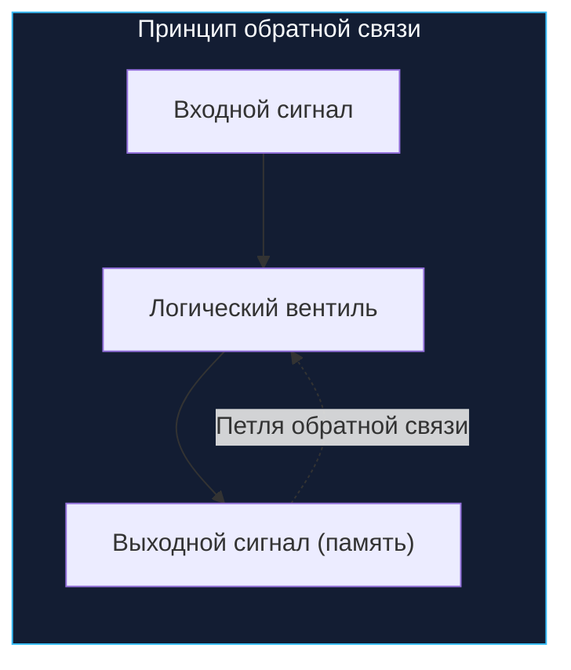
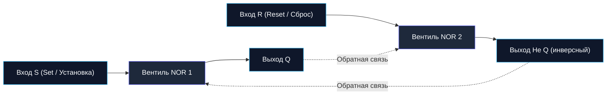
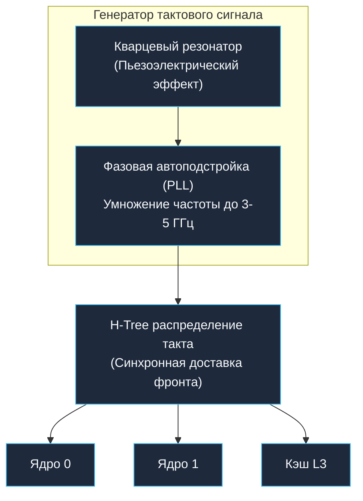
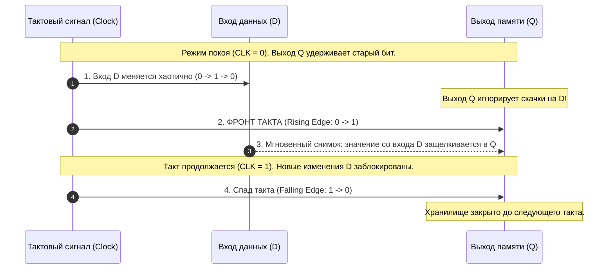
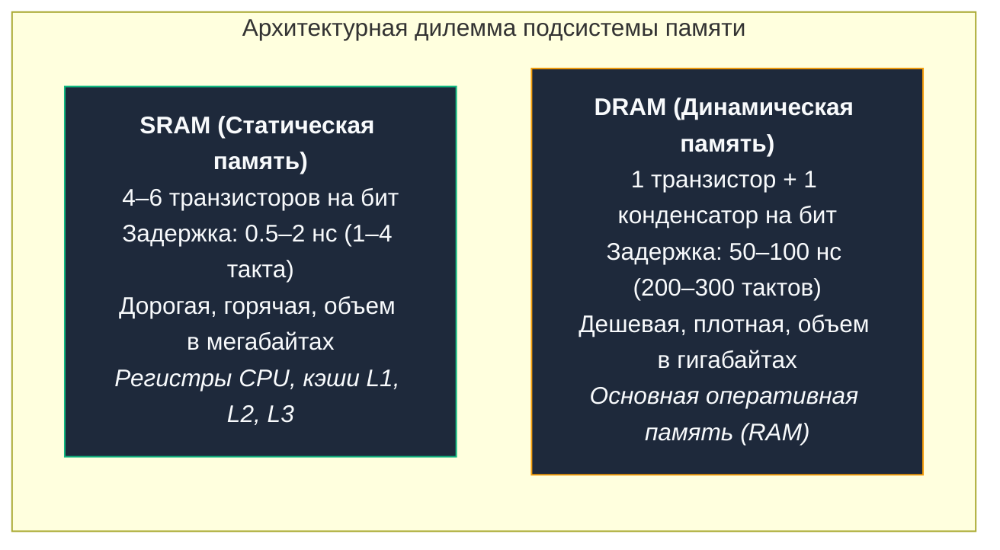

В предыдущей главе [[3. Комбинационная логика. Учим кремний считать]] мы собрали из базовых логических вентилей сумматор и арифметико-логическое устройство (ALU). Это впечатляющие инженерные конструкции, но у них есть одно фатальное ограничение: **полная амнезия**.

Комбинационная логика подобна горному водопаду: пока на вход льется вода (подается напряжение), на выходе крутятся лопасти турбины (вычисляется результат). Но стоит перекрыть вентиль — и поток иссякает, не оставляя и следа. На выходе схемы значение мгновенно исчезает, как только исчезли входные сигналы.

Представьте, что вам предложили написать высоконагруженный бэкенд на Go, в котором строго запрещено использовать переменные в памяти — разрешены только чистые математические функции. Вы не можете выполнить элементарный инкремент счетчика запросов:
```go
i++ // i = i + 1
```
Почему? Потому что операция `i++` требует времени и последовательности:
1. Прочитать текущее значение переменной `i`.
2. Подать его в сумматор ALU и вычислить `i + 1`.
3. **Запомнить** полученный результат в той же ячейке `i`, перезаписав старое значение.

Если у кремния нет памяти, новому результату просто негде ждать следующей инструкции. Чтобы превратить калькулятор в полноценный компьютер, способный выполнять циклы, сохранять состояние сессий пользователей и манипулировать структурами данных, нам необходимо научить кремний главному свойству интеллекта — памяти. 

Добро пожаловать в мир **последовательностной логики (Sequential Logic)**, где выходной сигнал зависит не только от того, что подано на вход *прямо сейчас*, но и от всей предыстории системы.

---

## Обратная связь: Замыкание петли

Как заставить электрическую цепь, состоящую из кремниевых ключей, помнить сигнал, если источник этого сигнала уже отключен?

Ответ на этот вопрос в середине XX века перевернул радиотехнику и теорию управления: **нужно направить выход схемы обратно на ее собственный вход**. Этот фундаментальный принцип называется **обратной связью (Feedback Loop)**.

Каждый из нас встречался с акустической обратной связью на концертах или конференциях: если поднести включенный микрофон слишком близко к звуковой колонке, звук из колонки попадает в микрофон, усиливается, снова выходит из колонки — и зал оглушает резкий, непрерывный пронзительный свист. Система «зациклилась» и поддерживает колебания сама по себе, даже если в микрофон больше никто не говорит.

В цифровой схемотехнике обратная связь работает аналогично, но вместо звука мы закольцовываем логические уровни напряжения `0` и `1`.



Соединив вентили определенным образом, мы получаем так называемую **бистабильную ячейку (bistable multivibrator)** — схему, обладающую двумя устойчивыми состояниями равновесия. Она может сколь угодно долго оставаться в состоянии «0» или в состоянии «1», пока внешний импульс не заставит ее переключиться.

---

### SR-триггер: Рождение бита

Простейшим практическим воплощением бистабильной ячейки является **SR-триггер (Set-Reset Latch)**. Его можно собрать всего из двух вентилей NOR (ИЛИ-НЕ), соединенных крест-накрест.

Вспомним таблицу истинности вентиля NOR: на выходе появляется `1` тогда и только тогда, когда на обоих входах нули. Если хотя бы на одном входе есть `1`, на выходе гарантированно будет `0`.

Соединим выход первого вентиля NOR со входом второго, а выход второго — со входом первого:



У SR-триггера есть два входа управления и два взаимодополняющих выхода:
- Вход **S (Set / Установка):** приказ запомнить единицу.
- Вход **R (Reset / Сброс):** приказ сбросить ячейку в ноль.
- Выход **`Q`:** основное хранимое значение бита.
- Выход **`Не Q`** ($\overline{Q}$): инвертированное значение (если `Q` = `1`, то `Не Q` = `0`, и наоборот).

#### Как работает сохранение бита по шагам

1. **Запись единицы (Set):**
   Подадим на вход $S = 1$, а на $R = 0$.
   Вентиль NOR 1 видит единицу на входе $S$ и выдает на выход $Q = 0$... Стоп, в инверсной схемотехнике NOR-триггера выход NOR 1 часто называют $\overline{Q}$. Давайте проследим:
   Если подать $S = 1$: выход первого вентиля становится `0`. Этот `0` по проводу обратной связи летит на вход NOR 2. У NOR 2 на входе $R = 0$ и от обратной связи $0$. Оба входа равны `0`, значит его выход становится `1`! Это наш рабочий выход `Q`. Выход `Q = 1` по второму проводу возвращается на NOR 1, подтверждая его ноль.
2. **Хранение (Latch):**
   Теперь убираем сигнал со входа: $S = 0$, $R = 0$.
   Что происходит? Выход `Q` по-прежнему равен `1`, и этот сигнал непрерывно поступает на вход NOR 1, удерживая его выход в `0`. А этот `0` удерживает выход NOR 2 в состоянии `1`.
   **Схема запомнила бит!** Внешнего воздействия больше нет ($S=0, R=0$), но ток циркулирует по замкнутому кольцу, бесконечно освежая собственное состояние.
3. **Сброс в ноль (Reset):**
   Подаем $R = 1$ при $S = 0$.
   Выход `Q` немедленно падает в `0`. Обратная связь передает этот `0` на NOR 1. На NOR 1 оба входа теперь нули ($S=0$ и feedback $0$), поэтому выход $\overline{Q}$ становится `1`. Эта единица поступает на NOR 2, надежно блокируя `Q` в нуле.
   Снимаем сигнал сброса ($R=0$). Схема остается в стабильном состоянии `Q = 0`.

| S (Set) | R (Reset) | Состояние Q | Состояние Не Q | Режим работы |
|:---:|:---:|:---:|:---:|:---|
| `0` | `0` | $Q_{prev}$ | $\overline{Q}_{prev}$ | **Хранение (Память)** — держит предыдущий бит |
| `1` | `0` | `1` | `0` | **Запись 1 (Set)** |
| `0` | `1` | `0` | `1` | **Запись 0 (Reset)** |
| `1` | `1` | `0` | `0` | **Запрещенное состояние (Неопределенность!)** |

> [!warning] Ловушка / Gotcha: Запрещенное состояние и аппаратная гонка (Metastability)
> Что произойдет, если мы одновременно подадим единицы на оба входа: $S = 1$ и $R = 1$?
> Оба вентиля NOR увидят единицу на своих входах и синхронно выставят нули на выходах: `Q = 0` и `Не Q = 0`. Но ведь по определению эти выходы обязаны быть строго противоположными!
> Настоящая катастрофа наступает в момент, когда мы одновременно снимем эти сигналы обратно в `0-0` (режим хранения). 
> Вентили начнут «соревноваться» друг с другом в скорости переключения (состояние аппаратной гонки, Race Condition). Если один транзистор окажется на пару пикосекунд быстрее другого из-за микроскопической разницы в кремнии или температуре, триггер свалится либо в `0`, либо в `1`. 
> Хуже того: напряжение может на доли наносекунды зависнуть ровно посередине между логическим нулем и единицей (около $0.6\dots 0.8\text{ В}$). Это явление называется **метастабильностью (Metastability)** — шарик застыл на острие бритвы. Пока триггер метастабилен, подключенные к нему схемы могут интерпретировать его значение непредсказуемо, порождая тихие фантомные сбои в вычислениях.

---

## Тактовый сигнал: Пульс процессора

Асинхронный SR-триггер прекрасен в лаборатории, но в реальном кристалле микропроцессора работают сотни миллионов таких ячеек, соединенных километрами кремниевых дорожек.

Сигналы не распространяются мгновенно. Из-за разной длины проводников, разного количества логических вентилей на пути сигнала и вариаций емкостей транзисторов сигналы приходят в разные блоки с разной задержкой. Во время вычислений в комбинационных блоках возникают временные паразитные всплески (так называемые **глюки / glitches**). Если бы ячейки памяти реагировали на входы непрерывно и хаотично, процессор моментально захлебнулся бы собственным шумом и испортил регистры.

Чтобы превратить хаос в гармонию, инженерам понадобился дирижер оркестра. Им стал **тактовый сигнал (Clock, CLK)**.



### Как устроен тактовый генератор?
На материнской плате установлен крошечный герметичный металлический бочонок — **кварцевый резонатор**. Под действием электрического напряжения кристалл кварца деформируется и вибрирует с филигранной физической стабильностью (пьезоэлектрический эффект), генерируя базовый опорный пульс (например, $100\text{ МГц}$).

Внутри кристалла процессора специальная схема — **PLL (Phase-Locked Loop, фазовая автоподстройка частоты)** — умножает эту базовую частоту в 30–50 раз, превращая ее в заветные гигагерцы.

Сигнал Clock представляет собой непрерывный меандр идеальной формы, пульсирующий между нулем и единицей: `0-1-0-1-0-1`.
Когда вы видите в характеристиках процессора частоту `4.0 GHz`, это означает:
$$f = 4.0 \times 10^9 \text{ колебаний в секунду}$$
Длительность одного такта (Clock Cycle) составляет невообразимо малые **250 пикосекунд (0.25 наносекунды)**:
$$T = \frac{1}{f} = \frac{1}{4 \times 10^9} = 0.25 \times 10^{-9} \text{ с} = 250 \text{ пс}$$

За эти 250 пикосекунд свет в вакууме успевает пролететь всего $7.5\text{ сантиметров}$, а электрический импульс в кремнии — лишь около $3\dots 4\text{ см}$! Поэтому доставка тактового импульса ко всем миллиардам транзисторов синхронно без перекоса фаз (**Clock Skew**) — один из сложнейших шедевров наноинженерии (для этого создаются сбалансированные симметричные сетки разводки в форме буквы Н — *H-tree clock networks*).

---

## D-триггер: Безопасная память

Теперь мы готовы создать главный рабочий кирпичик процессорной памяти — **D-триггер (Data Flip-Flop)**.

Он решает сразу две ключевые проблемы базового SR-триггера:
1. **Исключает запрещенное состояние:** вход данных всего один — **`D` (Data)**. Сигналы Set и Reset формируются автоматически внутри схемы: на одну сторону подается `D`, на другую — инвертированный `NOT D`. Подать `1-1` физически невозможно!
2. **Синхронизируется с пульсом CPU:** состояние захватывается строго по входу **`CLK` (Clock)**.



### Принцип работы Edge-Triggered (стробирование по фронту)
Современные D-триггеры срабатывают не просто по высокому уровню тактового сигнала, а **по фронту (Edge-Triggered)** — в кратчайший миг перехода тактового сигнала из `0` в `1` (Rising Edge / передний фронт).

Такой триггер можно представить как скоростной фотоаппарат с механическим затвором:
- Пока затвор закрыт ($CLK = 0$), перед объективом ($D$) может происходить всё что угодно — бегать кошки, падать чашки. Матрица ничего не фиксирует.
- В микросекунду щелчка затвора ($0 \to 1$) делается мгновенный снимок.
- Затвор закрывается ($CLK = 1$ или $1 \to 0$), и сделанный кадр сохраняется в памяти ($Q$).

### Временные параметры: Setup time и Hold time
Чтобы ячейка успела надежно захватить бит, входные данные должны подчиняться строгим правилам:
- **Setup Time ($t_{su}$):** данные на входе `D` обязаны стать стабильными *до* прихода фронта такта (за несколько десятков пикосекунд).
- **Hold Time ($t_h$):** данные на входе `D` обязаны оставаться неизменными *после* прихода фронта такта, чтобы триггер успел надежно захлопнуть внутреннюю петлю обратной связи.

Если комбинационная логика не успеет подготовить данные до наступления $t_{su}$ (например, сумматор ALU работал слишком медленно), триггер захватит промежуточный мусор или свалится в метастабильность. Именно сумма времени работы комбинационной логики и $t_{su}$ определяет **максимально возможную тактовую частоту любого процессора**.

---

### Программная аналогия

Если комбинационная логика из предыдущей статьи — это чистые математические функции без побочных эффектов, то D-триггер концептуально очень похож на потокобезопасную ячейку в Go, обновляемую строго по каналу-тикеру:

```go
package main

import (
	"fmt"
	"sync"
	"time"
)

// DFlipFlop эмулирует поведение аппаратного D-триггера
type DFlipFlop struct {
	mu    sync.RWMutex
	state bool // Хранимое состояние бита (выход Q)
}

// Tick эмулирует передний фронт тактового импульса (Rising Edge)
// В этот момент триггер мгновенно "фотографирует" вход D и защелкивает его в state.
func (d *DFlipFlop) Tick(data bool) {
	d.mu.Lock()
	defer d.mu.Unlock()
	d.state = data
}

// Read эмулирует чтение с выхода Q.
// В кремнии провод Q находится под потенциалом непрерывно, чтение не требует тактов!
func (d *DFlipFlop) Read() bool {
	d.mu.RLock()
	defer d.mu.RUnlock()
	return d.state
}

func main() {
	trigger := &DFlipFlop{}

	// Вход D колеблется
	trigger.Tick(true) // Поступил фронт такта: сохранили 1
	fmt.Printf("Выход Q после такта 1: %v\n", trigger.Read()) // true

	// Между тактами на вход D можно подавать что угодно,
	// но без вызова Tick() внутреннее состояние неизменно.
	fmt.Printf("Выход Q в середине такта: %v\n", trigger.Read()) // true

	trigger.Tick(false) // Следующий такт защелкнул 0
	fmt.Printf("Выход Q после такта 2: %v\n", trigger.Read()) // false
}
```

---

## Mechanical Sympathy: SRAM vs DRAM

Для бэкенд-инженера понимание физики последовательностной логики — это не академический этюд. Оно дает четкий ответ на вопрос, почему оперативная память работает в сотни раз медленнее процессора, и почему структуры на стеке работают быстрее аллокаций в куче.

В современной компьютерной индустрии существует два фундаментально разных способа хранить биты информации:



### 1. SRAM (Static RAM — Статическая память)
Это память, построенная на базе тех самых триггеров с обратной связью. Классическая ячейка 6T SRAM состоит из **6 транзисторов**: 4 транзистора образуют два перекрестно соединенных инвертора (бистабильное кольцо памяти), а 2 транзистора управляют чтением и записью.
- **Преимущества:** Молниеносная скорость. Время переключения измеряется пикосекундами. Пока подается питание, заряд не утекает, бит хранится абсолютно стабильно без посторонней помощи.
- **Недостатки:** 6 транзисторов на один-единственный бит! Это колоссальная площадь кремниевого кристалла, колоссальное энергопотребление и высокая цена. Поместить 64 гигабайта SRAM внутрь CPU невозможно — кристалл был бы размером с журнальный столик и плавился от тепла.
- **Где применяется:** Процессорные регистры (`RAX`, `RSP`), а также кэши **L1, L2 и L3**. (Подробно их внутреннее устройство мы разберем в [[18. Кэши CPU. L1, L2, L3 и Cache Line]]).

### 2. DRAM (Dynamic RAM — Динамическая память)
В 1968 году Роберт Деннард из IBM изобрел гениальный способ сэкономить кремний: ячейку 1T-1C. Вместо шести транзисторов на бит используется всего **один транзистор и один микроскопический конденсатор**.
- Логическая `1` — конденсатор заряжен.
- Логический `0` — конденсатор разряжен.
- **Преимущества:** Феноменальная плотность упаковки. На одном кремниевом чипе можно разместить десятки миллиардов ячеек. Именно поэтому мы можем купить планку DDR5 на 32 или 64 ГБ по доступной цене.
- **Недостатки:** Законы термодинамики неумолимы: микроскопические конденсаторы непрерывно разряжаются (ток утечки через p-n переход транзистора). Заряд бесследно растворяется за несколько десятков миллисекунд!  
  Чтобы данные не превратились в кашу, контроллер памяти обязан каждые $32\dots 64\text{ миллисекунды}$ выполнять процедуру **регенерации (DRAM Refresh)**: читать миллиарды ячеек, усиливать заряд и записывать обратно. Пока чип занят регенерацией (tRFC pause), он не может отвечать процессору.
- **Где применяется:** Основная оперативная память (RAM). (Мы детально изучим задержки и тайминги в [[17. Пирамида памяти. Регистры, SRAM, DRAM и цена доступа]]).

> [!info] Под капотом: Взгляд на Go Runtime через призму SRAM и DRAM
> Когда компилятор Go видит, что создаваемая переменная или структура не покидает текущую функцию, компилятор размещает ее на стеке горутины (благодаря Escape Analysis).
> Стек активной горутины почти всегда разогрет и горячим грузом оседает в кэшах L1/L2 процессора — то есть живет в молниеносных транзисторах **SRAM**. Обращение к такой переменной занимает **1–4 такта CPU (меньше 1 наносекунды)**.
> 
> Но если структура «убегает» в кучу (Heap) через интерфейс, возврат по указателю или глобальный канал, рантайм Go выделяет память через `runtime.mallocgc`. Если при обходе разрозненных указателей в куче процессор промахивается мимо всех трех уровней кэша (Cache Miss), конвейер CPU вынужден обращаться к шине DDR5. Процессор **замирает в простое на 200–300 тактов (50–80 наносекунд)**, ожидая, пока медленный конденсатор DRAM соизволит зарядить линию считывания.
> Для процессора это целая вечность: за это время он мог бы выполнить 800 арифметических инструкций!

---

> [!tip] Вопрос для собеседования: Архитектурные причины задержек
> **Вопрос:** Почему при профилировании latency-sensitive сервиса на Go оптимизация аллокаций памяти (`0 allocs/op`, переиспользование слайсов через `sync.Pool`, замена указателей на значения) дает колоссальный прирост p99-латентности, даже если сборщик мусора (GC) тратит меньше 1% CPU?
> 
> **Ответ:** Причина кроется в физике памяти. Сборщик мусора — лишь часть накладных расходов. Главная цена фрагментированных аллокаций в куче — **промахи мимо SRAM-кэшей и переходы к DRAM**. 
> Каждая разрозненная аллокация в куче заставляет CPU прыгать по несмежным адресам памяти (Pointer Chasing). На уровне железа это приводит к постоянным промахам L1/L2/L3 кэшей и задержкам на чтение конденсаторов DRAM (~60 нс). Уменьшение аллокаций удерживает рабочий набор данных (Working Set) целиком в быстрой SRAM-памяти кэша L1/L2, исключая простои вычислительного конвейера на аппаратном уровне.

---

## Итог

1. **Комбинационная логика не имеет памяти:** ее выходной сигнал существует только до тех пор, пока присутствует входной.
2. **Память в кремнии рождается из обратной связи:** если подать выход логического вентиля обратно на его вход, система замыкается в стабильное состояние (бистабильная ячейка).
3. **SR-триггер** — простейший элемент памяти из двух вентилей NOR или NAND. Имеет опасное запрещенное состояние ($S=1, R=1$), способное привести к метастабильности и неопределенному поведению.
4. **Тактовый сигнал (Clock)** — единый синхронизирующий метроном, генерируемый кварцевым резонатором и умножаемый схемой PLL. Он защищает процессор от переходного шума и паразитных импульсов.
5. **D-триггер со стробированием по фронту** защелкивает бит данных строго в момент перепада Clock ($0 \to 1$), гарантируя надежное и безопасное сохранение состояния.
6. **SRAM (на триггерах)** дает мгновенный доступ за доли наносекунды (кэши L1–L3), но требует 6 транзисторов на бит. **DRAM (на конденсаторах)** дешева и компактна, но требует постоянной регенерации и работает в сотни раз медленнее.

Теперь мы умеем не только складывать биты, но и надежно сохранять результаты в кремнии. Что будет, если объединить группу из 64 таких D-триггеров под общим тактовым проводом? Мы получим фундаментальную рабочую лошадку процессора — **машинный регистр**. 

В следующей лекции мы научим кремний считать шаги алгоритмов и переключать состояния программ: [[5. Регистры, счетчики и конечные автоматы]].