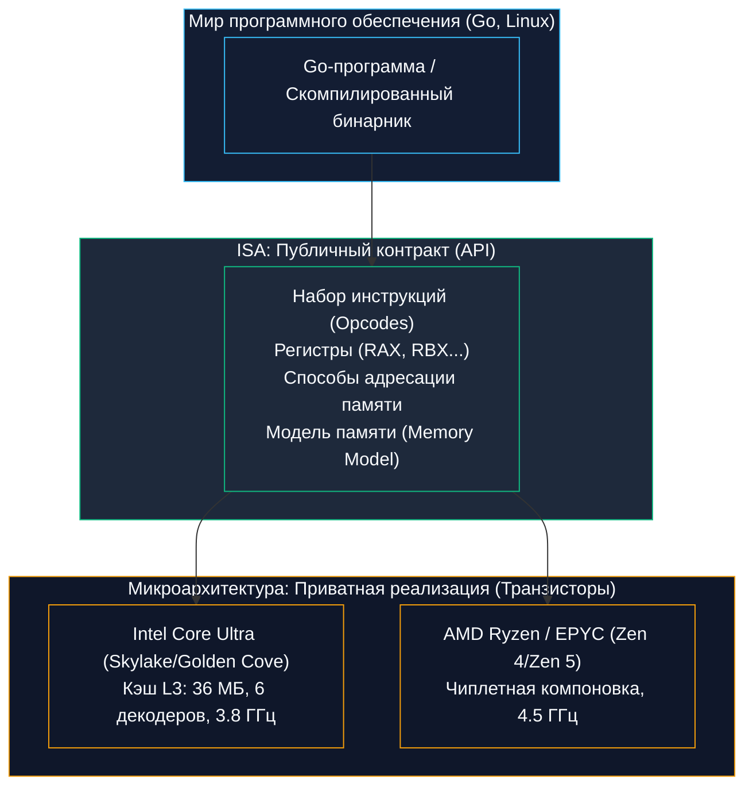
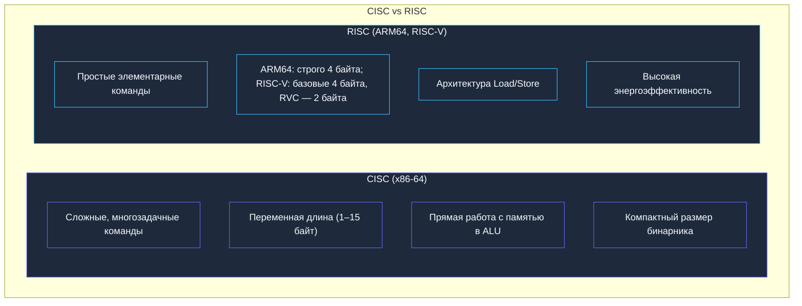
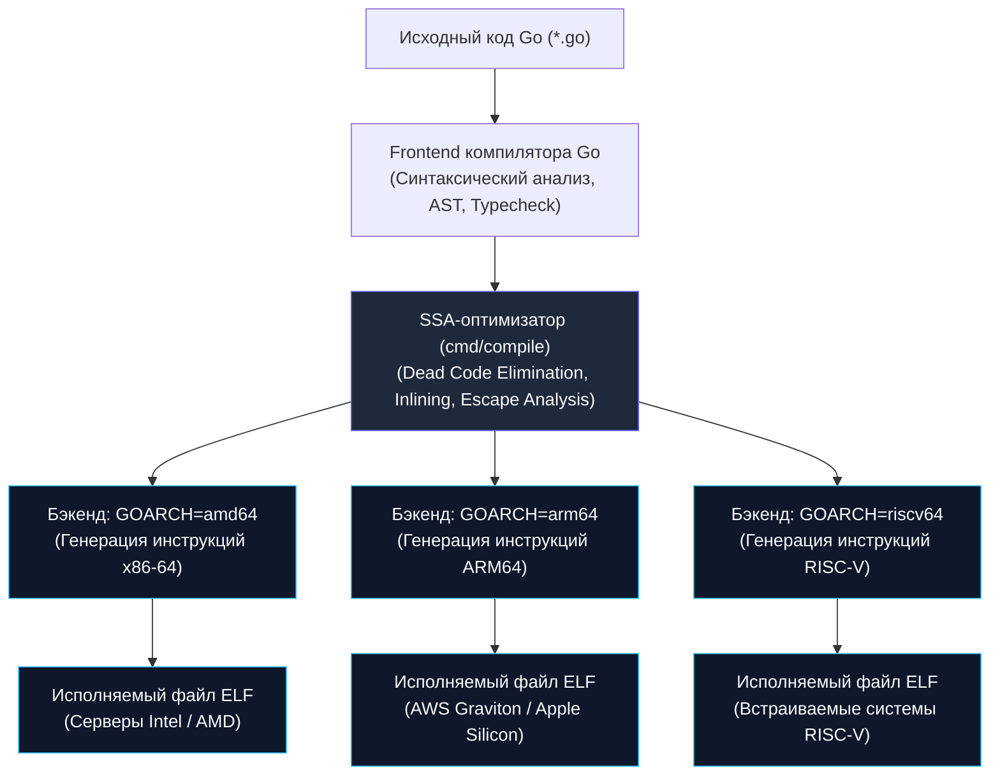

В предыдущей главе [[7. Цикл исполнения инструкции. Fetch, Decode, Execute]] мы проследили за тем, как процессор читает байты из памяти, дешифрует их и запускает вычисления. Но здесь неизбежно возникает фундаментальный вопрос: 

*Откуда процессор знает, что байт `0x01` означает сложение, а не прыжок? Кто решает, какие именно байты обязан сгенерировать компилятор Go? И почему бинарник, скомпилированный на ноутбуке с процессором Intel, без единого изменения запускается на сервере с процессором AMD, но откажется работать на сервере с процессором AWS Graviton?*

Ответ на все эти вопросы дает величайшее изобретение в истории вычислительной техники — **ISA (Instruction Set Architecture — Архитектура системы команд)**.

Если выразить суть ISA языком бэкенд-разработчика: **ISA — это официальный публичный API процессора**.

Все аппаратные узлы, которые мы кропотливо разбирали в [[6. Анатомия CPU. Datapath, Control Unit и Register File]] (размеры кэшей, ширина шин, каскады сумматоров Carry-Lookahead, мультиплексоры), — это скрытые детали приватной реализации (**микроархитектура**). Вы, как программист, не имеете к ним прямого доступа. Вы общаетесь с кремниевым кристаллом исключительно через публичный контракт — ISA.

---

## Интерфейс и Реализация

В 1964 году легендарная команда инженеров IBM под руководством Фреда Брукса и Джина Амдала представила миру мейнфрейм **IBM System/360**. До этого момента каждая новая модель компьютера проектировалась с чистого листа: менялись наборы команд, форматы чисел, разрядность регистров. Программы, написанные для старой машины, приходилось полностью переписывать под новую.

System/360 впервые разделила компьютер на два независимых слоя:
1. **Архитектуру (Architecture / ISA):** функциональное поведение процессора глазами программиста и компилятора;
2. **Микроархитектуру (Implementation):** физическое воплощение этого поведения в транзисторах, проводниках и тактовой частоте.



ISA строго регламентирует:
- **Словарь операций (Opcodes):** какие математические, логические и управляющие команды умеет выполнять чип (`ADD`, `SUB`, `MOV`, `JMP`);
- **Регистровую модель:** сколько регистров доступно коду, какова их разрядность и как они называются (например, 64-битные `RAX` в x86-64 или `X0` в ARM64);
- **Адресацию памяти:** как процессор обращается к байтам RAM (базовые смещения, сегментация, выравнивание);
- **Модель памяти (Memory Model):** разрешено ли аппаратуре переставлять местами чтение и запись данных между ядрами;
- **Обработку исключений и прерываний:** что происходит при делении на ноль или нарушении прав доступа к памяти (Page Fault).

> [!info] Под капотом: Магия совместимости Intel и AMD
> Процессоры **Intel Core i9** и **AMD Ryzen** внутри спроектированы абсолютно по-разному. У них разный состав транзисторов, разная топология кэшей L2/L3, разные планировщики микроопераций и разная физическая компоновка (монолитный кристалл у Intel против чиплетной компоновки у AMD). 
> 
> Однако оба чипа до последнего бита поддерживают единый стандарт — **ISA `x86-64` (AMD64)**.
> 
> Именно благодаря этому триумфу абстракции один и тот же бинарный файл, собранный компилятором Go под `amd64`, будет байт-в-байт одинаково работать на серверах обоих производителей. Процессоры аппаратно транслируют стандартные инструкции ISA в свои уникальные внутренние микрооперации ($\mu$ops).

---

## Два лагеря: CISC vs RISC

За полувековую историю микропроцессоров в схемотехнике сформировались две главные философские школы, с противостоянием которых сегодня сталкивается любой бэкенд-инженер.



---

### 1. CISC (Complex Instruction Set Computer)
- **Флагманские представители:** Архитектура `x86` и `x86-64` (Intel, AMD).
- **Исторический контекст:** Появилась на заре микроэлектроники (процессор Intel 8086 в 1978 году). В те времена оперативная память стоила баснословных денег, а компиляторы были примитивными. Инженеры стремились сделать инструкции как можно мощнее, чтобы одна строка на ассемблере выполняла целую последовательность действий.
- **Особенности:**
  - **Богатейший словарный запас:** Более 1 500 инструкций. Одна команда может одновременно загрузить число из RAM, сложить его с регистром и отправить результат обратно в память (`ADD [RBP-8], RAX`).
  - **Переменная длина инструкций:** Команды x86 могут занимать от **1 до 15 байт**. Это обеспечивает высочайшую плотность машинного кода (бинарники получаются компактными), но превращает блок аппаратного декодирования инструкций в сложнейший и энергоемкий узел чипа.

---

### 2. RISC (Reduced Instruction Set Computer)
- **Флагманские представители:** `ARM64` (AArch64 — чипы Apple Silicon M-серии, AWS Graviton, Ampere Altra) и открытый стандарт **`RISC-V`**.
- **Исторический контекст:** В 1980-х годах исследователи (во главе с Джоном Хеннесси из Стэнфорда и Дэвидом Паттерсоном из Беркли) доказали: 80% времени программы используют лишь 20% самых простых инструкций. Сложные инструкции только замедляют базовый тактовый цикл.
- **Особенности:**
  - **Архитектура Load/Store:** Никаких сложений прямо в оперативной памяти! Арифметика (`ADD`) выполняется **исключительно между регистрами**. Чтобы изменить число в памяти, вы обязаны явно выполнить три операции:
    1. Загрузить байты из памяти в регистр (`LOAD` / `LDR`);
    2. Выполнить математику в регистрах (`ADD`);
    3. Сохранить результат из регистра обратно в память (`STORE` / `STR`).
  - **Фиксированная длина команд:** В **ARM64** каждая инструкция занимает **ровно 4 байта (32 бита)**. Декодеру не нужно анализировать префиксы — следующий опкод гарантированно начинается через каждые 4 байта. Это позволяет делать ядра простыми, холодными и масштабируемыми до сотен ядер на один сокет в облачных ЦОД. В **RISC-V** базовые инструкции также 32-битны, однако стандартное расширение «C» (Compressed) вводит 16-битные компактные команды: они обязательны для Linux-профилей RISC-V (RVA20/RVA22) и применяются повсеместно в embedded. Тем самым RISC-V поддерживает инструкции переменной длины с шагом 16 бит, что отличает его от строго фиксированного ARM64.

---

## Go и кросс-компиляция (GOARCH)

Многие современные языки программирования абстрагируются от ISA:
- Python, Ruby и PHP исполняются интерпретатором, который берет на себя общение с ОС;
- Java и C# компилируются в промежуточный байт-код (JVM / CLR), который транслируется в инструкции процессора уже на лету (JIT-компиляция).

**Язык Go спроектирован по фундаментально иной модели.**  
Go — это компилируемый язык со статической типизацией и моделью Ahead-Of-Time (AOT). Утилита `go build` не создает виртуальных машин. Она генерирует чистейший машинный код, адресованный конкретной целевой ISA.

За выбор целевой архитектуры отвечает переменная окружения **`GOARCH`**:



Команда разработчиков Go совершила технологический подвиг: компилятор Go содержит внутри собственные независимые генераторы машинного кода для десятка архитектур (`amd64`, `arm64`, `riscv64`, `ppc64le`, `s390x`).

Вы можете сидеть за ноутбуком MacBook с процессором Apple M3 (`darwin/arm64`) и одной строчкой в терминале собрать бинарник для серверов продакшна на Intel Xeon:
```bash
GOOS=linux GOARCH=amd64 go build main.go
```
Компилятору Go не требуется запущенный Linux или процессор x86-64! Он берет платформонезависимый промежуточный граф SSA (Static Single Assignment) и напрямую нарезает байты инструкций `x86-64`, бережно упаковывая их в стандартный формат исполняемых файлов Linux ELF (Executable and Linkable Format).

---

> [!warning] Ловушка / Gotcha: Ловушка CGO и крах кросс-компиляции
> Команда `GOOS=linux GOARCH=amd64 go build` работает безупречно до тех пор, пока проект написан на **чистом Go (Pure Go)**.
> 
> Но стоит вам или любой транзитивной зависимости импортировать библиотеку, использующую C-код через **CGO** (например, популярный драйвер SQLite **`go-sqlite3`** или клиент Apache Kafka **`confluent-kafka-go`**), кросс-компиляция моментально сломается с ошибкой линковщика!
> 
> **Почему это происходит:**  
> Компилятор Go умеет компилировать только язык Go. При наличии директивы `import "C"` он вызывает внешний системный C-компилятор (`gcc` или `clang`). Но ваш локальный `clang` на macOS умеет собирать код только под родной Mac (`arm64-apple-darwin`). Чтобы собрать C-код под `linux/amd64`, вам придется настраивать сложный C-кросс-тулчейн (Cross-GCC, Musl-cross, Zig cc) или компилировать код внутри Docker-контейнера.
> 
> *Именно по этой причине опытные бэкенд-архитекторы отдают предпочтение pure-Go реализациям библиотек (например, `modernc.org/sqlite` вместо `go-sqlite3`).*

---

## Mechanical Sympathy: Псевдо-ассемблер Plan 9

Несмотря на мощь компилятора, в критических местах рантайма Go (планировщик горутин, сборщик мусора, криптография AES-GCM, быстрый хэш `runtime/map`) инженеры пишут код на чистом ассемблере вручную.

Если вы откроете исходники стандартной библиотеки Go (например, `src/runtime/sys_linux_amd64.s`), вы заметите, что местный ассемблер выглядит необычно: он не соответствует ни синтаксису Intel, ни синтаксису AT&T.

Причина кроется в корнях языка. Создатели Go — Кен Томпсон и Роб Пайк — были ключевыми разработчиками операционной системы **Plan 9** в Bell Labs. Для компилятора Go они взяли архитектуру **псевдо-ассемблера Plan 9**.

Вместо жесткой привязки к конкретным аппаратным регистрам Plan 9 вводит четыре абстрактных псевдо-регистра:
1. **`FP` (Frame Pointer):** виртуальный указатель аргументов функции. Обращение `x+0(FP)` адресует первый параметр функции независимо от того, передается ли он через стек или через регистры.
2. **`SB` (Static Base):** виртуальный глобальный указатель на статическую память. Через него адресуются имена функций и глобальные переменные: `TEXT ·MyFunction(SB), $0-16`.
3. **`SP` (Stack Pointer):** виртуальный указатель вершины локального стека горутины.
4. **`PC` (Program Counter):** псевдоним аппаратного счетчика команд.

Внутренний ассемблер Go (`cmd/internal/obj`) транслирует этот универсальный псевдокод в реальные машинные биты целевой архитектуры. Благодаря такой модульности добавление поддержки новых ISA (например, перспективной `riscv64`) в экосистему Go потребовало минимальных изменений в ядре компилятора.

---

> [!tip] Собеседование: x86-64 Strong Memory Model vs ARM64 Weak Memory Model
> **Вопрос:** Инженер разработал высокопроизводительную очередь сообщений без блокировок (Lock-Free Queue), используя атомарные операции и обычные переменные. На локальном сервере с Intel Xeon код прошел миллиарды итераций стресс-тестов без ошибок. Однако после деплоя в облако на серверы AWS Graviton (ARM64) сервис начал периодически падать с повреждением памяти (Data Race). Почему так произошло, если алгоритм одинаковый?
> 
> **Ответ:** Разные ISA имеют принципиально разный контракт на **Модель аппаратной памяти (Hardware Memory Model)**:
> 1. **Архитектура `x86-64` реализует строгую модель (Strong Memory Model / TSO — Total Store Order):**  
>    Аппаратура процессора гарантирует, что порядок операций записи в память (Store-Store) строго сохраняется. Если ядро 1 записало `A`, а затем `B`, то ядро 2 никогда не увидит `B` раньше, чем `A`.
> 2. **Архитектура `ARM64` реализует слабую модель (Weak Memory Model):**  
>    Ради максимальной пропускной способности процессор имеет право переупорядочивать независимые операции чтения и записи как ему угодно (Out-of-Order Memory Execution)! Ядро 2 на процессоре ARM может прочитать новое значение `B`, когда значение `A` все еще болтается во внутреннем буфере записи ядра 1.
> 
> На архитектуре ARM64 программист обязан явно расставлять барьеры памяти (Memory Barriers) или использовать корректные атомарные примитивы синхронизации (`sync/atomic`), заставляющие ядро сбросить очереди записи. Код на x86 работал «случайно» благодаря жестким аппаратным гарантиям чипа Intel.

---

## Итог

1. **ISA (Архитектура системы команд)** — это публичный контракт (API) между процессором и программным обеспечением. Она скрывает под собой микроархитектурные детали реализации (транзисторы, кэши, шины).
2. **CISC (x86-64):** богатый словарь сложных инструкций переменной длины (1–15 байт). Обеспечивает высокую плотность кода, но требует сложного декодера.
3. **RISC (ARM64, RISC-V):** минималистичный набор простых команд строго фиксированной длины (4 байта). Использует архитектуру Load/Store (память адресуется только через `LOAD` и `STORE`), обеспечивая непревзойденную энергоэффективность.
4. **Кросс-компиляция в Go (`GOARCH`):** компилятор Go генерирует сырой машинный код под любую поддерживаемую ISA без внешних зависимостей. Единственное препятствие — использование CGO (`go-sqlite3`, `confluent-kafka-go`), требующее сторонний C-кросс-компилятор (`clang` / `gcc`).
5. **Псевдо-ассемблер Plan 9:** фирменный промежуточный диалект ассемблера Go, использующий виртуальные регистры (`FP`, `SB`, `SP`), позволяющий писать переносимый низкоуровневый код.

Мы выяснили, что ISA — это словарь команд. Но как эти команды выглядят для человеческого глаза? Как транслируются наши лаконичные функции на Go в инструкции ассемблера, и как научиться читать этот код?

В следующей лекции мы освоим основы машинного языка: [[9. Базовый Ассемблер. Как CPU видит код]].