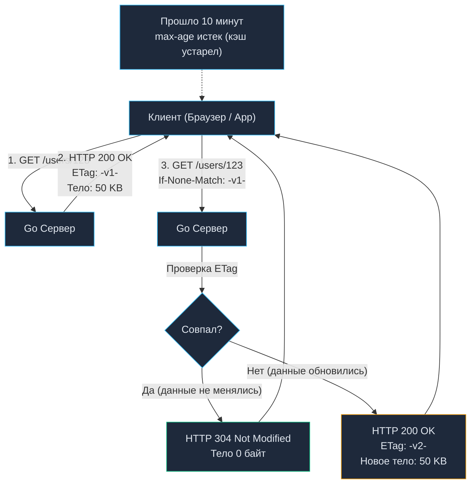

# 12. HTTP Кэширование: ETag, Cache-Control и Mechanical Sympathy

> *«Самый быстрый ввод-вывод — это тот, которого удалось вовсе избежать».*    
> — Золотое правило системной оптимизации

## Самый быстрый запрос — тот, которого не было

В предыдущих главах мы научились безопасно выбирать данные из базы данных ([[10. Pagination, filtering, sorting.md]]) и защищать инфраструктуру от перегрузок ([[11. Rate limiting в API.md]]). Но даже самый отточенный Go-код с идеальными индексами в PostgreSQL расходует физические ресурсы: такты процессора, пропускную способность шины памяти и дескрипторы сокетов.

С точки зрения **Mechanical Sympathy**, каждый входящий HTTP-запрос, добравшийся до рантайма Go, запускает целую цепочку низкоуровневых событий:
1. Сетевой поллер (`netpoller`) ядра Linux пробуждает поток через системный вызов `epoll_wait` (или `kqueue` в BSD/macOS).
2. Планировщик Go выводит горутину из состояния ожидания, вызывая переключение контекста (Context Switch) и сбивая горячие кэши CPU L1/L2.
3. Рантайм аллоцирует структуры `http.Request`, парсит заголовки в куче (Heap) и подготавливает буферы сокета.
4. Выполняется обращение к базе данных, сериализуется JSON, после чего сборщик мусора (GC) тратит такты на разметку освобожденных объектов.

В архитектуре высоконагруженных систем (HighLoad) истинное мастерство архитектора состоит в том, чтобы **вообще не пускать запрос в приложение на Go**, если запрашиваемые данные не изменились.

Эту задачу решает кэширование на уровне протокола HTTP. Грамотно выставляя стандартные заголовки, мы перекладываем отдачу гигабайтов трафика на плечи браузеров, промежуточных шлюзов (Nginx, Envoy) и распределенных сетей доставки контента (CDN — Cloudflare, Akamai, CloudFront).

---

## Анатомия HTTP Кэша: RFC 9111

Кэшируемость — это одно из фундаментальных архитектурных ограничений классического стиля REST (см. [[3. REST. Основные принципы.md]]). Исторически в протоколе HTTP существовало множество разрозненных заголовков (`Expires`, `Pragma`), однако в современной веб-инженерии управление кэшем стандартизировано спецификацией RFC 9111 (которая официально аннулировала и заменила стандарт RFC 7234) вокруг заголовка `Cache-Control`.

### Директивы Cache-Control

* **`public`**: Разрешает сохранять ответ *любому* звену в цепочке передачи (локальному браузеру клиента, корпоративному прокси, пограничному CDN Cloudflare, балансировщику Nginx). Идеально подходит для статических ресурсов и публичных справочников.
* **`private`**: Разрешает кэшировать ответ *только* конечному клиенту (браузеру или мобильному устройству). Любым промежуточным прокси и CDN **категорически запрещено** сохранять эти байты. Это критически важное правило для всех эндпоинтов, возвращающих персональные данные (профиль пользователя, баланс счета, корзина заказов).
* **`max-age=N`**: Задает время жизни ответа в секундах, в течение которого ресурс считается "свежим" (Fresh). Пока таймер не истек, клиент вообще не обращается к сети, мгновенно доставая копию из своего локального кэша в ОЗУ или на диске.
* **`s-maxage=N`** (shared max-age): Действует аналогично `max-age`, но переопределяет его значение исключительно для разделяемых промежуточных кэшей (CDN). Это позволяет задать разное время жизни: например, хранить страницу на CDN в течение часа (`s-maxage=3600`), а в браузере пользователя обновлять каждые 60 секунд (`max-age=60`).

> [!tip] Собеседование
> **Вопрос:** В чем принципиальная разница между директивами `Cache-Control: no-cache` и `Cache-Control: no-store`? (Это классический вопрос-ловушка).
> 
> **Ответ:**
> * `no-store` означает **абсолютный запрет на сохранение данных**. Ни браузер, ни CDN не имеют права записывать этот ответ на диск или держать в памяти. Применяется для финансовых операций, паролей и конфиденциальной информации.
> * `no-cache` означает: **«Кэшировать ответ разрешено, но использовать его без повторной проверки на сервере ЗАПРЕЩЕНО»**. Перед выдачей страницы клиенту кэширующий узел обязан отправить легкий валидационный запрос на сервер-источник (Conditional Request). Если данные не изменились, сервер вернет мгновенный ответ `304 Not Modified`.

---

## Валидация кэша: Conditional Requests (Условные запросы)

Что происходит, когда время `max-age` истекает? Ответ переходит в статус «устаревшего» (Stale). Но это вовсе не означает, что данные в базе данных реально изменились!

Вместо того чтобы повторно выгружать по сети весь JSON размером в несколько мегабайт, клиент отправляет **Условный запрос (Conditional Request)**, используя валидаторы. Протокол HTTP предоставляет два таких механизма: по времени и по цифровому отпечатку (хэшу).

### 1. Last-Modified / If-Modified-Since
Сервер при ответе указывает заголовок даты последней модификации:
```http
Last-Modified: Wed, 21 Oct 2026 07:28:00 GMT
```
Когда локальный кэш устаревает, клиент отправляет валидационный запрос:
```http
If-Modified-Since: Wed, 21 Oct 2026...
```
Go-сервер проверяет поле `updated_at` в базе данных. Если ресурс не менялся, сервер не сериализует JSON, а мгновенно возвращает статус [[6. Статусы HTTP.md]] `304 Not Modified` с пустым телом ответа.

### 2. ETag / If-None-Match (Индустриальный стандарт)
Валидация по времени страдает от неточностей (секундное разрешение, рассинхронизация часов, сбои при переходе на летнее время). 

Стандарт **`ETag` (Entity Tag)** использует уникальный идентификатор версии сущности — хэш-сумму контента или инкрементальный номер ревизии из базы данных:



---

## Mechanical Sympathy: Ловушка генерации ETag в Go

Понимание того, *как именно* вычисляется ETag, отличает зрелого Senior-инженера от поверхностного разработчика.

Типичная ошибка начинающих — написание HTTP-middleware, которое перехватывает поток записи `http.ResponseWriter`, собирает полный JSON в буфер памяти, считает от него SHA-256 или MD5 и сравнивает со входящим заголовком `If-None-Match`:

```go
// АНТИПАТТЕРН: Делает бесполезную работу
func ETagMiddlewareAntiPattern(next http.Handler) http.Handler {
    return http.HandlerFunc(func(w http.ResponseWriter, r *http.Request) {
        // Мы уже сходили в БД, уже аллоцировали структуры, 
        // уже потратили время GC на сериализацию JSON!
        body := generateHeavyJSON() 
        hash := calculateMD5(body)
        
        if r.Header.Get("If-None-Match") == hash {
            w.WriteHeader(http.StatusNotModified)
            return // Мы сэкономили трафик, но сожгли CPU!
        }
        w.Write(body)
    })
}
```

**В чем архитектурная ущербность этого подхода?**  
Вы сэкономили исходящую пропускную способность сети (Bandwidth), вернув `304 Not Modified`, но вы **не сэкономили ни единого такта CPU и ни байта оперативной памяти сервера**! Вы по-прежнему выполнили тяжелый SQL-запрос с JOIN'ами, аллоцировали дерево объектов в куче Go, перегрузили GC и потратили такты процессора на криптографическое вычисление MD5.

**Идиоматичный подход (Senior Way):**  
ETag должен вычисляться **ДО** выполнения тяжелых операций. Идеальный источник для ETag — это целочисленное поле версии (`revision_id`, `version`) или метка обновления (`updated_at.UnixNano()`), извлекаемая из базы сверхбыстрым точечным запросом по первичному ключу:

```go
// ИДИОМАТИЧНЫЙ GO: Быстрая проверка без аллокаций тяжелых данных
func GetUserHandler(w http.ResponseWriter, r *http.Request) {
    userID := r.PathValue("id")
    
    // 1. Делаем очень легкий запрос: получаем ТОЛЬКО версию (или timestamp)
    version, err := db.GetUserVersionOnly(r.Context(), userID)
    if err != nil {
        http.Error(w, err.Error(), http.StatusInternalServerError)
        return
    }
    
    currentETag := fmt.Sprintf(`"%d"`, version)
    
    // 2. Сравниваем с заголовком клиента ДО загрузки самих данных
    if r.Header.Get("If-None-Match") == currentETag {
        w.WriteHeader(http.StatusNotModified)
        return // <- Идеально! Ноль аллокаций тяжелых DTO, ноль JOIN-ов в БД.
    }
    
    // 3. Если ETag не совпал - делаем тяжелую работу
    user := db.GetFullUserWithHeavyJoins(r.Context(), userID)
    
    w.Header().Set("ETag", currentETag)
    w.Header().Set("Cache-Control", "private, max-age=3600")
    json.NewEncoder(w).Encode(user)
}
```

При таком подходе при совпадении ETag сервер затрачивает доли миллисекунды, не нагружает базу данных и производит ноль аллокаций в куче.

---

## Заголовок Vary: Разминирование кэш-бомбы

Заголовок `Vary` сообщает кэширующим серверам (CDN, Nginx):  
*«Даже если URI ресурса полностью идентичен, вы обязаны хранить разные копии ответа для каждого уникального набора указанных заголовков запроса»*.

> [!warning] Ловушка / Gotcha: Утечка чужих данных (Cross-User Data Leak)
> Представьте, вы добавили `Cache-Control: public, max-age=60` на эндпоинт `GET /profile/settings`. 
> 
> Пользователь А (с токеном авторизации А) запрашивает настройки. CDN сохраняет ответ в свой общий кэш.
> Через 5 секунд Пользователь Б (с токеном авторизации Б) делает запрос на тот же URL. CDN видит, что путь совпадает, и отдает Пользователю Б **персональные данные Пользователя А**! Это критическая уязвимость наивысшего приоритета (Security P1).
> 
> **Как исключить эту уязвимость:**
> 1. Всегда устанавливать `Cache-Control: private` для любых пользовательских данных, запрещая сохранение на общих CDN.
> 2. Если кэширование на уровне шлюза все же необходимо, обязательно возвращать заголовок `Vary: Authorization`. Это инструктирует кэш создавать независимую ячейку под каждый уникальный токен доступа.

Другой классический пример применения — сжатие контента: `Vary: Accept-Encoding`. Это гарантирует, что если CDN сохранил сжатый Gzip-ответ для современного браузера, то старый клиент или бот без поддержки сжатия получит оригинальный несжатый текст, а не испорченный бинарный поток.

---

## Паттерн Stale-While-Revalidate

В высоконагруженных распределенных системах традиционное кэширование порождает опасный побочный эффект: **Cache Stampede (эффект собачьей своры / Thundering Herd)**.

Когда время жизни популярного кэша (например, каталога товаров на главной странице) истекает, тысячи пользователей одновременно отправляют запросы. Балансировщик обнаруживает отсутствие кэша и направляет все 10 000 запросов одновременно в ваш Go-бэкенд. База данных мгновенно исчерпывает соединения и падает.

Для элегантного решения этой проблемы расширение RFC 5861 ввело директиву:
```http
Cache-Control: max-age=60, stale-while-revalidate=120
```

Механика работы этой связки поразительна:
1. **Первые 60 секунд (`max-age=60`):** Кэш абсолютно свеж. CDN и браузер мгновенно возвращают сохраненный ответ.
2. **Интервал от 60 до 180 секунд (`stale-while-revalidate=120`):** Данные устарели, но при обращении клиента CDN **мгновенно возвращает ему старый ответ (Stale)** без малейшей задержки. Одновременно с этим CDN асинхронно отправляет **ровно один фоновый запрос** к вашему Go-бэкенду, чтобы обновить кэш новыми данными.
3. **Результат:** 10 000 параллельных клиентов получают ответ со скоростью 1 мс, а бэкенд обрабатывает ровно 1 фоновый запрос вместо разрушительной лавины.

---

## Итог

1. **Самая мощная оптимизация бэкенда** — настроить правильные заголовки HTTP-кэширования и переложить отдачу статических или редко меняющихся данных на CDN (Cloudflare) или Nginx.
2. **Conditional Requests (ETag)** экономят трафик. Но для экономии CPU и памяти (с точки зрения Go) ETag нужно валидировать на базе легковесных запросов или счетчиков из Redis, избегая сборки тяжелых JSON-структур.
3. Обязательно используйте заголовок **Vary**, если ваш ответ зависит от заголовков клиента (`Accept-Encoding`, `Authorization`), иначе вы рискуете слить чужие данные.
4. Для публичных тяжелых эндпоинтов используйте **stale-while-revalidate**, чтобы защитить систему от лавинообразных нагрузок при инвалидации кэша.

Кэширование идеально защищает систему при чтении данных безопасным методом `GET`. Но как обеспечить абсолютную надежность при мутирующих операциях (`POST`, `PUT`), когда сетевой сбой происходит в момент списания денег с карты клиента? Как исключить повторные списания при автоматических повторах? Ответ дает паттерн, который мы подробно разберем в следующей лекции: [[13. Idempotency ключи.md]].
