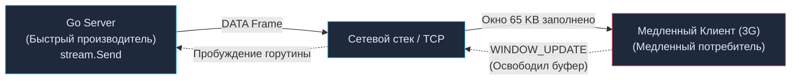

# 18. gRPC Streaming: Потоковая передача, Backpressure и Конкурентность

> *«Суть инженерного мастерства не в том, чтобы просто гнать байты по проводам, а в умении удерживать равновесие между поставщиком и потребителем».*    
> — Принцип устойчивых конвейеров

## За пределами Запрос-Ответ: Зачем нужны стримы

В статье [[16. gRPC. Основы.md]] мы детально разобрали классический паттерн **Unary RPC** — прямолинейный обмен «один запрос — один ответ». Для подавляющего большинства бизнес-сценариев (получить баланс, оформить покупку, авторизовать пользователя) этой модели более чем достаточно.

Но что делать, если аналитика требует выгрузить финансовый отчет на 10 Гигабайт? В классическом REST мы либо упремся в потолок оперативной памяти (OOM), пытаясь сериализовать исполинский JSON-срез в куче, либо будем вынуждены городить громоздкую постраничную навигацию с курсорами ([[10. Pagination, filtering, sorting.md]]). А что, если нашему сервису требуется непрерывно поставлять биржевые котировки миллисекундной частоты, не тратя драгоценное время на открытие нового TCP-соединения для каждого тика?

Для подобных задач gRPC предоставляет мощнейший механизм **Streaming (Потоковой передачи данных)**, опирающийся на нативную поддержку фреймов и окон протокола HTTP/2.

---

## Виды Streaming в gRPC

В файлах описания контрактов Protobuf ([[17. Protocol Buffers.md]]) потоковый режим объявляется добавлением ключевого слова `stream` перед типом аргумента или ответа:

1. **Server Streaming:** Клиент отправляет один инициирующий запрос, а сервер в ответ открывает односторонний поток сообщений (скачивание больших файлов частями, экспорт таблиц, подписка на поток системных логов).
2. **Client Streaming:** Клиент непрерывно шлет последовательность сообщений в открытый канал, а сервер возвращает единственный финальный статус после завершения передачи клиентом (загрузка тяжелого видеофайла, отправка телеметрии и батчей метрик).
3. **Bidirectional Streaming (Двунаправленный):** Обе стороны могут асинхронно и в произвольном порядке отправлять и читать сообщения. Входящий и исходящий потоки абсолютно независимы (полнодуплексный чат в реальном времени, видеозвонки, распределенная синхронизация реплик).

```protobuf
service DataService {
  // 1. Server Streaming
  rpc DownloadFile (FileRequest) returns (stream Chunk);
  
  // 2. Client Streaming
  rpc UploadTelemetry (stream Metric) returns (UploadStatus);
  
  // 3. Bidirectional Streaming
  rpc SyncChat (stream ChatMsg) returns (stream ChatMsg);
}
```

---

## Mechanical Sympathy: HTTP/2 Фреймы и Backpressure

Что в действительности происходит на кремниевом и сетевом уровнях, когда мы открываем gRPC-стрим?

Напомним: между двумя микросервисами существует **ровно одно физическое TCP-соединение**. Стрим — это чисто логическая абстракция. Все передаваемые сообщения (`Chunk`, `Metric`, `ChatMsg`) сериализуются в компактные бинарные блоки Protobuf, упаковываются во фреймы `DATA` протокола HTTP/2 и передаются в сокет ядра с указанием конкретного `Stream ID`.

Здесь возникает фундаментальная проблема распределенных систем — **дисбаланс скоростей производителя и потребителя**.

Представьте, что быстрый сервер на Go вычитывает файл с NVMe SSD-накопителя со скоростью 3 ГБ/с и выталкивает его в Server Stream. На противоположном конце провода находится мобильный клиент с нестабильным 3G-интернетом, принимающий данные со скоростью 500 КБ/с.

Если бы рантайм бесконтрольно продолжал лить байты в сетевой стек, буферы сокета операционной системы мгновенно переполнились бы. Оперативная память сервера за секунды раздулась бы до гигабайтов (OOM), а операционная система начала бы сбрасывать пакеты.

Эту угрозу предотвращает аппаратный механизм HTTP/2 — **Flow Control (Управление потоком)**.



> [!info] Под капотом: WINDOW-UPDATE и блокировки в Go
> В спецификации HTTP/2 каждый активный стрим обладает собственным окном приема (по умолчанию ровно 65 535 байт). Это объем данных, который отправитель имеет право передать по сети без получения явного подтверждения от получателя.
> 
> Когда ваш Go-код вызывает метод `stream.Send(msg)`, библиотека `grpc-go` обращается к счетчику доступного окна. Если лимит исчерпан (клиент еще не вычитал предыдущую порцию из своего сокета), вызов `Send()` **блокирует текущую горутину Go**.
> 
> Горутина переводится планировщиком в статус `waiting` и снимается с системного потока ядра Linux (`M`), не потребляя ни одного такта CPU.
> 
> Как только клиент освобождает место в своем буфере, он шлет обратный управляющий фрейм `WINDOW_UPDATE`. Сетевой поллер ядра Linux (`netpoller`) ловит этот фрейм, планировщик Go немедленно будит горутину сервера, и метод `Send()` возобновляет запись.
> 
> Этот физический принцип называется **Backpressure (Обратное давление)**. Благодаря ему ваш Go-бэкенд физически защищен от падений по нехватке памяти: сервер не сможет сгенерировать больше байтов, чем клиент способен переварить.

---

## Идиоматичный Go: Реализация Streaming

Рассмотрим реализацию самого сложного паттерна — двунаправленного стриминга (**Bidirectional Streaming**).

Сгенерированный компилятором `protoc` интерфейс для метода `SyncChat` выглядит следующим образом:
```go
type DataService_SyncChatServer interface {
	Send(*ChatMsg) error
	Recv() (*ChatMsg, error)
	grpc.ServerStream
}
```

Для надежной обработки двунаправленного потока в Go канонически применяются **две независимые горутины**: одна непрерывно вычитывает входящий поток через `Recv()`, а вторая пишет в исходящий поток через `Send()`.

```go
func (s *server) SyncChat(stream pb.DataService_SyncChatServer) error {
    // Канал для синхронизации завершения горутин
    errCh := make(chan error, 1)

    // 1. Читающая горутина (Reader Loop)
    go func() {
        for {
            // Recv блокируется до поступления нового фрейма из сокета
            in, err := stream.Recv()
            if err == io.EOF {
                // Клиент закрыл стрим на отправку (полуоткрытое соединение)
                errCh <- nil
                return
            }
            if err != nil {
                errCh <- err
                return
            }
            // Бизнес-логика обработки входящего сообщения
            log.Printf("Получено сообщение: %s", in.Message)
        }
    }()

    // 2. Пишущий цикл (Writer Loop в основной горутине обработчика)
    for {
        select {
        case <-stream.Context().Done():
            // Клиент оборвал соединение или сработал дедлайн контекста
            return stream.Context().Err()
            
        case err := <-errCh:
            // Читающая горутина завершилась (с ошибкой или штатным io.EOF)
            return err
            
        case outMsg := <-s.businessMessageQueue:
            // Отправка исходящего сообщения клиенту
            if err := stream.Send(outMsg); err != nil {
                return err // Сетевой сбой при отправке
            }
        }
    }
}
```

> [!warning] Ловушка / Gotcha: Потокобезопасность (Thread Safety) `Send` и `Recv`
> Грубейшая и самая частая ошибка новичков в gRPC-стриминге — попытка вызывать `stream.Send()` из нескольких параллельных горутин (например, при бродкасте событий из воркер-пула).
> 
> В библиотеке `grpc-go` методы потока обладают строго разграниченной потокобезопасностью:
> * Вы **МОЖЕТЕ** вызывать `stream.Send()` и `stream.Recv()` одновременно из двух РАЗНЫХ горутин (как в нашем примере выше).
> * Вы **КАТЕГОРИЧЕСКИ НЕ МОЖЕТЕ** вызывать `stream.Send()` одновременно из нескольких горутин!
> * Вы **КАТЕГОРИЧЕСКИ НЕ МОЖЕТЕ** вызывать `stream.Recv()` одновременно из нескольких горутин!
> 
> Попытка параллельной записи в поток из двух горутин приводит к состоянию гонки (data race), повреждению буферов фреймов HTTP/2, непредсказуемым ошибкам транспорта или аварийному обрыву соединения.
> 
> **Решение:** Всегда направляйте исходящие сообщения в единый Go-канал (`chan`), из которого читает ровно одна горутина-писатель, либо защищайте вызовы `stream.Send()` через мьютекс `sync.Mutex`.

---

## Client Streaming и io.EOF

В сценарии клиентского стриминга (например, загрузка архива логов или телеметрии) сервер читает входящие порции в цикле. Каким образом сервер понимает, что клиент закончил отправку?

В архитектуре Go для этого применяется стандартный маркер окончания ввода-вывода пакета `io`. Когда клиент на своей стороне завершает передачу и вызывает метод `stream.CloseAndRecv()`, HTTP/2 отправляет фрейм с битовым флагом `END_STREAM`.

На стороне сервера вызов `stream.Recv()` возвращает ошибку `io.EOF`:

```go
func (s *server) UploadTelemetry(stream pb.DataService_UploadTelemetryServer) error {
    var totalCount int32
    for {
        metric, err := stream.Recv()
        if err == io.EOF {
            // Клиент закончил отправку. Возвращаем итоговый ответ и закрываем поток.
            return stream.SendAndClose(&pb.UploadStatus{
                Success: true,
                Count:   totalCount,
            })
        }
        if err != nil {
            return err // Сетевой сбой или аварийный обрыв
        }
        
        totalCount++
        // Сохраняем metric в базу данных...
    }
}
```

> [!tip] Собеседование
> **Вопрос:** Способны ли gRPC-стримы полностью заменить брокеры сообщений (Apache Kafka, RabbitMQ) в асинхронном межсервисном взаимодействии?
> 
> **Ответ:** **Нет, категорически не способны.**
> 
> gRPC-стрим — это жестко связанный синхронный сетевой канал точка-точка (Point-to-Point), привязанный к конкретному TCP-сокету между двумя конкретными экземплярами сервисов.
> - Если один из серверов упадет или перезапустится, стрим разорвется, а все данные, находившиеся в сокетах и буферах памяти, будут безвозвратно утеряны.
> - gRPC не предоставляет гарантий доставки (At-Least-Once / Exactly-Once), персистентности на диске, поддержки групп потребителей (Consumer Groups) и балансировки шардов.
> 
> gRPC Streaming безупречен для синхронной перекачки больших файлов, видеопотоков или двунаправленных сессий реального времени, но брокеры сообщений остаются обязательным стандартом для асинхронных очередей задач и шин событий.

---

## Настройка стримов: Тюнинг под Highload

Стандартные параметры gRPC-сервера в Go оптимизированы для обычных веб-сервисов и излишне консервативны для передачи гигабайтных потоков внутри гигабитных сетей ЦОД. При передаче больших массивов скорость может неожиданно упереться в скромные 15–20 МБ/с.

Причина кроется в базовом размере окна Flow Control HTTP/2 (всего 65 КБ). Сервер передает 65 КБ и замирает в ожидании кадра подтверждения `WINDOW_UPDATE`, простаивая на каждом цикле RTT (Round Trip Time).

**Идиоматичный тюнинг высоконагруженного gRPC-сервера (в `main.go`):**

```go
server := grpc.NewServer(
    // 1. Увеличиваем размер начального окна для каждого отдельного стрима (1MB вместо 64KB)
    grpc.InitialWindowSize(1 << 20),
    // 2. Увеличиваем размер суммарного окна для всего физического TCP-соединения (1MB)
    grpc.InitialConnWindowSize(1 << 20),
    // 3. Расширяем максимальный размер одного входящего сообщения (по умолчанию 4MB -> 10MB)
    grpc.MaxRecvMsgSize(10 << 20),
    // 4. Настраиваем Keepalive для оперативного обнаружения мертвых сокетов
    grpc.KeepaliveParams(keepalive.ServerParameters{
        Time:    5 * time.Minute,  // Пинговать клиента при отсутствии активности
        Timeout: 20 * time.Second, // Время ожидания ответа на пинг
    }),
)
```

---

## Итог

1. **gRPC Streaming** преодолевает ограничения модели Request-Response, обеспечивая потоковую передачу данных без раздувания оперативной памяти Go-процесса.
2. Механизм **HTTP/2 Flow Control** реализует нативный **Backpressure**: сервер блокирует горутину записи `Send()` при переполнении буфера медленного клиента, защищая систему от аварийных остановок по OOM.
3. В двунаправленных стримах используйте разделение на читающую горутину (`Reader Loop`) и пишущий цикл (`Writer Loop`).
4. **Помните об ограничении конкурентности:** метод `stream.Send()` нельзя вызывать параллельно из нескольких горутин.
5. gRPC стримы великолепно решают задачи синхронного сетевого ввода-вывода больших объемов данных, но не заменяют отказоустойчивые распределенные очереди сообщений (Kafka).

Мы изучили gRPC от кремниевой физики Protobuf до сложнейших многопоточных стримов. Настало время сделать шаг назад и оценить всю картину целиком. Означает ли мощь gRPC, что дни REST сочтены? Когда следует отдать предпочтение строгому бинарному транспорту, а когда проверенный годами REST остается непревзойденным? Архитектурному поединку гигантов посвящена следующая статья: [[19. gRPC vs REST.md]].
