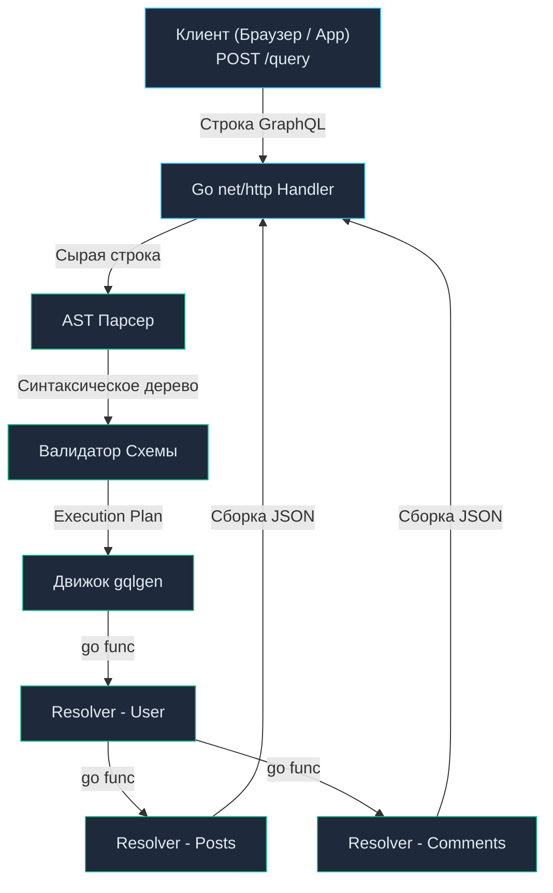

# 20. Основы GraphQL: Анатомия графа, Движок gqlgen и Проблема N+1

> *«Лучшие программы устроены так, чтобы вычисления производились только при реальной необходимости, а данные имели структуру, с которой легко и приятно работать».*    
> — Брайан Керниган

## Анатомия графа: Решение проблем Over-fetching и Under-fetching

В предыдущих главах мы всесторонне исследовали как традиционный REST ([[3. REST. Основные принципы.md]]), так и сверхбыстрый gRPC ([[16. gRPC. Основы.md]]). В архитектуре REST эндпоинты жестко привязаны к конкретным ресурсам: запрос к `/users/123` всегда возвращает фиксированную, заранее спроектированную на бэкенде структуру пользователя.

Однако по мере усложнения клиентских веб-интерфейсов (Single Page Applications) и мобильных приложений этот классический подход порождает две фундаментальные проблемы:

1. **Over-fetching (Избыточность выборки):** Мобильному приложению на слабом смартфоне для отрисовки ленты комментариев требуются лишь `id` и `avatar_url` автора. Однако REST-эндпоинт вынужден отдавать полный DTO на 50 полей: `address`, `preferences`, `settings`. В результате сотовая сеть сжигает дорогой мобильный трафик, а рантайм Go вхолостую расходует такты CPU на маршалинг сотен килобайтов невостребованного JSON.
2. **Under-fetching (Нехватка данных):** Чтобы отрисовать экран личного кабинета, клиенту нужны данные пользователя, список его последних пяти заказов и статус бонусного счета. В классическом REST фронтенду приходится выполнять каскад запросов: сначала `GET /users/123`, дождаться ответа, извлечь ID, а затем сделать еще 5 запросов к `/posts?user_id=123`. Это явление известно как **проблема N+1 на стороне клиента**, приводящая к мучительным задержкам рендеринга из-за накопления сетевого пинга (Round Trip Time, RTT).

В 2015 году инженеры Facebook представили миру **GraphQL** — специализированный декларативный язык запросов к API и среду выполнения (Runtime) для разрешения этих запросов.

Центральная архитектурная парадигма GraphQL: **клиент сам до единого поля декларирует форму ответа, которую желает получить, а серверная часть на Go агрегирует этот граф сущностей и возвращает результат строго за один сетевой раундтрип**.

---

## Контракт в GraphQL: Schema Definition Language (SDL)

Как и gRPC, GraphQL опирается на строгую статическую типизацию и подход **Design-First**. Контракт фиксируется в файле схемы с помощью декларативного языка SDL (Schema Definition Language):

```graphql
# схема контракта
type User {
  id: ID!
  name: String!
  posts: [Post!]!
}

type Post {
  id: ID!
  title: String!
  likes: Int!
}

type Query {
  user(id: ID!): User
}
```

Клиент отправляет стандартный HTTP `POST`-запрос на единственный системный эндпоинт (традиционно `/query` или `/graphql`), передавая в теле строку запроса:

```graphql
query {
  user(id: "123") {
    name
    posts {
      title
    }
  }
}
```

Сервер на Go парсит запрос и формирует JSON-ответ, форма которого **байт в байт** зеркально повторяет структуру клиентского запроса:
```json
{
  "data": {
    "user": {
      "name": "Alex",
      "posts": [
        { "title": "Concurrency in Go" },
        { "title": "Memory Layout" }
      ]
    }
  }
}
```
Ни единого лишнего поля, ни одного избыточного байта по сети.

---

## Mechanical Sympathy: Как GraphQL работает в Go

Если попытаться написать GraphQL-движок на Go вручную, вам придется погрузиться в сложнейшую математику компиляторов: лексический анализ, построение абстрактного синтаксического дерева (AST) и обход графа.

В сообществе Go исторически конкурировали две библиотеки:
1. `graphql-go/graphql` (Code-First подход): описание схемы в коде через структуры Go. Чрезвычайно медленный инструмент, опирающийся на тотальную рефлексию (`reflect`), порождающий море аллокаций в куче и требующий написания сотен строк бойлерплейта.
2. **`99designs/gqlgen` (Schema-First подход):** общепризнанный индустриальный стандарт современной Go-разработки.

### Под капотом gqlgen

Утилита `gqlgen` читает ваши `.graphql` файлы и выполняет упреждающую кодогенерацию. Вместо того чтобы динамически инспектировать структуры через `reflect`, генератор компилирует прямолинейный, строго типизированный исполнительный план (**Execution Plan**).

Когда в Go-сервер поступает входящий HTTP-запрос со строкой GraphQL:
1. **Лексический анализ и Парсинг:** Текстовая строка запроса за считанные микросекунды конвертируется во внутреннее синтаксическое дерево (AST).
2. **Валидация по схеме:** Дерево проверяется на соответствие скомпилированной схеме (существуют ли запрашиваемые поля, корректны ли типы аргументов).
3. **Исполнение (Execution):** Движок `gqlgen` производит обход дерева AST. Для каждого поля он вызывает соответствующую функцию Go — **Resolver (Распознаватель)**.



> [!info] Под капотом: Горутины и Резолверы
> В рантайме `gqlgen` резолверы выполняются конкурентно. Если входящий запрос требует параллельного извлечения независимых ветвей графа:
> ```graphql
> user { posts { ... } comments { ... } }
> ```
> Движок рантайма запускает вызовы резолверов в параллельных горутинах, синхронизируя их завершение через примитивы Go (`sync.WaitGroup` или каналы). Это гарантирует максимальную утилизацию многоядерных систем без блокировок.

---

## Убийца базы данных: Проблема N+1 в GraphQL

Предоставляя клиенту абсолютную свободу в конструировании графа, мы перекладываем колоссальную нагрузку на серверную базу данных. Главная системная катастрофа в GraphQL-архитектуре — **проблема N+1 на стороне сервера**.

Представьте тривиальный запрос: клиент хочет отобразить список из 50 пользователей и заголовки их статей:
```graphql
query {
  users(limit: 50) {
    name
    posts { title }
  }
}
```

Посмотрим, как отработает наивная реализация резолверов в Go:
1. Вызывается корневой резолвер `QueryResolver.Users()`. Он выполняет ровно один SQL-запрос:
   ```sql
   SELECT * FROM users LIMIT 50;
   ```
2. Движок GraphQL получает 50 структур `User`.
3. Для **каждого** из 50 пользователей движок вызывает дочерний резолвер `UserResolver.Posts(user)`:
   ```sql
   SELECT * FROM posts WHERE user_id = X;
   ```

**Результат:** Для обработки **одного** HTTP-запроса ваш Go-сервер выполнил **51 запрос к базе данных**! Если всего 20 клиентов одновременно откроют эту страницу, база данных получит залп из 1 000 параллельных запросов. Пул соединений PostgreSQL (`max_connections`) мгновенно исчерпается, и весь бэкенд рухнет с каскадным отказом.

---

## Решение: Паттерн Dataloader

В архитектуре GraphQL проблема N+1 решается фундаментальным паттерном: **батчингом (пакетированием) через Dataloader**.

В экосистеме Go стандартом являются библиотеки `graph-gophers/dataloader` и кодогенерируемый `vektah/dataloaden` (устраняющий оверхед пустых интерфейсов `interface{}`).

**Механика работы Dataloader:**
1. Когда резолвер `UserResolver.Posts()` вызывается для первого пользователя, он **не идет в базу данных**. Он регистрирует идентификатор в памяти даталоадера: *«Мне нужны посты для `user_id = 1`. Я подожду ответа»* и получает асинхронный дескриптор ожидания (Thunk / Channel).
2. Движок `gqlgen` продолжает обходить граф и регистрирует в очереди даталоадера все остальные ключи: `2, 3, 4 ... 50`.
3. Даталоадер накапливает батч ключей.
4. В момент завершения уровня графа даталоадер выполняет **ровно ОДИН** агрегирующий SQL-запрос:
   ```sql
   SELECT id, title, user_id FROM posts WHERE user_id IN (1, 2, 3... 50);
   ```
5. Полученные строки группируются в памяти по `user_id` и рассылаются в ожидающие каналы соответствующих резолверов.

Мы сократили 51 отдельный запрос до **2 пакетных запросов**. Без глубокого понимания Dataloader выпускать GraphQL-сервис в продакшен категорически недопустимо.

> [!tip] Собеседование
> **Вопрос:** Каким образом Dataloader в Go определяет момент, когда пора прекращать сбор ключей и отправлять батч-запрос в базу данных?
> 
> **Ответ:** Существует два архитектурных механизма:
> 1. **Таймерный батчинг (Timer-based):** При регистрации первого ключа запускается таймер `time.After(2 * time.Millisecond)`. Все ключи, поступившие в течение 2 миллисекунд, объединяются в единый батч. Недостаток: добавляет искусственную микросекундную задержку.
> 2. **Координация с планировщиком движка (Scheduler-driven):** В `gqlgen` применяется координация на уровне графа. Движок точно знает количество резолверов, запущенных на текущей глубине дерева AST. Когда все горутины данного уровня дошли до точки ожидания Thunk, движок дает Dataloader сигнал на немедленное выполнение батча без искусственных пауз `time.Sleep`.

---

## Ловушки архитектуры: Безопасность и Кэширование

Передавая клиенту право произвольного конструирования запросов, мы распахиваем двери для атак на отказ в обслуживании (DDoS).

### 1. Исчерпание ресурсов (Query Complexity & Depth)
Злоумышленник может направить циклический рекурсивный запрос:
```graphql
query {
  user {
    posts {
      author {
        posts {
          author {
            posts { ... }
          }
        }
      }
    }
  }
}
```
Запрос с глубиной в 100 уровней заставит сервер породить миллионы горутин, аллоцировать гигабайты памяти под промежуточные резолверы и мгновенно убьет Go-сервис сигналом OOM Killer операционной системы.

**Обязательная защита:**
- **MaxDepth:** В конфигурации `gqlgen` задается жесткий лимит максимальной глубины вложенности AST (например, не более 7–10 уровней).
- **Query Complexity:** Каждому полю схемы присваивается вес (Complexity Cost). Сложные поля с вложенными связями оцениваются дороже. Если суммарный вес запроса превышает пороговое значение, синтаксический анализатор отсекает запрос до запуска резолверов.

### 2. Смерть HTTP Кэширования
В статье [[12. Caching HTTP.md]] мы разбирали, что REST идеально кэшируется на уровне CDN и Nginx благодаря уникальным URL (`GET /users/123`).

По умолчанию в типичной конфигурации GraphQL запросы отправляются методом `POST` на единый URL `/query`, а тело запроса скрыто в полезной нагрузке. Стандартные промежуточные кэши и сети CDN не кэшируют тела POST-запросов.

**Решения проблемы:**
1. Перенос кэширования внутрь Go-сервиса (Redis кэш на уровне отдельных резолверов).
2. Применение техники **APQ (Automatic Persisted Queries)**: клиент вычисляет SHA-256 хэш от текста запроса и отправляет на сервер компактный `GET /query?hash=...`. Это позволяет пограничным CDN восстановить кэширование ответов по URL-хэшу.

---

## Итог

1. **GraphQL** кардинально упрощает жизнь клиентской разработки, устраняя проблемы **Over-fetching** и **Under-fetching** за счет единого графового контракта.
2. В Go идиоматичным стандартом является **Schema-First** подход на базе `gqlgen`, гарантирующий компиляцию AST в строгий машинный код без медленной рефлексии.
3. Проблема **N+1** — смертельная угроза для базы данных в GraphQL. Использование паттерна **Dataloader** для пакетной выборки `WHERE IN` обязательно для всех связанных сущностей.
4. Контролируйте безопасность: обязательно настраивайте лимиты глубины (**MaxDepth**) и сложности запросов (**Query Complexity**).

GraphQL — выдающийся инструмент для сборки пользовательских интерфейсов, однако за его гибкость приходится платить сложностью Dataloader-ов и потерей нативного кэша. Стоит ли внедрять GraphQL в каждый проект? В каких сценариях он незаменим, а когда классический REST или строгий gRPC окажутся на порядок эффективнее и проще в поддержке? Четким критериям выбора посвящена следующая статья: [[21. Когда использовать GraphQL.md]].
