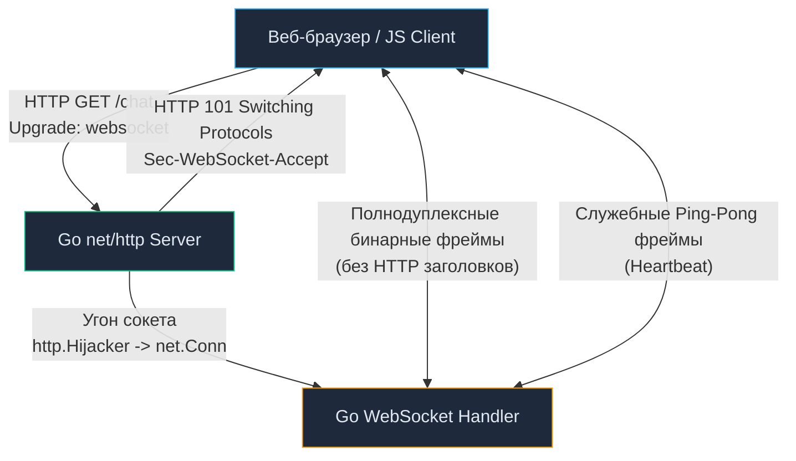
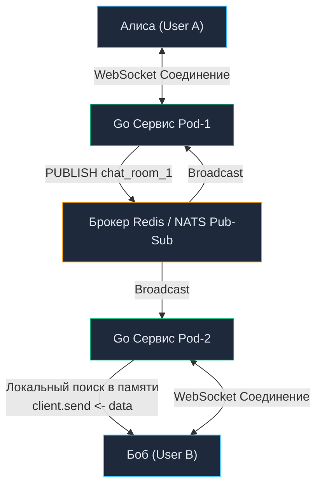

# 22. Протокол WebSocket: Двунаправленный Real-Time, Hijacking и Масштабирование в Go

> *«Компьютерная сеть — не просто механизм скачивания страниц, а провод под током, связывающий воедино процессы по всему миру».*    
> — Брайан Керниган

## Двунаправленный реалтайм: Когда инициатива у сервера

В предыдущих главах мы подробно исследовали классическую модель «Запрос-Ответ» в REST и мультиплексированные потоки в [[18. gRPC streaming.md]]. Если gRPC представляет собой непревзойденный стандарт для внутреннего межсервисного общения (Backend-to-Backend), то при работе с клиентскими браузерами (Single Page Applications) инженеры сталкиваются с жесткими аппаратными и протокольными ограничениями.

Браузерные движки не предоставляют JavaScript-коду прямого доступа к низкоуровневым бинарным фреймам HTTP/2, из-за чего gRPC-стриминг в вебе возможен только через тяжелые сторонние прокси (gRPC-Web). Если нам необходимо разработать интерактивный чат, биржевой торговый терминал с обновлением котировок в реальном времени, сервис совместного редактирования документов или многопользовательскую веб-игру, нам требуется протокол, который нативно поддерживается всеми браузерами и позволяет серверу **самостоятельно выталкивать (Push) данные клиенту в любой непредсказуемый момент времени**.

Абсолютным стандартом для этой задачи является протокол **WebSocket (RFC 6455)**.

Для инженера уровня Senior WebSocket — это не просто «сокет в браузере». Это долгоживущий полнодуплексный **Stateful-протокол поверх TCP**, который фундаментально меняет подходы к масштабированию, развертыванию (Deployment) и управлению памятью в рантайме Go.

---

## Анатомия протокола: От HTTP к сырому TCP

С точки зрения операционной системы и сетевого оборудования, жизненный цикл WebSocket начинается как совершенно обычный HTTP/1.1 запрос. Это гениальный архитектурный трюк, позволивший веб-сокетам беспрепятственно проходить сквозь корпоративные брандмауэры, прокси-серверы и балансировщики (Nginx, Envoy), работающие на стандартных портах 80 (HTTP) и 443 (HTTPS).

**Шаг 1: Handshake (Протокольное рукопожатие)**  
Клиент отправляет стандартный HTTP `GET` запрос, снабженный специальными заголовками согласования протокола:
```http
GET /chat HTTP/1.1
Host: api.example.com
Upgrade: websocket
Connection: Upgrade
Sec-WebSocket-Key: dGhlIHNhbXBsZSBub25jZQ==
Sec-WebSocket-Version: 13
```

**Шаг 2: Hijacking (Угон сетевого соединения)**  
Если сервер готов перейти на веб-сокеты, рантайм Go через интерфейс `http.Hijacker` буквально **отбирает физический сокет (`net.Conn`) у встроенного HTTP-сервера**. HTTP-мультиплексор полностью прекращает управление этим соединением. Сервер отвечает статусом [[6. Статусы HTTP.md]] `101 Switching Protocols`, вычисляет криптографический заголовок `Sec-WebSocket-Accept` (SHA-1 от ключа клиента с добавлением магической константы UUID) и передает открытый дескриптор в распоряжение цикла WebSocket:



> [!info] Под капотом: Фрейминг и Маскирование
> После получения статуса 101 текстовый HTTP уступает место компактным бинарным фреймам. Заголовок фрейма занимает всего от 2 до 14 байт и содержит код операции (**Opcode**): `0x1` (текст UTF-8), `0x2` (бинарные данные), `0x8` (закрытие соединения), `0x9` (Ping), `0xA` (Pong).
> 
> **Mechanical Sympathy:** Чтобы предотвратить атаки отравления кэша (Cache Poisoning) на старые промежуточные прокси-серверы, стандарт RFC 6455 требует, чтобы **все данные, передаваемые от клиента к серверу, были замаскированы** с помощью 32-битного случайного ключа и побитовой операции XOR.
> 
> Рантайм Go вынужден расходовать такты CPU на побайтовое демаскирование входящего трафика. Современные библиотеки Go используют ассемблерные векторные SIMD-инструкции для параллельного выполнения операции XOR над блоками по 16–32 байта за такт. Примечательно, что фреймы, отправляемые сервером клиенту, согласно стандарту не маскируются.

---

## Идиоматичный Go: Архитектура на горутинах

В экосистеме Go стандартом де-факто для реализации WebSocket является библиотека `github.com/gorilla/websocket` (а также современный альтернативный пакет `github.com/coder/websocket`, ранее развивавшийся как `nhooyr.io/websocket`).

Классический паттерн обслуживания одного WebSocket-клиента в Go **всегда требует выделения двух специализированных горутин**:
1. `readPump` — горутина-читатель, непрерывно заблокированная на чтении входящих сообщений из сокета.
2. `writePump` — горутина-писатель, читающая исходящие байты из буферизованного Go-канала и записывающая их в сокет.

Попытка объединить чтение и запись в одном цикле приведет к зависанию: медленный клиент или переполненный TCP-буфер заблокируют чтение входящих команд.

```go
package chat

import (
	"log"
	"net/http"
	"time"

	"github.com/gorilla/websocket"
)

var upgrader = websocket.Upgrader{
	ReadBufferSize:  1024,
	WriteBufferSize: 1024,
	// В production обязательно проверяйте Origin для защиты от CSWSH атак!
	CheckOrigin: func(r *http.Request) bool { return true },
}

// Client оборачивает TCP сокет
type Client struct {
	conn *websocket.Conn
	send chan []byte // Буферизованный канал для исходящих сообщений
}

// Обработчик HTTP
func ServeWS(w http.ResponseWriter, r *http.Request) {
	// Угон соединения: net.Conn переходит к gorilla/websocket
	conn, err := upgrader.Upgrade(w, r, nil)
	if err != nil {
		log.Printf("upgrade error: %v", err)
		return
	}

	client := &Client{
		conn: conn,
		send: make(chan []byte, 256),
	}

	// Запускаем две независимые горутины
	go client.writePump()
	go client.readPump()
}
```

> [!warning] Ловушка / Gotcha: Concurrent Writes Panic
> Самая распространенная причина аварий в продакшене у начинающих разработчиков — попытка вызывать `conn.WriteMessage()` или `conn.WriteJSON()` конкурентно из разных горутин (например, при рассылке уведомления группе пользователей).
> 
> Сокет в `gorilla/websocket` **КАТЕГОРИЧЕСКИ НЕ ПОТОКОБЕЗОПАСЕН ДЛЯ ЗАПИСИ!**
> Если две параллельные горутины одновременно попытаются записать фрейм в одно соединение, рантайм Go немедленно выбросит фатальную панику:
> ```text
> panic: concurrent write to websocket connection
> ```
> **Железное правило:** Все горутины приложения обязаны отправлять сообщения в буферизованный канал `client.send`. Горутина `writePump` является **единственным эксклюзивным владельцем сокета на запись**, последовательно вычитывая сообщения из канала и отправляя их в сеть.

---

## Проблема мертвых душ: Ping / Pong и утечки памяти

Физический сетевой кабель несовершенен. Если пользователь смартфона заходит в подземный паркинг или туннель метро, сотовая вышка теряет сигнал мгновенно, без отправки пакета закрытия TCP FIN.

Для ядра Linux и вашего Go-сервера такое соединение продолжает числиться активным («полуоткрытый сокет»). Сервер продолжает удерживать в оперативной памяти дескриптор сокета, горутины `readPump` и `writePump`, буферы каналов и структуры клиента. На масштабе в 100 000 мобильных пользователей это приводит к тихой утечке гигабайтов RAM (Memory Leak).

Системный механизм TCP Keep-Alive часто сбрасывается облачными балансировщиками (AWS ALB/NLB). Для решения этой проблемы спецификация WebSocket ввела прикладные контрольные фреймы: **Ping и Pong**.

```go
// Идиоматичный ReadPump с контролем дедлайнов
func (c *Client) readPump() {
	defer func() {
		c.conn.Close()
	}()

	// Если клиент не ответил на Ping за 60 секунд - он мертв
	c.conn.SetReadDeadline(time.Now().Add(60 * time.Second))
	
	// При получении Pong от клиента - сдвигаем дедлайн смерти
	c.conn.SetPongHandler(func(string) error {
		c.conn.SetReadDeadline(time.Now().Add(60 * time.Second))
		return nil
	})

	for {
		_, message, err := c.conn.ReadMessage()
		if err != nil {
			if websocket.IsUnexpectedCloseError(err, websocket.CloseGoingAway, websocket.CloseAbnormalClosure) {
				log.Printf("error: %v", err)
			}
			break // Выход из цикла завершает горутину и освобождает память
		}
		// Обработка message...
	}
}
```

Горутина `writePump` настраивается на регулярную отправку контрольного кадра `Ping` каждые 50 секунд (с помощью `time.Ticker`). Если за 60 секунд ответный `Pong` не вернулся, метод `ReadMessage()` разблокируется с ошибкой таймаута ввода-вывода, цикл завершается, сокет закрывается, и сборщик мусора Go моментально освобождает память.

---

## Масштабирование WebSockets: Архитектурный вызов

В классических stateless REST-сервисах ([[3. REST. Основные принципы.md]]) горизонтальное масштабирование тривиально: мы запускаем 10 новых реплик в Kubernetes, и балансировщик Nginx равномерно распределяет запросы между ними.

Веб-сокеты фундаментально **Stateful (хранят состояние соединения)**. Клиент привязан к конкретному физическому процессу Go на все время существования сессии, которая может длиться часами.

Представьте распределенную проблему:
- Пользователь Алиса подключена к инстансу `Pod-1`.
- Пользователь Боб подключен к инстансу `Pod-2`.
- Алиса отправляет в чат сообщение для Боба.

Каким образом `Pod-1` доставит байты в сокет Боба, дескриптор которого физически находится в адресном пространстве оперативной памяти `Pod-2`?

**Решение: Централизованная шина Pub/Sub (Redis или NATS)**

Для межнодовой маршрутизации событий внедряется распределенный брокер:
1. Пользователь Алиса отправляет сообщение в `Pod-1`.
2. `Pod-1` публикует событие в брокер: `PUBLISH chat_room_1 "Привет"`.
3. Все реплики кластера (`Pod-1`, `Pod-2`, `Pod-N`) подписаны на топик `SUBSCRIBE chat_room_1`.
4. `Pod-2` принимает событие из брокера Redis, находит Боба в своей локальной мапе `map[string]*Client` и помещает байты в его персональный канал `client.send`.



> [!tip] Собеседование
> **Вопрос:** Что произойдет с активными WebSocket-соединениями при штатном обновлении версии сервиса (Rolling Update) в Kubernetes?
> 
> **Ответ:** При поступлении сигнала `SIGTERM` запускается процедура плавного завершения (**Graceful Shutdown**). Сервер прекращает регистрировать новые подключения, однако тысячи уже открытых сокетов продолжают удерживать TCP-соединение. Если процесс не завершится до истечения `terminationGracePeriodSeconds`, демон Kubernetes убьет его жестким системным вызовом `SIGKILL`.
> 
> Это приведет к одномоментному обрыву соединений у десятков тысяч клиентов. Все они синхронно начнут переподключаться к оставшимся подам, вызвав сокрушительный всплеск нагрузки — **Thundering Herd Problem (проблему собачьей своры)**, способную уронить весь кластер.
> 
> **Архитектурное решение:** При получении `SIGTERM` бэкенд начинает плавно рассылать клиентам управляющий кадр `Close` с рандомизированной задержкой (**Jitter**), растянутой на 30–60 секунд. Клиенты переподключаются к новым инстансам равномерным плавным потоком.

---

## Итог

1. **WebSocket** — это полнодуплексный двунаправленный протокол реального времени, идеально подходящий для интерактивных браузерных приложений (чаты, трейдинг, игры).
2. **Идиоматичная архитектура в Go:** на каждого клиента выделяется пара горутин (`readPump` и `writePump`) с буферизованным каналом передачи, исключающим фатальные паники при конкурентной записи.
3. **Heartbeat-механизм (Ping/Pong):** обязательное условие для своевременного обнаружения «мертвых» полуоткрытых сокетов и защиты сервера от утечек дескрипторов и памяти.
4. **Горизонтальное масштабирование Stateful-сервисов:** требует интеграции с централизованной шиной сообщений (**Redis Pub/Sub** или **NATS**) для межсервисной маршрутизации событий.

Веб-сокеты обеспечивают максимальную гибкость, однако платой за это являются сложная маршрутизация через брокеры и постоянное удержание двух горутин на каждое соединение. Но что делать, если нашему приложению не требуется полнодуплексный обмен, а серверу нужно лишь *в одну сторону* транслировать уведомления или биржевые котировки в браузер? Существует ли более легковесный стандарт, работающий поверх обычного HTTP без «угона» сокетов и бинарных фреймов? Да, и эта технология детально рассматривается в нашей следующей статье: [[23. Server Sent Events.md]].
