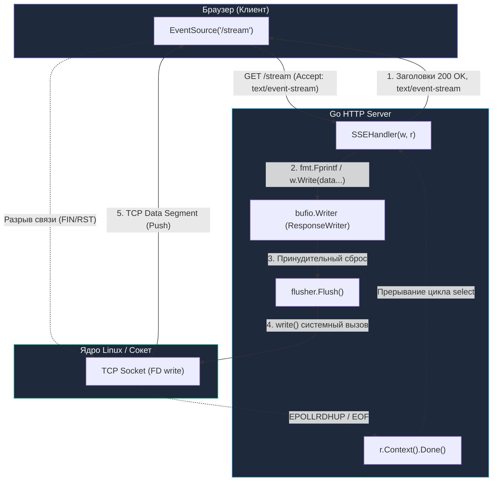
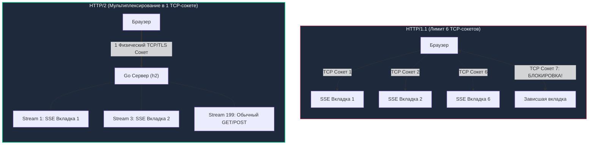

# Server-Sent Events (SSE) в Go: Однонаправленные потоки реального времени

> *«Цель вычислений — понимание сути явлений, а не голые числа».*    
> — Ричард Хэмминг

В проектировании сетевых интерфейсов существует классическая инженерная ловушка: выбирать самый мощный, универсальный и сложный инструмент там, где достаточно элементарной конструкции. В статье [[22. WebSocket.md]] мы детально исследовали всю глубину двунаправленного полнодуплексного взаимодействия: перехват TCP-соединения (`Hijacking`), низкоуровневый бинарный фрейминг, побайтовое XOR-маскирование каждого клиентского кадра, ручной контроль кадров `Ping/Pong` и потерю преимуществ современных мультиплексированных транспортных протоколов.

Однако честный архитектурный анализ показывает: в 80–90% веб-сервисов клиенту вовсе **не требуется двунаправленный сокет**. Ленты биржевых котировок, трансляция спортивных матчей, мониторинг системных метрик, прогресс-бары тяжелых фоновых задач компиляции или машинного обучения, всплывающие push-уведомления — всё это строго **однонаправленные потоки** от сервера к клиенту. Браузер в этих сценариях выступает пассивным слушателем (радиоприемником). Когда пользователю необходимо выполнить действие (отправить форму, поставить лайк, отменить задачу), он может сделать обычный, атомарный, безопасный и кэшируемый `POST`- или `PUT`-запрос.

Строить полнодуплексный WebSocket ради односторонней трансляции — это неоправданный оверинжиниринг. Элегантным, стандартизированным и невероятно легковесным решением является технология **Server-Sent Events (SSE)**.

---

## 1. Однонаправленный поток: Зачем стрелять из пушки по воробьям

Представьте радиоприемник в автомобиле. Радиостанция передает музыкальный сигнал в эфир тысячам слушателей. Было бы абсурдно требовать от каждого слушателя непрерывно держать открытую двустороннюю телефонную линию с диджеем только для того, чтобы слышать музыку. Если радиослушатель хочет заказать песню, он отправляет SMS на короткий номер (аналог HTTP `POST`), а эфир продолжает литься по односторонней волне.

Именно этот принцип заложен в **Server-Sent Events (SSE)**.

```mermaid
flowchart LR
    subgraph WS ["WebSocket (Overkill для простого push)"]
        direction TB
        C1["Клиент"] <== "Двусторонний бинарный канал (WS)" ==> S1["Сервер"]
        C1 -. "XOR-маскирование, Ping/Pong, Hijack" .-> S1
    end

    subgraph SSE ["Server-Sent Events (Идеальный симбиоз)"]
        direction TB
        C2["Браузер (EventSource)"] <-- "Однонаправленный поток (SSE, text/event-stream)" --- S2["Go Сервер"]
        C2 -->|"Редкие команды (POST/PUT)"| S2
    end

    style WS fill:#1e293b,stroke:#f43f5e,stroke-width:1px,color:#f8fafc
    style SSE fill:#1e293b,stroke:#10b981,stroke-width:2px,color:#f8fafc
```

### Главные преимущества отказа от WebSocket в пользу SSE:
1. **Чистый HTTP:** SSE работает поверх стандартного HTTP (HTTP/1.1, [[16. gRPC. Основы.md|HTTP/2]], HTTP/3). Не происходит смены протокола (`101 Upgrade`), не ломаются стандартные механизмы маршрутизации, проксирования и инспекции трафика корпоративными межсетевыми экранами (WAF).
2. **Встроенное авто-переподключение:** Клиентский браузерный API берет на себя всю рутину по повторному подключению при разрыве связи с сервера.
3. **Гарантия непрерывности доставки:** Протокол на уровне спецификации W3C поддерживает отслеживание идентификаторов сообщений (`Last-Event-ID`) и досылку пропущенных пакетов после сбоя сети.
4. **Простота отладки:** Поток SSE — это обыкновенный читаемый человеком UTF-8 текст. Его можно тестировать в терминале обычной утилитой `curl -N http://localhost:8080/events` без специализированных утилит типа `wscat`.

---

## 2. Анатомия протокола: Старый добрый HTTP

В отличие от WebSocket, SSE не вводит собственного бинарного фрейминга. С точки зрения транспортного и прикладного уровней это классический HTTP-запрос, ответ на который сервер **намеренно оставляет открытым**, непрерывно дописывая в сокет новые порции структурированного текста.

### Хэндшейк и заголовки

**Запрос клиента:**  
Обычный HTTP `GET`. В браузере он инициируется нативным JavaScript-классом `EventSource`:
```javascript
const eventSource = new EventSource('/api/v1/stream');
```

**Ответ сервера:**  
Сервер возвращает стандартный статус `200 OK` (никаких `101 Switching Protocols`), но выставляет три обязательных HTTP-заголовка:
* `Content-Type: text/event-stream` — сообщает браузеру, что тело ответа не является статическим документом, а представляет собой бесконечный поток событий.
* `Cache-Control: no-cache` — запрещает браузеру и промежуточным прокси кэшировать ответ.
* `Connection: keep-alive` — инструктирует подсистему сокетов операционной системы удерживать постоянное TCP-соединение активным.

### Формат потока событий (Wire Protocol)

Каждое событие в потоке представляет собой текстовый блок в кодировке UTF-8. Поля начинаются с ключевого слова, за которым следует двоеточие и значение. Блоки сообщений **строго разделяются двумя символами переноса строки подряд (`

`)**:

```text
id: 101
event: price_update
data: {"ticker":"AAPL", "price":150.5}

id: 102
data: {"ticker":"GOOG", "price":2800.1}

: это комментарий (heartbeat / ping), игнорируемый браузером

id: 103
retry: 5000
event: system_alert
data: Персистирующее предупреждение:
data: плановое обслуживание через 15 минут.

```

Спецификация поддерживает четыре стандартных поля:
* `data:` — полезная нагрузка сообщения. Если payload состоит из нескольких строк, каждая строка предваряется префиксом `data:`. Браузер объединит их через символ переноса `\n`.
* `id:` — уникальный строковый или числовой идентификатор события. Запоминается браузером как маркер последнего успешно принятого сообщения.
* `event:` — имя пользовательского события. Позволяет на клиенте регистрировать таргетированные обработчики: `eventSource.addEventListener('price_update', handler)`. Если поле опущено, событие триггерит стандартный коллбэк `eventSource.onmessage`.
* `retry:` — целое число миллисекунд. Указывает браузеру, сколько времени ожидать перед автоматической попыткой переподключения в случае потери связи.
* `: <комментарий>` — строка, начинающаяся с двоеточия, воспринимается как комментарий. Это фундаментальный механизм передачи heartbeat (Keep-Alive) пакетов для предотвращения разрыва соединения по таймауту промежуточными NAT и балансировщиками нагрузки.

> [!info] Под капотом: Mechanical Sympathy и экономия CPU
> В WebSocket рантайм Go вынужден применять побайтовую XOR-маску к каждому входящему фрейму для защиты от кэш-отравления (Cache Poisoning). Это непрерывно сжигает процессорное время в цикле декодирования фреймов.  
> В SSE нет фрейминга и нет маскирования. Это чистый поток байт (PlainText) поверх TCP-сокета. Сериализация и отправка сообщения в SSE обходится процессору сервера в разы дешевле, чем упаковка и маскирование бинарного фрейма WebSocket. Нагрузка на память сводится к формированию текстового буфера.

---

## 3. Идиоматичный Go: Интерфейс http.Flusher

Стандартный `http.ResponseWriter` в стандартной библиотеке Go спроектирован с упором на максимальную пропускную способность пакетного ввода-вывода. По умолчанию он оборачивает сетевой сокет в буфер `bufio.Writer` (размером 4 КБ). Когда вы вызываете `w.Write()`, байты не отправляются в сетевую карту немедленно, а накапливаются в системном буфере памяти. Это снижает количество системных вызовов `write()` и контекстных переключений ядра ОС.

Для потокового протокола реального времени такая буферизация фатальна: клиент не увидит критически важное событие до тех пор, пока буфер не заполнится до краев другими данными.

Для немедленной отправки порции байт прямо в сетевой сокет стандартная библиотека Go предоставляет интерфейс-расширение `http.Flusher`.

```go
type Flusher interface {
    Flush()
}
```

Если базовый `http.ResponseWriter` реализует `http.Flusher`, вызов метода `Flush()` принудительно выталкивает накопленные в `bufio.Writer` байты в низкоуровневый системный вызов `write()` к файловому дескриптору TCP-сокета.

### Полный производственный HTTP-хэндлер SSE в Go

Рассмотрим надежный серверный обработчик, учитывающий отслеживание отключения клиента через `r.Context()`, предотвращение блокировок и корректный сброс буфера:

```go
package main

import (
	"fmt"
	"log"
	"net/http"
	"time"
)

func SSEHandler(w http.ResponseWriter, r *http.Request) {
	// 1. Устанавливаем HTTP-заголовки потока
	w.Header().Set("Content-Type", "text/event-stream")
	w.Header().Set("Cache-Control", "no-cache")
	w.Header().Set("Connection", "keep-alive")
	// Специальный заголовок для Nginx (отключение буферизации на уровне прокси)
	w.Header().Set("X-Accel-Buffering", "no")

	// 2. Проверяем поддержку интерфейса http.Flusher сервером
	flusher, ok := w.(http.Flusher)
	if !ok {
		http.Error(w, "Streaming unsupported", http.StatusInternalServerError)
		return
	}

	// 3. Извлекаем Last-Event-ID (если клиент переподключился после сбоя)
	lastEventID := r.Header.Get("Last-Event-ID")
	if lastEventID != "" {
		log.Printf("Клиент восстановил сессию с события ID: %s", lastEventID)
		// Здесь идиоматично дослать пропущенные события из кольцевого буфера / Redis / Kafka
	}

	// 4. Настраиваем таймер регулярной отправки данных и Keep-Alive пингов
	ticker := time.NewTicker(1 * time.Second)
	defer ticker.Stop()

	heartbeatTicker := time.NewTicker(15 * time.Second)
	defer heartbeatTicker.Stop()

	eventID := 0

	for {
		select {
		case <-r.Context().Done():
			// Клиент закрыл вкладку браузера или разорвал TCP-соединение.
			// Сетевой поллер Go (epoll/kqueue) обнаружит EOF/RST и отменит контекст запроса.
			log.Println("SSE клиент отключился:", r.RemoteAddr)
			return

		case t := <-ticker.C:
			eventID++
			// 5. Формируем тело события. Обратите внимание на финальный разделитель `\n\n`!
			msg := fmt.Sprintf("id: %d\nevent: time_tick\ndata: {\"time\": \"%s\"}\n\n",
				eventID, t.Format(time.RFC3339))

			if _, err := w.Write([]byte(msg)); err != nil {
				return
			}

			// 6. КРИТИЧЕСКИ ВАЖНО: Принудительно выталкиваем байты в сокет
			flusher.Flush()

		case <-heartbeatTicker.C:
			// 7. Heartbeat комментарий для предотвращения сброса соединения по Idle Timeout
			if _, err := w.Write([]byte(": keepalive\n\n")); err != nil {
				return
			}
			flusher.Flush()
		}
	}
}
```



---

## 4. Авто-восстановление: Магия EventSource

В распределенных системах сети ненадежны: Wi-Fi переключается на мобильную сеть LTE, микросервисы перезапускаются при релизах, домашние роутеры перезагружаются. 

В случае с WebSocket разработчик вынужден писать нетривиальный фронтенд-код: ловить событие `onclose`, запускать таймер с экспоненциальной задержкой (Exponential Backoff с джиттером), следить за тем, чтобы не устроить Thundering Herd на бэкенд, а также заново согласовывать протокол аутентификации.

В Server-Sent Events этот механизм стандартизирован на уровне W3C-спецификации и зашит в браузерный движок нативного JavaScript-объекта `EventSource`.

### Механика прозрачного реконнекта

1. **Автоматический Reconnect:**  
   Если TCP-соединение обрывается со стороны сервера или сети, браузер **автоматически, без единой строчки клиентского кода**, берет паузу (по умолчанию 3 секунды или значение из заголовка `retry:`) и повторяет запрос `GET`.
2. **Гарантия непрерывности доставки через `Last-Event-ID`:**  
   Если каждое отправляемое Go-сервером событие содержало поле `id:` (например, смещение в логе Kafka или ID записи в БД: `id: 42`), браузер кэширует последнее успешно обработанное значение. При авто-переподключении браузер автоматически выставляет стандартный заголовок:
   ```http
   GET /api/v1/stream HTTP/1.1
   Host: example.com
   Accept: text/event-stream
   Last-Event-ID: 42
   ```
3. **Восстановление состояния на бэкенде:**  
   Go-обработчик считывает `r.Header.Get("Last-Event-ID")`, обращается к персистентной шине данных (Redis Streams, Apache Kafka или реляционная БД) и бесшовно досылает клиенту события с номерами `43, 44...`. Пользователь веб-приложения даже не замечает кратковременного сбоя сети.

```mermaid
sequenceDiagram
    autonumber
    actor Client as Браузер (EventSource)
    participant Server as Go Сервер (SSEHandler)
    participant Storage as Хранилище (Redis/Kafka)

    Client->>Server: GET /stream
    Server-->>Client: 200 OK (Content-Type: text/event-stream)
    Server-->>Client: id: 101 
 data: {"val": "A"}
    Server-->>Client: id: 102 
 data: {"val": "B"}

    Note over Client,Server: Сетевой сбой / Перезагрузка сервера (Connection Reset)

    Note over Client: Встроенная пауза (retry: 3000ms)
    Client->>Server: GET /stream (Last-Event-ID: 102)
    Server->>Storage: Запрос событий с ID > 102
    Storage-->>Server: [Событие 103, 104]
    Server-->>Client: 200 OK (text/event-stream)
    Server-->>Client: id: 103 
 data: {"val": "C"}
    Server-->>Client: id: 104 
 data: {"val": "D"}
```

---

## 5. SSE + HTTP/2 = Идеальный матч

Исторически у Server-Sent Events существовал серьезный недостаток, долгое время отпугивавший архитекторов от его широкого применения в браузерах.

В эпоху протокола **HTTP/1.1** все популярные браузеры (Google Chrome, Mozilla Firefox, Apple Safari) накладывали жесткий лимит: **не более 6 одновременных TCP-соединений к одному доменному имени** (`domain.com`). 
Если архитектура веб-приложения держала открытое SSE-соединение на вкладке, пользователь, открывший 6 вкладок одного сайта, исчерпывал лимит сокетов браузера. Седьмая вкладка намертво зависала, не в силах загрузить даже базовый HTML или стили. Веб-сокеты обходили это ограничение, поскольку хэндшейк `101 Switching Protocols` переводил сокет в статус независимого дуплексного канала вне пула HTTP-соединений браузера.

### Как HTTP/2 полностью уничтожил это ограничение

С распространением спецификации [[16. gRPC. Основы.md|HTTP/2]] архитектурный ландшафт кардинально изменился. В HTTP/2 все запросы и ответы к одному домену мультиплексируются в виде независимых логических потоков (Streams) внутри **ОДНОГО-ЕДИНСТВЕННОГО физического TCP-соединения**.



В современном Go (где стандартный `net/http` сервер автоматически активирует HTTP/2 при наличии TLS-сертификатов) клиент может открыть десятки и сотни вкладок с SSE-подписками. Все они будут существовать в виде независимых HTTP/2 фреймов данных (`DATA`), упакованных в единый сокет, не исчерпывая лимиты операционной системы и браузера.

> [!tip] Собеседование: gRPC Server Streaming vs Server-Sent Events (SSE)
> **Вопрос:** В чем фундаментальная разница между gRPC Server Streaming и Server-Sent Events (SSE)? Когда вы предпочтете один другому?
> 
> **Ответ:**  
> 1. **Транспортный уровень:** С точки зрения физики сети и взаимодействия с ядром ОС оба протокола используют долгоживущий однонаправленный стрим поверх **HTTP/2**. В обоих случаях сервер пушит фреймы клиенту без повторного хэндшейка.
> 2. **Формат полезной нагрузки (Сериализация):**
>    - **gRPC:** Строгий бинарный формат Protocol Buffers. Предельно компактен, валидируется компилятором `protoc`, идеален для высокой нагрузки и межсервисного общения (Service-to-Service).
>    - **SSE:** Текстовый формат UTF-8 (чаще всего сериализованный JSON). Легко читается человеком, не требует кодогенерации на клиенте.
> 3. **Клиентская среда:**
>    - **gRPC** напрямую из стандартного JavaScript в браузере не работает (браузерные API не дают низкоуровневого контроля над HTTP/2 фреймами, требуется тяжелый прокси вроде `grpc-web` или Envoy). Зато он нативно поддерживается мобильными клиентами (iOS / Swift, Android / Kotlin) и бэкенд-сервисами.
>    - **SSE** поддерживается браузерами «из коробки» через нативный стандарт `EventSource`.
> 
> **Вердикт:** Для мобильных клиентов и микросервисов выбираем **gRPC Server Streaming**. Для веб-интерфейсов и SPA (React, Vue, Angular) — безоговорочно выбираем **SSE**.

---

## 6. Ловушки и корнер-кейсы (Gotchas)

Внедрение SSE на первый взгляд кажется тривиальным, однако эксплуатация в production таит несколько коварных архитектурных ловушек.

### Ловушка 1: Промежуточная буферизация на Reverse Proxy (Nginx)

Самая распространенная авария при первом деплое SSE в production: локально код разработчика работает идеально, но на продакшене сообщения клиенту либо не приходят вообще, либо «выплескиваются» огромными пачками раз в минуту.

> [!warning] Ловушка / Gotcha: Буферизация прокси (Nginx proxy_buffering)
> **Причина:** Nginx по умолчанию кэширует и буферизирует ответы проксируемых бэкендов (`proxy_buffering on;`). Он аккумулирует байты из ваших вызовов `flusher.Flush()`, удерживая их во внутреннем буфере (64 КБ – 1 МБ), пока не наберет достаточный объем, лишая SSE смысла реального времени.  
> **Решение (два пути):**  
> 1. На стороне конфигурации Nginx явно отключить буферизацию для streaming-эндпоинта:
>    ```nginx
>    location /api/v1/stream {
>        proxy_pass http://go_backend;
>        proxy_buffering off;
>        proxy_cache off;
>        proxy_set_header Connection '';
>        proxy_http_version 1.1;
>        chunked_transfer_encoding off;
>    }
>    ```
> 2. На стороне кода Go передать специальный заголовок управления Nginx, отключающий буферизацию для данного соединения:
>    ```go
>    w.Header().Set("X-Accel-Buffering", "no")
>    ```

### Ловушка 2: Ограничение аутентификации в стандарте `EventSource`

Классический браузерный конструктор `new EventSource('/stream')` не имеет механизма передачи произвольных HTTP-заголовков. Вы не можете передать туда `Authorization: Bearer <JWT-токен>`!

**Как это обходят на практике:**
1. **Куки (`HttpOnly; Secure; SameSite`):** При запросе браузер автоматически прикрепляет валидную сессионную куку. Это самый безопасный и рекомендуемый веб-стандарт.
2. **Query-параметр (`/stream?token=...`):** Частое, но опасное решение, так как токен оседает в логах Nginx, истории браузера и системах трассировки. Если токен передается в query, он должен быть строго одноразовым (short-lived ticket).
3. **Полифиллы на базе `fetch()`:** Использование современных клиентских библиотек (например, `@microsoft/fetch-event-source`), которые эмулируют SSE поверх стандартного API `fetch()`, поддерживая установку любых HTTP-заголовков.

### Ловушка 3: Утечки горутин при обрыве соединения

Если внутри серверного цикла вы не отслеживаете сигнал отмены контекста `<-r.Context().Done()`, горутина останется висеть в памяти вечно, заблокированная на попытке отправки в закрытый сокет или ожидании каналов. При 10 000 переподключений ваш сервер исчерпает оперативную память (OOM). Всегда слушайте контекст запроса!

---

## Сравнительная матрица технологий Real-Time

| Критерий | Polling | Long Polling | Server-Sent Events (SSE) | WebSocket |
|---|---|---|---|---|
| **Направление** | Клиент $	o$ Сервер | Клиент $	o$ Сервер (отложенный ответ) | Сервер $	o$ Клиент (однонаправленный) | Двунаправленный (полный дуплекс) |
| **Протокол** | HTTP/1.1, HTTP/2 | HTTP/1.1, HTTP/2 | HTTP/1.1, HTTP/2 | WS / WSS (переключение протокола 101) |
| **Формат данных** | Любой (JSON/XML) | Любой (JSON/XML) | Текст UTF-8 (обычно JSON) | Бинарный фрейминг (Text / Binary) |
| **Авто-реконнект** | Ручной | Ручной | **Встроен в браузер (EventSource)** | Ручной (JS логика) |
| **Восстановление** | Нет | Нет | **Встроено (`Last-Event-ID`)** | Кастомный протокол в коде |
| **Накладные расходы CPU**| Экстремальные | Средние | **Минимальные (нет маскирования)** | Средние (XOR маскирование в WS) |
| **Проход через WAF/Proxy**| 100% бесшовно | 100% бесшовно | Бесшовно (требует `proxy_buffering off`) | Может блокироваться строгими прокси |

---

## 7. Итог

1. **Server-Sent Events (SSE)** — идеальный, прагматичный выбор для систем, где данные текут преимущественно в одну сторону: от сервера к браузеру (новости, аналитика, котировки, чаты, прогресс операций).
2. SSE функционирует поверх **стандартного HTTP-стека**, не требует угона сокета (`Hijacking`), бинарного фрейминга и XOR-маскирования, экономя такты процессора и память сервера.
3. Браузер берет на себя всю сложность сетевой отказоустойчивости: авто-переподключение и досылку пропущенных данных через заголовок `Last-Event-ID`.
4. В комбинации с **HTTP/2** снимается историческое ограничение на 6 соединений: сотни открытых вкладок мультиплексируются внутри одного сокета.
5. Для корректной работы в Go критически важно использовать `http.Flusher`, слушать `r.Context().Done()` для предотвращения утечек горутин и передавать `X-Accel-Buffering: no` для прокси-серверов Nginx.

Мы детально рассмотрели двунаправленный WebSocket и эффективный потоковый SSE. Но что делать, если корпоративная инфраструктура клиента (старые прокси-серверы, строгие WAF-файрволы, запрещающие стриминг) намертво блокирует любые долгоживущие HTTP-соединения? В таких ситуациях на помощь приходит исторический, но до сих пор применяемый паттерн эмуляции реалтайма короткими HTTP-запросами. Мы разберем его устройство, цену и реализацию в Go в следующей статье: [[24. Long polling.md]].
