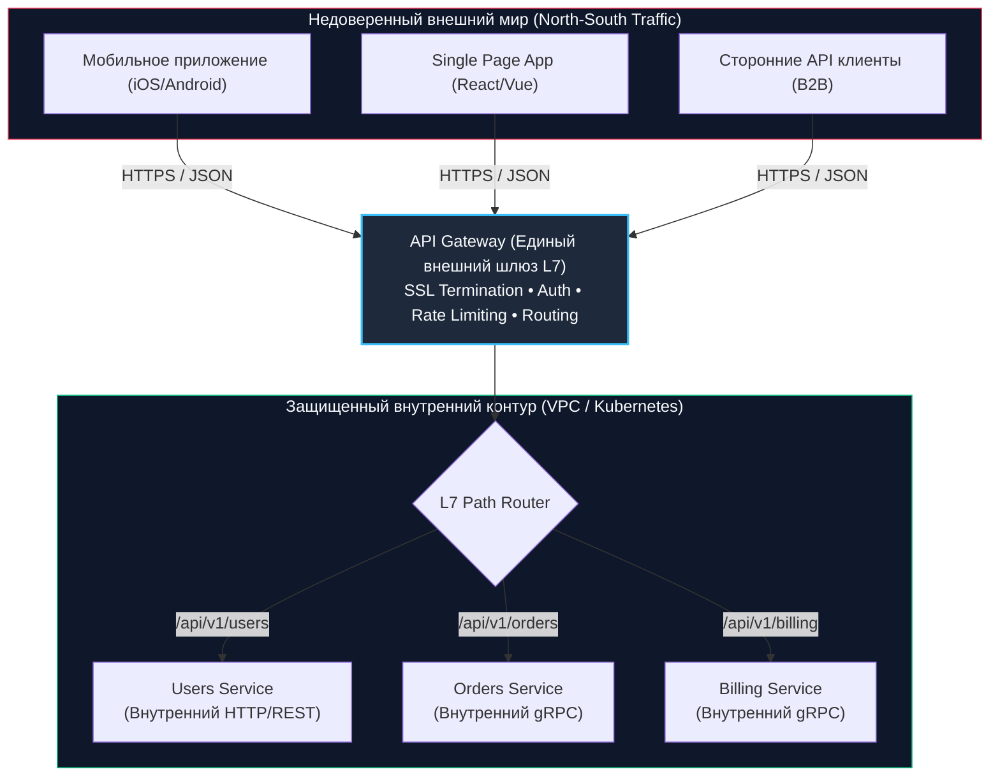
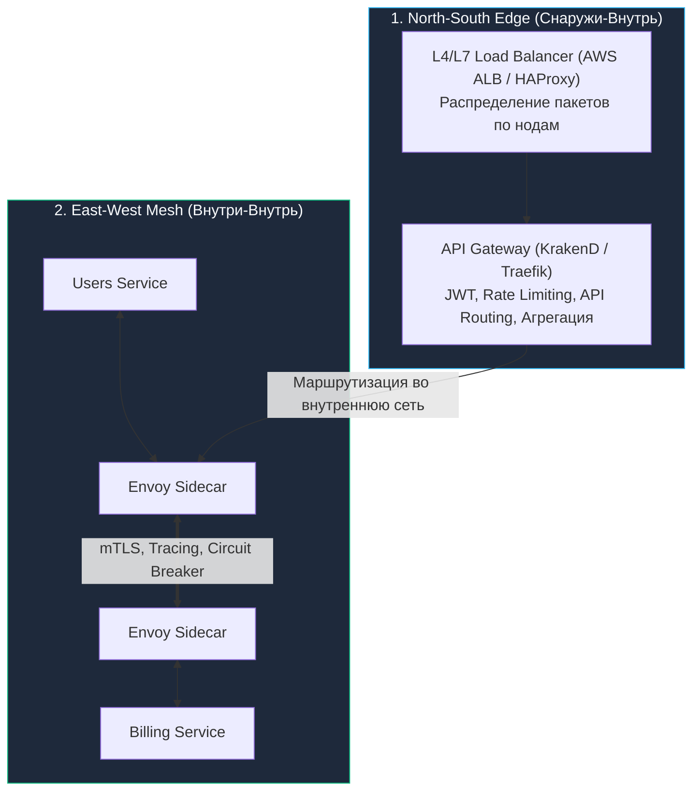

# Архитектура API Gateway в Go: Единая точка входа для микросервисов

> *«Секрет построения больших систем в том, чтобы никогда не строить монолитных гигантов: создавайте простые компоненты, связанные чистыми интерфейсами».*

В проектировании распределенных систем наступает момент, когда количество независимых сервисов перерастает способность внешнего мира с ними взаимодействовать. В предыдущих статьях мы освоили мощный арсенал протоколов: от быстрого REST и строгого [[16. gRPC. Основы.md|gRPC]] до гибкого GraphQL, двунаправленных сокетов [[22. WebSocket.md]] и потокового [[23. Server Sent Events.md]]. Теперь представьте, что ваш проект масштабировался до 50–100 микросервисов.

Если разрешить мобильным приложениям, веб-клиентам (SPA) или сторонним разработчикам стучаться в каждый микросервис напрямую, открыв сотню публичных IP-адресов наружу, архитектура мгновенно погрузится в хаос:
1. **Сложность клиентского кода:** Клиент вынужден знать топологию всех внутренних хостов, управлять отдельными пулами соединений к десяткам доменов и страдать от проблем кросс-доменных запросов (CORS).
2. **Дублирование сквозной функциональности (Cross-Cutting Concerns):** Каждый из 50 микросервисов вынужден самостоятельно реализовывать проверку JWT-токенов, настраивать Rate Limiting ([[11. Rate limiting в API.md]]), защищаться от DDoS, парсить заголовки трейсинга и писать логи аудита.
3. **Раздутая поверхность атаки (Attack Surface):** Чем больше внутренних портов и сервисов выставлено в публичный интернет, тем выше вероятность пропустить уязвимость нулевого дня.

Паттерн **API Gateway (API-Шлюз)** решает эту проблему, выставляя надежную, монолитную «входную дверь» (высокопроизводительный Reverse Proxy на стероидах) на границе между внешним недоверенным миром и защищенным внутренним периметром кластера.

---

## 1. Хаос микросервисов: Зачем нужна "Входная дверь"

Представьте крупный исследовательский институт или посольство с сотней секретных лабораторий. Было бы безумием позволить любому прохожему с улицы свободно бродить по коридорам и стучаться в двери каждой лаборатории, требуя от ученых проверять паспорта, проводить досмотр, измерять температуру и переводить с иностранных языков.

Вместо этого на входе возводится единый контрольно-пропускной пункт (**КПП**):
- Охранник проверяет пропуск и личность гостя (**Аутентификация**).
- Турникет с металлоискателем отсекает опасные предметы и контролирует поток людей (**WAF и Rate Limiting**).
- Дежурный администратор смотрит в справочник и направляет посетителя в нужный корпус по внутреннему переходу (**L7 Routing**).
- На грудь посетителю вешают внутренний бейдж с его правами доступа (**Обогащение заголовков, `X-User-ID`**).

Внутри периметра ученые в лабораториях (микросервисы) полностью изолированы от внешней суеты и сосредоточены исключительно на своей предметной области.



---

## 2. Функции API Gateway

Квалифицированный архитектор четко разделяет понятия **Domain Logic** (бизнес-логика предметной области) и **Edge Concerns** (пограничная инфраструктурная логика). 

API Gateway забирает на себя всю пограничную нагрузку прикладного уровня (L7):

* **Терминация SSL/TLS:** Шлюз берет на себя криптографическую расшифровку HTTPS-трафика. Внутренние сервисы избавлены от накладных расходов на TLS-хэндшейки и могут общаться по быстрому plain HTTP (или через mTLS, управляемый аппаратным Service Mesh).
* **Централизованная Аутентификация и Авторизация:** Шлюз проверяет валидность криптографической подписи JWT-токена, валидирует сессионные куки или API-ключи. Если токен невалиден — запрос отклоняется статусом `401 Unauthorized` на самом входе, не доходя до внутренних сервисов. При успехе шлюз обогащает заголовки (добавляет `X-User-ID: 123`, `X-User-Roles`, `X-Forwarded-Host`) и передает запрос дальше.
* **Rate Limiting & Throttling:** Защита бэкендов от перегрузки и злоупотреблений. Шлюз подсчитывает лимиты (например, через Redis Token Bucket) и возвращает `429 Too Many Requests`.
* **Request Routing (Маршрутизация):** Разбор URL-префиксов, заголовков и методов запроса для направления трафика на нужные сервисы. Поддержка канареечных релизов (Canary Releases), сине-зеленого деплоя (Blue-Green) и A/B-тестирования.
* **Трансляция протоколов (Protocol Translation):** Преобразование внешнего публичного REST/JSON трафика во внутренние высокоэффективные бинарные вызовы gRPC (паттерн gRPC-Gateway).
* **Удаление Hop-by-hop заголовков:** Очистка служебных заголовков промежуточных узлов сети (`Connection`, `Keep-Alive`, `Proxy-Authenticate`) согласно RFC 7230.

---

## 3. Mechanical Sympathy: Пишем API Gateway на Go

Написание легковесного обратного прокси-сервера в Go не требует тяжелых сторонних фреймворков благодаря встроенному в стандартную библиотеку механизму `net/http/httputil.ReverseProxy`.

### Ловушка наивной реализации и потоковая передача (`io.Copy`)

Типичная ошибка неопытного разработчика — попытка написать прокси «в лоб»:
1. Прочитать входящее тело запроса в память через `io.ReadAll(r.Body)`.
2. Создать новый объект `http.Request` с полученным байтовым срезом.
3. Отправить запрос в upstream через `http.Client` (`client.Do()`).
4. Прочитать весь ответ в память и отдать клиенту.

**Такой подход смертелен для высоконагруженного шлюза.** Если через шлюз загружается файл размером 500 МБ или идет длинный видеопоток, сервер выделит сотни мегабайт в куче (`Heap`). При параллельных запросах сервер немедленно погибнет от исчерпания памяти (OOM) и завалит Garbage Collector гигантскими паузами.

Стандартный `httputil.ReverseProxy` спроектирован с идеальной Mechanical Sympathy. Он организует **потоковую передачу данных без буферизации всего тела**. Он соединяет входящий сокет с исходящим через механизм `io.Copy`, прокачивая байты небольшими фиксированными чанками (32 КБ) через переиспользуемые пулы буферов памяти.

> [!info] Под капотом: Новое API в Go 1.20+ (`Rewrite` вместо `Director`)
> Исторически настройка `ReverseProxy` в Go осуществлялась через функцию `Director(req *http.Request)`. Это порождало массу уязвимостей: `Director` не очищал опасные Hop-by-hop заголовки, не изолировал входящие параметры запроса и требовал ручной модификации полей `req.URL`.  
> Начиная с **Go 1.20**, стандартная библиотека представила современный хук `Rewrite: func(pr *httputil.ProxyRequest)`.  
> Метод `ProxyRequest.SetURL()` корректно перенаправляет запрос на целевой хост (а опасные hop-by-hop заголовки автоматически очищаются инфраструктурой `ProxyRequest` еще до вызова `Rewrite`). Для безопасной и стандартизированной настройки цепочки заголовков `X-Forwarded-*` (`X-Forwarded-For`, `X-Forwarded-Host`, `X-Forwarded-Proto`) в `ProxyRequest` предусмотрен специализированный метод `pr.SetXForwarded()`.

### Производственный пример API Gateway на Go 1.20+

```go
package main

import (
	"context"
	"log"
	"net"
	"net/http"
	"net/http/httputil"
	"net/url"
	"strings"
	"time"
)

// NewServiceGateway создает настроенный ReverseProxy для конкретного микросервиса
func NewServiceGateway(targetURL *url.URL) *httputil.ReverseProxy {
	proxy := &httputil.ReverseProxy{
		// Идиоматичный хук Go 1.20+
		Rewrite: func(pr *httputil.ProxyRequest) {
			// Безопасно выставляем целевой хост и схему
			pr.SetURL(targetURL)

			// Добавляем обязательные служебные заголовки для upstream сервиса
			pr.Out.Header.Set("X-Forwarded-Host", pr.In.Host)
			pr.Out.Header.Set("X-Gateway-Auth", "verified")

			// Пример передачи идентификатора пользователя из контекста авторизации
			if userID, ok := pr.In.Context().Value("user_id").(string); ok {
				pr.Out.Header.Set("X-User-ID", userID)
			}
		},

		// Тонкая настройка пула TCP-соединений (Критично для Highload!)
		Transport: &http.Transport{
			Proxy: http.ProxyFromEnvironment,
			DialContext: (&net.Dialer{
				Timeout:   5 * time.Second,  // Таймаут установки TCP соединения
				KeepAlive: 30 * time.Second, // Период отправки TCP Keep-Alive зондов
			}).DialContext,
			ForceAttemptHTTP2:     true,
			MaxIdleConns:          1000,             // Общий пул свободных соединений
			MaxIdleConnsPerHost:   100,              // Пул соединений к конкретному микросервису!
			IdleConnTimeout:       90 * time.Second, // Время жизни простаивающего сокета
			TLSHandshakeTimeout:   5 * time.Second,
			ResponseHeaderTimeout: 5 * time.Second,  // Защита от зависших бэкендов
			ExpectContinueTimeout: 1 * time.Second,
		},

		// Обработчик ошибок связи с upstream-микросервисом
		ErrorHandler: func(w http.ResponseWriter, r *http.Request, err error) {
			log.Printf("[Gateway Error] Upstream connection failed: %v", err)
			http.Error(w, "Bad Gateway: Service Unavailable", http.StatusBadGateway)
		},
	}

	return proxy
}

// AuthMiddleware эмулирует пограничную аутентификацию
func AuthMiddleware(next http.Handler) http.Handler {
	return http.HandlerFunc(func(w http.ResponseWriter, r *http.Request) {
		token := r.Header.Get("Authorization")
		if !strings.HasPrefix(token, "Bearer ") {
			http.Error(w, "Unauthorized: missing bearer token", http.StatusUnauthorized)
			return
		}

		// Здесь происходит валидация JWT: проверка подписи ключом и срока жизни
		// При успехе извлекаем Subject (User ID) и прокидываем в контекст
		ctx := context.WithValue(r.Context(), "user_id", "usr_998877")
		next.ServeHTTP(w, r.WithContext(ctx))
	})
}

func main() {
	usersTarget, err := url.Parse("http://internal-users-service:8080")
	if err != nil {
		log.Fatalf("Invalid users target URL: %v", err)
	}

	ordersTarget, err := url.Parse("http://internal-orders-service:8081")
	if err != nil {
		log.Fatalf("Invalid orders target URL: %v", err)
	}

	usersGateway := NewServiceGateway(usersTarget)
	ordersGateway := NewServiceGateway(ordersTarget)

	mux := http.NewServeMux()

	// Монтируем защищенные маршруты
	mux.Handle("/api/users/", AuthMiddleware(usersGateway))
	mux.Handle("/api/orders/", AuthMiddleware(ordersGateway))

	server := &http.Server{
		Addr:         ":8080",
		Handler:      mux,
		ReadTimeout:  10 * time.Second,
		WriteTimeout: 60 * time.Second, // Запас на долгие стримы
		IdleTimeout:  120 * time.Second,
	}

	log.Println("API Gateway запущен на порту :8080")
	if err := server.ListenAndServe(); err != nil && err != http.ErrServerClosed {
		log.Fatalf("Gateway fatal error: %v", err)
	}
}
```

---

## 4. Ловушки производительности (Gotchas)

### 1. Изменение тела ответа (Response Body Modification)

Распространенная задача при написании шлюза: перехватить тело ответа микросервиса, изменить в нем структуру полей, залогировать JSON или отфильтровать конфиденциальные данные. В `ReverseProxy` для этого предусмотрен коллбэк `ModifyResponse`.

> [!warning] Ловушка / Gotcha: Смерть Streaming-а и OOM
> Как только вы решаете изменить или прочитать `resp.Body` внутри `ModifyResponse`, вы **разрушаете сквозную потоковую передачу (streaming)**.  
> Чтобы изменить тело ответа, рантайму Go придется вычитать его целиком в оперативную память через `io.ReadAll(resp.Body)`. Если клиент скачивает файл размером 1 ГБ или смотрит стрим, ваша горутина аллоцирует 1 ГБ в куче (`Heap`). Если 10 клиентов делают это одновременно — ваш Gateway мгновенно погибает с системной ошибкой OOM (Out of Memory).  
> **Инженерное правило:** API Gateway должен оставаться максимально «глупым» в отношении полезной нагрузки (payload). Никогда не парсите и не логируйте полные тела запросов и ответов на шлюзе, за исключением редких метаданных (и строго с ограничением размера через `io.LimitReader`).

### 2. Утечка файловых дескрипторов и Time-Wait шторм

В примере кода мы сознательно настроили кастомный `http.Transport`. Если разработчик оставляет транспорт по умолчанию (`http.DefaultTransport`), в условиях Highload-нагрузки шлюз быстро выйдет из строя.

По умолчанию в стандартном транспорте Go значение `MaxIdleConnsPerHost = 2` (по умолчанию всего два соединения на хост)!  
Если к сервису `internal-users-service` идет поток из 500 запросов в секунду, Go будет использовать всего 2 постоянных соединения, а остальные 498 соединений будет открывать и немедленно закрывать после ответа. Это приводит к:
1. Исчерпанию системного пула свободных сокетов ядра Linux (`ulimit -n`).
2. Забиванию таблицы соединений сокетами в статусе `TIME_WAIT`.
3. Огромным накладным расходам CPU на непрерывные TCP-хэндшейки.

**Решение:** Всегда явно конфигурируйте `MaxIdleConns` и `MaxIdleConnsPerHost` (минимум 100–500 для ключевых бэкенд-хостов).

---

## 5. Индустриальные стандарты: Зачем писать самому?

В 90% реальных проектов вам **не нужно** писать свой API Gateway на Go с нуля, несмотря на всю элегантность стандартного пакета `httputil`. В современной экосистеме существуют зрелые, проверенные миллионными RPS решения, написанные на Go и C++:

1. **KrakenD:** Сверхбыстрый stateless API Gateway, написанный на Go (на базе архитектурного фреймворка Lura). Его ключевая особенность — декларативная трансформация и параллельная агрегация данных. В конфигурационном файле можно задать правило: при одном входящем запросе клиента шлюз параллельно вызывает три микросервиса, склеивает их JSON-ответы в единую структуру и отдает клиенту за миллисекунды.
2. **Traefik:** Популярный Cloud-Native Edge Router на Go. Создан для микросервисных сред. Идеально интегрируется с Kubernetes Ingress и Docker Swarm, автоматически отслеживает запуск новых подов, регистрирует маршруты и самостоятельно выписывает бесплатные SSL-сертификаты через Let's Encrypt.
3. **Tyk:** Полноценная enterprise-платформа управления API (API Management), написанная на Go. Включает графический интерфейс, биллинг для платных API, квоты, портал разработчика и версионирование.
4. **Envoy Proxy:** Высокопроизводительный прокси на C++, стандарт де-факто для облачных сред и Service Mesh.

Писать собственный шлюз на базе `httputil.ReverseProxy` имеет смысл только тогда, когда вам требуется специфическая, динамическая бизнес-маршрутизация или проприетарные алгоритмы шифрования, которые невозможно выразить в YAML-конфигах стандартных шлюзов.

---

## 6. Архитектурный кругозор: Gateway vs Load Balancer vs Service Mesh

На собеседованиях Senior-разработчиков часто просят провести четкую грань между тремя типами балансировки и проксирования.



> [!tip] Собеседование: Классификация прокси в архитектуре
> **Вопрос:** В чем принципиальная разница между Load Balancer (например, AWS ALB), API Gateway и Service Mesh (например, Istio/Envoy)?
> 
> **Ответ:**  
> 1. **Load Balancer (L4/L7):** Простая балансирующая труба. Его задача — быстро распределить сырой трафик по здоровым физическим серверам или подам (Round-Robin, Least Connections). Он ничего не знает о пользователях, правах и бизнес-сущностях.
> 2. **API Gateway (L7 Edge / North-South):** Интеллектуальная точка входа из внешнего мира во внутренний. Он защищает периметр: терминирует публичный SSL, проверяет JWT-токены, применяет бизнес-лимиты (Rate Limiting), маппит публичные пути на внутренние сервисы и агрегирует ответы.
> 3. **Service Mesh (L7 Internal / East-West):** Управляет трафиком между внутренними микросервисами внутри кластера. Строится на базе Sidecar-прокси (Envoy), работающих рядом с каждым микросервисом. Обеспечивает взаимное сквозное шифрование (mTLS), распределенную трассировку (OpenTelemetry), автоматические повторы (Retries) и предохранители (Circuit Breakers).

---

## 7. Итог

1. **API Gateway** служит единой «входной дверью» для микросервисной системы, изолируя внутреннюю архитектуру от внешних клиентов и забирая на себя сквозную инфраструктурную нагрузку (SSL, Auth, Rate Limiting, CORS).
2. В языке Go создание базового шлюза тривиально благодаря `httputil.ReverseProxy`. Потоковое копирование данных (`io.Copy`) минимизирует аллокации в куче и разгружает сборщик мусора (Garbage Collector).
3. Начиная с Go 1.20, рекомендуется использовать хук `Rewrite` вместо устаревшего `Director` для безопасной модификации запросов.
4. Модификация тел ответов (`ModifyResponse`) ломает потоковую передачу данных и чревата падением процесса от OOM.
5. Для высоконагруженных промышленных систем предпочтительнее выбирать проверенные OpenSource решения на Go (KrakenD, Traefik), прибегая к кастомному коду только при узкоспецифических требованиях бизнеса.

API Gateway идеально решает задачу единой точки входа. Но что делать, если мобильному приложению требуется компактный JSON с пятью полями, а веб-дашборду — массивный объект с сотней полей и аналитикой? Если попытаться упаковать разнородные клиентские адаптеры в единый общий шлюз, он превратится в неповоротливый «монолитный шлюз». Для элегантного решения этой проблемы существует специализированный паттерн, который мы разберем в следующей статье: [[26. BFF pattern.md]].
