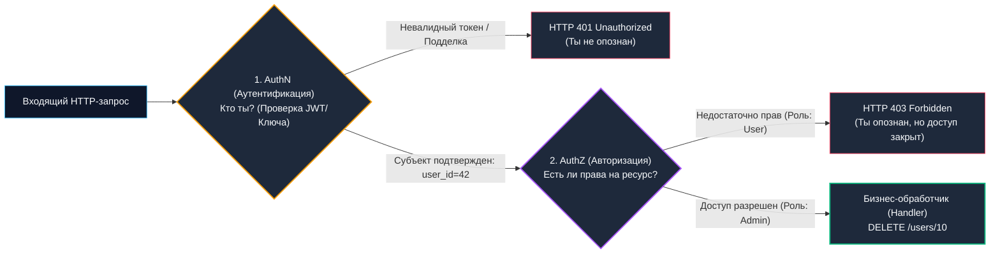
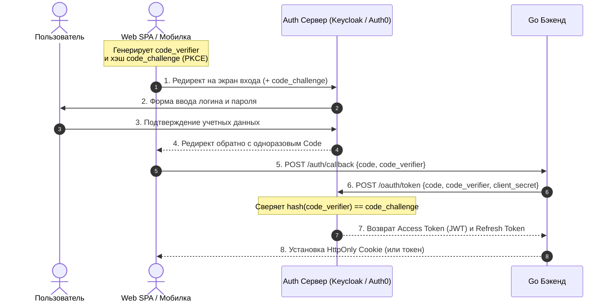

# Безопасность API в Go: Аутентификация, JWT, OAuth 2.0 и контроль доступа

> *«Простота — обязательная предпосылка надежности, и нигде это правило не звучит столь непреложно, как в вопросах безопасности».*    
> — Эдсгер Дейкстра

В проектировании распределенных систем производительность и элегантность архитектуры не стоят ничего, если система не способна защитить свои данные. В предыдущих главах мы научились строить молниеносные HTTP-сервисы, настраивать потоковые шлюзы [[25. API Gateway.md]] и адаптировать контракты через [[26. BFF pattern.md]]. Однако без бескомпромиссного слоя безопасности эта скорость будет обращена против вас: злоумышленники воспользуются высокой пропускной способностью рантайма Go для мгновенного опустошения вашей базы данных.

Инженерная безопасность — это не декорация, которую можно «прикрутить» перед релизом. Это фундаментальный сквозной слой, пронизывающий каждый сетевой пакет. Для инженера уровня Senior понимание криптографических примитивов, математики подписи, стандартов авторизации и уязвимостей OWASP API Security столь же критично, сколь и знание работы сборщика мусора и планировщика горутин.

В этой статье мы разберем два базовых столпа безопасности: **Аутентификацию (AuthN)** и **Авторизацию (AuthZ)**.

---

## 1. Терминология: AuthN vs AuthZ

Это классический вопрос-разминка на архитектурных собеседованиях, на котором регулярно спотыкаются разработчики, использующие эти термины как взаимозаменяемые синонимы.

Представьте процедуру прохождения государственной границы в международном аэропорту:
1. **Аутентификация (Authentication / AuthN) — *«Кто ты такой?»*:**  
   Пограничник берет ваш заграничный паспорт, проверяет голограммы, водяные знаки, биометрический чип и соответствие фотографии вашему лицу. Это процесс проверки подлинности субъекта.  
   *В API:* проверка логина и пароля, валидация криптографической подписи JWT-токена, проверка API-ключа или взаимных сертификатов.
2. **Авторизация (Authorization / AuthZ) — *«Что тебе разрешено делать?»*:**  
   Убедившись, что вы — гражданин Иванов, пограничник открывает визу и таможенные правила. Выясняется, что с вашей туристической визой вам запрещено официально работать или посещать закрытые военные объекты. Это процесс проверки прав доступа подтвержденного субъекта к конкретному бизнес-ресурсу.  
   *В API:* может ли пользователь с `user_id = 42` выполнить `DELETE /users/10` или удалить статью с `post_id = 5`?



---

## 2. Эволюция аутентификации: От сессий к токенам

Исторически веб-приложения опирались на **Stateful-сессии**. Пользователь передавал учетные данные, сервер проверял хэш пароля в БД, генерировал криптографически стойкую псевдослучайную строку (`session_id`), сохранял связь `session_id -> user_id` в оперативной памяти или Redis и возвращал клиенту заголовок `Set-Cookie`.

В современных микросервисных и REST-архитектурах ([[3. REST. Основные принципы.md]]) такой подход создает узкие места:
1. **Нарушение Stateless:** Сервер вынужден хранить состояние сессии.
2. **Сетевой оверхед (IO Latency):** При 50 000 RPS каждый микросервис кластера обязан на каждый входящий запрос делать сетевой вызов в централизованный Redis для проверки существования сессии. Если Redis испытывает задержки — деградирует весь бэкенд.

Для решения этой проблемы распределенные системы перешли на **Stateless-токены**, де-факто стандартом среди которых стал **JWT (JSON Web Token)** (RFC 7519).

---

## 3. Анатомия JWT и Mechanical Sympathy

Криптографический токен JWT представляет собой компактную строку, состоящую из трех частей, разделенных точками:  
Криптографический токен JWT представляет собой компактную строку: `Header.Payload.Signature` (Заголовок, Полезная нагрузка, Подпись).

* **Header (Заголовок):** JSON с метаданными токена (тип `typ: "JWT"` и алгоритм подписи `alg: "RS256"` или `alg: "ES256"`), закодированный в Base64URL.
* **Payload (Полезная нагрузка):** JSON с утверждениями (Claims: идентификатор пользователя `sub`, срок жизни `exp`, эмитент `iss`, роли `roles`), также закодированный в Base64URL.
* **Signature (Криптографическая подпись):** Хэш или цифровая подпись, вычисленная от склейки `Header + "." + Payload` с использованием секретного ключа сервера.

> **Критическое правило безопасности:** Заголовок и полезная нагрузка JWT **не шифруются**! Любой человек, перехвативший токен, может мгновенно декодировать Base64URL и прочитать все поля полезной нагрузки. Секретность и надежность JWT заключаются исключительно в **невозможности подделать подпись** без знания закрытого ключа. Никогда не храните в JWT пароли, номера банковских карт или персональные конфиденциальные данные.

### Симметричные vs Асимметричные алгоритмы подписи

С точки зрения рантайма Go и нагрузки на процессор верификация JWT — это чистая математика:

| Свойство | Симметричные (HMAC: HS256, HS512) | Асимметричные (RSA: RS256) | Эллиптические кривые (ECDSA: ES256 / Ed25519) |
|---|---|---|---|
| **Ключи** | Один общий секретный ключ | Пара: Private (подпись) + Public (проверка) | Пара: Private (подпись) + Public (проверка) |
| **Распределение** | Секрет должен храниться на всех сервисах | Публичный ключ доступен всем, приватный изолирован | Публичный ключ доступен всем, приватный изолирован |
| **Риск утечки** | Утечка на 1 сервисе компрометирует всю систему | Безопасно: компрометация сервиса-читателя не дает права подписи | Безопасно: закрытый ключ хранится только на Auth-сервере |
| **Цена CPU в Go** | **Экстремально дешево** (<1 мкс на проверку) | **Очень дорого** (50–100 мкс, модульное возведение в степень) | **Оптимально** (10–20 мкс, компактные ключи) |

> [!info] Под капотом: Математика RSA и планировщик Go (Scheduler)
> Проверка RSA-подписи (алгоритм RS256) требует интенсивных целочисленных вычислений с огромными числами (2048–4096 бит). В пакете `crypto/rsa` это приводит к жесткой загрузке CPU.  
> В отличие от сетевого ввода-вывода (который паркует горутину через Netpoller), криптографические вычисления непрерывно занимают физический поток ядра ОС (**M**). Если на шлюз поступает 20 000 RPS с валидацией RSA на каждый запрос, потоки ядра насыщаются математикой, вытесняя другие горутины и увеличивая latency p99.  
> **Инженерный выбор для Highload:** Переход на **ECDSA (ES256)** или **Ed25519**. Эллиптическая кривая обеспечивает криптографическую стойкость ключа RSA-3072 при размере ключа всего 256 бит, снижая нагрузку на CPU сервера в 4–5 раз.

---

## 4. Ловушка пакета golang-jwt/jwt: Атака Key Confusion

Библиотека `github.com/golang-jwt/jwt` является общепринятым инструментом работы с токенами в Go. Однако наивная реализация коллбэка проверки ключа содержит уязвимость критического уровня (CVSS 9.8).

> [!warning] Ловушка / Gotcha: Атака Algorithm / Key Confusion
> Представьте, что ваш сервис проверяет токены, подписанные асимметричным алгоритмом **RS256**. Для проверки подписи сервис использует открытый ключ (публичный PEM-сертификат, доступный в JWKS или на диске).  
> Злоумышленник берет ваш открытый ключ, конструирует произвольный токен с ролью `admin`, но в поле заголовка подменяет асимметричный алгоритм на симметричный: `alg: "HS256"`. В качестве симметричного HMAC-секрета злоумышленник использует байты вашего **публичного ключа**!  
> Если ваш Go-обработчик возвращает ключ в виде сырого среза байт `[]byte` (например, прочитанный PEM-файл) и не проверяет заголовок алгоритма:
> ```go
> // НЕБЕЗОПАСНЫЙ КОД: Уязвим к Key Confusion!
> token, err := jwt.Parse(tokenStr, func(t *jwt.Token) (interface{}, error) {
>     // Если вернуть сырые байты открытого ключа rsaPublicKeyBytes без проверки алгоритма:
>     return rsaPublicKeyBytes, nil // При alg="HS256" библиотека примет их как HMAC-секрет!
> })
> ```
> Библиотека применит HMAC-SHA256, используя открытый ключ как секрет, подпись сойдется, и атакующий получит полный административный доступ. (В случае типизированного `*rsa.PublicKey` метод HMAC вернет ошибку типов `ErrInvalidKeyType`, но если в функцию передан `[]byte`, атака пройдет успешно).  
> 
> **Надежная защита:** В коллбэке `Keyfunc` всегда **жестко проверяйте семейство алгоритмов**:
> ```go
> token, err := jwt.Parse(tokenStr, func(t *jwt.Token) (interface{}, error) {
>     // КРИТИЧЕСКИ ВАЖНО: Валидируем семейство алгоритмов
>     if _, ok := t.Method.(*jwt.SigningMethodRSA); !ok {
>         return nil, fmt.Errorf("unexpected signing method: %v", t.Header["alg"])
>     }
>     return rsaPublicKey, nil
> })
> ```

---

## 5. OAuth 2.0: Делегирование доступа

Широко распространенное заблуждение — называть OAuth 2.0 протоколом аутентификации. На самом деле **OAuth 2.0 (RFC 6749)** — это протокол **делегированной авторизации**.

Его цель — позволить стороннему приложению получить ограниченный доступ к ресурсам пользователя на сервере (например, разрешить сервису печати фото получить доступ к вашим фотографиям в Google) **без передачи логина и пароля пользователя этому приложению**.

Полноценным протоколом аутентификации на базе OAuth 2.0 является надстройка **OpenID Connect (OIDC)**, стандартизировавшая выпуск криптографического паспорта — токена идентификации `id_token` (в формате JWT).

### Authorization Code Flow с расширением PKCE

В современных веб-приложениях (Single Page Applications) и мобильных клиентах стандартом безопасности является **Authorization Code Flow with PKCE** (Proof Key for Code Exchange, RFC 7636). 

Браузерные клиенты работают в недоверенной среде (исходный код JavaScript открыт, есть риск атак XSS). В них категорически запрещено хранить долговременные секреты (`client_secret`).



**Почему именно такая схема?**  
Одноразовый код авторизации (`Code`) перехватить в браузере бесполезно: без оригинального случайного секрета `code_verifier`, который знает только клиент, и серверного `client_secret`, который знает только Go-бэкенд, Auth-сервер откажет в выдаче токена.

---

## 6. Идиоматичная реализация AuthN/AuthZ в Go

В языке Go разделение уровней проверки реализуется через цепочку HTTP Middleware (паттерн Decorator).

### Безопасное хранение контекста запроса

При передаче метаданных пользователя (`user_id`, роли) из middleware в бизнес-обработчик важно не использовать встроенные строковые ключи в `context.Context` во избежание коллизий с другими библиотеками:

```go
package auth

import (
	"context"
	"errors"
	"fmt"
	"net/http"
	"strings"

	"github.com/golang-jwt/jwt/v5"
)

// Идиоматичный Go: неэкспортируемый тип ключа контекста гарантирует 0% коллизий
type contextKey struct{}

type UserClaims struct {
	UserID string   `json:"sub"`
	Role   string   `json:"role"`
	Scopes []string `json:"scopes"`
	jwt.RegisteredClaims
}

var userClaimsKey = contextKey{}

// 1. AuthN Middleware: Проверка подписи токена и срока жизни
func RequireAuth(jwtKey interface{}) func(http.Handler) http.Handler {
	return func(next http.Handler) http.Handler {
		return http.HandlerFunc(func(w http.ResponseWriter, r *http.Request) {
			authHeader := r.Header.Get("Authorization")
			if authHeader == "" || !strings.HasPrefix(authHeader, "Bearer ") {
				http.Error(w, "Unauthorized: missing bearer token", http.StatusUnauthorized)
				return
			}

			tokenStr := strings.TrimPrefix(authHeader, "Bearer ")
			claims := &UserClaims{}

			token, err := jwt.ParseWithClaims(tokenStr, claims, func(t *jwt.Token) (interface{}, error) {
				// Защита от Key Confusion
				if _, ok := t.Method.(*jwt.SigningMethodHMAC); !ok {
					return nil, fmt.Errorf("unexpected signing method: %v", t.Header["alg"])
				}
				return jwtKey, nil
			})

			if err != nil || !token.Valid {
				http.Error(w, "Unauthorized: invalid or expired token", http.StatusUnauthorized)
				return
			}

			// Помещаем валидированные клеймы в контекст запроса
			ctx := context.WithValue(r.Context(), userClaimsKey, claims)
			next.ServeHTTP(w, r.WithContext(ctx))
		})
	}
}

// 2. AuthZ Middleware: Проверка роли пользователя (RBAC)
func RequireRole(requiredRole string) func(http.Handler) http.Handler {
	return func(next http.Handler) http.Handler {
		return http.HandlerFunc(func(w http.ResponseWriter, r *http.Request) {
			claims, ok := r.Context().Value(userClaimsKey).(*UserClaims)
			if !ok || claims == nil {
				// Если AuthN не сработал раньше — внутренняя ошибка сервера
				http.Error(w, "Internal security error", http.StatusInternalServerError)
				return
			}

			// Если роль не совпадает — отдаем 403 Forbidden (НЕ 401!)
			if claims.Role != requiredRole {
				http.Error(w, "Forbidden: insufficient permissions", http.StatusForbidden)
				return
			}

			next.ServeHTTP(w, r)
		})
	}
}
```

> [!tip] Собеседование: RBAC vs ABAC vs ReBAC
> **Вопрос:** В чем фундаментальная разница между моделями авторизации RBAC и ABAC? Когда RBAC перестает справляться?
> 
> **Ответ:**  
> * **RBAC (Role-Based Access Control):** Статическая модель на основе ролей. Правило звучит как: *«Роль Admin может удалять любые статьи»*. Легко реализуется в коде через проверку `claims.Role == "admin"`.
> * **ABAC (Attribute-Based Access Control):** Динамическая контекстная модель. Правило звучит как: *«Пользователь может редактировать документ, ТОЛЬКО ЕСЛИ `article.author_id == user.id` И `time.Now() < article.created_at + 24h` И IP-адрес принадлежит корпоративной подсети»*.  
> RBAC бессилен перед проверкой владения ресурсом (BOLA). Для сложного ABAC в Go используют специализированные движки политик: **Open Policy Agent (OPA)** с декларативным языком Rego или бессерверные ReBAC-сервисы (Ory Keto, Google Zanzibar).

---

## 7. OWASP Top 10 в контексте Go API

Помимо компрометации токенов, современный сетевой API подвержен классическим уязвимостям уровня приложения:

1. **SQL Injection (SQLi):**  
   *Ловушка:* Форматирование SQL-запросов через `fmt.Sprintf("SELECT * FROM users WHERE id = '%s'", input)`.  
   *Решение в Go:* Всегда использовать параметризованные плейсхолдеры (`$1` в PostgreSQL или `?` в MySQL) через пакет `database/sql`. Драйвер базы данных передает параметры отдельно от дерева разбора SQL, гарантируя невозможность выполнения внедренного кода.
2. **Broken Object Level Authorization (BOLA / IDOR):**  
   Уязвимость №1 в рейтинге OWASP API Security. Пользователь $A$ отправляет запрос `GET /api/v1/invoices/998`. Токен пользователя $A$ валиден, но счет №998 принадлежит пользователю $B$. Если обработчик не сверяет принадлежность ресурса владельцу токена, злоумышленник может выкачать счета всей компании.
3. **Cross-Site Scripting (XSS):**  
   Если ваш Go API отдает `application/json`, браузер по умолчанию не выполняет вложенные теги `<script>`. Однако критически важно всегда явно выставлять заголовок `Content-Type: application/json; charset=utf-8` (см. [[6. Статусы HTTP.md]]), чтобы старые браузеры не активировали алгоритм MIME-sniffing и не попытались интерпретировать JSON как HTML.
4. **Cross-Site Request Forgery (CSRF):**  
   - Если ваши JWT-токены хранятся в LocalStorage — CSRF невозможен (так как JS-код фронтенда сам прикрепляет заголовок `Authorization: Bearer`).
   - Если токены хранятся в `HttpOnly Cookie` (что безопаснее от XSS), браузер автоматически прикрепляет их к любым междоменным запросам. Злоумышленник может обманом заставить жертву кликнуть ссылку, отправив вредоносный `POST`-запрос на перевод денег.  
   *Защита в Go:* Настройка атрибутов кук `SameSite=Strict; Secure; HttpOnly`, проверка заголовков `Origin` / `Referer` и использование пакета `gorilla/csrf` (паттерн Double Submit Cookie).
5. **Mass Assignment (Массовое присвоение):**  
   Опасность прямого анмаршалинга `json.Unmarshal(body, &userModel)` сразу в структуру сущности базы данных (например, GORM). Если злоумышленник пришлет JSON `{"name": "Ivan", "is_admin": true}`, поле `IsAdmin` обновится в базе данных.  
   *Защита в Go:* Строгое разделение моделей (см. [[4. Resource oriented design.md]]). Входящий запрос парсится в изолированную структуру DTO (`CreateUserRequest`), где административные поля физически отсутствуют.

---

## 8. Итог

1. **AuthN** идентифицирует субъекта (проверка личности), а **AuthZ** проверяет права субъекта на конкретное действие с ресурсом.
2. **JWT** в REST-архитектурах обеспечивает Stateless-авторизацию. Заголовок и полезная нагрузка открыты для чтения; защита токена строится исключительно на надежности криптографической подписи.
3. Валидация подписи JWT — это нагрузка на процессор. Для высоконагруженных Go-систем предпочтителен алгоритм **ECDSA (ES256)** вместо тяжелого RSA.
4. Защищайтесь от атак **Key Confusion**, жестко проверяя ожидаемый метод подписи в коллбэке `Keyfunc` библиотеки `golang-jwt`.
5. Для Single Page Applications и мобильных устройств стандартом взаимодействия с Auth-серверами (Keycloak, Auth0) является **OAuth 2.0 Authorization Code Flow с PKCE**.
6. Передача пользовательских клеймов в Go осуществляется через строго типизированные ключи в `r.Context()`.

Мы выстроили надежную оборону на прикладном уровне (L7): наши публичные токены защищены, а права доступа проверены на периметре. Но что делать, если злоумышленник или скомпрометированный под перехватывает открытый незашифрованный трафик внутри закрытой корпоративной сети или кластера Kubernetes? О том, как внедрить взаимную криптографическую аутентификацию между сервисами по принципу нулевого доверия (Zero Trust), мы поговорим в следующей статье: [[29. mTLS в сервисах.md]].
