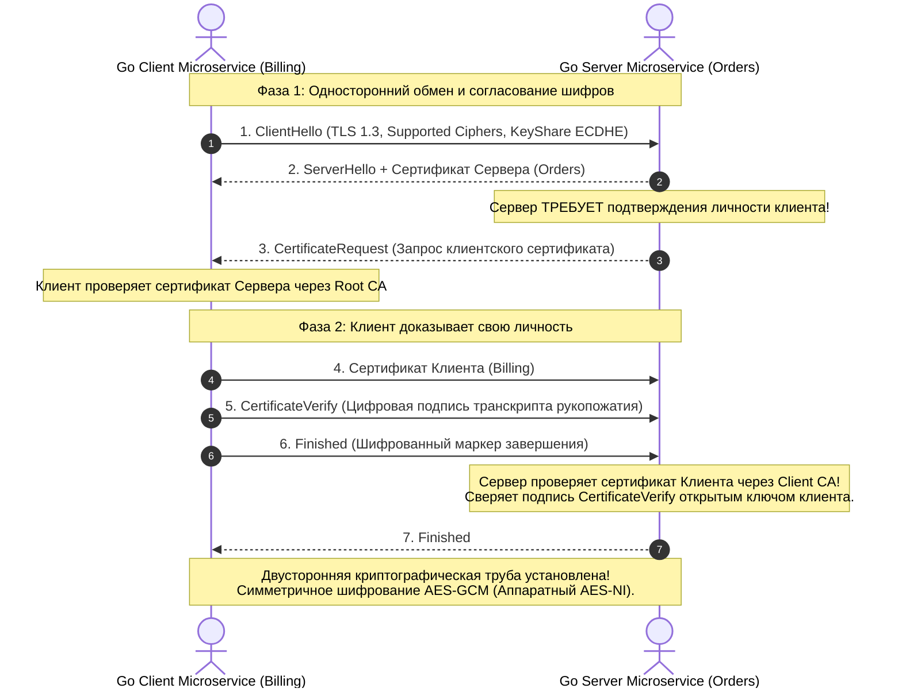
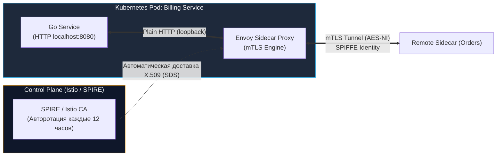

# mTLS в межсервисной архитектуре Go: Бескомпромиссный Zero Trust

> *«Доверяй, но проверяй. А когда создаёшь сетевой софт — не доверяй вовсе ничему».*    
> — Инженерный принцип Bell Labs

В статье [[28. Security API. Auth, OAuth2.md]] мы детально защитили внешний периметр нашей распределенной системы: настроили валидацию криптографических JWT-токенов на уровне [[25. API Gateway.md]] и гарантировали, что ни один анонимный сетевой пакет из интернета не проникнет к бизнес-логике.

Исторически сетевая безопасность корпоративных дата-центров строилась по классической концепции **«Замка и рва» (Castle-and-Moat)**. Снаружи находился опасный, дикий интернет, на границе которого возводились толстые стены (межсетевые экраны, WAF, SSL-терминация). Внутри же периметра кластера (в приватной VPC-сети) царила абсолютная безмятежность: микросервисы общались друг с другом по открытому, незашифрованному протоколу HTTP на стандартных портах (8080, 5000), наивно полагая, что все узлы внутри сети благонадежны.

В современных облачных и контейнерных средах эта модель полностью мертва.

---

## 1. Смерть периметра: Архитектура Zero Trust

Почему концепция «Замка и рва» потерпела сокрушительный крах в современной индустрии?

1. **Уязвимости класса SSRF (Server-Side Request Forgery):** Злоумышленник находит брешь в безобидном внутреннем сервисе конвертации изображений или генерации PDF (например, передавая `http://169.254.169.254/` для кражи метаданных AWS). Получив возможность выполнять запросы от лица одного пода, хакер оказывается внутри вашего «неприступного замка».
2. **Внутренние угрозы (Insider Threats):** Скомпрометированный ноутбук DevOps-инженера с правами доступа к VPN дата-центра позволяет прослушивать (sniffing) внутренний сетевой трафик.
3. **Облачные провайдеры и разделяемая инфраструктура:** Сервисы разворачиваются на виртуальных машинах AWS, GCP или Yandex Cloud. Пакеты физически бегут по оптоволоконным кабелям и коммутаторам сторонних дата-центров, которые вы физически не контролируете.
4. **Атаки Sidecar / Соседние контейнеры:** В больших кластерах Kubernetes сотни подов разных команд делят общие сетевые пространства нод.

Если сервис заказов слепо доверяет любому HTTP-запросу, пришедшему из локальной подсети `10.0.0.0/8`, любой злоумышленник, проникший на любую слабую ноду, мгновенно выкачает всю базу данных клиентов за секунды.

Ответом индустрии стала **Zero Trust Architecture (Архитектура Нулевого Доверия)**. Ее фундаментальный манифест:  
*«Считай локальную сеть столь же враждебной, как и публичный интернет. Никогда не доверяй, всегда проверяй каждое соединение».*

Технологическим фундаментом для реализации Zero Trust в межсервисном общении является **mTLS (Mutual TLS — Взаимный TLS)**.

---

## 2. Анатомия mTLS: Двустороннее рукопожатие

Классический веб-протокол TLS (HTTPS), с которым мы ежедневно взаимодействуем в браузере — это **односторонняя аутентификация**. 

Когда браузер открывает соединение с `google.com`:
1. Браузер (Клиент) проверяет сертификат Сервера, сверяет доменное имя и цепочку доверия до глобального центра сертификации (DigiCert, Let's Encrypt). Клиент убеждается: *«Я действительно говорю с Google, а не с мошенником»*.
2. Серверу же на уровне TLS абсолютно безразлично, кто сидит на том конце сокета. Аутентификация клиента перекладывается на прикладной уровень L7 (передачу логина, сессионных Cookie или JWT-токенов).

**mTLS (Взаимный TLS)** кардинально меняет правила игры. Он обязывает **ОБЕ стороны** предъявить и математически подтвердить свои криптографические сертификаты на этапе создания сетевого сокета — **до того, как будет отправлен хотя бы один байт данных HTTP или gRPC**.



### Что дает mTLS из коробки:
1. **Строгая взаимная аутентификация (AuthN):** Сервер гарантированно знает криптографическую личность вызывающего сервиса. Подделать заголовок `X-Forwarded-For` или послать фальшивый запрос невозможно — без приватного ключа рукопожатие разорвется на шаге 5.
2. **Сквозное шифрование данных (Confidentiality):** Любой перехват пакетов в сети дата-центра (`tcpdump`, скомпрометированный коммутатор) дает злоумышленнику лишь нечитаемый шум.
3. **Защита от модификации трафика (Integrity):** Изменение хотя бы одного бита в сетевом пакете приводит к сбросу сессии (контроль целостности через аутентификационные теги в AEAD-шифрах: GHASH в AES-GCM или Poly1305 в ChaCha20).

---

## 3. Идиоматичный Go: Настройка mTLS в рантайме

Стандартная библиотека языка Go содержит пакет `crypto/tls`, который по праву считается одним из лучших и безопасных TLS-движков в мире. Вам не требуется ставить Nginx перед каждым сервисом — Go поддерживает mTLS прямо в рантайме.

Для функционирования mTLS в закрытой инфраструктуре разворачивается собственный **Внутренний Центр Сертификации (Internal CA — Certificate Authority)**. Корневой сертификат этого CA (`ca.crt`) выступает гарантом доверия и подписывает сертификаты всех серверов и клиентов.

### 1. Код Сервера (Go Server)

Сервер настраивается так, чтобы жестко требовать и валидировать сертификат клиента через директиву `tls.RequireAndVerifyClientCert`:

```go
package main

import (
	"crypto/tls"
	"crypto/x509"
	"log"
	"net/http"
	"os"
)

func main() {
	// 1. Загружаем корневой сертификат нашего внутреннего CA
	caCert, err := os.ReadFile("ca.crt")
	if err != nil {
		log.Fatalf("Failed to read CA cert: %v", err)
	}
	caCertPool := x509.NewCertPool()
	if !caCertPool.AppendCertsFromPEM(caCert) {
		log.Fatal("Failed to append CA cert to pool")
	}

	// 2. Конфигурируем параметры взаимного рукопожатия TLS
	tlsConfig := &tls.Config{
		// RequireAndVerifyClientCert — КРИТИЧЕСКИЙ ПАРАМЕТР!
		// Если клиент не пришлет валидный сертификат, подписанный ClientCAs,
		// ядро Go немедленно оборвет TCP-хэндшейк до вызова HTTP-хэндлера.
		ClientAuth: tls.RequireAndVerifyClientCert,

		// Доверенный пул сертификатов для проверки входящих клиентов
		ClientCAs: caCertPool,

		// Для Highload жестко форсируем TLS 1.3 (быстрый 1-RTT хэндшейк)
		MinVersion: tls.VersionTLS13,
	}

	server := &http.Server{
		Addr:      ":8443",
		TLSConfig: tlsConfig,
		Handler: http.HandlerFunc(func(w http.ResponseWriter, r *http.Request) {
			// 3. Извлекаем проверенную криптографическую личность клиента
			if len(r.TLS.PeerCertificates) == 0 {
				http.Error(w, "Client certificate missing", http.StatusUnauthorized)
				return
			}
			clientName := r.TLS.PeerCertificates[0].Subject.CommonName
			log.Printf("Успешный mTLS запрос от доверенного сервиса: %s", clientName)
			w.Write([]byte("Hello, authenticated service: " + clientName))
		}),
	}

	log.Println("Запуск безопасного mTLS сервера на :8443...")
	// Запускаем сервер, предоставляя его собственный сертификат (server.crt/server.key)
	log.Fatal(server.ListenAndServeTLS("server.crt", "server.key"))
}
```

### 2. Код Клиента (Go Client)

Стандартный `http.DefaultClient` в Go не отправляет сертификаты клиента. Чтобы клиент мог пройти рукопожатие, мы обязаны предоставить пару `client.crt` / `client.key` и явно настроить `http.Transport`:

```go
func createMTLSClient() *http.Client {
	// 1. Загружаем пару клиентского сертификата и приватного ключа
	clientCert, err := tls.LoadX509KeyPair("client.crt", "client.key")
	if err != nil {
		log.Fatalf("Failed to load client keypair: %v", err)
	}

	// 2. Загружаем корневой CA для проверки подлинности сервера
	caCert, err := os.ReadFile("ca.crt")
	if err != nil {
		log.Fatalf("Failed to read CA cert: %v", err)
	}
	caCertPool := x509.NewCertPool()
	caCertPool.AppendCertsFromPEM(caCert)

	// 3. Формируем конфигурацию TLS клиента
	tlsConfig := &tls.Config{
		Certificates: []tls.Certificate{clientCert}, // Предъявляем серверу
		RootCAs:      caCertPool,                   // Проверяем сервер
		MinVersion:   tls.VersionTLS13,
	}

	// 4. Подменяем транспорт сетевого клиента
	transport := &http.Transport{
		TLSClientConfig:     tlsConfig,
		MaxIdleConns:        100,
		MaxIdleConnsPerHost: 20, // Пул постоянных соединений для предотвращения Handshake Death
	}

	return &http.Client{Transport: transport}
}
```

---

## 4. Mechanical Sympathy: Производительность mTLS

> [!warning] Ловушка / Gotcha: «Смерть от рукопожатий» (Handshake Death)
> В протоколах TLS 1.2/1.3 процесс согласования ключей (Handshake) задействует тяжелую асимметричную математику на эллиптических кривых (ECDHE — Elliptic Curve Diffie-Hellman) и генерацию цифровых подписей.  
> Если ваш Go-клиент открывает **новое mTLS-соединение на каждый отдельный HTTP-запрос** (создает новый `http.Client` или выставляет `DisableKeepAlives: true`), процессор сервера будет непрерывно сжигать такты на вычисление точек эллиптических кривых.  
> **Последствия:** Загрузка CPU мгновенно взлетит до 100%, а полезная пропускная способность сервиса (RPS — Requests Per Second) упадет в 5–10 раз по сравнению с открытым HTTP!

### Как эта проблема решается на уровне архитектуры?

1. **Пул соединений и мультиплексирование (Connection Pooling):**  
   Именно поэтому в межсервисной архитектуре связка **mTLS + gRPC** ([[16. gRPC. Основы.md]]) стала абсолютным стандартом. Клиент выполняет тяжелое асимметричное рукопожатие mTLS **ровно один раз** при старте приложения, устанавливая единый долгоживущий сокет [[16. gRPC. Основы.md|HTTP/2]]. Все последующие миллионы RPC-запросов летят через этот сокет, шифруясь потоковым симметричным алгоритмом **AES-GCM**.
2. **Аппаратное ускорение AES-NI:**  
   Симметричное шифрование AES-GCM выполняется не софтверно, а напрямую инструкциями процессора (**Intel/AMD AES-NI** или **ARMv8 Crypto Extensions**). Оверхед по CPU от шифрования AES-GCM составляет **менее 1–2%**, что абсолютно неощутимо даже под экстремальной нагрузкой.
3. **Возобновление сессий (Session Resumption):**  
   В Go 1.21+ движок `crypto/tls` по умолчанию поддерживает быстрое возобновление сессий через Session Tickets. При кратковременном разрыве TCP повторное рукопожатие выполняется в сокращенном режиме без тяжелой асимметричной криптографии.

---

## 5. Авторизация на уровне сертификатов (SPIFFE)

mTLS гарантирует идеальную Аутентификацию (AuthN) — мы точно знаем, что к нам подключился валидный сервис из нашего кластера. Но как организовать **Авторизацию (AuthZ)**? Как сервис заказов поймет, что пришедший сертификат принадлежит именно сервису биллинга, а не сервису рекомендаций, которому запрещено вызывать финансовые методы?

Индустриальным стандартом идентификации микросервисов в облачных средах стала спецификация **SPIFFE (Secure Production Identity Framework for Everyone)**.

SPIFFE кодирует криптографическую идентичность сервиса в виде стандартизированного URI (SPIFFE ID), который зашивается в расширение `SAN` (Subject Alternative Name) сертификата X.509:
```text
spiffe://mycompany.local/ns/billing/sa/billing-service
```

В Go-обработчике мы извлекаем этот URI напрямую из структуры TLS-соединения:

```go
func BillingHandler(w http.ResponseWriter, r *http.Request) {
	if r.TLS == nil || len(r.TLS.PeerCertificates) == 0 {
		http.Error(w, "mTLS required", http.StatusUnauthorized)
		return
	}

	// Читаем SAN (URIs) из валидированного сертификата клиента
	uris := r.TLS.PeerCertificates[0].URIs
	expectedID := "spiffe://mycompany.local/ns/billing/sa/billing-service"

	isAuthorized := false
	for _, u := range uris {
		if u.String() == expectedID {
			isAuthorized = true
			break
		}
	}

	if !isAuthorized {
		// Авторизация отклонена: сертификат подлинный, но прав нет!
		http.Error(w, "Forbidden: Invalid Service Identity", http.StatusForbidden)
		return
	}

	// Разрешаем выполнение операции списания средств...
	w.WriteHeader(http.StatusOK)
}
```

---

## 6. Проблема ротации сертификатов и Service Mesh

> [!tip] Собеседование: Бесшовная ротация сертификатов в Go
> **Вопрос:** Если мы загрузили сертификат через `tls.LoadX509KeyPair()` при старте Go-приложения, и срок его действия истек (например, через 30 дней), что произойдет с сервером? Как реализовать ротацию без рестарта процесса (Zero Downtime)?
> 
> **Ответ:**  
> 1. Функция `LoadX509KeyPair` считывает байты с диска в память **однократно**. По истечении 30 дней сервер продолжит отдавать протухший сертификат, и все клиенты начнут падать с ошибкой `certificate expired`.
> 2. Для бесшовной ротации без перезапуска в структуре `tls.Config` предусмотрено динамическое поле-коллбэк `GetCertificate: func(info *tls.ClientHelloInfo) (*tls.Certificate, error)`.
> 3. В Go сертификат сохраняется в потокобезопасном хранилище (например, `atomic.Pointer[tls.Certificate]` или под защитой `sync.RWMutex`). Фоновая горутина периодически перечитывает обновленные файлы ключей с диска и атомарно подменяет указатель в памяти. Сервер подхватывает новые сертификаты на лету без потери активных соединений и без простоев (Downtime).



### Почему Enterprise переходит на Service Mesh?

В кластере из 100 микросервисов на разных языках (Go, Java, Python, Node.js) поддерживать ручную ротацию сертификатов, следить за отзывом ключей (CRL/OCSP) и реализовывать парсинг SPIFFE в коде каждого сервиса превращается в эксплуатационный кошмар.

Поэтому индустрия делегирует mTLS инфраструктурному уровню — **Service Mesh (Istio, Linkerd, Consul)**:
1. Ваше Go-приложение полностью освобождается от криптографии, не расходует память на хранение сертификатов и не нагружает сборщик мусора (GC). Оно слушает обычный `http.ListenAndServe(":8080", nil)` и отправляет запросы на условный `http://billing-service` без шифрования в коде.
2. Рядом с каждым сервисом запускается **Sidecar Proxy (Envoy)**.
3. Локальный сетевой стек (`iptables`) прозрачно перехватывает весь исходящий трафик сервиса и направляет его в Envoy.
4. Диспетчер Envoy оборачивает трафик в строгий mTLS-туннель с проверкой SPIFFE ID. Контроллер **SPIRE** или **Istio Pilot** автоматически обновляет краткосрочные сертификаты (срок жизни 12–24 часа) через специальный протокол Secret Discovery Service (SDS) прямо в памяти Envoy.
5. На принимающей стороне Sidecar снимает mTLS-оболочку и отдает чистый локальный HTTP в микросервис.

---

## 7. Итог

1. **mTLS** — главный практический инструмент реализации концепции **Zero Trust**. Он уничтожает наивную веру в безопасность закрытого периметра сети и защищает кластер от атак SSRF, прослушивания и компрометации соседних нод.
2. В отличие от одностороннего TLS, mTLS принудительно требует от клиента предъявления и подтверждения сертификата на этапе сетевого хэндшейка.
3. В языке Go mTLS реализуется нативно через стандартный пакет `crypto/tls` с директивой `ClientAuth: tls.RequireAndVerifyClientCert`.
4. Во избежание деградации CPU от частых асимметричных хэндшейков («Handshake Death») используйте пулы соединений и протокол **gRPC / HTTP/2**, где дорогое рукопожатие происходит один раз, а передача данных аппаратно ускоряется инструкциями **AES-NI**.
5. Для разделения прав доступа между сервисами используйте стандарт **SPIFFE ID** в полях SAN сертификата.
6. В масштабных production-системах задачи ротации сертификатов и терминирования mTLS выносят на уровень **Service Mesh (Envoy / Istio)**.

Мы выстроили абсолютную криптографическую защиту как на внешнем периметре, так и во внутренней сети. Но безопасность — это не только шифрование. Что произойдет, если легитимный внутренний сервис из-за бага в цикле начнет бомбардировать соседний сервис миллионом запросов в секунду? Начнется цепная реакция каскадного отказа (Cascading Failure). Для обуздания внутренних и внешних потоков запросов нам необходим механизм гибкого квотирования. О том, как реализовать распределенные алгоритмы ограничения трафика и бороться с «шумными соседями», мы поговорим в следующей статье: [[30. API rate limiting и quotas.md]].
