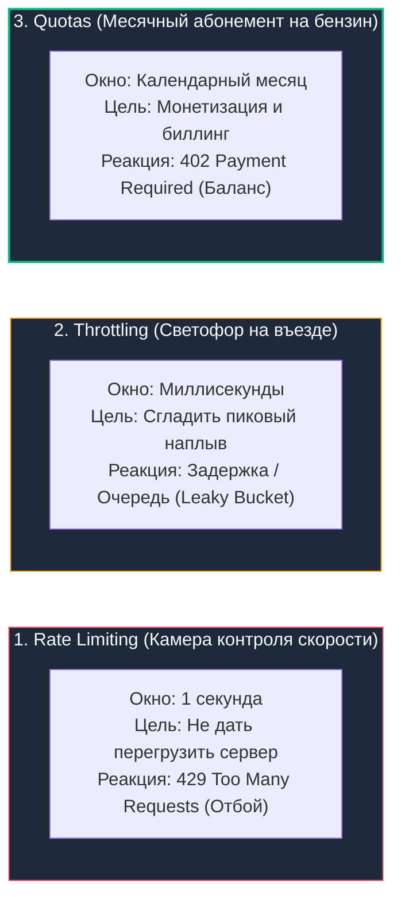
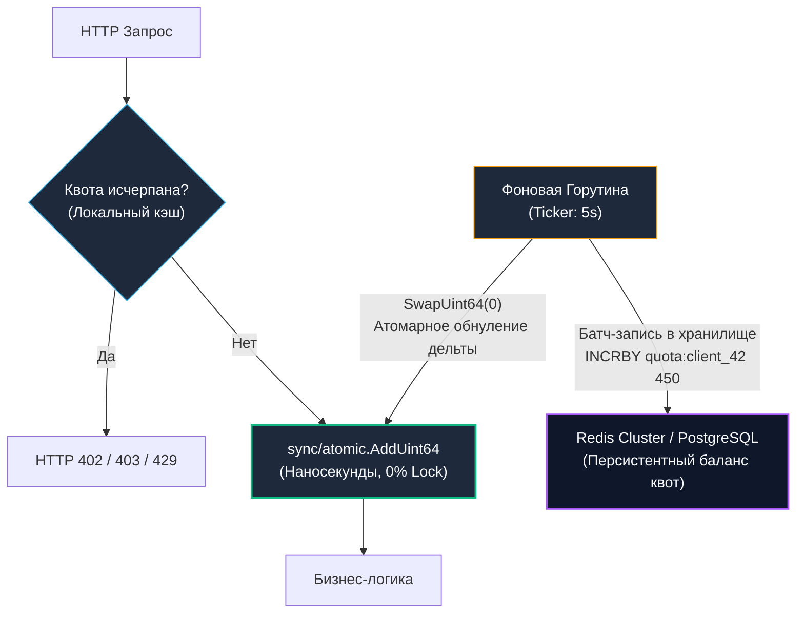

# Квоты, Throttling и Rate Limiting в Go: Защита инфраструктуры и бизнес-модели

> *«Чересчур жесткие ограничения тормозят развитие, а чрезмерное попустительство зовет катастрофу. Грамотная архитектура находит устойчивое равновесие между ними».*

В статье [[11. Rate limiting в API.md]] мы детально исследовали фундаментальные алгоритмы ограничения частоты входящих запросов (Token Bucket) и их надежную реализацию в Redis через атомарные Lua-скрипты. Мы защитили наш Go-бэкенд от внезапных всплесков нагрузки и примитивных атак типа «отказ в обслуживании» (DDoS).

Однако в зрелой распределенной микросервисной системе и коммерческих B2B/SaaS-платформах простого ограничения RPS недостаточно. Защита тактов CPU и соединений с базой данных — это лишь нижний, инфраструктурный уровень обороны. Выше него располагаются бизнес-логика, тарификация (Billing), тарифные планы клиентов и распределение приоритетов.

Инженер уровня Senior обязан четко проводить границу между тремя смежными понятиями: **Rate Limiting**, **Throttling** и **Quotas**. Смешивание этих концепций в коде одного сервиса (или, что еще хуже, в одной таблице реляционной базы данных) неизбежно приводит к разрушительному падению производительности кластера под нагрузкой.

---

## 1. Защита бизнеса и железа: Разделение понятий

Чтобы осознать разницу между этими тремя механизмами, полезна физическая дорожная аналогия:



---

## 2. Терминология: Limit vs Throttling vs Quota

### 1. Rate Limit (Лимит частоты)
* **Назначение:** Защита физической инфраструктуры от деградации.
* **Временное окно:** Минимальное (секунды, минуты). Пример: не более 100 RPS (Requests Per Second) на клиента.
* **Реакция на превышение:** Немедленный жесткий отказ. Если клиент превысил лимит, мы мгновенно возвращаем статус [[6. Статусы HTTP.md]] `429 Too Many Requests` с заголовком `Retry-After: 1`. Запрос не доходит до бизнес-логики и базы данных.

### 2. Throttling (Сглаживание / Дросселирование)
* **Назначение:** Выравнивание пульсирующего трафика (Traffic Shaping) и защита от кратковременных пачек запросов (Bursts) без потери полезных операций.
* **Реакция на всплеск:** Вместо грубого отклонения сервер искусственно притормаживает выполнение запроса, помещая его во внутреннюю очередь (или удерживая горутину в состоянии ожидания), пока в системе не освободится вычислительный слот.

### 3. Quota (Квота)
* **Назначение:** Монетизация тарифных планов, коммерческий учет и контроль расходов (Cost Control) при вызовах дорогостоящих внешних API (OpenAI, Stripe, SMS-шлюзы).
* **Временное окно:** Длительное (сутки, неделя, календарный месяц). Пример: 1 000 000 вызовов API в месяц по тарифу «Basic».
* **Реакция на исчерпание:** Бизнес-отказ с предложением повысить тариф (статусы `402 Payment Required` или `403 Forbidden`).

---

## 3. Throttling: Механика Leaky Bucket в Go

Для сглаживания пульсирующего потока запросов классическим стандартом является алгоритм **Leaky Bucket (Протекающее ведро)**.

Представьте ведро с узким калиброванным отверстием в дне:
- Запросы от клиентов наливаются в ведро сверху неравномерно — бурными всплесками (Bursts).
- Из отверстия снизу капли вытекают строго с постоянной, фиксированной скоростью и поступают на вход процессора.
- Если ведро наполняется до краев, избыточная вода переливается через край (запросы отбрасываются).

В экосистеме Go алгоритм Token/Leaky Bucket элегантно реализован в полустандартном пакете `golang.org/x/time/rate`.

> [!info] Под капотом: Идиоматичный Throttling через limiter.Wait
> Пакет `golang.org/x/time/rate` предоставляет два принципиально разных API:
> 1. `limiter.Allow()`: Неблокирующая проверка. Неблокирующая проверка (возвращает `true/false`) (применяется для мгновенного Rate Limiting с возвратом HTTP 429).
> 2. `limiter.Wait(ctx)`: Блокирующий вызов (Throttling).  
> Если токена в корзине нет, метод `Wait` **паркует текущую горутину** через сетевой таймер рантайма Go. Горутина засыпает и выводится планировщиком из очередей потоков ОС (**M**), не расходуя процессор в пустом цикле (busy-wait). Как только токен созревает (или истекает дедлайн переданного `context.Context`), горутина мгновенно просыпается и продолжает исполнение.

---

## 4. Архитектура Квот: Проблема распределенного счетчика

Квоты оперируют большими временными горизонтами (дни и месяцы). Их нельзя хранить только в локальной памяти пода (при перезапуске пода в Kubernetes счетчики обнулятся, и клиент бесплатно получит миллион повторных запросов). Данные о квотах **обязаны быть персистентными**.

### Наивный подход: Прямой UPDATE в реляционную БД (Антипаттерн)

Неопытные инженеры часто пытаются реализовать учет квот «в лоб», выполняя SQL-запрос на каждый входящий HTTP-вызов:
```sql
UPDATE api_quotas 
SET used = used + 1 
WHERE client_id = 42;
```

> [!warning] Ловушка / Gotcha: Катастрофический Row-level Lock Contention
> Если клиент отправляет трафик со скоростью 2000 RPS, в вашем кластере Go одновременно возникнут 2000 параллельных горутин, пытающихся модифицировать **одну и ту же запись** в таблице PostgreSQL.  
> СУБД накладывает на целевую строку эксклюзивную блокировку записи (**Row Exclusive Lock**). Все 2000 транзакций встают в плотную очередь ожидания (событие ожидания `Lock:tuple`).  
> **Итог:** Пул соединений базы данных мгновенно исчерпывается, утилизация CPU СУБД подскакивает до 100% из-за бесконечного арбитража блокировок, время ответа возрастает с 2 мс до 10 секунд, и весь сервис терпит бедствие (Cascading Failure).

---

## 5. Индустриальный подход: Async Batching (Асинхронное пакетирование)

Чтобы изолировать центральное хранилище от шторма транзакций, архитекторы применяют паттерн **Async Batching (Асинхронный сброс)**:

1. **Локальный учет в памяти:** На уровне экземпляра Go-приложения каждый HTTP-запрос инкрементирует счетчик в оперативной памяти за **единицы наносекунд** с помощью атомарных процессорных инструкций (`sync/atomic`).
2. **Асинхронный Flush:** Фоновая горутина по таймеру (например, раз в 5 секунд) извлекает накопленную дельту (например, `+450` вызовов за последние 5 секунд) и отправляет ее в Redis или PostgreSQL **одним атомарным батчем**.
3. **Сокращение нагрузки на порядки:** Нагрузка на централизованное хранилище снижается с 2000 IOPS до **0.2 IOPS** на клиента!



---

## 6. Идиоматичный Go: Реализация Async Flusher

Ниже приведена образцовая реализация высокопроизводительного менеджера локальных квот. Для исключения мьютексных блокировок используется структура `sync.Map`, где ключом является строковый ID клиента, а значением — **указатель на `uint64`**. Это позволяет производить инкремент через атомарные инструкции процессора без захвата глобальных блокировок:

```go
package quota

import (
	"context"
	"log"
	"sync"
	"sync/atomic"
	"time"
)

// RedisClient интерфейс для работы с центральным хранилищем квот
type RedisClient interface {
	IncrBy(ctx context.Context, key string, value int64) error
}

type Manager struct {
	// Ключ: clientID (string), Значение: *uint64 (указатель для атомарных операций)
	localCounters sync.Map
	redisClient   RedisClient
}

func NewManager(client RedisClient) *Manager {
	return &Manager{
		redisClient: client,
	}
}

// Increment вызывается в HTTP Middleware на каждый запрос (выполняется за <10ns)
func (m *Manager) Increment(clientID string) {
	// 1. Быстрая попытка загрузки указателя на счетчик
	val, ok := m.localCounters.Load(clientID)
	if !ok {
		// Если для клиента счетчика еще нет — инициализируем его
		var zero uint64
		val, _ = m.localCounters.LoadOrStore(clientID, &zero)
	}

	// 2. АТОМАРНЫЙ ИНКРЕМЕНТ (LOCK XADD на уровне кремния, без Mutex!)
	counterPtr := val.(*uint64)
	atomic.AddUint64(counterPtr, 1)
}

// StartFlusher запускается в фоновой горутине при старте сервиса
func (m *Manager) StartFlusher(ctx context.Context, flushInterval time.Duration) {
	ticker := time.NewTicker(flushInterval)
	defer ticker.Stop()

	for {
		select {
		case <-ctx.Done():
			// Финальный сброс остатков при Graceful Shutdown
			log.Println("Финальный сброс квот перед завершением процесса...")
			m.flushToRedis()
			return

		case <-ticker.C:
			m.flushToRedis()
		}
	}
}

func (m *Manager) flushToRedis() {
	m.localCounters.Range(func(key, value interface{}) bool {
		clientID := key.(string)
		counterPtr := value.(*uint64)

		// 3. Атомарно забираем накопленную дельту и сбрасываем локальный счетчик в 0
		// Swap гарантирует, что ни один входящий параллельный запрос не потеряется!
		delta := atomic.SwapUint64(counterPtr, 0)

		if delta > 0 {
			// 4. Отправляем дельту в Redis (INCRBY).
			// В продакшене вызовы нескольких клиентов группируются через Redis Pipelining.
			ctx, cancel := context.WithTimeout(context.Background(), 2*time.Second)
			if err := m.redisClient.IncrBy(ctx, "quota:"+clientID, int64(delta)); err != nil {
				log.Printf("Ошибка сброса квоты для %s: %v", clientID, err)
				// При ошибке связи возвращаем дельту обратно в локальный счетчик
				atomic.AddUint64(counterPtr, delta)
			}
			cancel()
		}
		return true // продолжаем итерацию Range
	})
}
```

> [!tip] Собеседование: Компромисс надежности и точности биллинга
> **Вопрос:** Если Go-сервер аварийно завершится (например, получен сигнал SIGKILL от OOM-киллера ядра ОС или отключилось питание) до срабатывания таймера сброса, накопленная в памяти дельта будет утеряна. Является ли это критической проблемой?
> 
> **Ответ:**  
> Это классическая иллюстрация компромисса **CAP / Производительность vs Точность**:
> * **Нестрогий биллинг (Soft Quotas):** Для 99% SaaS-сервисов потеря 10–50 клиентских запросов раз в месяц при аварийном рестарте ноды (Under-billing) экономически несущественна. Компания дарит клиенту несколько бесплатных запросов, но выигрывает миллисекундный p99 отклик и экономит тысячи долларов на серверных мощностях базы данных.
> * **Строгий финансовый учет (Hard Billing):** Если каждый API-вызов списывает реальные деньги (например, генерация токенов GPT-4 или проведение платежа по банковской карте), паттерн Async Batching неприменим. Мы обязаны производить дебетование строго синхронно в рамках двухфазной транзакции или атомарного вызова Redis Lua.

---

## 7. Контракт квот в HTTP

Когда квота или лимит исчерпаны, крайне важно предоставить клиенту прозрачный и структурированный HTTP-ответ.

### Статусы завершения:
* **`429 Too Many Requests`:** Стандартный ответ при срабатывании кратковременного Rate Limiting. Говорит клиенту: *«Сбавь темп, повтори через пару секунд»*.
* **`402 Payment Required`:** Исторический, но активно возрождаемый статус (стандарт в API Stripe). Идеален при исчерпании тарифной квоты: указывает приложению, что лимит исчерпан и требуется оплатить счет или сменить тарифный план.
* **`403 Forbidden`:** Классический запасной статус, если инфраструктурные шлюзы компании не поддерживают код 402.

### Заголовки стандарта IETF RateLimit

Чтобы клиенты не бомбардировали сервис слепыми повторными запросами, сервер обязан возвращать стандартизированные метаданные (RFC Draft IETF `RateLimit`):

```http
HTTP/1.1 429 Too Many Requests
Content-Type: application/json
RateLimit-Limit: 10000
RateLimit-Remaining: 0
RateLimit-Reset: 60
Retry-After: 60

{
  "error": "quota_exceeded",
  "message": "Monthly API quota of 10,000 requests exceeded. Resets in 60 seconds."
}
```

* `RateLimit-Limit:` Максимальный лимит запросов в текущем окне.
* `RateLimit-Remaining:` Количество оставшихся доступных запросов.
* `RateLimit-Reset:` Количество секунд (delta-seconds) до сброса текущего окна лимита (в отличие от устаревшего заголовка `X-RateLimit-Reset`, использовавшего абсолютный Unix Timestamp, современный проект IETF стандартизирует относительные секунды для предотвращения проблем рассинхронизации часов).
* `Retry-After:` Рекомендованное время ожидания в секундах перед следующей попыткой (RFC 9110).

---

## 8. Итог

1. **Разделяйте зоны ответственности:** Rate Limiting защищает железную инфраструктуру на уровне [[25. API Gateway.md]], Throttling сглаживает скачки нагрузки, а Quotas управляют бизнес-тарифами и биллингом.
2. **Throttling** в Go реализуется через `limiter.Wait()` (`limiter.Wait(ctx)`) из `golang.org/x/time/rate`, блокируя горутины без сжигания тактов процессора (Mechanical Sympathy).
3. **Async Batching** — базовый паттерн учета высоконагруженных квот. Инкременты собираются в памяти через `sync/atomic.AddUint64` и сбрасываются в Redis батчами (`IncrBy`, Pipelining), спасая реляционные базы от блокировок `Row-level Lock Contention`.
4. Выбор между синхронным и асинхронным учетом квот — это осознанный баланс между абсолютной финансовой строгостью и предельной производительностью системы.
5. Возвращайте стандартизированные HTTP-заголовки (`RateLimit-Reset`, `Retry-After`), чтобы клиентские SDK могли корректно рассчитывать паузы между вызовами.

Мы защитили наши сервисы от перегрузок, настроили умный троттлинг и обеспечили учет бизнес-квот. Но в сложной распределенной среде даже идеально защищенная система иногда сбоит: запросы замедляются, а клиенты получают 5xx ошибки. Как моментально обнаружить аномалию, связать воедино логи, системные метрики и распределенные трейсы, не создавая дополнительной нагрузки на бэкенд? Этому искусству посвящена следующая глава: [[31. API observability.md]].
