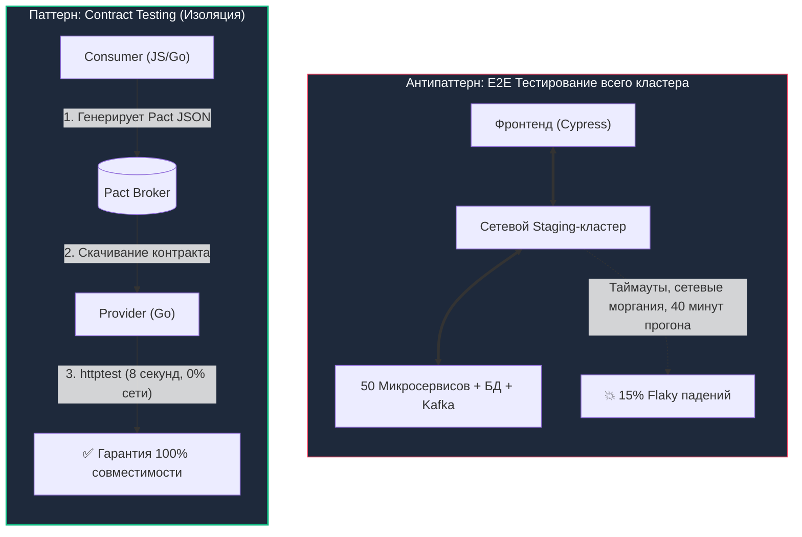
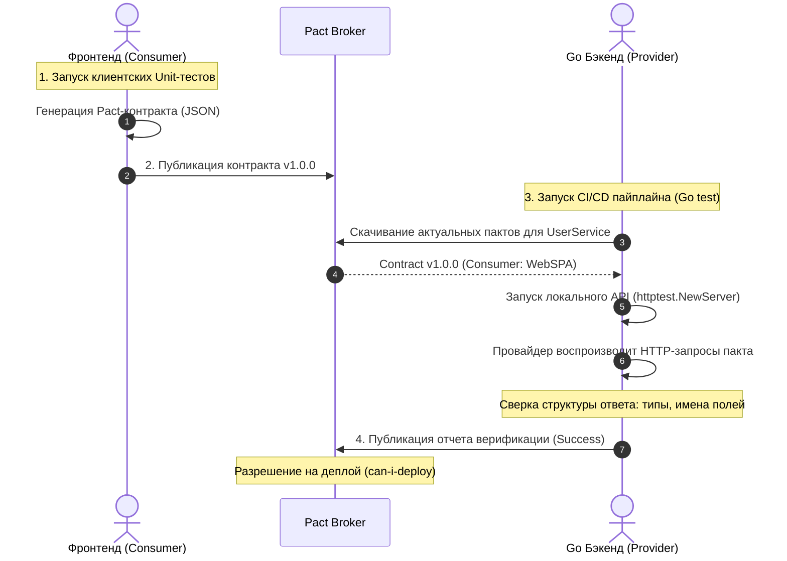

# Contract Testing в Go: Защита контрактов с Pact и валидацией OpenAPI

> *«Сетевой контракт надёжен лишь настолько, насколько надёжны автоматические тесты, проверяющие его соблюдение».*    
> — Принцип надежности распределенных систем

В предыдущей статье [[33. API testing.md]] мы научились писать молниеносные модульные и интеграционные тесты в Go с использованием `httptest` и `Testcontainers`. Мы уверены, что наш бэкенд функционирует безупречно: он корректно считывает записи из базы данных, устойчив к параллельным транзакциям и возвращает валидный JSON.

Но затем происходит рядовой релиз в production, и тысячи пользователей сталкиваются с «белым экраном смерти» в мобильном приложении. Почему?

Потому что клиентский фронтенд (React/iOS) ожидал поле `user_age` (числовой тип `number`), а наш Go-бэкенд после безобидного внутреннего рефакторинга переименовал поле в `age` (или изменил тип на `string`). Наш Go-тест в CI остался абсолютно «зеленым», потому что он проверял внутреннюю логику *самого сервера*, но ничего не знал о скрытых ожиданиях *внешнего клиента*.

Исторически компании пытались закрыть эту брешь запуском сквозных **End-to-End (E2E) тестов** (Selenium, Cypress). Но в микросервисной среде E2E-тесты превращаются в катастрофу: они чудовищно медленные, нестабильные (Flaky) и требуют развертывания гигантских предрелизных полигонов (Staging-кластеров), которые постоянно ломаются.

Решением этой фундаментальной проблемы, ставшим стандартом зрелой микросервисной инженерии, является **Contract Testing (Контрактное тестирование)**.

---

## 1. Смерть E2E: Почему интеграционные среды убивают релизы

Представьте два независимых завода: французский выпускает настенные электрические розетки, а немецкий — бытовые приборы со штепсельными вилками.

Было бы безумием требовать от инженеров строить совместный жилой дом с сотней комнат каждый раз, когда немецкий завод меняет конструкцию тостера, чтобы убедиться, что вилка войдет в розетку (это аналог дорогого и хрупкого E2E-теста).  
Вместо этого французский завод изготавливает высокоточный металлический шаблон-калибр с отверстиями (**Контракт**) и передает его немецкому заводу. Немецкий инженер на конвейере прикладывает вилку к шаблону: если штырьки идеально совпадают — оба завода математически уверены, что в домах покупателей приборы включатся без проблем.



---

## 2. Consumer-Driven Contracts (CDC): Клиент всегда прав

В классической разработке бэкенд навязывает клиентам контракт: *«Вот что я отдаю, подстраивайтесь»*.  
В методологии **Consumer-Driven Contracts (CDC)** парадигма переворачивается: **Потребитель (Consumer — мобильное приложение или соседний микросервис) строго декларирует, какие именно данные ему необходимы**.

### Жизненный цикл CDC:

1. Разработчик фронтенда пишет Unit-тест на своем клиентском коде: *«Я ожидаю, что при вызове `GET /users/1` бэкенд вернет мне JSON с полями `id` (int) и `name` (string)»*.
2. Клиентский SDK перехватывает этот запрос и компилирует **Pact-файл** — стандартизированный JSON-документ, содержащий перечень ожиданий и правил сопоставления типов.
3. Готовый контракт загружается в центральный реестр (**Pact Broker**).
4. В CI/CD пайплайне Go-бэкенда (**Provider**) специальный верификатор скачивает этот контракт и **автоматически воспроизводит описанные в нем HTTP-запросы к локальному тестовому Go-серверу**, проверяя, удовлетворяет ли ответ бэкенда ожиданиям клиента.



**Главная выгода:** Никаких предрелизных стендов! Фронтенд и бэкенд тестируются полностью изолированно на машинах разработчиков, гарантируя 100% совместимость в production.

---

## 3. Идиоматичный Go: Верификация Пактов

В экосистеме Go официальным инструментом для контрактного тестирования является библиотека `github.com/pact-foundation/pact-go/v2`.

Вам не требуется вручную парсить Pact-файлы или писать HTTP-клиенты. Достаточно поднять ваш реальный роутер через `httptest.NewServer` и поручить утилите `provider.NewVerifier` обстрелять его сгенерированными тестами:

```go
package contract_test

import (
	"net/http/httptest"
	"testing"

	"github.com/pact-foundation/pact-go/v2/provider"
)

func TestPactProviderVerification(t *testing.T) {
	// 1. Поднимаем наш боевой Go-роутер в изолированном тестовом сервере
	router := SetupRouter(mockDB)
	server := httptest.NewServer(router)
	defer server.Close()

	// 2. Инициализируем верификатор контрактов
	verifier := provider.NewVerifier()

	// 3. Запускаем автоматическую сверку ответов бэкенда с ожиданиями клиентов
	err := verifier.VerifyProvider(t, provider.VerifyRequest{
		ProviderBaseURL: server.URL,
		Provider:        "UserService", // Имя нашего сервиса-провайдера
		
		// Загрузка контрактов из центрального брокера Pact Broker
		BrokerURL:       "https://my-company.pactflow.io",
		BrokerToken:     "secret-token",
		PublishVerificationResults: true, // Фиксация статуса для can-i-deploy
		ProviderVersion: "1.0.0",

		// 4. Механизм управления состояниями (Provider States)
		StateHandlers: provider.StateHandlers{
			"user 123 exists": func(setup bool, state provider.ProviderState) (provider.ProviderStateResponse, error) {
				if setup {
					// Готовим базу данных или моки: гарантируем наличие юзера 123
					mockDB.InsertUser(123, "Ivan")
				} else {
					// Очищаем состояние после прогона теста
					mockDB.DeleteUser(123)
				}
				return provider.ProviderStateResponse{}, nil
			},
		},
	})

	if err != nil {
		t.Fatalf("Contract verification failed: %v", err)
	}
}
```

---

## 4. Mechanical Sympathy: Магия Provider States (Состояний)

> [!warning] Ловушка / Gotcha: Проблема контекста и пустой базы данных
> Представьте, что в Pact-контракте фронтенд указал: *«При запросе GET /users/456 ожидается JSON с именем пользователя»*.  
> Верификатор отправляет реальный HTTP-запрос `GET /users/456` на ваш локальный Go-сервер. Но тестовая база данных пуста! Бэкенд возвращает статус `404 Not Found`. Тест падает с красным флагом, хотя код бизнес-логики безупречен.  
> Как бэкенд должен узнать, какие именно тестовые данные требуются конкретному тесту фронтенда?

Эту фундаментальную проблему решают **Provider States (Состояния Провайдера)**:
1. В своем контракте фронтенд пишет:  
   *«Given state: 'user 456 exists', when I send GET /users/456...»*.
2. Перед выполнением сетевого HTTP-вызова утилита `Pact Verifier` находит в зарегистрированной мапе `StateHandlers` функцию с ключом `"user 456 exists"`.
3. Go-обработчик состояния динамически выполняет `mockDB.InsertUser(456, "Anna")` (или `INSERT` в PostgreSQL через Testcontainers).
4. Сервер отвечает статусом `200 OK`, контракт успешно верифицируется, а в блоке `setup == false` тестовые данные удаляются.

Это исключает необходимость поддерживать тяжелые, хрупкие SQL-дампы с терабайтами тестовых записей.

---

## 5. Альтернатива: Schema-based Contract Testing (OpenAPI)

Внедрение Pact требует развертывания Pact Broker и тесного взаимодействия между командами.  
Если вы разрабатываете публичный B2B API или у вас нет доступа к кодовой базе клиентских приложений, существует надежная альтернатива — **Спецификация как Контракт**.

Как мы подробно разбирали в [[14. OpenAPI и Swagger.md]], контракт формулируется в виде файла `openapi.yaml`. Чтобы гарантировать строгое соответствие ответов Go-сервера этой спецификации, используется библиотека `github.com/getkin/kin-openapi`:

```go
package contract_test

import (
	"bytes"
	"context"
	"io"
	"net/http"
	"net/http/httptest"
	"testing"

	"github.com/getkin/kin-openapi/openapi3"
	"github.com/getkin/kin-openapi/openapi3filter"
	"github.com/getkin/kin-openapi/routers/gorillamux"
)

func TestAgainstOpenAPIContract(t *testing.T) {
	ctx := context.Background()

	// 1. Загружаем официальную OpenAPI спецификацию нашего сервиса
	doc, err := openapi3.NewLoader().LoadFromFile("../../openapi.yaml")
	if err != nil {
		t.Fatalf("Failed to load openapi.yaml: %v", err)
	}
	router, _ := gorillamux.NewRouter(doc)

	// 2. Выполняем тестовый вызов хэндлера через httptest
	req := httptest.NewRequest(http.MethodGet, "/users/1", nil)
	rec := httptest.NewRecorder()
	myAppRouter.ServeHTTP(rec, req)

	response := rec.Result()

	// 3. ВАЛИДАЦИЯ: Проверяем, соответствует ли HTTP-ответ схеме OpenAPI
	route, pathParams, err := router.FindRoute(req)
	if err != nil {
		t.Fatalf("Route not found in OpenAPI spec: %v", err)
	}

	validationInput := &openapi3filter.ResponseValidationInput{
		RequestValidationInput: &openapi3filter.RequestValidationInput{
			Request:    req,
			PathParams: pathParams,
			Route:      route,
		},
		Status: response.StatusCode,
		Header: response.Header,
		Body:   io.NopCloser(bytes.NewReader(rec.Body.Bytes())),
	}

	// 4. Сверка контракта на уровне типов, обязательных полей и форматов
	if err := openapi3filter.ValidateResponse(ctx, validationInput); err != nil {
		t.Fatalf("API Response broke the OpenAPI contract: %v", err)
	}
}
```

> [!tip] Собеседование: CDC (Pact) vs OpenAPI Schema Validation
> **Вопрос:** В чем принципиальная разница между Consumer-Driven Contracts (Pact) и валидацией по OpenAPI-схеме? Что вы выберете на проекте?
> 
> **Ответ:**  
> * **Consumer-Driven Contracts (Pact):** Ориентирован на *потребителей*. Показывает, какие конкретно поля реально используются фронтендом. Если бэкенд отдает 50 полей, а фронтенд в контракте запрашивает только 3, бэкендер может без опаски удалить любое из остальных 47 полей. Идеально для внутрикорпоративных микросервисов и мобильных приложений.
> * **OpenAPI Schema Validation:** Ориентирован на *поставщика (Provider)*. Гарантирует абсолютное соответствие ответов сервера статической спецификации `openapi.yaml`. Идеален для публичных B2B-интерфейсов со сторонними неизвестными интеграторами.

---

## 6. Можно ли отказаться от E2E полностью?

Contract Testing закрывает до 90% интеграционных проблем (несоответствие форматов данных, переименование полей, изменение HTTP-статусов, удаление обязательных заголовков).

Однако контракты не проверяют сложные сквозные бизнес-сценарии с распределенным состоянием:  
*«Пользователь добавляет товар в корзину $	o$ администратор меняет цену $	o$ пользователь списывает бонусы $	o$ банк отклоняет платеж»*.

Такие критические цепочки («Happy paths») по-прежнему требуют небольшого числа E2E-тестов. Но благодаря контрактам количество E2E-сценариев сокращается с тысяч до полутора десятков, экономя часы времени разработчиков при каждом релизе.

---

## 7. Итог

1. **E2E-тесты** слишком медленны, дороги и нестабильны (Flaky) для проверки базовой совместимости интерфейсов.
2. **Consumer-Driven Contracts (Pact)** позволяют изолированно тестировать микросервисы, доказывая их совместимость без совместного развертывания.
3. В языке Go верификация пактов выполняется через связку `httptest.NewServer` и `pact-go/v2`.
4. Механизм **Provider States** позволяет бэкенду динамически настраивать базу данных перед каждым проверочным запросом.
5. Для публичных API альтернативой является валидация ответов сервера против спецификации **`openapi.yaml`** через библиотеку `kin-openapi`.

Контракты гарантируют идеальное математическое взаимопонимание между узлами в штатном режиме. Но реальный мир суров: контейнеры внезапно перезапускаются оркестратором, ноды кластера выводятся на обслуживание, а входящие запросы рискуют оборваться прямо посреди транзакции. О том, как выдерживать эксплуатационный хаос и корректно реализовать устойчивость и Graceful Shutdown в Go API, мы поговорим в следующей статье: [[35. Chaos testing API.md]].
