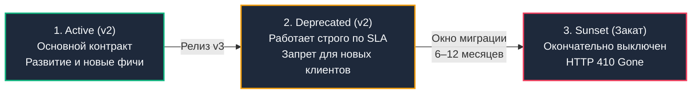

# Стратегии вывода API из эксплуатации: RFC 8594, Sunset и Brownouts

> *«Удаление мертвого кода — чистейшее удовольствие для программиста, но вывод API из боевой эксплуатации требует дипломатии посла и точности хирурга».*

Мы детально изучили, как проектировать и версионировать сетевые контракты ([[8. Versioning API.md]]) и сохранять обратную совместимость ([[27. Backward compatibility.md]]). Однако поддерживать устаревшие версии вечно — это верный путь к техническому банкротству инженерной команды. Старые эндпоинты накапливают уязвимости безопасности, требуют костылей для адаптации под новые схемы баз данных и связывают руки при рефакторинге.

Рано или поздно версию `v1` необходимо окончательно удалить. Но в распределенных системах вступает в силу суровый закон природы — **Закон Хайрама (Hyrum's Law)**:  
> *«При достаточном количестве пользователей API, не имеет значения, что написано в контракте: любое наблюдаемое поведение вашей системы станет зависимостью для кого-то из клиентов».*

Если разработчик просто удалит хэндлер из Go-роутера, у сотен B2B-клиентов и мобильных пользователей внезапно сломаются бизнес-процессы, бизнес понесет финансовые убытки, а службу поддержки накроет лавина аварийных тикетов.

**Version Deprecation (Вывод API из эксплуатации)** — это не тривиальное удаление файла в Git, а строгий дипломатический, архитектурный и метрический процесс.

---

## 1. Искусство убивать код: Почему удалять сложнее, чем создавать

Представьте замену старого автомобильного моста через реку. Рядом возведен новый современный вантовый мост (версия `v2`). Старый деревянный мост (версия `v1`) скрипит, обходится в миллионы рублей на ежемесячный ремонт и мешает судоходству.

Было бы безумием взорвать старый мост динамитом в понедельник утром в час пик (аналог внезапного удаления эндпоинта с возвратом `404 Not Found`).

Зрелый инженер поступает иначе:
1. За полгода до демонтажа вывешиваются яркие щиты: *«Внимание, через 6 месяцев мост закрывается, используйте новый мост»* (**RFC 8594: Deprecation & Sunset**).
2. На въезде устанавливаются камеры учета проезжающих автомобилей с фиксацией номеров (**Prometheus метрики с детализацией по `client_id`**).
3. Если к декабрю поток машин не иссяк, дорожники начинают кратковременно опускать шлагбаум на 15 минут в день (**Brownouts / Тест на крик**), вынуждая ленивых водителей привыкать к новому маршруту.
4. В назначенный день мост перекрывается навсегда, а на въезде устанавливается кирпич и знак: *«Проезд закрыт навсегда, мост разобран»* (**HTTP 410 Gone**).

---

## 2. Жизненный цикл API: От рождения до заката

Senior-инженер четко разграничивает три фазы жизненного цикла сетевого эндпоинта:



1. **Active (Активный):** Основная боевая версия API. Полная поддержка, развитие, добавление новых полей.
2. **Deprecated (Устаревший):** API функционирует в штатном режиме, и его SLA соблюдается на 100%. **Однако:** новым интеграциям категорически запрещено к нему подключаться, а существующим клиентам рассылаются уведомления о необходимости миграции. В эту кодовую базу больше не вносятся никакие изменения, кроме критических патчей безопасности.
3. **Sunset (Закат / Отключение):** Точная дата и время («Час X»), когда сервер окончательно прекращает обслуживание запросов к эндпоинту и начинает возвращать статус `410 Gone`.

---

## 3. Технический контракт: Как сказать машине, что API устарело

Уведомления на email малоэффективны: инженеры редко читают корпоративные рассылки. Оповещение об устаревании обязано происходить на машинном уровне — в контрактах и HTTP-заголовках.

### 1. Слой OpenAPI (Design-First)
Как мы обсуждали в [[36. Документация API best practices.md]], первым делом метод помечается атрибутом `deprecated: true` в спецификации `openapi.yaml`:

```yaml
paths:
  /v1/users:
    get:
      summary: "Получить список пользователей"
      deprecated: true  # <- Генераторы клиентов подсветят метод как устаревший
      responses:
        "200":
          description: "Успешный ответ"
```

При очередной перегенерации клиентских SDK генераторы кода (OpenAPI Generator, `oapi-codegen`) пометят функции аннотацией `@deprecated` (в TypeScript/Java) или добавят предупреждение компилятора, которое разработчик клиента увидит прямо в своей IDE.

### 2. Слой HTTP: Стандарты RFC 8594 и RFC 9745
Официальные стандарты IETF регламентируют машиночитаемые HTTP-заголовки вывода API из эксплуатации:

* `Deprecation: true` (или дата по стандарту RFC 9745, указывающая, когда метод был признан устаревшим).
* `Sunset: Wed, 31 Dec 2026 23:59:59 GMT` (Точный дедлайн в формате HTTP-date по RFC 8594, после которого эндпоинт перестанет существовать).
* `Link: <https://api.mycompany.com/docs/migration>; rel="deprecation"` (Ссылка по RFC 8288 на подробное руководство по миграции).

### Идиоматичный Go: Middleware для устаревших маршрутов

```go
package middleware

import (
	"fmt"
	"net/http"
)

// DeprecatedMiddleware внедряет стандартизированные заголовки вывода из эксплуатации (RFC 8594 / RFC 9745)
func DeprecatedMiddleware(sunsetDate string, migrationURL string) func(http.Handler) http.Handler {
	return func(next http.Handler) http.Handler {
		return http.HandlerFunc(func(w http.ResponseWriter, r *http.Request) {
			// Добавляем стандартизированные заголовки вывода из эксплуатации
			w.Header().Set("Deprecation", "true")
			w.Header().Set("Sunset", sunsetDate)
			w.Header().Set("Link", fmt.Sprintf(`%s; rel="deprecation"`, migrationURL))

			next.ServeHTTP(w, r)
		})
	}
}
```

---

## 4. Mechanical Sympathy: Наблюдаемость (Observability) устаревшего кода

> **Золотое правило удаления кода:**  
> Никогда не удаляйте устаревший эндпоинт, пока метрики не покажут **абсолютный ноль вызовов**.

Нельзя полагаться на уверения менеджеров проекта (*«Да мы всех предупредили, никто уже не пользуется v1»*). Единственным источником истины являются метрики Prometheus (см. [[31. API observability.md]]).

Для безопасного вывода API из эксплуатации необходимо собирать метрику вызовов устаревших ручек **с обязательной детализацией по клиентам**:

```go
package metrics

import (
	"github.com/prometheus/client_golang/prometheus"
	"github.com/prometheus/client_golang/prometheus/promauto"
)

// Метрика с детализацией по клиентам
var deprecatedUsageCounter = promauto.NewCounterVec(
	prometheus.CounterOpts{
		Name: "api_deprecated_usage_total",
		Help: "Counts usage of deprecated endpoints to track migration progress",
	},
	// client_id извлекается из проверенного JWT токена в Auth Middleware
	[]string{"endpoint", "client_id"},
)
```

Построив дашборд в Grafana, вы увидите наглядный график угасания трафика и выделите конкретных клиентов-саботажников, к которым можно обратиться персонально до наступления даты Sunset.

---

## 5. "The Scream Test" (Тест на крик) и Brownouts

Что делать, если дата Sunset наступила (например, 31 декабря), а метрики показывают, что 10–15% запросов все еще упорно летят на `v1`?  
Если вы одномоментно удалите роутер, эти 15% клиентских приложений мгновенно упадут с ошибкой `404 Not Found`, что приведет к блокировке работы и масштабному скандалу.

Индустриальным решением в таких тупиковых ситуациях является стратегия **Brownouts (Контролируемые веерные отключения)**. Это автоматизированный вариант классического «Теста на крик» (Scream Test).

Вместо окончательного и бесповоротного отключения сервер начинает **кратковременно имитировать недоступность эндпоинта**, давая забывчивым клиентам импульс к исправлению кода без фатального разрушения их бизнеса.

**Схема эскалации веерных отключений:**
1. **За 60 дней до Sunset:** Выключаем API на 5 минут каждый день (возвращаем статус `410 Gone` или служебные коды `429/503` с телом сообщения о миграции). Мониторим каналы поддержки и алерты.
2. **За 30 дней:** Отключаем эндпоинт на 1 час каждый день.
3. **За 7 дней:** Отключаем на 12 часов.
4. **Дата Sunset:** Отключаем навсегда.

```mermaid
gantt
    title Эскалация графика Brownouts перед полным отключением
    dateFormat YYYY-MM-DD
    axisFormat %d %b
    
    section Фазы веерных отключений
    5 мин в день (HTTP 410)   :active, b1, 2026-11-01, 2026-11-14
    1 час в день              :crit, b2, 2026-11-15, 2026-11-28
    12 часов в день           :crit, b3, 2026-11-29, 2026-12-15
    Sunset: Выключение 100%   :milestone, b4, 2026-12-31, 0d
```

### Динамические Brownouts в Go

В Go управляемый Brownout реализуется через специализированный Middleware, который случайным образом или по жесткому расписанию отбивает заданный процент запросов:

```go
package middleware

import (
	"math/rand/v2"
	"net/http"
)

// BrownoutMiddleware отбивает часть запросов по мере приближения даты Sunset
func BrownoutMiddleware(dropPercentage int) func(http.Handler) http.Handler {
	return func(next http.Handler) http.Handler {
		return http.HandlerFunc(func(w http.ResponseWriter, r *http.Request) {
			// Случайный отбор процента запросов для веерного отключения
			if rand.IntN(100) < dropPercentage {
				w.Header().Set("Content-Type", "application/problem+json")
				// Возвращаем семантически корректный 410 Gone!
				w.WriteHeader(http.StatusGone)
				w.Write([]byte(`{
					"title": "API is sunsetting",
					"status": 410,
					"detail": "This endpoint is experiencing planned brownouts before permanent deletion.",
					"type": "https://api.mycompany.com/docs/migration"
				}`))
				return
			}

			next.ServeHTTP(w, r)
		})
	}
}
```

> [!tip] Собеседование: HTTP 410 Gone vs HTTP 404 Not Found
> **Вопрос:** Какой HTTP-статус должен возвращать навсегда отключенный (Sunset) эндпоинт? Почему статус 404 считается антипаттерном?
> 
> **Ответ:**  
> Статус `404 Not Found` семантически означает: *«Сервер не нашел запрашиваемый ресурс по указанному URL (возможно, вы опечатались в букве)»*. Клиент воспринимает 404 как случайную ошибку адресации.  
> Корректный статус — **`410 Gone` (Удален навсегда)**.  
> Спецификация RFC 9110 определяет `410 Gone` как состояние, когда целевой ресурс намеренно удален, его больше нет и он **никогда не вернется в будущем**. Получение статуса 410 дает жесткую инструкцию клиентским приложениям, поисковым индексаторам и кэшам немедленно удалить ссылку из своих конфигураций.

---

## 6. Ловушка: Асинхронные потребители (Event-Driven Deprecation)

> [!warning] Ловушка / Gotcha: Асинхронные потребители в Kafka/RabbitMQ
> Стратегия Brownouts и возврат статуса `410 Gone` идеально работают для синхронных протоколов REST и gRPC.  
> Но если вы выводите из эксплуатации устаревший контракт сообщения в брокере очередей (**Kafka/RabbitMQ**), вы не можете «вернуть 410 ошибку» в топик!  
> Если бэкенд просто перестанет публиковать старый формат сообщений, асинхронные микросервисы-потребители зависнут в ожидании данных.  
> 
> **Решение для Event-Driven архитектур:**  
> Применяется стратегия двойной публикации (**Dual Write / Dual Publish**):
> 1. Продюсер параллельно публикует событие в два топика: в старый `orders.v1` (со старой схемой) и в новый `orders.v2`.
> 2. Команды консьюмеров постепенно переписывают обработчики на чтение из `orders.v2`.
> 3. Вывод из эксплуатации отслеживается по метрике **Consumer Lag**: как только лаг чтения из топика `orders.v1` обнулился и число активных консьюмеров стало равным 0, продюсер прекращает двойную публикацию, а старый топик удаляется.

---

## 7. Итог

1. **Deprecation — это управляемый процесс**, требующий месяцев координации, а не одномоментное удаление кода.
2. Используйте стандарты **RFC 8594 (`Sunset`), RFC 9745 (`Deprecation`) и RFC 8288 (`Link`)** для машиночитаемого оповещения клиентов об устаревании эндпоинтов.
3. Опирайтесь на метрики **Prometheus** с детализацией по `client_id`, чтобы точно знать, кто из клиентов еще не мигрировал.
4. Применяйте **Brownouts (Веерные отключения)** для безопасной стимуляции миграции забывчивых клиентов до наступления даты отключения.
5. После отключения всегда возвращайте статус **`410 Gone`**, а не `404 Not Found`.
6. Для асинхронных очередей сообщений (Kafka) используйте стратегию **Dual Write** с контролем по Consumer Lag.

Мы научились создавать, защищать, документировать и безопасно выводить из эксплуатации сетевые API. Но в продакшене системы постоянно сталкиваются с нештатными, пограничными ситуациями: обрыв соединения прямо посреди передачи multipart-файла, медленные атаки Slowloris, расхождение кодировок UTF-8 и коллизии часовых поясов. О том, как защитить Go-бэкенд от коварных пограничных случаев (Edge Cases), мы поговорим в следующей статье: [[38. Edge cases API.md]].
