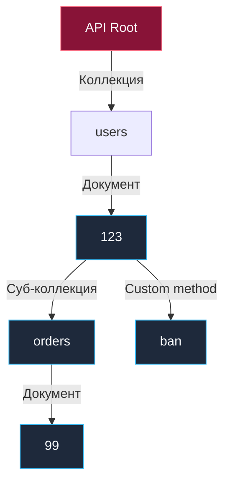

## Переход от глаголов к существительным: Что такое ROD?

В операционной системе Unix иерархическая файловая система всегда служила образцом инженерной ясности: структурированное дерево каталогов и файлов, где каждая сущность — это строгое существительное (`/usr/bin/cat`, `/etc/passwd`), а любые манипуляции над ними осуществляются через универсальный, стандартизированный набор системных вызовов (`open`, `read`, `write`, `unlink`). Ни одному системному разработчику в здравом уме не пришло бы в голову создавать специальный системный вызов `CreateNewUserRecordAndSaveToDisk()`.

Однако на заре карьеры веб-разработчики почти неизбежно повторяют одну и ту же ошибку: они проектируют сетевые интерфейсы в парадигме процедурного удаленного вызова (Remote Procedure Call — RPC). Мы привыкли мыслить императивными глаголами и действиями: «получить список пользователей», «создать новый заказ», «заблокировать спамера». В структуре URL это выливается в хаотичный набор эндпоинтов: `/getUsers`, `/createNewOrder`, `/banUser`.

Resource-Oriented Design (ROD — ресурсно-ориентированное проектирование) — это строгая архитектурная методология, являющаяся естественным и логическим развитием классических принципов REST ([[3. REST. Основные принципы.md]]). В парадигме ROD мы объявляем войну глаголам в путях и начинаем структурировать предметную область исключительно через **ресурсы (существительные)**.

Общепризнанным отраслевым стандартом ресурсно-ориентированного дизайна сегодня выступает **Google API Design Guide**. Изначально созданный для высокопроизводительных gRPC-сервисов, этот стандарт безупречно транслируется на HTTP/REST, формируя единообразные, интуитивно понятные и долговечные контракты для распределенных систем любого масштаба.

### Базовые концепции ROD

Архитектура ROD упорядочивает предметную область через три фундаментальные категории:

1. **Ресурс (Resource):** Обособленный объект данных, обладающий четкой идентичностью, схемой и жизненным циклом. Ресурс может включать в себя состояние и содержать вложенные дочерние ресурсы.
2. **Коллекция (Collection):** Упорядоченный список однотипных ресурсов. В URL коллекция всегда именуется во множественном числе: например, `/users` или `/orders`.
3. **Документ (Document):** Конкретный единичный экземпляр ресурса внутри коллекции, адресуемый через уникальный идентификатор: например, `/users/123`.

В парадигме ROD все ваше API представляет собой строгое, логически сбалансированное иерархическое дерево:



## Роутинг в Go: Цена красивых URL

Когда входящий HTTP-пакет попадает в сетевой сокет с адресом `GET /users/123/orders/99`, перед маршрутизатором рантайма Go встают две вычислительные задачи:
1. Детерминированно сопоставить входящий путь с зарегистрированным обработчиком (Handler).
2. Извлечь динамические переменные сегментов пути (`123` и `99`) и передать их в прикладную бизнес-логику с минимальным оверхедом на память.

Исторически, вплоть до версии Go 1.21, стандартный пакет `net/http` предлагал до смешного примитивный `ServeMux`, способный распознавать лишь точные совпадения (Exact Match) либо префиксы поддеревьев. Разработчикам приходилось подключать сторонние библиотеки: тяжеловесный `gorilla/mux` (использовавший регулярные выражения) или высокоскоростной `go-chi/chi` (построенный на базе префиксного дерева).

Начиная с версии Go 1.22, стандартная библиотека совершила долгожданный скачок: встроенный `http.ServeMux` получил первоклассную поддержку HTTP-методов и параметризованных шаблонов прямо «из коробки»:

```go
package main

import (
	"fmt"
	"net/http"
)

func handleOrderGet(w http.ResponseWriter, r *http.Request) {
	// Идиоматичное извлечение параметров в Go 1.22+ без внешних зависимостей
	userID := r.PathValue("userID")
	orderID := r.PathValue("orderID")
	
	fmt.Fprintf(w, "User: %s, Order: %s", userID, orderID)
}

func main() {
	mux := http.NewServeMux()
	
	// Метод и шаблон пути декларируются в единой строке
	mux.HandleFunc("GET /users/{userID}/orders/{orderID}", handleOrderGet)
	
	http.ListenAndServe(":8080", mux)
}
```

> [!info] Под капотом: Деревья маршрутизации vs Регулярные выражения
> Почему некогда популярный `gorilla/mux` проиграл историческую гонку производительности и был заброшен, а легковесный `chi` и обновленный `ServeMux` стали новым стандартом?
> 
> Роутеры на регулярных выражениях (RegEx) обладают вычислительной сложностью порядка $O(N)$, где $N$ — общее количество зарегистрированных маршрутов в сервисе. Если ваше приложение насчитывает 500 эндпоинтов, обработчик при каждом запросе вынужден последовательно прогонять входную строку через сотни регулярных выражений, сжигая процессорные циклы.
> 
> Современные роутеры в Go опираются на древовидные структуры данных: библиотеки вроде `chi` и `httprouter` используют **Radix Tree (Компактное префиксное дерево / Patricia Trie)**, а стандартный `http.ServeMux` в Go 1.22 опирается на сегментное дерево решений (Segment-based Decision Tree) с детерминированными правилами специфичности и приоритетов. Поиск в таких структурах на порядки быстрее перебора RegEx и практически не зависит от общего числа маршрутов в системе.
> Кроме того, механизм `r.PathValue()` в Go 1.22 оптимизирован так, чтобы сопоставлять параметры без лишних аллокаций в куче, избавляя рантайм от создания временных структур `map[string]string` на каждый сетевой запрос.

## Custom Methods: Когда CRUD недостаточно

Канонический REST опирается на базовый CRUD и стандартные глаголы протокола HTTP: GET (чтение), POST (создание), PUT (полная замена), PATCH (частичное обновление), DELETE (удаление).

Однако реальный бизнес редко укладывается в рамки манипуляции свойствами сущностей. Как выразить в строгой парадигме REST операции, не являющиеся прямым созданием или редактированием записей в таблице?
* Сбросить забытый пароль учетной записи.
* Принудительно заблокировать аккаунт за нарушение правил.
* Применить скидочный промокод к сформированной корзине.

Распространенный антипаттерн новичков — попытка замаскировать бизнес-действие под частичное обновление статуса через метод `PATCH`:
```json
// АНТИПАТТЕРН: Неявный побочный эффект под видом мутации поля
// PATCH /users/123
{
  "status": "banned",
  "reason": "spam"
}
```
Этот подход порождает запутанный процедурный код внутри обработчика. Хендлер превращается в лабиринт условных операторов: он вынужден сравнивать старое и новое состояние полей, вычисляя: *«Ага, статус изменился на banned — значит, нужно послать почтовое уведомление, сбросить кэш в Redis и разорвать все активные соединения WebSocket»*.

В ресурсно-ориентированном дизайне (по спецификации Google API Design Guide) для подобных операций зарезервированы **Custom Methods (Пользовательские методы)**. Они всегда используют сетевой метод `POST`, так как вызывают недетерминированные побочные эффекты, и добавляются в конец канонического ресурса через специальный разделитель (двоеточие либо слэш):

* `POST /users/123:ban` (Стандартный синтаксис Google Cloud API)
* `POST /users/123/ban` (Широко распространенный альтернативный вариант)

Такой подход сохраняет строгость ресурса (`/users/123`), но недвусмысленно декларирует бизнес-намерение операции, избавляя код от неявных сайд-эффектов.

> [!warning] Ловушка / Gotcha: Глубокая вложенность ресурсов
> При проектировании иерархии легко впасть в академический педантизм и породить чудовищные конструкции:
> `GET /companies/1/departments/5/teams/12/employees/404`
> 
> **Проблема 1: Экстремальная хрупкость интерфейса.** Если сотрудника 404 переведут в соседний отдел или другую команду, его канонический URI немедленно изменится. Это сломает внешние ссылки клиентов, разрушит кэш HTTP и потребует каскадных миграций.
> **Проблема 2: Чудовищная нагрузка на базу данных.** Чтобы отдать ресурс по такому пути, бэкенд на Go вынужден выполнить тяжелый SQL-запрос с объединением (`JOIN`) четырех таблиц исключительно ради проверки того, что сотрудник 404 действительно привязан именно к этой команде, отделу и холдингу.
> 
> **Инженерное правило:** Избегайте вложенности путей глубже двух уровней (`/коллекция/документ/под-коллекция`). Если сущность обладает глобально уникальным идентификатором (UUID или целочисленным первичным ключом), предоставляйте к ней прямой корневой доступ: `GET /employees/404`.

## Разделение ресурсов и проблема PATCH в Go

Наиболее острая инженерная проблема реализации Resource Oriented Design в языке Go проявляется при попытке поддержать операцию частичного обновления ресурса (`PATCH`).

Представим типовой DTO (Data Transfer Object) для частичного редактирования профиля пользователя. Клиент, отправляющий JSON-документ, может выразить четыре принципиально разных семантических намерения:
1. `"age": 25` — обновить возраст, записав число 25.
2. `"age": 0` — обновить возраст, записав валидное числовое значение 0.
3. *Поле `age` полностью отсутствует в теле запроса* — не трогать возраст пользователя в базе данных вообще.
4. `"age": null` — сбросить значение возраста в NULL (если колонка в БД допускает обнуление).

Если мы наивно опишем структуру Go традиционным способом:
```go
type UpdateUserRequest struct {
	Name string `json:"name"`
	Age  int    `json:"age"`
}
```
То при получении от клиента документа `{"name": "Ivan"}` стандартный пакет `encoding/json` послушно инициализирует поле `Age` нулевым значением по умолчанию (zero value для типа `int` — это `0`). 

Бэкенд оказывается в семантическом тупике: рантайм Go не способен определить, хотел ли клиент действительно сбросить возраст в ноль (`"age": 0`), либо он просто не передавал поле `age` в запросе!

> [!tip] Собеседование
> **Вопрос:** Как в языке Go идиоматично реализовать обработку запроса PATCH, чтобы надежно отличить отсутствие поля в JSON от переданного нулевого значения (Zero Value)?
> **Ответ:** В реальной практике бэкенда на Go применяются три ключевых шаблона:
> 
> 1. **Использование указателей на примитивы (Pointers):**
> ```go
> type UpdateUserRequest struct {
>     Name *string `json:"name"`
>     Age  *int    `json:"age"`
> }
> ```
> Если поле в JSON отсутствовало, указатель останется равен `nil`. Если клиент явно передал ноль (`"age": 0`), поле будет содержать валидный указатель на ячейку памяти со значением `0`. Если передан `"age": null`, значение указателя также будет `nil` (но отличить `null` от отсутствия ключа сложнее).
> *Mechanical Sympathy:* Указатели заставляют компилятор применять Escape Analysis и выталкивать каждую переменную в кучу (Heap). Для ультранагруженных эндпоинтов тысячи аллокаций создают ощутимый шум для Garbage Collector.
> 
> 2. **Кастомные обертки или типы семейства `sql.Null*` (Tagged Unions):**
> Создание структуры вида `Nullable[T]` с булевыми флагами `Valid` и `Set`, реализующей собственный интерфейс `json.Unmarshaler` (метод `UnmarshalJSON`). При парсинге метод явно фиксирует факт наличия ключа в потоке байтов. Это исключает лишние аллокации указателей и сохраняет плотную раскладку структур в памяти.
> 
> 3. **Десериализация в `map[string]interface{}` (Архитектурный антипаттерн):**
> Разбор сырого JSON в динамическую карту с проверкой присутствия ключей через `val, ok := m["age"]`. Этот подход разрушает типобезопасность Go, катастрофически замедляет обработку из-за обилия рефлексии в `encoding/json` и превращает компилируемый код в хрупкий скриптовый балласт.

## Итог

1. **Resource Oriented Design** превращает хаос императивных RPC-вызовов в гармоничную иерархическую структуру ресурсов (существительных).
2. Используйте существительные во множественном числе для коллекций и уникальные идентификаторы для документов (`/users/123`).
3. Для нетиповых бизнес-операций, выходящих за рамки CRUD, задействуйте спецификацию **Custom Methods** (`POST /users/123:ban` или `POST /users/123/ban`).
4. Избегайте глубокой вложенности путей (не более двух уровней) во избежание хрупкости контрактов и деградации производительности СУБД.
5. При реализации методов частичного обновления `PATCH` учитывайте семантику Zero Value в Go: применяйте структуры с указателями либо кастомные структуры с реализацией `UnmarshalJSON`.

В этой лекции мы зафиксировали, что кастомные методы всегда опираются на метод `POST`, а безопасное чтение — на `GET`. Это разделение фундаментально для сетевой устойчивости. В следующей статье мы досконально препарируем семантику HTTP-глаголов, их безопасность и важнейшее свойство распределенных систем — идемпотентность: [[5. HTTP методы и идемпотентность.md]].
