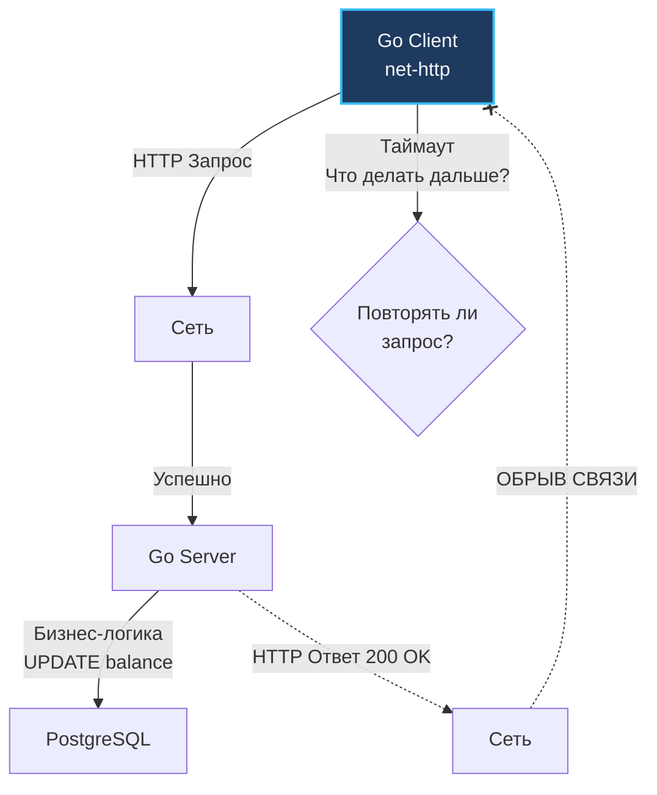

## Анатомия HTTP-методов: Больше, чем просто CRUD

В физическом мире каждое действие подчиняется законам механики: если вы повернете ключ в запертом замке второй раз, засов останется в том же выдвинутом положении. Но если вы дважды нажмете кнопку выдачи купюр в банкомате, повторный сигнал приведет к выдаче второй порции денег. 

В распределенных сетевых системах разница между этими двумя событиями — это водораздел между отказоустойчивой архитектурой и финансовой катастрофой.

В предыдущей статье ([[4. Resource oriented design.md]]) мы научились структурировать систему вокруг ресурсов (существительных), исключив глаголы из URL. Однако действия не исчезли — они делегированы на уровень сетевого протокола в виде HTTP-методов (глаголов).

Для начинающего разработчика методы HTTP — это просто синонимы базы CRUD (Create, Read, Update, Delete). Для Senior-инженера методы протокола — это **строгие поведенческие гарантии**, на основе которых маршрутизаторы, балансировщики нагрузки (Nginx, Envoy), браузеры и сетевые клиенты принимают решение: безопасно ли автоматически повторять упавший запрос при сетевом сбое.

Центральными столпами здесь выступают концепции **Безопасности (Safety)** и **Идемпотентности (Idempotency)**.

## Идемпотентность: Математика в сетях

Термин пришел из абстрактной алгебры. Математическая функция называется идемпотентной, если ее повторное применение к собственному результату не изменяет конечного значения:
$$f(f(x)) = f(x)$$

В контексте сетевых API это означает фундаментальную гарантию: **сервер может получить один и тот же запрос один раз, дважды или сотни раз подряд, однако конечное состояние ресурсов в базе данных останется точно таким же, как если бы запрос был успешно выполнен ровно один раз.**

> [!warning] Ловушка / Gotcha: Ответ vs Состояние
> Идемпотентность жестко гарантирует неизменность *внутреннего состояния данных на сервере*, но **категорически не гарантирует идентичность возвращаемого HTTP-статуса** (HTTP Status Code) в ответе!
> 
> Классический пример: первый запрос `DELETE /users/123` находит запись в таблице, удаляет ее и возвращает статус `204 No Content`. Повторный сетевой запрос `DELETE /users/123` той же записи уже не найдет и вернет клиенту ошибку `404 Not Found`. Статусы ответов кардинально различаются, однако состояние базы данных идентично в обоих случаях: пользователя 123 в системе больше нет. Операция строго идемпотентна.

### Зачем это нужно? Проблема двух генералов

В распределенных системах мы обязаны помнить первое заблуждение распределенных вычислений (Fallacies of Distributed Computing): *«Сеть надежна»*. Сеть ненадежна всегда.

Когда ваш Go-клиент отправляет запрос на сервер и операция завершается ошибкой по таймауту (`context.DeadlineExceeded`), вызывающий код оказывается в зоне абсолютной неопределенности (классическая проблема двух генералов в компьютерных сетях).

Инженер не может знать, на каком именно физическом этапе произошел обрыв:
1. Запрос потерялся по пути и сервер его даже не увидел.
2. Сервер успешно принял запрос, но упал в панику до того, как открыл транзакцию в базе данных.
3. Сервер безупречно выполнил операцию (например, успешно списал 10 000 рублей со счета), но исходящий сетевой пакет с подтверждением `200 OK` был отброшен сбойным маршрутизатором по пути назад к клиенту.



Если вызванный эндпоинт **идемпотентен**, ответ на тревожный вопрос «Повторять ли сетевой запрос?» прост и однозначен: **ДА**. Клиентский middleware может безопасно повторять вызов по таймауту до тех пор, пока не получит подтверждение.

Если же операция **не идемпотентна** (например, слепой `POST` без ключа идемпотентности), автоматический повтор запроса приведет к катастрофической повторной транзакции и дублированию списания денег.

## Классификация HTTP-методов

Согласно базовой спецификации RFC 7231, стандартные методы разделяются по двум осям: безопасности и идемпотентности.

**Безопасные методы (Safe Methods)** — методы, вызов которых предназначен исключительно для извлечения информации и семантически не имеет права изменять бизнес-состояние сервера (Read-Only). По определению стандарта, все безопасные методы автоматически являются идемпотентными.

### 1. GET, HEAD, OPTIONS
* **Безопасный:** Да.
* **Идемпотентный:** Да.
* **Специфика:** Метод `GET` может порождать побочные эффекты на уровне инфраструктуры (запись строки в системный access-лог, инкремент счетчика просмотров в Prometheus), однако доменное состояние ресурса обязано оставаться неизменным. Вся глобальная индустрия кэширования веб-трафика (CDN Cloudflare, кэширующие прокси Nginx, кэш браузера) держится на незыблемой гарантии: повторный вызов `GET` безопасен и не разрушает данные.

### 2. PUT
* **Безопасный:** Нет (модифицирует данные).
* **Идемпотентный:** Да.
* **Специфика:** Семантика `PUT` буквально означает: *«Замени целевой ресурс по данному URI предоставленным телом запроса целиком»*. Если клиент отправляет `PUT /users/1` с полным объектом профиля 10 раз подряд, база данных 10 раз перезапишет одни и те же значения в тех же колонках. Итоговое состояние системы после одного или десяти вызовов будет тождественным.

> [!warning] Ловушка / Gotcha: Ложный PUT
> Если разработчик реализует эндпоинт `PUT /users/1`, но внутри обработчика выполняет инкрементный SQL-запрос вида:
> `UPDATE users SET age = age + 1 WHERE id = 1`
> то он грубо нарушает спецификацию протокола HTTP! Такой `PUT` мгновенно перестает быть идемпотентным. Если в корпоративной сети произойдет мигание сокета и промежуточный балансировщик повторит пакет, возраст пользователя увеличится дважды.

### 3. DELETE
* **Безопасный:** Нет (удаляет ресурс).
* **Идемпотентный:** Да.
* **Специфика:** Первое удаление уничтожает сущность. Повторные вызовы констатируют факт отсутствия ресурса. Конечное состояние базы данных неизменно.

### 4. POST
* **Безопасный:** Нет.
* **Идемпотентный:** Нет.
* **Специфика:** Универсальная «рабочая лошадка» протокола. Используется для создания дочерних сущностей с генерацией нового ID на стороне сервера, для запуска тяжелых процедурных расчетов и выполнения кастомных методов из парадигмы ROD. Слепой повтор `POST`-запроса гарантированно порождает дублирование сущностей.

### 5. PATCH
* **Безопасный:** Нет.
* **Идемпотентный:** **Нет** (согласно спецификации RFC 5789), хотя на практике часто проектируется как идемпотентный.
* **Специфика:** Метод `PATCH` предназначен для частичной модификации ресурса (наложения диффа). Если тело запроса представляет собой набор скалярных присваиваний вида `{"status": "active"}`, то его многократное применение идемпотентно. Однако спецификация RFC 5789 допускает использование диалектов патчей (например, JSON Patch / RFC 6902), где полезная нагрузка может содержать мутирующие операции: `{"$inc": {"balance": 100}}` или добавление элемента в конец массива. Повторное применение таких инструкций приведет к накоплению изменений, поэтому на уровне стандарта метод `PATCH` не считается идемпотентным.

> [!tip] Собеседование
> **Вопрос:** В чем принципиальная разница между методами PUT и PATCH с точки зрения спецификации HTTP и архитектуры распределенных систем?
> **Ответ:** Различие носит двухуровневый характер:
> 1. **Объем мутации:** `PUT` требует передачи полной репрезентации ресурса и замещает его целиком (не переданные поля сбрасываются в значения по умолчанию). `PATCH` передает лишь дельту изменений (частичное обновление).
> 2. **Архитектурные гарантии:** Метод `PUT` строго идемпотентен по спецификации RFC 7231 — балансировщики и сетевые клиенты имеют законное право автоматически повторять упавший запрос. Метод `PATCH` (RFC 5789) математической идемпотентности не гарантирует, поскольку патч может содержать операционные инструкции инкремента или добавления в список.

## Mechanical Sympathy: Как net/http работает с идемпотентностью

В стандартной библиотеке Go за сетевой транспорт отвечает структура `http.Transport`. Мало кто из инженеров заглядывает во внутренности рантайма, однако Go активно использует спецификацию идемпотентности для **автоматических скрытых повторов (Auto-Retries)** на уровне ядра сетевого стека!

Представим штатную ситуацию: клиентский пул держит открытое постоянное соединение (HTTP Keep-Alive). В этот же момент удаленный сервер решает закрыть простаивающий сокет по тайм-ауту и отправляет управляющий TCP-пакет `RST` или кадр HTTP/2 `GOAWAY`. Если в эту микросекунду Go-клиент пытается отправить запрос в уже закрывающийся сокет, рантайм обязан принять решение: падать с сетевой ошибкой или попытаться прозрачно повторить запрос?

Обратимся к исходному коду рантайма Go (файл `src/net/http/request.go`, вызываемый из `transport.go` в методе `shouldRetryRequest`):

```go
// Логика автоматического повтора в недрах Go net/http (src/net/http/request.go)
func (r *Request) isReplayable() bool {
    if r.Body == nil || r.Body == NoBody || r.GetBody != nil {
        switch valueOrDefault(r.Method, "GET") {
        case "GET", "HEAD", "OPTIONS", "TRACE":
            return true
        }
        // Заголовки идемпотентности позволяют повторить даже POST-запрос!
        if r.Header.has("Idempotency-Key") || r.Header.has("X-Idempotency-Key") {
            return true
        }
    }
    return false
}
```

> [!info] Под капотом: Транспортный слой
> Механизм повторов в Go опирается на состояние сетевого буфера:
> Если физический обрыв соединения произошел **до того**, как рантайм Go успел записать хотя бы один байт заголовков или тела запроса в сетевой дескриптор ядра (`netFD`), то клиентский транспорт прозрачно пересоздаст сокет и повторит АБСОЛЮТНО ЛЮБОЙ запрос, включая `POST`.
> 
> Однако если в сокет `netFD` улетел хотя бы один байт, рантайм Go активирует метод `isReplayable()`. Для обычного метода `POST` повтор будет немедленно заблокирован (вернется ошибка `context.DeadlineExceeded` или `io.EOF`), поскольку рантайм не знает, был ли пакет прочитан бэкендом. Исключение составляют запросы, снабженные заголовками `Idempotency-Key` или `X-Idempotency-Key` с возможностью повторного чтения тела (`GetBody != nil`), либо стандартные безопасные и идемпотентные методы (`GET`, `HEAD`, `OPTIONS`, `TRACE`), для которых рантайм автоматически переоткроет соединение.

## Как сделать POST идемпотентным?

Поскольку метод `POST` по своей природе не идемпотентен, как мы можем безопасно проводить списание денежных средств или регистрацию заказов в распределенной микросервисной среде, где сетевые таймауты неизбежны?

Мы обязаны реализовать гарантию идемпотентности искусственно, на прикладном уровне. Золотым индустриальным стандартом (популяризированным платежной системой Stripe) выступает паттерн **Idempotency Key (Ключ идемпотентности)**:

1. Вызывающий клиент генерирует глобально уникальный идентификатор транзакции (обычно UUIDv4).
2. Клиент передает этот идентификатор в стандартизированном HTTP-заголовке:
   `Idempotency-Key: 123e4567-e89b-12d3-a456-426614174000`
3. Сервер перед стартом бизнес-обработки обращается к распределенному хранилищу (Redis или PostgreSQL) и пытается атомарно зафиксировать ключ:
   * **Ключ встречается впервые:** сервер атомарно блокирует ключ, исполняет финансовую операцию, сохраняет результат и кэширует сгенерированный HTTP-ответ.
   * **Ключ уже зафиксирован в хранилище:** сервер **не выполняет бизнес-логику повторно**, а мгновенно отдает клиенту сохраненный из кэша результат первой транзакции.

Глубокий анализ этого механизма, решение проблем гонок (Race Conditions) и построение надежного хранилища ключей мы разберем в отдельной статье [[13. Idempotency ключи.md]].

## Итог

1. Выбор сетевого метода HTTP — это не формальная дань моде REST, а строгий архитектурный контракт, сообщающий клиентам и балансировщикам (Nginx, Envoy), допустимо ли повторять запрос при сбоях связи.
2. **Безопасные методы (Safe: GET, HEAD)** гарантируют неизменность данных и являются фундаментом эффективного кэширования.
3. **Идемпотентные методы (PUT, DELETE)** модифицируют данные, но их многократное применение оставляет систему в одном и том же стабильном состоянии.
4. Помните о ловушке: идемпотентность гарантирует неизменность состояния базы данных, а не идентичность числового кода статуса (пример с `204 No Content` и `404 Not Found` для `DELETE /users/123`).
5. Стандартный пакет `net/http` в Go опирается на идемпотентность для прозрачных скрытых сетевых повторов в `src/net/http/transport.go`.
6. Неидемпотентный метод `POST` обязан защищаться ключами идемпотентности (`Idempotency-Key`) во всех критических финансовых транзакциях.

Мы разобрались, как клиент декларирует свои намерения через методы HTTP. Однако как сервер формально и однозначно сообщает клиенту о результате операции? Полагаться на разношерстные текстовые сообщения в теле ответа недопустимо. Для этого протокол предоставляет строгую числовую систему координат. В следующей лекции мы досконально препарируем анатомию статус-кодов: [[6. Статусы HTTP.md]].
