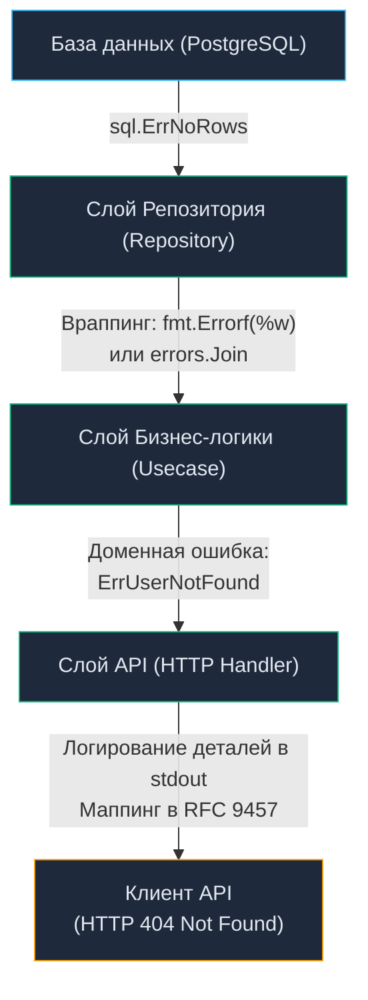

# 9. Обработка ошибок в API: От архитектуры до RFC 7807

> *«Не просто проверяйте ошибки — обрабатывайте их достойно».*    
> — Роб Пайк

## Анатомия ошибки: От базы данных до JSON-ответа

В предыдущей статье мы разобрали [[6. Статусы HTTP.md]] — числовые коды протокола, которые служат первичным грубым светофором для браузеров, прокси-серверов и систем мониторинга. Однако числового статуса `400 Bad Request` совершенно недостаточно, чтобы Frontend-разработчик понял, какое именно поле формы заполнено неверно и почему валидатор отверг пароль. Статуса `500 Internal Server Error` совершенно недостаточно, чтобы дежурный SRE-инженер в три часа ночи понял причину аварии и локализовал сбой.

Проектирование обработки ошибок в сетевом API — это тонкое инженерное искусство балансирования между двумя противоречивыми требованиями:
1. **Для клиента (Security & UX):** Ответ должен быть предельно ясным, предсказуемым, строго структурированным, но при этом **категорически не раскрывать** внутреннее устройство системы (названия таблиц базы данных, фрагменты SQL-запросов, внутренние IP-адреса сервисов, переменные окружения и трассировку стека).
2. **Для разработчика (Observability & Debugging):** Ошибка в логах и трейсах обязана содержать максимальный диагностический контекст (полный Stack Trace, уникальный Trace/Request ID, аргументы вызова и причину сбоя), чтобы проблему можно было локализовать за пару минут без гадания на кофейной гуще.

В этой статье мы разберем, как фундаментальная философия Go *«Errors are values»* помогает строить надежные, безопасные и высокопроизводительные сетевые интерфейсы.

---

## Парадигма Go: Ошибки vs Исключения

Разработчики, приходящие в Go из Java, C#, Python или PHP, в первые недели испытывают культурный шок от повсеместной конструкции `if err != nil`. Они привыкли к исключениям (Exceptions) и невидимым блокам `try/catch/finally`. Почему создатели Go в Bell Labs осознанно отвергли механизм исключений в пользу явного возврата ошибок?

> [!info] Под капотом: Механика Exceptions (Mechanical Sympathy)
> В языках с исключениями (Java/C#) выброс `throw new Exception()` — это катастрофически дорогая операция для рантайма:
> 1. **Stack Unwinding (Раскрутка стека):** Рантайм прерывает нормальный поток выполнения (по сути, выполняя невидимый, нелокальный `GOTO`) и начинает идти вверх по стеку вызовов, ища ближайший блок `catch`. Это ломает предсказатель переходов CPU (Branch Predictor) и сбрасывает конвейер инструкций.
> 2. **Аллокации и GC:** При создании объекта исключения виртуальная машина сканирует указатели фреймов стека и материализует Stack Trace (массив строк с именами файлов, методов и номерами строк). Это вызывает тяжелые аллокации в куче (Heap), нагружая сборщик мусора (Garbage Collector).
> 
> В Go ошибка — это обычное значение, реализующее встроенный интерфейс `error`. Возврат кортежа `(result, err)` или `nil, err` благодаря соглашению о вызовах **ABIInternal** (начиная с Go 1.17+) происходит напрямую через **регистры процессора** (`RAX`, `RBX`), вообще без обращения к оперативной памяти!
> 
> Ошибка в Go — это не аномальная авария, а штатное, ожидаемое состояние программы (State). Вы явно программируете ветвление (Control Flow), сохраняя прозрачность и предсказуемость логики.

---

## RFC 9457: Стандарт контракта ошибки

Исторически каждый бэкенд-разработчик изобретал собственный формат JSON-ответа при сбоях:
* Вариант 1: `{"error": "message"}`
* Вариант 2: `{"success": false, "data": null, "message": "error"}`
* Вариант 3: `{"err_code": 104, "description": "fail"}`

Такой зоопарк превращал клиентскую разработку в кошмар: для каждого микросервиса приходилось писать уникальные парсеры ошибок.

Чтобы стандартизировать формат, комитет IETF утвердил спецификацию **RFC 9457 (Problem Details for HTTP APIs)**, которая официально аннулировала и заменила исходный стандарт RFC 7807. Идиоматичный Go-бэкенд должен возвращать ошибки именно в этом формате с заголовком `Content-Type: application/problem+json`.

```json
{
  "type": "https://api.mycompany.com/errors/insufficient-funds",
  "title": "Недостаточно средств на балансе",
  "status": 422,
  "detail": "Ваш текущий баланс 30 монет, а операция требует 50.",
  "instance": "/users/123/transactions/xyz",
  "extensions": {
    "current_balance": 30,
    "required_balance": 50
  }
}
```

Разберем назначение ключевых полей RFC 9457:
* `type`: URI-идентификатор, определяющий категорию проблемы. Клиентский код может программно проверять тип ошибки через `if (err.type === '...')`, не занимаясь хрупким парсингом человекочитаемых строк.
* `title`: Краткая текстовая сводка проблемы на понятном человеку языке (одинаковая для всех ошибок данного типа).
* `status`: Числовой HTTP-статус (дублирует код из заголовка пакета на случай, если корпоративный прокси или CDN исказил заголовки ответа).
* `detail`: Развернутое объяснение возникшей проблемы, относящееся к конкретно этому запросу.
* `instance`: URI ресурса или уникального вхождения операции, где произошел инцидент (помогает сопоставить запрос с клиентскими действиями).
* `extensions`: Дополнительные объектные метаданные (например, балансы, списки невалидных полей формы).

---

## Архитектура: Слоистая обработка ошибок

Главный грех неопытных разработчиков — «протекание» технической ошибки инфраструктурного слоя на уровень HTTP-клиента. Если база данных не нашла запись или упала по таймауту, отдавать наружу сырое сообщение `pq: relation "orders" does not exist` — грубейшая брешь в безопасности.

Архитектурно обработка ошибок строится по принципу изоляции слоев:



### 1. Слой репозитория (Враппинг)
Когда драйвер базы данных возвращает техническую ошибку вроде `sql.ErrNoRows`, бизнес-логика не должна зависеть от SQL-пакетов. Мы оборачиваем исходную ошибку, добавляя контекст текущей операции:
```go
err = fmt.Errorf("user repository - get by id: %w", err)
```
Спецификатор `%w` создает цепочку оборачивания («матрешку»), сохраняя исходную техническую ошибку внутри для последующего анализа через `errors.Is` и `errors.As`. В Go 1.20+ для объединения нескольких параллельных ошибок также доступен `errors.Join`.

### 2. Слой бизнес-логики (Доменные ошибки)
Бизнес-логика оперирует четко типизированными сигнальными ошибками — **Sentinel Errors**:
```go
var (
    ErrInsufficientFunds = errors.New("domain: insufficient funds")
    ErrUserNotFound      = errors.New("domain: user not found")
)
```

### 3. Слой API (Маппинг в http.Handler)
В обработчике (`http.Handler`) мы извлекаем доменную ошибку и транслируем её в соответствующий HTTP-статус и DTO стандарта RFC 9457.

> [!tip] Собеседование
> **Вопрос:** В чем фундаментальная разница между `errors.Is` и `errors.As` в Go?
> 
> **Ответ:**
> * `errors.Is(err, target)` рекурсивно разворачивает цепочку ошибок (метод `Unwrap()`) и проверяет, совпадает ли текущая ошибка с конкретным эталонным **значением** (Sentinel Error, например `errors.Is(err, sql.ErrNoRows)`).
> * `errors.As(err, &target)` рекурсивно разворачивает цепочку ошибок и проверяет, совпадает ли ошибка по **типу** с переданным указателем на структуру/интерфейс. Если совпадение найдено, `errors.As` копирует значение ошибки в целевую переменную `target`, позволяя извлечь кастомные поля структуры.

---

## Идиоматичный паттерн: Кастомная ошибка приложения (AppError)

Чтобы избежать дублирования громоздких конструкций `switch` в десятках обработчиков, зрелые Go-проекты создают структурированный тип ошибки приложения (`AppError`), инкапсулирующий HTTP-статус и код ошибки:

```go
package apperrors

import "fmt"

// AppError реализует стандартный интерфейс error
type AppError struct {
	Err        error  // Исходная техническая ошибка (для внутренних логов)
	HTTPStatus int    // Числовой HTTP-статус ответа (например, 404)
	Code       string // Машинно-читаемый код для клиента (например, "user_not_found")
	Message    string // Безопасное сообщение для клиента
}

func (e *AppError) Error() string {
	if e.Err != nil {
		return fmt.Sprintf("%s: %v", e.Message, e.Err)
	}
	return e.Message
}

// Позволяет стандартным функциям errors.Is и errors.As разворачивать ошибку
func (e *AppError) Unwrap() error {
	return e.Err
}

// Вспомогательный конструктор для ошибки 404 Not Found
func NewNotFound(code, message string, err error) *AppError {
	return &AppError{
		Err:        err,
		HTTPStatus: 404, // http.StatusNotFound
		Code:       code,
		Message:    message,
	}
}
```

Централизованный диспетчер ошибок в Middleware или вспомогательной функции выглядит лаконично:

```go
func HandleError(w http.ResponseWriter, r *http.Request, err error) {
	var appErr *apperrors.AppError
	
	// Если ошибка типизирована как AppError — отдаем управляемый ответ
	if errors.As(err, &appErr) {
		// 1. Логируем ВНУТРЕННЮЮ техническую ошибку (appErr.Err) со стектрейсом
		log.Printf("[ERROR] req_id=%s: %v", r.Context().Value("req_id"), appErr)
		
		// 2. Отдаем клиенту БЕЗОПАСНЫЙ JSON (без деталей БД)
		sendJSON(w, appErr.HTTPStatus, ProblemDetails{
			Type:   "/errors/" + appErr.Code,
			Title:  appErr.Message,
			Status: appErr.HTTPStatus,
		})
		return
	}

	// Фолбэк: если ошибка неизвестна (паника, баг) - это 500 Internal Server Error
	log.Printf("[CRITICAL] unknown error: %v", err)
	sendJSON(w, 500, ProblemDetails{
		Type:   "/errors/internal",
		Title:  "Внутренняя ошибка сервера",
		Status: 500,
	})
}
```

---

## Паники (Panics) в HTTP API

Что произойдет, если в горутине HTTP-хендлера случится разыменование нулевого указателя (`nil pointer dereference`) или выход за границы среза? Рантайм выбросит `panic`. В обычной CLI-утилите неперехваченная паника немедленно завершает весь процесс.

Однако сервер `net/http` спроектирован чрезвычайно устойчиво. На каждую входящую горутину сервер автоматически устанавливает отложенный перехватчик:
```go
`defer func() { recover() }()`
```
Если хендлер паникует, стандартный сервер Go перехватывает сбой, выводит аварийный Stack Trace в `os.Stderr`, закрывает TCP-соединение с клиентом и продолжает бесперебойно обслуживать соседние параллельные запросы.

> [!warning] Ловушка / Gotcha: Паника в фоновых горутинах
> Встроенный `recover` в `net/http` защищает **ТОЛЬКО** ту конкретную горутину, которую рантайм выделил для обработки входящего HTTP-запроса!
> 
> Если внутри хендлера вы запустите фоновую задачу:
> ```go
> go func() {
>     doSomeHeavyWork() // Если здесь случится nil dereference...
> }()
> ```
> И в этой дочерней горутине произойдет паника — рантайм Go **немедленно уронит весь процесс операционной системы** (`SIGABRT`), вызвав фатальный простой (Downtime) всего сервиса для тысяч пользователей!
> 
> **Железное правило:** Никогда не запускайте анонимные неуправляемые горутины. Фоновые задачи обязаны содержать собственный `defer recover()`, либо управляться через структурированные пулы воркеров и пакет `golang.org/x/sync/errgroup`.

---

## Самая коварная ошибка на собеседованиях: Nil Interface Trap

Один из самых популярных вопросов на собеседованиях уровня Senior Go Developer — поведение интерфейса `error`, содержащего типизированный `nil`.

```go
type CustomError struct {
	Msg string
}

func (e *CustomError) Error() string { return e.Msg }

func doSomething() error {
	var err *CustomError = nil // Явно nil
	
	// Ветвление не сработало, ошибки нет
	
	// Возвращаем nil? Спойлер: НЕТ!
	return err 
}

func main() {
	err := doSomething()
	if err != nil {
		fmt.Println("Произошла ошибка!") // Этот код выполнится!
	}
}
```

Почему проверка `err != nil` возвращает `true`, если мы явно положили в переменную `nil`?

> [!info] Под капотом: Интерфейсы в памяти
> Тип `error` в Go — это интерфейс. В рантайме (согласно структуре `iface` в исходниках `runtime/iface.go`) интерфейс представляет собой пару из двух машинных указателей:
> 1. `itab` — указатель на метаданные о конкретном типе, реализующем методы интерфейса.
> 2. `data` — указатель на само значение в памяти.
> 
> Переменная интерфейсного типа считается равной `nil` **ТОЛЬКО тогда, когда ОБА указателя (`itab` и `data`) равны `nil`**!
> 
> В приведенном примере в функцию возвращается типизированный указатель `*CustomError(nil)`. При упаковке в возвращаемый интерфейс `error` рантайм создает структуру:
> - `itab` = `*CustomError` (тип известен, указатель не nil!)
> - `data` = `nil`
> 
> Поскольку указатель на таблицу типов `itab` не равен нулю, интерфейс не является пустым, и проверка `err != nil` возвращает `true`!
> 
> **Решение:** Никогда не объявляйте переменные кастомных ошибок через указатели на конкретные типы при возврате интерфейса `error`. Всегда явно возвращайте литерал `nil`:
> ```go
> if failed {
>     return &CustomError{Msg: "boom"}
> }
> return nil // Явный nil очищает и itab, и data
> ```

---

## Итог

1. **Не транслируйте технические ошибки наружу:** Внутренние детали (SQL-запросы, трейсы, таймауты) должны оставаться в логах, а клиент API должен получать безопасный стандартизированный ответ.
2. **RFC 9457 (Problem Details):** Используйте стандартизированный JSON (`application/problem+json`) с полями `type`, `title`, `status` и `detail` (заменивший RFC 7807).
3. **Паттерн AppError:** Применяйте централизованные типы ошибок приложения, чтобы избавиться от дублирования маппинга статусов в хендлерах.
4. **Враппинг:** Связывайте ошибки по цепочке через спецификатор `%w` в `fmt.Errorf` или функцию `errors.Join`, позволяя функциям `errors.Is` и `errors.As` работать корректно.

Научившись проектировать надежную обработку негативных сценариев, мы возвращаемся к эффективной передаче данных при нормальной работе сервиса. Как передавать клиенту списки из сотен тысяч записей, не перегружая оперативную память сервера, не создавая блокировок в базе данных и обеспечивая стабильный быстрый отклик? Ответ кроется в архитектурных паттернах выборки, которые мы изучим в следующей лекции: [[10. Pagination, filtering, sorting.md]].
