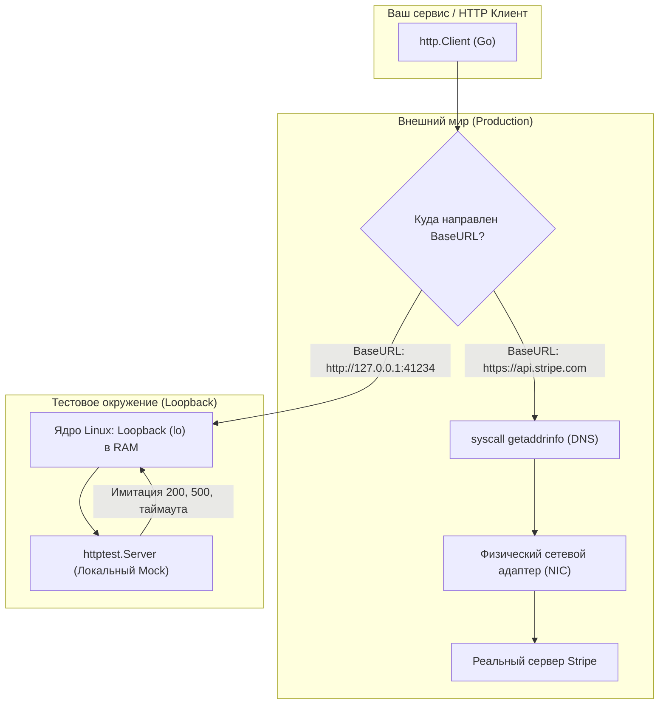

## Цена зависимости: почему нельзя стучаться в Production

В предыдущей главе [[8. HTTP integration тесты]] мы научились верифицировать бэкенд как целостную систему, направляя реальные HTTP-запросы в роутер и контролируя фиксацию изменений в собственной базе данных. Однако современный серверный монолит или микросервис никогда не существует в вакууме. Реальное приложение опутано десятками внешних сетевых связей: платежные шлюзы (Stripe, PayPal), провайдеры аутентификации (OAuth2, OpenID Connect), CRM-системы, картографические сервисы или API соседних команд.

Когда дело доходит до тестирования логики, завязанной на сторонние платформы, у начинающих инженеров возникает соблазн отправить запрос на тестовый (staging/sandbox) сервер внешнего сервиса.

Здесь действует непреложный инженерный закон: **Никогда не совершайте реальные сетевые вызовы во внешние API в рамках CI/CD пайплайна.**

Причины этого категорического запрета уходят корнями в физику распределенных систем:
1. **Недетерминированность и нестабильность:** Внешний стенд может уйти на ночную перезагрузку, оказаться перегруженным запросами со всего мира или ответить с задержкой в 10 секунд. Ваши тесты моментально станут нестабильными (Flaky), подрывая доверие к процессу сборки.
2. **Лимиты пропускной способности (Rate Limits) и финансовые затраты:** Подавляющее большинство коммерческих API устанавливают жесткие квоты (например, не более 100 запросов в минуту с одного IP) либо списывают деньги за каждый вызов. Запуск параллельного сьюта из 50 воркеров сожжет лимиты за секунды.
3. **Невозможность моделирования отказов (Chaos Engineering):** Как заставить чужой платежный шлюз вернуть вашему тесту статус `503 Service Unavailable`, разорвать TCP-соединение в середине передачи тела ответа или симулировать лаг в 30 секунд? Никакой реальный sandbox не позволит вам управлять своим внутренним состоянием по щелчку пальцев.

---

## Иллюзия безопасности: Мокирование интерфейсов

Классическая объектно-ориентированная реакция на эту проблему — объявить интерфейс и спрятать за ним сетевой вызов:

```go
type PaymentClient interface {
    Charge(ctx context.Context, amount float64) error
}
```

В тестовом коде генерируется `MockPaymentClient` (например, через библиотеку `gomock`), и разработчик уверенно пишет:
```go
mock.EXPECT().Charge(ctx, 100.0).Return(nil)
```

Казалось бы, задача решена? Увы, это опасное заблуждение.

> [!warning] Ловушка / Gotcha
> Это хрестоматийный пример антипаттерна [[7. Overmocking как анти паттерн]] в интеграционном тестировании. 
> 
> Подменяя интерфейс Go-моком, вы проверяете лишь то, что ваш метод вызывает другой метод в памяти. Вы **полностью исключаете из проверки сетевой транспорт**:
> - Корректно ли ваш код собирает HTTP-запрос (метод POST, путь `/v1/charges`, экранирование query-параметров)?
> - Передаются ли обязательные заголовки (`Authorization: Bearer ...`, `Content-Type: application/json`)?
> - Правильно ли настроены теги сериализации `json.Marshal`? (Достаточно случайно написать `json:"amout"` вместо `json:"amount"`, и боевой сервер Stripe отклонит платеж, хотя тест с `MockPaymentClient` пройдет с зеленым маркером).
> - Как ваш клиент среагирует, если удаленный сервер ответит ошибкой `400 Bad Request` с телом `{"error": "card_declined"}`?
> - Что произойдет при таймауте сетевого сокета?

Интерфейсные моки идеальны для быстрых юнит-тестов доменных сервисов. Но если вы хотите быть уверены, что клиентский код действительно умеет общаться с внешним миром, тестировать необходимо **настоящий транспортный протокол**.

---

## Идиоматичный путь: httptest.Server

Вместо подмены интерфейса Go мы используем идиоматичный подход стандартной библиотеки: **мы подменяем сам удаленный HTTP-сервер**. Пакет `net/http/httptest` предоставляет инструмент `httptest.NewServer`.

Идея предельно элегантна: прямо внутри процесса `go test` разворачивается локальный легковесный веб-сервер. Единственное, что требуется от архитектуры вашего клиента — это поддержка конфигурационного параметра `BaseURL`. В продакшене клиент стучится на `https://api.stripe.com`, а в тестах — на локальный адрес `http://127.0.0.1:41234`, выделенный ядром операционной системы.

### Mechanical Sympathy: Почему это быстро?

Запрос к реальному серверу в интернете требует обращения к DNS через системный вызов `getaddrinfo`, маршрутизации через внешние шлюзы, потерь пакетов и шифрования TLS. 

Когда клиент обращается к адресу `127.0.0.1`, запрос перенаправляется на виртуальный сетевой интерфейс **Loopback (`lo`)**. Сетевой стек ядра Linux (TCP/IP) честно выполняет всю положенную работу: формирует сегменты, управляет окнами скольжения и буферами сокетов, однако байты никогда не покидают оперативную память машины и не уходят на сетевую карту (NIC). Вы получаете 100% достоверность сетевого стека при микросекундной скорости отклика.



### Пример реализации

Спроектируем HTTP-клиент так, чтобы базовый URL можно было переопределять:

```go
package stripe

import (
	"bytes"
	"context"
	"encoding/json"
	"fmt"
	"net/http"
)

type Client struct {
	BaseURL    string
	HTTPClient *http.Client
	APIKey     string
}

func NewClient(apiKey string) *Client {
	return &Client{
		BaseURL:    "https://api.stripe.com", // Значение для боевого режима
		HTTPClient: &http.Client{},
		APIKey:     apiKey,
	}
}

type ChargeRequest struct {
	Amount   float64 `json:"amount"`
	Currency string  `json:"currency"`
}

type ChargeResponse struct {
	ID     string `json:"id"`
	Status string `json:"status"`
}

func (c *Client) Charge(ctx context.Context, amount float64) (*ChargeResponse, error) {
	payload := ChargeRequest{Amount: amount, Currency: "usd"}
	bodyBytes, err := json.Marshal(payload)
	if err != nil {
		return nil, fmt.Errorf("ошибка сериализации: %w", err)
	}

	url := fmt.Sprintf("%s/v1/charges", c.BaseURL)
	req, err := http.NewRequestWithContext(ctx, http.MethodPost, url, bytes.NewReader(bodyBytes))
	if err != nil {
		return nil, fmt.Errorf("ошибка создания запроса: %w", err)
	}

	req.Header.Set("Authorization", "Bearer "+c.APIKey)
	req.Header.Set("Content-Type", "application/json")

	resp, err := c.HTTPClient.Do(req)
	if err != nil {
		return nil, fmt.Errorf("ошибка сети: %w", err)
	}
	defer resp.Body.Close()

	if resp.StatusCode != http.StatusOK {
		return nil, fmt.Errorf("неожиданный статус код: %d", resp.StatusCode)
	}

	var chargeResp ChargeResponse
	if err := json.NewDecoder(resp.Body).Decode(&chargeResp); err != nil {
		return nil, fmt.Errorf("ошибка десериализации ответа: %w", err)
	}

	return &chargeResp, nil
}
```

А теперь напишем интеграционный тест с использованием `httptest.NewServer`:

```go
package stripe_test

import (
	"context"
	"encoding/json"
	"net/http"
	"net/http/httptest"
	"testing"

	"github.com/stretchr/testify/require"
	"yourproject/internal/stripe"
)

func TestStripeClient_Charge_Success(t *testing.T) {
	t.Parallel()

	// 1. Поднимаем локальный эмулятор API Stripe
	mockServer := httptest.NewServer(http.HandlerFunc(func(w http.ResponseWriter, r *http.Request) {
		// Валидируем сетевой протокол: метод, путь и заголовки
		require.Equal(t, http.MethodPost, r.Method)
		require.Equal(t, "/v1/charges", r.URL.Path)
		require.Equal(t, "Bearer test_secret_key", r.Header.Get("Authorization"))
		require.Equal(t, "application/json", r.Header.Get("Content-Type"))

		// Проверяем корректность сериализации тела запроса
		var reqBody map[string]any
		err := json.NewDecoder(r.Body).Decode(&reqBody)
		require.NoError(t, err)
		require.Equal(t, 100.0, reqBody["amount"])

		// Возвращаем успешный HTTP-ответ
		w.Header().Set("Content-Type", "application/json")
		w.WriteHeader(http.StatusOK)
		_, _ = w.Write([]byte(`{"id": "ch_123", "status": "succeeded"}`))
	}))

	// Освобождаем TCP-сокет после завершения теста
	t.Cleanup(func() {
		mockServer.Close()
	})

	// 2. Инициализируем клиент и подменяем BaseURL адресом мок-сервера
	client := stripe.NewClient("test_secret_key")
	client.BaseURL = mockServer.URL // Подменяем на http://127.0.0.1:41234

	// 3. Выполняем реальный вызов
	res, err := client.Charge(context.Background(), 100.0)

	// 4. Проверяем бизнес-результат
	require.NoError(t, err)
	require.Equal(t, "ch_123", res.ID)
	require.Equal(t, "succeeded", res.Status)
}
```

---

## Тестирование отказоустойчивости (Chaos Testing)

Главное преимущество управления собственным сервером — возможность моделирования катастроф. Как поведет себя сервис, если удаленный API зависнет или начнет отвечать ошибками пятисотой серии?

> [!tip] Собеседование
> **Вопрос:** Чем опасен вызов `http.Client{}` со значениями по умолчанию в Go, и к каким авариям это приводит в проде?
> 
> **Ответ:** Дефолтная структура `http.Client{}` не имеет установленного тайм-аута (`Timeout: 0`). Это означает бесконечное ожидание. 
> 
> Если удаленный сервер примет TCP-соединение, но «зависнет» и не пришлет ни одного байта, горутина вызова заблокируется навсегда. Под нагрузкой тысячи горутин осядут в очереди, исчерпают системные лимиты сокетов (Socket Exhaustion) и обрушат всё приложение. 
> 
> Для надежности всегда следует либо явно конфигурировать `Timeout` на клиенте, либо ограничивать каждый вызов контекстом: `context.WithTimeout`.

Проверим устойчивость нашего клиента к таймаутам стороннего сервиса:

```go
func TestStripeClient_Charge_Timeout(t *testing.T) {
	t.Parallel()

	// Создаем мок-сервер, имитирующий зависший внешний шлюз
	mockServer := httptest.NewServer(http.HandlerFunc(func(w http.ResponseWriter, r *http.Request) {
		// Сервер искусственно спит, превышая клиентский таймаут
		time.Sleep(1 * time.Second)
		w.WriteHeader(http.StatusOK)
	}))
	t.Cleanup(func() { mockServer.Close() })

	client := stripe.NewClient("test_secret_key")
	client.BaseURL = mockServer.URL

	// Задаем строгий короткий таймаут для клиента
	client.HTTPClient = &http.Client{
		Timeout: 50 * time.Millisecond,
	}

	start := time.Now()
	// Ограничиваем операцию таймаутом
	ctx, cancel := context.WithTimeout(context.Background(), 100*time.Millisecond)
	defer cancel()

	_, err := client.Charge(ctx, 100.0)

	// Тест подтверждает: клиент оборвал соединение и не стал ждать секунду!
	require.Error(t, err)
	require.Less(t, time.Since(start), 200*time.Millisecond, "Клиент завис дольше положенного тайм-аута")
}
```

---

## Альтернатива: Инъекция RoundTripper

Бывают архитектурные ситуации, когда поднять полноценный `httptest.Server` затруднительно — например, сторонний SDK захардкодил доменные имена без возможности изменить `BaseURL`, либо нам нужно перехватывать запросы к десяткам различных доменов в одном тесте.

В Go сетевым транспортом управляет интерфейс `http.RoundTripper`. Стандартный клиент `http.Client` делегирует отправку реализации `http.Transport`. Мы можем внедрить собственную реализацию прямо в клиент:

```go
// RoundTripFunc позволяет создавать RoundTripper из анонимной функции
type RoundTripFunc func(req *http.Request) (*http.Response, error)

func (f RoundTripFunc) RoundTrip(req *http.Request) (*http.Response, error) {
	return f(req)
}

func TestClient_RoundTripperInjection(t *testing.T) {
	t.Parallel()

	client := stripe.NewClient("test_key")

	// Перехватываем HTTP-запрос ДО выхода в сеть
	client.HTTPClient.Transport = RoundTripFunc(func(req *http.Request) (*http.Response, error) {
		return &http.Response{
			StatusCode: http.StatusInternalServerError,
			// Важно: Body обязан быть не nil и реализовывать io.ReadCloser
			Body:       io.NopCloser(strings.NewReader(`{"error": "internal_error"}`)),
			Header:     make(http.Header),
		}, nil
	})

	_, err := client.Charge(context.Background(), 50.0)
	require.Error(t, err)
	require.Contains(t, err.Error(), "неожиданный статус код: 500")
}
```

Подмена `RoundTripper` выполняется быстрее (нет реального TCP-стека Loopback), однако она не выявляет нюансы работы прокси-серверов (`httputil.ReverseProxy`), TLS-рукопожатий и низкоуровневых транспортных ошибок. Поэтому `httptest.Server` остается каноническим выбором для большинства задач.

---

## Итог

1. Сетевые вызовы в боевые внешние сервисы во время тестов — главная причина нестабильных сборок и финансовых потерь.
2. Не прячьте сетевой код за искусственными интерфейсными моками: это порождает ложное чувство безопасности и пропускает сериализационные ошибки.
3. Идиоматичный подход в Go — подмена `BaseURL` на локальный экземпляр **`httptest.NewServer`**, использующий высокоскоростной Loopback-интерфейс ядра операционной системы.
4. Конфигурируйте жесткие таймауты (`Timeout`) и тестируйте сценарии отказов сторонних API.

Но что делать, если микросервис взаимодействует не с одним простым эндпоинтом, а с разветвленной экосистемой из десятков сторонних сервисов со сложными сценариями сопоставления запросов? Поддерживать громоздкие блоки `switch-case` внутри `HandlerFunc` становится непосильным бременем. Для масштабных инфраструктурных симуляций инженеры используют специализированные декларативные mock-серверы. В финальной главе нашего подраздела мы познакомимся с золотым стандартом мокирования HTTP: [[10. Wiremock и HTTP mocking]].