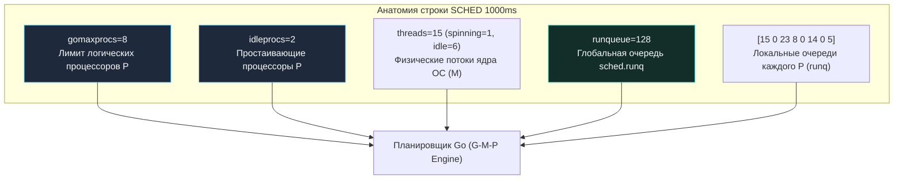
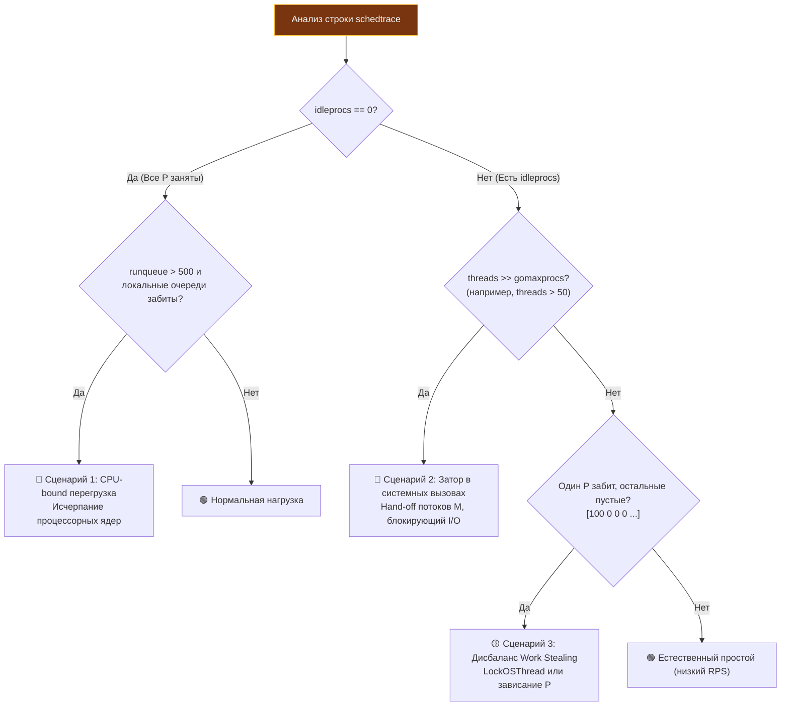

## Scheduler trace: числовая карта состояния планировщика Go

Трассировщик execution tracer ([[3. execution tracer]]) воспроизводит богатейшую хронологию событий рантайма Go: переключения горутин, фазы сборщика мусора, миграции между ядрами процессора. Однако за эту филигранную детализацию приходится расплачиваться заметным системным оверхедом (до 10–30% CPU) и необходимостью выгружать и парсить многомегабайтные файлы.

В боевой эксплуатации часто требуется не покадровая кинолента каждого микросекундного прерывания, а **мгновенная и абсолютно легковесная агрегированная статистика**:
- Сколько горутин прямо сейчас ожидают свободный процессор?
- Не размножаются ли системные потоки ОС из-за блокирующих дисковых вызовов?
- Не простаивают ли логические процессоры `P`, пока задачи скапливаются в глобальной очереди?

Эту приборную панель предоставляет **scheduler trace (трассировка планировщика)** — сверхбыстрый текстовый мониторинг внутреннего состояния планировщика Go, активируемый переменной окружения **`GODEBUG=schedtrace=...`**.



Scheduler trace — это бортовой тахометр и датчик давления масла в двигателе рантайма Go. Он не заменяет детальные профили `pprof` или execution tracer, но служит великолепным инструментом первого эшелона: позволяет за считанные секунды обнаружить глобальный дисбаланс нагрузки, исчерпание потоков ядра или лавинообразный рост очередей.

---

## Включение scheduler trace

Трассировка планировщика не требует изменения ни единой строчки исходного кода и активируется передачей переменной окружения `GODEBUG` с параметром `schedtrace=<период в миллисекундах>`.

Каждые `N` миллисекунд фоновый системный монитор рантайма (`sysmon`) формирует и сбрасывает в стандартный поток ошибок `stderr` лаконичную однострочную сводку:

```bash
GODEBUG=schedtrace=1000 ./my_server
```

Пример вывода в консоли:

```
SCHED 1000ms: gomaxprocs=8 idleprocs=2 threads=15 spinningthreads=1 idlethreads=6 runqueue=128 [15 0 23 8 0 14 0 5]
```

Для глубокой низкоуровневой отладки доступен режим `scheddetail=1`, который в дополнение к общей строке распечатывает подробнейший статус каждого отдельного процессора `P`, потока `M` и даже исполняющейся горутины `G`:

```bash
GODEBUG=schedtrace=1000,scheddetail=1 ./my_server
```

> [!info] Под капотом
> Генерация вывода `schedtrace` выполняется фоновым системным потоком `sysmon`, который работает без привязки к логическим процессорам `P`. Поток считывает глобальные счетчики структуры `sched` через быстрые атомарные операции (`atomic.Load`), не производя полной остановки мира (Stop-The-World) и не блокируя работу прикладных горутин. Именно поэтому накладные расходы `schedtrace` с интервалом 1000 мс стремятся к нулю: его можно безопасно запускать даже в высоконагруженном продакшене.

> [!warning] Ловушка / Gotcha
> **Затопление логов при `scheddetail=1`.** Включение флага `scheddetail=1` на многоядерном сервере генерирует сотни строк форматированного текста в `stderr` каждую секунду. Это может вызвать блокировку процесса на записи в небуферизованный терминал или диск и переполнить дисковое пространство системными логами. Используйте `scheddetail=1` только локально в тестовых средах, а в продакшене ограничивайтесь лаконичным `schedtrace=1000`.

---

## Разбор формата вывода

Каждая строка `schedtrace` представляет собой компактный срез метрик. Разберем анатомию каждого поля:

### `gomaxprocs`

Текущее действующее значение `GOMAXPROCS` — количество логических процессоров `P` в рантайме ([[1. Scheduler Go. G M P модель]]). Задает предел аппаратного параллелизма: сколько горутин могут физически одновременно молотить инструкции на ядрах процессора. По умолчанию равно количеству ядер CPU, выделенных процессу. Если это значение изменялось через `runtime.GOMAXPROCS()`, оно отражает текущую установку.

### `idleprocs`

Количество логических процессоров `P`, которые в данный момент **простаивают без работы**. Процессор `P` переходит в idle, если:
- Его локальная очередь задач пуста, в глобальной очереди `sched.runq` нет работы, а сетевой поллер не возвращает готовых дескрипторов.
- Все остальные `P` заняты, и алгоритм Work Stealing ([[3. Work stealing]]) не смог украсть ни одной горутины.
- Процессор ожидает привязки нового потока `M` (после процедуры hand-off при системном вызове).

> [!WARNING]
> Если `idleprocs > 0` при огромной очереди `runqueue` — это признак системного троттлинга или дефицита потоков ОС `M`! Готовые горутины есть, но их некому исполнять на свободных процессорах.

### `threads`

Общее количество физических потоков операционной системы (`M`), порожденных рантаймом Go за все время жизни процесса. Сюда входят:
- Потоки, исполняющие пользовательские горутины на процессорах `P`.
- Потоки, заблокированные в синхронных системных вызовах ядра (`read`, `write`, `getaddrinfo`).
- Спящие потоки в пуле ожидания (`idlethreads`).
- Служебные потоки рантайма (поток `sysmon`, потоки сборщика мусора).

Нормальное значение `threads` — на 2–5 единиц больше `gomaxprocs`. Если параметр `threads` стремительно растет (сотни и тысячи потоков) — сервис захлебывается в блокирующих системных вызовах ([[1. Системные вызовы и их стоимость#4. Влияние на планировщик Go: hand-off|Hand-off]]).

### `spinningthreads`

Количество потоков `M`, находящихся в состоянии **активного спиннинга (spinning)**.  
Spinning-поток — это поток, который временно остался без работы, но **не уходит в сон ядра ОС**, а активно опрашивает очереди в цикле (busy-wait), надеясь мгновенно подхватить новую горутину от другого `P` или из сетевого поллера.

Смысл spinning — радикальное сокращение задержки (latency): пробуждение спящего потока ОС через `futex` занимает от 5 до 20 микросекунд, тогда как spinning-поток подхватывает задачу за наносекунды. Рантайм жестко ограничивает количество спиннинг-потоков (не более половины от `gomaxprocs`), чтобы не сжигать такты CPU вхолостую.

### `idlethreads`

Количество потоков `M`, которые ушли в глубокий сон ядра ОС (`futex_wait`). Они не потребляют такты процессора, но удерживают стек ядра (от 2 до 8 МБ) и структуру `task_struct`. Эти потоки держатся в пуле для мгновенного подхвата процессоров `P`, освободившихся после системных вызовов.

### `runqueue`

Длина **глобальной очереди планировщика** (`sched.runq`).  
Сюда сбрасываются горутины, когда локальная очередь конкретного `P` переполняется (ее вместимость жестко фиксирована и равна 256 элементам). Также в глобальную очередь попадают горутины после вызова `runtime.Gosched()` и горутины, пробужденные сетевым поллером или завершившие блокирующий системный вызов, если их исходный `P` занят.

Большое значение `runqueue` (>500–1000) свидетельствует о том, что система работает на пределе пропускной способности, и планировщик не успевает раскидывать задачи по локальным очередям.

### Локальные очереди P

Массив в квадратных скобках в конце строки:  
`[15 0 23 8 0 14 0 5]`  
Показывает точное количество готовых горутин в персональной кольцевой очереди `runq` каждого процессора `P` (в данном примере для 8 логических процессоров).

Этот массив `[...]` — ключ к диагностике дисбаланса многопоточной нагрузки:
- **Равномерное распределение `[12 10 14 11 ...]`:** Образцовая работа планировщика, горутины равномерно распределены по ядрам CPU.
- **Резкий перекос `[256 0 0 0 ...]`:** Локальная очередь переполнена, а остальные процессоры пустуют. Это сигнал об аномалиях work stealing или привязке горутин через `LockOSThread`.

---

## Интерпретация в типичных сценариях



### 1. CPU-bound перегрузка (дефицит ядер)

```
SCHED 1000ms: gomaxprocs=8 idleprocs=0 threads=10 spinningthreads=0 idlethreads=1 runqueue=500 [120 110 130 115 125 118 122 119]
```

- `idleprocs=0` — все логические процессоры молотят на 100%.
- `runqueue=500` — глобальная очередь перегружена.
- Локальные очереди каждого `P` плотно забиты (>100 задач).
- Потоки ядра стабильны (`threads=10`), спиннинг отсутствует.

**Диагноз:** Классическое исчерпание вычислительных ресурсов CPU. Горутины создаются быстрее, чем ядра успевают их обсчитывать.  
**Решение:** Профилирование CPU через `pprof`, алгоритмическая оптимизация, либо масштабирование хоста / увеличение квоты cgroups и `GOMAXPROCS`.

---

### 2. IO-bound с блокирующими syscall

```
SCHED 1000ms: gomaxprocs=8 idleprocs=5 threads=45 spinningthreads=2 idlethreads=20 runqueue=10 [0 2 0 0 5 0 0 0]
```

- `idleprocs=5` — больше половины процессоров `P` простаивают без полезной работы!
- `threads=45` — количество физических потоков ОС превысило `gomaxprocs` в 5 раз!
- Очереди `runqueue` и локальные очереди практически пусты.

**Диагноз:** Массовый уход горутин в синхронные блокирующие вызовы операционной системы (чтение файлов с диска без netpoller, блокировки в СУБД драйверах или CGO-вызовы). При каждом системном вызове поток `M` замораживается ядром Linux, рантайм отцепляет процессор `P` (процедура hand-off) и создает новый поток `M`. Процессоры `P` простаивают, так как горутины застряли в ядре.  
**Решение:** Ограничение параллелизма файловых операций пулами воркеров, использование асинхронных библиотек или технологии Linux `io_uring`.

---

### 3. Утечка горутин (Goroutine Leak)

```
# Т = 0с
SCHED 1000ms: gomaxprocs=8 idleprocs=2 threads=12 spinningthreads=1 idlethreads=4 runqueue=50 [10 5 8 12 6 9 7 11]
# Т = 10с
SCHED 1000ms: gomaxprocs=8 idleprocs=2 threads=12 spinningthreads=1 idlethreads=4 runqueue=350 [80 75 90 85 70 82 78 88]
# Т = 20с
SCHED 1000ms: gomaxprocs=8 idleprocs=2 threads=12 spinningthreads=1 idlethreads=4 runqueue=1200 [256 256 256 256 256 256 256 256]
```

С каждой секундой суммарная длина очередей неуклонно нарастает, локальные очереди достигают лимита 256, а глобальная очередь пухнет. При этом нагрузка на сервис не менялась.  
**Диагноз:** Утечка горутин. Горутины бесконечно плодятся и застревают в каналах или забытых контекстах. Немедленный шаг: снятие дампа горутин ([[4. goroutine dump]]).

---

### 4. Дисбаланс Work Stealing

```
SCHED 1000ms: gomaxprocs=8 idleprocs=1 threads=9 spinningthreads=1 idlethreads=1 runqueue=0 [100 0 0 0 0 0 0 0]
```

У первого процессора `P0` в очереди скопилось 100 горутин, а у остальных семи процессоров очереди абсолютно пусты, и даже есть простаивающий `P` (`idleprocs=1`).  
**Диагноз:** Алгоритм Work Stealing не может перераспределить задачи.  
Типичная причина: горутины на `P0` привязаны к конкретному системному потоку через `runtime.LockOSThread()`, либо процесс ограничен жесткой маской affinity через `taskset`.

---

## Mechanical Sympathy: что цифры говорят об оборудовании

Каждое число в строке `schedtrace` имеет прямой физический эквивалент в кремнии процессора:

1. **Многократный рост `threads`:**  
   Порождение десятков потоков ядра Linux ведет к лавинообразному росту переключений контекста уровня ядра (`kernel context switches`). Каждый такой переход сбрасывает буфер ассоциативной трансляции TLB виртуальной памяти и вымывает быстрые кэши L1/L2 процессора, замедляя выполнение всего микросервиса ([[4. Контекстные переключения]]).
2. **Низкий `idleprocs` при высоком `runqueue`:**  
   Ядра процессора не простаивают, но память страдает от частой миграции структур `g` между процессорными ядрами.
3. **Паразитный эффект `spinningthreads`:**  
   Пока поток находится в состоянии spinning, он выполняет плотный цикл `PAUSE` и непрерывно читает глобальную переменную `sched.runq`. На многосокетных серверах NUMA это приводит к постоянному шторму запросов по межпроцессорной шине (Cache Line Bouncing).
4. **Локальность очередей `[ ... ]`:**  
   Планировщик Go намеренно держит горутины в локальной очереди `P` и не спешит отдавать их чужим ядрам. Это делается ради **сохранения горячего кэша CPU** (Cache Friendliness, [[8. Cache friendliness]]): пока горутина исполняется на том же логическом ядре, ее переменные остаются в L1/L2 кэше.

---

## Собеседование: типичные вопросы

> [!tip] Собеседование
> **Вопрос:** В выводе `schedtrace` вы видите `idleprocs=4`, `threads=80` при `gomaxprocs=8`. В чем причина такого поведения системы?  
> **Ответ:** Это классический паттерн блокирующего системного ввода-вывода (I/O Bottleneck). Потоки `M` входят в блокирующие системные вызовы ядра (например, синхронный дисковый ввод-вывод или CGO). Рантайм отсоединяет от них процессоры `P` (hand-off) и создает новые потоки ядра `M`. Когда горутины зависают в ядре, число потоков разрастается до 80, а освободившиеся процессоры `P` простаивают (`idleprocs=4`), так как готовых к исполнению горутин в очередях нет.

> [!tip] Собеседование
> **Вопрос:** Почему значение `threads` в `schedtrace` обычно больше `gomaxprocs` даже в идеально ненагруженной системе?  
> **Ответ:** Помимо рабочих потоков `M`, исполняющих пользовательские горутины на процессорах `P`, рантайм Go запускает служебные потоки: системный монитор `sysmon` (который не требует `P`), вспомогательные потоки сборщика мусора и обработчики системных таймеров. Кроме того, несколько потоков `M` могут находиться в состоянии покоя в пуле `idlethreads`.

---

## Комбинирование с другими инструментами

**Scheduler trace** — это надежный кардиомонитор. Обнаружив аномальные показания пульса, инженер переходит к специализированным диагностическим приборам:
1. **Взрывной рост `threads`** ──► запуск execution tracer ([[3. execution tracer]]), чтобы посекундно увидеть, какие системные вызовы вызывают заторы потоков.
2. **Раздувание `runqueue`** ──► снятие CPU-профиля ([[2. CPU profiling в Go]]) для локализации прожорливых функций и дампа горутин ([[4. goroutine dump]]).
3. **Хронический перекос локальных очередей `[ ... ]`** ──► подключение block profile ([[5. block profile]]) для поиска удерживаемых блокировок.

---

## Ограничения

- `schedtrace` фиксирует только агрегированные цифры на момент тика таймера. Кратковременные всплески активности длительностью менее периода дискретизации (например, микропауза в 2 мс внутри 1000-миллисекундного окна) могут остаться незамеченными.
- Вывод не содержит метаданных о типах горутин (сетевые, дисковые или вычислительные).
- Рекомендуемый интервал для продакшена — **1000 мс** (1 секунда). Более частый опрос (например, `schedtrace=10`) создает паразитный шум в `stderr` и тратит такты процессора на форматирование строк.

---

## Итог

- **Scheduler trace** (`GODEBUG=schedtrace=1000`) — легковесный инструмент непрерывного текстового мониторинга планировщика Go, работающий практически с нулевым оверхедом.
- Ключевые показатели: `gomaxprocs` (лимит параллелизма), `idleprocs` (свободные процессоры), `threads` (потоки ядра ОС), `runqueue` (глобальная очередь) и срез локальных очередей каждого `P`.
- Позволяет за секунды диагностировать 4 главные системные аномалии: CPU-bound перегрузку, затор в системных вызовах, утечку горутин и дисбаланс Work Stealing.
- Служит идеальным триггером для подключения более тяжелых инструментов глубокого анализа (pprof, execution tracer).

Теперь, освоив наблюдение за планировщиком, мы перейдём к финальной статье подраздела «Runtime и инструменты» — [[8. debug tools]], где систематизируем все остальные флаги отладки, системные переменные (`GODEBUG`, `GOTRACEBACK`, эндпоинты `net/http/pprof` и другие) и вспомогательные утилиты рантайма Go.