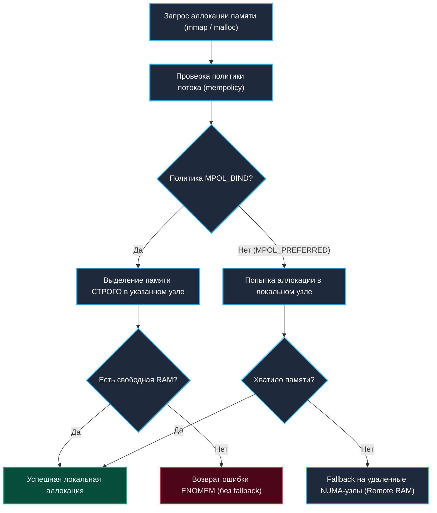

## Управление процессами и памятью на уровне ядра

> *«Современные многосокетные серверы — это не одиночные компьютеры; это небольшие распределенные сети, маскирующиеся под единую материнскую плату».*    
> — Архитектурный закон высоконагруженных систем

В раннюю эпоху Unix мир был плоским и простым: в сервере стоял один процессор, соединенный общей шиной с банком оперативной памяти. Любой байт памяти находился ровно на одинаковом физическом расстоянии от кремниевых регистров процессора.

Сегодня эта уютная иллюзия разрушена. Современный двухсокетный сервер на базе AMD EPYC или Intel Xeon — это не монолитный компьютер, а миниатюрная распределенная система. Ядра разделены на кристаллы (чиплеты) и сокеты, объединенные скоростными шинами межпроцессорного соединения (Intel UPI или AMD Infinity Fabric). 

В предыдущей статье [[17. NUMA (Non-Uniform Memory Access) и Hyper-Threading]] мы подробно изучили физическую топологию серверов. Однако операционная система не может оставаться пассивным наблюдателем: она ежесекундно решает, **на каком именно физическом ядре** будет исполняться машинный код и **из каких физических планок памяти** ядро будет аллоцировать страницы RAM.

```
       СОКЕТ 0 (NUMA Node 0)                    СОКЕТ 1 (NUMA Node 1)
 ┌─────────────────────────────┐        ┌─────────────────────────────┐
 │ Ядра CPU 0..31              │        │ Ядра CPU 32..63             │
 │ Кэш L3 (Горячий, ~10-15 нс) │        │ Кэш L3 (Горячий, ~10-15 нс) │
 └──────────────┬──────────────┘        └──────────────┬──────────────┘
                │                                      │
                ▼                                      ▼
 ┌─────────────────────────────┐  Шина UPI/IF   ┌─────────────────────────────┐
 │ Локальная RAM Node 0        │◄══════════════►│ Локальная RAM Node 1        │
 │ Доступ: ~20-30 нс           │   (~80-120 нс!)│ Доступ: ~20-30 нс           │
 └─────────────────────────────┘                └─────────────────────────────┘
```

Если поток исполняется на Ядре 0 и читает память из планки своего сокета (Node 0), задержка составляет всего **~20–30 нс**. Но если планировщик Linux бездумно перебросит этот поток на Ядро 32 в соседний сокет (Node 1), каждое обращение к этой же памяти превратится в удаленный запрос через межсокетную шину с задержкой **~80–120 нс**!

Для Go-разработчика понимание механизмов ядра Linux — **CPU Affinity** и **NUMA-политик** — это водораздел между кодом, который «просто компилируется», и высоконагруженными сервисами, способными держать миллионы RPS с предсказуемым p99 latency.

---

## CPU Affinity: Жесткая привязка к ядрам

**CPU Affinity (Связь с процессором / процессорное сродство)** — это системный механизм ядра Linux, позволяющий жестко зафиксировать набор логических ядер, на которых разрешено исполняться конкретному процессу или потоку.

Это не мягкая рекомендация, а **абсолютный запрет**. Если процессу назначена маска ядер `[0, 1, 2]`, планировщик Linux **никогда** не выделит ему ядро `3` (даже если в режиме по умолчанию `SCHED_OTHER` ядра 0–2 будут раскалены до 100%, а ядро 3 будет полностью простаивать).

### Как это работает под капотом

В исходном коде ядра Linux процессорное сродство хранится внутри структуры `task_struct` в битовой маске `cpus_mask` (тип `cpumask_t`).

Когда приложение или администратор вызывает системный вызов `sched_setaffinity(pid, mask, sizeof(mask))`, ядро выполняет следующую последовательность:
1. Валидирует битовую маску, сверяя ее со списком реально подключенных ядер (`cpu_online_mask`).
2. Проверяет права доступа: процессу разрешено менять affinity только себе или дочерним задачам (для произвольных процессов требуется привилегия `CAP_SYS_NICE`).
3. Активирует флаг `SCHED_AFFINITY` в дескрипторе задачи.
4. Если задача в данный момент исполняется на ядре, не входящем в новую маску, ядро запускает системный поток миграции (`migration/N`), который принудительно переносит задачу на разрешенное ядро и исключает ее из глобальной межъядерной балансировки нагрузки (`load_balance`).

> [!info] Под капотом: POSIX API и потоки Go
> В пространстве пользователя системный вызов ядра обертывается библиотекой pthread: 
> `pthread_setaffinity_np(pthread_t thread, size_t cpusetsize, const cpu_set_t *cpuset)`. 
> 
> Под капотом это приводит к системному вызову `sched_setaffinity` для вызывающего потока. 
> Для Go-разработчика это имеет фундаментальное следствие: в Go привязка применяется к **конкретному системному потоку ОС (`M`)**, а не к горутинам (`G`)! Если горутина мигрирует на другой поток `M`, привязка останется на старом потоке. Поэтому в Go привязку ядра всегда предваряют вызовом `runtime.LockOSThread()`.

### Утилиты и управление

В Linux-окружении управлять affinity можно как до старта сервиса, так и в рантайме:

* `taskset -c 0-3 ./myapp` — запуск приложения с жесткой привязкой к логическим ядрам 0, 1, 2 и 3.
* `ps -T -p <PID>` — просмотр всех потоков процесса и их идентификаторов TID.
* `taskset -cp <PID>` — просмотр текущей шестнадцатеричной маски affinity процесса.
* `cgroups v2 cpuset` — промышленный стандарт контейнерной изоляции в современных дата-центрах (подробно см. в [[52. Ограничения ОС. ulimit, cgroups, quotas]]).

> [!warning] Ловушка / Gotcha: Опасность ручного taskset
> Жесткая привязка навсегда отключает автоматическую балансировку нагрузки планировщика ядра. 
> Если вы принудительно зафиксируете Go-сервис на ядрах 0–3, а пришедший трафик превысит их вычислительную емкость, эти 4 ядра упрутся в 100% троттлинг, в то время как соседние 60 ядер сервера будут простаивать с нулевой нагрузкой. 
> Применение CPU Affinity оправдано **только тогда**, когда вы точно знаете, что сохранение горячего L1/L2/L3-кэша и локальность памяти критичнее эластичного распределения нагрузки.

---

## Как планировщик ОС работает с Affinity

Планировщик Linux CFS (Completely Fair Scheduler / EEVDF) стремится к идеальной справедливости, распределяя процессорное время пропорционально весу задачи (`nice`).

Когда на задачу накладывается маска affinity, планировщик переводит ее в категорию **Sticky Task** («прилипшая задача»):

1. При каждом вызове функции диспетчеризации `schedule()` ядро проверяет поле `cpus_mask`.
2. Если текущее ядро входит в разрешенную маску, поток возобновляется без миграции, сохраняя кэши L1/L2 разогретыми.
3. Если текущее ядро перегружено, балансировщик ищет свободное ядро **строго внутри разрешенной маски**.
4. Если все ядра маски заняты, задача не может уйти на свободные ядра за пределами маски. Она ставится в локальную очередь выполнения, создавая искусственное бутылочное горлышко на физическом уровне. В случае блокировок по системным ресурсам поток может перейти в состояние `TASK_UNINTERRUPTIBLE` (ожидание освобождения ресурсов).

**Влияние на Go-рантайм:**  
При инициализации рантайм Go вызывает `sched_getaffinity` и автоматически устанавливает значение `runtime.NumCPU()` и начальный `GOMAXPROCS` равным числу ядер в разрешенной маске аффинити (а не общему числу ядер хоста). Однако если маска аффинити изменяется динамически после запуска, либо если переменная `GOMAXPROCS` была принудительно переопределена вручную выше размера маски (например, оставлена равной 64 при маске из 4 ядер), Go создаст избыточное число логических процессоров `P`, которые начнут бороться за физические ядра, сжигая процессорное время на переключениях контекста.

---

## NUMA-ориентированное управление памятью в Linux

Ядро Linux не просто отображает топологию NUMA через виртуальную файловую систему `/sys/devices/system/node/`. Оно активно управляет физическим размещением памяти, стремясь свести обращения к удаленным узлам (`Remote Access` / Remote Memory Access) к минимуму.



### Системные вызовы управления памятью

Ядро предоставляет специализированные системные интерфейсы для прямого контроля над размещением физических страниц:

1. `set_mempolicy(mode, nodemask, maxnode)` — устанавливает политику аллокации памяти для всех будущих операций текущего системного потока.
2. `mbind(addr, len, mode, nodes, maxnode, flags)` — привязывает уже выделенный диапазон виртуальной памяти к конкретным физическим NUMA-узлам.

В Linux поддерживаются следующие ключевые режимы (`mode`):
- `MPOL_PREFERRED`: Политика по умолчанию. Ядро старается выделить память на локальном NUMA-узле потока. Если узел переполнен, память тихо выделяется на соседних узлах.
- `MPOL_BIND`: Жесткая привязка. Память выделяется **только** на перечисленных узлах. Если там нет свободных страниц, процесс не уходит на удаленные узлы.
- `MPOL_INTERLEAVE`: Постраничное чередование. Физические страницы распределяются по очереди между узлами (страница 0 на Node 0, страница 1 на Node 1 и т.д.). Идеально для разделяемой памяти, к которой обращаются потоки с разных сокетов.

> [!info] Под капотом: Аллокаторы памяти и mempolicy
> При вызове `malloc` в Си или внутренних системных аллокациях (о механике которых мы говорили в [[15. malloc под капотом. Откуда ОС берет память]]) рантайм вызывает низкоуровневый системный вызов `sys_mmap` (или системный вызов `mmap`).
> 
> Ядро Linux сверяется с текущей `mempolicy` потока. Если задана политика `MPOL_BIND` на узел 0, а в оперативной памяти этого узла исчерпан пул свободных страниц, ядро вернет ошибку `ENOMEM`, даже если соседний сокет Node 1 имеет 256 ГБ абсолютно свободной RAM! Для архитектора это означает: жесткая привязка памяти требует предельно точного расчета лимитов.

### Автоматическое NUMA-балансирование

Начиная с ядра Linux 2.6.38 и 3.8+, по умолчанию включен механизм **Automatic NUMA Balancing** (`kernel.numa_balancing = 1`).

Как работает этот демон:
1. Ядро периодически сбрасывает флаг присутствия страниц в таблицах страниц (помечая их как PROT_NONE), искусственно провоцируя программные прерывания **Page Fault** при обращении.
2. Перехватывая эти Page Faults, ядро измеряет долю удаленных обращений (Remote Page Faults против Local).
3. При обнаружении аномалий ядро запускает фоновый процесс миграции страниц `migratepages` (и дедупликацию через `ksm`), копируя 4-килобайтные страницы из одного сокета в другой.

**Инженерная проблема:** Фоновая миграция страниц ядра блокирует доступ к страницам памяти, сбрасывает кэш трансляций (TLB) и порождает чудовищные всплески latency (хвостовые задержки p99 прыгают с 2 мс до 150 мс!).  
Поэтому в высокопроизводительных production-системах автоматическое балансирование **всегда отключают**:
```bash
sysctl -w kernel.numa_balancing=0
# Или напрямую через procfs:
echo 0 > /proc/sys/kernel/numa_balancing
```

---

## Интеграция с cgroups и оркестраторами

В современных дата-центрах и облаках инженеры не прописывают `taskset` руками на боевых хостах. Все управление изоляцией делегировано **cgroups v2** и оркестратору **Kubernetes**.

### cgroups v2: cpuset и memory

Контроллер `cpuset` в подсистеме cgroups v2 предоставляет исчерпывающий инструментарий изоляции:
* `cpuset.cpus`: Список разрешенных ядер (например, `0-15`).
* `cpuset.mems`: Список разрешенных узлов оперативной памяти (например, `0`).
* `cpuset.sched_load_balance`: Флаг включения/отключения балансировки нагрузки внутри группы.
* `cpuset.mems_hardwall`: Запрещает ядру выделять память за пределами указанных узлов даже для страниц буферного кэша ядра.

```bash
# Пример создания строго изолированной cgroup на узле 0
mkdir -p /sys/fs/cgroup/high_perf_service
echo "0-7" > /sys/fs/cgroup/high_perf_service/cpuset.cpus
echo "0" > /sys/fs/cgroup/high_perf_service/cpuset.mems
echo $$ > /sys/fs/cgroup/high_perf_service/cgroup.procs
```

### Kubernetes CPU Manager и Topology Manager

Kubernetes транслирует архитектурные требования железа через два ключевых механизма kubelet:

1. **CPU Manager (`cpuManagerPolicy: static`):**  
   Для подов класса `Guaranteed` с целочисленными запросами ядер (например, `cpu: "4"`) kubelet выделяет **эксклюзивные физические ядра**, убирая их из общего пула хоста. Ни один другой контейнер не сможет использовать эти ядра!
2. **Topology Manager (`topologyManagerPolicy: restricted` или `single-numa-node`):**  
   Координирует выделение CPU, памяти и PCIe-устройств (например, сетевых карт SR-IOV и GPU). Если ресурсы пода невозможно выделить в рамках одного NUMA-узла, Topology Manager отклонит запуск пода (`Pod Admission Failure`), защищая приложение от штрафа за межсокетный трафик.

> [!tip] Собеседование: Деплой high-load сервиса на NUMA-ноду
> **Вопрос:** Как вы настроите деплой сверхкритичного к задержкам Go-микросервиса на 2-сокетном сервере в Kubernetes, чтобы исключить задержки на межпроцессорной шине (Remote Memory Access)?
> 
> **Ответ ведущего инженера:**
> 1. Включить на нодах `cpuManagerPolicy: static` и `topologyManagerPolicy: single-numa-node` (или `restricted`).
> 2. Задать поду класс `Guaranteed`, где `resources.requests` строго равны `resources.limits` и кратны емкости одного сокета (например, ровно `cpu: "8"` или `cpu: "16"`).
> 3. Задать внутри контейнера `GOMAXPROCS=8` (или `GOMAXPROCS=16`, строго синхронно с размером NUMA-домена).
> 4. Отключить на хосте системную балансировку: `sysctl -w kernel.numa_balancing=0`.
> 5. Настроить `nodeSelector` или правила `affinity` пода, чтобы планировщик Kubernetes отправлял нагрузку только на аппаратные ноды с проверенной топологией.

---

## Mechanical Sympathy: Влияние на Go-рантайм

Рантайм языка Go исторически проектировался как универсальная среда с единой общей кучей. Он не обладает встроенной NUMA-осведомленностью (NUMA-awareness) «из коробки»: планировщик Go не привязывает горутины к конкретным сокетам.

### Ключевые точки взаимодействия:

1. **Инициализация рантайма:**  
   При старте Go вызывает системный вызов `sched_getaffinity`. Если процесс запущен через утилиту `numactl` или в cgroup с ограничением ядер, рантайм автоматически увидит правильное количество доступных процессоров.
2. **Выделение кучи аренами (`arenas`):**  
   Go выделяет виртуальную память непрерывными аренами по 64 МБ через системный вызов `mmap`. Реальные физические страницы оперативной памяти привязываются ядром в момент первого обращения (First Touch Policy). Если горутина, создавшая объект, работала на сокете 0, объект ляжет в Node 0. Если позже горутину украдет поток с сокета 1, возникнет `Remote TLB Miss` и доступ через межсокетную шину.
3. **Мониторинг через `GODEBUG=gcresidency=1`:**  
   В современных версиях Go (начиная с Go 1.21+) появился диагностический флаг `GODEBUG=gcresidency=1`. Он логирует, сколько времени сборщик мусора GC провел на каждом логическом процессоре. Если вы видите резкий перекос (например, GC выполняет 90% работы на ядрах 0–7 и лишь 10% на 8–15), это верный признак того, что куча осела на одном NUMA-узле, а горутины размазаны по разным.

> [!warning] Ловушка / Gotcha: Ловушка раздутого GOMAXPROCS
> Установка значения `GOMAXPROCS`, превышающего количество физических ядер одного NUMA-узла на многосокетном сервере, почти гарантированно приводит к **деградации пропускной способности**:
> * Разрушается локальность L3-кэша процессора.
> * Шина межпроцессорного соединения `UPI/Infinity Fabric` забивается трафиком когерентности кэшей (MESI/MOESI snooping).
> * Сборщик мусора GC вынужден сканировать гигабайты памяти, физически разнесенные по разным сокетам материнской платы.
> 
> *Проверенная практика:* Вместо запуска одного гигантского Go-процесса на 128 ядер на 2-сокетном сервере запустите **два независимых процесса по 64 ядра**, жестко привязав каждый к своему NUMA-узлу через `numactl --cpunodebind=0 --membind=0`. Выигрыш в чистой производительности может достигать 30–40%!

---

## Итог

1. **CPU Affinity** (`sched_setaffinity`) — инструмент жесткой привязки потоков к ядрам, устраняющий миграции задач и сохраняющий кэши L1/L2/L3 горячими.
2. **NUMA-политики ядра** (`mbind`, `set_mempolicy`) управляют физическим размещением памяти. Политика `MPOL_PREFERRED` используется по умолчанию, а автоматическую миграцию страниц (`kernel.numa_balancing`) на highload-хостах отключают.
3. **В контейнерах Kubernetes** управление делегировано cgroups v2 (`cpuset`), CPU Manager (`static`) и Topology Manager (`restricted`).
4. **Рантайм Go** масштабируется лучше всего, когда размер одного экземпляра приложения укладывается в границы **одного NUMA-узла**.
5. Проверяйте распределение памяти флагом `GODEBUG=gcresidency=1` и синхронизируйте `GOMAXPROCS` с маской выделенных ядер.

Мы завершили фундаментальный первый блок: от старта ядра и жизненного цикла процессов до планировщика, стоимости context switch и привязки к кристаллам процессора. 

Но как ядро изолирует эти процессы на уровне адресов, заставляя каждый из них верить, что вся память компьютера принадлежит только ему? Во втором блоке мы погрузимся в архитектуру виртуальной памяти: [[12. Виртуальная память. Почему процессу кажется, что у него своя память]].
