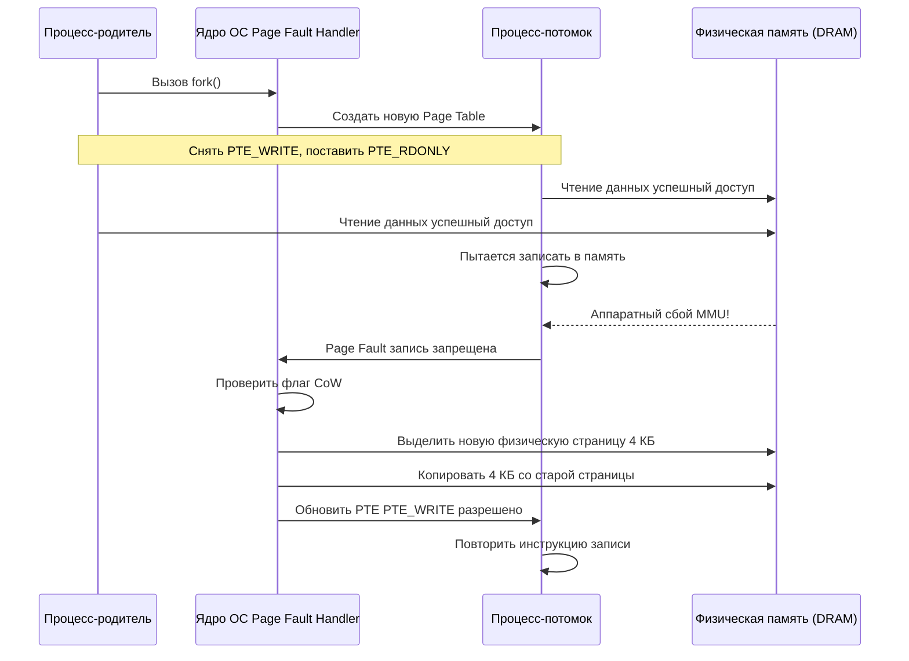

## Копирование по требованию: механизм Copy-On-Write

> *«Дублирование — враг эффективности. Самый остроумный способ скопировать тысячу страниц — не копировать их вовсе, пока кто-нибудь не возьмет в руки перо».*    
> — Фундаментальный принцип ленивых вычислений

В лекции [[6. Как Linux создает процессы. fork, exec, wait]] мы познакомились с классической моделью создания процессов в Unix через системный вызов `fork()`. 

Если бы операционная система реализовывала этот вызов «в лоб» — то есть физически выделяла новый блок оперативной памяти и побайтово копировала туда все содержимое адресного пространства родителя, — запуск любого процесса стоил бы $O(N)$ по времени и памяти. 

Представьте: ваш Go-сервис держит в памяти 16 ГБ кэша и решает запустить простую системную утилиту `uptime` через `os/exec`. Если бы ядро честно копировало 16 ГБ памяти, создание процесса занимало бы сотни миллисекунд, замораживало бы CPU и требовало дополнительных 16 ГБ свободной RAM на материнской плате. А через мгновение вызов `execve()` просто стер бы эти 16 ГБ в мусорную корзину!

Эту архитектурную дилемму разрешает механизм **Copy-On-Write (CoW, копирование при записи)**. Он позволяет создать точный клон процесса практически мгновенно (за доли микросекунды) и с **нулевым расходом дополнительной физической памяти**.

---

## Как работает CoW «под капотом»

Механизм Copy-On-Write — это шедевр совместной работы кремния процессора (MMU) и ядра операционной системы Linux. 

Когда прикладная программа вызывает `fork()`, ядро (внутри функций `do_fork()` -> `copy_process()` -> `dup_mmap()`) совершает изящный маневр:

1. Выделяет новый дескриптор `task_struct` (описатель процесса) и регистрирует новый `PID`.
2. Дублирует **дерево виртуальной памяти (Page Table)** родителя, но **не копирует ни одного байта физических страниц в DRAM**.
3. В записях таблиц страниц (PTE — Page Table Entry) как родителя, так и потомка ядро выполняет модификацию флагов:
   - Снимает флаг `PTE_WRITE` (запрет на запись).
   - Устанавливает `PTE_RDONLY` (страница доступна только для чтения).
   - Инкрементирует счетчик ссылок (`page_ref_inc`) в служебном дескрипторе физической страницы `struct page`.



Пока оба процесса только читают память, они бесконфликтно разделяют одни и те же кремниевые ячейки RAM с максимальной скоростью аппаратного кэша.

Но как только потомок (или родитель) выполняет инструкцию записи хотя бы одного байта, в дело вступает аппаратный блок MMU:
1. MMU видит флаг `PTE_RDONLY` и немедленно генерирует прерывание процессора — **Page Fault** (ошибка защиты страницы #PF).
2. Ядро перехватывает сбой в функции `do_page_fault()` -> `do_wp_page()`.
3. Ядро видит, что страница помечена как CoW, выделяет **ровно одну новую физическую страницу 4 КБ** из пула свободных страниц, копирует туда данные старой страницы, уменьшает счетчик ссылок у старой страницы и прописывает новый адрес в PTE пишущего процесса с флагом `PTE_WRITE`.
4. Процессор перезапускает команду записи. Теперь пишущий процесс меняет свою приватную копию, а соседний процесс продолжает читать оригинал!

> [!info] Под капотом
> В Linux флаг CoW для `fork` реализован через бит `PTE_SOFT_DIRTY` и внутреннюю логику `do_page_fault()`. Для `mmap()` с флагом `MAP_SHARED` используется аналогичный механизм, но с синхронизацией через семафор `mmap_sem` (в новых ядрах — `mmap_lock`). В современных ядрах активно используется подсистема `hugepages` (2M или 1G страницы), где CoW работает на уровне Huge TLB, что снижает оверхед на обновление PTE и TLB miss rate.

---

## Go-специфика: os/exec, память и многопоточность

В мире Go разработчики редко вызывают низкоуровневый `fork` вручную. Чаще всего мы сталкиваемся с ним неявно — при использовании пакета `os/exec` для запуска внешних бинарников и скриптов.

```go
package main

import (
	"fmt"
	"os/exec"
)

func main() {
	// Под капотом здесь происходит классический цикл:
	// 1. fork() -> CoW
	// 2. execve() -> замещение памяти
	// 3. wait() -> ожидание завершения
	cmd := exec.Command("sleep", "10")
	if err := cmd.Run(); err != nil {
		fmt.Println("Ошибка:", err)
	}
}
```

### Память после fork в Go: почему RSS и SHR одинаковы?

Если вы запустите мониторинг через утилиту `top` или `ps`, вы столкнетесь с удивительной картиной:
- У родительского и дочернего процессов отображается практически идентичный `RSS` (Resident Set Size).
- При этом столбец `SHR` (Shared Memory) у дочернего процесса будет в точности равен его `RSS`!

Это означает, что **физически оба процесса делят 100% оперативной памяти**. Никакого расхода RAM при старте подпроцесса не произошло. Только когда приложение или рантайм начнет активно писать в кучу, страницы начнут копироваться, и `RSS` пишущего процесса поползет вверх.

### Смертельная опасность: Многопоточный fork() в Go

В стандарте POSIX заложено жесткое правило: при вызове `fork()` в многопоточном процессе в дочерний процесс копируется **только один поток** — тот, который вызвал `fork()`. Все остальные потоки родителя мгновенно исчезают!

Представьте последствия для Go:
- Если в момент форка другой поток родителя удерживал внутренний `sync.Mutex` аллокатора кучи или рантайма, в дочернем процессе этот мьютекс навсегда останется заблокированным!
- Потока, который должен был его отпустить, больше не существует.
- Любая попытка дочернего процесса выделить память (`make`, конкатенация строк) приведет к вечному **deadlock**!

> [!warning] Ловушка / Gotcha: Архитектурное табу на голый fork
> **Железное правило:** Никогда не вызывайте системный вызов `fork()` в многопоточном Go-приложении, если не собираетесь мгновенно вызвать `execve()`!
> 
> Именно поэтому стандартная библиотека Go в пакете `os/exec` никогда не использует наивный `fork`. При вызове `cmd.Run()` или `cmd.Start()` рантайм вызывает ассемблерный системный вызов `syscall.ForkExec`, который в Linux использует системный вызов `clone` с флагами:
> `CLONE_VM | CLONE_VFORK | SIGCHLD` (без `CLONE_FILES`, чтобы потомок получил собственную копию таблицы дескрипторов для перенаправления stdin/stdout/stderr).
> 
> Флаг `CLONE_VFORK` замораживает родительский процесс до тех пор, пока потомок не вызовет `execve()`, полностью исключая дублирование страниц и гарантируя защиту от deadlock.
> Если вам всё же необходим `fork` с долгоживущим потомком (как в демонах PHP-FPM), вы обязаны вызвать `runtime.LockOSThread()` до форка и немедленно вызывать `exec`.

### Оптимизация безопасности через madvise(MADV_DONTFORK)

Если ваш сервис хранит в памяти конфиденциальные данные (криптографические мастер-ключи, токены сессий или гигантские неизменяемые кэши), вы можете запретить ядру копировать эти страницы дочерним процессам при `fork`.

Для этого используется системный вызов `madvise` с флагом `MADV_DONTFORK`:

```go
package main

import (
	"fmt"
	"os"
	"syscall"
	"unsafe"
)

func main() {
	// Выделяем память под приватный ключ шифрования
	buf := make([]byte, 1024)

	// Системный вызов madvise(MADV_DONTFORK) сообщает ядру Linux:
	// "Никогда не включай эти страницы в CoW-копирование при fork!"
	if err := syscall.Madvise(
		unsafe.Pointer(&buf[0]),
		len(buf),
		syscall.MADV_DONTFORK,
	); err != nil {
		fmt.Println("Ошибка madvise:", err)
	}

	_ = os.WriteFile("/dev/null", buf, 0600)
}
```

Флаг `MADV_DONTFORK` гарантирует, что дочерний процесс не унаследует доступ к этой памяти в своих таблицах страниц. При попытке потомка прочитать эти адреса ядро сгенерирует `SIGSEGV`, надежно защищая секреты родителя от утечки.

---

## Ловушки и вопросы на собеседованиях

### 1. В чем разница между RSS и SHR после fork? Почему они одинаковы?
`RSS` отражает суммарный объем физической памяти, используемый процессором. `SHR` показывает, какая часть этой памяти разделяется с другими процессами. Сразу после `fork` таблицы страниц потомка ссылаются на те же самые физические фреймы родителя, поэтому `SHR == RSS`. Это высшее доказательство эффективности механизма CoW.

### 2. Как передать терабайты данных от родителя к потомку без копирования?
Использовать системные механизмы разделяемой памяти: каналы `pipe()` или сокетные пары `socketpair()`. Данные буферизуются в кольцевых буферах ядра, а потомок считывает их напрямую, исключая избыточное копирование пользовательской памяти.

### 3. Что такое vfork() и почему он исторически опасен?
Исторический системный вызов `vfork()` создавал процесс без копирования таблиц страниц: потомок исполнялся **в том же самом адресном пространстве**, что и родитель, а родитель приостанавливался до вызова потомком `exec()` или `exit()`. 
*Опасность:* Любая запись в переменную внутри потомка физически меняла память родителя! Ошибка в потомке разрушала стек родительского процесса. В языке Go используется `syscall.ForkExec`, который внутри ядра Linux вызывает ассемблерный системный вызов `clone()` с флагами `CLONE_VM | CLONE_VFORK | SIGCHLD`, безопасно выполняя перенаправление дескрипторов и переходя к `execve` без дублирования страниц памяти.

### 4. Как Go runtime обрабатывает fork в контексте сборщика мусора (GC)?
При вызове `fork` рантайм Go не останавливает фоновый сборщик мусора в потомке. Если потомок не вызывает `execve()`, а продолжает работать, сборщик мусора начнет сканировать кучу. При сканировании первой же страницы GC попытается записать биты маркировки, что спровоцирует лавинообразный шквал CoW Page Faults, мгновенно раздувая физическую память потомка и сводя на нет всю экономию CoW!

### 5. Сравнение с другими языками:
- **C/C++:** Связка `fork()` + `exec()` остается классическим стандартом POSIX. Для оптимизации используется функция `posix_spawn()`, объединяющая обе операции в один системный вызов ядра и исключающая CoW-накладные расходы.
- **Java:** Метод `ProcessBuilder.start()` под капотом вызывает нативные системные вызовы. Исторически JVM страдала от `fork`, так как многопоточная среда HotSpot (потоки компилятора C2, GC воркеры) делала вызов опасным. В современных версиях Java (Java 9+) появились интерфейс `ProcessHandle` и нативная поддержка `posix_spawn()`.
- **PHP-FPM:** Идеальный пример архитектуры на базе CoW. Мастер-процесс загружает все расширения PHP и байт-код скриптов в память, а затем делает `fork` на каждый рабочий пул. Воркеры обрабатывают входящие запросы, разделяя общую неизменяемую память движка.

---

## Итог

1. **Copy-On-Write (CoW)** — фундаментальный инженерный компромисс операционных систем: создание процесса происходит за доли микросекунды, а реальное выделение памяти откладывается до момента первой записи.
2. Механизм опирается на флаги защиты `PTE_RDONLY` и аппаратные прерывания **Page Fault** блока процессора MMU.
3. В языке Go вызов `os/exec` благодаря CoW и флагам `CLONE_VFORK` не вызывает скачков расхода оперативной памяти.
4. **Многопоточный `fork()` без немедленного `exec()` смертельно опасен в Go** из-за неизбежных дедлоков мьютексов рантайма.
5. Системный вызов `madvise(MADV_DONTFORK)` — мощный инструмент защиты секретных ключей и криптографических буферов от утечки в дочерние подпроцессы.

Мы разобрались, как ядро защищает память при создании процессов. Но что происходит, когда физическая оперативная память сервера подходит к концу? Как операционная система решает, кого выселить на диск, а кого оставить в RAM? В следующей статье мы разберем механизмы выживания ядра: [[17. Paging и Swapping]].
