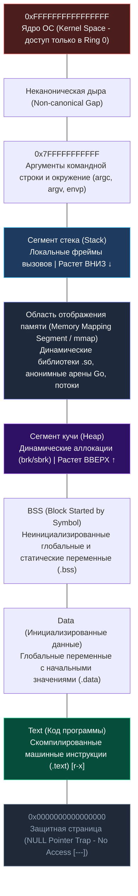
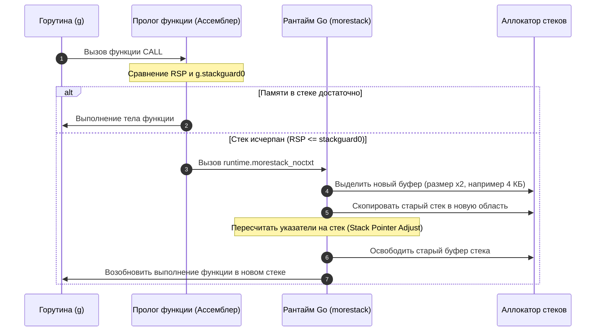
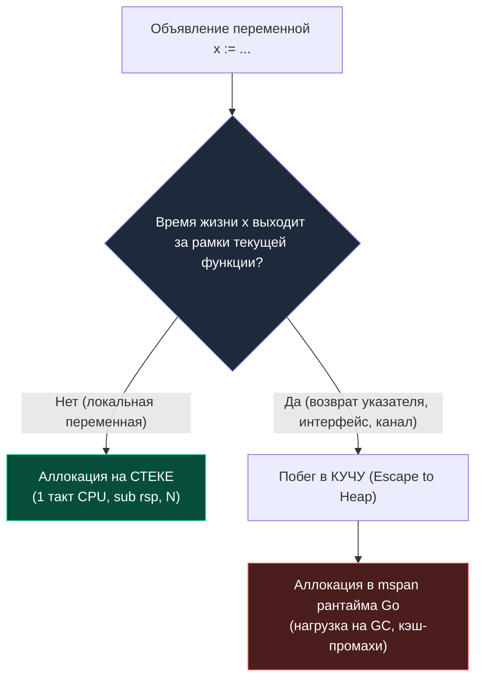

В архитектуре любого процесса Linux (и большинства современных Unix-подобных операционных систем) виртуальное адресное пространство не представляет собой бесформенную кучу байтов. Напротив, оно строго организовано в логические области, которые исторически называют **сегментами памяти** (memory segments).

Для прикладного программиста и бэкенд-инженера знание этой карты — не отвлеченная академическая теория. Расположение и поведение сегментов определяет буквально всё: сколько наносекунд занимает создание локальной переменной, почему возврат указателя из функции заставляет компилятор обращаться к сборщику мусора, почему 10 000 системных потоков убьют сервер по памяти, а 100 000 горутин Go поместятся в пару сотен мегабайт, и почему фоновый процесс сброса памяти `madvise` спасает сервис от падения в объятия Linux OOM Killer.

---

## 🗺️ 1. Анатомия виртуального адресного пространства процесса

Когда ядро Linux через системные вызовы `fork` и `execve` дает жизнь новому процессу, процессор переключает регистр `CR3` на свежую четырехуровневую (или пятиуровневую) таблицу страниц. Процесс получает в единоличное владение плоское **виртуальное адресное пространство**.

В современных 64-битных архитектурах x86-64 канонический диапазон адресов использует нижние 48 бит (256 ТБ). Это пространство разделено пополам: верхние 128 ТБ зарезервированы под пространство ядра (Kernel Space), а нижние 128 ТБ (диапазон от `0x0000000000000000` до `0x00007FFFFFFFFFFF`) отданы пользовательскому процессу (User Space).

Внутри этого пользовательского пространства сегменты выстроены в строгую иерархию:



> [!NOTE]
> **ASLR (Address Space Layout Randomization):** В реальных современных системах адреса сегментов не привязаны намертво к одним и тем же константам. В целях безопасности ядро Linux случайным образом смещает базовые адреса стека, кучи, `mmap` и исполняемого кода при каждом запуске, чтобы злоумышленник не мог воспользоваться фиксированными адресами для атак типа buffer overflow и ROP-цепочек (Return-Oriented Programming).

---

## 🔬 2. Классические сегменты памяти ELF-бинарника

Давайте разберем назначение каждого этажа этой виртуальной башни, двигаясь от низких адресов к высоким.

### 0x0: Защитная страница от разыменования NULL
Самая нижняя страница виртуальной памяти (обычно первые 4–64 КБ, начиная с адреса `0x0`) намеренно лишена каких-либо прав доступа (`PROT_NONE`). 
Если программист на C или Go пытается разыменовать `nil`-указатель (например, прочитать поле структуры по смещению `0x8` от нулевого базового адреса), процессор немедленно генерирует Page Fault, а ядро присылает процессу сигнал `SIGSEGV` (Segmentation Fault). В Go рантайм перехватывает этот сигнал и превращает его в понятную панику `runtime error: invalid memory address or nil pointer dereference`.

### 1. Text (Code Segment — `.text`)
Содержит скомпилированный машинный код программы: бинарные инструкции для процессора.
*   **Права доступа:** Read-Only + Execute (`r-x`). Запись сюда запрещена на аппаратном уровне через флаг таблицы страниц. Попытка модифицировать собственный код на лету немедленно карается аварийным завершением.
*   **Механика кэширования:** Процессор загружает инструкции из этого сегмента напрямую в аппаратный кэш инструкций L1i (Instruction Cache).
*   **Экономия физической памяти:** Так как сегмент Text неизменяем, ядро Linux может смапить одни и те же физические страницы памяти в виртуальное пространство десятков запущенных экземпляров одной и той же программы (например, сотен воркеров Nginx или микросервисов).
*   **Go-специфика:** В отличие от JVM или платформы .NET, Go по умолчанию не использует JIT-компиляцию в рантайме. Вся программа компилируется в нативный машинный код заранее (AOT — Ahead-of-Time). Поэтому весь исполняемый код Go и скомпилированные функции стандартной библиотеки лежат в фиксированном сегменте Text.

### 2. Data и BSS (Сегменты глобальных состояний)
Глобальные переменные и пакетные переменные верхнего уровня разделяются на две категории:
*   **Сегмент Data (`.data`):** Инициализированные глобальные и статические переменные (например, `var counter int = 42` или строковые литералы). Эти начальные значения хранятся прямо внутри исполняемого ELF-файла на диске и загружаются ядром в память при старте. Флаги доступа: Read-Write (`rw-`).
*   **Сегмент BSS (`.bss` — исторически «Block Started by Symbol»):** Неинициализированные или инициализированные нулями глобальные переменные (например, массив `var buffer [1024*1024]byte`). 
    *   *Инженерная хитрость:* Хранить мегабайты нулей внутри файла на диске расточительно. Поэтому в ELF-файле BSS представлен только числом — размером требуемой памяти. При запуске ядро выделяет под них физическую память сразу при старте процесса, заполняя её нулями (или отдавая страницы, отображенные на специальную zero page ядра по механизму Copy-On-Write). Это кардинально экономит место в исполняемом файле на диске.
*   **Механика границ:** Сегменты Data и BSS находятся рядом, но обычно разделены границей страницы для точной настройки флагов доступа (Data = RW, BSS = RW).

### 3. Heap (Классическая куча)
Куча — это динамически растущая область для распределения памяти во время работы программы (runtime allocation), когда размер или время жизни данных нельзя определить на этапе компиляции.
*   **Классический механизм C/C++:** В традиционных программах куча начинается сразу за BSS и растет **вверх** (в сторону высоких адресов). Управление границей кучи осуществляется через системный вызов `brk` или `sbrk`, который смещает указатель вершины кучи процесса — так называемый **Program Break**.
*   **Механика страниц:** Память выделяется страницами. Если процесс запрашивает блок больше страницы, ядро делает `mmap` (Private Anonymous Mapping).
*   **Ловушка Program Break (Gotcha):** В C/C++ стандартный аллокатор `malloc` часто использует `brk` для мелких аллокаций. Это означает, что `brk` растет вверх, и освободить память в середине кучи без фрагментации или явного `mmap` невозможно. Если вы выделили 100 МБ, освободили первые 99 МБ, но удерживаете последний килобайт на самом верху кучи, Program Break нельзя сдвинуть вниз, и все 100 МБ останутся занятыми в виртуальной памяти процесса!

### 4. Stack (Стек вызовов потока)
Область для локальных переменных, аргументов функций и кадров вызовов.
*   **Механика направления:** В архитектурах x86 и ARM стек традиционно растет **вниз** (от высоких адресов к низким). Вершина стека хранится в аппаратном регистре процессора `RSP` (Stack Pointer).
*   **Размер в Linux:** Для главного потока процесса размер стека ограничен системным лимитом ядра (по умолчанию в Linux выделяется 8 МБ на тред, что проверяется и настраивается через команду `ulimit -s`). Для вторичных потоков (`pthread_create`) размер стека задается при создании (обычно от 2 до 8 МБ).
*   **Стек кадра:** Каждый вызов функции создает новый фрейм. Указатель кадра (`RBP` в x86-64) и указатель стека (`RSP`) отслеживаются процессором аппаратно.
*   **Ограничения:** Если глубина рекурсии превышает выделенные 8 МБ, указатель стека врезается в неразмеченную область (Guard Page). При переполнении генерируется `SIGSEGV` (Segmentation Fault), и операционная система аварийно завершает весь процесс.

---

## 🚀 3. Революция Go: Runtime, Mmap-арены и динамические стеки

Разработчики языка Go кардинально переосмыслили классическую модель управления памятью операционной системы Unix. Это архитектурное решение стало фундаментом феноменальной легковесности горутин и высокой производительности Go в сетевом бэкенде.

### Heap Go: полный отказ от brk в пользу mmap
Go-рантайм **не использует `brk`** для выделения heap-памяти. Почему? Системный вызов `brk` фундаментально однопоточен (он управляет одним глобальным скалярным указателем для всего процесса) и не позволяет возвращать «дыры» памяти операционной системе.

Вместо этого Go распределяет память исключительно через `mmap` (анонимные приватные отображения `MAP_ANON | MAP_PRIVATE`). На 64-битных системах рантайм резервирует под кучу колоссальный непрерывный диапазон виртуального адресного пространства (арены размером по 64 МБ, объединенные в структуру `mheap`).

При этом физическая память (RAM) не расходуется сразу: страницы виртуальной памяти коммитятся ядром только тогда, когда горутина впервые пишет в них данные.

```go
package main

import (
	"fmt"
	"runtime"
)

func main() {
	// Принудительно инициализируем runtime, чтобы увидеть статистику
	runtime.GC()
	var m runtime.MemStats
	runtime.ReadMemStats(&m)
	
	fmt.Printf("HeapAlloc: %d KB
", m.HeapAlloc/1024)
	fmt.Printf("HeapSys:   %d KB
", m.HeapSys/1024)
	fmt.Printf("HeapInuse: %d KB
", m.HeapInuse/1024)
}
```

*   `HeapSys` — суммарный объем виртуальной памяти, запрошенной рантаймом у ядра ОС через `mmap`.
*   `HeapInuse` — объем виртуальной памяти в активных страницах (`mspan`), где сейчас размещены живые или ожидающие сборки объекты.
*   `HeapAlloc` — байты, реально занятые живыми объектами программы под управлением сборщика мусора (включая метаданные span'ов).

Такой подход позволяет Go:
1.  Выделять огромные виртуальные пространства без риска исчерпания физической RAM.
2.  Возвращать физические страницы ядру ОС через `madvise(MADV_DONTNEED)` в цикле скравинга (scavenger), сохраняя виртуальное адресное пространство.
3.  Управлять памятью на уровне страниц и `span`'ов, минуя накладные расходы glibc malloc.

### Goroutine Stacks: Динамический непрерывный стек (2 КБ вместо 8 МБ)
Если бы Go выделял на каждую горутину стандартный стек потока Linux (8 МБ), то миллион горутин потребовал бы 8 терабайт оперативной памяти, что сделало бы конкурентность уровня C10K/C1000K невозможной.

Вместо фиксированных стеков ОС, стек горутины в Go устроен совершенно иначе:
1.  Создается размером всего **2 КБ** (в старых версиях Go 1.2 было 4–8 КБ, но с появлением непрерывных стеков в Go 1.4 размер снизили до 2 КБ).
2.  Хранится в пулах стеков рантайма (аллоцируется из специализированных span'ов рантайма).
3.  Автоматически удваивается при нехватке места в прологе функции (через проверку стека и `runtime.morestack`), а сжимается **во время сборки мусора (GC)**, если используется менее 1/4 емкости (чтобы избежать постоянного перевыделения туда-обратно).
4.  Имеет защиту от переполнения на уровне проверок рантайма.



> [!info] Под капотом
> Структура стека горутины в рантайме: `g.stack`, `g.stackguard0`, `g.stackguard1`. При переполнении вызывается `runtime.morestack_noctxt`, который делает `mmap` новой страницы, копирует текущий стек в новую область и обновляет `g.stack`. Это дорого, поэтому Go-разработчики стараются минимизировать рекурсию и большие локальные массивы в горутинах.

Во время сборки мусора (GC) рантайм анализирует глубину использования стека горутины: если горутина использовала много памяти во время тяжелой обработки, а затем освободила ее, рантайм Go может **сжать стек вдвое**, возвращая память обратно в пул аллокатора.

---

## ⚡ 4. Mechanical Sympathy: Аппаратная эффективность и кэши CPU

Знание того, в каком сегменте и как располагаются байты программы, позволяет инженеру писать код, который работает в полной гармонии с кэш-линиями и конвейером процессора.

### 1. Выравнивание структур и False Sharing кэш-линий
Процессор обменивается данными с оперативной памятью не отдельными байтами, а блоками фиксированного размера — **кэш-линиями по 64 байта** (Cache Line). Если структура данных пересекает границу кэш-линии, процессор вынужден делать два чтения/записи. В конкурентном Go-коде это критично для `sync.Mutex` и атомарных операций:

```go
type Counter struct {
    val int64
    pad [56]byte // Избегаем false sharing с соседним полем
}
```

Без `pad` два `Counter` в слайсе могут лежать в одной кэш-линии. Обновление одного инкрементирует кэш-линию для обоих, вызывая сбой кэша на другом ядре (cache invalidation). Процессорные ядра будут непрерывно сбрасывать L1/L2 кэши друг друга по протоколу MESI (эффект ложного разделения памяти — False Sharing), замедляя программу в десятки раз.

### 2. Escape Analysis: Stack против Heap
Компилятор Go выполняет статический анализ времени жизни переменных — **Escape Analysis (анализ побега)**:
*   **Stack:** Выделение = инкремент `RSP` (1 инструкция). Освобождение = декремент `RSP`. Очень быстро. Никаких блокировок, 100% локальность в горячем L1d кэше процессора.
*   **Heap:** Выделение = поиск в `mspan`, атомарные операции, потенциальная блокировка. Освобождение = отложенная сборка GC. Переменная в куче нагружает сборщик мусора, порождает барьеры записи (Write Barriers) и фрагментирует память.
*   **Escape:** Если переменная должна жить дольше выхода из функции (возврат указателя, замыкание, канал), она "убегает" в heap.



> [!warning] Ловушка / Gotcha
> Не доверяйте `make([]int, 1000000)` в цикле. Если слайс "убегает" в замыкание или возвращается, компилятор выделит его в heap. В горячем пути это создаст миллион аллокаций, нагружая GC. Используйте `sync.Pool` или заранее выделенные буферы.

### 3. TLB и fragmentation (фрагментация памяти)
Чем больше виртуальных страниц использует heap, тем чаще происходит **TLB miss** (Translation Lookaside Buffer miss). Процессор должен читать Page Table из RAM для маппинга виртуального адреса в физический. Go-аллокатор (mcentral/mheap) группирует объекты в `span`'ы по 64-512 КБ, чтобы минимизировать количество записей в Page Table и улучшить локальность.

---

## ⚙️ 5. Под капотом: Сравнение glibc malloc и аллокатора Go

Разница в подходах классических аллокаторов языка Си и рантайма Go наглядно иллюстрирует эволюцию архитектуры системного софта:

| Характеристика | Классический C/C++ (glibc malloc) | Go Runtime Allocator |
| :--- | :--- | :--- |
| **Источник памяти** | `brk/sbrk` (для мелких), `mmap` (для крупных) | Только `mmap` (Private Anonymous) |
| **Управление** | dlmalloc (first-fit, binning) | mspan (power-of-two sizing, free lists) |
| **Выделение** | Атомарные CAS, spinlocks, иногда syscall | `madvise`, `munmap`, атомарные операции в рантайме |
| **Освобождение** | `free()` (часто не возвращает OS, копит в bin'ах) | `madvise(MADV_DONTNEED)` / `munmap` при `sysmon` |

### Механизм фонового возврата памяти: sysmon и madvise
Go-рантайм использует фоновый горутину `sysmon`, которая каждые 10 мс-1с проверяет, есть ли свободная память в heap. Если да, он вызывает `madvise` с флагом `MADV_DONTNEED`, сообщая ядру, что страница больше не нужна физически. Ядро отменяет маппинг, но виртуальное адресное пространство остается занятым. При следующем запросе `mmap` возвращает тот же адрес, и ядро заново выделяет физическую страницу (zero page). Это экономит RAM в долгоживущих сервисах.

> [!tip] Собеседование
> **Вопрос:** Почему Go использует `mmap` для heap, а не `brk`, как glibc?
> **Ответ:** 
> 1. `brk` возвращает память ядру только при `sbrk(0) - old_brk`. Освободить середину heap невозможно без фрагментации. `mmap` позволяет точечно возвращать память через `munmap`.
> 2. `mmap` работает с виртуальной памятью, позволяя Go резервировать терабайты виртуального адресного пространства без риска OOM.
> 3. Упрощает конкурентный GC: рантайм может быстро аннотировать страницы, собирать их, и ядро не мешает конкурентным аллокаторам.
> 4. Избежает race condition'ов между `brk` и `mmap` в многопоточных программах (glibc malloc имеет внутренние мьютексы, Go их не нужен для heap).

---

## 🥊 6. Подводные камни и вопросы на собеседованиях

1. **Stack Overflow в Go vs C:** В C переполнение стека = `SIGSEGV` и падение процесса. В Go горутина получает новый стек через `mmap`, продолжает работу, но если общая память горутины превысит лимит (обычно ~1 ГБ виртуальной памяти на горуину), рантайм выбросит `fatal error: goroutine stack exceeds 1GB`.
2. **Как отладить утечку памяти?** Используйте `go tool pprof heap` или `memstats`. Если `HeapAlloc` растет, а `HeapInuse` стабилен, скорее всего, это `mmap`-подпись. Проверьте, не создает ли код бесконечные горутины или не держит ли ссылки в `sync.Pool`.
3. **Влияние `unsafe.Pointer` на память:** Использование `unsafe` для обхода аллокатора может привести к записям в guard page стека или пересечению границ `span`'ов, что вызовет panic или corruption памяти. Всегда проверяйте выравнивание через `unsafe.Alignof`.
4. **Сравнение с PHP/Java:** В PHP память скрипта полностью очищается после каждого запроса. В Java heap управляется JVM и часто использует `brk`/`mmap` гибридно. Go делает heap частью процесса на весь его жизненный цикл, что требует careful tuning GC (`GOGC`, `GOMEMLIMIT`), но дает zero-GC overhead для короткоживущих данных (stack).

---

## 🎯 Итог

Сегментация памяти процесса — это строгий контракт между компилятором, рантаймом и операционной системой:
1. **Text/Data/BSS** статичны и определены на этапе компиляции: Text хранит неизменяемый машинный код, Data — начальные значения глобальных переменных, а BSS выделяется ядром в виде чистых нулей.
2. **Heap** в Go — это огромная `mmap`-область, управляемая собственным аллокатором через `span`'ы, что дает контроль над фрагментацией и конкурентным GC.
3. **Stack** горутины динамичен (2KB -> grows), хранится в heap и защищен guard page.
4. **Mechanical Sympathy** требует внимания к выравнианию, локальности данных и стоимости аллокаций (stack vs heap).

Понимание этой карты позволяет писать код, который уважает кэш-линии процессора, минимизирует GC-паузы и корректно взаимодействует с системными вызовами. В следующей статье мы опустимся на уровень регистров процессора и разберем, как именно данные, аргументы и адреса возврата укладываются в кадр функции: `[[20. Стек вызовов и стек кадра функции]]`.
