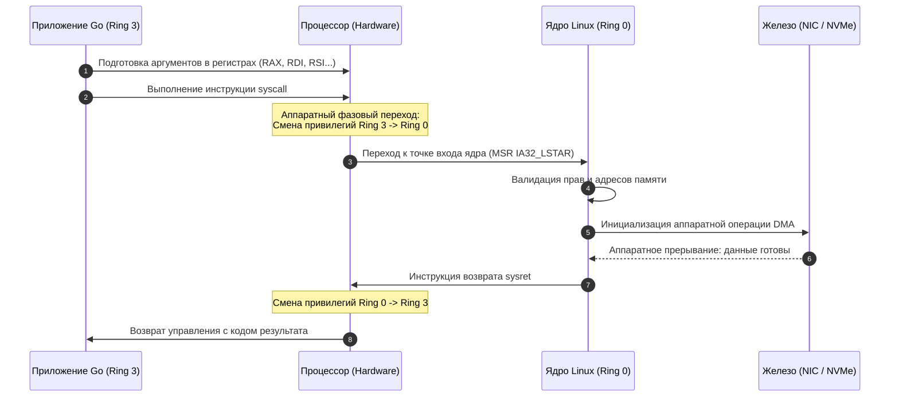

## Граница доверия: User Space и Kernel Space

В представлении обычного пользователя операционная система — это красивые окна рабочего стола, курсор мыши и набор полезных утилит в терминале. 

Для бэкенд-разработчика и системного инженера операционная система предстает в совершенно ином свете. Это **строгий, беспристрастный менеджер ресурсов** и **универсальный слой аппаратной абстракции**. Его главные обязанности — справедливо делить физические вычислительные узлы между сотнями независимых задач, изолировать процессы друг от друга и предоставлять контролируемые программные интерфейсы (API) для доступа к оборудованию.

Краеугольный камень надежности любой современной операционной системы — жесткое разделение адресного пространства памяти и процессорных привилегий на две непересекающиеся вселенные:

1. **User Space (Пространство пользователя)** — гражданская зона общего назначения. Здесь исполняются ваши Go-микросервисы, фоновые демоны, веб-серверы и базы данных. Любой код в пространстве пользователя функционирует в непривилегированном режиме с ограниченными правами.  
   Если в вашем коде случается критический сбой (например, необработанная паника `panic`, разыменование нулевого указателя `nil pointer dereference` или аппаратный segfault), операционная система мгновенно изолирует катастрофу и принудительно завершает только аварийный процесс. Остальная система продолжает работать как ни в чем не бывало.
2. **Kernel Space (Пространство ядра)** — закрытая святая святых, командный бункер операционной системы. Здесь исполняется монолитный код ядра Linux, планировщик задач, сетевые протоколы, виртуальная файловая система и драйверы физических устройств.  
   Ядру открыт абсолютный, ничем не ограниченный доступ ко всем физическим адресам оперативной памяти, системным регистрам CPU и контроллерам периферии. Ошибка или сбой в пространстве ядра фатальны: система падает в аварийную остановку — `kernel panic` в Linux или синий экран смерти («blue screen») в Windows.

Это фундаментальное разделение держится не на программных договоренностях, а на **аппаратной модели защиты памяти процессора**.

---

## Привилегии процессора: От Ring 0 до Ring 3

Физический кремний процессора спроектирован так, чтобы защищать ядро от прикладных программ на аппаратном уровне.

В архитектуре x86/x64 эта защита реализована в виде иерархических колец привилегий (**Protection Rings**):
* **Ring 0 (Ядро)**: Максимальный, неограниченный уровень привилегий. Только код в Ring 0 имеет право выполнять привилегированные инструкции процессора: изменять регистры управления памятью `CR0/CR3/CR4`, манипулировать таблицами страниц `MMU`, включать и отключать аппаратные прерывания (`CLI/STI`) и обращаться к портам ввода-вывода.
* **Ring 1 и Ring 2**: Исторически резервировались создателями архитектуры для драйверов устройств и системных служб. В современных операционных системах общего назначения (Linux, Windows, macOS) эти кольца не используются ради упрощения и производительности.
* **Ring 3 (Пользователь)**: Минимальный, сильно урезанный уровень привилегий. Все прикладные программы (ваш бинарник `main.go`, реверс-прокси `nginx`, реляционная база `postgres`) исполняются исключительно в кольце Ring 3. Любая попытка выполнить привилегированную инструкцию из Ring 3 немедленно пресекается процессором через исключение общей защиты (General Protection Fault, `#GP`).

В процессорах с архитектурой ARM (активно вытесняющей x86 в облачных серверах — от AWS Graviton до Apple Silicon) та же самая защитная концепция носит название **Exception Levels (EL)**:
* `EL0` — пространство непривилегированных пользовательских приложений (**User Space**);
* `EL1` — пространство операционной системы и ядра (**Kernel**);
* `EL2` — уровень аппаратного гипервизора виртуализации (KVM, Xen);
* `EL3` — уровень монитора безопасности микропрограмм (Secure Monitor / TrustZone).

```
КОЛЬЦА ЗАЩИТЫ x86-64:
  +-------------------------------------------------------+
  | Ring 3: User Space (main.go, nginx, postgres)         |  <-- Без прямого доступа к железу
  |   +-------------------------------------------------+ |
  |   | Ring 1, 2: (Не используются в Linux / Windows)  | |
  |   |   +-------------------------------------------+ | |
  |   |   | Ring 0: Kernel Space                      | | |  <-- Прямой доступ к памяти,
  |   |   | (Ядро Linux, Драйверы, Планировщик, VFS)  | | |      MMU, прерываниям и портам
  |   |   +-------------------------------------------+ | |
  |   +-------------------------------------------------+ |
  +-------------------------------------------------------+
```

> [!info] Под капотом
> В языке Go нет понятий «класс» или классического наследования реализации, как в C++ или Java, однако внутренняя модель памяти процесса в Go полностью наследует сегментную архитектуру операционной системы.  
> Когда вы запускаете `go run main.go`, ядро Linux через виртуальную память выделяет процессу изолированное адресное пространство, загружает скомпилированный машинный код в защищенный от записи сегмент `Text`, резервирует виртуальный сегмент кучи `Heap` через системный вызов `mmap`, а для инициализирующего потока выделяет системный `Stack`. Рантайм Go не придумывает свою вселенную памяти с нуля: он виртуозно управляет ресурсами внутри пространства, щедро выделенного ему ядром ОС.

---

## Как происходит переход: Механизмы взаимодействия

Поскольку код в пространстве пользователя аппаратно изолирован от физических устройств, он не способен самостоятельно отправить пакет в сетевой кабель или записать транзакцию на диск. 

Каждое взаимодействие с окружающим миром требует контролируемого перехода через границу привилегий — **User/Kernel Space Transition**.

Существует ровно три архитектурных механизма, позволяющих пересечь эту границу:

1. **Системные вызовы (Syscalls)**: Синхронный, осознанный запрос со стороны пользовательской программы к ядру операционной системы с просьбой выполнить привилегированное действие (открыть файл, выделить память, передать данные в сокет). Это главный инструмент бэкенд-разработки.
2. **Аппаратные прерывания (Interrupts)**: Асинхронные электрические импульсы от внешнего оборудования (сетевая карта приняла кадр, таймер отсчитал квант времени, диск завершил чтение). Процессор прерывает выполнение прикладного кода и передает управление специальному обработчику прерываний в ядре (**ISR — Interrupt Service Routine**).
3. **Сигналы ядра и исключения (Signals & Exceptions)**: Аппаратные исключения процессора (деление на ноль, невалидный адрес страницы памяти) или системные уведомления от ядра к процессу (например, `SIGKILL` для немедленного уничтожения, `SIGUSR1` для переоткрытия логов, `SIGPIPE` при записи в закрытый сетевой сокет).



---

## Go-рантайм на границе ядра и пользователя

В мире языков C и C++ подавляющее большинство программ компилируются с динамической линковкой к стандартной библиотеке языка Си — **GNU C Library (`glibc`)**. Системные вызовы вроде `open()`, `read()` или `malloc()` там не вызываются напрямую: они спрятаны за слоем библиотечных функций-оберток glibc.

Go пошел по принципиально иному, бескомпромиссному пути: **по умолчанию Go полностью отказывается от glibc и совершает системные вызовы напрямую к ядру Linux**!

### Почему Go избегает glibc?

1. **Истинная статическая сборка**: Библиотека `glibc` весит несколько мегабайт и жестко привязана к конкретной версии ядра на хосте. Попытка запустить C-бинарник, собранный на современном дистрибутиве, на старом сервере разобьется о знаменитую ошибку: `version GLIBC_2.34 not found`. Go-бинарник, собранный без cgo (`CGO_ENABLED=0`), полностью автономен: его можно скопировать в пустой Docker-образ `scratch`, и он запустится без единой системной библиотеки!
2. **Производительность и отсутствие лишних слоев**: Обертки `glibc` несут груз совместимости со стандартами POSIX 40-летней давности: проверки локали (`locale`), потокобезопасность через скрытые мьютексы, отладочные перехватчики и проверки `errno`. Рантайму Go всё это не нужно: он обращается к ядру кратчайшим путем.
3. **Кроссплатформенность и переносимость**: Go легко компилируется под Linux (musl, uclibc), FreeBSD, OpenBSD, NetBSD, macOS и Windows. Независимость от glibc гарантирует идентичное поведение рантайма везде.

### Как Go делает syscalls?

Для прямого общения с ядром Go использует внутренние ассемблерные функции рантайма и низкоуровневый пакет `golang.org/x/sys/unix`.

На архитектуре x86-64 рантайм загружает номер нужного системного вызова в регистр `RAX`, аргументы — в регистры `RDI`, `RSI`, `RDX`, `R10`, `R8`, `R9` и выполняет инструкцию `SYSCALL`:

```go
package main

import (
	"fmt"
	"unsafe"

	"golang.org/x/sys/unix"
)

func main() {
	path := "/etc/hosts\x00" // C-строка с нуль-терминатором
	pathPtr := unsafe.Pointer(unsafe.StringData(path))

	// syscall.Syscall (или unix.Syscall): выполняет инструкцию SYSCALL напрямую в ядро.
	// При ошибке возвращает стандартный тип error (преобразуя код ядра в errno).
	fd, _, err := unix.Syscall(
		unix.SYS_OPEN, 
		uintptr(pathPtr), 
		unix.O_RDONLY, 
		0,
	)
	if err != 0 {
		panic(fmt.Sprintf("Не удалось открыть файл: %v", err))
	}
	defer unix.Close(int(fd))

	fmt.Printf("Файл успешно открыт через системный вызов! Дескриптор: %d\n", fd)

	// syscall.RawSyscall (или unix.RawSyscall): вызывает syscall напрямую, БЕЗ уведомления планировщика Go.
	// Используется внутри runtime для критически быстрых неблокирующих вызовов (getpid).
	// В обычном пользовательском коде использовать RawSyscall категорически не рекомендуется!
	pid, _, _ := unix.RawSyscall(unix.SYS_GETPID, 0, 0, 0)
	fmt.Printf("Текущий PID процесса: %d\n", pid)
}
```

> [!warning] Ловушка / Gotcha
> **Syscall vs RawSyscall**:  
> Вызов `unix.Syscall` перед выполнением инструкции ядра уведомляет рантайм Go (вызывая `entersyscall`). Если системный вызов заблокируется, рантайм сможет спасти процессор `P` и передать его другому треду `M`.  
> Вызов `unix.RawSyscall` выполняется без входа в рантайм. Он возвращает кортеж из трех чисел: `(r1, r2, err uintptr)`. Если операция завершилась ошибкой, ядро Linux возвращает отрицательное число, которое транслируется в третий аргумент `err` как тип `uintptr(-1)`.  
> Если вы по ошибке дернете блокирующий системный вызов (чтение сокета или диска) через `RawSyscall`, вы намертво заморозите системный тред `M` вместе с логическим процессором `P`, и все горутины в этой очереди встанут намертво!

---

## Mechanical Sympathy: Цена перехода

Переход между пространством пользователя (Ring 3) и пространством ядра (Ring 0) — одна из самых дорогостоящих операций в современной компьютерной архитектуре.

Что физически происходит внутри процессора при выполнении всего одной инструкции `SYSCALL`:

1. **Смена контекста (Context Switch)**: Процессор обязан атомарно сохранить пользовательские регистры (счетчик команд `PC/RIP`, указатель стека `RSP`, флаги состояний) и переключить стек на защищенный стек ядра в структуре `task_struct` (в Linux) или дескрипторе системного треда `thread`.
2. **Сброс процессорного конвейера (Flush Pipeline)**: Современный суперскалярный конвейер инструкций (который мы изучали в первом модуле) вынужден сбросить все предварительно декодированные и спекулятивно вычисленные инструкции. Конвейер замирает и начинает наполняться с нуля.
3. **TLB Shootdown и сброс трансляций**: Защита от печально известных микроархитектурных уязвимостей процессоров (**Spectre/Meltdown mitigation**, в частности технология изоляции таблиц страниц ядра **KPTI — Kernel Page Table Isolation**) заставляет процессор принудительно перезагружать регистр `CR3` при каждом входе в ядро. Это приводит к массовому сбросу кэша трансляции адресов (`TLB miss`) и последующему медленному проходу по 4-уровневым таблицам страниц в оперативной памяти (**Page Walk**).
4. **Инвалидация и вымывание кэшей (Cache Invalidation)**: Данные ядра вытесняют пользовательские структуры данных из сверхбыстрых кэшей `L1` и `L2`.

**Суровый инженерный итог**: Одиночный системный вызов обходится процессору в **сотни и тысячи тактов CPU** (от 100 до 500 наносекунд реального времени). 

Если ваш веб-сервер обрабатывает 50 000 RPS и при этом на каждый запрос совершает по 20 неоптимальных системных вызовов, процессор потратит свыше 50% всей своей мощности исключительно на холостые фазовые переходы между Ring 3 и Ring 0!

---

## Ловушки и вопросы с собеседований

> [!tip] Собеседование
> **Вопрос:** Почему утилита `top` или `htop` на сервере часто показывает объем памяти Go-приложения значительно больший (или меньший), чем цифры аллокаций внутри самого Go через `runtime.ReadMemStats`?
> **Ответ:** Рантайм Go управляет памятью через виртуальные страницы ядра операционной системы с помощью системных вызовов `mmap` и `madvise`:
> 1. Утилита `top` отображает показатель **RSS (Resident Set Size)** — объем физических страниц RAM, реально выделенных ядром для процесса в таблицах страниц MMU.
> 2. Аллокатор Go заранее бронирует гигантские виртуальные адресные пространства (`Virtual Memory`, VIRT) через `mmap(PROT_NONE)`. Физическая память при этом не расходуется до первого обращения (Page Fault).
> 3. Когда сборщик мусора Go (GC) освобождает память, он не возвращает ее ядру через медленный `munmap`. Вместо этого фоновый процесс очистки (scavenger) сообщает ядру через `madvise(MADV_DONTNEED)`, что эти страницы больше не нужны (в Linux `MADV_DONTNEED` освобождает физические фреймы сразу, являясь поведением по умолчанию с Go 1.16). Задержка падения RSS обусловлена тем, что рантайм Go возвращает память ядру постепенно и сохраняет свободные spans для быстрого повторного использования.

> [!warning] Ловушка / Gotcha
> **Блокировка системных тредов в дисковых системных вызовах**:  
> Когда горутина совершает блокирующий ввод-вывод (например, чтение обычного файла через `os.ReadFile`), ядро Linux погружает в сон весь системный поток `M`.  
> Если таких горутин тысячи, демон `sysmon` будет создавать новые потоки ядра `M` для спасения логических процессоров `P`. Если число тредов превысит лимит (по умолчанию 10 000), приложение немедленно рухнет с критической ошибкой рантайма. Для сети Go использует элегантный неблокирующий поллер `netpoller` (`epoll/kqueue`), но для файлов на диске вы обязаны самостоятельно ограничивать параллелизм пулом воркеров.

### Типичные вопросы на эту тему:
1. **Чем `syscall.Syscall` (или `unix.Syscall`) принципиально отличается от `syscall.RawSyscall` (или `unix.RawSyscall`)?**  
   *Ответ:* `syscall.Syscall` уведомляет планировщик Go через `entersyscall`/`exitsyscall`, позволяя спасти логический процессор `P`, в то время как `syscall.RawSyscall` выполняет инструкцию напрямую, блокируя поток целиком.
2. **Что происходит с процессорным конвейером и кэшами при переходе в Ring 0?**  
   *Ответ:* Происходит сброс суперскалярного конвейера (`Flush Pipeline`), сброс предсказателя переходов и частичная инвалидация буфера `TLB` из-за защитных механизмов KPTI.
3. **Почему Go не связывается с `glibc` по умолчанию?**  
   *Ответ:* Ради абсолютной статической компиляции, устранения зависимости от версий библиотек на хосте, ускорения вызовов и легкой кросс-компиляции.
4. **Какими аппаратными средствами процессор изолирует пользовательский процесс от ядра?**  
   *Ответ:* Кольцами защиты процессора (Protection Rings 0/3 или EL0/EL1), блоком управления памятью MMU и таблицами страниц (Page Tables) с битами контроля доступа User/Supervisor.
5. **Зачем в промышленной разработке нужен пакет `golang.org/x/sys/unix`?**  
   *Ответ:* Стандартный пакет `syscall` в Go зафиксирован и объявлен замороженным ради обратной совместимости. Пакет `golang.org/x/sys/unix` активно развивается и предоставляет доступ ко всем современным системным вызовам и флагам ядра Linux (включая `io_uring`, `epoll_pwait2`, `pidfd` и настройки сокетов).

---

## Итог

Подведем инженерные итоги нашего знакомства с разделением пространств:

1. **User/Kernel Space** — фундаментальная архитектурная граница, защищающая устойчивость всей системы. Пересечение этой границы стоит реальных сотен тактов CPU.
2. **Аппаратные уровни защиты** (Ring 0 / Ring 3 в x86 и EL1 / EL0 в ARM) физически блокируют непривилегированному коду доступ к управляющим регистрам и прямому управлению оборудованием.
3. **Прямой диалог Go с ядром**: Go осознанно обходит стороной промежуточные библиотеки (`glibc`), транслируя системные вызовы напрямую в ядро Linux через ассемблерные переходы.
4. **Механическая симпатия к ядру**: Проектируя архитектуру бэкенда, всегда минимизируйте число системных вызовов через буферизацию пользовательского пространства (`bufio`), пакетную обработку (`Batching`) и неблокирующий ввод-вывод (`netpoller`).

Мы детально исследовали границу между прикладным кодом и операционной системой. Но как устроено само ядро по ту сторону баррикад? Какие архитектурные школы проектирования ядер существуют в компьютерном мире (монолитные ядра, микроядра, гибридные системы) и почему создатель Linux Линус Торвальдс так яростно отстаивал монолитный подход в знаменитом споре с Эндрю Таненбаумом?

В следующей лекции мы разберем анатомию ядер: [[3. Архитектура ядра. Monolithic, Microkernel, Hybrid]].