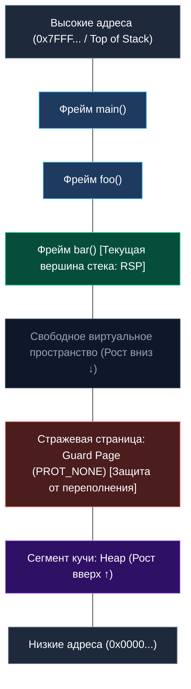
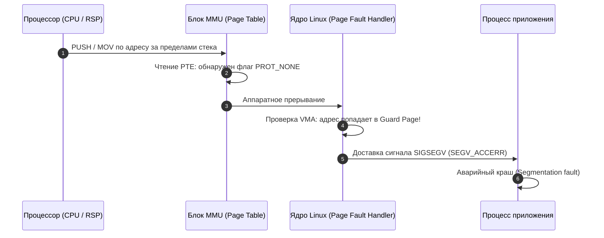
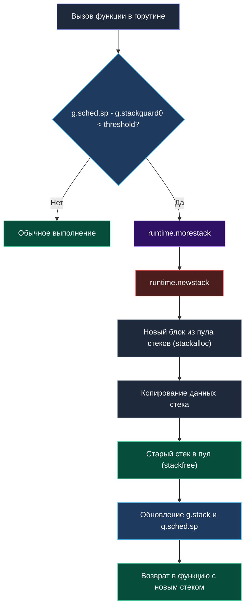

## Стек вызовов: фундамент исполнения

Стек (Call Stack) — это не просто «область для локальных переменных». Это фундаментальный механизм реализации вызовов функций, заложенный на уровне архитектуры процессора. При каждом вызове функции процессор сохраняет адрес возврата, состояние регистров и локальные данные в непрерывный блок памяти, управляемый специальным регистром: `RSP` (x86-64) или `SP` (ARM).

Важно понимать: стек растёт **вниз** по адресному пространству. Это историческое решение, позволяющее стеку и куче (Heap) развиваться навстречу друг другу, максимально эффективно используя виртуальную память процесса.



> [!info] Под капотом
> В Go состояние стека горутины хранится в структуре `runtime.g`. Ключевые поля:
> - `g.stack` — пара `[lo, hi]`, указывающая диапазон выделенной памяти стека.
> - `g.sched.sp` — текущий указатель стека (аналог `RSP`).
> - `g.stackguard0` — граница, при достижении которой runtime инициирует проверку размера стека.
> - `g.stackguard1` — используется внутри runtime для предотвращения рекурсивных вызовов `newstack`.

---

## Механизм защиты памяти: Guard Pages и Page Fault

ОС не доверяет программе управление собственным адресным пространством. Когда процесс создаётся, ядро выделяет стек в конце виртуального адресного пространства процесса. На самом краю (вниз по адресам) размещается **Guard Page** (стражевая страница).

Это страница, которая:
1. **Не имеет физической backing-памяти** (не отображена на RAM/swap).
2. Имеет права доступа `PROT_NONE` (ни чтение, ни запись, ни исполнение).

Что происходит, когда `g.sched.sp` приближается к guard page?

1. CPU выполняет инструкцию записи в память (`MOV`, `PUSH`, `CALL`).
2. MMU (Memory Management Unit) делает walk по Page Table (см. `[[13. Страницы памяти и Page Table.md]]`).
3. Находит PTE с флагом `PROT_NONE`.
4. Генерирует **Page Fault** (прерывание 14 в x86).
5. Ядро перехватывает исключение, проверяет, является ли страница guard page.
6. Если да — отправляет процессу сигнал `SIGSEGV` (или `SIGBUS` при аппаратных ошибках).
7. Если процесс не перехватывает сигнал, он аварийно завершается.



> [!warning] Ловушка / Gotcha
> Guard page защищает только от **чтения/записи за границу**. Она не защищает от бесконечной рекурсии, если стек ещё не достиг края. Именно поэтому в C/C++ `SIGSEGV` при переполнении стека часто ловится дефолтным обработчиком, который печатает `Segmentation fault`, но не говорит, что причина именно в рекурсии.

---

## Go runtime: Как язык «растягивает» стек динамически

В отличие от C++ или Java, где размер стека горутины/потока фиксирован при старте (обычно 1–8 МБ), Go использует технику **Split Stacks** (разделённые стеки, которые начиная с Go 1.4 были усовершенствованы до непрерывных динамически копируемых стеков). Это позволяет создавать миллионы горутин с минимальным потреблением памяти.

### Как работает динамический рост

1. **Инициализация:** Новая горутина получает стартовый стек размером `minStackSize` (обычно 2 КБ).
2. **Проверка перед вызовом:** При каждом вызове функции компилятор вставляет в пролог функции проверку стека: она сравнивает указатель стека `SP` с `g.stackguard0` (отдельной функции-проверки вроде `gostacksplit` в рантайме нет).
3. **Триггер роста:** Если расстояние меньше порога (например, 8 КБ), управление передаётся в `runtime.morestack`.
4. **Расширение:** `runtime.morestack` вызывает `runtime.newstack`:
   - Берёт новый блок из пулов стеков рантайма (`stackalloc`: `stackpool`/`stackcache`, а крупные стеки — из кучи рантайма). Отдельного `mmap` на каждое удвоение нет: память под кучу рантайма уже отображена заранее (см. `[[18. mmap. Отображение файлов и памяти.md]]`).
   - Копирует содержимое старого стека на новый (`copystack` копирует всегда) и поправляет указатели, которые вели внутрь стека.
   - Освобождает старый стек (`stackfree`): блок возвращается в пул стеков рантайма, а не отдаётся ядру через `madvise`. Физическую память ядру при необходимости возвращает уже фоновый scavenger, и позже.
   - Обновляет `g.stack`, `g.sched.sp` и сбрасывает `g.stackguard0`.
5. **Возврат:** рантайм возобновляет выполнение функции уже на новом стеке. (`gostartcall` к этому не относится: он используется при *создании* горутины, а не при росте стека.)



> [!tip] Собеседование
> **Вопрос:** Почему Go не использует фиксированный стек, как Java?
> **Ответ:** Фиксированный стек требует резервирования 1–8 МБ на поток. В распределённых системах это убивает масштабирование. Split stacks позволяют Go запускать миллионы горутин с общим потреблением памяти в сотни мегабайт, так как физическая память аллоцируется только при реальной записи, а освобождаются страницы через `MADV_DONTNEED`.

---

## Когда Go всё же падает с stack overflow

Несмотря на динамический рост, у стека есть предел: **жёсткий внутренний лимит рантайма Go** на максимальный размер стека одной горутины (`maxstacksize`: по умолчанию 1 ГБ на 64-битных системах и 250 МБ на 32-битных; меняется через `debug.SetMaxStack`). Это не `ulimit -v` и не `RLIMIT_AS`. Когда стек упирается в этот лимит, происходит:

```
fatal error: stack overflow
runtime stack:
runtime.throw(...)
runtime.newstack()
...
```

Это не обычная паника, а фатальная ошибка рантайма (`throw`): процесс завершается с кодом 2, и никакого `SIGSEGV` тут нет. В production это означает, что где-то в коде есть бесконечная рекурсия или аллокация гигантских структур в стеке.

У этой картины есть оговорка про контейнеры. Стек растёт удвоением, и при последнем удвоении (например, 256 → 512 МБ) нужно одновременно держать старый и новый блоки, то есть около 768 МБ. Если у контейнера или cgroup лимит памяти меньше (например, `MemoryMax=512M`), процесс будет убит `SIGKILL` (код 137) раньше, чем рантайм успеет напечатать `fatal error: stack overflow`, и в логе не останется ни строчки диагностики.

> [!warning] Ловушка / Gotcha
> **Коварная ошибка:** Аллокация больших массивов в стеке.
> ```go
> func process() {
>     // 100 МБ в стеке. При рекурсии или параллельных горутинах это мгновенно съест лимит.
>     buf := make([]byte, 100<<20) 
> }
> ```
> **Как лечить:** Всегда аллоцируйте большие буферы в куче (heap) явно:
> ```go
> func process() {
>     // make([]byte, 100<<20) аллоцирует на heap, размер не влияет на стек горутины
>     buf := make([]byte, 100<<20)
>     defer free(buf) // или используйте pool
> }
> ```
> *Примечание:* В Go вызов `make` с большим размером автоматически выносится Escape-анализом в кучу `(heap)`, но создание локальных структур фиксированного размера (`var arr [100<<20]byte`) пытается занять место прямо в стеке горутины, форсируя моментальный вызов `runtime.newstack` и приближая предел памяти.

---

## Сравнение подходов: C++, Java, PHP vs Go

| Язык/Среда | Управление стеком | Лимит по умолчанию | Поведение при переполнении |
|------------|-------------------|-------------------|----------------------------|
| **C/C++** | Фиксированный (компилятор/линкер) | 1–8 МБ (`ulimit -s`) | `SIGSEGV`, немедленный crash |
| **Java** | Фиксированный на поток (`-Xss`) | 1 МБ | `StackOverflowError` (перехватывается) |
| **PHP** | Фиксированный на процесс | 8 МБ (`memory_limit` не для стека) | `Segmentation fault` (PHP-FPM падает) |
| **Go** | Динамический (непрерывный стек, копируется при росте) | 1 ГБ на горутину (`maxstacksize`, `debug.SetMaxStack`) | `fatal error: stack overflow` (не `panic`, код выхода 2) |

Go жертвует небольшой накладной работой на копирование стека (выделение из пула + копирование) ради радикального снижения потребления памяти при высокой конкурентности.

---

## Практика и отладка

### Как отследить переполнение в production?
1. **pprof:** профиля `stack` в `net/http/pprof` нет. Стеки всех горутин покажет профиль `goroutine` (`/debug/pprof/goroutine?debug=2`).
2. **Метрики рантайма:** следите за `StackInuse` и `StackSys` в `runtime.MemStats`. Рост стека не виден как отдельный системный вызов (блоки берутся из пулов рантайма), поэтому `strace` здесь почти ничего не покажет.
3. **Глобальные лимиты:** В контейнерах или systemd стек ограничен не только `ulimit`, но и `LimitAS` или `MemoryMax` cgroups.

### `//go:nosplit`: это не защита от рекурсии
Директива `//go:nosplit` убирает из пролога функции проверку стека, а значит, такая функция не может вызвать рост стека. Вот пример, который *не* стоит повторять:

```go
//go:nosplit
func safeRecursive(n int) {
    if n == 0 {
        return
    }
    safeRecursive(n - 1)
}
```

Проверка роста стека в прологе не вставляется, поэтому `runtime.newstack` вызван не будет. Но защитой от рекурсии это не становится: линкер следит, чтобы цепочка `nosplit`-функций укладывалась в небольшой зарезервированный запас стека, и отвергает программу с ошибкой `nosplit stack over N byte limit`. Рекурсивная `nosplit`-функция из примера выше на линковке не пройдёт. Используйте `//go:nosplit` только в низкоуровневом коде вроде системных вызовов рантайма, где глубина вызовов известна заранее.

---

## Итог

1. **Стек** — это аппаратно-ориентированный механизм вызовов функций, растущий вниз по адресному пространству.
2. **Guard Page** — механизм ОС на уровне MMU, который превращает выход за границы стека в `Page Fault` → `SIGSEGV`.
3. **Go runtime** выращивает стек горутины копированием в новый блок из своих пулов; переполнение ловит проверка в прологе функции, а не MMU. Предел стека — внутренний лимит рантайма, и его превышение даёт `fatal error: stack overflow`.
4. **Лимит** стека горутины в Go — внутренний `maxstacksize` (1 ГБ на 64-битных системах, меняется `debug.SetMaxStack`), а не `ulimit -v`.
5. **Оптимизация:** Избегайте аллокации больших структур в стеке. Используйте `make` (heap) или `sync.Pool` для кэш-линий и часто создаваемых объектов.

В следующей статье мы детально разберем механизм системных вызовов: как именно программа просит ОС выделить ресурсы, выполнить I/O или управлять процессами. Разберем переход между Ring 3 и Ring 0, ABI, а также почему syscall в Go — это не просто `syscall.Syscall`. Читайте: `[[22. Системные вызовы. Как программа просит ОС что-то сделать.md]]`.
