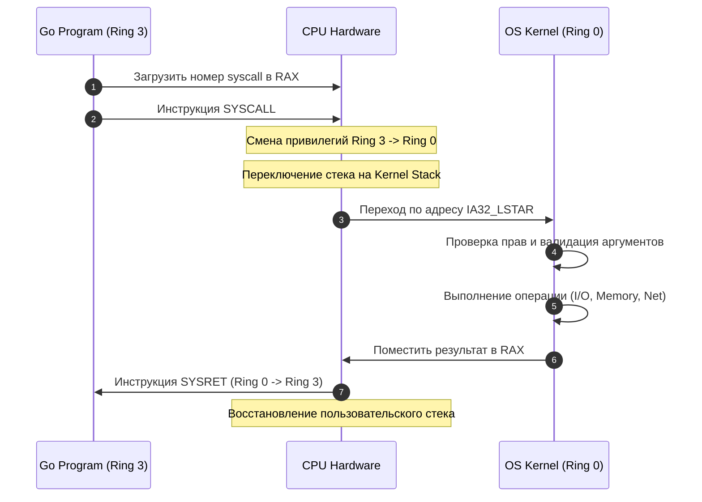
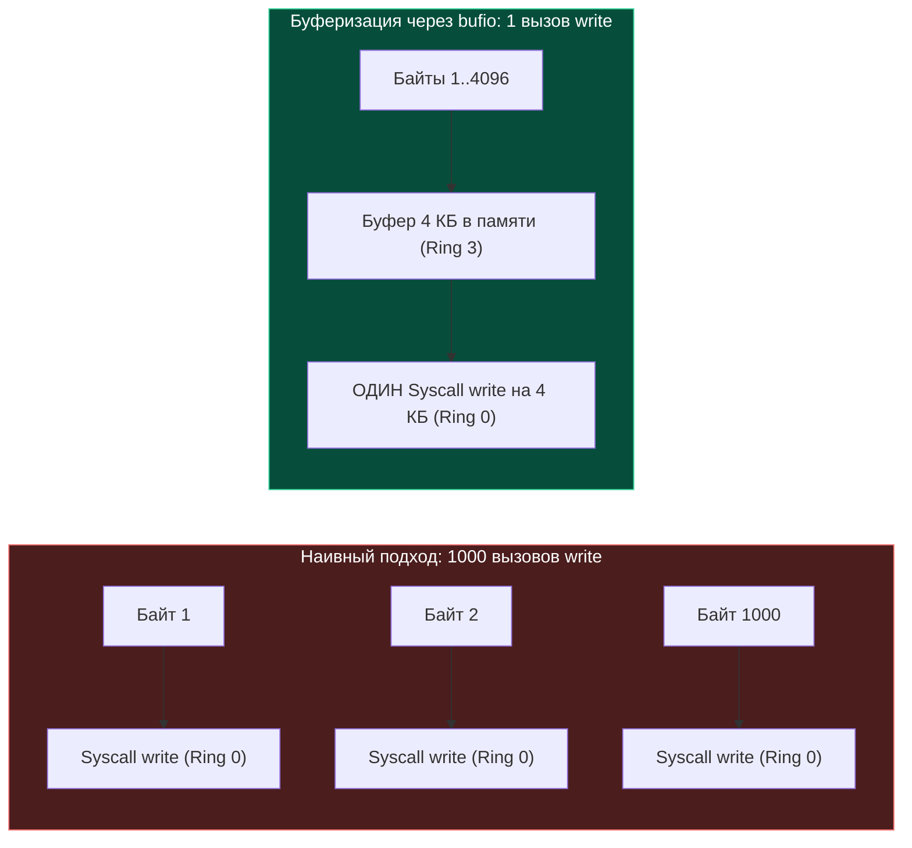

## Граница между User Space и Kernel Space

Ваша программа на Go исполняется в **User Space** (пространстве пользователя). В этом режиме процессор находится в состоянии с ограниченными правами (**Ring 3** в архитектуре x86-64). В этом режиме программе *запрещено* напрямую обращаться к железу: она не может сама отправить пакет в сеть, записать байт на диск или изменить таблицу страниц.

Если бы любая программа могла писать в любой сектор диска или менять права процессора, одна ошибка в коде или один уязвимый пакет уничтожили бы всю систему.

> *"Операционная система — это не просто библиотека полезных функций. Это строгий арбитр, отделенный от пользовательских программ железобетонной стеной аппаратных привилегий."*

Представьте банковское отделение с бронированным стеклом. Клиент (User Space, Ring 3) не может просто зайти в хранилище (Kernel Space, Ring 0) и взять пачку банкнот. Он подходит к окошку кассира, заполняет стандартизированный бланк строгой отчетности, передает его через лоток, нажимает кнопку вызова и ждет. Офицер банка проверяет подпись, заходит в хранилище, достает требуемое и возвращает квитанцию.

Для выполнения любых привилегированных операций программа обязана использовать **Системный вызов (System Call)**. Это контролируемый, атомарный переход из User Space в **Kernel Space** (пространство ядра, **Ring 0**), где у процессора есть неограниченные права.

---

## Механизм перехода в ядро (Under the Hood)

Системный вызов — это не просто "функция". Это смена привилегий, контекста и режима исполнения процессора.

Когда вы вызываете в Go `os.ReadFile()` или `net.Dial()`, рантайм Go (точнее, пакет `syscall` и `runtime`) подготавливает аргументы и инициирует переход.

### 1. Аргументы и регистры CPU
Linux x86-64 использует строго определенный ABI (Application Binary Interface) для передачи параметров в ядро:

| Аргумент | Регистр | Назначение |
|----------|---------|------------|
| Номер syscall | `RAX` | Например, `read` = 0, `write` = 1, `mmap` = 9 |
| Аргумент 1 | `RDI` | Указатель на буфер, номер файла, адрес памяти |
| Аргумент 2 | `RSI` | Размер буфера, флаги |
| Аргумент 3 | `RDX` | Дополнительные флаги или адрес |
| Аргумент 4 | `R10` | (вместо `RCX` для оптимизации вызовов) |
| Аргумент 5 | `R8` | Дополнительный параметр или дескриптор |
| Аргумент 6 | `R9` | Флаги смещения или структуры |

> [!NOTE]
> **Почему `R10`, а не `RCX`?** В архитектуре x86-64 аппаратная инструкция `SYSCALL` автоматически сохраняет адрес возврата в регистр `RCX`, а регистр флагов `RFLAGS` — в `R11`. Если бы 4-й аргумент передавался через `RCX`, процессор затер бы его значение в момент перехода! Поэтому в соглашении вызовов ядра Linux для 4-го аргумента используется `R10`.

Результат выполнения всегда возвращается в `RAX`. Отрицательное значение (например, `-14` для `EFAULT`) означает ошибку. В Go рантайм преобразует это отрицательное число в положительный код ошибки типа `syscall.Errno`.

### 2. Инструкции перехода
Процессор использует специальные инструкции для безопасного прыжка в Ring 0:
- `SYSCALL` / `SYSRET`: Быстрый путь (modern x86-64). Прыгает по заранее заданным адресам в IDT (MSR `IA32_LSTAR`). При загрузке ОС ядро записывает адрес точки входа `entry_SYSCALL_64` в специальный регистр процессора `IA32_LSTAR`.
- `SYSENTER` / `SYSEXIT`: Аналог для Intel (32-битный режим).
- `INT 0x80`: Легаси-путь (32-битный Linux). Медленнее из-за полного сохранения состояния через таблицу дескрипторов прерываний (IDT).



---

## Механика и цена перехода (Mechanical Sympathy)

Для бэкенд-разработчика понимание стоимости syscall — это ключ к написанию высокопроизводительного кода. 

**Системный вызов — это очень дорогая операция.** 

Когда исполняется инструкция `SYSCALL`, происходит следующее:
1. **Сброс конвейера процессора (Pipeline Flush):** Предсказание ветвлений, кэши инструкций и данные в L1/L2 кэшах процессора становятся невалидными. Процессору нужно заново загрузить инструкции в конвейер.
2. **Смена стеков:** Переключение с пользовательского стека на стек ядра. Это вызывает `cache miss` для кэш-линий стека.
3. **TLB Shootdown:** Если syscall меняет таблицу страниц (например, `mmap` или `brk`), кэш TLB (Translation Lookaside Buffer) на всех ядрах должен быть инвалидирован. Это синхронная операция с межпроцессорным прерыванием (IPI).
4. **Контекстное переключение:** Сохранение регистров, флагов, дескрипторов сегментов.
5. **KPTI (Kernel Page Table Isolation):** Из-за аппаратных уязвимостей типа Meltdown современный Linux часто использует раздельные таблицы страниц для ядра и пользователя, что требует перезагрузки регистра `CR3` при каждом syscall, многократно усиливая промахи TLB.

**Стоимость:** От 200 до 5000 тактов CPU (nanoseconds range), в зависимости от типа syscall и состояния кэшей. При нагрузке в миллионы RPS, сотни тысяч syscall-ов в секунду превращаются в узкое место, даже если CPU загружен на 5%.

> [!warning] Ловушка / Gotcha
> Пример из жизни: запись в файл.
> Если вы будете писать в файл по одному байту:
> ```go
> for _, b := range data {
>     file.Write([]byte{b}) // Каждый раз вызывает syscall 'write'
> }
> ```
> Ваша программа будет работать бесконечно медленно. 99% времени CPU будет тратить на сброс конвейера и смену стека, а не на запись данных.

**Как это лечится? Буферизацией и агрегацией.**
В Go для этого есть пакет `bufio`. Он создает в памяти (в User Space) большой буфер (например, 4 КБ). Вы записываете данные в этот буфер (простая операция с памятью, очень быстро), и только когда буфер заполняется, Go делает **один** системный вызов `write`, отправляя сразу все 4 КБ данных. Это сокращает количество переключений контекста в тысячи раз.



---

## Go runtime и блокирующие системные вызовы

В Go системные вызовы обрабатываются особенно интересно из-за планировщика горутин (G-M-P).

Когда горутина делает **блокирующий** syscall (например, прямое чтение с диска через `os.File` или CGO-вызов), системный поток операционной системы (`M`), на котором она исполняется, входит в ядро и переходит в состояние сна. Если бы планировщик ничего не предпринимал, логический процессор (`P`) и все остальные горутины в его очереди простаивали бы вместе с заблокированным потоком.

### Механизм Hand-off процессора (P)
1. **Вход в syscall (`entersyscall`):** Рантайм сохраняет регистры горутины (PC, SP), переводит её статус в `_Gsyscall` и отвязывает логический процессор `P` от потока `M` (с сохранением временной ассоциации). Поток `M` продолжает удерживать горутину `G` и уходит в блокирующий системный вызов ядра.
2. **Детекция и Hand-off (`handoffp`):** Если вызов заведомо блокирующий (`entersyscallblock`), `P` отвязывается немедленно. В стандартном случае фоновый системный монитор (`sysmon`), работающий без собственного `P`, каждые 20 мкс — 10 мс опрашивает потоки `M`. Если поток `M` застрял в системном вызове дольше одного такта (~10 мс), `sysmon` принудительно отбирает у него контекст `P` (`handoffp`).
3. **Исполнение готовых горутин:** Освободившийся процессор `P` подхватывается другим свободным потоком ОС (`M2`) из пула ожидания либо создается новый поток (`newm`). Поток `M2` продолжает исполнять очередь горутин без задержек.
4. **Выход из syscall (`exitsyscall`):** Когда ядро возвращает результат, поток `M` пытается вернуть свой старый `P` или захватить любой свободный `P`. Если свободного `P` нет, горутина переводится в статус `_Grunnable` и отправляется в глобальную очередь (`sched.runqput`), а сам поток `M` паркуется (`mPark` / `notesleep`) до востребования.

> [!tip] Собеседование
> **Вопрос:** Что произойдет, если горутина сделает блокирующий syscall и зависнет в ядре?
> **Ответ:** Тред M будет заблокирован в ядре навсегда вместе с этой горутиной. Планировщик Go не может принудительно прервать или убить системный поток ОС, застрявший в ядре. Однако благодаря механизму Hand-off контекст `P` будет отобран и передан другому треду `M`, поэтому остальные горутины продолжат работу. Для сетевых операций в Go используется неблокирующий ввод-вывод через netpoller (`epoll`), поэтому сетевые чтения не приводят к блокировке тредов ОС в ядре.

---

## Ловушки и практики оптимизации

1. **Минимизация syscall:** Используйте `bufio`, `bytes.Buffer`, `sync.Pool` для буферов. Избегайте мелких аллокаций и чтений.
2. **`mmap` вместо `Read/Write`:** Для больших файлов или часто читаемых данных используйте `mmap`. Он создает отображение файла в виртуальную память. Чтение работает как доступ к RAM. Запись происходит через Page Fault (lazy allocation) и write-back ядром. Это убирает syscall на каждый байт.
3. **`io_uring` (Linux 5.1+):** Современный асинхронный интерфейс ввода-вывода ядра Linux на разделяемых кольцевых буферах (SQ/CQ). Позволяет отправлять пачки I/O запросов в ядро без системного вызова на каждый чих. В стандартной библиотеке Go сетевой поллер опирается на проверенный `epoll`/`kqueue`, а поддержка `io_uring` доступна через сторонние специализированные библиотеки (например, Gain или go-uring).
4. **CGO и syscall:** Каждый переход в CGO (`#cgo`) и обратно — это отдельный syscall и контекстный переход. Избегайте частых вызовов CGO в hot-path.

> [!info] Под капотом
> Фоновый системный монитор рантайма Go (`sysmon`) работает в отдельном потоке ОС без собственного `P`. Каждые 20 мкс — 10 мс `sysmon` обходит потоки `M`: если поток находится в системном вызове дольше ~10 мс и в локальной очереди есть готовые задачи, `sysmon` принудительно забирает у него контекст `P` (`handoffp`) и запускает другой поток `M` для продолжения работы.

---

## Собеседование: На что смотрят на интервью

| Вопрос | Ожидаемый ответ (Senior/Lead) |
|--------|-------------------------------|
| Почему syscall дорог? | Сброс конвейера, инвалидация TLB, смена стека, проверка прав, переход из Ring 3 в Ring 0. |
| Как Go scheduler справляется с блокирующим syscall? | Поток M блокируется в ядре вместе с G, но логический процессор P отвязывается (`handoffp`) и передается другому M для исполнения готовых горутин. |
| Как отличить blocking от non-blocking syscall? | Blocking: `read`/`write`/`accept` без `O_NONBLOCK`. Non-blocking: с флагом `O_NONBLOCK` или через `epoll`/`kqueue`. |
| Что такое `futex` в контексте Go? | Fast Userspace Mutex. Позволяет мьютексам и каналам работать в user-space. Переход в ядро только при contention (конкуренции). |
| Как оптимизировать сетевой бэкенд? | Неблокирующий ввод-вывод (netpoller), `TCP_NODELAY`, `SO_REUSEPORT`, пулинг буферов (`sync.Pool`), `bufio`, tuning `net.core.somaxconn`. |

---

## Итог

1. **Системные вызовы** — это контролируемый переход из User Space (Ring 3) в Kernel Space (Ring 0) для доступа к привилегированным ресурсам.
2. **Стоимость** огромна из-за сброса конвейера CPU, инвалидации TLB и смены контекста. Каждый syscall должен быть оправдан.
3. **Go runtime** интеллектуально обрабатывает блокирующие вызовы через механизм hand-off процессоров `P`, чтобы не терять общую пропускную способность планировщика.
4. **Оптимизация** строится на буферизации, `mmap`, неблокирующем вводе-выводе и агрегации запросов.

Мы разобрали сам механизм запроса ресурсов у ядра. В следующей статье мы детально пройдемся по конкретным системным вызовам, которые бэкенд-разработчик использует ежедневно: `read`, `write`, `accept`, `mmap`, `epoll_ctl`, `clone` и другим: `[[23. Основные системные вызовы Linux для бэкенд-разработчика]]`.
