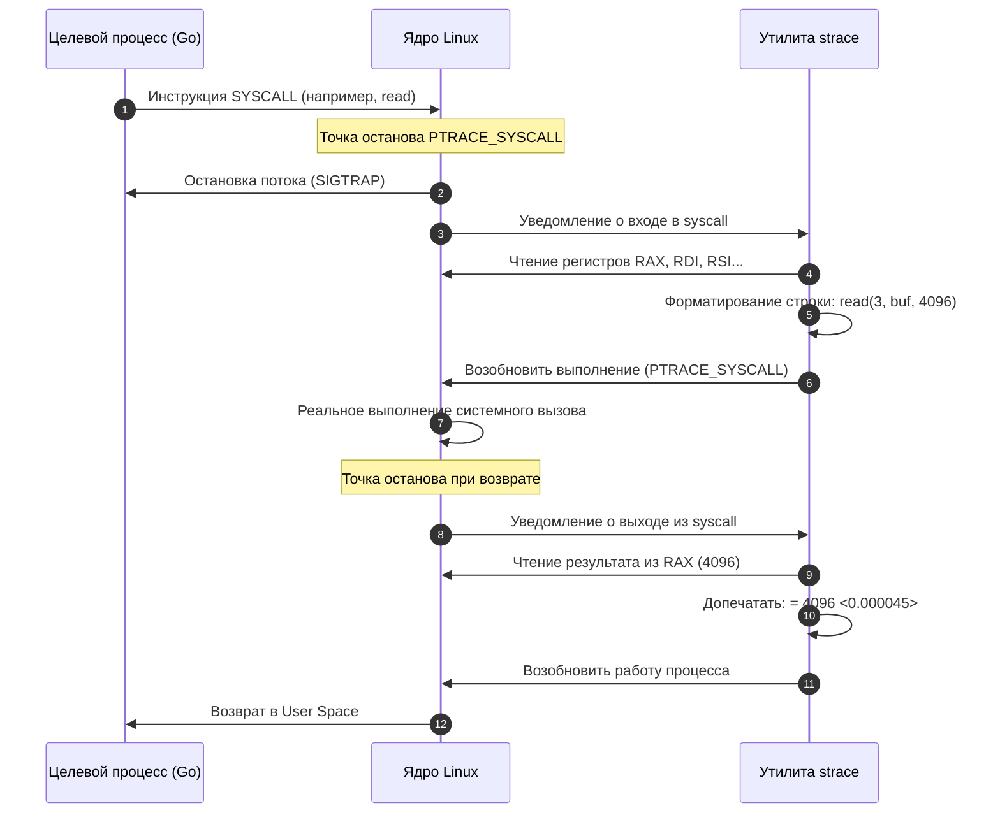
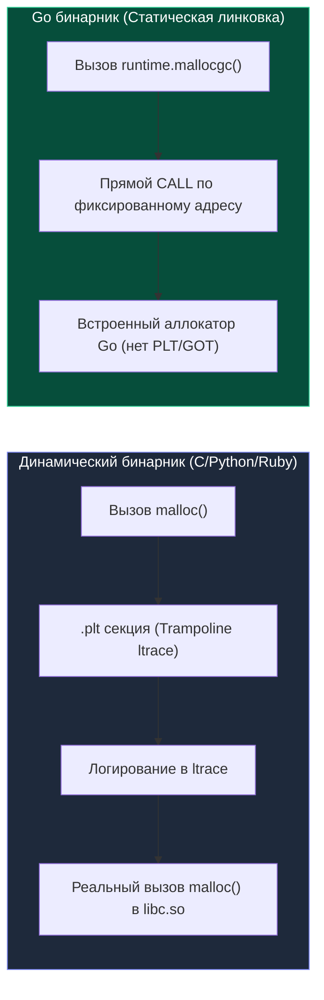

## Зачем лезть в процессы без gdb?

Когда бэкенд-приложение виснет, медленно отвечает или потребляет память, логи часто молчат. Они не показывают, *какие* системные ресурсы блокируют поток, или *почему* процесс не возвращается с сетевого вызова. 

> *"Логи программы — это всего лишь дневник ее благих намерений. Когда процесс намертво зависает, он уже не может ничего записать в лог. Но ядро операционной системы помнит каждый сделанный шаг и никогда не врет."*

Здесь на сцену выходят `strace` и `ltrace` — инструменты отладки на уровне ядра и динамической линковки, которые позволяют увидеть реальный диалог процесса с ОС.

Для Go-разработчика понимание этих утилит критично, потому что Go скрывает от нас нативные потоки, планирует горутины в пользовательском пространстве и по умолчанию линкуется статически. Это ломает привычные паттерны отладки из C/C++ или Java. Запустить отладчик `gdb` на боевом сервере под нагрузкой — верный способ уронить сервис. А вот умение быстро снять трассировку системных вызовов — ключевой навык инженера при разборе инцидентов.

---

## strace: Трассировка системных вызовов

`strace` перехватывает все системные вызовы (syscalls) и сигналы, передаваемые процессом ядру. Это самый надежный способ понять, с чем процесс взаимодействует на уровне ОС.

### Принцип работы и ключевые флаги

```bash
# Запуск нового процесса с трассировкой
strace -f -T -s 256 -o app.strace ./myapp

# Подключение к уже работающему процессу
strace -p 12345 -e trace=network,read,write -c

# Фильтрация только сетевых и файловых вызовов
strace -e trace=network,read,write,epoll_pwait -p $(pidof myapp)
```

| Флаг | Назначение |
|------|------------|
| `-f` | Отслеживать fork/exec дочерних процессов (критично для Go) |
| `-T` | Показывать время выполнения каждого syscall в микросекундах |
| `-c` | Суммарная статистика (count, time, errors) после завершения |
| `-s` | Максимальная длина выводимой строки (по умолчанию 32 символа) |
| `-e` | Фильтр вызовов (например, `trace=network` или `trace=epoll_pwait`) |

### Под капотом: ptrace и цена перехвата

`strace` работает через системный вызов `ptrace(2)`. Это не магия, а официально поддерживаемый ядром механизм отладки (сродни тому, как работает GDB или Go debugger `dlv`).

1. Трассировщик вызывает `ptrace(PTRACE_ATTACH, pid, 0, 0)`.
2. Ядро ставит трассируемый процесс на паузу и посылает ему сигнал `SIGSTOP`.
3. `strace` использует `ptrace(PTRACE_SYSCALL, ...)` для установки точки останова на каждом входе и выходе из syscall.
4. При вызове `syscall` процесс прерывается, управление передается `strace`. Тот снимает регистры, печатает вызов, восстанавливает контекст и разрешает выполнение дальше.

```asm
; x86-64 syscall entry
mov rax, <номер_вызова>
mov rdi, <аргумент_1>
mov rsi, <аргумент_2>
; ...
syscall
; Возврат: результат в rax
```



> [!info] Под капотом
> Каждый перехваченный syscall вызывает **два контекстных переключения**: процесс -> ядро -> трассировщик -> ядро -> процесс. На современных CPU это стоит ~1000–5000 тактов. При высокой частоте вызовов (например, `epoll_wait` или сетевые сокеты) `strace` может замедлить приложение в 10–50 раз.

> [!warning] Ловушка / Gotcha
> `strace -f` отслеживает fork, но логи пишутся в один файл, что создает коллизии. В production всегда используйте `-ff` — тогда каждый дочерний процесс получит свой `PID.strace`.

---

## ltrace: Трассировка библиотечных вызовов

`ltrace` перехватывает вызовы динамических библиотек (`libpthread`, `libc`, `libssl` и т.д.). В отличие от `strace`, он не требует прав на `ptrace` и работает практически полностью в user-space.

### Принцип работы

`ltrace` не лезет в ядро. Вместо этого он использует механизм динамической линковки `ld.so`:
1. При старете процесса `ld.so` загружает нужные `.so` файлы.
2. `ltrace` перехватывает вызовы `mmap` и `mprotect` внутри `ld.so`.
3. Он находит в ELF-бинарнике таблицы импорта (`.rela.plt`) и заменяет адреса функций-заглушками (trampolines), которые прыгают в обработчик `ltrace`.
4. После логирования вызов возвращается по оригинальному адресу.

```bash
ltrace -e malloc,free,calloc ./myapp
ltrace -c ./myapp  # Статистика по библиотекам
```



### Почему ltrace почти бесполезен в Go?

Go-компилятор по умолчанию создает статически линкованные бинарники (`-linkmode=external` или встроенные библиотеки). Это означает:
1. **Нет динамических символов**: `ld.so` не знает, какие функции нужно перехватывать.
2. **CGO меняет правила**: Если приложение использует CGO, `ltrace` может видеть вызовы C-библиотек, но не видит вызовы внутри Go-рантайма (`runtime.malloc`, `netpoll`, `epoll_pwait`).
3. **Конфликт с аллокатором**: `LD_PRELOAD` (механизм, который использует `ltrace`) конфликтует с Go's custom memory allocator (`mmap` + `sbrk` эмуляция), что может привести к `segfault` или утечкам памяти.

> [!tip] Собеседование
> **Вопрос:** Почему `ltrace` часто не показывает ничего при запуске Go-бинарника, даже если там есть `malloc`?
> **Ответ:** Go статически линкует `libc` и использует собственный аллокатор памяти, который работает через `mmap`/`munmap` и выделенные области виртуальной памяти. Динамический линковщик `ld.so` не видит импортируемых функций, поэтому `ltrace` не может внедрить свои заглушки в `.rela.plt`. Для отладки аллокаций в Go используют `GODEBUG=gctrace=1`, `pprof heap` или `madvise`/`mmap` трассировку через `strace`.

---

## Практический пайплайн отладки для Backend

Как Senior-инженер, я не запускаю `strace` наугад. Я использую его как диагностический скальпель:

### 1. Поиск блокировок и hang-состояний
Если сервис не отвечает, подключаемся к PID и смотрим, где он застрял:
```bash
strace -p $(pidof myapp) -T -e trace=epoll_pwait,futex,read,write
```
- Если видим `epoll_pwait(-1, ...)` -> процесс ждет IO, но `netpoller` не пробуждает горутину (возможный баг в `netpoller` или блокирующий код).
- Если видим `futex(0x..., FUTEX_WAIT, ...)` -> захвачен `sync.Mutex` или `channel` без данных.
- Если видим `recvfrom(0, ...)` -> процесс ждет данные из сокета.

### 2. Анализ дисбаланса IO
```bash
strace -c -p PID
```
Вывод покажет, на какие вызовы уходит 90% времени. Если `write` или `read` доминируют — проблема в синхронном IO или отсутствии буферизации. Если `epoll_pwait` занимает много времени — проверьте, не переключает ли Go слишком много горутин в user-space без реального ожидания.

### 3. Сетевые проблемы
```bash
strace -e trace=network -p PID
```
Покажет `connect`, `sendto`, `recvfrom`, `setsockopt`. Если видим `ECONNREFUSED` или `ETIMEDOUT` — проблема на уровне сети или `TIME_WAIT`/`CLOSE_WAIT` состояний (см. `[[50. TIME_WAIT, CLOSE_WAIT и проблемы сокетов]]`).

### 4. Альтернативы для production
`strace` слишком тяжел для боевого продакшена. Вместо него используют:
- `perf trace` / `bpftrace` — перехват через eBPF, минимальный оверхед (~0.1–1%).
- `cat /proc/PID/syscall` — быстрый снимок текущего состояния без отладчика.
- `gdb -p PID -batch -ex "info goroutines"` — для Go-специфичной диагностики.

> [!tip] Собеседование
> **Вопрос:** В чем разница между `strace` и `ltrace` с точки зрения производительности и безопасности?
> **Ответ:** И `strace`, и `ltrace` используют системный механизм `ptrace`. `strace` перехватывает границы системных вызовов в ядре (вызывая переключения контекста `user <-> kernel <-> tracer`), создавая заметный оверхед. `ltrace` через `ptrace` внедряет точки останова (инструкции `int 3` на x86) в таблицу компоновки процедур (PLT) динамических библиотек. Поэтому `ltrace` полностью бесполезен для статически скомпилированных Go-бинарников (у них нет PLT), а в production его не используют из-за огромного оверхеда на точках останова.

---

## Итог

`strace` и `ltrace` — это диагностические инструменты, которые показывают "честный" слой взаимодействия приложения с ОС. Для Go-разработчика важно помнить:
1. `strace` видит только ОС-потоки (M), а не горутины. Планирование горутин происходит в user-space и невидимо для трассировщика.
2. Оверхед `ptrace` делает `strace` инструментом для разработки и staging, а не для production-мониторинга.
3. `ltrace` бесполезен для чистого Go из-за статической линковки и собственного рантайма.
4. Комбинация `strace -T` + `pprof` + `netpoller` логирования дает полную картину: от системного уровня до Go-рантайма.

Мы разобрали, как наблюдать за процессом на уровне ядра. Но чтобы понять, *почему* процесс делает именно эти вызовы, нужно знать, как ОС управляет ресурсами, особенно файлами и дескрипторами. В следующей статье мы закроем фундаментальный концепт Linux: `[[25. Файловые дескрипторы. Все в Linux является файлом]]`.
