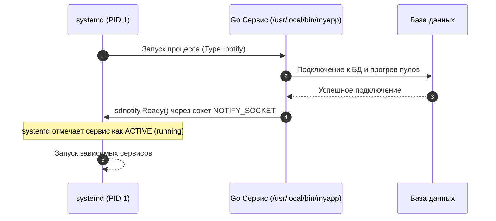

## Демоны и фоновые процессы: Архитектура, жизненный цикл и Go-реализация

В Unix-подобных системах понятие фоновой работы приложения фундаментально отличается от привычного в веб-среде (PHP-FPM, Java Tomcat, Python uWSGI). Там приложение запускается один раз, обрабатывает запросы и завершается по сигналу. В серверной инфраструктуре Linux приложения должны жить вечно, переживать перезагрузки, не мешать администратору в терминале и корректно останавливаться при `SIGTERM`.

> *"Термин 'демон' (daemon) пришел в информатику из физики — от знаменитого демона Максвелла, неутомимого невидимого духа, работающего в фоновом режиме и поддерживающего порядок во Вселенной. В Unix демоны — это не зловещие сущности, а скромные рабочие лошадки, которые делают свое дело тихо, без шума в терминале и без лишнего внимания."*

Для Go-разработчика понимание этой модели критично. Современные Go-приложения редко «демонизируют» себя вручную. Вместо этого они полагаются на инициализаторы (`systemd`, `supervisord`) и стандарты Unix. Разберем, как устроена эта магия под капотом и как писать production-ready сервисы.

---

## Фоновый процесс vs Демон: Где граница?

Термины часто используют как синонимы, но с точки зрения ядра Linux между ними есть архитектурная разница.

*   **Фоновый процесс (Background Process):** Запускается пользователем с суффиксом `&` или через `nohup`. Он наследует файловые дескрипторы, рабочую директорию и, что важно, **контролирующий терминал (CTTY)** от родительской оболочки. Если вы закроете терминал, оболочка отправит `SIGHUP` всем процессам этой сессии, и фоновый процесс умрет.
*   **Демон (Daemon):** Долгоживущий процесс, который:
    1. Не привязан к управляющему терминалу.
    2. Запускается автоматически при старте ОС.
    3. Работает в `root` или от имени непривилегированного пользователя с минимальными правами.
    4. Не выводит логи в stdout/stderr терминала (перенаправляет их в `syslog`, `journald` или файлы).

> [!info] Под капотом
> В ядре Linux статус процесса определяется через структуру `task_struct`. Флаг `PF_KTHREAD` указывает на системные потоки ядра, а флаг `PF_EXITING` — на процесс, завершающий работу. Демонизация по сути меняет принадлежность процесса к **сессии** и **группе процессов**, отрывая его от `tty`.

---

## Отвязка от терминала: Под капотом setsid()

Классический способ превратить процесс в демон (паттерн SysVinit) состоит из нескольких шагов. Если вы пишете CLI-утилиту, которая должна работать в фоне, вы должны реализовать эту логику вручную.

```mermaid
flowchart TD
    A["Родительский процесс (в терминале)"] -->|fork()| B["Потомок 1"]
    A -->|exit(0)| Term["Родитель завершен (терминал свободен)"]
    B -->|setsid()| C["Лидер новой сессии (нет CTTY)"]
    C -->|fork()| D["Потомок 2 (не может получить CTTY)"]
    B -->|exit(0)| Void["Потомок 1 завершен"]
    D -->|chdir('/') & umask(0)| E["Безопасные пути и права"]
    D -->|Закрытие FD 0, 1, 2| F["Перенаправление в /dev/null"]
    D -->|Усыновление PID 1| G["Полноценный демон под init/systemd"]

    style A fill:#1e293b,stroke:#818cf8,color:#fff
    style C fill:#1e3a5f,stroke:#38bdf8,color:#fff
    style D fill:#064e3b,stroke:#34d399,color:#fff
    style G fill:#2e1065,stroke:#c084fc,color:#fff
```

1.  **`fork()`**: Родительский процесс завершается. Это делает потомка сиротой, которого немедленно забирает `init` (PID 1). Теперь ОС не отправит `SIGHUP` при закрытии терминала.
2.  **`setsid()`**: Создает новую сессию и делает процесс лидером сессии. Это разрывает связь с управляющим терминалом. Теперь процесс не может получить доступ к терминалу и не будет получать от него сигналы.
3.  **`chdir("/")`**: Смена рабочей директории на корень, чтобы демон не блокировал размонтирование файловых систем.
4.  **`umask(0)`**: Сброс маски прав, чтобы демон полностью контролировал права создаваемых файлов.
5.  **Закрытие FD**: Закрытие всех унаследованных файловых дескрипторов (`[[25. Файловые дескрипторы. Все в Linux является файлом.md]]`), чтобы не держать открытыми сокеты или файлы родительской оболочки.

```go
func daemonize() error {
    // 1. Fork и завершение родителя
    pid, _, err := syscall.ForkExec("/proc/self/exe", os.Args, &syscall.ProcAttr{
        Dir: ".",
        Files: []uintptr{os.Stdin.Fd(), os.Stdout.Fd(), os.Stderr.Fd()},
    })
    if err != nil {
        return fmt.Errorf("fork failed: %w", err)
    }
    fmt.Printf("Daemon started with PID: %d
", pid)
    return nil
}
```

> [!warning] Ловушка / Gotcha
> В Go `os/exec` не умеет автоматически вызывать `setsid()`. Если вы просто используете `exec.Command`, дочерний процесс унаследует группу процессов и терминал. Для правильного отрыва нужен syscall `setsid()` или использование библиотек вроде `github.com/sevlyar/go-daemon`. В современных реалиях это почти никогда не требуется, так как `systemd` делает это за вас. Более того, в многопоточном рантайме Go ручной вызов `fork()` крайне опасен, так как он копирует состояние только одного потока ОС, оставляя рантайм, горутины и мьютексы в поврежденном состоянии.

---

## Сигналы и Graceful Shutdown

Демоны обязаны реагировать на сигналы ОС. В отличие от PHP, где скрипт умирает мгновенно, Go позволяет реализовать `Graceful Shutdown`: завершить обработку текущих запросов, отключить прием новых, сохранить состояние и только потом выйти.

| Сигнал | Назначение | Поведение Go |
|--------|------------|--------------|
| `SIGTERM` | Корректное завершение | Стандарт для `systemd stop`. Можно перехватить. |
| `SIGINT` | Прерывание (Ctrl+C) | Обычно отправляется только процессам с терминалом. |
| `SIGHUP` | Перезагрузка конфига / отрыв от терминала | В `systemd` отключен по умолчанию. В SysVinit убивает фоновые процессы. |
| `SIGKILL` | Невозможно перехватить | Мгновенное убийство. `kill -9`. |

В Go сигналы доставляются через канал (рекомендуется создавать буферизованный канал емкостью не менее 1, чтобы избежать потери сигналов при занятости читателя). Вызов `signal.Notify` можно выполнять повторно для одного и того же канала — каждый вызов дополняет список отслеживаемых сигналов.

```go
func main() {
    ctx, cancel := signal.NotifyContext(context.Background(), syscall.SIGTERM, syscall.SIGINT)
    defer cancel()

    srv := http.NewServer()
    go func() {
        <-ctx.Done()
        fmt.Println("Received shutdown signal, draining...")
        ctx, stop := context.WithTimeout(context.Background(), 10*time.Second)
        defer stop()
        srv.Shutdown(ctx)
    }()

    if err := srv.ListenAndServe(); err != http.ErrServerClosed {
        log.Fatalf("Server error: %v", err)
    }
}
```

---

## systemd и современная парадигма инициализзации

Современный Linux отказался от самодиагностируемых демонов. `systemd` (PID 1) управляет сервисами через юнит-файлы `.service`. Это меняет подход к написанию Go-приложений:

1.  **Не нужно делать `setsid()` или `fork()`**. `systemd` сам создает изолированную среду.
2.  **`Type=simple`** (по умолчанию): `systemd` считает сервис запущенным сразу после вызова `execve()`.
3.  **`Type=notify`**: Сервис должен отправить сообщение в `sd-daemon` через `sd_notify()` после инициализации. Это позволяет `systemd` ждать готовности (например, пока база данных подключится).
4.  **`Type=forking`**: Для старых демонов. `systemd` ждет, пока родительский процесс завершится, и считает потомка основным.
5.  **Логирование**: `systemd` перехватывает `stdout` и `stderr` и пишет их в `journald`. Не нужно настраивать syslog-драйверы вручную.

```ini
# /etc/systemd/system/myapp.service
[Unit]
Description=My Go Daemon
After=network.target

[Service]
Type=notify
ExecStart=/usr/local/bin/myapp
Restart=always
User=appuser
Group=appgroup
# systemd автоматически закрывает лишние FD и сбрасывает umask
StandardOutput=journal
StandardError=journal

[Install]
WantedBy=multi-user.target
```

Для интеграции с `Type=notify` используется официальный пакет: `github.com/coreos/go-systemd/v22/sdnotify`.



> [!tip] Собеседование
> **Вопрос:** В чем разница между `Type=simple` и `Type=notify` в systemd?
> **Ответ:** `Type=simple` считает процесс живым с момента запуска. Если приложение зависнет на старте (например, ждет БД), systemd не узнает об этом и может отправить `SIGKILL` по таймауту. `Type=notify` требует от приложения отправить сообщение через `sd_notify()`. Это гарантирует, что systemd знает о реальной готовности сервиса. Для Go это реализуется через `sdnotify.Notify()` после запуска HTTP-сервера и подключения к БД.

---

## Идиоматичный Go-демон: Паттерн для продакшена

Production-ready Go-демон должен объединять три компонента: контекст жизни, обработчик сигналов и пул ресурсов.

```go
package main

import (
    "context"
    "fmt"
    "log"
    "net/http"
    "os"
    "os/signal"
    "syscall"
    "time"

    "github.com/coreos/go-systemd/v22/sdnotify"
)

func main() {
    // 1. Создаем контекст с сигналом остановки
    ctx, stop := signal.NotifyContext(context.Background(), syscall.SIGTERM, syscall.SIGINT)
    defer stop()

    // 2. Инициализация ресурсов (БД, брокеры, пулы)
    db, err := initDB(ctx)
    if err != nil {
        log.Fatalf("Failed to init DB: %v", err)
    }
    defer db.Close()

    // 3. Запуск сервиса
    srv := &http.Server{Addr: ":8080", Handler: newRouter(db)}
    go func() {
        fmt.Println("Server started")
        if err := srv.ListenAndServe(); err != nil && err != http.ErrServerClosed {
            log.Fatalf("Listen error: %v", err)
        }
    }()

    // 4. Блокировка до сигнала
    <-ctx.Done()
    fmt.Println("Shutting down gracefully...")

    // 5. Graceful Shutdown с таймаутом
    shutdownCtx, cancel := context.WithTimeout(context.Background(), 15*time.Second)
    defer cancel()
    if err := srv.Shutdown(shutdownCtx); err != nil {
        log.Fatalf("Server forced to shutdown: %v", err)
    }

    // 6. Уведомление systemd о завершении
    sdnotify.Stopping()
    fmt.Println("Server exited")
}
```

> [!warning] Ловушка / Gotcha
> `srv.Shutdown()` не убивает активные соединения мгновенно. Он перестает принимать новые и ждет завершения текущих. Если клиент зависнет, таймаут `context.WithTimeout` спасет от deadlock. В Go 1.20+ лучше использовать `signal.NotifyContext` вместо устаревшего `signal.Notify` + `make(chan os.Signal)`, так как первый автоматически очищает подписки при отмене контекста, предотвращая утечки горутин.

---

## Итог

1.  **Демон vs Фоновый процесс:** Демон оторван от терминала (`setsid`), фоновый процесс наследует сессию оболочки и умирает при закрытии терминала.
2.  **Под капотом:** Отрыв от терминала меняет принадлежность к процессной группе и сессии в ядре Linux. Это предотвращает рассылку `SIGHUP` и освобождает управляющие ресурсы.
3.  **Сигналы:** `SIGTERM` — стандарт для остановки. Go перехватывает его через каналы. Только одна горутина может слушать канал сигналов.
4.  **systemd:** Современный стандарт. Отказ от ручной демонизации в пользу `Type=notify` и перехвата stdout/stderr в `journald`.
5.  **Go-паттерн:** `signal.NotifyContext` + `context.WithTimeout` + `srv.Shutdown()` + `sdnotify` = надежный сервисный код.

Мы разобрали, как процессы живут в фоне и как ОС управляет их жизненным циклом. Теперь логично перейти к тому, как именно `systemd` реализует это управление, какие директивы важны для Go-приложений и как работает активация сокетов. В следующей статье мы разберем: `[[30. systemd. Управление сервисами в Linux.md]]`.
