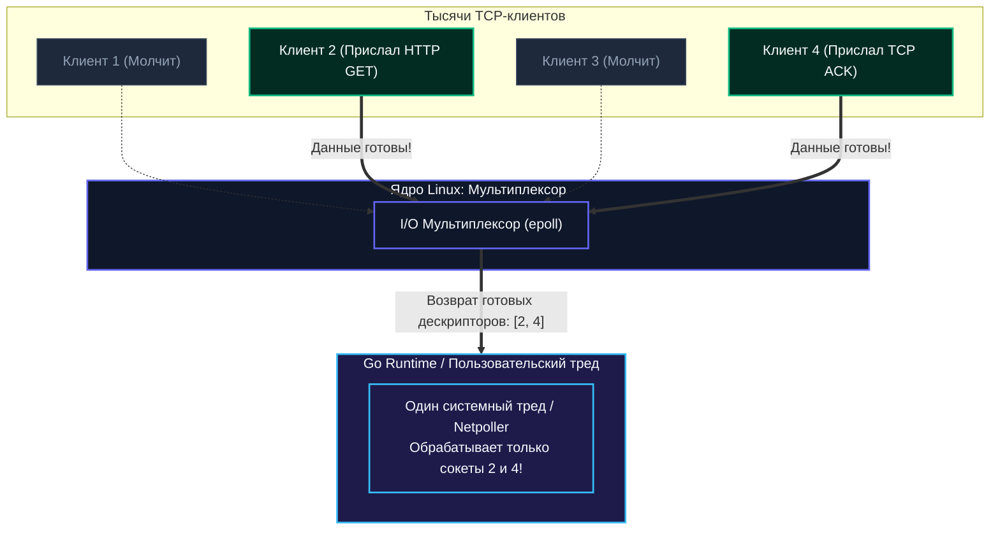
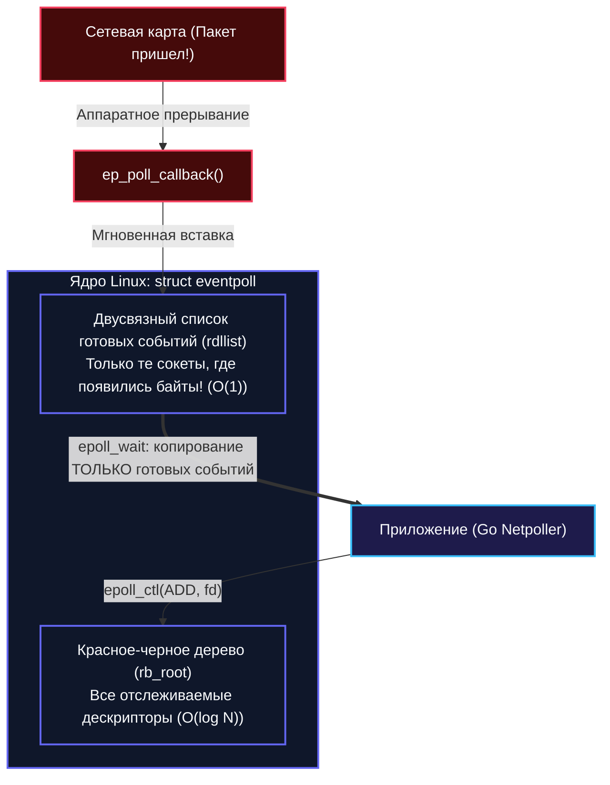
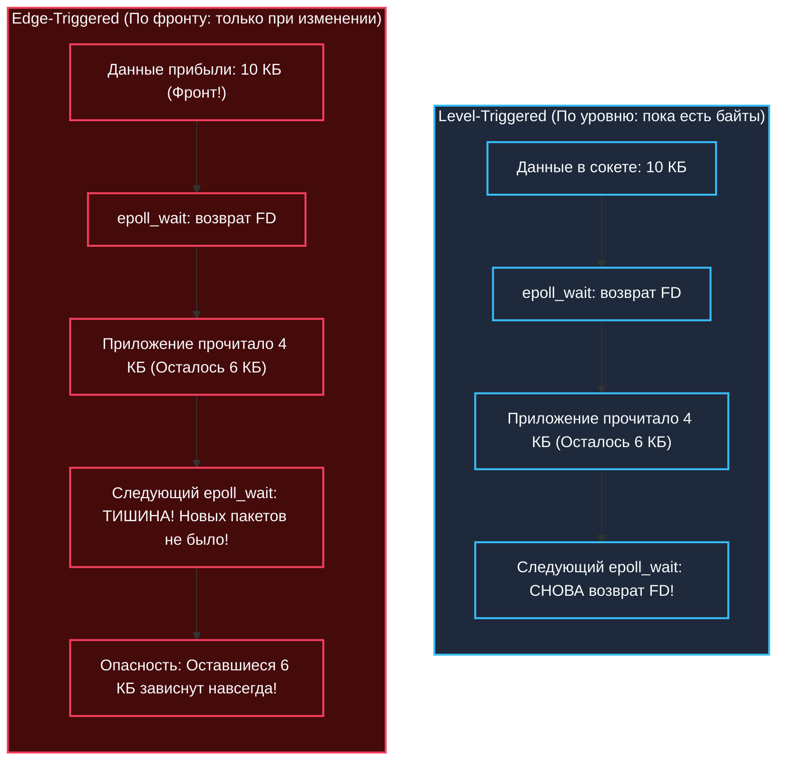
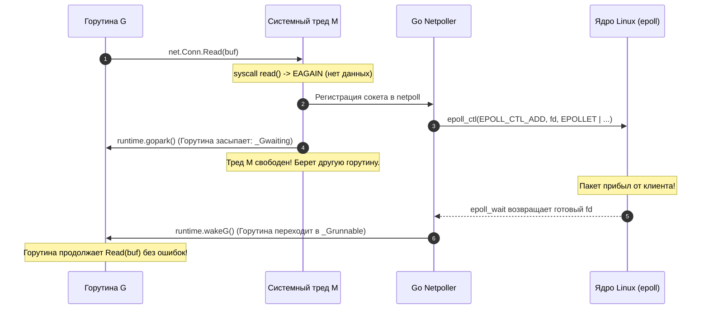

## Введение: Проблема масштабирования блокирующих I/O

Когда разработчик делает свои первые шаги в сетевом программировании, код выглядит обманчиво прямолинейно. Мы открываем сокет, вызываем блокирующие функции `accept()`, `read()`, `write()`. Пока удаленный клиент думает или передает данные по медленному мобильному интернету, вызывающий поток добросовестно спит.

Такой подход безупречно работает для десятков или сотен клиентов. Но как только нагрузка возрастает до тысяч или сотен тысяч одновременных подключений (знаменитая проблема C10K / C100K), наивная модель «один тред ОС на одного клиента» терпит крах. Запуск отдельного потока ядра на каждое соединение означает гигабайты памяти, впустую сожженные под стеки потоков, и катастрофические накладные расходы планировщика ОС на непрерывные контекстные переключения.

Житейская аналогия: представьте телефонного оператора 1950-х годов. Если на каждую телефонную линию сажать отдельного человека, который будет часами держать трубку у уха в ожидании, пока абонент соизволит что-то сказать, здание телефонной станции рухнет под весом стульев и зарплат сотрудников. Куда разумнее иметь одного оператора, перед которым установлена световая панель: лампочка загорелась — оператор подошел и снял трубку.

Именно этот принцип лежит в основе **мультиплексирования ввода-вывода (I/O Multiplexing)**. Вместо того чтобы спать на каждом сокете по отдельности, один рабочий поток регистрирует в ядре сотни тысяч файловых дескрипторов и задает один-единственный вопрос: *«Какие из этих сокетов готовы к чтению или записи прямо сейчас?»*. Ядро возвращает список активных сокетов, а остальные продолжают спокойно ждать без малейшей траты процессорных ресурсов.

В Linux путь к современному высокопроизводительному мультиплексированию занял почти три десятилетия — от примитивных битовых масок до событийно-ориентированных структур данных ядра. Понимание этой эволюции критично: именно на механизме `epoll` зиждется феноменальная производительность сетевых серверов на Go.



---

## Эволюция решений: от select к epoll

Исторически операционные системы семейства Unix выработали три последовательных поколения API для мультиплексирования ввода-вывода:

1. **`select` (BSD 4.2, 1983 год)** — управление через компактные битовые маски, жестокий системный лимит на количество сокетов и алгоритмическая сложность $O(n)$ при каждом вызове.
2. **`poll` (System V Release 3, конец 1980-х годов)** — переход от битовых масок к динамическому массиву структур, снятие жесткого лимита на количество сокетов, но сохранение убийственной сложности $O(n)$.
3. **`epoll` (Linux 2.5.44+, стабилизирован в Linux 2.6, 2002 год, автор — Давиде Либенци)** — полноценная событийно-ориентированная подсистема ядра, алгоритмическая сложность ожидания $O(1)$, хранение состояния в памяти ядра и прямая интеграция с драйверами сетевых карт через механизм обратных вызовов.


> [!tip] Собеседование
> **Вопрос:** В чем фундаментальная разница между `select/poll` и `epoll` с точки зрения сложности алгоритма?
> 
> **Ответ:** `select` и `poll` имеют алгоритмическую сложность **$O(n)$** при каждом вызове. Приложение обязано передавать ядру весь массив интересующих дескрипторов заново, а ядро вынуждено линейно обойти *каждый* из них, чтобы опросить готовность. 
> 
> В противоположность им, `epoll` имеет сложность ожидания **$O(1)$**. Приложение регистрирует дескриптор в ядре ровно один раз. Ядро регистрирует в драйвере устройства обратный вызов (callback). Когда в сетевой сокет приходят байты, драйвер сам помещает готовый сокет в список готовых событий `rdllist`. Системный вызов `epoll_wait` не сканирует ничего: он просто забирает уже готовые элементы из списка за константное время.

---

## select: Жесткие ограничения и O(n)

Системный вызов `select` появился на заре сетевого стека Unix:

```c
#include <sys/select.h>
int select(int nfds, fd_set *readfds, fd_set *writefds, fd_set *exceptfds, struct timeval *timeout);
```

`select` оперирует битовыми масками (`fd_set`). Каждый бит в маске соответствует номеру файлового дескриптора. Но размер этой битовой маски жестко зашит на этапе компиляции константой ядра `FD_SETSIZE` (по умолчанию ровно 1024 бита). Если ваш сервер открыл дескриптор с номером 1025, `select` физически не сможет его обработать и приведет к переполнению буфера.

**Под капотом:**
1. Пользовательское приложение заполняет структуры `fd_set` в User Space с помощью макросов `FD_ZERO` и `FD_SET`.
2. При вызове `select` эти структуры **полностью копируются** из памяти пользователя в Kernel Space.
3. Ядро перебирает все дескрипторы от 0 до `nfds` (алгоритмическая сложность $O(n)$), последовательно опрашивая подсистемы VFS и сетевые сокеты.
4. Ядро перезаписывает переданные битовые маски, выставляя единицы только в битах готовых сокетов, и копирует готовую маску обратно в User Space.
5. Приложение в цикле от 0 до `nfds` перебирает все биты макросом `FD_ISSET`, чтобы найти, кто именно готов к работе.

> [!warning] Ловушка / Gotcha
> `fd_set` — это **маска**, а не список. Если вы зарегистрируете дескрипторы 5, 500 и 900, `select` все равно просканирует все 1024 бита. При 100k активных соединений это гарантированно убьет производительность. Кроме того, `select` модифицирует переданные структуры `fd_set` на месте, поэтому перед каждым вызовом их нужно пересоздавать через `FD_ZERO` и `FD_SET`.

---

## poll: Устранение лимита, но сохранение проблемы

Чтобы избавить программистов от жесткого лимита `FD_SETSIZE`, стандарт System V представил системный вызов `poll`:

```c
#include <poll.h>
int poll(struct pollfd *fds, nfds_t nfds, int timeout);
```

Вместо битовой маски `poll` принимает динамический массив структур `struct pollfd`, каждая из которых содержит номер дескриптора `fd`, битовую маску запрашиваемых событий `events` и битовую маску наступивших событий `revents`:

```c
struct pollfd {
    int   fd;       // Файловый дескриптор
    short events;   // Битовая маска интересующих событий (POLLIN, POLLOUT)
    short revents;  // Битовая маска наступивших событий, заполняемая ядром
};
```

Лимит `FD_SETSIZE` исчез: сервер может мониторить миллион дескрипторов, если хватит оперативной памяти. Однако коренная архитектурная проблема осталась нерешенной:
- Массив `pollfd` все равно копируется целиком из User Space в Kernel Space при каждом вызове.
- Ядро все равно линейно перебирает весь массив от первого до последнего элемента ($O(n)$).
- Приложению после пробуждения все равно приходится в цикле обходить все $N$ элементов, чтобы отыскать те, у которых взведен флаг `revents`. Если из 50 000 сокетов данные пришли только в один, приложение выполнит 50 000 итераций впустую!

> [!info] Под капотом
> `poll` по сути является оберткой над `select` внутри ядра Linux. В исходниках Linux (`fs/select.c`) можно увидеть, что `poll` и `select` используют одни и те же внутренние функции (`core_sys_select`, `do_select`). Разница лишь в том, как пользовательское пространство передает данные: через массив структур или через три битовые маски. На уровне ядра обе функции страдают от одного недуга — полного линейного перебора.

---

## epoll: Архитектура и работа "под капотом"

В 2002 году подсистема `epoll` произвела революцию в масштабируемости Linux. Архитектурный прорыв заключался в простом разделении ответственности:
1. **Интерес (Interest list)** — долговременный список дескрипторов, за которыми мы хотим наблюдать. Он сохраняется в адресном пространстве ядра Linux и не пересоздается при каждом опросе.
2. **Готовность (Ready list)** — динамический список дескрипторов, на которых прямо сейчас произошли аппаратные или системные события.

```c
#include <sys/epoll.h>
int epoll_create(int size); // или epoll_create1(int flags)
int epoll_ctl(int epfd, int op, int fd, struct epoll_event *event);
int epoll_wait(int epfd, struct epoll_event *events, int maxevents, int timeout);
```



### Ключевые структуры ядра Linux:
- `struct eventpoll` — главный объект контекста, создаваемый вызовом `epoll_create` (или `epoll_create1`). Он содержит красное-черное дерево (`rb_root`) для эффективного поиска интересующих дескрипторов за $O(\log n)$ и связанный список готовых событий (`rdllist`).
- `struct epitem` — элемент красного-черного дерева ядра. Каждая запись связывает конкретный файловый дескриптор с обратным вызовом ядра (`ep_poll_callback`).
- `struct epoll_filefd` — внутренняя обертка для валидации дескриптора и защиты от циклических зависимостей (например, попытки добавить epoll-дескриптор внутрь самого себя).

### Пошаговый жизненный цикл события в epoll:
1. Вызов `epoll_ctl(EPOLL_CTL_ADD)` вставляет дескриптор в красное-черное дерево ядра `rb_root`. Это происходит один раз при установлении сетевого соединения.
2. Ядро регистрирует функцию обратного вызова `ep_poll_callback` в очереди ожидания сокета (`wait_queue`).
3. Когда сетевой адаптер принимает TCP-пакет, срабатывает прерывание драйвера. Драйвер помещает пакет в сокет и немедленно дергает `ep_poll_callback`.
4. Обратный вызов ядра атомарно переносит соответствующий `struct epitem` в двусвязный список `rdllist` (Ready List) и будит спящий тред.
5. Вызов `epoll_wait` не сканирует сокеты! Он мгновенно забирает элементы из `rdllist` и копирует их в буфер `events` в пространстве пользователя. Если `rdllist` пуст — поток засыпает в ядре без расхода тактов процессора.

> [!tip] Собеседование
> **Вопрос:** Почему `epoll` быстрее `select` при малом количестве активных соединений?
> 
> **Ответ:** При малой активности (например, всего 5–10 открытых сокетов) `epoll` может быть даже чуть медленнее, чем `select`, из-за накладных расходов на системные вызовы создания структуры `eventpoll`, вставки узлов в красное-черное дерево и аллокации `epitem`. 
> 
> `epoll` раскрывает свой колоссальный потенциал при высокой сетевой нагрузке (от 1 000 до миллионов соединений), где алгоритмическая сложность $O(1)$ при ожидании и полное отсутствие многократного копирования огромных массивов между ядром и пользователем дают многократный экспоненциальный выигрыш.

---

## Triggered modes: Level vs Edge

`epoll` предоставляет два фундаментально различных режима оповещения о событиях:

| Режим | Поведение | Аналог в сетевом стеке |
|---|---|---|
| **Level-Triggered (LT)** | Системный вызов `epoll_wait` будет возвращать дескриптор до тех пор, пока буфер остается непустым. Если пришло 64 КБ, а вы прочитали только 4 КБ, следующий `epoll_wait` снова немедленно вернет этот дескриптор. | Классический режим по умолчанию. Максимально безопасен, прост в разработке, но может порождать лишние переключения контекста при частичном чтении. |
| **Edge-Triggered (ET)** | Возвращает дескриптор **только при изменении состояния** (на фронте волны — когда пришли новые данные). Требует сокетов в неблокирующем режиме (`O_NONBLOCK`) и полного вычитывания в цикле до получения кода ошибки `EAGAIN/EWOULDBLOCK`. | Режим максимальной производительности (используется в NGINX, HAProxy, Envoy). Минимизирует число пробуждений, но требует предельной аккуратности. |



> [!warning] Ловушка / Gotcha
> При использовании флага `EPOLLET` (Edge-Triggered) разработчик обязан читать данные в цикле до тех пор, пока вызов `recv` (или `read`) не вернет `-1` с кодом ошибки `EAGAIN`. 
> 
> Если вы прочитаете только часть буфера и выйдете из цикла, `epoll` больше никогда не уведомит вас об оставшихся байтах, пока удаленный клиент не пришлет следующий сетевой пакет! В результате соединение «зависнет намертво» прямо посреди бизнес-транзакции.

---

## Механическая симпатия: Почему это важно для Go

Среда исполнения Go не создает отдельный тред ОС на каждую горутину, а использует легковесную модель планирования **M:N**. Когда горутина инициирует сетевое чтение (`net.Conn.Read` или `net.Read`):



1. Go runtime пытается немедленно прочитать данные неблокирующим системным вызовом `read()`.
2. Если данных нет (`EAGAIN`), рантайм отвязывает горутину от текущего системного треда `M`.
3. Дескриптор сокета регистрируется в ядре через сетевой поллер `netpoll`.
4. Горутина паркуется с помощью вызова `runtime.gopark`, а тред `M` продолжает исполнять другие горутины, не тратя время на сон в ядре.
5. Фоновый поток сетевого поллера вызывает `epoll_wait`. Как только ядро сообщает о готовности сокета, рантайм вызывает `runtime.wakeG`, возвращая горутину в очередь готовых к исполнению.

Таким образом, `epoll` — это краеугольный камень рантайма Go. Без эффективного мультиплексирования сетевых событий на уровне ядра Go-сервер не смог бы обрабатывать миллионы параллельных сетевых соединений на скромном многоядерном процессоре.

> [!info] Под капотом
> В исходном коде рантайма Go (`src/runtime/netpoll_epoll.go`) реализована прямая и предельно оптимизированная работа с системными вызовами `epoll_create1`, `epoll_ctl` и `epoll_wait`. 
> 
> Go регистрирует дескрипторы сокетов один раз при инициализации с флагом `EPOLLET` (Edge-Triggered) в комбинации с `EPOLLIN | EPOLLOUT | EPOLLRDHUP`. В отличие от флага `EPOLLONESHOT`, требующего постоянного повторного включения через `epoll_ctl(EPOLL_CTL_MOD)`, edge-triggered режим избавляет рантайм от лишних системных вызовов модификации, а синхронизация и защита от гонок возлагаются на атомарные флаги в структуре `pollDesc` самого рантайма.

---

## Go runtime и netpoller: Ключевые детали

Сетевой поллер Go (`netpoller`) — это шедевр системного программирования, спроектированный с учетом глубокой механической симпатии:
- **Пул памяти пакетов:** рантайм активно использует кэширование буферов (`sync.Pool`), чтобы снизить давление на сборщик мусора при непрерывном чтении и записи сетевых пакетов.
- **Детекция разрыва соединений:** Go регистрирует события с флагом `EPOLLRDHUP`, позволяя мгновенно узнавать о закрытии TCP-соединения клиентом без необходимости делать пробный холостой системный вызов `read`.
- **Кооперативная интеграция с планировщиком:** вызовы `runtime.gopark` и `runtime.wakeG` переводят горутины между состояниями без переключения контекста системных тредов ядра, экономя тысячи тактов процессора на каждом сетевом пакете.

В высоконагруженных промышленных системах важно придерживаться лучших практик:
- Избегайте длительных блокирующих расчетов внутри обработчиков `net.Conn`.
- Применяйте буферизованный ввод-вывод из пакета `bufio`, чтобы сгруппировать мелкие записи и минимизировать лишние вызовы `syscall`.
- На современных ядрах Linux поддерживается флаг `EPOLLEXCLUSIVE`, предотвращающий проблему громоподобного стада (thundering herd), когда при поступлении одного входящего соединения ядро пробуждало все ожидающие потоки.

---

## Итог

1. Системные вызовы **`select`** и **`poll`** устарели для высоконагруженных систем из-за алгоритмической сложности $O(n)$ и необходимости копирования всех дескрипторов при каждом обращении.
2. **`epoll`** делит дескрипторы на список интереса (хранится в ядре в виде `rb_root`) и список готовности (`rdllist`), обеспечивая константную сложность $O(1)$ при ожидании событий.
3. Режимы **Level-Triggered (LT)** и **Edge-Triggered (ET)** определяют семантику уведомлений: LT безопасен и интуитивен, а ET требует неблокирующих сокетов и чтения до получения ошибки `EAGAIN`.
4. Сетевой поллер Go (**`netpoller`**) прозрачно связывает системный механизм `epoll` с планировщиком горутин через `runtime.gopark` и `runtime.wakeG`, делая асинхронный сетевой ввод-вывод простым и синхронным по стилю написания.

В следующей лекции мы исследуем, как аналогичную проблему решают операционные системы семейств BSD и Windows, и почему архитектура портов завершения ввода-вывода отличается от модели готовности: `[[37. kqueue и IOCP. Чем отличаются BSD и Windows]]`.
