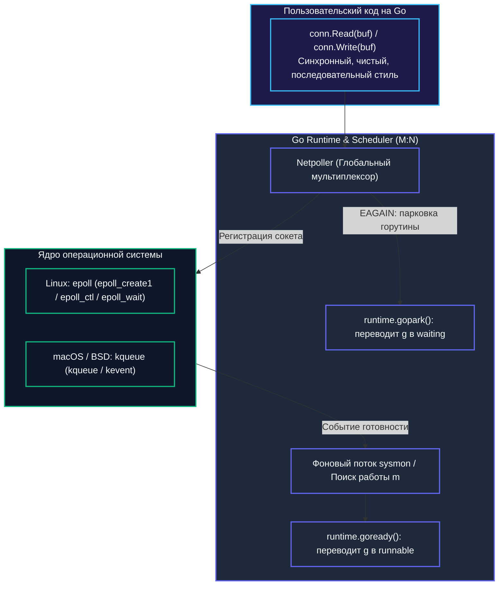
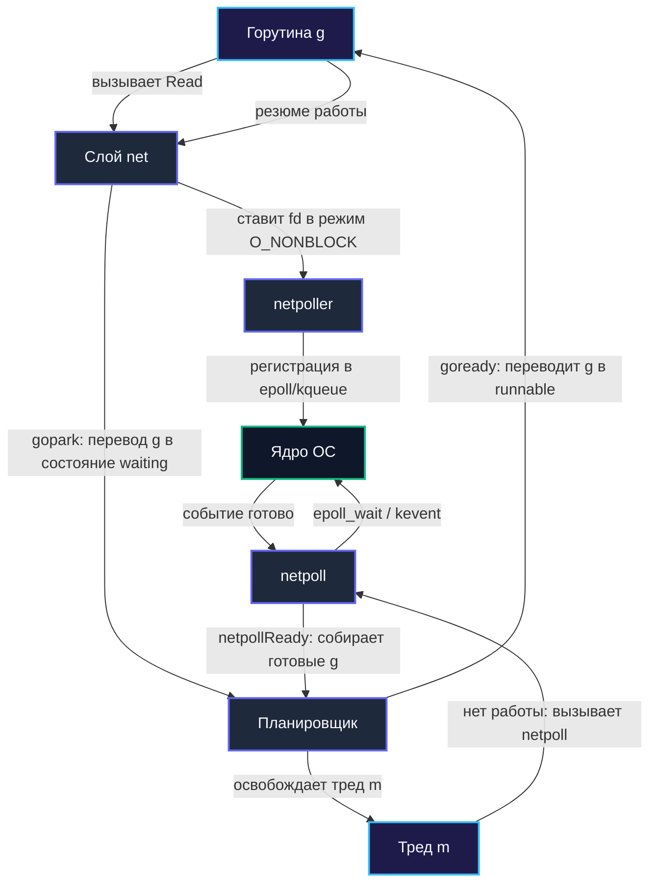
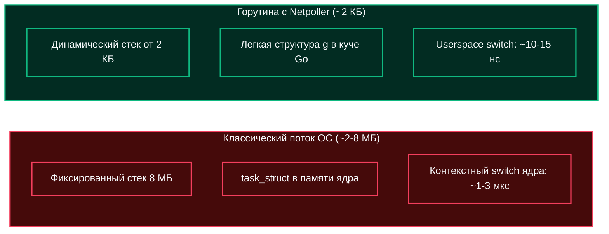

## Зачем Go нужен собственный Netpoller

В предыдущих главах мы подробно исследовали, как современные ядра операционных систем уведомляют пользовательские программы о готовности данных через системные селекторы `epoll` (`[[36. select, poll и epoll]]`) и `kqueue` (`[[37. kqueue и IOCP. Чем отличаются BSD и Windows]]`). Но почему разработчики языка Go не оставили вызовы `epoll` и `kqueue` прикладным программистам, а создали мощный внутренний механизм рантайма — **Netpoller**?

Ответ кроется в фундаментальной архитектуре планировщика Go. В классических средах разработки (C++, Java до появления Project Loom, Python) принята модель потоков **1:1** — один программный поток жестко привязан к одному системному треду операционной системы (`pthread`). Если такой поток выполняет блокирующий системный вызов `read` на сетевом сокете, ядро усыпляет весь тред ОС. Для сервера с сотней потоков это нормально, но совершенно неприемлемо для сотен тысяч одновременных подключений.

В мире Go действует легковесная кооперативная модель **M:N**: сотни тысяч горутин (`g`) мультиплексируются планировщиком рантайма на ограниченное число системных тредов операционной системы (`m`), привязанных к логическим процессорам (`p`). 

Если бы горутина выполнила блокирующий сетевой `syscall`, заснул бы целый физический тред `m`! Это моментально парализовало бы связанный логический процессор `p`, заморозило бы все остальные готовые горутины в его локальной очереди и привело к массовому голоданию (starvation) всего сервиса.

Чтобы решить эту задачу, создатели Go пошли на гениальный архитектурный шаг: они перехватили все сетевые операции ввода-вывода прямо на уровне стандартной библиотеки и рантайма, превратив их под капотом в **событийно-ориентированные неблокирующие операции** с помощью внутреннего компонента **`netpoller`**.



---

## Epoll и kqueue: Краткий взгляд со стороны ОС

Оба механизма операционных систем служат одной фундаментальной цели: уведомить процесс о готовности файловых дескрипторов без разорительного активного опроса (`polling`).

| Механизм | ОС | API | Особенности |
|----------|----|-----|-------------|
| `epoll` | Linux | `epoll_create`, `epoll_ctl`, `epoll_wait` | O(1) для готовых событий. Использует хеш-таблицу в ядре и красно-черное дерево. |
| `kqueue` | BSD, macOS, FreeBSD | `kqueue`, `kevent` | Универсальный механизм событий (не только I/O). Использует связные списки готовых событий. |

В главе `[[35. Асинхронный IO и блокирующий IO]]` мы видели, что оба подхода работают по принципу **edge-triggered** (срабатывают при изменении состояния), но требуют от приложения явного и сложного управления состоянием дескрипторов. Go полностью освобождает прикладного программиста от этой рутины, забирая все низкоуровневое управление событиями внутрь рантайма.

---

## Архитектура Netpoller в Go Runtime

Go не создает отдельный процесс или тред для каждого `epoll`/`kqueue` инстанса. Вместо этого в `runtime` существует единый глобальный объект `netpoller`, который инициализируется при старте программы.

```go
// Упрощённо, из runtime/netpoll.go
type netpoller struct {
    fd int // epollfd или kqueue fd
    // ... внутренние поля для отслеживания дескрипторов
}
```

При первом же обращении к сетевым функциям рантайм вызывает процедуру инициализации `netpollInit`:
1. На Linux: выполняется системный вызов `epoll_create1(EPOLL_CLOEXEC)`. Флаг гарантирует, что дескриптор epoll автоматически закроется при возможном вызове `execve`.
2. На BSD/macOS: создается глобальный дескриптор очереди вызовом `kqueue()`.

После этого все высокоуровневые сетевые операции стандартной библиотеки (`net.Dial`, `conn.Read`, `conn.Write`) работают по строго выверенному протоколу:
1. Выставляют флаг `O_NONBLOCK` на дескрипторе сокета.
2. Регистрируют дескриптор в `netpoller` через системные вызовы `epoll_ctl(EPOLL_CTL_ADD)` или `kevent`.
3. Пытаются совершить неблокирующее чтение или запись (`read`/`write`).
4. Если операция вернула ошибку `EAGAIN` (данные еще не подошли), горутина переводится в состояние ожидания `waiting` вызовом `gopark`, освобождая системный тред `m` для другой полезной работы!

---

## Под капотом: Как связываются Goroutine и ядро

Связь между планировщиком Go и ядром ОС осуществляется через два ключевых компонента: фоновый монитор планировщика `sysmon` и рабочие потоки операционной системы `m` (thread).



### Ключевые детали реализации

1. **`EPOLLET` и `EV_CLEAR` (Edge-Triggered)**: Go регистрирует события сокетов в триггерном по фронту режиме (`EPOLLET` в Linux и `EV_CLEAR` в kqueue BSD/macOS). Уведомление о готовности ядро генерирует только при изменении состояния (прибытие новых данных в буфер или освобождение буфера сокета). Это полностью избавляет рантайм от спама уведомлений (level-triggered шторм) и от лишних системных вызовов модификации (в отличие от модели `EPOLLONESHOT`, требующей регулярных вызовов `EPOLL_CTL_MOD` для повторного взведения).
2. **`sysmon` и `netpoll`**: Системный поток мониторинга (`sysmon`) исполняется без привязки к какому-либо логическому процессору `p`. Он просыпается с адаптивным интервалом (от 20 микросекунд до 10 миллисекунд) и вызывает неблокирующий `netpoll(0)`. Если в сетевых буферах ядра появились готовые байты, `netpoll` моментально собирает список горутин и передает их планировщику.
3. **`netpollReady`**: Внутренняя функция рантайма, которая принимает список разбуженных горутин `g` от `netpoller` и для каждой вызывает функцию `goready(g, 0)` (или `goready`). Это атомарно переводит статус горутины из `waiting` в готовое к исполнению состояние `runnable` и помещает ее в локальную или глобальную очередь исполнения процессоров `p`.
4. **Атомарность регистрации**: Вся работа с внутренними списками ожидания защищается специальным спинлоком рантайма `netpollLock`. Это гарантирует, что сетевое событие не будет потеряно, если горутина закрывает соединение (`Close()`) в тот самый момент, когда сетевая карта генерирует прерывание о входящем пакете.

> [!info] Под капотом
> В исходном коде рантайма Go (`src/runtime/netpoll_epoll.go` и `netpoll_kqueue.go`) дескриптор сокета регистрируется один раз с флагами `EPOLLET | EPOLLIN | EPOLLOUT | EPOLLRDHUP` (или `_EV_ADD | _EV_CLEAR` в kqueue).
> 
> Использование edge-triggered режима дает рантайму высочайшую производительность: ядро сигнализирует только о фронте изменения буферов, а сам рантайм вычитывает данные в цикле до получения `EAGAIN`. Если горутина паркуется, дескриптор не перерегистрируется в ядре — координация между читателями и писателями происходит в userspace через поля `pollDesc` (`rg`, `wg`), управляемые атомиками.

> [!warning] Ловушка / Gotcha
> **Обычные файлы не проходят через Netpoller!**
> Если вы открываете обычный дисковый файл на файловой системе ext4 или XFS и вызываете блокирующий `syscall.Read` (или стандартный `file.Read`), ядро Linux **не поддерживает** для обычных файлов неблокирующий режим через `epoll`. Обычные файлы в VFS всегда считаются «готовыми к чтению», но сам вызов `read` блокирует поток на миллисекунды в ожидании механического диска или контроллера SSD.
> 
> В этом случае Go runtime вынужден временно отвязать системный поток `m` от процессора `p` (процедура `entersyscall` / `exitsyscall`) и породить новый тред через `runtime.startm`. Если вы в цикле читаете терабайты мелких файлов, количество тредов ОС может вырасти, приводя к просадке производительности. Помните: `netpoller` создан прежде всего для сокетов, пайпов и IPC!

---

## Mechanical Sympathy: Производительность и кэш-линии

Почему гибридная архитектура `netpoller` работает на порядки быстрее классической модели thread-per-request?

1. **Снижение Context Switch ядра**: Смена контекста между системными тредами `m` на уровне ядра ОС требует сохранения полного набора регистров CPU, смены стека ядра и планирования потоков ядра (а при переключении между процессами — сброса записей TLB). В Go переключение горутин происходит в пространстве пользователя (userspace) за считанные наносекунды — планировщик Go сохраняет минимальный набор регистров в структуре `g.sched` (SP, PC, BP, g).
2. **Аппаратная кэш-локальность CPU**: Один и тот же системный тред `m` последовательно обслуживает сотни активных горутин на одном физическом ядре CPU. Все рабочие структуры данных планировщика постоянно прогреты в локальных кэшах L1/L2 процессора, не вызывая дорогостоящих промахов мимо кэша.
3. **Отсутствие колоссального `pthread` overhead**: Системный тред Linux резервирует от 2 до 8 МБ виртуального адресного пространства под свой стек. Стек горутины в Go стартует всего с **2 КБ** и динамически растет по мере необходимости. Это позволяет без труда удерживать сотни тысяч одновременных сетевых соединений в одном гигабайте оперативной памяти.



> [!tip] Собеседование
> **Вопрос:** Что произойдет в рантайме Go, если абсолютно все рабочие треды `m` будут ожидать данных из сети в `netpoller`?
> 
> **Ответ:** Система не зависнет и не упадет. В `netpoller` треды `m` не блокируются намертво: рантайм использует неблокирующий системный вызов `epoll_wait` (или `kevent`) с расчетным таймаутом. 
> 
> Если свободной вычислительной работы в системе нет, лишние треды `m` засыпают через системный вызов `futex`, освобождая ядра CPU. Как только сетевая карта получает пакет, прерывание драйвера будит спящий тред, либо фоновый монитор `sysmon` обнаруживает готовые сокеты и мгновенно активирует тред через `runtime.startm`. Горутины пробуждаются асинхронно, а процессор не прожигает энергию впустую.

---

## Сравнение с другими экосистемами

| Экосистема | Механизм | Архитектурный подход | Инженерный компромисс |
|------------|----------|----------------------|-----------------------|
| **Go** | `epoll`/`kqueue` + `netpoll` | Единый глобальный инстанс + кооперативный планировщик `sysmon` | Лаконичный синхронный код без `async/await`. При сверхвысоких нагрузках (>500k сокетов) блокировка `netpollLock` может давать небольшую конкуренцию. |
| **Node.js (libuv)** | `epoll`/`kqueue` | Однопоточный Event Loop | Отсутствие гонок памяти, но любая случайная тяжелая CPU-bound задача полностью блокирует обработку сети для всех клиентов. |
| **Java NIO** | `epoll` | Ручной пул тредов и системный объект `Selector` | Высокая гибкость, но колоссальная сложность ручной настройки, риск утечки буферов и громоздкий callback-код (до появления Project Loom). |
| **Rust (Tokio)** | `epoll` / `io_uring` (Linux) | Асинхронные конечные автоматы (Futures) | Максимальная скорость и нулевые накладные расходы, но сложная модель владения (lifetimes) и «цветные функции» (`async`/`.await`). |

Команда разработчиков Go нашла идеальную золотую середину: единый внутренний `netpoller` скрывает от прикладного инженера чудовищную сложность асинхронного системного программирования, обеспечивая при этом производительность уровня C и C++.

---

## Итог

1. **`netpoller`** — это фундамент масштабируемости Go, слой интеграции рантайма с механизмами `epoll` и `kqueue`, превращающий блокирующие вызовы в событийно-ориентированные.
2. Флаги **`EPOLLONESHOT`** и **`EV_ONESHOT`** гарантируют точечный контроль над событиями дескрипторов и предотвращают проблему лавинного пробуждения тредов.
3. Фоновый системный монитор **`sysmon`** и рабочие треды **`m`** опрашивают ядро через неблокирующий вызов `netpoll(0)`, моментально возвращая горутины в статус `runnable` через функцию `goready`.
4. **Mechanical Sympathy:** микросекундная экономия на исключении переключений контекста ядра, минимальный начальный стек горутин (2 КБ) и сохранение кэш-линий L1/L2 обеспечивают обслуживание сотен тысяч сокетов на одном сервере.
5. **Подводный камень:** дисковые операции с обычными файлами через `syscall.Read` не мультиплексируются через `netpoller` и требуют от рантайма выделения системных тредов.

Мы детально исследовали, как Go управляет готовностью сетевых и системных дескрипторов. Следующий логичный шаг — понять, что происходит с данными после того, как они переданы операционной системе для записи на физический накопитель. В следующей статье мы разберем: `[[39. Файловые системы. Что происходит после write]]`.
