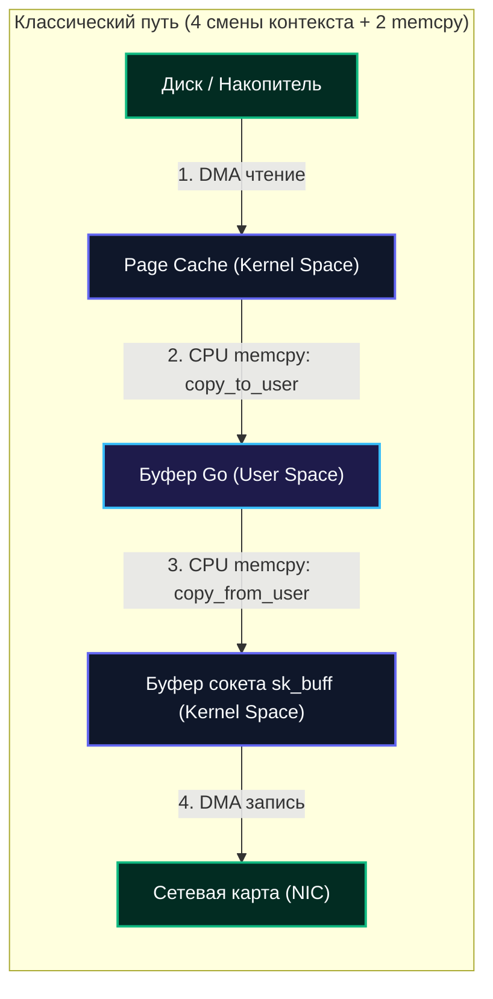
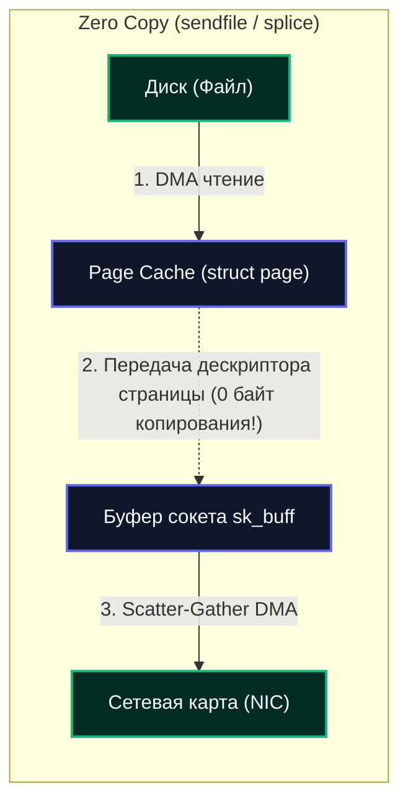

## Классический путь IO и его фундаментальная проблема

Прежде чем приступать к оптимизациям ввода-вывода, любой серьезный инженер обязан досконально понимать: **а что именно мы пытаемся оптимизировать?**

В классической модели POSIX при передаче данных — например, когда веб-сервер считывает статический файл с диска и отправляет его клиенту по сети через TCP-сокет — данные совершают чудовищный и расточительный кругосветный маршрут:



1. **User Space:** Приложение вызывает `read()` и переключает контекст процессора в пространство ядра.
2. **Page Cache:** Ядро копирует данные в структуру `struct page` внутри `[[42. Буферизация IO и Page Cache]]`.
3. **CPU Copy:** Ядро копирует байты из памяти ядра в пользовательский слайс Go с помощью функции `memcpy`. Процессор возвращается в User Space.
4. **User Space:** Приложение вызывает `write()` на сетевом сокете. Снова переключение контекста в ядро!
5. **Socket Buffer:** Ядро вторично копирует байты процессором (`memcpy`) из памяти пользователя в буфер сокета `sk_buff`.
6. **DMA Engine:** Контроллер сетевой карты (NIC) забирает данные из оперативной памяти напрямую через DMA и отправляет в кабель.

**В чем фундаментальная трагедия этой цепочки?**
- **Двойное копирование данных процессором:** Гигабайты данных дважды перекладываются через регистры CPU туда и обратно исключительно для того, чтобы послужить транзитным мостом между диском и сетевой картой!
- **Загрязнение кэшей процессора (CPU Cache Thrashing):** Инструкции `memcpy` вымывают из сверхбыстрых кэшей L1/L2/L3 полезные данные приложения (хэш-таблицы, бизнес-объекты), заполняя их одноразовыми транзитными байтами.
- **Лавина переключений контекста:** Четыре перехода границы User/Kernel Space на каждый блок данных приводят к непрерывной перезагрузке таблиц страниц и сбросу конвейера процессора.

Для высоконагруженных систем (базы данных, прокси-серверы вроде Nginx/Envoy, стриминг видео, брокеры Kafka) эти накладные расходы становятся непреодолимым барьером производительности. На помощь приходят технологии `[[Direct IO и Zero Copy]]`, кардинально меняющие физику движения байтов в операционной системе.

---

## Direct IO (O_DIRECT): Обход Page Cache

**Direct IO** — это специализированный режим работы с файловой системой, при котором поток данных передается напрямую между оперативной памятью пользовательского процесса и блочным накопителем, полностью минуя `Page Cache`.

```mermaid
flowchart LR
    subgraph DirectIO["Direct IO (O_DIRECT): Минуя Page Cache"]
        UserRAM["Выровненный буфер приложения (User Space)"]
        DirectDMA["DMA-контроллер (PCIe / NVMe)"]
        Storage["Блочное устройство (SSD / NVMe)"]
    end

    UserRAM <==|"Прямая передача данных по DMA (0 копий CPU!)"|==> Storage

    classDef user fill:#1e1b4b,stroke:#38bdf8,stroke-width:2px,color:#f8fafc;
    classDef hw fill:#022c22,stroke:#10b981,stroke-width:2px,color:#f8fafc;

    class UserRAM user;
    class DirectDMA,Storage hw;
```

### Как это работает под капотом

Когда файл открывается с флагом `O_DIRECT`, ядро Linux переключает обработчик в таблице операций виртуальной файловой системы `struct file_operations`:
- **Обычный путь VFS:** `read_iter` → `filemap_read` → `page_cache_read`.
- **Путь Direct IO:** `read_iter` → `direct_IO` → `blk_rq_map_user` → DMA.

Ядро определяет физические адреса пользовательского буфера в оперативной памяти (DRAM), временно блокирует соответствующие страницы от вытеснения в своп (Pinning Pages) и передает физические адреса контроллеру накопителя. DMA-контроллер считывает или записывает данные напрямую в память приложения. 

Процессор вообще не участвует в копировании полезной нагрузки (0% CPU utilization на перемещение байтов!). Это дает предсказуемую и стабильную задержку при прокачке гигантских объемов информации.

> [!warning] Ловушка / Gotcha
> **Требование выравнивания (Alignment)**
> Direct IO **жестко требует** выравнивания адреса буфера в оперативной памяти, файлового смещения и размера порции данных. Обычно размер выравнивания составляет 512 байт (для старых дисков) или ровно 4096 байт (размер сектора Advanced Format / страницы памяти). 
> 
> Если передать невыровненный буфер, ядро немедленно отвергнет системный вызов с ошибкой `EINVAL`. Это не прихоть программистов ядра Linux, а жесткое аппаратное требование DMA-контроллеров шины PCIe: они оперируют физическими фреймами памяти, кратными размеру страницы!

### Когда стоит использовать Direct IO?
- **СУБД и хранилища данных:** PostgreSQL (`direct_io`), ClickHouse, ScyllaDB, RocksDB, Redis. Они реализуют собственные сложные алгоритмы кэширования (Buffer Pool, LRU-2Q, ARC) и не желают тратить память на дублирование данных в `[[42. Буферизация IO и Page Cache]]`.
- **Высокопропускной стриминг:** Запись сырых сетевых дампов, видеоархивов, телеметрии, где данные пишутся один раз и никогда больше не читаются из кэша.
- **Защита от вытеснения кэша (Anti-Thrashing):** Обработка терабайтных файлов не вымывает из оперативной памяти горячие данные веб-приложений.

### Когда Direct IO вреден?
- **Случайный доступ к мелким файлам:** Без кэша Page Cache каждое мелкое чтение обернется физическим дисковым Page Miss. Задержка подскочит в 100–1000 раз!
- **Частые микро-записи:** Отсутствие буферизации убьет пропускную способность диска.
- **Нестабильная поддержка в ФС:** В то время как ext4 и XFS оптимизированы под Direct IO, файловые системы FUSE, NFS или `tmpfs` могут игнорировать этот режим или вызывать скрытую деградацию.

---

## Zero Copy: Устранение копирования на уровне ядра

**Zero Copy** — это фундаментальный архитектурный паттерн проектирования операционных систем, при котором данные передаются между двумя дескрипторами в пространстве ядра (например, из дискового файла напрямую в сетевой сокет) без единого копирования байтов в пространство пользователя.



### Механизм работы

Классический сценарий: веб-сервер отдает статический файл (HTML, картинку, видео) через сокет.
1. Приложение вызывает системный вызов `sendfile()`.
2. Ядро Linux считывает блок файла с диска в `Page Cache` с помощью DMA.
3. Вместо копирования байт в буфер Go ядро лишь **привязывает дескрипторы страниц** (`struct page`) к сокетному буферу `sk_buff`.
4. Драйвер сетевой карты с поддержкой аппаратного режима Scatter-Gather DMA забирает данные напрямую из страниц `Page Cache` и отправляет их в кабель!

**Результат:** Процессор делает всего **два перехода контекста** (вход в вызов `sendfile` и выход), а сами байты данных **ни разу не копируются процессором**. 
В современных ядрах Linux развитием этой идеи стали системные вызовы `splice()` (перекачка байт между файлами и pipe) и `copy_file_range()` (клонирование блоков внутри файловой системы без чтения в память).

> [!info] Под капотом
> В ядре Linux данные передаются через **Page Descriptors**. Когда вы вызываете `mmap()`, вы не копируете данные, вы просто создаёте отображение адресного пространства процесса на существующие `struct page`. При первом обращении возникает `Page Fault`, ядро мапит страницу, и дальше CPU работает с ней как с обычной памятью. Это основа `mmap`-оптимизации.

### Go-реализация Zero Copy

В языке Go вам не требуется вручную писать сложные си-библиотеки для вызова `sendfile`. Стандартная библиотека применяет Zero Copy прозрачно:

```go
// Встроенный файловый сервер net/http автоматически использует sendfile на Linux
http.ServeFile(w, r, filepath)

// Метод io.Copy оптимизирован на уровне рантайма:
// если источник *os.File, а приемник net.Conn (или наоборот),
// Go автоматически вызывает системный вызов sendfile или splice!
io.Copy(dst, src)
```

Для работы с гигантскими бинарными массивами данных (>2 ГБ) используется системный вызов `mmap` (через `syscall.Mmap`):

```go
package main

import (
	"os"
	"syscall"
)

func mapLargeFile(filename string) ([]byte, error) {
	f, err := os.Open(filename)
	if err != nil {
		return nil, err
	}
	defer f.Close()

	stat, err := f.Stat()
	if err != nil {
		return nil, err
	}

	// Создаем виртуальное отображение файла через syscall.Mmap
	data, err := syscall.Mmap(
		int(f.Fd()),
		0,
		int(stat.Size()),
		syscall.PROT_READ,
		syscall.MAP_SHARED,
	)
	if err != nil {
		return nil, err
	}

	// data[] ведет себя как обычный срез байт, но страницы физически
	// подгружаются в RAM лениво по мере обращения через аппаратный Page Fault!
	return data, nil
}
```

---

## Сравнение стратегий и Mechanical Sympathy

| Характеристика | Standard IO (`read`/`write`) | Direct IO (`O_DIRECT`) | Zero Copy (`sendfile`/`mmap`) |
|:---|:---|:---|:---|
| **Маршрут данных** | User ↔ Kernel ↔ Disk | User ↔ Disk | Kernel ↔ Kernel |
| **Копирования CPU** | 2+ системных вызова `memcpy` | **0** (только настройка дескрипторов) | **0** (передача дескрипторов страниц) |
| **Кэш CPU (L1/L2/L3)** | Загрязняется транзитными данными | **Чистый** (кэш процессора не трогается) | **Чистый** |
| **Использование Page Cache** | Обязательно используется | **Полностью обходится** | Используется (для чтения данных) |
| **Задержка (Latency)** | Высокая (смена контекстов и память) | Минимальная (для крупных блоков) | Минимальная сетевая задержка |
| **Пропускная способность** | Упирается в пропускную способность CPU/RAM | Упирается в скорость контроллера накопителя | Упирается в пропускную способность сетевой карты |

> [!tip] Собеседование
> **Вопрос:** В чём принципиальная архитектурная разница между `O_DIRECT` и Zero Copy?
> 
> **Ответ:** `O_DIRECT` оптимизирует взаимодействие **User Space ↔ Disk**, полностью исключая Page Cache ядра. Он необходим СУБД, чтобы избежать двойного кэширования и вымывания памяти.
> 
> Zero Copy оптимизирует взаимодействие **Kernel Space ↔ Kernel Space** (например, File → Socket), исключая бесполезный транзитный заезд данных в User Space. Данные могут лежать в Page Cache, но процессор не копирует их в буфер приложения.
> 
> **Вопрос:** Почему `O_DIRECT` жестко требует выравнивания адресов?
> 
> **Ответ:** Контроллеры DMA работают с физическими страницами оперативной памяти. Если буфер приложения не выровнен по границе 4096 байт, данные окажутся размазаны по разным физическим страницам, требуя от ядра сложной склейки или аварийного выделения промежуточного буфера (bounce buffer), что полностью перечеркивает саму идею аппаратного байпаса.

---

## Go-специфика и практическая реализация

При переходе с PHP/Java/C# на Go важно понять: **Go не скрывает от инженера реальность операционной системы**.

### 1. Работа с `O_DIRECT` в Go

```go
package main

import (
	"os"
	"syscall"
)

func writeDirectIO(path string, data []byte) error {
	// 1. Выравнивание буфера по границе страницы (4096 байт)
	// В реальном production коде выравнивание делают через posix_memalign или syscall.Mmap
	aligned := make([]byte, len(data)+4096)
	copy(aligned, data)
	
	// 2. Открытие файла с флагом syscall.O_DIRECT
	f, err := os.OpenFile(path, os.O_WRONLY|os.O_CREATE|os.O_TRUNC|syscall.O_DIRECT, 0644)
	if err != nil {
		return err
	}
	defer f.Close()

	// 3. Запись выровненных данных
	_, err = f.Write(aligned[:len(data)])
	return err
}
```

> [!warning] Ловушка / Gotcha
> В стандартной библиотеке Go константа `O_DIRECT` не входит в пакет `os`, а объявляется в системном пакете `syscall.O_DIRECT` (или `golang.org/x/sys/unix.O_DIRECT`).
> 
> Помните, что `O_DIRECT` — это системная специфика Linux. Операционные системы macOS и Windows не поддерживают этот флаг в таком виде: сборка под macOS завершится ошибкой компиляции (неопределенная константа). Всегда защищайте подобный код директивами сборки `//go:build linux`.

### 2. Управление GC давлением

Применение Direct IO и Zero Copy является мощнейшим оружием против давления на сборщик мусора (GC Pressure).

Если ваш сервис перекачивает 20 ГБ логов в минуту через стандартные слайсы `make([]byte, 64*1024)`, сборщик мусора Go вынужден непрерывно сканировать и утилизировать миллионы короткоживущих объектов в куче. Это провоцирует частые микропаузы и сжигает процессорные ядра.

Используя `io.Copy` (который активирует `sendfile`), `splice()` или отображение через `syscall.Mmap`, вы передаете управление ядру: данные вообще не попадают в кучу Go, а сборщик мусора видит лишь скромные дескрипторы файлов!

---

## Ловушки и вопросы с собеседований

### Corner Cases
1. **`O_DIRECT` на SSD vs HDD:** На механических HDD Direct IO дает взрывной прирост на последовательных операциях, но губителен при случайном доступе без кэша. На SSD разница в случайном доступе сглаживается скоростью контроллера, но Direct IO критичен для продления ресурса ячеек NAND.
2. **Сетевые сокеты и `sendfile`:** `sendfile` не применим для локальных сокетов `AF_UNIX` в старых ядрах и зашифрованных соединений TLS/HTTPS, поскольку данные перед отправкой в сетевую карту обязаны пройти этап шифрования процессором в пространстве пользователя (если не задействован аппаратный kTLS в ядре Linux).
3. **`fsync()` и `O_DIRECT`:** Даже при записи через `O_DIRECT` вызов `f.Sync()` (или `fsync()`) обязателен! DMA-контроллер сбрасывает данные в кэш контроллера накопителя, и только `fsync` заставляет накопитель зафиксировать их в энергонезависимой памяти.

### Типичные вопросы на Middle+/Senior
- **Как `net/http` сервит статические файлы в Go?** Стандартная библиотека в файле `src/net/http/fs.go` анализирует типы дескрипторов: на Linux вызывается системный вызов `sendfile`, на других ОС — стандартная буферизованная передача через `WriteFile`.
- **Почему `io.Copy` иногда работает быстрее, чем связка `bufio.NewReader` + `bufio.Writer`?** Метод `io.Copy` содержит оптимизацию: при обнаружении типов `*os.File` и `net.Conn` он прозрачно вызывает системный вызов `sendfile`, исключая двойное копирование в userspace-буферы `bufio`.
- **Как отладить падение с ошибкой `EINVAL` при `O_DIRECT`?** Проверьте кратность адреса буфера в оперативной памяти (`uintptr(unsafe.Pointer(&data[0])) % 4096 == 0`), кратность длины слайса и смещение в файле. Запустите утилиту `strace`, чтобы увидеть точные аргументы системного вызова, переданные ядру.

---

## Итог

1. **Классический I/O** прост и надежен, но оплачивается двойным копированием процессором (`memcpy`) и вымыванием кэшей L1/L2/L3.
2. **Direct IO (`syscall.O_DIRECT`)** исключает Page Cache ядра, соединяя буфер приложения напрямую с диском через DMA. Требует строгого выравнивания по 4096 байт и незаменим для СУБД.
3. **Zero Copy (`sendfile()`, `splice()`, `mmap`)** устраняет перекладывание байт в User Space. Данные передаются внутри ядра через дескрипторы страниц, обеспечивая максимальную пропускную способность сетевых сервисов.
4. В экосистеме Go эти механизмы встроены в ядро стандартной библиотеки: `io.Copy` и `net/http` автоматически применяют `sendfile` на Linux.

Мы изучили, как данные перемещаются между оперативной памятью, ядром и контроллерами накопителей с нулевыми накладными расходами. В следующей лекции мы спустимся на физический уровень компьютерного железа и разберем устройство самих накопителей: `[[44. Диски и устройства хранения]]`.
