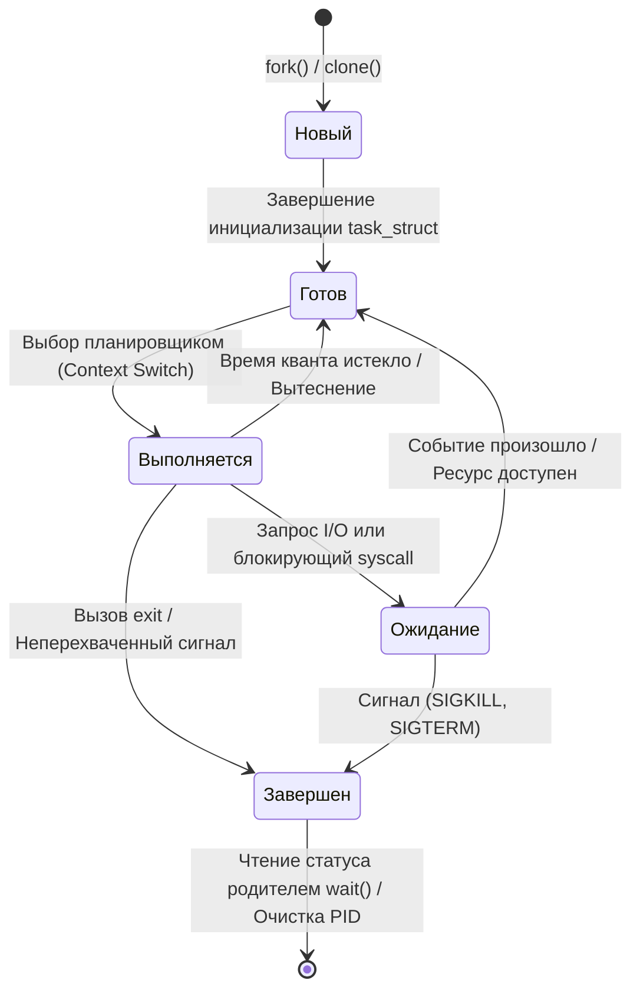

## Что такое процесс в современной ОС

> *«Программа — это всего лишь слова на бумаге; процесс — это драма, разыгрываемая компьютером при их прочтении».*    
> — Вольная инженерная адаптация классического афоризма

Для программиста, только пришедшего в мир Go, понятие «процесс» нередко кажется пыльным пережитком эпохи мэйнфреймов и тяжеловесных демонов C/C++. Мы привыкли легко бросать ключевое слово `go`, порождать десятки тысяч горутин в секунду, передавать данные через каналы и не думать о том, что происходит за пределами нашей программы.

Однако правда состоит в том, что ядро Linux ничего не знает о ваших `go func()`, сетевом поллере или сборщике мусора. Для операционной системы ваш огромный микросервис, обрабатывающий миллион входящих запросов, — это всего лишь **один процесс** (или группа родственных потоков). И если этот единственный процесс исчерпает лимит файловых дескрипторов, получит сокрушительный удар от OOM-киллера ядра или завершится аварийным сигналом, все ваши сотни тысяч горутин мгновенно исчезнут в пустоте.

Чтобы писать надежные распределенные системы, нужно понимать, как устроена среда их обитания.

```
       [ Бинарный файл на диске: ELF / Mach-O / PE ]
                   (Пассивная инструкция)
                            │
                            │ execve() / CreateProcess()
                            ▼
 ┌─────────────────────────────────────────────────────────────┐
 │                  ПРОЦЕСС В ОПЕРАТИВНОЙ ПАМЯТИ               │
 │                                                             │
 │  ┌─────────────────────────┐   ┌─────────────────────────┐  │
 │  │ Виртуальная память      │   │ Таблица дескрипторов    │  │
 │  │ (Text, Data, BSS, Heap) │   │ (0: stdin, 1: stdout...)│  │
 │  └─────────────────────────┘   └─────────────────────────┘  │
 │  ┌─────────────────────────┐   ┌─────────────────────────┐  │
 │  │ Набор прав и Capabilities│  │ Переменные окружения    │  │
 │  │ (UID, GID, Seccomp)     │   │ (ENV, CWD, Argv)        │  │
 │  └─────────────────────────┘   └─────────────────────────┘  │
 │  ┌───────────────────────────────────────────────────────┐  │
 │  │ Потоки исполнения (OS Threads / task_struct)          │  │
 │  │ ┌───────────────┐ ┌───────────────┐ ┌───────────────┐ │  │
 │  │ │ Thread 1 (m0) │ │ Thread 2 (m1) │ │ Thread 3 (m2) │ │  │
 │  │ └───────────────┘ └───────────────┘ └───────────────┘ │  │
 │  └───────────────────────────────────────────────────────┘  │
 └─────────────────────────────────────────────────────────────┘
```

**Процесс** — это экземпляр исполняемой программы, находящийся в памяти, которому ядро ОС выделяет изолированное виртуальное адресное пространство, набор файловых дескрипторов, переменные окружения, права доступа и уникальный числовой идентификатор (`pid`). 

Если программа на диске — это кулинарный рецепт в книге, то процесс — это повар на кухне, который прямо сейчас читает этот рецепт, задействует сковороды, ножи, плиту, отмеряет специи и следит за таймером.

Ключевое свойство процесса — **изоляция**. Если один процесс упадет с `panic` или получит `SIGSEGV` из-за разыменования нулевого указателя, ядро жестко пресечет попытку нарушить границы и не позволит ему исказить память другого процесса. Это радикально отличается от треда ОС или горутины Go, которые делят единое адресное пространство и требуют предельно аккуратной явной синхронизации.

> [!info] Под капотом
> В Linux процесс — это не магическая сущность, а **структура данных** `task_struct` в пространстве ядра (определенная в заголовочном файле `include/linux/sched.h`). Ядро не «запускает» процесс в бытовом смысле: оно аллоцирует объект `task_struct`, связывает его с таблицами трансляции виртуальных адресов (Page Tables через указатель `mm_struct`), выделяет стек ядра и помещает указатель на этот дескриптор в очередь планировщика. Пока планировщик не выберет этот `task_struct`, процесс существует лишь как запись в памяти ядра.

---

## Жизненный цикл процесса

Жизненный цикл процесса описывается конечным автоматом (FSM) из пяти классических состояний. Переходы между ними детерминированы: ими управляют планировщик ОС, аппаратные таймеры и события (системные вызовы, дисковые прерывания, сетевые пакеты, входящие сигналы).



Разберем эти состояния детально:

1. **Новый (New):** Процесс только что порожден системным вызовом (`fork()`, `vfork()` или `clone()`). Ядро выделяет память под дескриптор `task_struct`, присваивает `pid`, настраивает учетные структуры, но процесс еще не допущен к планированию.
2. **Готов (Ready):** Все ресурсы (память, дескрипторы) выделены, код загружен. Процесс полностью готов совершать полезную работу, но процессор в данный момент занят другими задачами. Процесс терпеливо ждет своей очереди в структуре `runqueue` планировщика.
3. **Выполняется (Running):** Инструкции бинарного кода непосредственно исполняются на арифметико-логических устройствах процессора. На многоядерной системе процесс (или его потоки) может быть распределен по ядрам, но в каждый момент времени конкретный поток исполняется ровно на одном аппаратном ядре или логическом процессоре `M` (в терминологии планировщика Go).
4. **Ожидание/Блокировка (Waiting/Blocked):** Процесс не может продолжать работу, пока не произойдет внешнее событие: завершится чтение блока данных с NVMe-накопителя, придет пакет по TCP-сокету или освободится разделяемый мьютекс. В этом состоянии процесс **не потребляет CPU вообще** — планировщик исключает его из очереди выполнения.
5. **Завершен (Terminated):** Процесс выполнил свои инструкции или был завершен сигналом. В Linux это состояние `TASK_ZOMBIE`, пока родитель не вызовет `wait()`.

---

## Под капотом: task_struct и флаги состояний

В ядре Linux каждый исполняемый контекст представлен гигантской структурой `task_struct` (ее размер может превышать 8–10 килобайт, и она содержит сотни полей). Состояние процесса хранится в поле `state` (в свежих ядрах Linux — `__state`). Это не просто порядковый номер enum, а битовая маска, отражающая режим планирования:

```
                    ┌─────────────────────────────────────────────────────────┐
                    │                   struct task_struct                    │
                    ├─────────────────────────────────────────────────────────┤
                    │ pid_t pid;                 // Идентификатор процесса    │
                    │ pid_t tgid;                // Thread Group ID (PID в OS)│
                    │ unsigned int __state;      // Битовая маска состояния   │
                    │ struct mm_struct *mm;      // Виртуальная память        │
                    │ struct files_struct *files;// Открытые файлы (FD table) │
                    │ struct signal_struct *sig; // Обработчики сигналов      │
                    │ struct task_struct *parent;// Родительский процесс      │
                    │ struct list_head children; // Дочерние процессы         │
                    └─────────────────────────────────────────────────────────┘
```

| Флаг ядра | Символ в `ps` | Значение для разработчика и рантайма |
|---|:---:|---|
| `TASK_RUNNING` | **R** | Процесс находится в состоянии `Готов` или `Выполняется`. Он либо уже исполняет код на ядре CPU, либо находится в очереди планировщика (`runqueue`), готовый взлететь в любую наносекунду. |
| `TASK_INTERRUPTIBLE` | **S** | Прерываемый сон (Sleeping). Процесс ждет события (I/O, сетевой сокет, таймер). Он моментально проснется, если придет долгожданное событие **или любой асинхронный сигнал** (`SIGINT`, `SIGTERM`). |
| `TASK_UNINTERRUPTIBLE` | **D** | Непрерываемый сон (Disk sleep). Процесс ждет низкоуровневого аппаратного события ядра (чтение сектора диска, сброс грязных страниц ФС, ответ от зависшего NFS-сервера). В этом состоянии он **игнорирует абсолютно любые сигналы**, включая `kill -9` (`SIGKILL`). |
| `TASK_ZOMBIE` (или `EXIT_ZOMBIE`) | **Z** | Зомби. Код завершил выполнение, виртуальная память и дескрипторы освобождены, но дескриптор `task_struct` сохраняется в ядре, храня код завершения и статистику, пока родитель не вызовет `wait()`. |
| `TASK_STOPPED` | **T** | Принудительно остановлен сигналом отладчика или терминала (`SIGSTOP`, `SIGTSTP` по Ctrl+Z) или находится под трассировкой (`ptrace`). Процесс замер и ждет сигнала `SIGCONT`. |

> [!warning] Ловушка / Gotcha: Опасность зомби-процессов
> Состояние `TASK_ZOMBIE` не потребляет память процесса (стек, heap, page tables давно освобождены ядром), но **занимает PID**. Если родительский процесс забыл вызвать `wait()`, PID не возвращается в свободный пул ОС.
> 
> На сервере с дефолтным лимитом `/proc/sys/kernel/pid_max` (обычно 32 768 на 32-битных системах или 4 194 304 на современных 64-битных Linux) лавинообразное накопление зомби парализует операционную систему: ни демон мониторинга, ни SSH-сервер, ни сама ОС не смогут создать ни одного нового процесса (`fork: Cannot allocate memory` или `Resource temporarily unavailable`).

---

## Механика переходов и стоимость изоляции

Переход из состояния `Выполняется` в `Готов` (вытеснение по таймеру) или в `Ожидание` (блочинг на вводе-выводе) требует выполнения сложнейшей процедуры ядра — **переключения контекста (Context Switch)**.

Почему переключение процессов стоит ощутимо дороже, чем просто сдвиг указателя инструкций?

1. **Сохранение регистрового состояния CPU:** Текущие значения всех аппаратных регистров общего назначения, указателя стека (`RSP`), указателя следующей инструкции (`RIP`), флагов процессора (`RFLAGS`), а также огромных блоков регистров векторной математики (FPU, AVX-512, сохраняемых инструкцией `XSAVE`/`XRSTOR`) должны быть скопированы в структуры ядра.
2. **Переключение виртуального адресного пространства (Смена MMU):**
   - У каждого процесса своя таблица страниц. Чтобы ядро переключилось на память нового процесса, процессор обязан записать физический адрес корневой таблицы PML4 в специальный регистр управления `CR3`.
   - Запись в `CR3` исторически приводила к **инвалидации TLB (Translation Lookaside Buffer)** — аппаратному сбросу кэша трансляции адресов.
   - На современных процессорах используется механизм PCID (Process-Context Identifiers), позволяющий метить строки TLB идентификатором адресного пространства. Однако если процесс мигрирует между ядрами, ядру приходится слать межпроцессорное прерывание IPI (Inter-Processor Interrupt) и выполнять дорогостоящий **TLB Shootdown** — инвалидацию страниц на удаленных ядрах CPU.
3. **Крах кэшей процессора (Cold Cache Penalty):**
   - Данные, инструкции и структуры в кэшах L1i, L1d и L2 принадлежат старому процессу.
   - Новый процесс стартует на «холодном кэше». Первые сотни микросекунд он страдает от шквала Cache Misses, заставляя шину памяти подгружать байты из медленной оперативной памяти DRAM.

```
       ПЕРЕКЛЮЧЕНИЕ МЕЖДУ ПРОЦЕССАМИ (Тяжеловесно, ~2-5 мкс)
 ┌───────────────┐                             ┌───────────────┐
 │   Процесс A   │ ── Сохранение регистров ──> │   Ядро (OS)   │
 │   (Memory A)  │ ── Запись в CR3 (MMU) ────> │               │
 └───────────────┘ ── Сброс/инвалидация TLB ─> └───────────────┘
                                                       │
                                   Загрузка состояния  │
                                                       ▼
                                               ┌───────────────┐
                                               │   Процесс B   │
                                               │   (Memory B)  │
                                               └───────────────┘

       ПЕРЕКЛЮЧЕНИЕ ГОРУТИН В GO (Легковесно, ~10-200 нс)
 ┌───────────────┐                             ┌───────────────┐
 │   Горутина G1 │ ── Сохранение 14 регистров  │ Рантайм Go    │
 │ (Стек ~2-4 КБ)│ ── CR3 НЕ МЕНЯЕТСЯ! ──────> │ (User Space)  │
 └───────────────┘ ── TLB НЕ СБРАСЫВАЕТСЯ! ──> └───────────────┘
                                                       │
                                   Указатель на стек G │
                                                       ▼
                                               ┌───────────────┐
                                               │   Горутина G2 │
                                               │ (Стек ~2-4 КБ)│
                                               └───────────────┘
```

**Стоимость:** Полновесный Context Switch между двумя процессами на x86-64 обходится в среднем в **2–5 микросекунд** процессорного времени (плюс косвенные потери на промахах кэша). Системный вызов без смены адресного пространства (~50–100 нс) обходится в десятки раз дешевле.

Именно колоссальная стоимость межпроцессного переключения заставила создателей Go спроектировать рантайм на легковесных горутинах: смена активной горутины происходит полностью в User Space всего за **100–200 наносекунд**!

> [!tip] Собеседование
> **Вопрос:** Почему микросервисы и контейнеры запускают в отдельных процессах ОС, если горутины и потоки внутри одного процесса работают намного быстрее и требуют на порядки меньше ресурсов?
> 
> **Ответ:** Во главу угла ставится **изоляция сбоев (Fault Isolation)** и **безопасность**.
> 1. Если один микросервис страдает от утечки памяти или падает с паникой, ядро ОС изолирует его: соседи продолжают жить без риска повреждения кучи.
> 2. Процессы позволяют задавать жесткие границы квот ресурсов (CPU, RAM, диск) через механизмы `cgroups` и `ulimit`.
> 3. Архитектура процессов дает независимость деплоя и полиглотность: сервис на Go может сосуществовать рядом с сервисом на Python или C++.
> Компромисс архитектора — затраты на сериализацию данных и сетевой/IPC оверхед при общении между изолированными процессами.

---

## Go-специфика: Процессы против Горутин и управление через os/exec

Когда вы собираете проект через `go build` и запускаете бинарник, операционная система видит **ровно один процесс**. 

Внутри этого процесса запускается `runtime` Go. Он инициализирует пул системных потоков ОС (`M`), привязывает их к логическим процессорам рантайма (`P`) и динамически планирует поверх них миллионы легковесных горутин (`G`).

Однако бывают задачи, когда изоляции горутин внутри общего адресного пространства недостаточно:
- Необходимо выполнить внешний бинарник (утилиту `git`, архиватор `tar`, CLI-скрипт).
- Требуется гарантированная изоляция от аварийного завершения C-библиотек (через cgo), где Segfault мгновенно убьет весь Go-процесс.
- Нужно запустить ресурсоемкую недоверенную задачу с возможностью жестко ограничить ее права и память.

Для этих целей в стандартной библиотеке Go предназначен пакет `os/exec`.

```go
package main

import (
	"context"
	"errors"
	"fmt"
	"log"
	"os/exec"
	"time"
)

// runIsolatedTask запускает подпроцесс с контролем времени жизни через context.
func runIsolatedTask(ctx context.Context) error {
	// Создаем команду с привязкой к контексту
	cmd := exec.CommandContext(ctx, "echo", "Hello from subprocess")

	// CombinedOutput запускает процесс, захватывает stdout/stderr
	// и автоматически дожидается завершения (вызывает waitpid)
	output, err := cmd.CombinedOutput()
	if err != nil {
		// exec.ExitError содержит детальный код возврата и статус процесса
		var exitErr *exec.ExitError
		if errors.As(err, &exitErr) {
			return fmt.Errorf("subprocess failed with code %d: %s", exitErr.ExitCode(), string(output))
		}
		return fmt.Errorf("failed to start process: %w", err)
	}

	fmt.Printf("Subprocess output: %s", output)
	return nil
}

func main() {
	ctx, cancel := context.WithTimeout(context.Background(), 2*time.Second)
	defer cancel()

	if err := runIsolatedTask(ctx); err != nil {
		log.Fatalf("Error: %v", err)
	}
}
```

### Управление жизненным циклом в Go

Пакет `os/exec` предоставляет три основных сценария управления порожденным процессом:

1. **Синхронный запуск (`cmd.Run()`, `cmd.Output()`, `cmd.CombinedOutput()`):**  
   Запускает процесс, блокирует текущую горутину (не поток `M`, а именно горутину, уступая процессор другим задачам!), считывает данные из пайпов и автоматически вызывает системный вызов `wait()`, гарантируя отсутствие зомби.
2. **Асинхронный запуск (`cmd.Start()`):**  
   Создает процесс, настраивает каналы I/O и немедленно возвращает управление. В поле `cmd.Process` появляется структура `*os.Process`. На этом этапе процесс работает параллельно в операционной системе.
3. **Ожидание завершения (`cmd.Wait()`):**  
   Блокирует горутину до завершения дочернего процесса. **Обязательно** вызывает системный вызов `waitpid()` в ядре. Именно этот вызов считывает код выхода, сообщает ядру, что статус получен, и переводит состояние из `TASK_ZOMBIE` в `TASK_DEAD` (или `EXIT_DEAD`), освобождая занятый `pid`.
4. **Отказ от владения (`cmd.Process.Release()`):**  
   Вызов освобождает внутренние файловые структуры дескриптора процесса в памяти Go runtime. Однако будьте осторожны: `cmd.Process.Release()` **не вызывает `wait()`** в ядре! Если запущенный дочерний процесс завершится позже, он зависнет в состоянии `TASK_ZOMBIE` до тех пор, пока родительский процесс Go не завершится целиком, передав зомби на усыновление процессу `init`.

> [!info] Под капотом: Как Go запускает дочерние процессы
> Когда в Go вызывается `exec.Command`, под капотом рантайм вызывает функцию `syscall.ForkExec` (или `runtime.forkExec`).
> В Linux для создания процесса Go использует системный вызов `clone` с флагами `CLONE_VFORK | CLONE_VM | SIGCHLD`.
> Это позволяет избежать дорогого дублирования таблиц страниц родителя: дочерний процесс временно делит память с родителем, пока сразу же не вызовет `execve()`, который полностью сотрет старое адресное пространство и загрузит новый бинарник. Классическая связка `fork + exec` раскрыта в [[6. Как Linux создает процессы. fork, exec, wait.md]].

---

## Ловушки и типичные вопросы с собеседований

### 1. Zombie vs Orphan процессы

Две классические аномалии жизненного цикла, с которыми неизбежно сталкивается каждый бэкенд-инженер:

```
        РОДИТЕЛЬ И ДОЧЕРНИЙ ПРОЦЕСС: ДВЕ АНОМАЛИИ ЖИЗНЕННОГО ЦИКЛА

  Случай 1: Zombie (Зомби)              Случай 2: Orphan (Сирота)
  ┌─────────────────────────┐          ┌─────────────────────────┐
  │ Родитель (PID 100)      │          │ Родитель (PID 100)      │
  │ Забыл вызвать wait()    │          │ Внезапно завершился ──x │
  └───────────┬─────────────┘          └─────────────────────────┘
              │                                     │ Дочерний остался
              ▼                                     ▼
  ┌─────────────────────────┐          ┌─────────────────────────┐
  │ Ребенок (PID 101)       │          │ Ребенок (PID 101)       │
  │ Завершился (TASK_ZOMBIE)│          │ Работает в фоне         │
  └─────────────────────────┘          └────────────┬────────────┘
  * Висит в таблице ядра               * Усыновляется PID 1 (init/systemd)
  * Блокирует PID                      * PID 1 автоматически вызывает wait()
```

- **Zombie (Зомби):** Дочерний процесс уже умер, но его родитель жив и не вызвал `wait()`/`waitpid()`.
  - *Симптомы:* В выводе `ps aux` процесс помечен буквой `Z` или строкой `<defunct>`.
  - *Чем опасен:* Не потребляет RAM, но держит запись в PID Table. Попытка убить зомби командой `kill -9 <pid>` бесполезна — процесс *уже мертв*! Единственный способ убрать зомби — либо заставить родителя вызвать `wait()`, либо завершить самого родителя (`kill <parent_pid>`).
  - *Решение в Go:* Всегда вызывайте `cmd.Wait()` при использовании `cmd.Start()`, либо контролируйте порождение через `cmd.Run()`.
- **Orphan (Процесс-сирота):** Родительский процесс завершился раньше, чем его дочерний потомок.
  - *Что происходит:* Дочерний процесс продолжает честно исполнять свой код. Ядро не убивает его, а находит нового родителя: `ppid` процесса перезаписывается на `init` (PID 1) или системный демон `systemd`.
  - *Subreaper в современном Linux:* Начиная с Linux 3.4, любой процесс может объявить себя «суб-родителем» через системный вызов `prctl(PR_SET_CHILD_SUBREAPER, 1)`. Именно так работают менеджеры контейнеров (Docker, containerd) и утилиты вроде `tini` / `dumb-init`, предотвращая утечку зомби в контейнерах.

### 2. Resource Limits (ulimit / rlimit)

Каждый процесс подчиняется жесткой системе квот ядра, известной как **POSIX resource limits**. 

Ядро хранит два значения для каждого лимита: **Soft limit** (мягкий порог, при достижении которого процесс получает ошибку или сигнал, но может сам повысить лимит до жесткого) и **Hard limit** (потолок, повышать который имеет право только `root`).

Ключевые ограничения для высоконагруженных Go-сервисов:
- `RLIMIT_NOFILE` (`nofile`): Максимальное количество открытых файловых дескрипторов. В бэкенде сетевые соединения (TCP-сокеты), файлы логов, пайпы и каналы epoll — это всё файловые дескрипторы. Если лимит равен дефолтным 1024, сервис рухнет при попытке принять 1025-е входящее соединение (`accept: too many open files` или `ulimit: open files limit exceeded`).
- `RLIMIT_NPROC` (`nproc`): Максимальное число процессов и потоков, доступных пользователю. Превышение лимита блокирует системные вызовы `clone()` и `fork()`.
- `RLIMIT_STACK` (`stack`): Максимальный размер стека системного потока (обычно 8 МБ).
- `RLIMIT_AS` (Address Space): Максимальный размер виртуальной памяти процесса.

В языке Go управлять этими параметрами можно программно с помощью пакета `syscall`:

```go
package main

import (
	"fmt"
	"log"
	"syscall"
)

func tuneFileLimits() error {
	var rLimit syscall.Rlimit
	
	// Получаем текущие лимиты на файловые дескрипторы
	if err := syscall.Getrlimit(syscall.RLIMIT_NOFILE, &rLimit); err != nil {
		return fmt.Errorf("error getting rlimit: %w", err)
	}
	
	fmt.Printf("Current limits: Cur=%d, Max=%d
", rLimit.Cur, rLimit.Max)
	
	// Поднимаем Soft Limit до максимума Hard Limit
	rLimit.Cur = rLimit.Max
	if err := syscall.Setrlimit(syscall.RLIMIT_NOFILE, &rLimit); err != nil {
		return fmt.Errorf("error setting rlimit: %w", err)
	}
	
	fmt.Printf("Updated limits: Cur=%d, Max=%d
", rLimit.Cur, rLimit.Max)
	return nil
}
```

Если процесс превышает определенные лимиты ядра (например, CPU time `RLIMIT_CPU` или размер файла `RLIMIT_FSIZE`), ядро прерывает его сигналами `SIGXCPU` или `SIGKILL`.

### 3. Вопрос на собеседовании

> **«В чем разница между процессом и горутиной с точки зрения переключения контекста и потребления памяти?»**
> 
> **Ответ архитектора:**
> 1. **Изоляция и адресное пространство:**  
>    Процесс обладает изолированным виртуальным адресным пространством, описанным собственной таблицей страниц. Горутины существуют внутри единого процесса и свободно делят общую память кучи (heap).
> 2. **Механика Context Switch:**  
>    - **Процесс:** Переключение выполняется ядром ОС в Ring 0. Требует сохранения десятков регистров CPU, перезаписи регистра `CR3`, инвалидации строк TLB и приводит к тотальному промаху по кэшам L1/L2. Стоимость: **~2–5 микросекунд**.
>    - **Горутина:** Переключение выполняется планировщиком Go в User Space (Ring 3). Рантайм переключает горутины в User Space через ассемблерные механизмы планировщика (`mcall`, `gogo`), сохраняет минимальный контекст в структуре `gobuf` (SP, PC, BP, g), меняет указатель текущей горутины и мгновенно возобновляет выполнение. Регистр `CR3` и TLB не затрагиваются. Стоимость: **~10–20 наносекунд** (в сотни раз быстрее!).
> 3. **Потребление памяти:**  
>    - **Процесс/Поток ОС:** Требует дескриптор `task_struct` в ядре (~8 КБ) и фиксированный стек (обычно 2–8 МБ в зависимости от `ulimit`). Запуск 100 000 системных процессов или потоков моментально исчерпает сотни гигабайт RAM и обрушит ОС.
>    - **Горутина:** Создается со стеком размером всего **2 КБ**. По мере необходимости рантайм динамически аллоцирует новый непрерывный блок памяти и копирует стек. 100 000 горутин потребуют всего ~250 МБ оперативной памяти, что позволяет современным Go-сервисам без труда удерживать сотни тысяч одновременных соединений на одном стандартном сервере.

---

## Итог

1. **Процесс** — это фундаментальная единица изоляции в ОС. Он включает виртуальное адресное пространство, дескриптор `task_struct` в ядре, открытые файлы, переменные окружения и один или несколько потоков исполнения.
2. **Жизненный цикл** управляется конечным автоматом ядра: `Новый → Готов → Выполняется → Ожидание → Завершен`. Процесс в состоянии `TASK_UNINTERRUPTIBLE` (D) не реагирует даже на `SIGKILL`, пока не завершится его обращение к железу.
3. **Переключение контекста процесса** — ресурсоемкая операция ядра. Смена таблиц страниц (`CR3`), инвалидация TLB и холодные кэши требуют микросекунд драгоценного времени CPU.
4. **Рантайм Go** мультиплексирует тысячи горутин (`G`) на небольшое количество потоков ОС (`M`), сохраняя адресное пространство единым и снижая стоимость переключения до наносекунд.
5. Для взаимодействия с внешними процессами в Go используется пакет `os/exec`. Не забывайте вызывать `cmd.Wait()`: иначе вы рискуете породить армию неубиваемых зомби (`TASK_ZOMBIE`) и исчерпать общесистемный лимит `/proc/sys/kernel/pid_max`.
6. Лимиты `ulimit` (особенно `RLIMIT_NOFILE`) — первая линия обороны бэкенда. При старте высоконагруженного сервиса обязательно проверяйте квоты через `syscall.Getrlimit` и `syscall.Setrlimit`.

В следующей статье [[6. Как Linux создает процессы. fork, exec, wait.md]] мы заглянем в самое сердце рождения процессов: разберем магию системных вызов `fork`, `execve` и `wait`, раскроем трюк Copy-On-Write и посмотрим, как ядро защищает себя от перегрузок.
