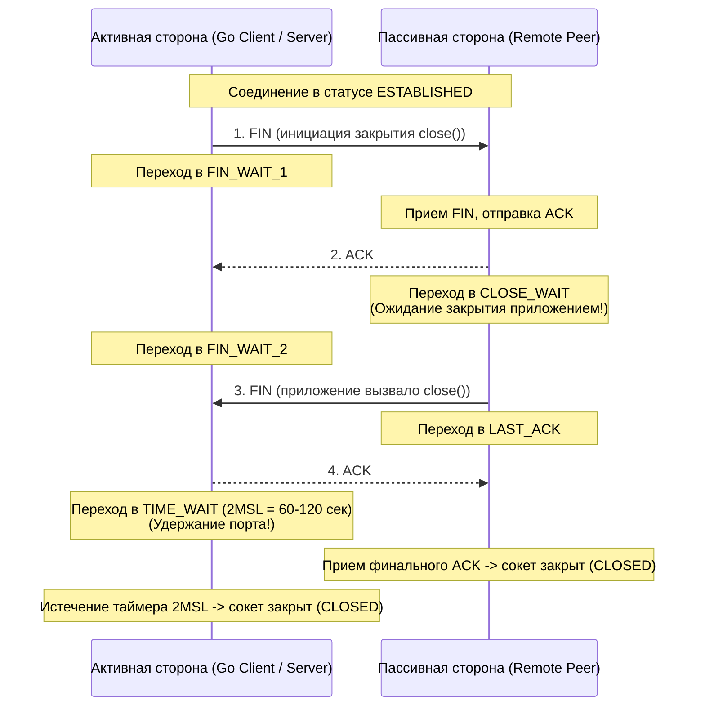
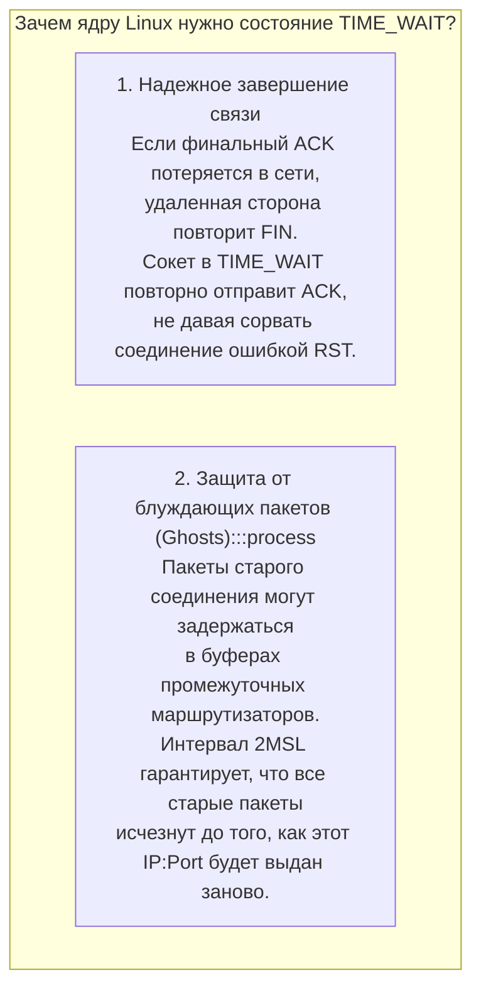

# 50. TIME_WAIT, CLOSE_WAIT и проблемы сокетов в Linux и Go

> *«Открыть канал связи несложно; подлинная проверка инженерной зрелости — закрыть его корректно, не оставляя бродить по сети призраков».*    
> — Свободный афоризм в духе классиков сетевых протоколов

---

## Введение: TCP State Machine и влияние на бэкенд

В инженерной практике бэкенд-разработчика мало что вызывает такое недоумение, как сервер, который медленно и неотвратимо угасает при почти нулевой загрузке центрального процессора и гигабайтах свободной оперативной памяти. Графики бизнес-метрик устремляются вниз, клиенты получают обрывы соединений, а в логах Go-сервиса начинают сыпаться фатальные системные ошибки: `cannot assign requested address` или `too many open files`.

Вы подключаетесь к серверу по SSH, запускаете утилиту `ss -tanp` и замираете: тысячи сетевых сокетов застряли в таинственных состояниях `TIME_WAIT` или `CLOSE_WAIT`.

Каждое сетевое TCP-соединение на протяжении своей жизни подчиняется строгому конечному автомату состояний (**TCP State Machine**), стандартизированному в [RFC 793](https://tools.ietf.org/html/rfc793). В Go мы привыкли укрываться от этих низкоуровневых деталей за абстракциями `net.Conn`, `http.Client` и `http.Transport`. Однако в момент закрытия соединения сетевой стек ядра Linux вступает в фазу четырехэтапного разрыва (4-Way Teardown), где любая небрежность прикладного кода или непонимание физики протокола оборачивается исчерпанием портов и отказом в обслуживании.



---

## TIME_WAIT: Активное закрытие и 2MSL

Состояние `TIME_WAIT` возникает исключительно на **активной стороне закрытия** — то есть на том конце соединения, который первым инициировал разрыв связи, вызвав системный вызов `close()` (или отправив пакет с флагом `FIN`).

После отправки финального подтверждения `ACK` в ответ на встречный `FIN` сокет не уничтожается сразу: он переходит в статус `TIME_WAIT` и замирает ровно на интервал **2MSL** (Two Maximum Segment Lifetime). Величина MSL — это максимальное расчетное время жизни IP-дейтаграммы в глобальной сети. В ядре Linux значение MSL жестко зафиксировано константой `TCP_TIMEWAIT_LEN` и составляет 60 секунд. Соответственно, интервал **2MSL длится ровно 120 секунд (2 минуты)** (в современных ядрах иногда калибруется до 60 с).



---

### Зачем ядру нужно это состояние?

1. **Гарантия доставки финального ACK:** Если последний `ACK` от активной стороны потеряется из-за сбоя в сети, пассивная сторона сочтет свой `FIN` недошедшим и отправит повторный `FIN`. Если бы сокет активной стороны был немедленно уничтожен, ядро ответило бы на повторный `FIN` жестким пакетом `RST` (сброс), посчитав его ошибочным. Состояние `TIME_WAIT` позволяет серверу корректно переотправить `ACK` и дать партнеру спокойно закрыться.
2. **Очистка «призрачных» пакетов:** В глобальной маршрутизации пакеты могут задерживаться и приходить с опозданием в десятки секунд. Если бы операционная система сразу выдала этот же локальный порт для нового соединения к тому же удаленному сервису, задержавшийся пакет из прошлой сессии попал бы в новое соединение, вызвав искажение данных. Тайм-аут 2MSL гарантирует полную очистку сети от старых сегментов.

> [!info] Под капотом: Архитектура `tcp_death_row` и легковесные сокеты
> На высоконагруженных серверах в состоянии `TIME_WAIT` могут одновременно находиться десятки тысяч соединений. Если бы ядро удерживало для каждого из них полноразмерную структуру `struct tcp_sock` (занимающую около 2 КБ оперативной памяти и связанные структуры буферов), сервер быстро исчерпал бы системную память.  
> 
> Поэтому ядро Linux выполняет оптимизацию: при переходе в `TIME_WAIT` полноценный сокет уничтожается, а вместо него аллоцируется миниатюрная структура **`struct tcp_time_wait`** (всего около 160 байт), содержащая только 4-tuple адресов и таймер.  
> Эти структуры помещаются в глобальную хеш-таблицу ядра — **`tcp_death_row`**. Обратный отсчет ведется легковесным таймером `tw_timer` (измеряемым в тиках ядра — jiffies). Когда таймер истекает, ядро вызывает `tcp_tw_recycle()` (в старых ядрах) или просто удаляет запись из хэша. Сокет в `TIME_WAIT` не регистрируется в `epoll`, не потребляет такты CPU и не может принимать данные, но удерживает за собой локальный номер порта (`IP:Port`).

> [!warning] Ловушка / Gotcha: Исчерпание портов (Port Exhaustion)
> Если ваш Go-сервис выступает в роли клиента (например, ходит в upstream API, СУБД или микросервисы) и на каждый запрос наивно создает новое соединение через `http.Get()` без переиспользования сокетов, активное закрытие будет происходить на вашей стороне.  
> 
> Диапазон эфемерных портов Linux (`ip_local_port_range`) обычно содержит около 28 000 – 60 000 портов. При темпе 500 запросов в секунду пул свободных портов будет полностью выжжен менее чем за 1 минуту!  
> В результате новые вызовы `net.Dial` начнут падать с ошибкой ядра **`cannot assign requested address`** (`EADDRNOTAVAIL`), хотя удаленный сервер абсолютно свободен и готов принимать соединения.

---

## CLOSE_WAIT: Пассивное закрытие и утечки приложения

Состояние `CLOSE_WAIT` возникает на **пассивной стороне закрытия** — то есть на узле, который получил пакет `FIN` от удаленного партнера, и сетевой стек ядра автоматически подтвердил его получение пакетом `ACK`.

Состояние `CLOSE_WAIT` буквально кричит разработчику:  
*«Удаленный партнер закрыл свою сторону соединения. Сетевой стек Linux обработал FIN и сообщил приложению (вернув `io.EOF` при чтении), но само прикладное приложение на Go ДО СИХ ПОР не вызвало метод `conn.Close()`!»*

```mermaid
flowchart LR
    classDef process  fill:#1e293b,stroke:#38bdf8,stroke-width:1px,color:#f8fafc
    classDef success  fill:#064e3b,stroke:#34d399,stroke-width:1px,color:#f8fafc
    classDef error    fill:#7f1d1d,stroke:#f87171,stroke-width:1px,color:#f8fafc
    classDef warning  fill:#78350f,stroke:#fbbf24,stroke-width:1px,color:#f8fafc
    classDef entry    fill:#1e3a5f,stroke:#38bdf8,stroke-width:2px,color:#f8fafc
    classDef aux      fill:#334155,stroke:#64748b,stroke-width:1px,color:#f8fafc
    classDef system   fill:#312e81,stroke:#a78bfa,stroke-width:1px,color:#f8fafc
    classDef data     fill:#132d29,stroke:#2dd4bf,stroke-width:1px,color:#f8fafc
    classDef network  fill:#881337,stroke:#fb7185,stroke-width:1px,color:#f8fafc
    classDef accent   fill:#1e1b4b,stroke:#818cf8,stroke-width:1px,color:#f8fafc
    Remote["Удаленный узел"]:::system -->|"Отправил FIN"| Kernel["Ядро Linux"]
    Kernel -->|"Отправил ACK
(перешел в CLOSE_WAIT)"| Remote
    Kernel -.->|"Сигнал: io.EOF"| GoApp["Go Приложение"]
    GoApp -.->|"Забыли вызвать conn.Close()!"| Leak["Утечка fd и сокета в CLOSE_WAIT"]
```



---

### Почему это происходит в Go?

В отличие от `TIME_WAIT`, которое является естественным физическим состоянием протокола TCP, зависание сокетов в `CLOSE_WAIT` — это **в 99.9% случаев грубый баг в коде вашего приложения**:

1. **Забытый `conn.Close()`:** Горутина прочитала данные из `net.Conn`, наткнулась на ошибку `io.EOF`, завершила цикл обработки, но разработчик забыл вызвать `conn.Close()` (например, не поставил `defer conn.Close()` в начале обработчика).
2. **Непрочитанное тело ответа (`resp.Body`):** В стандартном клиенте `http.Client`, если приложение прочитало только часть заголовков или данных, но не вычитало тело до конца через `io.Copy(io.Discard, resp.Body)` или `drain` и не вызвало `resp.Body.Close()`, базовое TCP-соединение не может вернуться в пул и зависает в `CLOSE_WAIT`.
3. **Утечка в пуле соединений `http.Transport`:** Если удаленный микросервис штатно разорвал Keep-Alive соединение по таймауту, но пул `Transport` из-за некорректных блокировок или утечек горутин не освободил дескриптор, сокет будет висеть в `CLOSE_WAIT` бесконечно — ядро Linux не имеет таймаута для `CLOSE_WAIT` (параметр `tcp_fin_timeout` управляет исключительно состоянием `FIN-WAIT-2` на активной стороне закрытия), поэтому сокет в `CLOSE_WAIT` останется до явного вызова `Close()` или завершения процесса.

> [!tip] Собеседование
> **Вопрос:** Как на нагруженном сервере мгновенно определить, вызвана ли деградация сокетов состоянием `TIME_WAIT` или `CLOSE_WAIT`, и в чем фундаментальная разница для разработчика?
> 
> **Ответ:** 
> - **`TIME_WAIT`** — это активное закрытие. Сокет принадлежит ядру (`struct tcp_time_wait`), файловый дескриптор в приложении уже закрыт, утечки памяти процесса нет. Опасность заключается исключительно в исчерпании свободных исходящих портов (ephemeral ports) при частых коротких исходящих соединениях. Лечится пулингом соединений (Connection Pooling, Keep-Alive).
> - **`CLOSE_WAIT`** — это пассивное закрытие. Сокет все еще удерживается процессом, файловый дескриптор открыт (`fd` не освобожден). Это полноценная **утечка ресурсов внутри Go-кода**. По мере накопления сокетов в `CLOSE_WAIT` процесс исчерпает лимит открытых файлов (`ulimit -n`) и упадет с паникой `too many open files`. Лечится поиском забытых `defer conn.Close()` и закрытием `resp.Body`.

---

## Go-специфика: Управление соединениями и SO_REUSEPORT

Стандартная библиотека Go предоставляет богатый арсенал средств для низкоуровневого контроля за поведением сокетов при закрытии и перезапуске.

---

### SO_REUSEADDR vs SO_REUSEPORT

Для сетевого инженера критически важно понимать принципиальную разницу между этими системными флагами:

| Системный флаг | Механика работы в ядре Linux | Влияние на состояние TIME_WAIT | Применение в Go |
|---|---|---|---|
| `SO_REUSEADDR` | Разрешает привязать сокет к локальному порту (`bind`), даже если на нем уже висят старые сокеты в состоянии `TIME_WAIT`. | ✅ Позволяет мгновенно перезапустить Go-сервис без ожидания 120 секунд. Не удаляет `TIME_WAIT` из ядра. | Включается в Go автоматически при вызове `net.Listen("tcp", ":8080")`. |
| `SO_REUSEPORT` | Позволяет **нескольким независимым процессам** (или потокам) биндиться на один и тот же IP:Port. Ядро распределяет входящие SYN по очередям сокетов. | ❌ Никак не влияет на `TIME_WAIT`. Решает проблему масштабирования на многоядерных CPU. | Доступен через хук `net.ListenConfig.Control` и системный пакет `unix.SetsockoptInt`. |

> [!info] Под капотом: SO_REUSEPORT и масштабируемость Go-серверов
> Начиная с версии Go 1.11 и ядер Linux 3.9+, флаг `SO_REUSEPORT` стал мощнейшим инструментом высокопроизводительной архитектуры. Когда несколько процессов (или форков) открывают слушающий сокет с `SO_REUSEPORT` на одном порту, ядро Linux использует четырехэлементный хеш входящего пакета (4-tuple hash) для равномерного распределения соединений между очередями `accept` разных слушателей.  
> Это полностью устраняет contention (борьбу за блокировку `listen_lock`) внутри ядра, позволяя масштабировать обработку новых сетевых подключений линейно по числу ядер CPU.

---

### Управление таймаутами и linger

В стандартной библиотеке Go существует метод `conn.(*net.TCPConn).SetLinger(sec)`, который транслируется в системную опцию сокета `SO_LINGER`:

```go
package main

import (
	"fmt"
	"net"
	"time"
)

func configureSocketLinger(conn net.Conn) error {
	tcpConn, ok := conn.(*net.TCPConn)
	if !ok {
		return fmt.Errorf("не является TCP-соединением")
	}

	// 1. По умолчанию: graceful close с фоновым сбросом буферов
	// 2. Установка положительного linger: блокировка Close() на указанное время
	linger := 30 * time.Second
	if err := tcpConn.SetLinger(int(linger.Seconds())); err != nil {
		return err
	}

	// 3. Установка linger = 0: Абортивное жесткое закрытие!
	// При вызове Close() ядро не отправляет FIN и не входит в TIME_WAIT,
	// а немедленно сбрасывает соединение пакетом RST.
	// tcpConn.SetLinger(0) // Использовать с крайней осторожностью!

	return nil
}
```

Если установить `linger = 0`, операционная система при вызове `conn.Close()` откажется от классического 4-этапного закрытия: сокет будет немедленно уничтожен, в сеть уйдет жесткий пакет `RST`, а состояние `TIME_WAIT` вообще не будет создано. Это полностью ликвидирует проблему `TIME_WAIT`, но **ломает гарантии надежной доставки данных TCP** и может оборвать транзакции клиентов на полуслове!

---

## Диагностика и оптимизация

---

### Как мониторить состояния

Для комплексного анализа состояния сокетов на продакшен-сервере используются утилиты `ss` (Socket Statistics) и классический `netstat`:

```bash
# 1. Сводная статистика по всем состояниям TCP сокетов
ss -s

# 2. Подсчет распределения сокетов по состояниям прямо сейчас
ss -tanp | awk '{print $1}' | sort | uniq -c | sort -nr

# 3. Детальный просмотр соединений в проблемных статусах
ss -tan state time-wait
ss -tan state close-wait
```

---

### Стратегии борьбы с TIME_WAIT

1. **Connection Pooling (Пулинг постоянных соединений):** Всегда используйте переиспользуемые HTTP-клиенты с пулом Keep-Alive. Настраивайте параметры `http.Transport`: `MaxIdleConns`, `MaxIdleConnsPerHost` и `IdleConnTimeout`. Один постоянный TCP-канал, прокачивающий тысячи запросов, исключает постоянные циклы открытия/закрытия сокетов.
2. **Включение `SO_REUSEADDR`:** Гарантирует, что перезапуск вашего Go-демона пройдет без ошибок биндинга портов.
3. **Расширение диапазона эфемерных портов:** Увеличьте пул доступных портов ядра:
   ```bash
   sysctl -w net.ipv4.ip_local_port_range="1024 65535"
   ```
4. **Переход на HTTP/2 и gRPC:** Мультиплексирование сотен параллельных запросов внутри единого TCP-соединения радикально разгружает подсистему сокетов ядра.

---

### Стратегии борьбы с CLOSE_WAIT

1. **Жесткий аудит закрытия дескрипторов:** Всегда закрывайте сетевые ресурсы через идиоматический `defer`:
   ```go
   resp, err := client.Do(req)
   if err != nil {
       return err
   }
   defer resp.Body.Close() // Обязательно!
   _, _ = io.Copy(io.Discard, resp.Body) // Вычитываем тело для возврата conn в пул
   ```
2. **Трассировка системных вызовов:** Утилита `strace -p <pid> -e trace=close` позволяет отследить, вызывается ли сисколл закрытия дескриптора при получении `EOF`.
3. **Настройка системного таймаута:** Параметр `net.ipv4.tcp_fin_timeout` (по умолчанию 60с) определяет время ожидания пакета `FIN` на стадии закрытия и может временно ограничить разрастание зависших сессий.

---

## Итог

1. **`TIME_WAIT`** — это естественное, защитное состояние активной стороны закрытия, длящееся 2MSL. Оно предотвращает искажение данных блуждающими пакетами и гарантирует доставку финального подтверждения. В Go бороться с ним нужно не отключением проверок, а пулингом соединений (`http.Transport`).
2. **`CLOSE_WAIT`** — это маркер утечки файловых дескрипторов на пассивной стороне. Если сокет завис в `CLOSE_WAIT`, ищите незакрытый `conn.Close()` или забытый `resp.Body.Close()`.
3. **Рантайм Go** эффективно использует современные механизмы ядра Linux (`SO_REUSEADDR`, `SO_REUSEPORT`, неблокирующий `epoll`), но управление жизненным циклом протокола TCP требует от инженера глубокого понимания семантики закрытия соединений.
4. **Инструментарий надежности**: Знание утилит `ss`, параметров `SetLinger` и мониторинг метрик сокетов позволяют проектировать бэкенды, устойчивые к экстремальным сетевым нагрузкам.

Мы завершили детальный разбор состояний и очередей протокола TCP. Но прежде чем пакет отправится по сети, приложение должно превратить доменное имя в IP-адрес. В следующей статье мы разберем: [[51. DNS глазами ОС и libc.md]], выясним, как Go резолвит хосты, почему системный `net.LookupHost` может заморозить потоки ОС и как устроена подсистема NSS в Linux.
