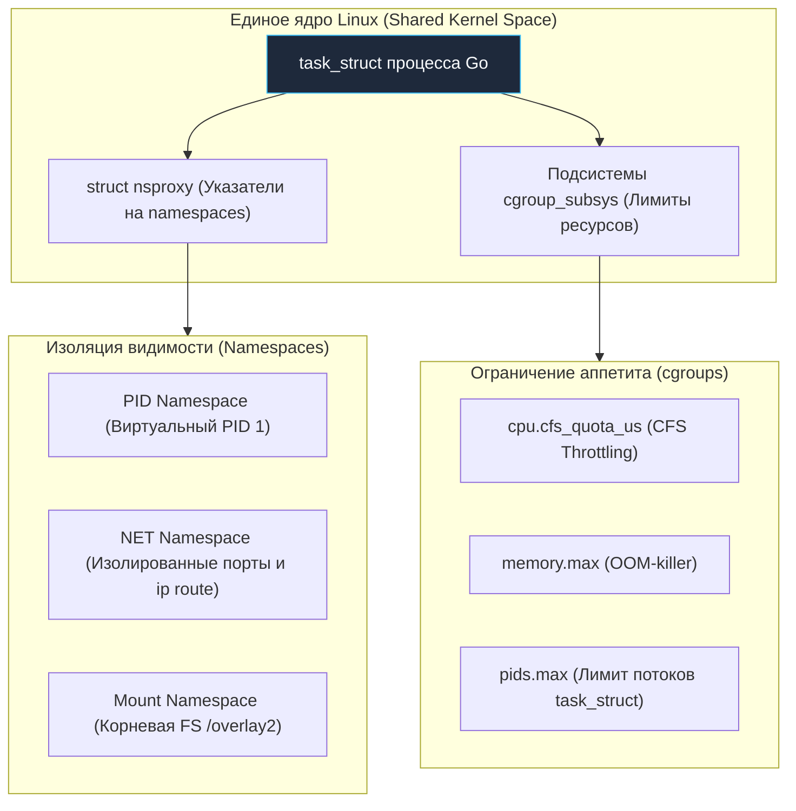
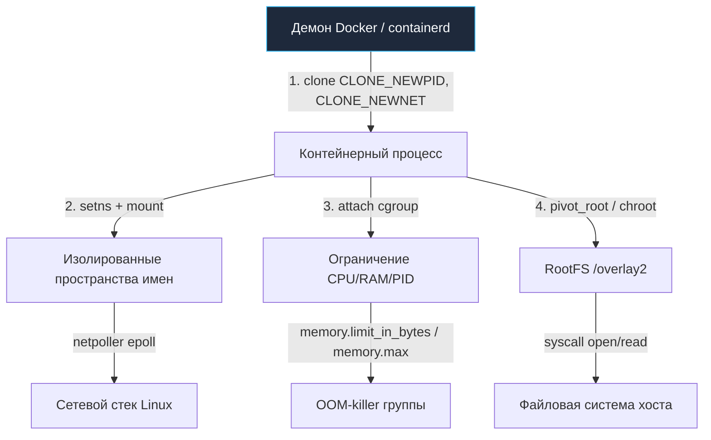

# 54. Изоляция процессов в Linux: Namespaces, cgroups и семантика PID 1

> *«Актер на сцене может искренне верить, что находится в средневековом замке, но заведующий сценой знает: стены вокруг — всего лишь крашеный холст».*    
> — Принцип иллюзорной изоляции процессов в ядре Linux

---

## Фундамент контейнеризации: Namespaces и cgroups

В современной бэкенд-разработке на Go мы почти никогда не развертываем сервисы на «голом» физическом сервере. Практически каждое микросервисное приложение упаковывается в OCI-образ и запускается внутри контейнера под управлением Kubernetes или Docker. 

Однако за удобными абстракциями манифестов легко упустить ключевую деталь: **контейнер — это не виртуальная машина**. Внутри контейнера нет гостевого ядра, нет прослойки гипервизора и нет эмуляции аппаратных регистров. Это самый обыкновенный процесс операционной системы, которому ядро Linux навязало особые условия видимости и жесткие рамки потребления ресурсов.

Изоляция в Linux строится не на аппаратной эмуляции, а на элегантном симбиозе двух внутренних подсистем ядра:
1. **Namespaces (Пространства имен):** Создают иллюзию индивидуальной операционной системы, скрывая чужие процессы, сетевые адаптеры и файловые структуры.
2. **cgroups (Контрольные группы):** Гарантируют физический контроль и учет ресурсов хоста (квоты CPU, лимиты памяти RAM, пропускная способность ввода-вывода).

Для разработчика на Go понимание этих механизмов критично: они напрямую определяют поведение рантайма `runtime`, расчет пулов потоков `GOMAXPROCS`, обработку системных сигналов завершения в PID 1 и работу сетевого поллера `netpoller`.



---

## Namespaces: Виртуализация системных ресурсов

**Namespaces** — это механизм ядра Linux, который скрывает от процесса глобальные системные таблицы и предоставляет ему взамен изолированную локальную проекцию. С точки зрения программы на Go, она работает в отдельной операционной системе, хотя на самом деле делит такты процессора с сотнями других процессов на том же физическом кремнии.

Под капотом ядро Linux связывает каждый процесс (`task_struct`) с набором пространств имен через структуру **`struct namespace`** (точнее, через контейнер указателей `nsproxy`). Когда приложение обращается к системным вызовам (`getpid`, `socket`, `mount`, `kill`), ядро извлекает данные не из глобальных таблиц хоста, а строго из структур, привязанных к текущему пространству имен процесса.

---

### Типы пространств имен (Linux 5.x+)

| Namespace | Что изолирует от хоста | Внутренняя структура ядра |
|:---:|:---|:---:|
| `UTS` | Имя сетевого узла (`hostname`) и доменное имя NIS | `struct uts_namespace` |
| `IPC` | Межпроцессное взаимодействие: семафоры System V, очереди сообщений, разделяемая память | `struct ipc_namespace` |
| `Network` | Сетевой стек: интерфейсы (lo, eth0), маршруты `ip route`, iptables, сокеты и порты | `struct net` |
| `Mount` | Таблица точек монтирования: файловая иерархия, `/proc`, `/sys`, дисковые тома | `struct fs_struct` (и `struct mnt_namespace`) |
| `PID` | Иерархия процессов: локальная нумерация. Процесс становится PID 1 внутри песочницы | `struct pid` (и `struct pid_namespace`) |
| `User` | Трансляция прав: процесс может быть `root` внутри, но обычным пользователем на хосте | `struct user_namespace` |
| `Cgroup` | Изоляция путей и видимости контрольных групп в `/sys/fs/cgroup/` | `struct cgroup` |

> [!info] Под капотом: Древовидная иерархия в PID Namespace
> Когда процесс порождается с системным флагом `CLONE_NEWPID` (через вызовы `clone()` или `unshare()`), ядро Linux выделяет новую структуру `pid_namespace` и назначает новому процессу локальный идентификатор **PID 1**.  
> 
> Все дочерние процессы, порожденные внутри этой ветки, получают номера, начиная с 1, строго относительно этой изолированной структуры. При этом на самом хосте тот же самый процесс имеет глобальный уникальный идентификатор (например, PID 18452). Убедиться в этом можно, заглянув в псевдофайловую систему ядра: `/proc/<real_pid>/ns/pid`.

---

## cgroups: Контроль и ограничение ресурсов

Если Namespaces дарят процессу психологический комфорт и иллюзию изоляции, то контрольные группы **cgroups** защищают физический сервер от аппетитов этого процесса. Без контрольных групп любой аварийный цикл в Go-сервисе или утечка памяти в горутинах привели бы к исчерпанию всей физической RAM хоста и аварийному срабатыванию системного `OOM-killer`.

Подсистема cgroups (Control Groups) обеспечивает строгий учет, приоритизацию и ограничение ключевых аппаратных ресурсов сервера: CPU, RAM, Disk I/O и лимита процессов.

---

### Как это работает под капотом

В исходном коде ядра Linux подсистема cgroups реализована через специализированные модули — **`cgroup_subsys`**. При каждом запросе ресурсов ядро обходит иерархию cgroup, к которой привязан вызывающий `task_struct`, и проверяет лимиты:

1. **CPU (CFS Bandwidth Control):** При каждом тике системного таймера функция планировщика **`sched_tick`** проверяет остаток квоты процессора `cpu.cfs_quota_us`. Если за текущий период процесс сжег выделенные микросекунды, планировщик ядра CFS немедленно переводит все его потоки в состояние **`throttled`**. Процесс помещается в очередь ожидания **`throttle_list`** и замирает до наступления следующего кванта времени!
2. **Memory (Аллокатор ядра):** В момент запроса новой физической страницы функция ядра **`__alloc_pages`** сверяется со значением `memory.max`. Если лимит исчерпан, ядро активирует локальный механизм **`OOM-killer`**, уничтожая самый ресурсоемкий процесс внутри данной контрольной группы, оставляя остальной сервер в полной безопасности.
3. **PIDs:** Контроллер **`pids.max`** жестко лимитирует количество структур `task_struct`, которые разрешено аллоцировать данной группе в таблице процессов ядра.

> [!warning] Ловушка / Gotcha: cgroups v1 против cgroups v2 в продакшене
> Исторически в cgroups v1 подсистемы были раздроблены по отдельным каталогам (`cpu`, `memory`, `blkio`). В cgroups v2 они объединены в стройное единое дерево.  
> Старые Go-библиотеки и legacy-код (написанный до 2018–2020 гг.) часто пытаются парсить устаревшие пути `/sys/fs/cgroup/cpu,cpuacct/cpu.cfs_quota_us` вместо современного унифицированного файла `/sys/fs/cgroup/cpu.max`.  
> Если запустить такое приложение на современном ядре Linux с cgroups v2, парсер не найдет файл, решит, что ограничений нет, и выставит `GOMAXPROCS` равным общему числу ядер огромного физического сервера (например, 128 ядер вместо выделенных 2 ядер pod'а), вызвав колоссальный разлет задержек!  
> Всегда проверяйте версию контрольных групп в продакшене командой: `stat -fc %T /sys/fs/cgroup/`.

---

## Комбинация в Docker и Kubernetes

Контейнер — это не мистический объект. Это строгая математическая формула ядра Linux:
$$	ext{Контейнер} = 	ext{Обычный процесс} + 	ext{Namespaces} + 	ext{cgroups} + 	ext{RootFS}$$



Процесс создается системным вызовом `clone()` с флагами изоляции. Управляющий рантайм привязывает его к нужным `namespaces`, регистрирует в иерархии `cgroupfs` (выставляя лимиты `memory.limit_in_bytes` в v1 или `memory.max` в v2), изолирует корень файловой системы через `pivot_root` (или `chroot`) на слои OverlayFS и вызывает `execve`.

---

## Go Runtime и изоляция: Ловушки и оптимизации

Перенос Go-приложения в изолированную среду контейнеров ломает фундаментальные допущения, заложенные в стандартную библиотеку и планировщик рантайма.

---

### 1. Автоопределение CPU лимитов

Вплоть до версии Go 1.24 рантайм Go при определении `GOMAXPROCS` по умолчанию ориентировался исключительно на количество доступных ядер по маске аффинити (`sched_getaffinity`), полностью игнорируя CFS-квоты cgroups (`cpu.max` или `cpu.cfs_quota_us`). Если контейнеру в Kubernetes выделялось 0.5 CPU на 64-ядерном сервере, Go по умолчанию создавал 64 системных потока `M` и 64 логических процессора `P`.  
Потоки ожесточенно конкурировали за процессор, мгновенно исчерпывали квоту CFS, уходили в принудительный троттлинг ядра (`throttling`), а хвостовая задержка сервиса (p99 latency) возрастала в десятки и сотни раз!

Для решения этой проблемы в индустрии стандартом де-факто стала библиотека Uber `go.uber.org/automaxprocs`, либо явное задание переменной окружения `GOMAXPROCS` в манифесте пода. Начиная с Go 1.25, в рантайм была добавлена нативная поддержка считывания лимитов cgroups v1 и v2 (`runtime/cgroup_linux.go`, управляемая через флаг `GODEBUG=containermaxprocs`), однако явный контроль `GOMAXPROCS` в контейнерах остается важным правилом продакшена.

---

### 2. Обработка сигналов в PID 1

В архитектуре Unix процесс с **PID 1** (init-процесс) обладает особым привилегированным статусом в ядре:
- Ядро Linux **не устанавливает для PID 1 обработчики сигналов по умолчанию**!
- Если обычный процесс при получении сигналов `SIGTERM` или `SIGINT` завершается ядром автоматически, то для PID 1 ядро просто игнорирует сигнал, если приложение явно не зарегистрировало свой обработчик.

Если ваш Go-сервер запускается в контейнере как главный процесс (PID 1 в локальном `PID namespace`) и в коде не настроен перехват сигналов, то при попытке Kubernetes остановить под команда `SIGTERM` будет молча проигнорирована. Сервер продолжит работать, пока через 30 секунд (grace period) оркестратор не пришлет неотвратимый `SIGKILL`!

```go
package main

import (
	"context"
	"fmt"
	"log"
	"net/http"
	"os"
	"os/signal"
	"syscall"
	"time"
)

// setupSignalHandler настраивает идеоматичную обработку сигналов для PID 1
func setupSignalHandler() chan os.Signal {
	sig := make(chan os.Signal, 1)
	// Явно подписываемся на сигналы мягкого завершения и перезагрузки
	signal.Notify(sig, syscall.SIGTERM, syscall.SIGINT, syscall.SIGHUP)
	return sig
}

func main() {
	sigChan := setupSignalHandler()

	server := &http.Server{
		Addr: ":8080",
		Handler: http.HandlerFunc(func(w http.ResponseWriter, r *http.Request) {
			fmt.Fprintf(w, "Привет из изолированного процесса!")
		}),
	}

	go func() {
		log.Println("Сервер слушает на :8080...")
		if err := server.ListenAndServe(); err != nil && err != http.ErrServerClosed {
			log.Fatalf("Ошибка сервера: %v", err)
		}
	}()

	// Ожидаем системный сигнал от ядра / Docker / Kubernetes
	s := <-sigChan
	log.Printf("Получен сигнал %v: инициируем graceful shutdown...", s)

	// Даем 10 секунд на корректное завершение активных HTTP-соединений
	ctx, cancel := context.WithTimeout(context.Background(), 10*time.Second)
	defer cancel()

	if err := server.Shutdown(ctx); err != nil {
		log.Printf("Принудительное завершение: %v", err)
	}
	log.Println("Сервер успешно и грациозно остановлен.")
}
```

---

### 3. Сетевой стек и netpoller

Сетевой поллер `netpoller` в Go работает поверх системных селекторов `epoll` (Linux) или `kqueue` (BSD). В изолированном `network namespace` у процесса свои таблицы маршрутизации (`ip route`), свои правила файрвола iptables и изолированные дескрипторы сокетов.

В моменты жесткой нехватки ресурсов (когда процесс приближается к лимитам cgroups или исчерпал дескрипторы в изолированном `mount namespace`), системные вызовы создания сокетов могут падать с ошибками ядра **`EMFILE`** («Too many open files») или **`ENOSPC`** («No space left on device»), сигнализируя о том, что структуры файловой системы `/proc` и `/sys` исчерпали квоту ресурсов контейнера.

> [!tip] Собеседование: Тонкости PID 1, ptrace и реакция на memory.max
> **Вопрос 1:** Почему команда `kill -9` внутри контейнера иногда не убивает целевой процесс?  
> **Ответ:** В Linux системный сигнал `SIGKILL` (`kill -9`) не доставляется процессу PID 1 изнутри его собственного `PID namespace` даже суперпользователем `root`! Это защита ядра от случайного краха дерева процессов. Убить PID 1 сигналом `SIGKILL` может только процесс из родительского namespace (с хоста).  
> Кроме того, если процесс завис в системном вызове в состоянии непрерываемого сна (**Uninterruptible Sleep, статус `D`**), сигнал `SIGKILL` встает в очередь ядра и не будет доставлен до тех пор, пока зависший ввод-вывод или дисковая блокировка не завершатся. Использование легковесных init-демонов вроде `--init` (`tini` или `dumb-init`) гарантирует корректную ретрансляцию сигналов и вычистку процессов-зомби.
> 
> **Вопрос 2:** Как рантайм Go реагирует на достижение лимита `memory.max` в cgroups?  
> **Ответ:** Рантайм Go не мониторит файлы cgroups в реальном времени. Он просто аллоцирует виртуальные страницы кучи через стандартные системные вызовы `mmap()` и `brk()`. Если суммарное потребление памяти превысит лимит `memory.max`, ядро не предупреждает приложение: оно активирует OOM-killer и казнит процесс сигналом `SIGKILL`.  
> Чтобы среагировать заблаговременно, инфраструктурные библиотеки (например, `libcontainer`) подписываются на системный файл событий `/sys/fs/cgroup/memory/oom.event`, а прикладной код на Go обязан использовать лимит `GOMEMLIMIT` (Go 1.19+), заставляющий GC освобождать память до того, как вмешается ядро.

---

## Итог

1. **Namespaces** дарят процессу иллюзию изолированного мира, подменяя глобальные таблицы ядра через структуру `task_struct` и дескрипторы `struct namespace`.
2. **cgroups** осуществляют беспощадный учет и контроль аппаратных мощностей хоста через подсистемы ядра `cgroup_subsys`, наказывая нарушителей троттлингом процессора (`throttling` через `throttle_list`) или уничтожением OOM-killer.
3. **Механическое сочувствие в Go:** В изолированной среде рантайм Go требует особого внимания: явной настройки `GOMAXPROCS` под квоты CFS, дисциплинированной обработки сигналов `SIGTERM`/`SIGINT` в PID 1 для обеспечения `graceful shutdown` и контроля памяти через `GOMEMLIMIT`.
4. **Безопасность и архитектура:** Изоляция контейнеров не создает оверхеда на трансляцию инструкций, но требует использования утилит вроде `--init` и регулярного мониторинга состояния cgroups через `systemd-cgtop` или `kubectl top`.

Мы досконально изучили, как ядро Linux изолирует процессы с помощью пространств имен и контрольных групп. Но изоляция процессов — лишь одна ступень в иерархии абстракций. Что происходит, когда изоляции на уровне ядра недостаточно и требуется запустить совершенно другую операционную систему с собственным ядром? В следующей статье мы разберем: **[[55. Виртуальные машины и гипервизоры]]**.
