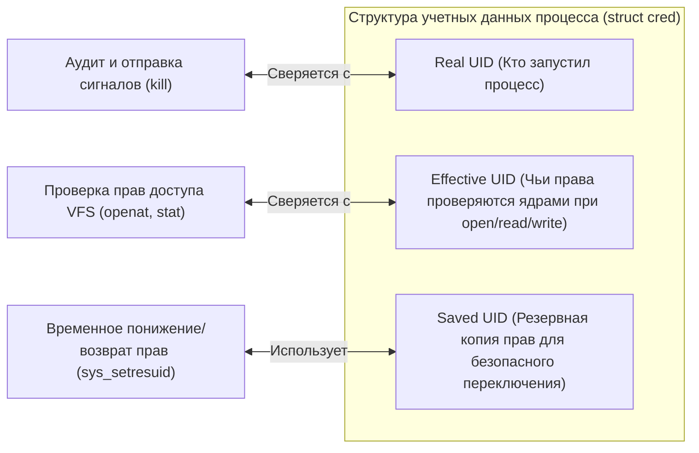
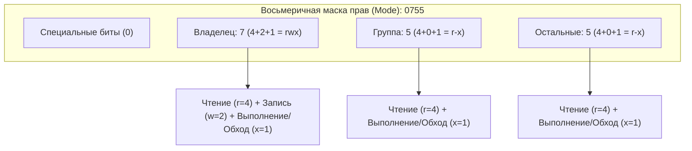
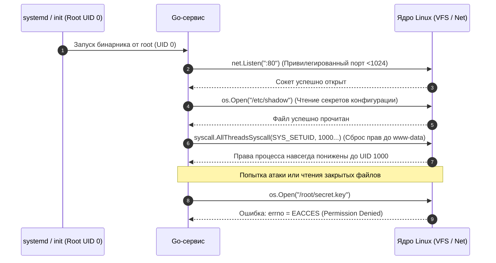

## Фундамент безопасности Linux: пользователи, группы и права доступа

Когда мы пишем сервисы на Go, легко поддаться приятной иллюзии: кажется, что операционная система — это невидимый, бесконечно послушный исполнитель, готовый по первому зову `os.Open()` открыть файл конфигурации или через `net.Listen(":80")` привязать сетевой сокет. В отличие от платформ с тяжелыми виртуальными машинами вроде Java (где исторически существовал `SecurityManager`) или среды .NET с ее Code Access Security, в Go нет встроенной программной «песочницы». Язык Go придерживается философии классического UNIX: компилируемый бинарник — это полноценный гражданин пространства пользователя, и вся ответственность за разграничение доступа безоговорочно делегируется ядру операционной системы.

В операционных системах семейства Linux безопасность строится не на магии компилятора, а на строгой классической модели DAC (Discretionary Access Control — избирательное управление доступом). Для бэкенд-инженера глубокое понимание этой модели — не просто академический интерес, а вопрос выживания сервиса в продакшене. Неверно выставленная маска прав на сокет межпроцессного взаимодействия, запуск контейнера от привилегированного пользователя или непонимание того, как ядро проверяет идентификаторы процесса при каждом системном вызове, превращают надежный микросервис в открытые ворота для компрометации всей инфраструктуры.

```mermaid
flowchart TD
    classDef process  fill:#1e293b,stroke:#38bdf8,stroke-width:1px,color:#f8fafc
    classDef success  fill:#064e3b,stroke:#34d399,stroke-width:1px,color:#f8fafc
    classDef error    fill:#7f1d1d,stroke:#f87171,stroke-width:1px,color:#f8fafc
    classDef warning  fill:#78350f,stroke:#fbbf24,stroke-width:1px,color:#f8fafc
    classDef entry    fill:#1e3a5f,stroke:#38bdf8,stroke-width:2px,color:#f8fafc
    classDef aux      fill:#334155,stroke:#64748b,stroke-width:1px,color:#f8fafc
    classDef system   fill:#312e81,stroke:#a78bfa,stroke-width:1px,color:#f8fafc
    classDef data     fill:#132d29,stroke:#2dd4bf,stroke-width:1px,color:#f8fafc
    classDef network  fill:#881337,stroke:#fb7185,stroke-width:1px,color:#f8fafc
    classDef accent   fill:#1e1b4b,stroke:#818cf8,stroke-width:1px,color:#f8fafc
    subgraph UserSpace ["Пространство пользователя (User Space)"]
        GoApp["Go-приложение (бинарник)"]
        GoRuntime["Go Runtime / os package"]:::system
    end

    subgraph KernelSpace ["Пространство ядра (Kernel Space)"]
        SyscallHandler["Обработчик системных вызовов (sys_openat, sys_access)"]
        VFS["Виртуальная файловая система (VFS)"]
        SecurityEngine{"Диспетчер прав DAC (generic_permission)"}
        InodeCache["Кэш метаданных (inode / dentry cache)"]
        HardwareStorage["Физический накопитель (NVMe / SSD)"]
    end

    GoApp -->|os.Open / net.Listen| GoRuntime
    GoRuntime -->|syscall openat, bind| SyscallHandler
    SyscallHandler --> VFS
    VFS --> SecurityEngine
    SecurityEngine -->|Чтение creds процесса и прав inode| InodeCache
    InodeCache -.->|При промахе кэша (Cache Miss)| HardwareStorage
    SecurityEngine -->|Права подтверждены| ReturnFD["Дескриптор fd (Успех)"]
    SecurityEngine -->|В доступе отказано| ReturnError["errno = EACCES (Permission Denied)"]
```

## Пользователи и группы: UIDs, GIDs и иерархия доверия

В ядре Linux нет понятий «Алиса», «Боб», `root` или `www-data`. Текстовые имена пользователей и групп существуют исключительно для удобства людей и прикладных утилит. Для ядра Linux безопасность — это строгая математика целых неотрицательных чисел: **UID** (User ID) и **GID** (Group ID).

Когда вы вводите в терминале имя пользователя или читаете конфигурационный файл Nginx, системные библиотеки (`libc` через функции `getpwnam` и `getgrnam`) обращаются к текстовым базам данных:
*   `/etc/passwd` — сопоставляет текстовые логины с числовыми UID, домашними каталогами и командными оболочками. Исторически здесь хранились хэши паролей, но в целях безопасности они давно вынесены.
*   `/etc/shadow` — защищенный файл, доступный только суперпользователю (права `0640` или `0000`), где хранятся криптографические соленые хэши паролей пользователей.
*   `/etc/group` — определяет соответствие текстовых имен групп их числовым GID и списки пользователей, входящих в эти группы.

Магическим числом для всей подсистемы безопасности UNIX является UID `0`. Пользователь с идентификатором `0` традиционно именуется `root`. Для ядра Linux проверка `uid == 0` исторически означала абсолютное всемогущество: обход любых проверок прав на чтение, запись, выполнение файлов, возможность отправки сигналов любому процессу и биндинг на привилегированные порты (`<1024`).

Каждый процесс в Linux представлен структурой ядра `task_struct`, внутри которой находится указатель на структуру учетных данных `struct cred`. Безопасность процесса определяют не один, а сразу несколько наборов идентификаторов:

1.  **Real UID / Real GID (Реальные идентификаторы):**  
    Показывают, *кто на самом деле запустил данный процесс* (владелец сессии или родительского процесса). Этот идентификатор используется для отправки сигналов (обычный пользователь может слать сигналы только своим процессам), учета квот и аудита.
2.  **Effective UID / Effective GID (Эффективные идентификаторы):**  
    Определяют, *какими правами процесс обладает прямо сейчас*. Именно этот UID и связанные с ним группы ядро проверяет при открытии файлов (`open`), создании сетевых сокетов, подключении к shared memory и выполнении большинства системных вызовов.
3.  **Saved UID / Saved GID (Сохраненные идентификаторы):**  
    Служат механизмом временной эскалации и сброса привилегий. Когда привилегированная программа запускается через механизм `setuid`, ее исходный effective UID копируется в saved UID. Программа может временно сбросить свой effective UID до обычного непривилегированного пользователя, выполнить небезопасную операцию (например, распарсить пользовательский ввод), а затем снова восстановить свои права из сохраненного идентификатора.
4.  **Filesystem UID / GID (fsuid / fsgid):**  
    Специфичный для Linux механизм, используемый серверами NFS. В подавляющем большинстве случаев он автоматически синхронизируется с Effective UID.



> [!tip] Собеседование
> **Вопрос:** В чем принципиальная разница между `os.Getuid()` и `os.Geteuid()` в Go, и когда они могут возвращать разные значения?  
> **Ответ:** `os.Getuid()` возвращает Real UID — идентификатор пользователя, фактически запустившего процесс в операционной системе. Функция `os.Geteuid()` возвращает Effective UID — идентификатор, от имени которого процесс в данный момент запрашивает системные ресурсы у ядра. В обычных условиях они совпадают. Однако если исполняемый файл имел установленный бит `setuid` (например, принадлежал пользователю `root` с правами `4755`) или если сервис в процессе работы вызвал смену привилегий через `sys_setresuid`, эти значения будут различаться. Go использует `Geteuid()` для понимания реальных полномочий процесса, и именно Effective UID оценивается ядром Linux при проверке прав на открытие файлов и системные вызовы.

## Права доступа к файлам: rwx и специальные биты

В файловой системе Linux каждый объект — обычный файл, каталог, именованный канал (FIFO), символическое устройство или Unix Domain Socket — обладает набором атрибутов безопасности, упакованных в метаданные **inode**.

Классическая модель прав делит субъекты доступа на три четкие категории:
1.  **User (Owner / Владелец):** пользователь, которому принадлежит файл (определяется числовым UID в `inode`).
2.  **Group (Группа):** группа, привязанная к файлу (числовой GID в `inode`).
3.  **Others (Остальные / Мир):** все остальные процессы в системе, чей Effective UID не совпадает с владельцем, а Effective GID (включая вспомогательные группы) не входит в группу файла.

Каждая из трех категорий описывается тремя базовыми битами доступа: `r` (read), `w` (write) и `x` (execute). Но их семантика существенно различается в зависимости от того, файл перед нами или каталог:

| Бит | Числовой вес | Значение для обычного файла | Значение для каталога (Directory) |
| :---: | :---: | :--- | :--- |
| **`r`** | **`4`** | Разрешено читать содержимое файла (системный вызов `read`). | Разрешено считывать список имен файлов в каталоге (`getdents`, утилита `ls`). |
| **`w`** | **`2`** | Разрешено изменять содержимое или усекать файл (`write`, `truncate`). | Разрешено создавать, переименовывать и удалять файлы внутри каталога. |
| **`x`** | **`1`** | Разрешено загружать файл на исполнение ядром (`execve`). | Разрешено входить в каталог (траверсировать путь, делать `cd`, читать метаданные файлов через `stat`). |

В восьмеричном представлении права записываются трехзначным (или четырехзначным) числом, где каждая цифра — сумма битов: `r=4`, `w=2`, `x=1`.  
Например:
*   `644` (`rw-r--r--`): Владелец может читать и писать (`4+2=6`), группа и остальные — только читать (`4`). Типичный безопасный режим для конфигурационных файлов и статических ресурсов.
*   `755` (`rwxr-xr-x`): Владелец имеет полный доступ (`4+2+1=7`), группа и остальные могут читать и выполнять (`4+1=5`). Стандарт для исполняемых бинарников и каталогов общего доступа.
*   `0750` (`rwxr-x---`): Владелец имеет полный доступ, группа может читать и входить, остальным доступ полностью закрыт. Рекомендуемый режим для каталогов рабочих данных бэкенд-сервисов.



### Специальные биты: SUID, SGID и Sticky Bit

Помимо базовой триады `rwx`, старший разряд режима доступа содержит три специальных бита, способных кардинально менять поведение процессов и файловой системы:

1.  **SUID (Set User ID, восьмеричный вес `4`):**  
    Применяется к исполняемым файлам. Когда пользователь запускает бинарник с активным битом SUID, созданный процесс получает Effective UID *не того, кто его запустил, а владельца исполняемого файла*.  
    Классический канонический пример — утилита `/usr/bin/passwd` (права `-rwsr-xr-x`, владелец `root`). Обычный пользователь не имеет права напрямую редактировать `/etc/shadow`, но запуск `/usr/bin/passwd` временно дает процессу полномочия `root`, позволяя безопасно обновить хэш пароля самого пользователя через контролируемый код утилиты.
2.  **SGID (Set Group ID, восьмеричный вес `2`):**  
    *   *Для исполняемых файлов:* процесс при запуске получает Effective GID владельца файла.
    *   *Для каталогов:* критически важная функция для совместной командной работы. Все новые файлы и подкаталоги, создаваемые внутри каталога с битом SGID, автоматически наследуют GID самого каталога, а не первичную группу создавшего их пользователя.
3.  **Sticky Bit (восьмеричный вес `1`, режим `1777`):**  
    В современных ОС применяется к каталогам общего доступа (например, `/tmp` или `/var/tmp`). При включенном Sticky Bit удалить или переименовать файл внутри каталога может *только владелец самого файла или суперпользователь `root`*, даже если для каталога выставлены полные права записи `777` (`rwxrwxrwx`). Без этого бита любой локальный пользователь мог бы удалить временный файл чужого процесса или подменить сокет базы данных.

> [!warning] Ловушка / Gotcha
> **SUID/SGID в Go-приложениях.** Если вы скомпилируете Go-бинарник с правами `4755` (SUID) и запустите его от имени обычного пользователя, процесс получит UID `0` (root). В Go это означает, что `os.Open("/etc/shadow")` сработает без ошибок, а `net.Listen(":80")` не выбросит `permission denied`. Это частая причина катастрофических уязвимостей, когда разработчики «для удобства» запускают сервисы от root или забывают сбрасывать SUID-биты после сборки. Более того, многопоточный рантайм Go исторически конфликтовал с классическими системными вызовами `setuid`/`setgid`, так как в Linux учетные данные привязаны к конкретному потоку ОС (POSIX thread), а планировщик Go свободно мигрирует горутины между системными тредами.

## Под капотом: как ядро проверяет права

Когда в коде на Go выполняется вызов `os.Open("/etc/shadow")`, рантайм выполняет системный вызов `sys_openat` (или утилитарный `sys_access` для проверки доступности). Ядро Linux не вычисляет права доступа абстрактно — вся логика сосредоточена в слое VFS (Virtual File System) в функции ядра `generic_permission()`.

Алгоритм проверки прав ядром подчиняется железному правилу последовательного исключения:

1.  **Проверка суперпользователя:** Если Effective UID процесса равен `0` (`root`), ядро безусловно разрешает операции чтения и записи. Для выполнения (`x`) ядро требует, чтобы хотя бы один бит `x` (для владельца, группы или остальных) был установлен в `inode`.
2.  **Проверка владельца (Owner Match):** Если Effective UID процесса в точности совпадает с UID владельца, записанным в `inode`:
    *   Ядро проверяет только биты прав владельца (старшая тройка `rwx`).
    *   **Внимание:** Если у владельца нет права на запись (например, права файла `0444`), но группа имеет полные права, владельцу **будет отказано в доступе**! Ядро останавливает проверку на первом совпадении категории субъекта и никогда не опускается до прав группы.
3.  **Проверка группы (Group Match):** Если UID не совпал, ядро сверяет Effective GID процесса и весь список его дополнительных групп (`supplementary groups`) с GID файла из `inode`. Если найдено хотя бы одно совпадение, проверяются биты прав группы (средняя тройка `rwx`).
4.  **Проверка остальных (Others):** Если ни UID, ни GID не совпали, применяются права для категории «остальные» (младшая тройка `rwx`).
5.  Если требуемые биты установлены — системный вызов возвращает валидный дескриптор файла. Если хотя бы один запрошенный бит отсутствует — ядро прекращает операцию, вызов возвращает `-1`, а переменной потока присваивается ошибка `errno = EACCES` (Permission Denied).

```mermaid
flowchart TD
    classDef process  fill:#1e293b,stroke:#38bdf8,stroke-width:1px,color:#f8fafc
    classDef success  fill:#064e3b,stroke:#34d399,stroke-width:1px,color:#f8fafc
    classDef error    fill:#7f1d1d,stroke:#f87171,stroke-width:1px,color:#f8fafc
    classDef warning  fill:#78350f,stroke:#fbbf24,stroke-width:1px,color:#f8fafc
    classDef entry    fill:#1e3a5f,stroke:#38bdf8,stroke-width:2px,color:#f8fafc
    classDef aux      fill:#334155,stroke:#64748b,stroke-width:1px,color:#f8fafc
    classDef system   fill:#312e81,stroke:#a78bfa,stroke-width:1px,color:#f8fafc
    classDef data     fill:#132d29,stroke:#2dd4bf,stroke-width:1px,color:#f8fafc
    classDef network  fill:#881337,stroke:#fb7185,stroke-width:1px,color:#f8fafc
    classDef accent   fill:#1e1b4b,stroke:#818cf8,stroke-width:1px,color:#f8fafc
    Start["Запрос процесса (sys_openat / sys_access):::entry"] --> CheckRoot{"Effective UID == 0 (root)?"}
    
    CheckRoot -->|Да| RootCheck{"Запрос на выполнение (x)?"}
    RootCheck -->|Да| ExecBit{"Хотя бы один бит x установлен?"}
    ExecBit -->|Да| AccessGranted["Доступ разрешен (Возврат fd)"]
    ExecBit -->|Нет| AccessDenied["Отказ: errno = EACCES"]
    RootCheck -->|Нет (r/w)| AccessGranted

    CheckRoot -->|Нет| CheckOwner{"EUID процесса == inode.UID (Владелец)?"}
    CheckOwner -->|Да| CheckOwnerBits{"Биты прав Owner удовлетворяют запросу?"}
    CheckOwnerBits -->|Да| AccessGranted
    CheckOwnerBits -->|Нет| AccessDenied

    CheckOwner -->|Нет| CheckGroup{"EGID / SuppGroups содержат inode.GID?"}
    CheckGroup -->|Да| CheckGroupBits{"Биты прав Group удовлетворяют запросу?"}
    CheckGroupBits -->|Да| AccessGranted
    CheckGroupBits -->|Нет| AccessDenied

    CheckGroup -->|Нет| CheckOtherBits{"Биты прав Others удовлетворяют запросу?"}
    CheckOtherBits -->|Да| AccessGranted
    CheckOtherBits -->|Нет| AccessDenied
```

### Mechanical Sympathy: Кэши VFS, dentry и стоимость проверки прав

С точки зрения аппаратных ресурсов и производительности, метаданные файлов (`inode`) и древовидная структура путей хранятся на медленных блочных накопителях. Если бы ядро при каждом системном вызове `open`, `stat` или `read` обращалось к физическому диску для чтения прав доступа, дисковая подсистема мгновенно оказалась бы парализована.

Поэтому ядро Linux реализует двухуровневый кэш в оперативной памяти:
*   **dentry cache (dcache):** кэш элементов каталогов, связывающий текстовые пути (`/var/run/myapp/app.sock`) с конкретными номерами `inode`.
*   **inode cache (icache):** кэш структур `inode` в оперативной памяти, содержащий UID, GID, режим прав `mode` и указатели на блоки данных.

Когда файл или каталог «горячий» (активно используется приложением), системный вызов `sys_openat` тратит всего несколько десятков наносекунд: процессор считывает битовую маску непосредственно из L1/L2 кэша CPU в системной памяти ядра, выполняет инструкцию битового `AND` и мгновенно возвращает дескриптор. 

Однако если сервис производит интенсивный обход глубоких файловых деревьев («холодный» доступ) или если память сервера перегружена и ядро вымывает `dentry` под давлением аллокаций, каждый вызов `stat` или `access` приводит к дорогостоящему дисковому чтению и Cache Miss. В высоконагруженных Go-сервисах частые системные вызовы проверки прав на диске могут вызывать ощутимые микросекундные задержки (I/O latency spikes).

## Работа с правами в Go: идиомы и типичные ошибки

Стандартная библиотека Go предоставляет чистый и выразительный интерфейс для взаимодействия с правами доступа через пакет `os`. Тип `os.FileMode` представляет собой 32-битную маску, объединяющую стандартные биты UNIX-доступа и кроссплатформенные флаги типов файлов (каталог, сокет, символическая ссылка, именованный канал).

Рассмотрим практический пример инициализации рабочего каталога сервиса с соблюдением стандартов безопасности:

```go
package main

import (
	"fmt"
	"os"
	"path/filepath"
)

func setupServiceDir(dir string) error {
	// 1. Создаем каталог с правами 0750 (rwxr-x---)
	// 0750 в октальном представлении. Важно использовать 0xx для октальных чисел в Go.
	if err := os.MkdirAll(dir, 0750); err != nil {
		return fmt.Errorf("mkdirall: %w", err)
	}

	// 2. Устанавливаем владельца и группу
	// В production обычно берут UID/GID из конфигурации или env
	const targetUID = 1000
	const targetGID = 1000

	if err := os.Chown(dir, targetUID, targetGID); err != nil {
		// Chown требует CAP_CHOWN. Если запускаем от non-root, упадет с EPERM
		return fmt.Errorf("chown: %w", err)
	}

	// 3. Проверяем текущие права перед изменением (опционально, для audit log)
	info, err := os.Stat(dir)
	if err != nil {
		return fmt.Errorf("stat: %w", err)
	}

	// 4. Устанавливаем права явно (chmod)
	if err := os.Chmod(dir, 0750); err != nil {
		return fmt.Errorf("chmod: %w", err)
	}

	// 5. Верификация на уровне Go (не заменяет проверку ядра, но полезна для логики)
	if info.Mode().Perm() != 0750 {
		return fmt.Errorf("permissions mismatch: got %o", info.Mode().Perm())
	}

	return nil
}

func main() {
	if err := setupServiceDir("/var/run/myapp"); err != nil {
		fmt.Fprintf(os.Stderr, "fatal: %v
", err)
		os.Exit(1)
	}
}
```

### Критические нюансы и грабли в Go

1.  **Октальная нотация констант:** В языке Go числа, начинающиеся с нуля (`0750`, `0644`), интерпретируются компилятором как восьмеричные. Если по ошибке написать `os.Chmod(file, 755)` без ведущего нуля, компилятор воспримет `755` как десятичное число (в шестнадцатеричном виде `0x2F3`, а в восьмеричном — `01363`), что приведет к установке совершенно непредсказуемых прав (включая нежелательные биты Sticky и SGID).
2.  **Кроссплатформенность:** Системные вызовы `os.Chmod` и `os.Chown` на платформе Windows ведут себя принципиально иначе, транслируясь в атрибуты только для чтения или сложные списки управления доступом (ACL). Если код ориентирован на Linux-специфичные права, его изолируют директивами сборки или проверкой `runtime.GOOS == "linux"`.
3.  **Битовые маски `os.FileMode`:** Стандартный пакет `os` определяет важные константы:
    *   `os.ModePerm` — маска всех 9 стандартных прав доступа UNIX (`0777`).
    *   `os.ModeSetuid` — бит SUID (`040000000` во внутреннем представлении Go).
    *   `os.ModeSticky` — Sticky bit (`010000000`).
4.  **Антипаттерн `0777`:** Никогда не используйте `os.Chmod(path, 0777)` в продакшене. Права `777` открывают каталог или файл на полную перезапись и удаление любому локальному процессу на сервере, делая систему уязвимой к подмене библиотек и инъекциям бинарных данных.

## Безопасность сервиса и принцип наименьших привилегий

В архитектуре надежных систем базовым законом является **Принцип наименьших привилегий (Principle of Least Privilege, PoLP)**: любой программный компонент должен обладать ровно тем минимальным набором прав, который абсолютно необходим для выполнения его непосредственной задачи, и ни битом больше.

Если ваш бэкенд-сервис запускается непосредственно от пользователя `root` (UID `0`), то любая уязвимость в коде — от внедрения системных команд (Command Injection) до небезопасной десериализации данных или переполнения буфера в сторонней CGO-библиотеке — мгновенно дает злоумышленнику неограниченный контроль над всем физическим сервером или виртуальной машиной.



Как правильно проектировать и эксплуатировать Go-сервисы в продакшене:

1.  **Сброс привилегий (Drop Privileges):**  
    Исторический паттерн классических демонов: сервис запускается от `root`, производит начальную инициализацию, требующую особых прав (например, вызов `net.Listen(":80")` для биндинга на порт `<1024` или первичное чтение защищенных ключей шифрования вроде `os.Open("/etc/shadow")`), а затем немедленно сбрасывает свои привилегии, вызывая низкоуровневые вызовы сброса UID/GID (в Go стандартный пакет `os` намеренно не имеет методов `Setuid`/`Setgid`, поэтому используется `syscall.AllThreadsSyscall(syscall.SYS_SETGID, 1000, 0, 0)` и `syscall.AllThreadsSyscall(syscall.SYS_SETUID, 1000, 0, 0)`) для перехода под учетную запись непривилегированного пользователя (например, `www-data`).
2.  **Изоляция в контейнерах:**  
    В средах Docker и Kubernetes процесс внутри контейнера часто по умолчанию видит себя как `root` (UID `0`). Хотя cgroups и namespaces изолируют процесс от таблиц хоста, наличие `CAP_SYS_ADMIN` или случайный проброс блочных устройств из `/dev` может позволить атакующему осуществить побег из контейнера (container breakout). Хорошей практикой является директива `USER 1000:1000` в Dockerfile.
3.  **Гранулярные Linux Capabilities:**  
    Вместо опасных бинарников с битом `setuid` современный Linux позволяет наделять исполняемый файл или процесс точечными привилегиями. Например, привилегия `cap_net_bind_service` позволяет непривилегированному процессу слушать порты `<1024` без наделения его всемогущим статусом `root`.

> [!info] Под капотом
> В стандартной библиотеке Go нет функций `os.Setuid` или `os.Setgid`. В Linux системный вызов `setuid(2)` на уровне ядра меняет учетные данные только для *текущего системного потока (M)*. В многопоточном рантайме Go это приводило бы к критической уязвимости: одна горутина исполнялась бы под UID 1000, а другая на соседнем потоке ОС — под root (UID 0). Начиная с Go 1.16, вызовы `syscall.AllThreadsSyscall(syscall.SYS_SETUID, ...)` или пакет `golang.org/x/sys/unix` принудительно рассылают системный вызов всем системным потокам ОС рантайма Go, гарантируя согласованный сброс привилегий для всего процесса.

> [!tip] Собеседование
> **Вопрос:** Почему запуск веб-сервиса от root — это критическая архитектурная ошибка, даже если процесс полностью изолирован внутри Docker-контейнера?  
> **Ответ:**  
> 1. **Container Escape (Побег из контейнера):** Контейнеры делят одно и то же ядро с хостом. Уязвимости ядра (например, Dirty COW или CVE-2022-0492) позволяют процессу с UID 0 вырваться из пространства пространств имен (namespaces) прямо на хост-систему.
> 2. **Resource Limits & Security Profiles:** Без явного разделения прав сложно тонко настроить профили AppArmor, SELinux и seccomp-фильтры.
> 3. **Attack Surface (Поверхность атаки):** В случае уязвимости типа RCE (Remote Code Execution) злоумышленник получает полный контроль над файловой системой контейнера, смонтированными томами, токенами сервисного аккаунта Kubernetes и сетевым стеком.
> 4. **Compliance & Безопасность:** Индустриальные стандарты безопасности (PCI DSS, SOC 2, ISO 27001) категорически запрещают выполнение прикладных сервисов от суперпользователя.

## Итоги

1.  **UID/GID** — фундаментальная числовая основа безопасности Linux. Реальные (Real), эффективные (Effective) и сохраненные (Saved) идентификаторы четко определяют контекст безопасности каждого процесса.
2.  **Модель DAC и inode:** Права доступа (`rwx`) физически хранятся в метаданных `inode` и последовательно проверяются слоем VFS при каждом системном вызове. Ядро останавливает проверку на первом совпадении (Owner -> Group -> Others).
3.  **Специальные биты (SUID, SGID, Sticky):** Расширяют базовую модель UNIX. SUID наделяет процесс правами владельца исполняемого файла, SGID гарантирует наследование группы в каталогах, а Sticky bit на каталогах вроде `/tmp` предотвращает удаление чужих файлов.
4.  **Go и операционная система:** Go делегирует безопасность ядру Linux. Пакет `os` предоставляет низкоуровневые инструменты (`chmod`, `chown`, `stat`). В Go-коде критически важно использовать октальную нотацию (`0750`), учитывать поведение рантайма и никогда не выставлять права `0777`.
5.  **Принцип наименьших привилегий (Least Privilege):** Надежный продакшен-сервис никогда не должен работать под `root`. Используйте drop privileges, запуск от непривилегированных пользователей (`UID 1000`) в контейнерах и точечные capabilities (`cap_net_bind_service`) вместо всемогущих суперпользовательских прав.

Мы детально изучили классическую файловую безопасность Linux, механизм идентификаторов и проверку прав на уровне VFS. Однако классическая триада `rwx` и двоичное разделение «обычный пользователь / всемогущий root» слишком грубы для современных облачных платформ и микросервисов. В следующей лекции мы погрузимся в мир тонкого контроля привилегий: разберем POSIX ACL, точечные Linux Capabilities и механизм безопасного запуска процессов. Переходим к [[57. ACL, capabilities и привилегии процессов]].
