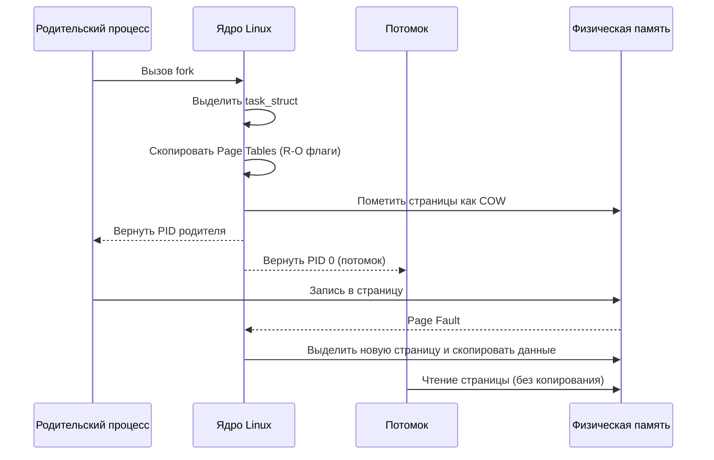

## Как Linux создает процессы. fork, exec, wait

> *«Unix прост. Требуется лишь быть гением, чтобы постичь эту простоту».*    
> — Деннис Ритчи

В бэкенд-разработке на Go мы редко пишем код, который существует в вакууме. Каждый раз, когда ваш сервис запускает CLI-утилиту через `os/exec`, выполняет миграции базы данных, сжимает видео через `ffmpeg`, генерирует PDF или запускает изолированного воркера, вы вступаете в прямой диалог с операционной системой.

В 1969 году в Bell Labs Кен Томпсон и Деннис Ритчи приняли одно из самых изящных и спорных решений в истории вычислительной техники: разделить рождение новой программы на два независимых шага — клонирование (`fork`) и перерождение (`exec`). 

В других операционных системах (например, Windows с ее исполинским системным вызовом `CreateProcess()`, принимающим десяток параметров) создание процесса атомарно. Но в мире Unix и Linux именно разделение на `fork` и `exec` подарило миру конвейеры командной строки (`|`), перенаправление потоков ввода-вывода (`>`, `<`), плавную смену привилегий и оптимизацию **Copy-On-Write (COW)**.

Давайте снимем слои абстракций и разберем, как ядро Linux создает, трансформирует и хоронит процессы, и как Go-разработчику управлять этим оркестром без утечек памяти и зависших дескрипторов.

---

## Модель создания процессов: Fork + Exec

В POSIX-системах (включая Linux) запуск новой программы никогда не происходит «с чистого листа». Процесс не может возникнуть из ниоткуда: он обязан родиться от уже существующего родительского процесса.

Модель состоит из двух фундаментальных фаз:

1. **`fork()`**: Создает почти точную копию текущего процесса. Новый процесс (потомок, child) получает свой собственный уникальный `PID`, но наследует виртуальное адресное пространство родителя, дубликаты файловых дескрипторов, переменные окружения и текущее состояние регистров.
2. **`exec()`**: Полностью уничтожает старое адресное пространство вызвавшего его процесса и заменяет его новым исполняемым файлом. Память, код, куча и стек очищаются, с диска загружается новый бинарник, и исполнение начинается заново с точки входа (`entry point`).

```
                РОДИТЕЛЬСКИЙ ПРОЦЕСС (PID 100)
                              │
                              │ fork()
                              ▼
           ┌─────────────────────────────────────┐
           │ Ядро дублирует task_struct и память │
           └──────────────────┬──────────────────┘
                              │
             ┌────────────────┴────────────────┐
             ▼                                 ▼
   РОДИТЕЛЬ (PID 100)                  ПОТОМОК (PID 101)
   fork() вернул 101                   fork() вернул 0
   (Продолжает старый код)             (Готовит окружение)
                                               │
                                               │ execve("/bin/ls")
                                               ▼
                                       НОВАЯ ПРОГРАММА (PID 101)
                                       Память сброшена, запущен /bin/ls
                                       Точка входа: _start
```

> [!info] Под капотом
> Почему не один системный вызов `create_process(path)`? Исторически `fork` был первым механизмом клонирования, появившимся в Unix. Позже добавили `exec` для замены образа процесса. Разделение на два шага позволило командным оболочкам (shell) творить магию: между `fork` и `exec` потомок успевает закрыть лишние файлы, перенаправить `stdout` в сокет или пайп, поменять рабочий каталог (`chdir`) или сбросить права суперпользователя (`setuid`), не затрагивая родителя. 
> 
> Позже именно эта архитектура позволила реализовать оптимизацию **Copy-On-Write (COW)**, о которой мы подробно говорили в [[Copy On Write. Почему fork не копирует всю память сразу]]. Если бы создание процесса было одним монолитным вызовом, ядру пришлось бы копировать все страницы памяти сразу, что убило бы производительность при частом спавне рабочих процессов.

---

## Под капотом: что делает fork?

Когда в коде вызывается `fork()`, процессор переходит в режим ядра (Ring 0). В исходном коде Linux за этот системный вызов отвечает универсальная внутренняя функция `kernel_clone()` (в старых ядрах — `_do_fork()`).

Основной структурный элемент процесса в Linux — это `task_struct`. Путь ядра при `fork()` выглядит следующим образом:

1. **Выделение памяти:** Ядро выделяет новый экземпляр `task_struct` и стек ядра через кэш слябов (`kmem_cache`).
2. **Инициализация идентификаторов:** Процессу назначается новый `PID`, а его `PPID` (Parent PID) устанавливается равным PID родителя.
3. **Самое важное: копирование адресного пространства (без копирования данных).** Если бы Linux физически копировал гигабайты оперативной памяти родителя, вызов `fork()` занимал бы секунды. Вместо этого ядро копирует **таблицы страниц (Page Tables)**. 
   - Создаются новые записи в таблице страниц потомка, которые указывают на **те же самые физические фреймы RAM**, что и у родителя.
   - И родительские, и дочерние записи в таблицах страниц помечаются флагом **Read-Only (только для чтения)**.
   - Счетчик ссылок (`refcount`) на физические страницы в структуре `struct page` инкрементируется.
4. **Дублирование дескрипторов:** Копируется таблица файловых дескрипторов (`struct files_struct`), счетчики ссылок на открытые файлы (`struct file`) увеличиваются.
5. **Возврат значений:** Ядро помещает в регистр возврата (`RAX` на x86-64) значение:
   - Родителю возвращается **PID созданного потомка** (положительное число).
   - Потомку возвращается **0**.



Как только `fork` возвращает управление, оба процесса исполняются параллельно. Если потомок или родитель попытается выполнить обычное чтение, данные будут прочитаны из общей физической памяти с максимальной скоростью кэшей процессора.

Но как только любой из них попытается **записать** хотя бы один байт в унаследованную страницу, аппаратный блок MMU обнаружит флаг Read-Only и сгенерирует прерывание процессора — **Page Fault** (ошибка страницы #PF). Ядро перехватывает его, видит флаг COW, выделяет новую физическую страницу памяти 4 КБ, копирует в нее старое содержимое, обновляет запись в таблице страниц пишущего процесса с правами записи (Read-Write) и возобновляет команду. Это и есть **Copy-On-Write**.

---

## Под капотом: что делает exec?

После `fork` потомок все еще является близнецом родителя. Чтобы превратить его в совершенно другую программу, вызывается фундаментальный системный вызов `execve()` (или его библиотечные обертки `execl`, `execv`, `execvp` из `glibc`):

```c
int execve(const char *pathname, char *const argv[], char *const envp[]);
```

Что делает ядро при получении этого вызова?

1. **Очистка:** Ядро безжалостно освобождает старое адресное пространство потомка: код, сегмент инициализированных данных, стек и куча уничтожаются. Соответствующие записи удаляются из таблицы страниц, физическая память освобождается (или декрементируется refcount).
2. **Парсинг бинарного формата (ELF):** 
   - Ядро считывает заголовок файла (в Linux это Executable and Linkable Format — ELF).
   - Проверяются «магические байты» (`0x7F E L F`), архитектура CPU и права на исполнение (`chmod +x`).
   - Определяются сегменты программы: `.text` (машинный код), `.data` (инициализированные переменные), `.bss` (неинициализированные переменные).
3. **Отображение в виртуальную память (mmap):** Ядро настраивает новые виртуальные области памяти (`vm_area_struct`), отображая секции ELF-файла напрямую в адресное пространство процесса через страничный механизм (Demand Paging). Код программы даже не загружается в RAM целиком сразу: страницы подгружаются с диска по мере исполнения инструкций!
4. **Формирование стека:** На самую вершину нового стека помещаются аргументы командной строки (`argv`), переменные окружения (`envp`) и вспомогательный вектор ядра (`auxv`). Устанавливается новый указатель стека (`RSP` или `esp`).
5. **Точка входа и старт:** Процессор устанавливает регистр инструкций на адрес `entry_point`.
   - Для статически скомпилированных программ (например, большинства Go-бинарников) управление сразу передается на адрес `_start`.
   - Для динамически скомпилированных C/C++ программ управление передается динамическому компоновщику (обычно `/lib64/ld-linux-x86-64.so.2`), который подгружает разделяемые библиотеки (`.so`), вызывает `__libc_start_main` и лишь затем передает управление функции `main()`.

> [!warning] Ловушка / Gotcha: exec не завершает процесс
> Вызов `exec` **не завершает** процесс и не создает нового `PID`! Он лишь пересаживает «мозг» (образ исполняемого файла) в существующее тело (`task_struct`). `PID` процесса остается неизменным.
> 
> Если вы вызовете `execve()` в многопоточной программе или внутри одного потока, не выполнив предварительно `fork`, все остальные потоки этого процесса будут мгновенно уничтожены ядром без вызова деструкторов и defer-функций! А при ошибке в аргументах или попытке вызова `exec` в поврежденном окружении вы рискуете получить аварийный `Segmentation fault` или непредсказуемое поведение системы.

---

## Синхронизация и жизненный цикл: wait и сигналы

После того как потомок ушел исполнять свой собственный код через `exec`, родитель должен управлять его жизненным циклом. Процессы не должны растворяться бесследно — родитель обязан получить результат работы своего детища.

Здесь в игру вступают `wait()` и сигналы ядра:

1. **Zombie (Зомби):** Когда потомок вызывает `exit()` или падает, ядро мгновенно отбирает у него всю память и закрывает открытые файлы. Однако сам дескриптор `task_struct` не удаляется из таблицы процессов! Он замирает в состоянии зомби, сохраняя код возврата и статистику использования ресурсов (`rusage`), ожидая, пока родитель прочитает этот статус.
2. **Orphan (Сирота):** Если родитель погиб раньше своего потомка, потомок становится «сиротой». Ядро предотвращает зависание таких процессов: оно переназначает `PPID` потомка корневому системному процессору (PID 1, исторически `init`, в современных дистрибутивах — `systemd`). Корневой процесс непрерывно мониторит сирот и автоматически забирает их статус через `wait()`.
3. **`waitpid()`:** Системный вызов, позволяющий родителю приостановить свое выполнение до завершения конкретного дочернего процесса (или любого из них) и безопасно забрать код возврата (`exit code`).
4. **Сигнал `SIGCHLD`:** Когда состояние любого дочернего процесса меняется (завершился, упал, остановлен сигналом), ядро посылает родительскому процессу асинхронный сигнал `SIGCHLD`. 
   - В высоконагруженных демонах родитель не может стоять и ждать каждого потомка через блокирующий `wait()`.
   - Вместо этого устанавливается обработчик сигнала `SIGCHLD`, внутри которого вызывается неблокирующий `waitpid()` с флагом `WNOHANG`:
     ```c
     // Классический Unix-паттерн очистки зомби
     while (waitpid(-1, &status, WNOHANG) > 0) {
         // Очищаем всех завершившихся потомков без блокировки потока
     }
     ```

---

## Реализация в Go: os/exec и особенности рантайма

Пакет `os/exec` стандартной библиотеки Go предоставляет высокоуровневую абстракцию над системными вызовами `fork`, `execve` и `waitpid`. Но за лаконичным API скрывается тонкая инженерная работа рантайма Go.

```go
package main

import (
	"bytes"
	"context"
	"fmt"
	"log"
	"os/exec"
	"time"
)

func runCommand() error {
	// 1. Создаем контекст с жестким таймаутом на выполнение
	ctx, cancel := context.WithTimeout(context.Background(), 3*time.Second)
	defer cancel()

	// 2. Инициализация команды
	cmd := exec.CommandContext(ctx, "ls", "-la", "/tmp")

	// 3. Буферы для захвата stdout и stderr
	var stdout, stderr bytes.Buffer
	cmd.Stdout = &stdout
	cmd.Stderr = &stderr

	// 4. Запуск (внутренне: fork + execve)
	if err := cmd.Start(); err != nil {
		return fmt.Errorf("failed to start: %w", err)
	}

	// 5. Ожидание завершения (внутренне: waitpid)
	// cmd.Wait блокирует только текущую горутину, уступая поток M другим задачам!
	if err := cmd.Wait(); err != nil {
		return fmt.Errorf("process exited with error: %w (stderr: %s)", err, stderr.String())
	}

	fmt.Printf("Output:
%s
", stdout.String())
	return nil
}

func main() {
	if err := runCommand(); err != nil {
		log.Fatalf("Command execution failed: %v", err)
	}
}
```

### Как os/exec работает под капотом в Go

1. **`cmd.Start()` вызывает `os.ForkExec` / `syscall.ForkExec`:**  
   Классический `fork()` в многопоточной программе смертельно опасен: если в момент форка другой тред родительского процесса удерживал внутренний мьютекс аллокатора памяти, в дочернем процессе этот мьютекс навсегда останется заблокированным, что приведет к мгновенному дедлоку при любой аллокации.  
   Поэтому рантайм Go написан на чистом ассемблере и низкоуровневых системных вызовах: в Linux Go вызывает системный вызов `clone` с флагами `CLONE_VFORK | CLONE_VM | SIGCHLD`. Потомок не дублирует память родителя, а временно использует ее, не совершая аллокаций, и сразу переходит к `execve()`.
2. **Изоляция дескрипторов:**  
   Флаг `CLONE_FILES` намеренно **не передается**: потомку необходима независимая таблица дескрипторов, чтобы безопасно настроить пайпы и перенаправить stdin/stdout/stderr через `dup3`/`dup2` перед вызовом `execve`, не повреждая дескрипторы родительского процесса.
3. **Потомок вызывает `execve()`:**  
   Образ процесса замещается указанным исполняемым файлом.
4. **`cmd.Wait()` вызывает `syscall.Wait4` (обертка над `waitpid`):**  
   Горутина засыпает на канале ожидания. Фоновый поток рантайма отслеживает системные события и будит горутину, когда ядро передает статус завершения процесса. Если вы забыли вызвать `Wait()`, процесс гарантированно станет зомби, а выделенные файловые дескрипторы пайпов зависнут в открытом состоянии.

> [!tip] Собеседование
> **Вопрос:** В чем принципиальная разница между `cmd.Run()` и комбинацией `cmd.Start()` + `cmd.Wait()`?
> 
> **Ответ:** Метод `cmd.Run()` — это просто удобная синхронная обертка, которая последовательно вызывает `cmd.Start()` и сразу же `cmd.Wait()`.
> 
> Разница заключается в **степени контроля над жизненным циклом**:
> 1. `cmd.Start()` возвращает управление сразу после порождения процесса. Это позволяет получить его системный `PID` (`cmd.Process.Pid`), отправить данные в `cmd.StdinPipe()`, настроить мониторинг или связать его с каналами отмены.
> 2. Комбинация `cmd.Start()` + `cmd.Wait()` незаменима при конкурентной обработке нескольких процессов, стриминге больших объемов данных через пайпы или реализации grace-периода перед принудительным завершением процесса через `cmd.Process.Kill()`.

---

## Ловушки и вопросы на собеседованиях

### 1. Утечка файловых дескрипторов при exec и спасение FD_CLOEXEC
По стандарту POSIX все открытые файловые дескрипторы родителя по умолчанию остаются открытыми и в дочернем процессе после `exec()`. 
Представьте: ваш веб-сервер слушает входящие TCP-соединения на порту 8080. Вы вызываете утилиту `grep` через `os/exec`. Если не принять мер, запущенный `grep` унаследует слушающий сокет порта 8080! Даже если вы перезагрузите основной сервер, порт 8080 останется занятым утилитой `grep`, и новый сервер упадет с ошибкой `bind: address already in use`.

**Как это решено:** В Linux существует флаг `FD_CLOEXEC` (Close-on-Exec), устанавливаемый через системный вызов `fcntl`, а также флаги `O_CLOEXEC` и `SOCK_CLOEXEC`. Стандартная библиотека Go (`os.Open`, `net.Dial`, `net.Listen`) по умолчанию **автоматически помечает абсолютно все создаваемые дескрипторы флагом `FD_CLOEXEC`**. При вызове `execve()` ядро само закрывает все лишние дескрипторы, кроме тех, что явно переданы в `cmd.Stdin`, `cmd.Stdout`, `cmd.Stderr`.

### 2. Зомби-апокалипсис в контейнерах Docker и Kubernetes
Если вы запускаете Go-сервис, который порождает подпроцессы, и забываете вызывать `cmd.Wait()` (например, выстрелили через `cmd.Start()` в фоновой горутине без ожидания), дочерние процессы по завершении превращаются в зомби (`TASK_ZOMBIE`).

Хуже всего, если ваш Go-бинарник запущен внутри Docker-контейнера как `PID 1` (Entrypoint). Корневой процесс контейнера обязан брать на себя роль `init` и вычитывать завершившихся зомби-сирот. Если Go-код этого не делает, таблица PID контейнера мгновенно забивается мертвыми процессами.  
*Решение:* Использовать утилиты инициализации вроде `tini` (`docker run --init`) или всегда гарантировать вызов `cmd.Wait()` в коде (например, через явный вызов или паттерн `defer cmd.Wait()`).

### 3. Зависание cmd.Wait() и Uninterruptible Sleep (D-state)
Что произойдет, если подпроцесс завис на чтении поврежденного NFS-диска, а вы отправили ему сигнал `SIGINT` или `SIGKILL` через `cmd.Process.Kill()` или сработал таймаут контекста `context.WithTimeout`?  
Ядро посылает сигнал `SIGKILL`. Однако если процесс находится в состоянии непрерываемого сна (`uninterruptible sleep`, флаг `D` в выводе `ps`), процессор **не доставит сигнал** до тех пор, пока драйвер диска не вернет управление. В результате вызов `cmd.Wait()` в Go продолжит висеть бесконечно!  
*Совет архитектору:* Помните, что `context.Context` в `os/exec` отменяет процесс отправкой сигнала `SIGKILL`, но он бессилен против зависших на аппаратном уровне I/O-операций.

### 4. Производительность fork на процессах с огромной памятью (RSS)
Если ваш родительский Go-сервер держит в оперативной памяти 30 ГБ кэша, насколько быстр будет `fork()`?  
Хотя Copy-On-Write избавляет от копирования 30 ГБ данных, ядру все равно приходится **скопировать таблицы страниц (Page Tables)**. Для 30 ГБ памяти размер самих таблиц страниц составляет около 60 МБ! Копирование 60 МБ в ядре под блокировкой может вызвать микропаузу (latency spike) до 20–50 миллисекунд. Именно поэтому Go использует связку `vfork` / `clone(CLONE_VM)`, полностью устраняя даже эту задержку.

---

## Итог

1. **Двухэтапная модель `fork` + `exec`** — фундаментальное архитектурное наследие Unix, предоставляющее гибкость настройки дескрипторов и окружения перед запуском нового бинарника.
2. **Copy-On-Write (COW)** защищает систему от бессмысленного копирования терабайтов памяти: физические страницы делятся между процессами до первой попытки модификации данных.
3. Системный вызов **`execve`** не создает новый процесс, а замещает тело и память существующего процесса новым кодом в формате ELF.
4. Процесс, код которого завершился, остается зомби (`TASK_ZOMBIE`) в таблице ядра до тех пор, пока родитель не вызовет **`waitpid`** и не освободит его `PID`.
5. В Go пакет `os/exec` реализует безопасное порождение процессов через ассемблерные обертки `clone(CLONE_VFORK | CLONE_VM)`. Всегда вызывайте `cmd.Wait()` или используйте готовые методы `cmd.Run()` и `cmd.Output()`, чтобы исключить утечки дескрипторов и ресурсов.

Мы разобрали, как операционная система порождает независимые процессы с изолированной памятью. Но что, если нам нужно исполнять тысячи задач параллельно внутри *одного и того же* адресного пространства? В следующей статье мы перейдем к [[7. Потоки выполнения. Thread vs Process]] и разберем анатомию системных потоков ОС и их сопоставление с горутинами Go.
