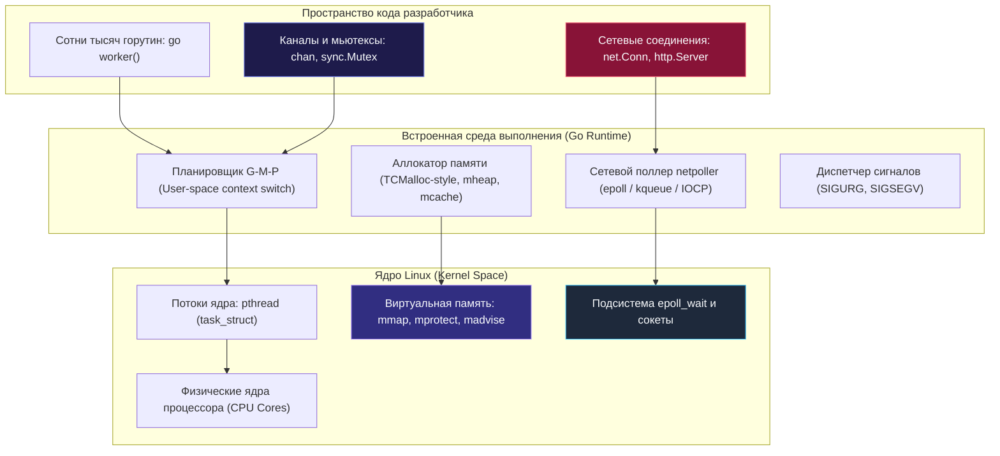
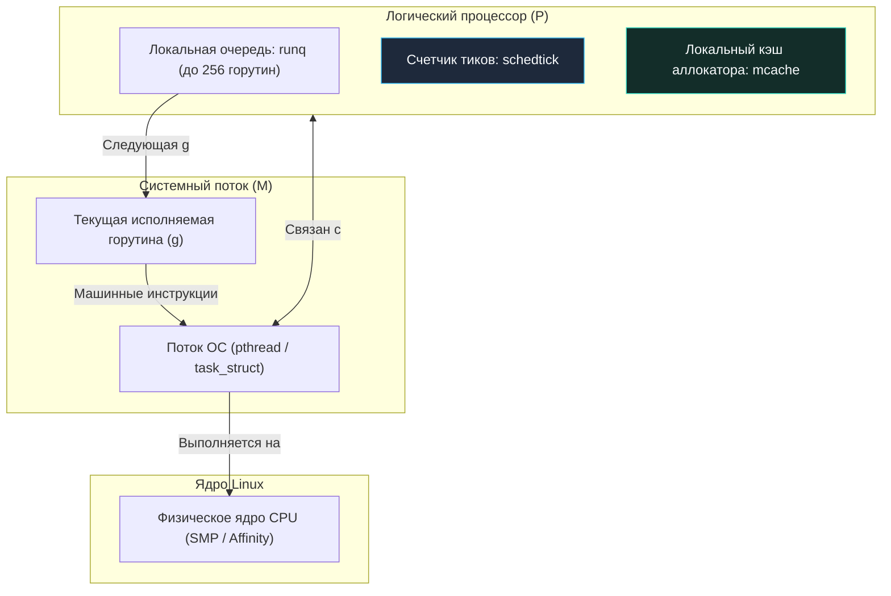
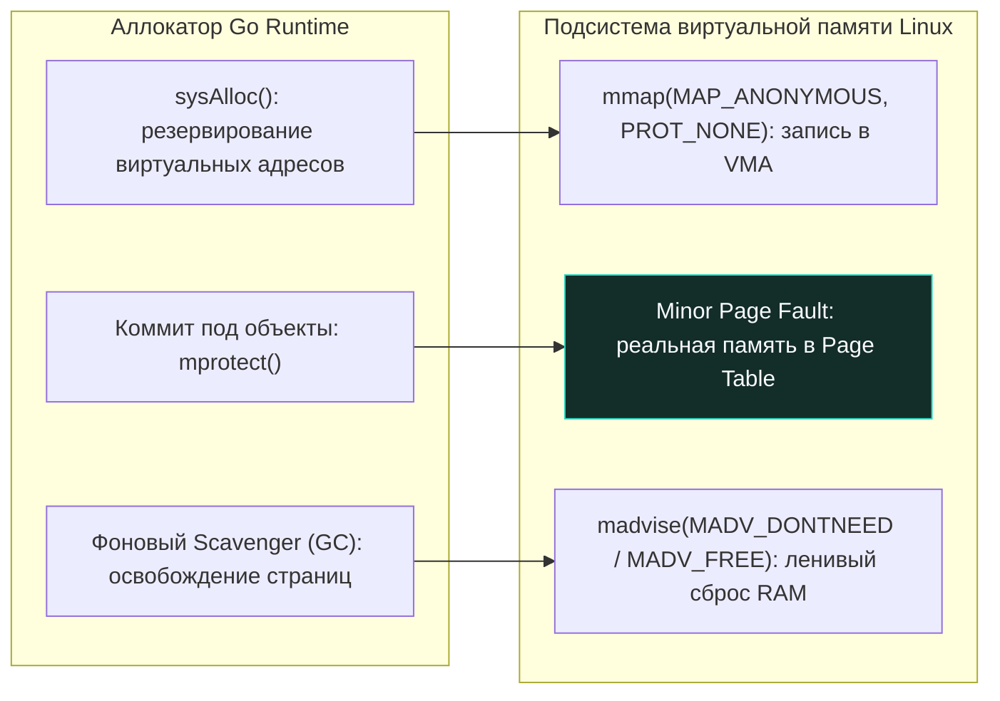
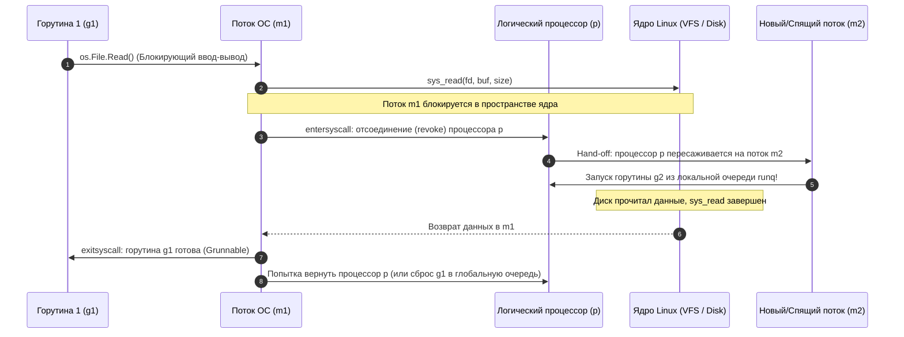

## Почему Go нужна своя среда выполнения

В отличие от скриптовых языков (PHP, Python, Ruby), работающих поверх тяжелых внешних интерпретаторов, или платформ JVM/.NET, требующих массивных виртуальных машин, язык Go компилируется непосредственно в нативный машинный код целевого процессора. Однако скомпилированный файл на Go — это не «голый» двоичный код, общающийся напрямую с кремнием. В каждый исполняемый бинарник компилятор встраивает развитую, высокоэффективную **среду выполнения — Go Runtime** (`runtime`).

Зачем современному языку программирования нужна собственная встроенная среда выполнения, если операционная система уже предоставляет богатый набор примитивов: системные потоки (`pthread`), страничную виртуальную память, файловые дескрипторы и сокеты?

Дело в том, что системные примитивы ядра Linux проектировались как универсальные, но относительно «тяжелые» строительные блоки. В сценариях экстремальных нагрузок (сотни тысяч одновременных WebSocket-соединений, микросервисные RPC-вызовы, обработка миллионов сетевых запросов в секунду) прямое использование механизмов ОС наталкивается на жесткие физические барьеры:
*   **Дороговизна переключения контекста (Context Switch):** переключение физических потоков ядра требует перехода процессора в привилегированный Ring 0, сброса конвейера инструкций, сохранения десятков регистров и инвалидации строк кэшей процессора и таблиц TLB (тысячи тактов CPU на каждое переключение).
*   **Фрагментация памяти (Memory Fragmentation):** частые вызовы классических функций `malloc/free` из стандартной библиотеки C (`glibc`) создают блокировки на уровне аллокатора и фрагментируют кучу.
*   **Исчерпание лимитов потоков ядра (Thread pool exhaustion):** создание 100 000 системных потоков ОС парализует ядро Linux и мгновенно упрется в лимиты памяти, ведь стек каждого системного треда по умолчанию занимает от 2 до 8 МБ.

Go Runtime решает эту фундаментальную задачу, выступая интеллектуальным посредником между абстракцией вашего кода и операционной системой. Он создает легковесную управляемую среду прямо поверх ядра Linux, даруя разработчику элегантную иллюзию миллионов одновременно работающих микропотоков — **горутин**.



## Модель планирования G-M-P: Мост между горутинами и потоками ОС

Ядро Linux ничего не знает о существовании горутин. Для планировщика ядра Linux (CFS или EEVDF) единицей планирования является исключительно поток операционной системы (`pthread`, представленный структурой ядра `task_struct`). Чтобы эффективно связать легковесный мир Go с тяжеловесным миром ОС, рантайм использует элегантную **модель G-M-P**:

| Сущность | Аналог в ядре ОС | Назначение и физический смысл |
| :---: | :--- | :--- |
| **`g`** (goroutine) | Поток в стеке ядра / легковесный поток | Контекст выполнения горутины: динамический стек (начиная всего с ~2 КБ), указатели инструкций (PC), указатели стека (SP), статус (`Gwaiting`, `Grunnable`, `Grunning`). |
| **`m`** (machine) | `pthread` / `sched_getaffinity` | Реальный системный поток ОС, созданный ядром через `clone(2)`. Исполняет физический машинный код на процессорном ядре. |
| **`p`** (logical processor) | Виртуальное ядро / `SMP` | Логический процессор (контекст выполнения), предоставляющий ресурсы для исполнения кода Go: локальная очередь готовых горутин (runq), кэш аллокатора памяти, счетчик тиков. |

Планировщик Go (`runtime.schedule`) работает исключительно в **User Space** (пространстве пользователя). Когда одна горутина уступает место другой (например, при чтении из канала или системном вызове), Go не обращается к ядру через системные вызовы `syscall`.

Вместо этого рантайм вызывает низкоуровневые ассемблерные процедуры (`gogo`, `gopark`, `goready`, расположенные в `src/runtime/asm_*.s`). Эти процедуры напрямую перезаписывают регистры процессора: меняют указатель вершины стека `RSP` и адрес следующей инструкции `RIP`. Это обеспечивает **zero-cost context switch**: переключение между горутинами занимает всего 10–20 наносекунд против сотен или тысяч наносекунд при переключении потоков ядра!



> [!info] Под капотом
> Структура `p` в исходном коде Go (`src/runtime/proc.go`) содержит кольцевой буфер `runq` (массив фиксированной длины на 256 указателей `*g`), указатели `runqhead`, `runqtail`, размер `runqsize`, счетчик тиков `schedtick` (используемый для обеспечения справедливости планирования и периодической проверки глобальной очереди), а также поле `syscall` (флаг блокировки потока на системном вызове). Число структур `p` фиксируется при старте программы в соответствии с переменной `GOMAXPROCS` и остается неизменным, гарантируя предсказуемость распределения вычислительной мощности по ядрам CPU.

## Управление памятью: `mmap`, `mprotect` и `madvise` под капотом

В отличие от программ на языке C, где аллокатор `glibc malloc` исторически двигал границу сегмента данных процесса через системные вызовы `brk/sbrk`, рантайм Go полностью отказывается от устаревших интерфейсов и управляет адресным пространством исключительно через современный системный вызов `mmap`:

1.  **Резервирование виртуального пространства (Virtual Reservation):**  
    При старте процесса функция аллокатора Go `sysAlloc` вызывает системный вызов `mmap` с флагами `MAP_ANONYMOUS | MAP_PRIVATE` и правами `PROT_NONE`. Рантайм мгновенно резервирует колоссальный диапазон виртуальных адресов (гигабайты адресного пространства), но **не запрашивает физическую память RAM**. Это действие бесплатно для физической оперативной памяти — ядро лишь регистрирует диапазон в структурах `vm_area_struct`.
2.  **Ленивый коммит физических страниц (Page Commit):**  
    По мере того как сервису требуются реальные блоки памяти для новых объектов, рантайм делает вызов `mprotect(addr, size, PROT_READ | PROT_WRITE)`. Только при первом физическом обращении процессора к этим адресам аппаратный блок MMU генерирует мягкое исключение Minor Page Fault, и ядро выделяет реальные физические страницы ОЗУ, настраивая записи в `Page Table`.
3.  **Возврат физической памяти операционной системе (Memory Reclamation):**  
    Когда сборщик мусора Go (GC) освобождает неиспользуемые объекты, рантайм не выполняет системный вызов `munmap` (который привел бы к разрушению виртуальных диапазонов). Фоновый сборщик мусора (scavenger) возвращает физические страницы ядру через вызов `madvise(addr, size, MADV_DONTNEED)`. В Linux этот вызов немедленно освобождает физические фреймы RAM и уменьшает RSS процесса (начиная с Go 1.16 рантайм вернулся к `MADV_DONTNEED` по умолчанию вместо отложенного `MADV_FREE`, чтобы RSS в мониторинге отражал реальное потребление). При следующем обращении ядро прозрачно предоставит чистую страницу.



> [!warning] Ловушка / Gotcha
> **Кажущаяся «утечка памяти» и поведение RSS в продакшене:**  
> Очень часто разработчики наблюдают, что после обработки огромного всплеска нагрузки и очистки данных сборщиком мусора показатель резидентной памяти процесса (`RSS`) в выводе `top` не падает. Это не означает утечки памяти (Memory Leak)! Это совместная работа `madvise`, `Page Cache` и фрагментации памяти (`Memory Fragmentation`).  
> Go возвращает страницы ядру лениво, чтобы при следующем наплыве трафика мгновенно повторно использовать уже выделенные адреса без тяжелых системных вызовов к ядру. Рантайм Go агрессивно возвращает физическую память ядру только при нарастании системного давления (например, при явных вызовах `mmap` огромных размеров или экстремальных настройках вроде `GOGC=1`). В Go 1.19+ для тонкого управления памятью контейнера введен механизм мягкого лимита памяти `GOMEMLIMIT`.

## Обработка блокирующих вызовов и парковка горутин

Что происходит, когда горутина инициирует длительную блокирующую операцию на уровне операционной системы — например, чтение большого файла с диска (`os.File.Read`) или синхронное подключение к сокету базы данных (`net.Dial`)?

Поскольку ядро Linux работает с потоками ОС, системный тред `m`, на котором выполнялась данная горутина, физически засыпает внутри ядра (блокируется в системном вызове). Если бы планировщик Go ничего не предпринимал, то логический процессор `p` остался бы парализованным вместе с этим тредом, а сотни остальных готовых к исполнению горутин замерли бы в очереди!

Чтобы предотвратить блокировку всей системы, Go Runtime применяет отточенный механизм **Hand-off (передача процессора) и Parker (парковка горутин)**:

1.  **Вход в системный вызов:** Перед выполнением потенциально блокирующего вызова рантайм проверяет флаги горутины (`g.lockedm != 0`) и вызывает служебную процедуру `entersyscall`.
2.  **Отсоединение логического процессора (Hand-off):** Планировщик временно отвязывает (`revoke`) логический процессор `p` от заблокированного потока `m`. Тред `m` уходит в глубокий сон внутри ядра, удерживая только заблокированную горутину `g`.
3.  **Спасение очереди горутин:** Освободившийся процессор `p` немедленно подхватывается другим свободным потоком `m` из пула спящих тредов (либо рантайм динамически порождает новый поток через системный вызов `pthread_create`), и выполнение оставшихся горутин из очереди `runq` мгновенно продолжается на другом ядре CPU!
4.  **Пробуждение и возвращение в строй:** Когда системный вызов на диске завершается, поток `m` просыпается и вызывает процедуру `exitsyscall`. Рантайм пытается вернуть поток `m` к его родному процессору `p`. Если процессор занят, горутина `g` переводится в статус `Grunnable` и отправляется в глобальную очередь задач, а освободившийся поток `m` паркуется в пул ожидания.



> [!tip] Собеседование
> **Вопрос:** Почему в некоторых условиях высоконагруженный Go-сервис может создать более 10 000 системных потоков ОС (`pthread`), несмотря на то, что `GOMAXPROCS` равен 8?  
> **Ответ:** Это происходит при лавине блокирующих системных вызовов (например, синхронный дисковый ввод-вывод `os.File.Read` на медленных дисках NFS, разрешение DNS через системный `cgo`, или обращение к внешним библиотекам через CGo). Каждый раз, когда поток `m` блокируется в ядре, планировщик Go осуществляет hand-off процессора `p` и запускает новый системный тред через `pthread_create`, чтобы не допустить простоя очередей горутин. Если тысячи горутин одновременно повисли в системных вызовах, количество потоков `m` лавинообразно нарастает. В штатной ситуации после спада нагрузки лишние потоки постепенно уничтожаются рантаймом через вызов `pthread_exit`.

## Сетевой поллер (`netpoll`) и мультиплексирование IO

Сетевой ввод-вывод в Go радикально отличается от дискового: Go **никогда не блокирует поток операционной системы `m` на сетевых сокетах**!

Вместо создания отдельного системного потока на каждое сетевое соединение, рантайм Go реализует реактивную событийно-ориентированную модель (Event-Driven I/O) на базе встроенного сетевого поллера — **`netpoll`**:
*   В Linux: нативный интерфейс **`epoll`** (`epoll_create`, `epoll_ctl`, `epoll_wait`).
*   В FreeBSD и macOS: подсистема **`kqueue`** (`kqueue`, `kevent`).
*   В Windows: порты завершения ввода-вывода **`IOCP`** (I/O Completion Ports).

При создании слушателя `net.Listener` или установке исходящего соединения (`net.Dial`, `net.Dialer`) рантайм Go переводит сетевой файловый дескриптор в неблокирующий режим с помощью системного вызова `syscall.SetNonblock(fd, true)` и регистрирует этот `fd` в дескрипторе `epoll`.

Когда горутина вызывает метод чтения `netFD.Read/Write`, а в сетевом буфере сокета ядра еще нет данных:
1.  Системный вызов возвращает ошибку `EAGAIN` или `EWOULDBLOCK`.
2.  Go Runtime переводит текущую горутину в состояние ожидания `Gwaiting` и паркует ее с помощью ассемблерной функции `gopark`.
3.  Поток ОС `m` остается абсолютно свободным и немедленно берет на исполнение следующую готовую горутину из очереди!
4.  Специальный системный поток или фоновый цикл планировщика вызывает системный вызов `epoll_wait`. Как только сетевая карта принимает сетевые пакеты TCP, ядро пробуждает поллер.
5.  Поллер находит спящую горутину в структуре кэша дескрипторов `pollCache` и с помощью вызова `goready` переводит ее в состояние `Grunnable`, возвращая в очередь выполнения. Для разработчика код выглядит кристально чистым и последовательным: `data, err := conn.Read()`.

```mermaid
flowchart LR
    classDef process  fill:#1e293b,stroke:#38bdf8,stroke-width:1px,color:#f8fafc
    classDef success  fill:#064e3b,stroke:#34d399,stroke-width:1px,color:#f8fafc
    classDef error    fill:#7f1d1d,stroke:#f87171,stroke-width:1px,color:#f8fafc
    classDef warning  fill:#78350f,stroke:#fbbf24,stroke-width:1px,color:#f8fafc
    classDef entry    fill:#1e3a5f,stroke:#38bdf8,stroke-width:2px,color:#f8fafc
    classDef aux      fill:#334155,stroke:#64748b,stroke-width:1px,color:#f8fafc
    classDef system   fill:#312e81,stroke:#a78bfa,stroke-width:1px,color:#f8fafc
    classDef data     fill:#132d29,stroke:#2dd4bf,stroke-width:1px,color:#f8fafc
    classDef network  fill:#881337,stroke:#fb7185,stroke-width:1px,color:#f8fafc
    classDef accent   fill:#1e1b4b,stroke:#818cf8,stroke-width:1px,color:#f8fafc
    Client["Внешний TCP клиент"]:::entry -->|TCP Data Packet| SocketFD["Сетевой сокет (fd non-blocking)"]
    SocketFD -->|epoll_ctl (EPOLLIN)| EpollEngine["Сетевой поллер netpoll (epoll)"]
    EpollEngine -->|epoll_wait возвращает готовый fd| M_Worker["Поток ОС (m)"]
    M_Worker -->|goready(g)| RunnableQueue["Горутина g переведена в Grunnable"]
    RunnableQueue -->|conn.Read() успешно завершен| UserLogic["Бизнес-логика Go"]
```

> [!info] Под капотом
> Сетевой поллер Go организует хранение контекстов дескрипторов в специальной кэш-структуре `pollCache` (динамически расширяемом пуле дескрипторов). При получении пачки готовых событий от ядра через системный вызов `epoll_wait`, поллер обходит список готовых `fd`, проверяет статус неблокирующего чтения/записи `netFD.Read/Write` и атомарно разблокирует ожидающие горутины, направляя их в локальные очереди процессоров `p`. Это полностью устраняет накладные расходы на блокировки ядра и обеспечивает практически идеальную утилизацию ядер CPU при работе с сетью.

## Обработка сигналов и пробуждение планировщика

Go Runtime регистрирует собственные обработчики системных сигналов операционной системы прямо при старте процесса, используя низкоуровневый вызов `rt_sigaction`:

| Сигнал ядра | Роль и назначение в архитектуре Go Runtime |
| :--- | :--- |
| **`SIGURG`** | **Асинхронная вытесняющая многозадачность (Non-cooperative preemption).** Начиная с версии Go 1.14, планировщик Go не ждет, пока горутина добровольно вызовет функцию или выделит память в бесконечном цикле. Фоновый тред `sysmon` детектирует зависшую горутину и посылает потоку `m` сигнал `SIGURG`. Обработчик сигнала ядра прерывает поток и принудительно переключает контекст регистров, спасая приложение от зависания! |
| **`SIGSEGV` / `SIGBUS`** | Аппаратные сбои адресации памяти. Перехватываются рантаймом и транслируются в контролируемую Go-панику (`panic: runtime error`) через функцию `sigpanic`. |
| **`SIGUSR1` / `SIGUSR2`** | Сигналы межпоточного взаимодействия и системной отладки, а также обработка специфических состояний вроде переполнения стека горутины `SIGSTKFLT`. |
| **`SIGPOLL` / `SIGIO`** | netpoll на современных платформах не является сигнальным. Пробуждение происходит через возврат из epoll_wait / kevent / IOCP. Сигналы (`SIGIO`/`SIGPOLL`) используются Go крайне редко (в основном для legacy-совместимости или специфичных BSD-путей) и не являются механизмом event-loop и не требуют постоянных опросов (`polling`). |
| **`SIGWINCH`** | Сигнал изменения геометрии окна терминала, перехватываемый стандартной библиотекой для корректного обновления размера буфера консольного вывода `os.Stdout`. |

## Mechanical Sympathy: Влияние на производительность и кэш CPU

Глубокое понимание физического взаимодействия среды выполнения Go с операционной системой открывает путь к максимальной производительности:

1.  **Стоимость переключения контекста:**  
    Переключение легковесных горутин `g -> g` в пространстве пользователя требует всего ~100–300 наносекунд. Переключение системных тредов `m -> m` через ядро Linux обходится в 1000–5000 наносекунд, сопровождаясь сбросом конвейера и инвалидацией записей TLB. Именно поэтому рантайм Go стремится минимизировать число системных потоков `m`, жестко балансируя их через `GOMAXPROCS`.
2.  **Локальность процессорных кэшей (Cache Locality):**  
    Горутины, привязанные к локальной очереди одного логического процессора `p`, исполняются на одном и том же физическом потоке `m` и делят между собой сверхбыстрый кэш L1/L2 одного процессорного ядра. Это радикально сокращает число промахов кэша (`cache miss`) по сравнению с архитектурами, где задачи хаотично разбрасываются по разным ядрам процессора.
3.  **Архитектура NUMA и привязка к сокетам:**  
    На многосокетных серверах с архитектурой неравномерного доступа к памяти (NUMA) рантайм Go не распределяет память по узлам автоматически. Однако грамотный SRE-инженер может использовать системные утилиты Linux `taskset` или `numactl`, привязывая группы потоков Go-процесса к конкретным NUMA-нодам и исключая медленные межсокетные транзакции по шине QPI/UPI.
4.  **Сборка мусора и системные аллокации:**  
    Во время работы фазы маркировки GC рантайм сканирует указатели памяти. Если процессу не хватает адресного пространства или ядро блокирует выделение виртуальных страниц `mmap`, рантайм генерирует неустранимую фатальную ошибку `fatal error: cannot allocate memory`, даже если на сервере остается свободная физическая RAM.

> [!warning] Ловушка / Gotcha
> **Иллюзия пользы завышенного `GOMAXPROCS`:**  
> Искусственное увеличение `GOMAXPROCS` значительно выше числа реальных физических ядер CPU не ускорит математические вычисления (CPU-bound задачи). Напротив, это приведет к разрушительной межъядерной борьбе за процессор, лавинообразному росту context switches (`cs` в `vmstat`) и вымыванию строк процессорного кэша (**`cache thrashing`**). Значение `GOMAXPROCS` должно строго соответствовать количеству физических или выделенных контейнеру процессорных квот (используйте библиотеку `uber-go/automaxprocs` в средах Kubernetes).

## Типичные вопросы на собеседованиях (Middle+/Senior)

1.  **Как Go обрабатывает блокирующие системные вызовы, не блокируя весь процесс?**  
    *Ответ:* Планировщик использует механизм Syscall Hand-off. Перед вызовом ядрового `sys_read` рантайм отсоединяет логический процессор `p` от системного потока `m`. Тред `m` засыпает в ядре, а освободившийся `p` подхватывается другим потоком из пула, продолжая исполнять горутины. При возврате из syscall горутина возвращается в очередь планирования. Если свободных потоков `m` нет, рантайм динамически вызывает `pthread_create`.
2.  **Почему RSS Go-процесса не падает сразу после вызова `runtime.GC()`?**  
    *Ответ:* Вызов `runtime.GC()` освобождает объекты внутри Go heap, но не возвращает страницы ядру ОС автоматически в ту же миллисекунду. Возвратом физических страниц ОС занимается фоновый процесс очистки (scavenger), периодически вызывающий `madvise(addr, size, MADV_DONTNEED)`. Кроме того, Go может повторно использовать свободные spans для новых аллокаций. Принудительно вернуть освобожденные физические страницы ядру можно вызовом функции `debug.FreeOSMemory()`.
3.  **Чем концептуально `GOMAXPROCS` отличается от реального количества ядер процессора?**  
    *Ответ:* Переменная `GOMAXPROCS` задает количество логических процессоров `p` (контекстов выполнения Go), способных одновременно исполнять пользовательский Go-код. Количество системных потоков ОС `m` при этом может быть значительно больше `GOMAXPROCS` (до 10 000) из-за потоков, заблокированных в дисковом вводе-выводе или вызовах CGo.
4.  **Как сетевой поллер `netpoll` защищается от проблемы Thundering Herd (эффекта громогласного стада) при работе с `epoll`?**  
    *Ответ:* Go регистрирует сетевые дескрипторы один раз в режиме триггера по фронту (`EPOLLET`). Сетевой поллер централизованно опрашивает сокеты через `epoll_wait` (в планировщике или потоке `sysmon`) и извлекает готовые события. Пробуждение и распределение горутин происходит в userspace через структуру `pollDesc` с атомарными флагами и вызовом `goready()`. Благодаря edge-triggered режиму исключаются лишние пробуждения тредов и постоянные вызовы `epoll_ctl(EPOLL_CTL_MOD)`.

## Итог

1.  **Go Runtime как архитектурный мост:** Рантайм Go — это высокопроизводительная виртуальная машина пространства пользователя, превращающая грубые системные интерфейсы Linux в сверхлегковесные и безопасные абстракции.
2.  **Планировщик G-M-P:** Осуществляет переключение контекста между горутинами (`g`) на уровне регистров CPU за десятки наносекунд без системных вызовов в ядро Linux.
3.  **Виртуальная память нового поколения:** Go отказывается от `brk` и `malloc`, резервируя гигабайты адресного пространства через `mmap` и лениво возвращая страницы операционной системе через системный вызов `madvise(MADV_DONTNEED)`.
4.  **Сетевой поллер `netpoll`:** Интегрируется с низкоуровневыми селекторами ядра (`epoll`, `kqueue`, `IOCP`), исключая блокировку потоков ОС на сетевых сокетах.
5.  **Асинхронная вытесняющая многозадачность:** Сигнал `SIGURG` гарантирует, что даже непрерывные циклы без вызовов функций не смогут заблокировать планировщик Go.

Мы изучили архитектурный союз операционной системы и рантайма Go. Теперь настало время подняться на самую вершину и взглянуть на весь пройденный путь целиком. В финальной лекции второго модуля мы сведем все воедино: кремний процессора, виртуальную память, системные вызовы, планировщик и сеть — в цельную инженерную картину мира Go-разработчика.

Переходим к грандиозному финалу: [[63. Итоги раздела. Картина ОС целиком для Go-разработчика.md]].
