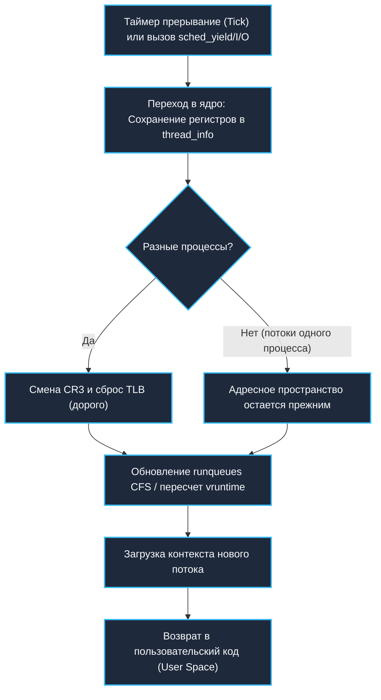

## Фундамент: Кто решает, кто исполняется?

> *«Цель вычислений — понимание, а не числа. А цель планировщика — справедливость, а не судорожная спешка».*    
> — Вольная перефразировка Ричарда Хэмминга

Когда вы пишете код на Go, ваш разум оперирует абстракциями высокого полета: легкими горутинами, каналами, контекстами и неблокирующим вводом-выводом. Кажется, будто сотни тысяч задач парят в воздухе сами по себе.

Но процессор из кремния и меди ничего не знает о ваших горутинах. Арифметико-логические устройства (ALU) ядра CPU выполняют исключительно машинные инструкции системных потоков (**threads**) операционной системы.

**Планировщик ОС (OS Scheduler)** — это верховный арбитр и дирижер ядра, который ежесекундно решает, какой именно системный поток получит доступ к физическому ядру CPU прямо сейчас, на сколько наносекунд ему будет предоставлен процессор и когда его бесцеремонно вытеснят ради других задач.

Для Go-инженера понимание планировщика ОС жизненно необходимо по трем причинам:
1. **Рантайм Go не управляет физическим кремнием напрямую.** Он лишь запрашивает у ядра операционной системы пул системных потоков (`GOMAXPROCS`), а затем раскладывает свои горутины по этим потокам. Если планировщик ОС решит снять поток вашего Go-приложения с ядра, все тысячи горутин на этом потоке моментально замирают, даже если сервер кажется ненагруженным.
2. **Производительность бэкенда привязана к локальности кэшей.** Когда планировщик ядра хаотично мигрирует поток с ядра 0 на ядро 7, процессор теряет горячие кэш-линии L1/L2 и сбрасывает кэш трансляции адресов TLB. Это стоит тысячи тактов впустую.
3. **Поведение `time.Sleep`, блокировок и IO** напрямую зависит от того, как планировщик ядра рассчитывает приоритеты и управляет очередями исполнения (`runqueues`).

Исторически стандартом де-факто в Linux долгие годы был **CFS (Completely Fair Scheduler)**. Однако в современных ядрах Linux (начиная с Linux 6.6+) на смену ему пришел еще более совершенный алгоритм **EEVDF (Earliest Eligible Virtual Deadline First)**. Давайте разберем эту эволюцию от фундаментальных принципов до современного железа.

---

## Алгоритм CFS: Справедливость через vruntime

Исторические планировщики делили процессорное время на жесткие кванты (Time Slices, например, по 10 или 50 миллисекунд). Это приводило к рывкам: интерактивные задачи тормозили, а фоновые расчеты забирали слишком много непрерывного времени.

CFS (Completely Fair Scheduler), созданный Инго Молнаром для Linux 2.6.23, ввел революционную идею: **идеального многозадачного процессора (Ideal Multi-tasking CPU)**. В идеальном мире, если у вас есть $N$ задач, процессор делил бы свою мощность ровно на $N$ частей, исполняя их одновременно со скоростью $1/N$. В реальности ядро должно квантовать время, поэтому CFS отслеживает, сколько виртуального процессорного времени получила каждая задача. Эта метрика называется **virtual runtime (vruntime)**.

Золотое правило CFS предельно лаконично: **процессор всегда отдается той задаче, у которой значение `vruntime` наименьшее**.

```
           КРАСНО-ЧЕРНОЕ ДЕРЕВО ЗАДАЧ CFS (RB-TREE)
                            [Задача C]
                            vruntime=14ms
                           /             \
              [Задача B]                     [Задача D]
              vruntime=8ms                   vruntime=22ms
             /
    ┌────────────────┐
    │ ★ [Задача A]   │  <-- rb_first (Крайний левый узел)
    │  vruntime=3ms  │      ВСЕГДА ВЫБИРАЕТСЯ СЛЕДУЮЩЕЙ!
    └────────────────┘
```

### Как работает vruntime?

Каждое ядро CPU имеет свой собственный дескриптор очереди исполнения `runqueue`. Когда задача выполняется на ядре, ее `vruntime` монотонно увеличивается. Однако скорость этого роста обратно пропорциональна приоритету задачи (значению `nice`):

```math
vruntime_{next} = vruntime_{current} + (delta_exec * NICE_0_LOAD) / load.weight
```

Разберем эту формулу по косточкам:
- `delta_exec` — реальное физическое время, которое задача только что провела на CPU (в наносекундах).
- `NICE_0_LOAD` — константа базового веса задачи с нейтральным приоритетом `nice = 0` (в ядре Linux равна 1024).
- `load.weight` — вес текущей задачи, вычисленный на основе ее nice-значения.
  - Чем выше приоритет задачи (отрицательный `nice`, например `-5`), тем выше ее `weight`. В результате дробь уменьшается, и ее `vruntime` растет **медленнее**. Задача дольше остается в левой части дерева и чаще получает процессор!
  - Для задач с низким приоритетом (положительный `nice`, например `+10`) `weight` мал, дробь велика, и `vruntime` взлетает как ракета, быстро отбрасывая задачу в правую часть очереди.

CFS также использует системные пороги сглаживания `sched_latency_ns` (период, за который все готовые задачи должны получить хотя бы один квант, обычно ~6 мс) и `sched_min_granularity_ns` (минимальный неделимый квант времени задачи на CPU, обычно ~0.75 мс). Это защищает процессор от вырожденного случая, когда сотни задач переключались бы каждую микросекунду, сжигая все ресурсы на Context Switch.

> [!info] Под капотом: Структуры ядра и EEVDF
> В исходниках ядра Linux (`kernel/sched/fair.c`) ключевая структура — это сущность планирования:
> ```c
> struct sched_entity {
>     struct load_weight  load;
>     struct rb_node      run_node;
>     u64                 vruntime;
>     u64                 exec_start;
>     u64                 sum_exec_runtime;
>     // ...
> };
> ```
> В CFS планировщик хранит задачи в самобалансирующемся красно-черном дереве (RB-tree), отсортированном по возрастанию `vruntime`. Выбор следующей задачи — это просто взятие крайнего левого листа (`rb_first`), закешированного в указателе за $O(1)$.
> 
> **Современность (Linux 6.6+ и EEVDF):**  
> Хотя концепция CFS гениальна, она страдала от компромисса между пропускной способностью (throughput) и временем отклика (latency). В ядре Linux 6.6 Питер Зейлстра перевел класс справедливого планирования (`fair_sched_class` в `kernel/sched/fair.c`) на алгоритм **EEVDF**. EEVDF сохраняет понятие `vruntime`, но добавляет расчет виртуального дедлайна (Virtual Deadline). Если потоку нужно быстро ответить на сетевой пакет (I/O), его дедлайн наступает раньше, и он получает процессор немедленно, даже если его `vruntime` чуть больше соседей.

---

## Context Switch: Что происходит за кулисами

Когда таймер процессорных прерываний сигнализирует о завершении кванта или текущий поток добровольно засыпает в ожидании I/O, ядро активирует центральную функцию планирования — `schedule()`.

Это тяжелейшая системная операция, включающая пять обязательных шагов:

1. **Сохранение контекста текущего потока:** Все регистры общего назначения CPU (`RAX`, `RBX`, `RCX`, `RSI`, `RDI`, `RBP`, `RSP`, `RIP`, регистр флагов `RFLAGS`) и регистры векторных расширений AVX/FPU сохраняются в структуру `thread_info` и стек ядра текущего потока.
2. **Смена стека ядра:** Указатель стека ядра `RSP` перезаписывается на значение стека ядра выбранного нового потока.
3. **Смена адресного пространства (MMU):** Если новый поток принадлежит другому процессу, ядро обязано загрузить физический адрес новой таблицы страниц PML4 в системный регистр процессора `CR3`. Это действие инициирует **сброс TLB (Translation Lookaside Buffer)**, лишая процессор кэшированных переводов виртуальных адресов в физические.
4. **Обновление очередей планировщика:** Текущий поток с обновленным `vruntime` заново балансируется в дереве CFS/EEVDF, а если задача мигрирует на другое ядро — переносится в `runqueue` целевого процессора.
5. **Загрузка контекста нового потока:** Регистры нового потока вычитываются из его памяти, и процессор совершает аппаратный прыжок (`JMP` / `IRET`) по адресу сохраненного `RIP`.



**Цена вопроса:** Один Context Switch на современных архитектурах x86-64 и ARM64 стоит от **1000 до 5000 тактов CPU** (от 1 до 5 микросекунд). Если сервер выполняет 100 000 недобровольных переключений контекста в секунду, до 30–50% всей вычислительной мощности машины уходит на бесполезное перекладывание регистров и разогрев холодного кэша!

---

## Go Runtime и OS Scheduler: Границы взаимодействия

Создатели Go понимали эту проблему лучше многих. Поэтому рантайм Go выстроен так, чтобы свести прямое обращение к планировщику ОС к абсолютному минимуму.

### Модель G-M-P

В рантайме Go действует трехуровневая модель абстракции:
- **G (Goroutine):** Легковесная единица исполнения с динамическим стеком от 2 КБ.
- **M (Machine):** Реальный системный поток ОС (`task_struct`), созданный вызовом ядра `clone()`.
- **P (Processor):** Логический контекст выполнения, пул ресурсов для запуска Go-кода. Количество `P` строго ограничено переменной `GOMAXPROCS`.

Планирование горутин внутри Go происходит полностью в пользовательском пространстве (User Space) через функции рантайма `runtime.schedule` и `findrunnable`:

- **CPU-bound задачи:** Все логические процессоры `P` непрерывно заняты. Горутины переключаются за десятки наносекунд без участия ядра ОС. Планировщик Linux видит просто стабильный набор из `N` потоков, равномерно загружающих доступные ядра.
- **IO-bound задачи:** Когда горутина блокируется (чтение из сетевого сокета, ожидание канала или системный вызов), рантайм вызывает функцию `gopark()`. Горутина отцепляется от потока, а освободившийся поток `m` тут же подхватывает следующую готовую задачу. Если же поток `m` намертво заблокирован в синхронном системном вызове дискового ввода-вывода (блокирующий `syscall`), рантайм Go временно отсоединяет от него процессор `P` и создает (или берет из пула) новый поток `m` для продолжения работы остальных горутин.

> [!warning] Ловушка / Gotcha: GOMAXPROCS и CFS Throttling в Kubernetes
> Переменная `GOMAXPROCS` управляет количеством **активных потоков ОС**, исполняющих Go-код одновременно, а не числом горутин!
> 
> Если вы явно укажете `runtime.GOMAXPROCS(1)`, рантайм будет использовать ровно один поток ОС для пользовательского кода. Даже если физический сервер оснащен 128 ядрами, параллелизм вашего сервиса схлопнется до одного ядра. Исторически (начиная с Go 1.5) по умолчанию `GOMAXPROCS` автоматически выставляется в `runtime.NumCPU()`.
> 
> **Смертельная ловушка в Docker и K8s:**  
> Системный вызов `runtime.NumCPU()` возвращает количество физических ядер всей **хост-ноды**, а не лимит контейнера! Если ваша нода имеет 64 ядра, а поду в Kubernetes выставлен лимит `resources.limits.cpu: "2"`, рантайм Go создаст 64 потока ОС.  
> Планировщик Linux CFS увидит 64 активных потока, сервис мгновенно исчерпает положенную квоту времени (`cpu.cfs_quota_us`) за первые 10 миллисекунд периода, после чего ядро Linux **жестко заморозит весь контейнер (CFS Throttling)** на оставшиеся 90 миллисекунд!  
> *Решение:* Всегда подключайте библиотеку `go.uber.org/automaxprocs` в `main.go`, которая считывает квоты из `cgroups v1/v2` и автоматически корректирует `GOMAXPROCS`.

### NUMA и миграция потоков

На современных двухсокетных или чиплетных серверах память разделена на NUMA-узлы (Non-Uniform Memory Access). Обращение к локальной оперативной памяти, распаянной возле сокета текущего CPU, занимает ~20 нс, а чтение из памяти соседнего сокета через шину межпроцессорного соединения (UPI / Infinity Fabric) — от 70 до 120 нс!

Если планировщик ОС решит перебросить поток `m` на процессор другого NUMA-узла, локальность кэша разрушается. Для сверхкритичных Go-приложений с ультранизкой задержкой сервисы запускают с жесткой привязкой к NUMA-домену:
```bash
numactl --cpunodebind=0 --membind=0 ./my_service
```

> [!tip] Собеседование
> **Вопрос:** Чем опасен вызов `runtime.LockOSThread()` и почему его нельзя использовать без острой необходимости?
> 
> **Ответ:** Вызов `runtime.LockOSThread()` жестко привязывает текущую горутину к конкретному потоку ОС `m`, выставляя потоку внутренний флаг `MLOCKED`. 
> 
> Это наносит три тяжелых удара по рантайму:
> 1. Планировщик Go теряет право перемещать эту горутину на другие свободные потоки `m`.
> 2. Другие горутины не могут исполняться на этом заблокированном потоке `m`.
> 3. Если залоченная горутина засыпает на канале или делает тяжелый I/O, связанный системный поток `m` простаивает, ломая балансировку Work-Stealing. При неосторожном использовании это легко приводит к исчерпанию пула потоков ядра и взаимным блокировкам (Deadlocks).
> 
> Вызов `runtime.LockOSThread()` допустим **только** в исключительных сценариях: при интеграции с CGO-библиотеками с Thread-Local Storage (например, OpenGL, графические тулкиты, Cocoa) или при прямой настройке маски ядра через `pthread_setaffinity_np`.

---

## Практика и отладка

Как бэкенд-разработчику собственными глазами увидеть влияние планировщика Linux на Go-сервис?

1. **Проверка привязки к конкретному ядру CPU:**
   ```bash
   # Вывести PID, имя процесса и номер текущего ядра CPU (PSR)
   ps -eo pid,comm,psr | grep myapp
   ```
2. **Анализ типов переключения контекста:**
   ```bash
   # Метрики планировщика в виртуальной файловой системе /proc
   cat /proc/$(pgrep myapp)/sched | grep -E "voluntary|involuntary"
   ```
   Либо воспользуйтесь классической утилитой `pidstat`:
   ```bash
   pidstat -w -p $(pgrep myapp) 1
   ```
   Здесь критически важно различать два значения:
   - `voluntary` (добровольные переключения): Поток сам уступил ядро, заблокировавшись на системном вызове, ожидании сокета или таймере. Это нормальное рабочее состояние бэкенда.
   - `involuntary` (недобровольные вытеснения): Поток хотел продолжать вычисления, но планировщик ядра насильно согнал его с CPU, так как истек выделенный квант времени или пришла более приоритетная задача.
3. **Диагностика проблем в Go:** Если счетчик `involuntary` переключений зашкаливает (тысячи в секунду на поток), ваше приложение страдает от борьбы за процессор (CPU Contention). Типичные причины:
   - Несоответствие `GOMAXPROCS` реальным лимитам контейнера в Kubernetes.
   - Запуск CPU-bound микросервиса на виртуальной машине с Oversubscription (переподпиской vCPU хоста).
   - Активная работа шумных соседей по серверу (демоны сборки логов, мониторинг, сторонние фоновые агенты).

---

## Итог

1. **Планировщик ОС** — верховный судья времени CPU. Классический Linux опирался на CFS с расчетом виртуального времени `vruntime`, а современные ядра (6.6+) переходят на алгоритм EEVDF для лучшего баланса отклика и производительности.
2. **Context Switch** — дорогая аппаратная операция. Перезапись регистра `CR3`, сброс TLB и вымывание кэшей CPU сжигают тысячи тактов на каждое переключение между процессами.
3. **Рантайм Go** минимизирует вмешательство ядра: через модель G-M-P и локальные очереди горутины сменяют друг друга за наносекунды в User Space.
4. **Следите за контейнерами:** Всегда используйте `automaxprocs` в сервисах под Kubernetes, чтобы рантайм Go не конфликтовал с квотами CFS ядра.
5. Привязка потоков через `runtime.LockOSThread()` должна быть хирургически точной и редкой мерой, иначе вы парализуете масштабируемость планировщика Go.

Мы выяснили, как ядро выбирает поток для исполнения. Но почему само аппаратное переключение между потоками столь болезненно бьет по кэшам микропроцессора? В следующей статье мы разберем анатомию этого явления на уровне кремния: [[9. Context Switch. Почему переключение между потоками дорого]].
