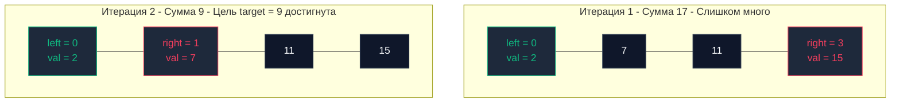

## Введение: Преодоление квадратичного барьера вложенных циклов

В предыдущих главах ([[1. Линейный поиск]] и [[2. Бинарный поиск]]) мы детально анализировали алгоритмы, использующие **одиночный** активный индекс для обхода данных. Линейный поиск последовательно перебирает элементы, а бинарный совершает логарифмические прыжки по вычисляемым серединам.

Однако в реальной практике проектирования систем существует обширный класс задач, где наивное использование одного индекса неизбежно приводит к вложенным циклам и тяжелой квадратичной сложности $O(N^2)$. Чтобы снизить временные затраты до линейных $O(N)$ при абсолютно нулевом потреблении дополнительной динамической памяти ($O(1)$), алгоритмика применяет фундаментальный паттерн **Двух указателей (Two Pointers)**.

---

## Что такое техника двух указателей?

Два указателя — это не отдельная структура данных, а мощный **архитектурный паттерн** обхода линейных структур (срезов, массивов, связных списков). Суть метода заключается в скоординированном перемещении двух целочисленных индексов по коллекции по детерминированным правилам до тех пор, пока задача не будет решена либо указатели не исчерпают пространство допустимых состояний.

---

## Mechanical Sympathy: Идеальный код для железа

Почему паттерн двух указателей считается золотым стандартом в высоконагруженном бэкенде?

1. **Zero Allocations (Абсолютный ноль аллокаций):** Паттерн манипулирует данными строго *in-place*. Мы трансформируем срез в границах уже выделенного блока памяти. Метрика `GC Churn` равна строго нулю: сборщик мусора Go не совершает ни одного цикла очистки.
2. **Кэш-локальность (Cache-friendly):** В отличие от древовидных структур, где узлы хаотично разбросаны по виртуальной памяти, два указателя непрерывно движутся по смежным адресам.  
   Современные процессоры (архитектур Intel Core, AMD Zen, Apple Silicon) оснащены многоканальными аппаратными префетчерами (`Hardware Prefetchers`). Они способны одновременно отслеживать и подкачивать несколько независимых потоков данных (`Data Streams`). Если один указатель читает срез слева направо, а второй движется справа налево, контроллер памяти параллельно доставляет кэш-линии с обоих флангов массива прямо в быстрейший `L1-кэш`.

---

## Паттерн 1: Встречное движение (Opposite Ends)

Наиболее распространенная модификация техники. Левый указатель (`left`) инициализируется на нулевом элементе, правый (`right`) — на замыкающем. На каждой итерации указатели шагают навстречу друг другу, пока условие `left < right` истинно (завершаясь при `left >= right`).

**Сфера применения:** Реверс срезов, проверка на палиндром, поиск пары с заданной суммой в отсортированном массиве (`Two Sum II`), расчет максимальной емкости контейнера (Container With Most Water).

### Пример с собеседования: Two Sum II (Отсортированный массив)

**Задача:** Дан отсортированный по возрастанию срез чисел и целевая сумма `target`. Найти значения двух элементов, сумма которых в точности равна `target`. Ограничение по памяти: строго $O(1)$.

Вложенные циклы `for` дают неприемлемое время $O(N^2)$. Использование хеш-таблицы требует $O(N)$ памяти и нагружает GC. Техника встречных указателей гарантирует **$O(N)$ по времени и строго $O(1)$ по памяти**.

```go
package main

// TwoSum находит пару чисел, дающих в сумме target, за O(N) времени и O(1) памяти.
func TwoSum(arr []int, target int) (int, int, bool) {
	left := 0
	right := len(arr) - 1 // Указатель на замыкающий элемент

	for left < right {
		sum := arr[left] + arr[right]

		if sum == target {
			return arr[left], arr[right], true // Целевая пара обнаружена
		}
		
		// Эксплуатируем свойство отсортированного массива:
		if sum < target {
			// Сумма недостаточна: увеличиваем слагаемое с левого края
			left++
		} else {
			// Сумма избыточна: уменьшаем слагаемое с правого края
			right--
		}
	}

	return 0, 0, false
}
```



---

## Паттерн 2: Быстрый и медленный указатель (Fast & Slow / Runner)

В этом сценарии оба указателя стартуют от начала среза и перемещаются в одном направлении, но с разным шагом либо при наступлении определенных условий:
* `fast` (быстрый скаут) — непрерывно бежит вперед, инспектируя входящие данные.
* `slow` (медленный хранитель) — удерживает позицию, куда должен быть записан валидный элемент отфильтрованного результата.

**Сфера применения:** Удаление дубликатов на месте (`In-place`), фильтрация элементов, смещение нулей в хвост массива (Move Zeroes), а также детекция циклов в связных структурах (алгоритм черепахи и зайца Флойда, см. [[3. Связные списки]]).

### Пример с собеседования: Удаление дубликатов (Remove Duplicates)

**Задача (LeetCode 26):** Дан отсортированный массив. Удалите дубликаты *in-place* так, чтобы каждый уникальный элемент встретился ровно один раз. Верните новую логическую длину среза.

```go
// RemoveDuplicates модифицирует срез на месте и возвращает новую логическую длину
func RemoveDuplicates(arr []int) int {
	if len(arr) <= 1 {
		return len(arr)
	}

	// slow фиксирует позицию последнего записанного уникального элемента
	slow := 0

	// fast сканирует массив в поисках новых уникальных значений
	for fast := 1; fast < len(arr); fast++ {
		// Если скаут обнаружил значение, отличное от текущего уникального
		if arr[fast] != arr[slow] {
			slow++
			arr[slow] = arr[fast] // Фиксируем уникальный элемент на новой позиции
		}
	}

	// Итоговая длина равна индексу последнего элемента плюс 1
	return slow + 1
}
```

> [!warning] Ловушка / Gotcha: Утечки памяти при In-place удалении
> В приведенной реализации функция возвращает новую логическую длину `slow + 1`. Срез логически усечен, однако в физическом базовом массиве (`backing array`) старые значения продолжают существовать в памяти.
> Для примитивных типов (`int`) это безопасно. Но если мы фильтруем срез указателей на структуры (например, `[]*User`), «мусорные» неактивные ссылки в хвосте массива не позволят сборщику мусора освободить объекты, порождая скрытые утечки памяти (`Memory Leaks`).
> В таких ситуациях **необходимо явно занулять неиспользуемый хвост**:
> ```go
> for i := slow + 1; i < len(arr); i++ {
>     arr[i] = nil 
> }
> ```

---

## Под капотом Go: Bounds Check Elimination (BCE)

Рантайм Go гарантирует безопасность памяти, генерируя ассемблерные инструкции проверки границ (bounds checks) при каждом обращении `arr[i]`. При выходе за пределы выбрасывается `panic`.

Когда код использует каноническую конструкцию `for _, v := range arr`, оптимизатор компилятора доказывает инвариант и вырезает проверки границ (**Bounds Check Elimination (BCE)**).  
Однако при алгоритме двух указателей компилятору значительно сложнее доказать взаимосвязь индексов `left` и `right`:

```go
sum := arr[left] + arr[right]
```

Компилятор с высокой вероятностью сохранит инструкции `if left >= len(arr) { panic }` и `if right >= len(arr) { panic }` прямо в теле горячего цикла $O(N)$, создавая лишние инструкции ветвления.

> [!tip] Хардкорная оптимизация (Только для Highload!)
> Если цикл находится на критическом пути сервиса и профилировщик (`pprof`) указывает на задержки в ветвлениях, компилятору можно дать подсказку (hint), установив границу перед циклом:
> ```go
> _ = arr[len(arr)-1] // Хинт компилятору: массив гарантированно имеет эту длину
> ```
> Применять такие приемы допустимо исключительно после подтверждения в `pprof` и анализа отчета компилятора: `go build -gcflags="-d=ssa/check_bce"`.

---

## Итог

1. **Техника двух указателей** (`Two Pointers`) — фундаментальный паттерн линейного обхода данных, позволяющий устранить квадратичную вложенность циклов и достичь строгой сложности $O(N)$ при памяти $O(1)$.
2. Алгоритм идеально гармонирует с кремнием (**Mechanical Sympathy**): работа ведется *in-place* с нулевой нагрузкой на GC (`Zero Allocations`), а аппаратный `Hardware Prefetcher` процессора параллельно загружает кэш-линии с обоих флангов массива.
3. Базовые паттерны: **встречное движение** (`left` и `right`) для поиска пар и разворотов; **быстрый и медленный скауты** (`fast` и `slow`) для фильтрации и удаления дубликатов на месте.
4. При обработке срезов указателей всегда зануляйте неиспользуемый суффикс значениями `nil`, защищая систему от скрытых утечек памяти (`Memory Leaks`).

Техника двух указателей безупречна для работы с точечными элементами и парами. Но как поступить, если бизнес-логика требует непрерывного агрегирования подмассивов переменной длины (например, вычисления максимальной суммы транзакций за скользящее окно в $K$ дней)?

В следующей главе мы познакомимся с естественным развитием этой концепции: [[5. Sliding window - скользящее окно]].