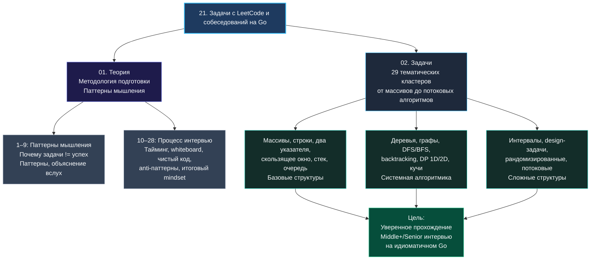

> *«Прежде чем бросаться писать код, убедитесь, что вы решаете правильную задачу. А затем решите её как можно проще».*  
> — Брайан Керниган

Добро пожаловать в раздел, который завершает фундаментальную подготовку к карьере Senior и Lead Go-инженера, — алгоритмические собеседования. Если предыдущие разделы книги знакомили нас с тем, «как работает Go под капотом», «как строить надёжные распределённые системы» и «как обеспечивать наблюдаемость в продакшене», то здесь мы разберём ключевой рубеж: **как успешно пройти фильтр технического найма в технологические компании первого эшелона**, оставаясь при этом вдумчивым, прагматичным и идиоматичным Go-разработчиком.

Многие инженеры относятся к платформам вроде LeetCode как к досадной повинности: механически заучивают чужие решения, «проглатывают» сотни однотипных задач и в итоге выгорают, получая отказ на первом же нестандартном вопросе. Мы пойдём принципиально другим путём. Этот раздел — не хаотичный сборник готовых ответов, а **целостная система алгоритмического мышления**, спроектированная специально для тех, кто пишет на Go и целится в высшую инженерную лигу.

## Почему алгоритмические собеседования актуальны для Go-разработчика

Go задумывался как предельно прагматичный системный язык. Его авторы сознательно отказались от многих академических излишеств: целое десятилетие язык обходился без пользовательских дженериков, стандартная библиотека ограничилась слайсами и мапами как единственными «сложными» встроенными коллекциями, а объектная модель была сведена к простым структурам и интерфейсам. 

Из-за этого у начинающих разработчиков нередко возникает опасная иллюзия: зачем учить алгоритмы, когда есть горутины, каналы и gRPC? Написал HTTP-обработчик, бросил в базу — и всё работает. Однако суровая реальность продакшена и технических интервью быстро развеивает этот миф:

- **Законы вычислительной сложности невозможно обойти синтаксическим сахаром.** Планировщик горутин и параллелизм не способны превратить алгоритм сложности $O(N^2)$ в $O(N \log N)$. Напротив, неэффективный алгоритм в конкурентной среде лишь быстрее утилизирует все ядра CPU и сожрёт память сервера. Системообразующие проекты на Go (Kubernetes, Docker, CockroachDB, Etcd) буквально сотканы из классических структур данных: деревьев поиска, кольцевых буферов, фильтров Блума, консистентного хэширования и алгоритмов консенсуса вроде Raft.
- **Собеседования уровня FAANG и BigTech не делают поблажек языку.** Претендуя на позицию Senior Software Engineer в международную компанию, вы получите ровно те же алгоритмические вызовы, что и кандидаты на C++, Java или Python. Но от Go-разработчика ждут не просто абстрактно работающего кода, а **зрелого инженерного решения**: чистого, лаконичного, лишённого скрытых аллокаций, учитывающего escape analysis компилятора и специфику сборщика мусора.
- **Инженерная зрелость — это выбор правильной структуры под нагрузкой.** Когда сервис выходит на уровень десятков и сотен тысяч RPS, разница между `[]int` и `map[int]struct{}`, между линейным сканированием короткого слайса в L1-кэше и хэш-таблицей в оперативной памяти становится вопросом стабильности всей системы. Умение видеть эти trade-offs и обосновывать их отличает Senior-инженера от рядового исполнителя.

## Архитектура раздела

Раздел логически разделен на две взаимосвязанные части: **Теоретический блок** (где мы сейчас находимся) и **Практические задачи**, сгруппированные по 29 тематическим кластерам.



**Теоретический блок (28 лекций)** формирует навыки, без которых даже 500 решённых задач рискуют остаться бесполезным грузом:
- Как декомпозировать незнакомую задачу и быстро распознать скрытый паттерн.
- Как думать вслух и выстраивать продуктивный инженерный диалог с интервьюером.
- Как не потерять контроль над временем и не паниковать у доски или в пустом текстовом редакторе.
- Какие типичные ловушки подстерегают кандидатов и почему идеальный код иногда приводит к отказу.

**Практический блок (29 кластеров, 218 задач)** охватывает весь спектр современных алгоритмических секций: от базовой работы с массивами и строками до сложного 2D динамического программирования, битовых трюков и потоковых структур данных. Каждая тема начинается с теоретического фундамента `1. Теория. <Тема>`, где мы препарируем паттерн с точки зрения Go.

> [!note] Полный цикл разбора каждой задачи
> Каждая практическая задача в этом разделе разбирается по строгому инженерному стандарту:
> **Условие → Наивный брутфорс → Выявление узких мест → Поиск инварианта и оптимизация → Идиоматичный Go-код → Анализ временной и пространственной сложности → Mechanical Sympathy (влияние на кэш CPU и GC).**

## Специфика Go на алгоритмическом интервью

Язык, на котором вы проходите интервью, накладывает глубокий отпечаток на тактику решения. Большинство кандидатов традиционно выбирают Python за лаконичность или C++/Java за колоссальное разнообразие готовых контейнеров в STL. Go занимает золотую середину, обладая уникальными козырями и специфическими ограничениями.

### Преимущества Go:
1. **Прозрачный и прямолинейный синтаксис.** В Go нет запутанных иерархий классов, неявных приведений типов, перегрузки операторов и скрытых исключений. Код на экране получается плоским, линейным и легко читаемым. Интервьюеру не нужно гадать, что скрывается за магическим вызовом библиотечного метода: логика лежит прямо перед глазами.
2. **Слайсы — идеальный швейцарский нож.** Большинство базовых структур (динамические массивы, стеки, очереди, деки и буферы) тривиально строятся поверх стандартного `[]T`. Не нужно помнить десятки разных сигнатур коллекций — достаточно виртуозно владеть срезами.
3. **Строгая культура кода.** Привычка к `go fmt` и аккуратному форматированию помогает писать визуально безупречный код даже на маркерной доске или в примитивном онлайн-блокноте вроде CoderPad.
4. **Малая константа выполнения.** Скомпилированный машинный код Go работает быстро. В алгоритмах, где асимптотика одинакова, решение на Go практически всегда уверенно проходит лимиты по времени без микрооптимизаций.

### Подводные камни и ограничения:
1. **Отсутствие встроенных сложных структур данных.** В стандартной библиотеке Go нет готового `TreeSet`, `TreeMap` или удобной очереди с приоритетами. Для кучи предусмотрен пакет `container/heap`, но он требует ручной реализации пяти методов интерфейса (`Len`, `Less`, `Swap`, `Push`, `Pop`). На собеседовании написание этого шаблона с нуля отнимает драгоценные минуты. Мы научим вас писать компактные идиоматичные обёртки буквально за 10–15 строк.
2. **Иммутабельность строк и ссылочная природа слайсов.** В Go строка — это неизменяемая последовательность байт. Любая модификация строки создает новый объект. Слайс же — это компактный заголовок (`SliceHeader`), ссылающийся на область памяти. Неосторожный срез может привести к утечке гигантского исходного массива или к непреднамеренной перезаписи соседних данных.

> [!warning] Ловушка / Gotcha: Скрытое удержание памяти срезами
> Рассмотрим классический фрагмент:
> ```go
> func extractPrefix(data []byte, n int) []byte {
>     return data[:n]
> }
> ```
> Если `data` — это массив на 100 мегабайт, полученный из сети или файла, а нам нужны только первые 16 байт заголовка, то возвращённый срез `data[:n]` продолжит удерживать в памяти **весь 100-мегабайтный массив**! Сборщик мусора Go не сможет освободить его, пока жив хотя бы один маленький срез.
> 
> На интервью Senior обязан сразу предложить безопасный вариант с явным копированием:
> ```go
> func extractPrefix(data []byte, n int) []byte {
>     result := make([]byte, n)
>     copy(result, data[:n])
>     return result
> }
> ```

## Mechanical Sympathy: Думаем о железе даже в алгоритмических задачах

Платформы автоматической проверки проверяют лишь прохождение тестов по времени и общему объёму RAM. Но когда ваш код читает живой Senior Go-разработчик, он оценивает ваше **механическое сочувствие к машине** (Mechanical Sympathy) — понимание того, как структуры языка ложатся на процессорные кэши, шину памяти и подсистемы ядра Linux.

- **Escape Analysis (Анализ побега):** Компилятор Go сам решает, разместить переменную на быстром стеке горутины или отправить её в управляемую кучу (heap). Если вы возвращаете указатель или слайс наружу — он «убегает» в кучу, создавая работу для GC. В задачах с ограниченным набором ключей (например, подсчёт частоты латинских букв) мы покажем, как использование фиксированных массивов `[26]int` вместо `map[byte]int` даёт zero-allocation решение, работающее целиком на стеке и в регистрах CPU.
- **Предвыделение памяти (Pre-allocation):** Вызов `append` при нехватке емкости слайса вынужден аллоцировать новый массив в куче с коэффициентом роста и копировать старые элементы. В циклах на $10^5$ элементов это может незаметно вызвать череду тяжелых пауз. Инициализация `make([]int, 0, capacity)` спасает сервис от всплесков латентности.
- **Локальность данных в кэше CPU (Cache Locality):** Доступ к элементам непрерывного среза последователен. Аппаратный префетчер (Hardware Prefetcher) процессора заранее подгружает 64-байтные кэш-линии из RAM в L1/L2 кэш. Напротив, обход узлов связного списка или частые поиски в хэш-таблице приводят к случайным скачкам по адресам памяти (pointer chasing) и постоянным промахам кэша (Cache Misses).

> [!tip] Вопрос с реального интервью (Senior Go, Highload Infrastructure)
> *«Вам нужно транспонировать матрицу размером $N \times M$. Как вы организуете структуры данных в Go для максимальной производительности?»*
> 
> Зрелый ответ кандидата должен включать:
> 1. **Отказ от джаггед-слайсов (`[][]int`):** Вызов `make([][]int, N)` с последующим `make([]int, M)` в цикле разбрасывает строки матрицы по разным адресам кучи, убивая кэш-локальность.
> 2. **Плоский непрерывный массив:** Выделение одного сплошного среза `make([]int, N*M)` с доступом по формуле `matrix[i*M + j]`. Это гарантирует непрерывность памяти и одну аллокацию вместо $N+1$.
> 3. **Блочное транспонирование (Tiling/Blocking):** Разбиение обхода на блоки размером с кэш-линию CPU (например, $8 \times 8$), чтобы чтение и запись одновременно попадали в L1-кэш процессора.

## Как эффективно построить подготовку

Не пытайтесь решать задачи хаотично или читать их как художественный роман. Раздел спроектирован как трёхступенчатая траектория:

1. **Освоение методологии мышления (01. Теория):**  
   Внимательно изучите теоретические лекции. Обратите пристальное внимание на:
   - Как мгновенно распознавать паттерны по формулировкам и ограничениям ([[4. Как распознавать паттерн в задаче]]).
   - Пошаговый алгоритм действий на интервью ([[5. Алгоритм решения задачи на интервью]]).
   - Искусство объяснения мыслей вслух ([[6. Как объяснять решение вслух]]).
   - Фатальные антипаттерны, которые губят даже сильных разработчиков ([[26. Антипаттерны. Как проваливают алгоритмические интервью]]).

2. **Кластерное погружение в практику (02. Задачи):**  
   Двигайтесь по кластерам последовательно: начните с простых структур («Массивы и строки», «Два указателя», «Скользящее окно»), затем переходите к системной алгоритмике («Деревья», «Графы», «Динамическое программирование») и завершайте сложными комплексными задачами. Каждый кластер предваряется лекцией `1. Теория. <Тема>`, настраивающей инженерный фокус.

3. **Боевое тестирование в условиях стресса:**  
   Периодически берите случайные задачи уровня Medium и Hard и решайте их строго на время (20–30 минут), без помощи автодополнения IDE, проговаривая логику вслух. Используйте практические рекомендации из статьи [[22. Mock интервью]].

> [!info] Системная связность
> В текстах задач вы регулярно встретите перекрестные ссылки на архитектурные разделы нашей энциклопедии — например, на [[01. Архитектура компьютера]] и [[07. Глубокий Go (Внутреннее устройство)]]. Это не случайность. Сила настоящего Senior-инженера проявляется именно тогда, когда абстрактный алгоритм соединяется с глубоким знанием операционной системы и рантайма языка.

## От зубрежки к инженерному мастерству

Главная цель этого раздела — не в том, чтобы вы запомнили правильные ответы к сотне типовых задач. Наша задача — перестроить ваш мыслительный аппарат так, чтобы перед лицом любой, даже самой замысловатой проблемы вы не терялись, а хладнокровно раскладывали её на элементарные кирпичики, находили инварианты и писали идиоматичный, надежный Go-код, который приятно показать коллегам и не страшно выкатить в прод.

В следующей лекции мы разберём, почему механическое решение задач на платформах само по себе не гарантирует успеха на техническом интервью, и что именно оценивают интервьюеры на самом деле: [[2. Почему решение задач не равно успеху на интервью]].