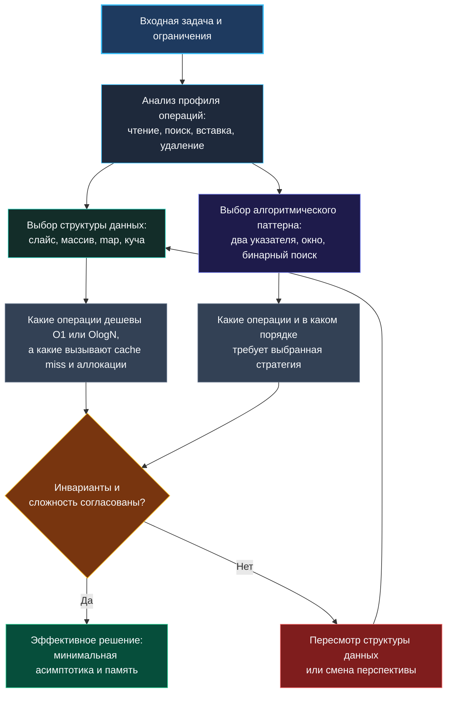

> *«Структуры данных важнее алгоритмов. Если вы правильно организовали данные, алгоритмы почти всегда очевидны».*  
> — Роб Пайк

В 1975 году Никлаус Вирт сформулировал афоризм, ставший названием его эпохальной книги: «Алгоритмы + структуры данных = программы». Спустя полвека, в мире высоконагруженных сервисов на Go, эта формула не просто актуальна — она приобрела физический смысл. Если мы выбираем структуру данных в отрыве от того, как рантайм Go и процессор оперируют памятью, мы рискуем превратить формально линейный алгоритм $O(N)$ в медлительную катастрофу с постоянными промахами мимо кэша и остановками сборщика мусора. И наоборот: понимание структуры входных данных позволяет свести нерешаемую «в лоб» задачу к паре элегантных операций над массивом.

На техническом собеседовании — особенно при претензии на уровень Senior или Lead Go Engineer — интервьюеры ищут именно этот двусторонний инженерный взгляд. Недостаточно просто помнить, что `map` в среднем даёт $O(1)$, а связный список — $O(N)$. Настоящий профессионал объяснит, почему простой проход по непрерывному слайсу на практике в разы обгоняет выборку из хэш-таблицы на сотне элементов, как 64-байтные кэш-линии процессора влияют на выбор алгоритма и почему аллокация в куче порой стоит дороже сотни простых вычислений.

Эта статья посвящена неразрывной симметрии между данными и алгоритмами, преломлённой через призму рантайма Go и реалии алгоритмических секций.

---

### Двойная спираль: алгоритм формирует данные, данные формируют алгоритм

Связь между алгоритмом и структурой данных напоминает двойную спираль ДНК. С одной стороны, организация данных диктует, какие операции нам доступны дешево ($O(1)$ или $O(\log N)$). С другой стороны, целевой алгоритм предъявляет жесткие требования к тому, как эти данные должны подаваться на вход: последовательно, с произвольным доступом, с сохранением порядка или с возможностью быстрого извлечения экстремума.



Рассмотрим классическую задачу: регулярная проверка присутствия элемента в коллекции.

1. **Неупорядоченный слайс (`[]int`):** линейный поиск $O(N)$.
2. **Хэш-таблица (`map[int]struct{}`):** амортизированный поиск за $O(1)$.
3. **Отсортированный слайс:** бинарный поиск за $O(\log N)$.

Но теория алгоритмов оперирует абстрактными «шагами», а реальный процессор оперирует тактами и байтами. Если в нашей коллекции всего 20–30 элементов, линейный поиск по непрерывному слайсу выполнится прямо в регистрах и кэше L1 (всего одна-две кэш-линии по 64 байта). Хэш-таблица же потребует вычисления хэша, поиска бакета и разыменования указателей, что может привести к промаху мимо кэша. В результате «медленный» $O(N)$ на малых данных оказывается быстрее «быстрого» $O(1)$. Senior-инженер всегда держит в голове этот контекст и готов объяснить выбор конкретной структуры исходя из ограничений задачи.

---

### Структуры данных как интерфейс к алгоритму

В языке Go нет избыточного изобилия коллекций standard library, как в Java или C++. У нас отсутствуют встроенные `TreeSet`, `Deque` или `LinkedHashMap`. Вместо этого Go предлагает компактный набор универсальных строительных блоков: слайс, массив фиксированного размера, map и канал. Сложные структуры собираются из этих базовых элементов вручную:

- **Стек (LIFO):** реализуется слайсом. Операции с концом массива (`append` и срез `s[:len(s)-1]`) работают за амортизированное $O(1)$ без перемещения памяти.
- **Очередь (FIFO):** наивный срез `s[1:]` приводит к утечке памяти в нижележащем массиве, поэтому для продакшена нужен кольцевой буфер на слайсе, а для интервью — слайс с пониманием trade-off.
- **Двусторонняя очередь (Deque):** кольцевой буфер на слайсе или слайс индексов (для монотонных очередей).
- **Множество (Set):** `map[T]struct{}` — пустая структура `struct{}` занимает ровно 0 байт памяти.
- **Приоритетная очередь (Heap):** пакет `container/heap`, работающий поверх обычного среза `[]T`.

Знание этих отображений позволяет на собеседовании мгновенно транслировать требования алгоритма в лаконичный идиоматичный Go-код.

> [!NOTE] Под капотом: Идиоматичный стек на слайсе
> Операции со стеком в Go предельно естественны:
> ```go
> stack = append(stack, val)           // Push: амортизированное O(1)
> top := stack[len(stack)-1]           // Peek: O(1)
> stack = stack[:len(stack)-1]         // Pop: O(1)
> ```
> Если ёмкость (`cap`) слайса была заранее выделена через `make([]int, 0, n)`, за всё время работы алгоритма не произойдёт ни единой аллокации в куче! Срез просто перемещает внутренний маркер длины (`len`) в заголовке слайса.

---

### Механическая симпатия: рантайм Go и процессор

Понимание анатомии структур данных Go превращает теоретически правильное решение в высокоэффективный инженерный артефакт (подробнее см. [[07. Глубокий Go (Внутреннее устройство)]]).

#### 1. Слайс (`slice`)
Заголовок слайса (`reflect.SliceHeader`) занимает всего 24 байта на 64-битной архитектуре: указатель на массив (8 байт), длина `len` (8 байт) и вместимость `cap` (8 байт).
Нижележащий массив расположен в памяти строго непрерывным блоком. Это идеальный сценарий для аппаратного предвыборщика процессора (Hardware Prefetcher): при последовательном чтении процессор заранее подтягивает следующие 64-байтные строки в кэш L1/L2. Паттерны «два указателя» и «скользящее окно» на слайсах показывают предельную пропускную способность шины памяти.

#### 2. Хэш-таблица (`map`)
Под капотом `map` в Go (структура `hmap`) устроена как массив бакетов `bmap`, каждый из которых вмещает до 8 пар ключ-значение (а в Go 1.24+ внедряется архитектура Swiss Tables с контрольными байтами для ускоренного SIMD-поиска). Доступ по ключу неизбежно включает вычисление хэша, битовую маску бакета и возможное следование по указателям цепочки переполнения (`overflow buckets`). Это разрушает локальность кэша (pointer chasing). Кроме того, динамический рост map требует эвакуации бакетов. Если ключи представляют собой ограниченный набор целых чисел или символов ASCII, массив прямого доступа `[N]int` выигрывает у `map` с колоссальным отрывом.

#### 3. Строки (`string`)
Строка в Go — неизменяемый заголовок из 16 байт (указатель на байты и длина). Любая конвертация `[]byte(s)` или `string(b)` по умолчанию аллоцирует новый кусок памяти в куче и копирует байты (за исключением некоторых оптимизаций компилятора в заголовках `for` и map-индексах). Если алгоритм часто модифицирует символы, работайте со слайсом байт `[]byte` или слайсом рун `[]rune`, собирая результат в самом конце через `strings.Builder`.

---

### Таблица связи: структура данных → паттерны → Go-реализация

| Структура данных | Подходящие паттерны | Идиоматичная Go-реализация | Механическая симпатия (Hardware Context) |
|---|---|---|---|
| **Массив фикс. размера** | Частотный анализ (ASCII), скользящее окно, бинарный поиск | `var count [128]int` или `[26]int` | Располагается на стеке, 0 аллокаций, идеальная кэш-локальность, сравнение через `==` |
| **Слайс (`[]T`)** | Два указателя, окно, стек, Kadane, бинарный поиск | `s := make([]int, 0, n)` | Непрерывная память, аппаратный prefetching, заголовок 24 байта; предвыделение `cap` исключает реаллокации |
| **Хэш-таблица (`map[K]V`)** | Поиск дополнений (Two Sum), мемоизация DP, подсчет частот | `m := make(map[K]V, n)` | Pointer chasing, накладные расходы на бакеты; использовать `struct{}` для Set; всегда предвыделять `n` |
| **Куча (`container/heap`)** | Top K элементов, слияние K списков, медиана потока | `type Heap []int` + реализация 5 методов | Работает поверх слайса `[]T`; просеивание (sift-up/down) обращается к индексам без лишних аллокаций |
| **Двусвязный список** | LRU Cache, LFU Cache | Кастомная структура `type Node struct { prev, next *Node; key, val int }` | Стандартный `container/list` использует `Value any`, вызывая boxing и аллокации. Кастомный список строго типизирован и быстр |
| **Каналы (`chan T`)** | Pipeline, веерная обработка (Fan-out/Fan-in) | `ch := make(chan T, bufSize)` | В чистых алгоритмах редки; блокировки переключают горутины планировщиком Go (M/P) |

> [!WARNING] Ловушка / Gotcha: Реализация интерфейса `heap.Interface`
> Пакет `container/heap` требует пяти методов: `Len()`, `Less(i, j int) bool`, `Swap(i, j int)`, `Push(x any)`, `Pop() any`.
> Обратите внимание: методы `Push` и `Pop` обязаны иметь **pointer receiver** (`*IntHeap`), так как они изменяют длину слайса:
> ```go
> func (h *IntHeap) Push(x any) {
>     *h = append(*h, x.(int))
> }
> func (h *IntHeap) Pop() any {
>     old := *h
>     n := len(old)
>     x := old[n-1]
>     *h = old[:n-1]
>     return x
> }
> ```
> Если объявить их по значению (`(h IntHeap)`), изменения среза не сохранятся, и вызов `heap.Push` приведет к трудноуловимому багу!

---

### Наглядный пример: как структура данных меняет производительность

Рассмотрим классическую задачу: найти первый неповторяющийся символ в строке (LeetCode 387).

#### Вариант 1: Слишком наивный $O(N^2)$
Для каждого символа сканируем всю строку заново. Вложенные циклы, катастрофа при $N = 10^5$.

#### Вариант 2: Стандартный $O(N)$ с `map[rune]int`
Проходим строку, складываем частоты в `map`, затем проходим снова. Время $O(N)$, память $O(K)$. Но на каждой итерации процессор вычисляет хэш и бегает по бакетам `hmap`.

#### Вариант 3: Оптимальный Go-стиль с `[26]int`
Если условие гарантирует символы `'a'-'z'`, мы создаем простой массив на стеке:

```go
func firstUniqChar(s string) int {
    var count [26]int // Выделяется на стеке, 0 байт в куче
    for i := 0; i < len(s); i++ {
        count[s[i]-'a']++
    }
    for i := 0; i < len(s); i++ {
        if count[s[i]-'a'] == 1 {
            return i
        }
    }
    return -1
}
```

**Инженерный профит:**
- Массив `[26]int` занимает всего 208 байт ($26 \times 8$).
- Он целиком остается на стеке текущей горутины, исключая работу сборщика мусора.
- Обращение по индексу `s[i]-'a'` компилируется в одну инструкцию смещения адреса (LEA на x86-64).
- Решение работает в 5–10 раз быстрее хэш-таблицы и демонстрирует глубокую инженерную зрелость.

---

### Композиция структур данных: LRU Cache

Сложные задачи уровня Medium и Hard редко решаются одной структурой. Классический образец композиции — **LRU Cache** (LeetCode 146).
Здесь требуются взаимоисключающие свойства:
1. Поиск элемента по ключу за $O(1)$ $\to$ хэш-таблица `map`.
2. Вставка и удаление из произвольного места за $O(1)$ для поддержания порядка устаревания $\to$ двусвязный список.

```go
type node struct {
    key, val   int
    prev, next *node
}

type LRUCache struct {
    cap   int
    items map[int]*node
    head  *node // фиктивный головной узел (самый свежий)
    tail  *node // фиктивный хвостовой узел (кандидат на удаление)
}

func Constructor(capacity int) LRUCache {
    head := &node{}
    tail := &node{}
    head.next = tail
    tail.prev = head
    return LRUCache{
        cap:   capacity,
        items: make(map[int]*node, capacity),
        head:  head,
        tail:  tail,
    }
}
```

> [!TIP] Вопрос на собеседовании: «Почему не стандартный `container/list`?»
> **Ответ Senior-инженера:**  
> «В стандартном пакете `container/list` поле элемента объявлено как `Value any`. Каждое добавление примитивного типа (например, `int`) в `list.Element` требует упаковки в интерфейс (boxing), что приводит к дополнительной аллокации в куче и накладным расходам на type assertion при извлечении. Собственный двусвязный список со строго типизированными полями `key, val int` устраняет эти аллокации, гарантирует предсказуемую раскладку в памяти и снижает давление на GC».

---

### Резюме для интервью

1. **Данные диктуют алгоритм:** Всегда начинайте разбор задачи с инвентаризации требуемых операций над данными (поиск по ключу, нахождение максимума, итерация по порядку).
2. **Предпочитайте непрерывную память:** Слайсы и плоские массивы работают быстрее хэш-таблиц из-за кэш-локальности и отсутствия pointer chasing.
3. **Предвыделяйте память:** Конструкция `make([]T, 0, n)` или `make(map[K]V, n)` избавляет от скрытых реаллокаций и фрагментации кучи.
4. **Учитывайте особенности Go:** Знайте размеры базовых типов, помните о поведении заголовков слайсов и избегайте неоправданных преобразований `string` $\leftrightarrow$ `[]byte`.

В следующей статье мы подробно рассмотрим одну из важнейших развилок при решении задач оптимизации: как безошибочно выбирать между жадным подходом и динамическим программированием. [[11. Когда выбирать greedy, а когда dynamic programming]]