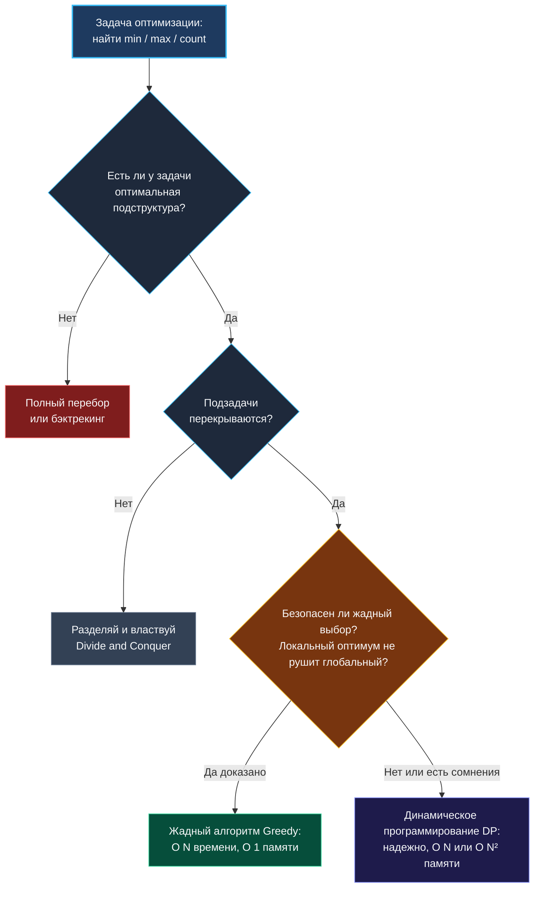
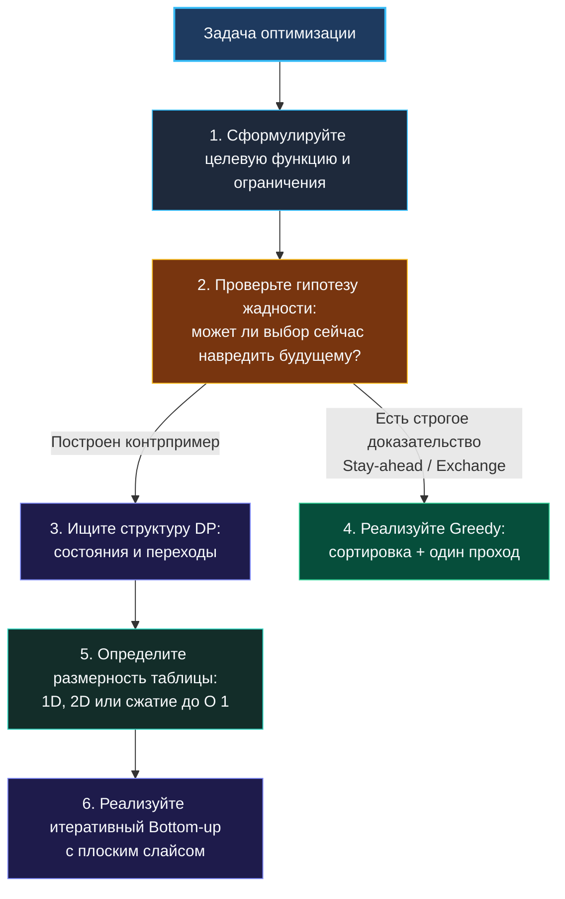

> *«Динамическое программирование — это не более чем систематический перебор с хорошей памятью, предотвращающей повторные блуждания по одним и тем же тропам».*  
> — Ричард Беллман

Среди всех алгоритмических развилок, встающих перед кандидатом на собеседовании, выбор между жадным алгоритмом (Greedy) и динамическим программированием (Dynamic Programming, DP) — пожалуй, самая драматичная. Внешне задачи формулируются абсолютно одинаково: «найти минимум», «найти максимум», «посчитать количество способов». Но цена ошибки здесь максимальна:
- Если вы примените жадный алгоритм там, где требовалось динамическое программирование, код выдаст правдоподобный, но в корне неверный ответ на первой же скрытой краевой проверке.
- Если вы построите тяжеловесную DP-таблицу для задачи, решаемой простым жадным проходом за один цикл, вы рискуете исчерпать бюджет памяти и получить вердикт Time Limit Exceeded или Memory Limit Exceeded.

Senior-инженер отличается от новичка тем, что не пытается гадать или вспоминать: «Так, задача про прыжки — кажется, я видел её в секции Greedy?». Он владеет строгим ментальным фреймворком доказательства и проверки инвариантов.

---

### Суть различия: смелость против предусмотрительности

- **Жадный алгоритм (Greedy)** принимает последовательность **локально оптимальных** решений. На каждом шаге он делает выбор, который кажется наилучшим «здесь и сейчас», и этот выбор окончателен — алгоритм никогда не пересматривает свои прошлые решения и не заглядывает в далекое будущее. Жадный подход феноменально быстр ($O(N)$ или $O(N \log N)$), требует минимум памяти ($O(1)$) и тривиален в коде. Но он работает только тогда, когда задача обладает свойством **безопасного жадного выбора** (Greedy-choice property).
- **Динамическое программирование (DP)** исповедует принцип тотальной предусмотрительности. Оно разбивает задачу на **перекрывающиеся подзадачи**, находит оптимум для каждой из них ровно один раз, бережно сохраняет результат в таблице (табуляция или мемоизация) и строит глобальное решение из кирпичиков меньшего размера. DP универсальнее, но платит за это расходом памяти и процессорного времени.



**Главный вопрос-лакмус на собеседовании:**  
*«Может ли локально наилучший выбор на текущем шаге заблокировать доступ к глобально оптимальному решению в будущем?»*  
- Если **да** — жадность неприменима; необходимо рассматривать все альтернативы через DP.
- Если **нет** — жадный алгоритм предпочтителен.

---

### Как доказать применимость Greedy: аргумент обмена (Exchange Argument)

Жадный алгоритм нельзя применять «по наитию». Если вы просто скажете интервьюеру: «Очевидно, возьмем самый большой элемент», опытный собеседник тут же подкинет контрпример, разрушающий вашу логику.

Самый практичный инструмент доказательства на техническом интервью — **аргумент обмена (Stay-ahead / Exchange Argument)**:
1. Предположим, что существует некое неизвестное гипотетическое оптимальное решение $OPT$.
2. Пусть на первом шаге $OPT$ делает выбор $A$, а наш жадный алгоритм выбирает $B$ ($A \neq B$).
3. Покажем, что мы можем заменить выбор $A$ на $B$, не ухудшив качества итогового решения: $Cost(OPT') \le Cost(OPT)$.
4. По индукции делаем вывод: последовательность жадных выборов ничем не уступает $OPT$, а значит, жадное решение само по себе оптимально.

#### Классический пример: Интервальное планирование (Interval Scheduling)
Даны $N$ отрезков времени `[start, end]`. Нужно выбрать максимальное число непересекающихся отрезков.
- **Жадная эвристика:** всегда брать отрезок, который **завершается раньше всех** (`min(end)`).
- **Обоснование через обмен:** Если оптимальное решение $OPT$ первым взяло отрезок $X$, а жадный алгоритм взял отрезок $Y$, у которого `end(Y) <= end(X)`, то замена $X$ на $Y$ оставляет справа как минимум столько же (или даже больше) свободного времени. Оставшиеся интервалы из $OPT$ не могут конфликтовать с $Y$ сильнее, чем конфликтовали с $X$. Значит, жадный выбор не вредит будущему.

---

### Как распознать необходимость DP: два золотых признака

Динамическое программирование строго применимо, когда выполняются два фундаментальных свойства:

1. **Оптимальная подструктура (Optimal Substructure):**  
   Оптимальное решение исходной задачи составляется из оптимальных решений ее подзадач. Кратчайший маршрут из города А в город С, проходящий через город В, обязательно содержит в себе кратчайший маршрут из А в В.
2. **Перекрывающиеся подзадачи (Overlapping Subproblems):**  
   При наивном рекурсивном спуске одни и те же подзадачи вычисляются многократно. Хрестоматийный пример — вычисление чисел Фибоначчи: дерево рекурсии растет как $O(2^N)$, многократно пересчитывая $F(3)$, $F(2)$ и $F(1)$.

> [!TIP] Вопрос на собеседовании: Рюкзак 0/1 против Дробного рюкзака
> **Вопрос:** «Почему задачу о непрерывном (дробном) рюкзаке решают жадным алгоритмом, а дискретный рюкзак 0/1 требует динамического программирования?»  
> **Ответ:** «В дробном рюкзаке мы можем отрезать любую долю предмета. Поэтому жадный выбор предмета с максимальной удельной стоимостью (цена/вес) абсолютно безопасен: если предмет не помещается целиком, мы забираем доступную часть и гарантированно утилизируем емкость с максимальной отдачей. В задаче 0/1 предмет берется либо целиком, либо не берется вовсе. Взяв самый дорогой предмет, мы рискуем занять критический объем и оставить неиспользованную „пустоту“, куда не поместится более выгодная комбинация из двух меньших предметов. Локальный выбор рушит глобальный оптимум $\to$ требуется DP».

---

### Сравнительный анализ на канонических задачах

Разберем три показательные пары задач, чтобы закрепить навык мгновенной классификации.

#### Пара 1: Jump Game (LeetCode 55) vs Jump Game II (LeetCode 45)
- **Jump Game I (достижим ли конец массива?):**  
  Жадный подход: поддерживаем переменную `maxReach` (максимальный индекс, куда можно дотянуться). На каждом шаге $i \le maxReach$ мы обновляем `maxReach = max(maxReach, i + nums[i])`. Локальный выбор расширяет горизонт досягаемости, не закрывая никаких возможностей. Сложность: $O(N)$ по времени, $O(1)$ по памяти.
- **Jump Game II (минимальное число прыжков):**  
  Здесь тоже работает хитрый жадный алгоритм (BFS-подобный greedy: прыгаем на границу текущего охвата, увеличивая счетчик шагов). Но если бы условие спросило *«Сколькими способами можно допрыгнуть до конца?»*, жадность моментально капитулирует перед одномерным DP.

#### Пара 2: Размен монет (Coin Change — LeetCode 322)
Даны номиналы монет `coins = [1, 3, 4]`, нужно набрать сумму `6` минимальным числом монет.
- Попробуем жадный выбор: берем самую крупную монету `4`. Остается набрать `2`. Берем монеты `1 + 1`. Итого: **3 монеты** (`4 + 1 + 1`).
- Оптимальный ответ: **2 монеты** (`3 + 3`).
- **Вывод:** Жадный выбор монеты максимального номинала завел алгоритм в неоптимальный тупик. Для произвольной системы номиналов задача требует DP! (Жадный выбор работает только для так называемых *канонических монетных систем*, таких как современные рубли, доллары или евро).

#### Пара 3: Непересекающиеся интервалы vs Взвешенные интервалы
- **Interval Scheduling:** отрезки равноправны, максимизируем количество $\to$ Greedy по времени окончания.
- **Weighted Interval Scheduling:** у каждого отрезка есть вес (ценность), максимизируем суммарный вес $\to$ жадный выбор по `вес/длина` ломается на контрпримерах $\to$ требуется DP: `dp[i] = max(dp[i-1], weight[i] + dp[prevNonConflicting[i]])`.

---

### Механическая симпатия: Go, память и кэши процессора

Выбор между Greedy и DP определяет профиль взаимодействия приложения с памятью и сборщиком мусора Go.

#### Жадный алгоритм в Go
- Практически всегда укладывается в $O(1)$ дополнительной памяти (несколько скалярных переменных на стеке: `maxReach`, `end`, `count`).
- Если требуется предварительная сортировка: `slices.Sort` (или `sort.Slice`) работает in-place над непрерывным слайсом, не создавая мусора в куче.
- Отсутствие рекурсии $\to$ предсказуемый стек горутины, нулевая нагрузка на GC.

#### Динамическое программирование в Go
- **Табуляция (Bottom-up) против Мемоизации (Top-down):**  
  Многие кандидаты пишут рекурсивный DP с мемоизацией в `map[int]int`. В Go это грубая инженерная ошибка:
  - Каждый доступ к `map` — это вычисление хэша, битовые маски и pointer chasing по бакетам `hmap`.
  - Записи в `map` порождают аллокации в куче и мусор для GC.
  - Глубокая рекурсия (глубина $10^4-10^5$) заставляет рантайм Go многократно расширять сегментированный стек горутины (stack copying), перемещая стековые кадры в новые области памяти.
- **Идиоматичный Bottom-up с плоским слайсом:**  
  Всегда предпочитайте итеративную табуляцию с предварительно аллоцированным слайсом: `dp := make([]int, n+1)`. Это ровно одна непрерывная аллокация, идеальный аппаратный prefetching и отсутствие вызовов функций.

```go
// Идиоматичный Bottom-up DP для задачи Coin Change (LeetCode 322)
func coinChange(coins []int, amount int) int {
    // dp[i] — минимальное количество монет для суммы i
    dp := make([]int, amount+1)
    
    // Инициализируем недостижимым значением
    for i := 1; i <= amount; i++ {
        dp[i] = amount + 1
    }
    dp[0] = 0 // Базовый случай

    for i := 1; i <= amount; i++ {
        for _, c := range coins {
            if c <= i {
                if dp[i-c]+1 < dp[i] {
                    dp[i] = dp[i-c] + 1
                }
            }
        }
    }

    if dp[amount] > amount {
        return -1
    }
    return dp[amount]
}
```

> [!NOTE] Под капотом: Двумерные DP-таблицы без лишних аллокаций
> Создание классической матрицы `dp := make([][]int, n)` с последующим выделением строк в цикле `for i := range dp { dp[i] = make([]int, m) }` создает $N+1$ независимых аллокаций в куче! Это фрагментирует память и разрушает пространственную локальность.
> 
> Senior-разработчик назовет альтернативу:
> 1. Выделить плоский одномерный слайс `flat := make([]int, n*m)` и адресовать ячейки по формуле `flat[i*m + j]`.
> 2. Либо использовать технику оптимизации памяти до двух строк (`prev` и `curr` размером $O(M)$), если переход зависит только от предыдущей строки.

---

### Пошаговый чек-лист выбора на интервью



1. **Сформулируйте выбор:** Что именно мы выбираем на каждом шаге?
2. **Проверьте жадность на контрпримерах:** Попробуйте мысленно сломать жадную эвристику на нестандартных входных данных (например, монеты `[1, 3, 4]`, интервалы с разными весами).
3. **Обоснуйте применимость:** Если жадность верна — приведите краткий аргумент обмена. Если нет — покажите интервьюеру контрпример: *«Жадный выбор здесь брать нельзя, потому что...»*.
4. **Спроектируйте состояние DP:** `dp[i]` — что означает это число? Каковы базовые случаи и правила переходов?
5. **Оптимизируйте память:** Можно ли сократить размер таблицы с $O(N^2)$ до $O(N)$ или с $O(N)$ до $O(1)$?

В следующей статье мы перейдем к задачам уровня Hard, где одного инструмента недостаточно, и научимся виртуозно комбинировать паттерны в единое гармоничное решение. [[12. Как комбинировать алгоритмические паттерны]]