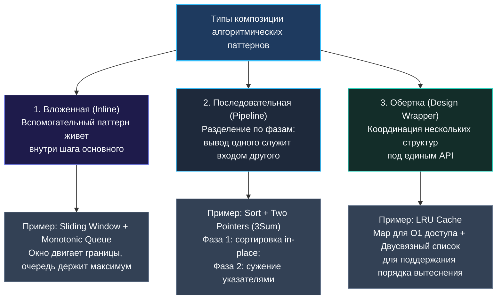

> *«Сложные системы не рождаются сложными. Они возникают в результате удачного соединения простых, надежных и досконально понятных деталей».*  
> — Брайан Керниган

В предыдущих главах мы с вами разложили по полочкам основные алгоритмические инструменты: от скользящего окна и двух указателей до поиска в ширину и динамического программирования. В простых учебных задачах каждый из этих паттернов работает как самостоятельный инструмент. Но реальные задачи уровней Medium и Hard на собеседованиях в бигтех (и уж тем более нетривиальные инженерные проблемы в бэкенд-разработке) практически никогда не укладываются в рамки одного изолированного приема.

Они требуют **композиции**: слаженного взаимодействия двух или трех паттернов, работающих как шестерни в едином механизме. Умение декомпозировать сложную формулировку на базовые блоки и элегантно соединить их в коде на Go — это главный признак перехода от уровня Middle к зрелому Senior.

---

### Почему одиночных паттернов недостаточно

Алгоритмический паттерн — это фундаментальный каркас для решения определенного класса задач. Однако в задачах повышенной сложности требования пересекаются:
- Нужно поддерживать непрерывный диапазон элементов (скользящее окно), но при этом мгновенно извлекать текущий максимум внутри этого окна (монотонная очередь или дерево отрезков).
- Нужно обойти граф или дерево (BFS/DFS), но на каждом шаге выбирать ребро с наивысшим приоритетом (приоритетная очередь / куча).
- Нужно генерировать комбинации (бэктрекинг), но избегать повторного прохождения одинаковых поддеревьев (мемоизация / DP).

В таких сценариях паттерны распределяют между собой роли: один управляет ритмом итераций и границами обхода, второй поддерживает инварианты вспомогательной структуры данных, а третий кэширует промежуточные состояния.

---

### Три архитектурных типа композиции паттернов

Анализируя реальные задачи, можно выделить три устойчивых способа соединения алгоритмических шаблонов.



#### 1. Вложенная композиция (Inline Composition)
Один паттерн встроен непосредственно в шаг итерации другого.  
- **Sliding Window + Monotonic Queue:** Окно двигает указатели `left` и `right`, а монотонная очередь на каждом шаге отсекает неоптимальные элементы, предоставляя максимум за амортизированное $O(1)$.
- **Sliding Window + Frequency Array:** Скользящее окно управляет диапазоном подстроки, а частотный массив на стеке дает моментальную проверку валидности текущего окна.

#### 2. Последовательная композиция (Pipeline / Sequential)
Задача естественным образом распадается на независимые последовательные фазы:
- **3Sum / Merge Intervals:** На первом этапе мы сортируем массив за $O(N \log N)$, создавая строгий инвариант порядка. На втором этапе запускаем два указателя или жадное слияние, работающее за $O(N)$.
- **Top K Frequent Elements:** Сначала формируем частотную карту за $O(N)$, затем передаем ее в приоритетную кучу размера $K$ (или запускаем QuickSelect).

#### 3. Архитектурная обертка (Design Wrapper)
Один паттерн или координатор управляет жизненным циклом двух независимых структур данных.  
Классика системного дизайна — **LRU Cache (LeetCode 146)** и **LFU Cache (LeetCode 460)**. Здесь мы объединяем быстрый доступ через хэш-таблицу с мгновенной перелинковкой узлов связного списка.

---

### Пошаговая методика синтеза решения

Когда вы сталкиваетесь с задачей, где ни один стандартный прием не дает оптимального времени, действуйте по четкому алгоритму:

1. **Определите каркасный паттерн:** Что является скелетом решения? Обход графа, перебор подмножеств или движение окна по массиву?
2. **Изолируйте узкое место шага:** Какая операция внутри основного цикла является самой дорогой? Линейный поиск максимума ($O(K)$)? Проверка вхождения ($O(N)$)?
3. **Подберите специализированную структуру:** Чем заменить дорогую операцию? Монотонным стеком? Хэш-массивом? Кучей?
4. **Согласуйте инварианты:** Убедитесь, что модификация данных вспомогательным паттерном не ломает корректность основного.
5. **Оцените итоговую память и время:** Нет ли здесь скрытых аллокаций? Не увеличилась ли пространственная сложность?

---

### Разбор эталонных решений на Go

#### Пример 1: Sliding Window Maximum (LeetCode 239)
**Композиция:** Скользящее окно + Монотонная двусторонняя очередь (Deque).

```go
func maxSlidingWindow(nums []int, k int) []int {
    if len(nums) == 0 || k <= 0 {
        return nil
    }
    
    // Предвыделяем емкость для итогового слайса
    result := make([]int, 0, len(nums)-k+1)
    
    // deque хранит индексы элементов; значения nums по индексам строго убывают!
    deque := make([]int, 0, k)

    for i, v := range nums {
        // 1. Инвариант окна: удаляем элементы, вышедшие за левую границу [i-k+1, i]
        if len(deque) > 0 && deque[0] < i-k+1 {
            deque = deque[1:] // Сдвиг заголовка слайса
        }

        // 2. Инвариант монотонности: выталкиваем с конца все элементы, которые <= текущего
        for len(deque) > 0 && nums[deque[len(deque)-1]] <= v {
            deque = deque[:len(deque)-1]
        }
        deque = append(deque, i)

        // 3. Фиксация результата: когда первое окно полностью сформировано
        if i >= k-1 {
            result = append(result, nums[deque[0]])
        }
    }

    return result
}
```

> [!NOTE] Механическая симпатия: Слайс как легковесный Deque
> Обратите внимание: `deque` оперирует исключительно индексами в непрерывном массиве памяти. Срез `deque[1:]` для удаления головы и `deque[:len(deque)-1]` для удаления хвоста — это манипуляции со счетчиками `len` и указателем в 24-байтном заголовке слайса. Никаких выделений памяти в куче внутри цикла не происходит!

---

#### Пример 2: LRU Cache (LeetCode 146)
**Композиция:** Хэш-таблица (`map[int]*node`) + Двусвязный список с фиктивными узлами.

```go
type node struct {
    key, value int
    prev, next *node
}

type LRUCache struct {
    capacity int
    cache    map[int]*node
    head     *node // Фиктивный головной узел (наиболее свежие)
    tail     *node // Фиктивный хвостовой узел (кандидаты на вытеснение)
}

func Constructor(capacity int) LRUCache {
    head := &node{}
    tail := &node{}
    head.next = tail
    tail.prev = head
    return LRUCache{
        capacity: capacity,
        cache:    make(map[int]*node, capacity),
        head:     head,
        tail:     tail,
    }
}

func (c *LRUCache) Get(key int) int {
    if n, ok := c.cache[key]; ok {
        c.moveToHead(n)
        return n.value
    }
    return -1
}

func (c *LRUCache) Put(key int, value int) {
    if n, ok := c.cache[key]; ok {
        n.value = value
        c.moveToHead(n)
        return
    }

    newNode := &node{key: key, value: value}
    c.cache[key] = newNode
    c.addToHead(newNode)

    if len(c.cache) > c.capacity {
        removed := c.removeTail()
        delete(c.cache, removed.key)
    }
}

func (c *LRUCache) addToHead(n *node) {
    n.next = c.head.next
    n.prev = c.head
    c.head.next.prev = n
    c.head.next = n
}

func (c *LRUCache) removeNode(n *node) {
    n.prev.next = n.next
    n.next.prev = n.prev
}

func (c *LRUCache) moveToHead(n *node) {
    c.removeNode(n)
    c.addToHead(n)
}

func (c *LRUCache) removeTail() *node {
    res := c.tail.prev
    c.removeNode(res)
    return res
}
```

> [!TIP] Зачем фиктивные head и tail?
> Использование sentinel-узлов (фиктивных головы и хвоста) — классический прием профессионального программирования на C и Go. Он полностью устраняет специальные проверки `if head == nil` или `if n.prev == nil`, превращая вставку и удаление из связного списка в 4 безусловные инструкции присваивания указателей.

---

#### Пример 3: Course Schedule (LeetCode 207)
**Композиция:** Представление графа списками смежности (`[][]int`) + Поиск циклов в глубину (DFS с трехцветной раскраской состояний).

```go
func canFinish(numCourses int, prerequisites [][]int) bool {
    // 1. Строим граф: слайс срезов смежности
    graph := make([][]int, numCourses)
    for _, edge := range prerequisites {
        course, prereq := edge[0], edge[1]
        graph[prereq] = append(graph[prereq], course)
    }

    // Состояния вершин: 0 = unvisited, 1 = visiting (в текущем стеке), 2 = visited
    state := make([]int, numCourses)

    var hasCycle func(curr int) bool
    hasCycle = func(curr int) bool {
        if state[curr] == 1 { // Обнаружено обратное ребро (Back-edge) -> цикл!
            return true
        }
        if state[curr] == 2 { // Вершина и ее подграф уже полностью исследованы
            return false
        }

        state[curr] = 1 // Входим в стек вызовов
        for _, next := range graph[curr] {
            if hasCycle(next) {
                return true
            }
        }
        state[curr] = 2 // Выходим из стека вызовов, цикл не найден
        return false
    }

    // Проверяем каждую компоненту связности
    for i := 0; i < numCourses; i++ {
        if state[i] == 0 {
            if hasCycle(i) {
                return false
            }
        }
    }

    return true
}
```

---

### Принципы надежной композиции для собеседования

1. **Не усложняйте без необходимости:** Применяйте композицию только тогда, когда одиночный паттерн упирается в недопустимую временную или пространственную сложность (например, шаг внутри окна занимает $O(K)$, а нужен за $O(1)$).
2. **Следите за целостностью инвариантов:** Взаимодействие структур не должно приводить к рассинхронизации. Если элемент удаляется из списка в LRU-кэше, он обязан немедленно удаляться из хэш-таблицы.
3. **Озвучивайте архитектурную связку вслух:**  
   *«Для этой задачи я предлагаю использовать скользящее окно, чтобы отслеживать подстроку, объединенное с монотонной очередью на слайсе, чтобы поддерживать экстремум окна за O(1). Обе структуры отлично лягут на непрерывную память без лишних аллокаций».*

В следующей статье мы разберем нестандартные сценарии: что делать, когда условие задачи маскирует суть и ни один знакомый паттерн не ложится на решение с первого взгляда. [[13. Когда решение задачи не очевидно]]